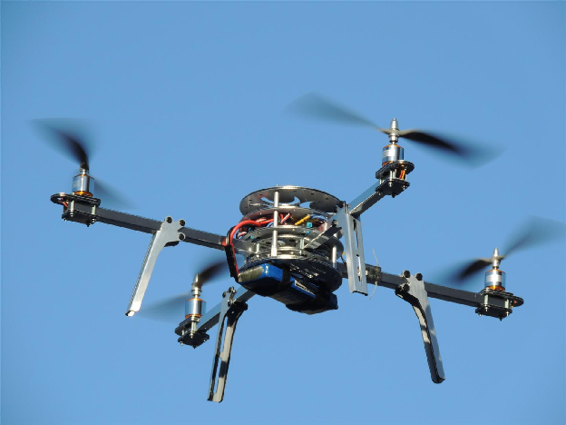
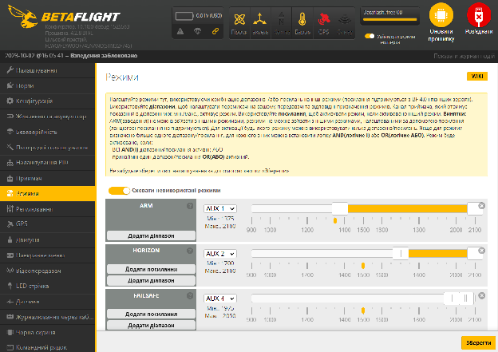

Стисле посилання на цей переклад: [https://bit.ly/LiangAcroMode-vs-SelfLevelMode](https://bit.ly/LiangAcroMode-vs-SelfLevelMode)   

| 🫂 | Нижче вичитаний людьми машинний український переклад оригіналу. Для [VictoryDrones](https://www.victory-drones.com/) переклад вичитали: Tailor, Samsonovych. Хочете покращити переклад чи знайшли помилку? — Лишіть коментар (Ctrl+Alt+M або «Меню» \> «Вставка» \> «Коментар»). Ми теж живі люди (як і ви) і робимо помилки. Роботи їх, до речі, також роблять 😉 |
| :---: | :---- |

# Режим Acro проти режиму самовирівнювання (Self-Level)

26 грудня 2017 року

Коли справа доходить до польоту на мультикоптерах, зазвичай ми використовуємо два основних режими польоту. Один — **режим Acro**, а інший — **режим самовирівнювання (Self-level)**.

*Деякі посилання на цій сторінці є партнерськими. Я отримую комісію (без додаткових витрат для вас), якщо ви робите покупку після натискання одного з цих партнерських посилань. Це допомагає підтримувати безкоштовний вміст для спільноти на цьому веб\-сайті. Будь ласка, прочитайте нашу [Політику партнерських посилань](https://oscarliang.com/affiliate-program-policy/) для отримання додаткової інформації.*

# Зміст

[Що таке режим самовирівнювання?](#що-таке-режим-самовирівнювання?)

[Режим Angle / «Кут»](#режим-angle-/-«кут»)

[Режим Horizon / «Горизонт»](#режим-horizon-/-«горизонт»)

[Що таке режим Acro?](#що-таке-режим-acro?)

[Чому треба літати в режимі Acro?](#чому-треба-літати-в-режимі-acro?)

[Отже, як мені зависати?](#отже,-як-мені-зависати?)

[Скільки часу потрібно для вивчення режиму Rate / Acro](#скільки-часу-потрібно-для-вивчення-режиму-rate-/-acro)

[Польоти в режимі Line of Sight (прямої видимості)](#польоти-в-rate/acro-режимі-без-окулярів)

[Як увімкнути режим Acro у Betaflight?](#як-увімкнути-режим-acro-у-betaflight?)

[Історія редагування](#історія-редагування)

# 

# **Що таке режим самовирівнювання?** {#що-таке-режим-самовирівнювання?}

У режимі самовирівнювання, коли ви відпускаєте стік пульта, дрон повертається у вирівняне положення. Це ніби якась невидима рука, яка постійно тримає дрон у вирівняному положенні, коли ним не керує пілот.

У Betaflight є 2 різні режими самовирівнювання: режим Angle / «Кут» та режим Horizon / «Горизонт». Між цими режимами є невелика різниця.

### **Режим Angle / «Кут»** {#режим-angle-/-«кут»}

У режимі Angle / «Кут» стік контролює кут нахилу вашого літального апарату. При переведенні стіка крену/тангажа в максимальне положення дрон також досягне максимального дозволеного кута нахилу (визначеного користувачем) і він не перевернеться. Коли ви відпустите стік назад в центральне положення, літальний апарат також вирівняється. Це дуже корисно для польотів у тісних просторах, наприклад всередині будинку.

### **Режим Horizon / «Горизонт»** {#режим-horizon-/-«горизонт»}

Так само, як і режим Angle / «Кут», режим Horizon / «Горизонт» тримає літальний апарат у рівному положенні, коли немає даних про відхилення стіків. Але дрон зробить сальто (перевернеться), коли стік буде повністю відхилений. Однак виконання акробатичних польотів в цьому режимі більше схоже на дитячу гру типу «нажав кнопку \- літак зробив сальто». Тут на допомогу приходить режим Acro…

# 

# **Що таке режим Acro?** {#що-таке-режим-acro?}

**Режим Acro** також відомий як **manual** *\[ручний\]* режим і режим **rate** *\[швидкості, коефіцієнтів\]*. Режим Acro не вирівнює літальний апарат автоматично, він збереже положення крену і тангажа, коли ви відпустите стік. Тому пілоту доведеться постійно вручну регулювати квадрокоптер, щоб він не втратив контроль і не врізався в землю (звідси назва “ручного” режиму).

У режимі Acro ви стіками регулюєте **кутові швидкості обертання** дрона навколо осей, на відміну від режиму Angle / «Кут». Це означає, що, коли ви переводите стік тангажа вперед і утримуєте його в такому положенні, дрон продовжить обертатися з постійною швидкістю *\[прим. пер.: відхилення стіка задає кутову швидкість обертання дрона\]*; в режимі ж самовирівнювання дрон просто залишається під кутом *\[прим. пер.: відхилення стіка задає значення кута, з яким летітиме дрон\]*. Щоб повернутися в рівне положення, вам доведеться перемістити стік в протилежному напрямку.

Щоб підсумувати відмінності:

Режими Angle та Horizon:

* Використовують обидва датчики гіроскопа та акселерометра.

* Літальний апарат тримається рівно, коли стіки не відхилені.

* Дані про положення стіку тангажа і крену визначають, **на який кут** літальний апарат повернеться навколо заданої осі.

Режим Rate / Acro:

* Використовує лише датчик гіроскопа.

* Потрібно рухати стіком, щоб припинити обертання і вручну повернутися в рівне положення.

* Дані про положення стіку тангажа і крена визначають, як **швидко** літальний апарат обертається навколо осей.

# **Чому треба літати в режимі Acro?** {#чому-треба-літати-в-режимі-acro?}

Режим самовирівнювання легший для початківців завдяки передбачуваній поведінці: відпустіть стік, і ваш дрон просто вирівняється. Але повірте мені, режим Acro — це **єдиний спосіб** керувати міні-квадрокоптером у FPV.

**Моя порада початківцям — якнайшвидше переходьте в режим Acro\!**

Ось деякі з переваг польоту в режимі Acro:

* Найбільша перевага  — в режимі Acro ви отримуєте більш плавне і точне керування дроном. У режимі самовирівнювання вам потрібно «боротися» з датчиком акселерометра *\[ACC \- accelerometer\]* і постійно утримувати стік, оскільки дрон вирівнюється, коли ви відпускаєте стік. В режимі Acro вам не потрібно утримувати стіки, натомість вам потрібно лише робити невеликі та чіткі коригування, що робить ваш політ більш плавним.

* Режим Rate / Acro чудово підходить для таких акробатичних фігур, як сальто *\[flip\]* і «бочка» *\[roll\]*. Цей режим дозволяє виконувати такі трюки швидко й повільно, що може бути більш візуально привабливим, ніж перекиди типу «моргнув-і-втратив» в режимі Horizon.

* Як тільки ви осягнете суть, управління в режимі Rate / Acro стане насправді більш інтуїтивним, плавним і природним.

* Завдяки тому, що акселерометр вимкнено, характеристики польоту більш стабільні з меншою кількістю коливань і раптових “стрибків” дрона у повітрі. Це робить режим Acro кращим вибором для аерозйомки, особливо якщо не використовувати підвіси для камери.

* Використання на один датчик менше означає на одну точку несправності менше. Крім того, вимкнувши акселерометр, ви можете вивільнити потужність обробки даних польотним контролером (FC) для більшого часу циклу або для інших периферійних пристроїв.

Коли ви вперше пробуєте літати в режимі Rate / Acro це схоже на те, що ви керуєте ляльковим клоуном, який їде на моноколесі і балансує м’ячем на своїй голові\! Властива для цього режиму нестабільність може призвести до дорогих аварій, і через це режим Rate / Acro може відлякувати новачків.

Але ви отримаєте велике почуття задоволення, коли почнете опановувати цей режим. І коли ви почнете виконувати трюки, ви дійсно відчуєте, що чогось досягаєте.

Деякі люди використовують перемикач, щоб повернутися до режиму самовирівнювання, коли панікують у режимі Acro. І це можна вибачити, але лише до певного моменту\! Замість того, щоб тренуватися швидко використовувати перемикач, я вважаю, що навчитися літати в режимі Acro весь час і відновлювати контроль після сумнівної ситуації — це краща навичка, яку варто розвивати в довгостроковій перспективі.

Перегляньте наш [підручник з управління FPV-дронами](https://oscarliang.com/learn-flying-fpv-multirotors/).

# **Отже, як мені зависати?** {#отже,-як-мені-зависати?}

Ні\! Ми не “зависаємо”\! :) *\[прим.пер.: автор використовує слово hover, яке має декілька значень: парити, зависати; вагатися, зволікати.\]*

Ну… ми вагаємося, але нам не варто “зависати” під час FPV польоту. Я знаю, легко запанікувати та просто покластися на програмне забезпечення, щоб вирівняти квадрокоптер, але це сповільнить ваш навчальний прогрес у довгостроковій перспективі. Також легко визначити FPV-відео, коли пілот використовує режим Angle / «Кут»: вони виглядатимуть уривчасто без тієї плавності, яку можна отримати в режимі Acro.

Ви повинні тренуватися, щоб звикнути зависати в режимі Acro, запам’ятовувати кут нахилу камери та місце на екрані, де з’являється горизонт, коли квадрокоптер вирівнюється.

# **Скільки часу потрібно для вивчення режиму Rate / Acro** {#скільки-часу-потрібно-для-вивчення-режиму-rate-/-acro}

Освоєння режиму Rate / Acro не відбувається за одну ніч. Початківцям варто налаштуватися на те, що ви декілька разів зазнаєте аварій, перш ніж опануєте цей режим. Це може бути неприємно, тому, якщо є можливість, ми радимо вам спочатку попрактикуватися на [симуляторі](https://oscarliang.com/fpv-simulator/).

Дуже допоможе використання витривалої рами квадрокоптера та безлічі [дешевих і довговічних пропелерів](https://oscarliang.com/propellers/#Recommendations) *\[перекладено українською: [https://bit.ly/LiangPropellersUA](https://bit.ly/LiangPropellersUA) \]*. Ідіть десь на відкритий простір, де немає перешкод і людей, трава також допоможе пом'якшити неминучі падіння. Дотримуйтеся цих рекомендацій, може пройти кілька днів, але одного разу щось “клацне” і це буде чудове відчуття, я обіцяю.

Крім того, початківцям може бути корисним збільшити експоненційність реакції пульта *\[expo\]*, що створить криву при реакції на положення стіків. Використання коефіцієнту експоненційності реакції пульта *\[expo\]* означає, що реакція на відхилення стіків більше не буде лінійною. Тому, якщо ви виявите, що ваш квадрокоптер надмірно реагує на дані про положення стіків, додавання коефіцієнту експоненційності реакції пульта *\[expo\]* забезпечить вам більш точний контроль в точці навколо середнього положення стіка. У міру того, як ви більше звикнете до характеристик свого квадрокоптера, понизьте коефіцієнт експоненти реакції пульта (expo) до значення, при якому вам буде зручно керувати дроном. Пізніше ви також можете захотіти [збільшити RC Rate](https://oscarliang.com/rates/) *\[RC Rate \- коефіцієнт реакції пульта, управляє швидкостями обертання; перекладено українською: [https://bit.ly/LiangFPVRatesBetaflight](https://bit.ly/LiangFPVRatesBetaflight) \],* щоб швидше робити сальто та бочки.

Ось [великий форум](http://intofpv.com/t-flying-with-stabilzation-off-aughhhhh) *\[посилання веде на IntoFPV Forum\]* людей, що навчалися керувати FPV в режимі Rate / Acro.

# **Польоти в Rate/Acro режимі без окулярів** {#польоти-в-rate/acro-режимі-без-окулярів}

Ось погані новини :)

Навіть якщо ви освоїли польоти на FPV в режимі Rate / Acro, польоти в режимі LOS *\[Line of sight \- прямої видимості\]* — це зовсім інший звір. Може здатися, що ви вчитеся літати заново.

Я знаю, що це насправді можна сказати про більшість людей у відношенні до FPV, але корисно продовжувати практикувати свої навички в режимі LOS. Якщо ваша відеосистема вийшла з ладу, ваші навички польоту в режимі LOS можуть допомогти вам не спостерігати ваш літальний апарат, що зникає за горизонтом, а відновити керування та вручну доправити дрон додому.

# **Як увімкнути режим Acro у Betaflight?** {#як-увімкнути-режим-acro-у-betaflight?}

На вкладці режимів у Betaflight немає опції «Acro Mode» / «Режим Acro», тож як її ввімкнути?

**Режим Acro є режимом за замовчуванням у Betaflight**. Поки ви не перебуваєте в режимі Horizon / «Горизонт» або в режимі Angle / «Кут», ви перебуваєте в режимі Acro, коли взводите *\[хіпст., лін.ж.: «армите»\]* квадрокоптер.

Просто призначте перемикач на ARM / «Взведення» і не активуйте жоден з режимів самовирівнювання і ви будете літати в режимі Acro.

[Дізнайтеся, як налаштувати режими в Betaflight тут](https://oscarliang.com/betaflight-modes/). *\[перекладено українською: [https://bit.ly/LiangBetaflightModes](https://bit.ly/LiangBetaflightModes) \]*

### **Історія редагування** {#історія-редагування}

* Березень 2015 – Стаття створена.

* Грудень 2017 р. – Оновлено, додано розділ «Як увімкнути режим Acro»

**КОМЕНТАРІ**

**DAVID BOHRER**

26 травня 2023 р. \- 19:52

Привіт Оскар. Перш за все хочу подякувати тобі за всі інформаційні відео та дописи.. Не знаю, де б я був без тебе :) У мене дивна проблема з Малим Вупом. Коли я переходжу в режим Acro, дрон реагує дуже повільно, мляво, а через секунду — надмірно. В режимі Angle / Horizon дрон різкий та чутливий… робить “бочки” без проблем. Тільки я вимикаю режими самовирівнювання, здається ніби я намагаюся летіти в арахісовому маслі, а потім дрон виривається на волю... Я спробував пару різних налаштувань / пресетів і можу помітити невеликі зміни, але все одно “слимак” в режимі Acro... Чого мені не вистачає? Дуже дякую, Дейв  
					[ВІДПОВІДЬ](https://oscarliang.com/rate-acro-horizon-flight-mode-level/#comment-166050)

**OSCAR**

27 травня 2023 р. \- 13:11

Можливо, спершу створіть резервну копію Вetaflight, а потім зробіть повторну перепрошивку та скиньте всі налаштування та перевірте, чи пов’язана проблема з програмним забезпеченням?

[ВІДПОВІДЬ](https://oscarliang.com/rate-acro-horizon-flight-mode-level/#comment-166050)

**BADER**

2 травня 2023 р. \- 14:05

Гей, ОСКАР  
Чому режим Angle / Horizon  
використовує датчики гіроскопа та акселерометра  
а  
режим Acro  
використовуйте лише датчик гіроскопа

[ВІДПОВІДЬ](https://oscarliang.com/rate-acro-horizon-flight-mode-level/#comment-164930)

**OSCAR**

2 травня 2023 р. \- 16:52

Оскільки для самовирівнювання вам потрібно знати орієнтацію дрона, і акселерометр вам це повідомляє. Гіроскоп лише вимірює швидкості обертання дрона.

[ВІДПОВІДЬ](https://oscarliang.com/rate-acro-horizon-flight-mode-level/#comment-164940)

**VINCENT**

25 травня 2019 р. \- 05:21

Вітаю, Оскар\! Я вчуся літати в режимі Acro. Найдивніше, що я не можу тримати квадрокоптер, щоб він рухався вперед. Через деякий час він завжди повертається вліво або вправо. Я намагаюся виправити це нахилом у протилежному напрямку, але марно, іноді він навіть швидко летить назад і зазнає аварії… Порадиш що-небудь, як тримати квадрокоптер прямо в режимі Acro? Дякую

[ВІДПОВІДЬ](https://oscarliang.com/rate-acro-horizon-flight-mode-level/#comment-21036)

**OSCAR**

26 травня 2019 р. \- 14:51

1\. переконайтеся, що [стіки вашого передавача відцентровані](https://oscarliang.com/adjust-tx-channel-mid-end-point/) *\[перекладено українською: [https://bit.ly/LiangAdjustTXChannelMidEnd](https://bit.ly/LiangAdjustTXChannelMidEnd) В роботі\]*  
2\. збільшення I-коефіцієнту на стіку крена/тангажа має зменшити знос в сторону.

[ВІДПОВІДЬ](https://oscarliang.com/rate-acro-horizon-flight-mode-level/#comment-15241)

**ANDRE**

4 червня 2017 р. \- 6:49 ранку

Привіт, Оскар. Ця публікація дуже допомагає початківцям… Які ваші пропозиції щодо найкращих польотних контролерів (FC) для міні-гонщиків, які підтримують режим самовирівнювання? Я маю на увазі… чи підтримує його якийсь сучасний FC? Не вдалося знайти жодного посилання на цей режим в описі LUX V2, наприклад. Який, на вашу думку, найкращий? Велике спасибі\!

[ВІДПОВІДЬ](https://oscarliang.com/rate-acro-horizon-flight-mode-level/#comment-14658)

**OSCAR**

12 червня 2017 року \- 16:19

Будь-який FC повинен підтримувати режим самовирівнювання (принаймні для Cleanflight і Betaflight). Кожен MPU-модуль має як гіроскоп, так і акселерометр.  
LUX V2 також.  
Залежить від того, яку саме функцію ви шукаєте, немає єдиного «найкращого FC». Прочитайте нашу [статтю Топ-5 FC](https://oscarliang.com/top-5-best-fc-mini-quad/) для деяких ідей *\[перекладено українською: [https://bit.ly/LiangFCforFPV](https://bit.ly/LiangFCforFPV) В роботі\].*

[ВІДПОВІДЬ](https://oscarliang.com/rate-acro-horizon-flight-mode-level/#comment-14722)

**E.L.K.**

20 січня 2016 року \- 12:44 год

Привіт, Оскар\!

Нещодавно я закінчив збірку 250 квадрокоптера: [https://dl.dropboxusercontent.com/u/54741704//Other/copter/el%20el/assembled-for-first-flight.jpg](https://dl.dropboxusercontent.com/u/54741704//Other/copter/el%20el/assembled-for-first-flight.jpg) *\[при переході за посиланням видає помилку 404\]*

Після деяких дій із налаштуваннями, пультом і так далі я нарешті змусив його літати нормально в режимі автовирівнювання *\[мабуть, мається на увазі режим самовирівнювання?\]*. Але в режимі Rate  є невелике кутове відхилення тангажу (збільшується нахил назад).

Хитрість тут у тому, що квадрокоптер насправді не збалансований – його центр ваги знаходиться на \~2,5 см позаду від центру. Я знаю, що він, можливо, літатиме краще, якщо буде збалансований, але я просто хочу зрозуміти, звідки береться це кутове відхилення, тому я експериментую з незбалансованим квадрокоптером. Наскільки я розумію, режим «rate» — це щось на кшталт режиму «angle lock» *\[*«*фіксації кута*»*\]* — стіки контролюють швидкість зміни кута, і коли не торкаєшся стіків, він *\[дрон\]* повинен підтримувати заданий кут. Але це не так. Мене дуже бентежить те, що швидкість зносу через деякий час різна. На початку польоту (батарея повністю заряджена) — квадрокоптер підтримує кут у нормі, але чим ближче до розрядженої батареї, тим суттєвіше він сам починає змінювати кут (приблизно до градуса на секунду або навіть більше).

Чому він може так себе поводити? Чи можете ви, будь ласка, порекомендувати мені в якому напрямку продовжувати пошук причини?

[ВІДПОВІДЬ](https://oscarliang.com/rate-acro-horizon-flight-mode-level/#comment-9148)

**E.L.K**.

21 січня 2016 року \- 11:15 год

Здається, проблема полягала в тому, що «I-коефіцієнт» в PID-контролері був занадто низьким для тангажа, тому дрон не міг стабілізуватися. Я збільшив I-коефіцієнт (фактично майже вдвічі), і тепер він майже точно фіксує свій кут.

[ВІДПОВІДЬ](https://oscarliang.com/rate-acro-horizon-flight-mode-level/#comment-9168)

**OSCAR**

25 січня 2016 року \- 19:43

Його *\[дрон\]* зносить в різних напрямках чи завжди в одному напрямку? Я думаю, це можливо через занадто низький I-коефіцієнт.  
Ви використовуєте пропелери 5030? Також може бути, що вашому квадрокоптеру недостатньо потужності…  
Наостанок… я був би дуже вдячний, якщо б ви могли опублікувати свої запитання на форумі: [http://intofpv.com](http://intofpv.com/) … Я переглядаю коментарі у своєму блозі лише раз на тиждень, а форум використовую щодня\!

[ВІДПОВІДЬ](https://oscarliang.com/rate-acro-horizon-flight-mode-level/#comment-9221)

**BRIAN**

26 жовтня 2015 року \- 17:01

Привіт, Оскар.  
Чи можете ви кількісно виразити, скільки це «трохи» стосовно коефіцієнту експоненти реакції пульта (expo)? З чого почати?

[ВІДПОВІДЬ](https://oscarliang.com/rate-acro-horizon-flight-mode-level/#comment-7513)

**OSCAR**

28 жовтня 2015 року \- 17:25

Додавайте 0,05 кожного разу, поки вас не задовольнить результат.

[ВІДПОВІДЬ](https://oscarliang.com/rate-acro-horizon-flight-mode-level/#comment-7587)

**MOOSESTANG**

1 липня 2015 р. \- 01:04

Чи є спосіб обмежити кут у режимі Rate або навіть у режимі Horizon? Моя найбільша проблема полягає в тому, що я даю сильний тангаж та вдаряюся об землю. Я хочу cпробувати знизити рівень коефіцієнтів у PID-регуляторі у режимі Angle, доки не зможу отримати плавне FPV відео, як в режимі Rate. Я хочу навчитися літати в режимі Rate, але під час польоту на FPV мені подобається давати повний тангаж, не перевертаючи дрон.

[ВІДПОВІДЬ](https://oscarliang.com/rate-acro-horizon-flight-mode-level/#comment-4935)

**OSCAR**

1 липня 2015 р. \- 01:44

Так, використовуйте режим Angle, він не дозволить вам перевищувати 45 градусів за замовчуванням. Я думаю, що ви можете змінити обмеження кута в CLI *\[command line interface \- інтерфейс командного рядка\]*. Я не думаю, що це можливо в режимі Rate або в режимі Horizon.

[ВІДПОВІДЬ](https://oscarliang.com/rate-acro-horizon-flight-mode-level/#comment-4951)

**JONATHAN ROUNG**

19 серпня 2016 року \- 20:39

У конфігураційному програмному забезпеченні Cleanflight це робиться в CLI за допомогою команди: «set max\_inclination\_angle \= XX» *\[*«*встановити максимальний кут нахилу \= ХХ (значення)*»*\] .*Або «max\_angle\_inclination» у Betaflight *\[«максимальний кут нахилу»\]*. Можливо, ви також захочете відкоригувати коефіцієнт експоненти реакції пульта (expo), щоб врахувати зміни у відповідних відхиленнях стіків.

[ВІДПОВІДЬ](https://oscarliang.com/rate-acro-horizon-flight-mode-level/#comment-12298)

**CHIGGZ**

4 квітня 2015 р. \- 3:27 ранку

Я настійно рекомендую людям взяти собі тренажер, який підтримує FPV або квадрокоптери, наприклад RealFlight 7.5.

Я постійно літав в режимах автоматичного вирівнювання та допоміжних режимах польоту. Але я провів пару годин на тренажері, і наступного разу, коли я літав у парку, мені довелося вимкнути режим автоматичного вирівнювання, оскільки це було надто дивно :P

Тепер я затятий любитель режиму Rate / Acro і дуже рекомендую його іншим. Набагато легше бути плавнішим навколо кутів і загалом прискорюватися трохи сильніше.

[ВІДПОВІДЬ](https://oscarliang.com/rate-acro-horizon-flight-mode-level/#comment-2758)

**JONATHAN ROUNG**

19 серпня 2016 року \- 20:42

LiftOff — це чудове нове програмне забезпечення — спільне підприємство гуру FPV FatShark та майстрів ігор Steam. Він чудово розпізнає мій Taranix X9D, має налаштування для налаштовування квадрокоптера відповідно до вашої збірки (розмір liPo-батареї, налаштування PID-регулятора, кут нахилу FPV камери, тощо) і навіть пропонує тренажер для кількох користувачів.

[image1]: 

[image2]: 

[image3]: 