Оригінал: [https://oscarliang.com/radio-transmitter](https://oscarliang.com/radio-transmitter/)   
Стисле посилання на цей переклад: [bit.ly/LiangBestVTX4FPV-uk-UA](https://bit.ly/LiangBestVTX4FPV-uk-UA)  

| 🫂 | Нижче вичитаний людьми машинний український переклад оригіналу. Для [VictoryDrones](https://www.victory-drones.com/) переклад вичитали: Alex. Хочете покращити переклад чи знайшли помилку? — Лишіть коментар (Ctrl+Alt+M або «Меню» \> «Вставка» \> «Коментар»). Ми теж живі люди (як і ви) і робим помилки. Роботи їх, до речі, також роблять 😉 |
| :---: | :---- |

# Як обрати пульт для FPV-дрона: посібник для початківців

6 березня 2023 року

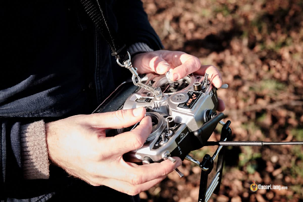

Вибір пульта для FPV-дрону може бути непростим завданням для початківців, враховуючи кількість доступних варіантів. Пульт має дуже важливе значення для керування дроном у польоті. Цей посібник пояснює фактори, що виходять за рамки ціни, такі як: підтримка частот, протоколів, каналів, функціональність, надійність, комфорт і програмне забезпечення.

*Деякі посилання на цій сторінці є партнерськими. Я отримую комісію (без додаткових витрат для вас), якщо ви робите покупку після натискання одного з цих партнерських посилань. Це допомагає підтримувати безкоштовний вміст для спільноти на цьому веб\-сайті. Будь ласка, прочитайте нашу [Політику партнерських посилань](https://oscarliang.com/affiliate-program-policy/) для отримання додаткової інформації.*

Зміст

[Що таке пульт](#що-таке-пульт)

[Якої форми існують пульти?](#якої-форми-існують-пульти?)

[Ергономічність](#ергономічність)

[Режими керування](#режими-керування)

[Типи рамок](#типи-рамок)

[Як тримати стіки](#як-тримати-стіки)

[Накладки на стіки (Stick-ends)](#накладки-на-стіки-\(stick-ends\))

[Перемикачі](#перемикачі)

[Частота пульта](#частота-пульта)

[Протоколи радіозв'язку](#протоколи-радіозв'язку)

[Підтримка зовнішніх модулів](#підтримка-зовнішніх-модулів)

[Приймачі сигналу](#приймачі-сигналу)

[Біндування (зв'язування) пульта та приймача](#біндування-\(зв'язування\)-пульта-та-приймача)

[Сумісність із приймачем](#сумісність-із-приймачем)

[Дальність дії](#радіус-дії)

[Час автономної роботи](#час-автономної-роботи)

[Кількість каналів](#кількість-каналів)

[Прошивка пульта](#прошивка-пульта)

[Підтримка телеметрії](#підтримка-телеметрії)

[Підтримка FPV-симулятору](#підтримка-fpv-симулятору)

[Тренувальний порт (Trainer Port)](#тренувальний-порт-\(trainer-port\))

[Спільний політ з іншими людьми](#спільний-політ-з-іншими-людьми)

[На що треба звернути уваги при виборі пульта](#на-що-треба-звернути-уваги-при-виборі-пульта)

[Найдешевший варіант який можна розглянути](#найдешевший-варіант-який-можна-розглянути)

[Найкраще співвідношення ціни та універсальності](#найкраще-співвідношення-ціни-та-універсальності)

[Портативність і продуктивність](#портативність-і-продуктивність)

[Огляд популярних пультів](#огляд-популярних-пультів)

[Історія редагування](#історія-редагування)

## 

## **Що таке пульт** {#що-таке-пульт}

Пульт \[radio transmitter\]  \- це портативний пристрій, який пілоти використовують для керування FPV-дроном у польоті. Він надсилає сигнали на приймач дрона \[receiver\], а потім на [польотний контроллер](https://oscarliang.com/flight-controller-explained/) \[Flight Controller, або скорочено FC\], який перетворює ці сигнали у рухи дрона.

Пульт є найважливішим елементом для керування FPV-дронами, оскільки він дозволяє пілоту точно і безпомилково контролювати рухи дрона. Якісний пульт з надійним з'єднанням необхідний для того, щоб дрон швидко і точно реагував на дії пілота. Зручний хват і чутливі стіки мають важливе значення для успішного пілотування. Деякі пульти пропонують розширені функції, які можна налаштувати, наприклад: збір даних телеметрії, підтримку різних протоколів і приймачів, що дозволяє пілотам адаптувати свій досвід польоту до своїх уподобань і потреб. Коли ви починаєте літати на FPV-дроні, однією з ваших перших покупок має стати пульт. З ним ви зможете практикувати польоти на симуляторі ще до того, як придбаєте власний дрон. Хороший пульт прослужить вам довго, на відміну від інших аксесуарів, які можуть швидко зламатися або застаріти. Тому варто інвестувати дещо більше в якісний пульт. Новачок у FPV-дронах? Обов'язково ознайомтеся з моїм [посібником для початківців з FPV дронів](https://oscarliang.com/fpv-drone-guide/).

## **Якої форми існують пульти?** {#якої-форми-існують-пульти?}

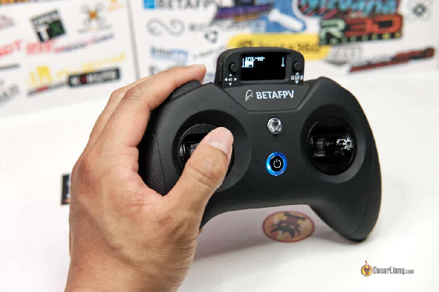  
Існує два основних види пультів: повнорозмірний і геймпад. Пульти у вигляді геймпада дуже компактні, але, як правило, мають менше функцій, наприклад, екран меншого розміру, менші стіки та менше перемикачів. Цей вид пультів є менш зручним для тримання, особливо для тих, у кого великі руки або тим, хто віддає перевагу керуванню, стискаючи стік вказівним і великим пальцями.  
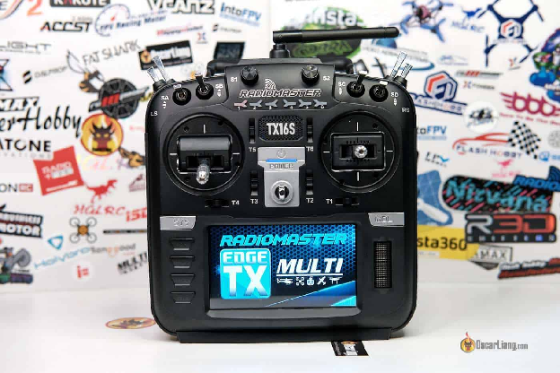

Якщо розмір пульта не є важливим для вас, то повнорозмірна форма буде більш універсальним варіантом. Як правило, повнорозмірні пульти мають ергономічну конструкцію, яка підходить для ширшого кола людей, а стіки стандартного розміру забезпечують кращу роздільну здатність і точність. Зрештою, вибір зводиться до особистих уподобань і того, що є найбільш комфортним для конкретного користувача.

## **Ергономічність** {#ергономічність}

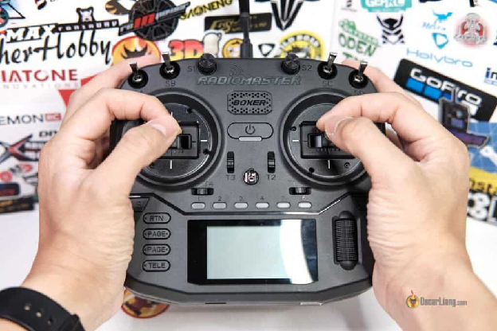

Це правда, що оцінка ергономіки пульта може бути складною під час покупки в Інтернеті. Однак це все ще важливий фактор, який слід враховувати, оскільки зручність і керованість є вирішальними для польотах на FPV-дронах. Окрім розміру пульта, важлива також його конструкція, і слід враховувати такі фактори, як зручність тримання в руках, наявність петлі для ремінця, а також розташування і типи перемикачів. Вага пульта \- ще один фактор, який слід враховувати, оскільки важкий пульт може викликати втому з часом, тоді як легший може здаватися менш відчутним для точного керування дроном.  
Хоча авторитетні виробники, швидше за все, враховують ергономіку при розробці своїх пультів, все ще існує широкий спектр варіацій з точки зору зчеплення, розміщення перемикачів, розподілу ваги тощо.  
Відвідування місцевих зустрічей і випробування різних пультів інших пілотів може стати чудовим способом зрозуміти, що саме вам підходить. Крім того, ви також можете почитати відгуки і подивитися відео з перевірених джерел, щоб отримати уявлення про ергономіку різних моделей пультів перед покупкою.

**Стіки**  
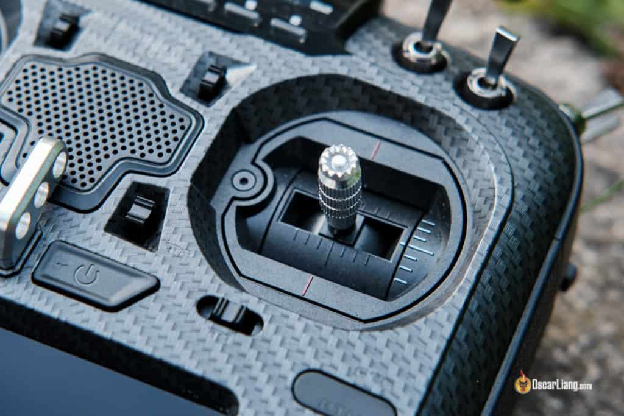

Основними елементами пульта є два “стіки”,  які відповідають за контроль над рухом вашого дрона. Як пілот, ви використовуєте стіки, щоб давати дронам команди, такі як:  
Тяга \[Throttle\]: Ви контролюєте швидкість двигунів, яка впливає на загальну швидкість дрона.  
Тангаж \[Pitch\]: Ця команда змушує дрон обертатися навколо своєї бічної осі, рухаючи його вперед або назад.  
Нахил \[Roll\]: Ця команда змушує дрон обертатися вздовж поздовжньої осі, нахиляючи його вліво або вправо.  
Никання \[Yaw\]: Ця команда змушує дрон обертатися вздовж вертикальної осі, повертаючи його вліво або вправо.  
Ось анімована демонстрація того, як дрон реагує на кожен рух джойстиком:  
[https://oscarliang.com/wp-content/uploads/2023/01/radio-transmitter-gimbal-sticks-fpv-drone-quad-respond-react-roll-pitch-yaw-throttle-movement.webp](https://oscarliang.com/wp-content/uploads/2023/01/radio-transmitter-gimbal-sticks-fpv-drone-quad-respond-react-roll-pitch-yaw-throttle-movement.webp)

### **Режими керування** {#режими-керування}

Перш ніж купувати свій перший пульт, важливо визначитися з режимом роботи, якому ви віддаєте перевагу. Під режимом роботи мається на увазі конфігурація двох стіків управління, які мають чотири режими на вибір: Режим 1, Режим 2, Режим 3 і Режим 4\. Не існує правильного чи неправильного режиму, це лише питання особистих уподобань. Однак, якщо ви не впевнені, який режим вибрати, **просто виберіть режим 2**, оскільки це найпоширеніший режим серед операторів дронів. Більшість пультів також постачаються з режимом 2\. В **Режимі 2** команди тангажу \[Pitch\] і нахилу \[Roll\] подаються з правого стіку, а лівий відповідає за керування тягою \[Throttle\] та никанням \[Yaw\]. Правий стік самоцентрується по обох осях, в той час як лівий стік самоцентрується тільки по осі никання, а тяга залишається там, де ви її залишили, щоб забезпечити постійну швидкість. Більшість сучасних пультів дозволяють перемикатися між усіма чотирма режимами шляхом простого налаштування апаратного та програмного забезпечення, тому ви можете спробувати кожен режим без необхідності купувати новий пульт.

### **Типи рамок** {#типи-рамок}

Існує два основні механізми рамок, які використовуються в сучасних пультах: потенціометр \[Potentiometer\] та датчик Холла \[Hall Sensor\]. Потенціометричні рамки дешевші, але вони швидше зношуються через фізичний контакт в з'єднаннях щіток, що спричиняє тертя. Рамки з датчиком Холла довговічніші тому що, використовують магніти для визначення положення стіка.

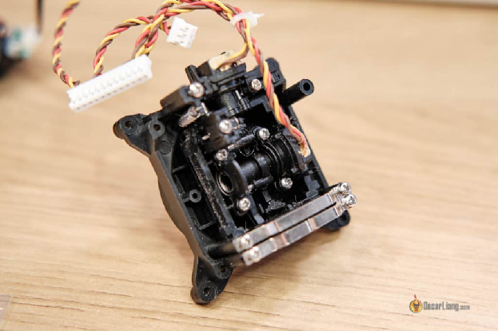*Рамка на основі потенціометру*

*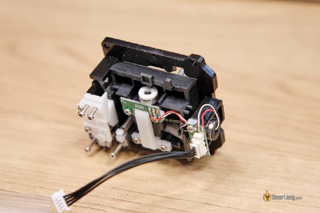Рамка з датчиком Холла*

Окрім збільшення терміну служби, рамки з датчиками Холла також пропонують кращу точність і роздільну здатність та зменшує хитання. Початківці можуть не помітити великої різниці в зручності керування, але це стане важливим фактором з накопиченням досвіду польотів.  
Незалежно від механізму рамки, зазвичай ви можете відрегулювати натяг пружини таким чином, щоб досягти бажаного контролю стіком. Часто це питання особистих уподобань, і це може мати значний вплив на точність керування.

### **Як тримати стіки** {#як-тримати-стіки}

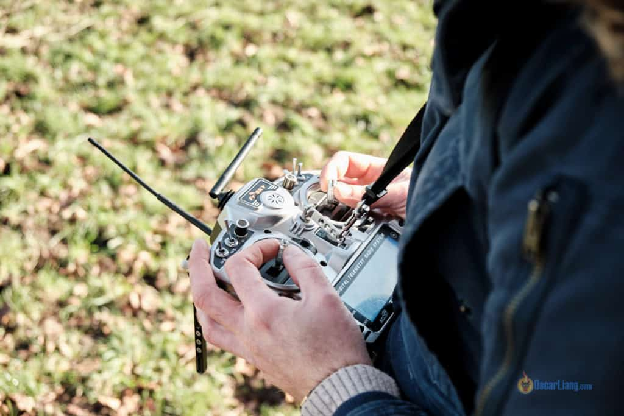*Тип керування із затисканням стіка великим і вказівним пальцями (pinch)*

При виборі пульта слід враховувати те, як ви тримаєте стіки. Якщо ви віддаєте перевагу затисканню стіків двома пальцями, вам потрібні довші стіки. Якщо ви віддаєте перевагу керуванню стіками лише великими пальцями, а рештою пальців тримати задню частину пульта, то вам краще обрати короткі стіки. У мене є [цілий пост, в якому пояснюються різні способи та переваги тримання стіків](https://oscarliang.com/pinch-thumb-stick/). Не існує правильного чи неправильного способу, це суто особисті уподобання.

### **Накладки на стіки (Stick-ends)** {#накладки-на-стіки-(stick-ends)}

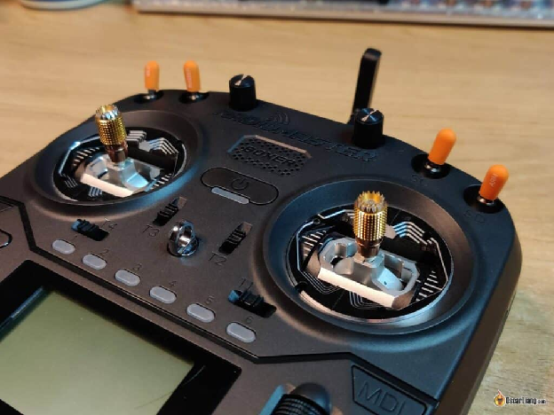  
Накладки на стіки зазвичай змінні. Від того як ви тримаєте пульт, може залежати які накладки краще обрати. Серед популярних варіантів накладок: кулясті, грибоподібні та плоскі. Ось накладки, які я зараз використовую і рекомендую: [Radiomaster Sticky360](https://oscarliang.com/radiomaster-sticky360-stickends/). Не усі накладки сумісні з пультом, основна відмінність полягає в розмірі різьби. Зазвичай накладки мають різьбу M3 або M4, тому важливо перевіряти сумісність перед покупкою пульта.

* FRSKY Taranis Standard Gimbals – M3  
* FRSKY Taranis Hall Effect Gimbals – M4  
* FRSKY X-LITE – M2.5  
* TBS Tango 2 \- M3  
* TBS Mambo \- M3  
* Jumper T-Lite v1/v2 \- M3  
* Jumper T-Pro  
* Jumper T12 Pro – M3  
* Jumper Т16 \- М3  
* Jumpe Т18 \- М3  
* Radiomaster TX16S – M4  
* Radiomaster Boxer – M4  
* Radiomaster Zorro \- M3  
* Radiomaster TX12 – M3

## **Перемикачі** {#перемикачі}

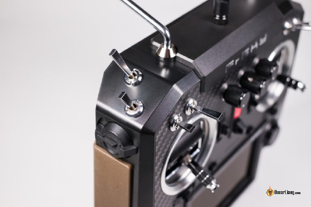  
Пульти зазвичай мають безліч перемикачів, за допомогою яких ви можете увімкнути дрон, активувати режим польоту та виконувати інші функції. Це дво- або трипозиційні перемикачі, а також повзунки та поворотні перемикачі. Однак, пілотам FPV-дронів, зазвичай не потрібно так багато перемикачів, як пілотам літаків. Вам потрібен лише один перемикач для увімкнення дрону, другий \- для звукового сигналу, а третій \- щоб обрати режим польоту. Хоча наявність більшої кількості перемикачів, безумовно, може бути корисною, вони ні в якому разі не є необхідними, якщо ви в основному літаєте у стилі фрістайл або приймаєте участь у перегонах.

## **Частота пульта** {#частота-пульта}

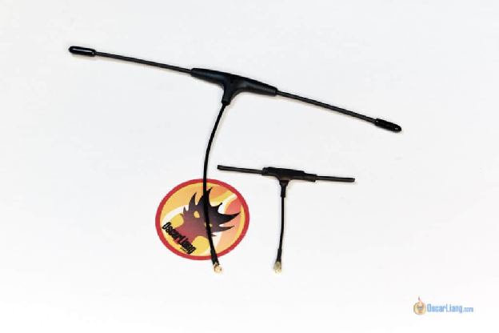

*З лівої сторони антена 868 МГц; З прової сторони антена 2,4 ГГц.*  
Частота є важливим фактором, який слід враховувати при виборі пульта для FPV-дрона. Дві найпоширеніші частоти, що використовуються FPV-дронами \- це 2,4 ГГц і 900 МГц. 2,4 ГГц є сучасним стандартом для радіоуправління і дозволена для аматорського використання в більшості країн. Менший розмір антени робить цю частоту популярною серед пілотів. З іншого боку, 900 МГц часто використовується для польотів на великі відстані завдяки кращому поширенню сигналу та надійності. Хоча 900 МГц має вужчу смугу пропускання і вимагає набагато більших антен, ніж 2,4 ГГц, деякі пілоти все ж надають їй перевагу через використання низьких частот. Варто зазначити, що точна робоча частота для діапазону 900 МГц відрізняється залежно від регіону: у більшості країн світу використовується частота 915 МГц, а в ЄС \- 868 МГц. Існують й інші, менш поширені частоти, що використовуються для керування, такі як 27 МГц, 72 МГц, 433 МГц і 1,3 ГГц, але вони або застаріли, або використовуються в інших специфічних випадках. Для FPV-дронів найкраще розглядати частоти 2,4 ГГц або 900 МГц.

## **Протоколи радіозв'язку** {#протоколи-радіозв'язку}

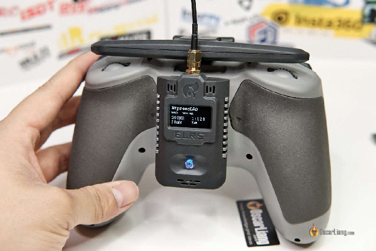

Наступним важливим кроком при виборі пульта є протокол радіозв'язку який ви плануєте використовувати. На сьогоднішний день в FPV-дронах найпопулярнішими проколами радіозв’язку є:

* [TBS Crossfire](https://oscarliang.com/crossfire-betaflight/) (868MHz/915MHz)  
* [ExpressLRS](https://oscarliang.com/setup-expresslrs-2-4ghz/) / ELRS (2.4GHz and 868MHz/915MHz)  
* [TBS Tracer](https://oscarliang.com/tbs-tracer/) (2.4GHz)  
* [Immersion Ghost](https://oscarliang.com/immersionrc-ghost/) (2.4GHz)  
* Frsky ACCST V1/V2 (2,4 ГГц)  
* Frsky ACCESS (2,4 ГГц)  
* Flysky  
* Spektrum

Рекомендується користуватися популярним протоколом радіозв’язку. Таким чином ви отримаєте доступ до онлайн-довідки та вищу вартість при перепродажі.  
ExpressLRS і Crossfire, безсумнівно, є найпопулярнішими протоколами на даний момент, які я б рекомендував у 2023 році. ExpressLRS відомий своєю доступністю, високою продуктивністю, відкритим вихідним кодом і найсучаснішими функціями. З іншого боку, Crossfire відомий своєю надійністю та зручною конфігурацією. Варто зазначити, що обладнання з підтримкою ExpressLRS зазвичай доступніше, порівняно з іншими пропрієтарними радіосистемами, оскільки має відкритий вихідний код. [Про всі причини, чому я віддаю перевагу ExpressLRS, читайте в цій статті](https://oscarliang.com/expresslrs/).   
Деякі пульти постачаються з вбудованими протоколами радіозв'язку, тоді як інші мають окремий слот для підключення зовнішніх модулів. Наявність такого слоту дає вам більшу гнучкість при виборі протоколу радіозв’язку. Після того, як ви визначилися з протоколом радіозв’язку який хочете використовувати, ваш вибір пульта значно звузиться.

## **Підтримка зовнішніх модулів** {#підтримка-зовнішніх-модулів}

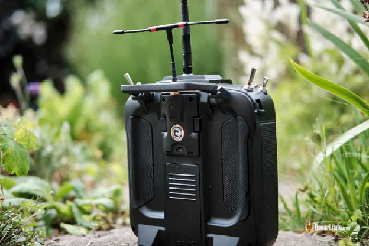

Наявність слота для зовнішнього модуля на задній панелі пульта може бути корисною на випадок, якщо ви захочете перейти на іншу систему радіозв'язку в майбутньому. Замість того, щоб купувати новий пульт, ви можете просто придбати зовнішній модуль, сумісний з новою системою. Важливо зазначити, що не всі пульти мають слот для зовнішнього модуля, тому, якщо ви вважаєте, що він може знадобитися вам у майбутньому, обов'язково шукайте пульт з такою функцією. Існує два типи слотів для зовнішніх модулів: JR-модуль і Lite-модуль (також відомий як нано або мікро). Обов'язково звертайте на це увагу, якщо ви купуєте зовнішній модуль.  
Слот для JR-модуля має наступний вигляд:

Слот для Lite-модуля виглядає так:

## **Приймачі сигналу** {#приймачі-сигналу}

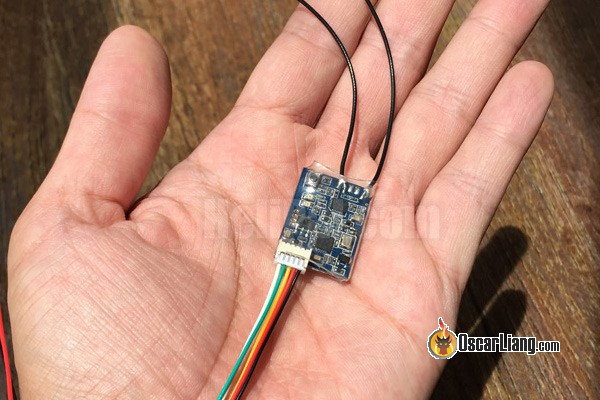  
Приймач відповідає за прийом команд оператора від пульта і транслює ці дані польотному контролеру. Зверніть увагу, що ви можете використовувати лише приймачі, сумісні з радіоканалом, який ви використовуєте, оскільки вони повинні підтримувати той самий протокол, що і пульт. Ось [огляд усіх TX і RX](https://oscarliang.com/rc-protocols/) [протоколів](https://oscarliang.com/rc-protocols/). Протокол \- це своєрідна мова, якою спілкуються пульт і приймач. Коли ви купуєте пульт, ви також зобов'язуєтеся використовувати певні приймачі та екосистему, що може вплинути на ваш бюджет і набір функцій. Деякі виробники можуть пропонувати більш дорогі приймачі, тоді як інші можуть мати кращі варіанти легковісних приймачів для невеликих дронів. Крім того, деякі бренди можуть не мати певних функцій, такі як телеметрія. Важливо пам'ятати, що вам потрібно буде придбати приймач для кожного дрона, тому витрати можуть швидко зростати, якщо у вас є кілька дронів. Знайдіть час, щоб обдумати, який виробник приймача і протокол найкраще підійдуть вам і вашим конкретним потребам.

### **Біндування (зв'язування) пульта та приймача** {#біндування-(зв'язування)-пульта-та-приймача}

### Біндування (зв’язування) — це процес встановлення зв'язку між пультом і приймачем, який потрібно виконати лише один раз, якщо тільки не відбувається оновлення прошивки або біндування з якихось причин не втрачено. Процес біндування, як правило, простий, але кроки можуть відрізнятися залежно від виробника.

* [Як біндувати приймачі ExpressLRS](https://oscarliang.com/setup-expresslrs-2-4ghz/#Binding-Receiver)  
* [Як біндувати приймачі Frsky](https://oscarliang.com/bind-frsky-receiver/)  
* [Як біндувати приймачі Crossfire](https://oscarliang.com/crossfire-betaflight/#binding-tx-rx)

Майте на увазі, що хоча ви можете біндувати кілька приймачів з одним пультом, але одночасно ви можете біндувати лише один приймач до одного пульта.

### **Сумісність із приймачем** {#сумісність-із-приймачем}

Коли ви купуєте пульт, ви інвестуєте не просто в один пристрій, а в систему, яку продовжуватимете розвивати в майбутньому. Дуже важливо, щоб кожен приймач, який ви купуєте, був сумісний із вашим пультом. Також, вам знадобиться новий приймач для кожного нового дрона, який ви плануєте використовувати. Як згадувалося раніше, пульт і приймач повинні використовувати один і той самий протокол. Щоб уникнути несподіванок, ви можете обрати приймач з мого огляду, на основі пульта, який ви використовуєте:

* [Приймачі ExpressLRS](https://oscarliang.com/setup-expresslrs-2-4ghz/#receivers)  
* [Приймачі Crossfire](https://oscarliang.com/crossfire-betaflight/#features)  
* [Приймачі Frsky](https://oscarliang.com/frsky-rx-mini-quad/)  
* [Приймачі Flysky](https://oscarliang.com/flysky-tx-rx-buyers-guide/#rx)

## **Радіус дії** {#радіус-дії}

Не всі протоколи зв’зку однаково ефективні, коли мова йде про радіус дії. Три основні фактори, які впливають на радіус дії пульта:

* Максимальна вихідна потужність  
* Частота сигналу  
* Якість антени та коефіцієнт підсилення

Навіть якщо два різні протоколи мають однакову частоту і вихідну потужність, їхній максимальний радіус дії може сильно відрізнятися через такі фактори, як технологія, що використовується, і якість обладнання.   
Як правило, низькочастотні системи, краще працюють на дальніх відстанях. Однак новітні системи зв’язку, такі як 2,4-гігагерцовий ExpressLRS з модуляцією LoRa (Long Range \- технологія модуляції радіосигналу для передавання даних в IoT (інтернет речей)), також демонструють винятково хороші показники на дальній відстані, незважаючи на вищу частоту. Варто зазначити, що пряма видимість завжди є ідеальною для досягнення найкращого можливого сигналу, оскільки перешкоди між пультом і приймачем можуть значно зменшити радіус дії. Крім того, чутливість і рознесеність антен приймача також можуть впливати на радіус. Деякі приймачі оснащені двома антенами, які допомагають зменшити втрату сигналу через перешкоди або завади. [Розміщення антени](https://oscarliang.com/antenna-positioning/) також може мати велике значення, оскільки розташувавши антену під кутом 90 градусів одна від одної можна покращити прийом сигналу. Наприклад, більш застарілі радіосистеми Frsky 2,4 ГГц, такі як ACCST V1 і V2, зазвичай забезпечують радіус дії близько 1 км \- 1,5 км. Однак новітня система ExpressLRS 2,4 ГГц, незважаючи на те, що використовує лише 100 мВт потужності, може забезпечити радіус дії в десятки кілометрів, завдяки своїй передовій технології та високоякісному обладнанню. Для тих, хто спеціально шукає варіант з великим радіус дії, також доступні такі популярні системи, як [TBS Crossfire](https://oscarliang.com/crossfire-betaflight/).

## **Час автономної роботи** {#час-автономної-роботи}

Більшість пультів постачаються зі змінними акумуляторами, що підтримують як літій-полімерні (LiPo), так і літій-іонні (Li-ion) акумулятори, які можна зручно заряджати через порт USB-C. Така гнучкість гарантує, що ви з меншою ймовірністю розрядите батарею в польових умовах, що може призвести до переривання польоту. Однак деякі пульти оснащені вбудованими LiPo акумуляторами, які не призначені для заміни, і зазвичай їхнього заряду вистачає на кілька годин польоту. Важливо враховувати, чи достатньо цього часу для ваших потреб. Існують способи збільшити час автономної роботи, наприклад, зменшити вихідну потужність (якщо така можливість є) і відрегулювати налаштування екрану, зменшивши яскравість або повністю вимкнувши його.

## **Кількість каналів** {#кількість-каналів}

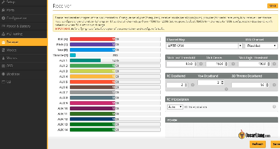*Канали на вкладці Betaflight Receiver*  
Виробники пультів рекламують кількість каналів, які можуть підтримувати їхні пульти, що означає максимальну кількість окремих елементів керування та перемикачів, які можуть бути використані. Кожен елемент керування або перемикач на пульті потребує окремого каналу для передачі даних до приймача. Кількість каналів є ще одним фактором при виборі пульта, але зараз це вже не так важливо, як раніше. На початку розвитку радіомовлення додавання нових каналів було складним і дорогим процесом. Але сьогодні, завдяки цифровим пультам і передовим технологіям, додавання каналів стало набагато простішим. Кількість каналів, які ви можете використовувати, фактично обмежена протоколом зв’язку та кількістю перемикачів на пульті. Два стіка на пульті займають чотири канали, тому що вони мають чотири функції: тяга, нахил, тангаж та никання. Додаткові канали, які називаються "AUX-канали", призначені для перемикачів на пульті для увімкнення дрону та активації інших функцій. Для керування FPV-дроном вам зазвичай потрібно щонайменше 5 каналів: чотири канали для керування рухом дрона і додатковий канал для його увімкнення. Ймовірно, вам також знадобиться ще один або два канали для вибору режиму польоту та активації звукового сигналу. Отже, велика кількість каналів не обов'язково означає кращу продуктивність. Найпопулярніші протоколи зв’язку, такі як Crossfire і ExpressLRS, можуть підтримувати до 12 каналів, а більшість пультів мають від 4 до 8 перемикачів, що більш ніж достатньо для керування FPV-дроном. Якщо ви використовуєте рекомендовані мною варіанти пультів, про кількість каналів не варто турбуватися.

## **Прошивка пульта** {#прошивка-пульта}

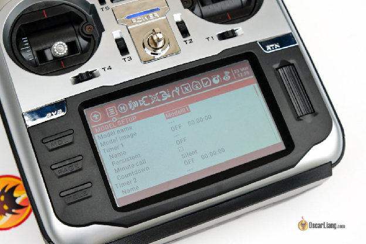  
Прошивка пульта \- це операційна система, котра слугує інтерфейсом, який дозволяє оператору керувати дроном за допомогою пульта.   
Однією з рекомендованих прошивок є EdgeTX, яка має відкритий вихідний код і велику базу користувачів. Більшість пультів на ринку підтримують EdgeTX і поставляються з попередньо встановленою прошивкою, що дозволяє легко перенести ваші налаштування на новий пульт. EdgeTX легко налаштовується і пропонує підтримку багатьох різних типів дронів. Хоча для початківців вона може бути складною у навчанні, але знання, отримані від її використання, будуть безцінними в довгостроковій перспективі. OpenTX також є популярною прошивкою, вона відстає від EdgeTX за кількістю функцій і можливостей. Інші варіанти можливих прошивок: FreedomTX, яка базується на OpenTX і використовується в TBS Tango 2, Mambo, а також ETHOS, яка використовується в останніх моделях пультів Frsky.

## **Підтримка телеметрії** {#підтримка-телеметрії}

Телеметрія \- одна з найважливіших функцій, яку може мати ваш пульт. Вона дозволяє отримувати важливу інформацію про ваш дрон в режимі реального часу, таку як [рівень сигналу](https://oscarliang.com/lq-rssi/), заряд батареї, споживаний струм та багато іншого. Ця інформація може бути неймовірно цінною під час польоту, оскільки допомагає приймати обґрунтовані рішення та уникати потенційних проблем. Більшість сучасних пультів підтримують телеметрію "з коробки", включаючи такі популярні опції, як ExpressLRS і Crossfire. Завдяки телеметрії ви можете відображати дані безпосередньо на екрані пульта або отримувати звукові попередження при досягненні певних порогових значень.

## **Підтримка FPV-симулятору** {#підтримка-fpv-симулятору}

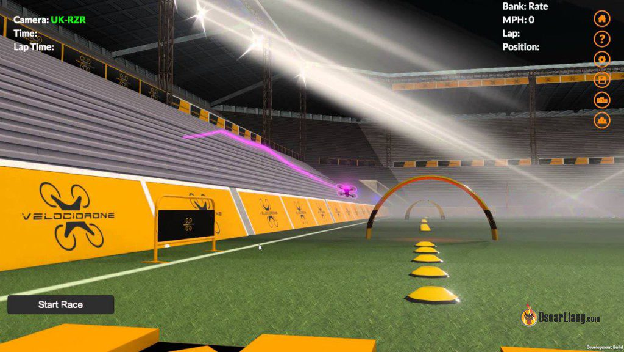  
Якщо ви новачок у FPV-польотах, тренування на [FPV-симуляторах](https://oscarliang.com/fpv-simulator/) можуть стати чудовим способом розвинути м'язову пам'ять і попрактикуватися в польотах без ризику пошкодити дорогі компоненти. Хороша новина полягає в тому, що багато сучасних пультів з прошивкою EdgeTX або OpenTX мають можливість підключатися до FPV-симуляторів через USB і відображатися як джойстик (контролер). Якщо ви хочете вдосконалити свої навички пілотування, обов'язково перевірте, чи пульт, який ви розглядаєте, підтримує FPV-симулятор. Це може суттєво вплинути на ваше навчання та прогрес як оператора FPV-дрона.

## **Тренувальний порт (Trainer Port)** {#тренувальний-порт-(trainer-port)}

Тренувальний порт \- це роз'єм на пульті, який дозволяє з'єднати два пульти разом, щоб вони могли керувати одним і тим же дроном. Це корисний інструмент для навчання, який дозволяє досвідченому пілоту підняти дрон на безпечну висоту і в безпечне місце, а потім передати керування учневі, який може практикувати польоти без ризику аварії. Для такого типу навчання наполегливо рекомендується використовувати пульти з вбудованим тренувальним портом.Тренувальний порт можна використовувати для спільних польотів з друзями та родиною. Також, це може бути цікавим і корисним досвідом, та чудовим способом поділитися своєю любов'ю до польотів з іншими. Загалом, пульти одного бренду і моделі повинні працювати разом без проблем, але важливо перевірити це ще раз, щоб уникнути проблем в майбутньому.

## **Спільний політ з іншими людьми** {#спільний-політ-з-іншими-людьми}

Під час спільного польоту з іншими людьми вам не потрібно турбуватися про керування частотою пульта, тому що це відбувається автоматично. Після того, як ви зв'язали пульт з приймачем, обмін даними буде відбуватися тільки для цієї пари. Це означає, що інші пілоти не зможуть перешкоджати вашому сигналу. Крім того, радіосигнал буде перескакувати через різні частоти в діапазоні 2,4 ГГц, щоб забезпечити міцний і безперервний зв'язок між пультом і приймачем. Це робить політ з пультом безтурботним\!

## **На що треба звернути уваги при виборі пульта** {#на-що-треба-звернути-уваги-при-виборі-пульта}

### **Найдешевший варіант який можна розглянути** {#найдешевший-варіант-який-можна-розглянути}

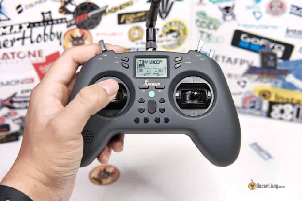

**Jumper T-Lite V2**  
Шукаєте бюджетний пульт, у якому не зекономили на функціях? Зверніть увагу на модель Jumper T-Lite V2, доступний лише за 60 доларів на AliExpress. Цей компактний і легкий пульт, оснащений передовими технологіями EdgeTX і ExpressLRS, що робить його чудовим вибором як для початківців, так і для досвідчених пілотів. Хоча T-Lite не ідеальна модель і має недоліки в ергономіці та якості збірки, але все ж він має багато перемикачів і підтримку FPV-симуляторів, що робить його чудовим вибором для тих, хто тільки починає своє хобі. А з часом автономної роботи понад 10 годин вам не доведеться турбуватися про те, що батарея розрядиться під час польоту. Хочете дізнатися більше? Перегляньте [наш детальний огляд Jumper T-Lite V2](https://oscarliang.com/jumper-t-lite-v2/), щоб переконатися, що це саме той пульт, яка вам потрібна.

**Сторінка продукту (версія ELRS):**

* **Amazon:[https://amzn.to/3HoWkDP](https://amzn.to/3HoWkDP)**  
* **Banggood:[https://oscarliang.com/product-qawf](https://oscarliang.com/product-qawf)**  
* **AliExpress:[https://s.click.aliexpress.com/e/\_DdKvR2X](https://s.click.aliexpress.com/e/_DdKvR2X)**

### **Найкраще співвідношення ціни та універсальності** {#найкраще-співвідношення-ціни-та-універсальності}

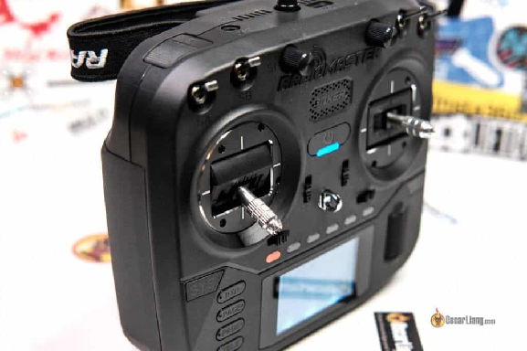  
**Radiomaster Boxer**  
На ринку з'явився новий претендент, кращий за ціною та універсальністю пульт: Radiomaster Boxer. З вбудованим модулем ELRS потужністю 1 Вт, він пропонує все те саме, що і TX16S, але без кольорового сенсорного екрану і за значно доступнішою ціною. Якщо вам цікаво, ознайомтеся з [моїм детальним оглядом Boxer](https://oscarliang.com/radiomaster-boxer/). Якщо ви віддаєте перевагу пультам з великим кольоровим сенсорним екраном, безумовно, варто розглянути TX16S. Це був мій улюблений пульт, він забезпечує відмінну продуктивність та якість.

Сторінки продукту:

* **Радіомастер:[https://oscarliang.com/product-bccn](https://oscarliang.com/product-bccn)**  
* **GetFPV:[https://oscarliang.com/product-2yj0](https://oscarliang.com/product-2yj0)**  
* **RDQ:[https://oscarliang.com/product-tjkh](https://oscarliang.com/product-tjkh)**

**Radiomaster TX16S MKII**  
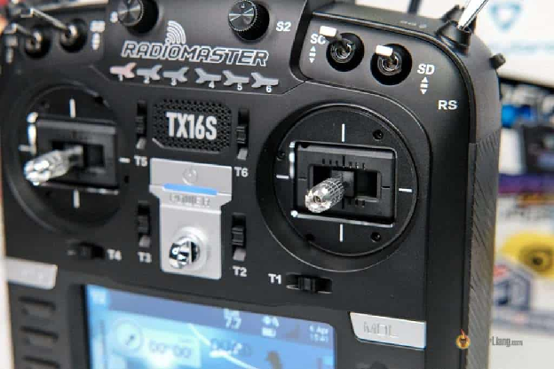  
Radiomaster TX16S MKII вирізняється чудовим поєднанням функцій, продуктивності та ціни. Завдяки традиційній формі та дизайну, цей пульт забезпечує чудову ергономіку та універсальність. Вбудований модуль ELRS і мультипротокольний модуль підтримує майже всі протоколи, що використовуються для керування дронами, а також повністю сумісний з Crossfire. Повнорозмірна рамка з  датчиком Холла забезпечує повний діапазон переміщення стіка і відмінну точність. Великий кольоровий екран є, мабуть, головною родзинкою цього пульта, що робить його надзвичайно простим у використанні. Цей пульт має велику цінність за свою ціну у 130$. Перегляньте [наш огляд Radiomaster TX16S MKII](https://oscarliang.com/radiomaster-tx16s-mark-ii/) що б отримати більше інформації.

Сторінки продукту:

* **Banggood:[https://oscarliang.com/product-c6gv](https://oscarliang.com/product-c6gv)**  
* **Amazon:[https://amzn.to/3Mhyc5W](https://amzn.to/3Mhyc5W)**  
* **RDQ:[https://oscarliang.com/product-fs4n](https://oscarliang.com/product-fs4n)**  
* **GetFPV:[https://oscarliang.com/product-6wlg](https://oscarliang.com/product-6wlg)**

### **Портативність і продуктивність** {#портативність-і-продуктивність}

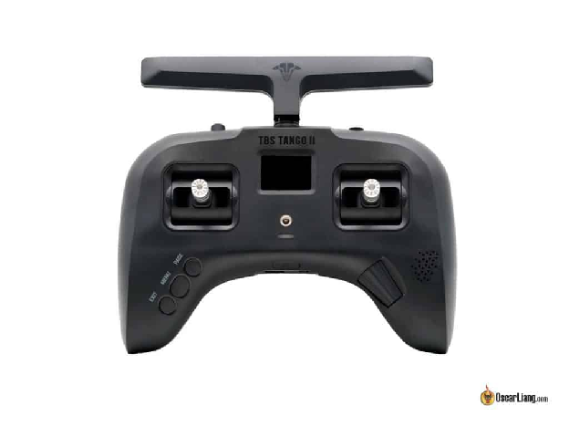  
**TBS Tango 2**  
TBS Tango 2 \- це компактний і портативний пульт преміум-класу, який пропонує виняткову ергономічність, що робить його придатним як для великих, так і для маленьких пальців. Він оснащений вбудованим модулем Crossfire на 900 МГц з максимальною вихідною потужністю 1 Вт (в найновішій версії, 250 мВт у старій версії) і сумісний з OpenTX. Компактний і портативний дизайн робить його ідеальним для пілотів мультикоптерів, але не рекомендується для літальних апаратів з фіксованим крилом через відсутність перемикачів і повзунків. Дивіться [мій повний огляд Tango 2 і його порівняння з Frsky X-Lite Pro](https://oscarliang.com/tbs-tango-2/).  
*Примітка: мій друг Джованні, який щодня користується Tango 2, не погоджується з твердженням TBS про використання повнорозмірних рамок у цьому пульті. Він сказав, що вони помітно менші, ніж у великих пультах, таких як Taranis X9D.*  
Tango 2 також підтримує зовнішній модуль (lite module). Це означає, що його можна використовувати практично з усім, що є в наявності, включаючи мультипротокольний модуль і ExpressLRS. Але для цього користувач має самостійно встановити та підключити зовнішний модуль (lite module) до пульта.   
Основна відмінність між професійною та непрофесійною версіями полягає в стіках. Професійна версія має можливість складання стіків, щоб легко покласти в сумку, а непрофесійна (на 40 доларів дешевше) \- не має цієї функції. Недоліком цього пульта є відсутність підтримки передачі пакетів з частотою 500 Гц в системі ExpressLRS. Крім того, внутрішній радіочастотний модуль доступний лише в Crossfire, для використання ExpressLRS вам доведеться використовувати зовнішній модуль, що зробить його дорожчим і громіздким, якщо ви переважно користуєтеся ExpressLRS. Tango 2 значно дорожчий за інші пульти, але, на мою думку, якість збірки цього пульта варта її преміальної ціни, особливо якщо ви використовуєте Crossfire.  
**Сторінка продукту: [GetFPV](https://bit.ly/3cWgTVF)|[RMRC](https://bit.ly/2Yvmqxx)|[Amazon](https://amzn.to/2UAIo0T)**

## **Огляд популярних пультів** {#огляд-популярних-пультів}

Ось список усіх популярних пультів на ринку:

| Назва пульта | Протоколи | Ціна | Де придбати? |
| :---: | :---: | :---: | :---: |
| [Radiomaster T8 1Lite V2](https://oscarliang.com/radiomaster-t8-lite-v2/) | FrSky | 46$ | [BG](https://oscarliang.com/product-qh9x) | [AliExpress](https://s.click.aliexpress.com/e/_DecwdbR) |
| 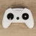 BetaFPV LiteRadio 3 | FrSky/ELRS | 60$ | [BetaFPV](https://oscarliang.com/product-yq9q) | [GetFPV](https://oscarliang.com/product-7ea2) | [AE](https://s.click.aliexpress.com/e/_DebbKQv) |
| 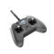 [Jumper T-Lite V2](https://oscarliang.com/jumper-t-lite-v2/) | ELRS/Multi \+ External | 60$ | [Amazon](https://amzn.to/3HoWkDP) | [AE](https://s.click.aliexpress.com/e/_DdKvR2X) | [BG](https://oscarliang.com/product-qawf) |
| 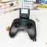 [Radiomaster T8 Pro](https://oscarliang.com/radiomaster-t8-pro/) | Multi | 89$ | [AE](https://s.click.aliexpress.com/e/_DFq2b9x) | [GetFPV](https://oscarliang.com/product-fhh4) | [Amazon](https://amzn.to/3YlAnek) |
| 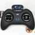 [BetaFPV LiteRadio 3 Pro](https://oscarliang.com/betafpv-literadio-3-pro/) | FrSky/ELRS \+ External | 90$ | [AE](https://s.click.aliexpress.com/e/_Dkwp86Z) | [BetaFPV](https://oscarliang.com/product-rho9) | [RDQ](https://oscarliang.com/product-p3tu) |
| 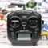[Radiomaster TX12 MKII](https://oscarliang.com/radiomaster-tx12-mark-ii/) | FrSky \+ External | 90$ | [AE](https://s.click.aliexpress.com/e/_DBkxdYF) | [RM](https://oscarliang.com/product-sp5p) | [Amazon](https://amzn.to/3Ypntf4) |
| [Radiomaster Zorro](https://oscarliang.com/radiomaster-zorro/) | ELRS/Multi \+ External | 100$ | [GetFPV](https://oscarliang.com/product-h1f3) | [RDQ](https://oscarliang.com/product-ar64) | [Amazon](https://amzn.to/34wqwfw) |
|  [Jumper T-Pro](https://oscarliang.com/jumper-t-pro/) | ELRS/Multi \+ External | 100$ | [BG](https://oscarliang.com/product-luph) | [RDQ](https://oscarliang.com/product-g8dn) | [Amazon](https://amzn.to/3tLbnBA) |
| 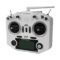 [FrSky Taranis Q X7](https://oscarliang.com/taranis-q-x7-tx/) | FrSky \+ External | 120$ | [AliExpress](https://s.click.aliexpress.com/e/_DFQfkHn) | [Amazon](https://amzn.to/37xUAoj) |
| 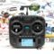[Radiomaster Boxer](https://oscarliang.com/radiomaster-boxer/) | ELRS/Multi \+ External | 140$ | [Amazon](https://amzn.to/3Zl4p3d) | [RM](https://oscarliang.com/product-bccn) | [GetFPV](https://oscarliang.com/product-2yj0) |
| 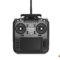[Radiomaster](https://oscarliang.com/radiomaster-tx16s-mark-ii/)  [TX16S MKII](https://oscarliang.com/radiomaster-tx16s-mark-ii/) | Multi/ELRS \+ External | 200$ | [BG](https://oscarliang.com/product-oj84) | [RDQ](https://bit.ly/3cY6IQw) | [Amazon](https://amzn.to/3eesfWh) |
| 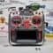Radiomaster TX16S MKII Max | Multi/ELRS \+ External | 250$ | [BG](https://oscarliang.com/product-fiiu) | [RDQ](https://oscarliang.com/product-gvaq) | [BuddyRC](https://oscarliang.com/product-xbbc) |
| 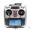 [Jumper T16 Pro V2](https://oscarliang.com/jumper-t16-pro/) | Multi \+ External | 160$ | [Amazon](https://amzn.to/2AynMiP) | [AliExpress](https://s.click.aliexpress.com/e/_DCDvIAt) |
| 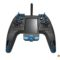 [Flysky Nirvana](https://oscarliang.com/nirvana-tx/) | FrSky \+ External | 180$ | [Amazon](https://amzn.to/2zte80u) | [AliExpress](https://s.click.aliexpress.com/e/_Dn5gMOv) |
| 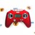 [Frsky X-Lite](https://oscarliang.com/frsky-x-lite-tx/) | FrSky \+ External | 140$ | [GetFPV](https://goo.gl/JveJQf) | [AE](https://s.click.aliexpress.com/e/_DFWZayH) | [Amazon](https://amzn.to/3dXx8mM) |
|  Frsky X-Lite Pro | FrSky \+ External | 200$ | [RDQ](http://bit.ly/32DVFrw) | [Amazon](https://amzn.to/2MR9mgm) | [GetFPV](https://bit.ly/30DPBAV) |
| 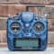 [FrSky Taranis X9D+ 2019](https://oscarliang.com/taranis-x9d-plus-2019-radio/) | FrSky \+ External | 250$ | [AliExpress](https://s.click.aliexpress.com/e/_DCw3wuN) | [Amazon](https://amzn.to/3e0seFN) |
| x TBS Mambo | Tracer \+ External | 140$ | [GetFPV](https://oscarliang.com/product-1x6m) | [BuddyRC](https://oscarliang.com/product-qy69) | [AE](https://s.click.aliexpress.com/e/_DBwBuRj) |
| 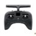 [TBS Tango 2](https://oscarliang.com/tbs-tango-2/) | Crossfire \+ External | 160-200$ | [GetFPV](https://bit.ly/3cWgTVF) | [Amazon](https://amzn.to/2UAIo0T) | [AE](https://s.click.aliexpress.com/e/_DB7PF1x) |
| 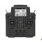 Flysky Paladin | Flysky | 285$ | [AliExpress](https://s.click.aliexpress.com/e/_Dme5vjB) | [Amazon](https://amzn.to/3fq4Guh) |
| 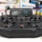 [Frsky Tandem X20](https://oscarliang.com/frsky-tandem-x20/) | FrSky \+ External | 330$ | [AliExpress](https://s.click.aliexpress.com/e/_Dd7BBgZ) | [Amazon](https://amzn.to/3kRLcaf) |
| 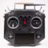 [Frsky Horus X10S](https://oscarliang.com/frsky-horus-x10s/) | FrSky \+ External | 470$ | [Amazon](https://amzn.to/30G4ovc) | [AliExpress](https://s.click.aliexpress.com/e/_Dk2dqDP) |
| 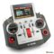 FrSky Horus X12S | FrSky \+ External | 500$ | [Amazon](https://amzn.to/2UG5ALa) | [GetFPV](https://www.getfpv.com/frsky-horus-x12s-radio-space-gray.html?cmid=eHZ3Y2tBWGYrQWM9&afid=M1RXSkVIZ2tWV1E9&ats=UWlNdmloZTV1d2s9) |

#### **Історія редагування** {#історія-редагування}

* Жовтень 2013 – Стаття створена  
* Червень 2016 р. – Оновлено популярними параметрами TX  
* Червень 2017 р. – Статтю оновлено, додано інформацію про отримувача  
* Липень 2018 р. – додано інформацію про підвіси, перемикачі, ОС і радіус дії  
* Жовтень 2019 р. – Оновлений список продуктів  
* Червень 2020 р. – Оновлені продукти та мої рекомендації  
* Березень 2021 р. – замінено BetaFPV Lite Radio 2 на Jumper T-Lite  
* Березень 2023 р. – оновлений посібник і список продуктів

[image1]: 

[image2]: 

[image3]: 

[image4]: 

[image5]: 

[image6]: 

[image7]: 

[image8]: 

[image9]: 

[image10]: 

[image11]: 

[image12]: 

[image13]: 

[image14]: 

[image15]: 

[image16]: 

[image17]: 

[image18]: 

[image19]: 

[image20]: 

[image21]: 

[image22]: 

[image23]: 

[image24]: 

[image25]: 

[image26]: 

[image27]: 

[image28]: 

[image29]: 

[image30]: 

[image31]: 

[image32]: 

[image33]: 

[image34]: 

[image35]: 

[image36]: 

[image37]: 

[image38]: 

[image39]: 

[image40]: 

[image41]: 

[image42]: 

[image43]: 