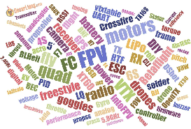
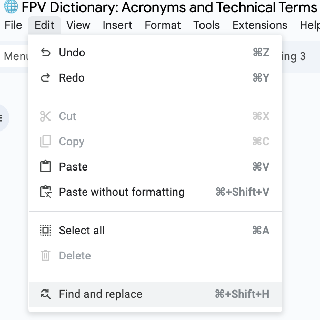
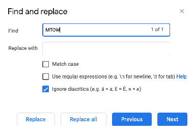

Стисле посилання на цей переклад: [https://bit.ly/FPV-Dictionary](https://bit.ly/FPV-Dictionary)

|  | Нижче вичитаний людьми машинний український переклад оригіналу. Для [VictoryDrones](https://www.victory-drones.com/) переклад вичитали: Faina, Max Well. Хочете покращити переклад чи знайшли помилку? — Лишіть коментар (Ctrl+Alt+M або «Меню» \> «Вставка» \> «Коментар»). Ми теж живі люди (як і ви) і робим помилки. Роботи їх, до речі, також роблять 😉 |
| :---- | :---- |

# **Словник FPV: пояснення абревіатур та технічних термінів**

# 26th August 2024

Таке хоббі як FPV (або вид від першої особи), — має повно абревіатур і жаргонізмів які можуть збити з пантелику навіть досвідчених дроноводів. Щоб полегшити розуміння, ми склали всебічний глосарій найбільш часто вживаних технічних термінів та абревіатур у галузі FPV та RC (пульта). Цей список покликаний стати корисним посібником як для новачків, так і для досвідчених ентузіастів. Якщо ви помітите відсутні терміни, будь ласка, не соромтеся повідомити нам\!

*Деякі посилання на цій сторінці є партнерськими. Я \[автор англомовної версії Оскар Ланг\] отримую комісію (без додаткових витрат для вас), якщо ви робите покупку після натискання одного із цих партнерських посилань. Це допомагає підтримувати безкоштовний контент для спільноти на цьому веб\-сайті. Будь ласка, прочитайте нашу [Політику партнерських посилань](https://oscarliang.com/affiliate-program-policy/) для отримання додаткової інформації.*

## 

## **Як використовувати цей посібник**

Щоб знайти значення слова, скористайтеся функцією пошуку   
   
  
Або скористайтеся функцією пошуку натиснувши Control \+ F.

Якщо ви не можете знайти те, що шукаєте, просто залиште коментар, і я відповім вам якнайшвидше. Дякую\!

---

### **Словник термінів FPV**

| Абревіатура | Розшифрування | Пояснення |
| ----- | ----- | ----- |
| **MTOW (Maximum take-off weight)** | Максимальна злітна вага | Максимальна злітна вага яку дрон може підняти без втрати керованості та ефективності i включає вагу самого дрона, акумулятора, камери, вантажу та іншого обладнання.  |
| **VTOL (Vertical take off and landing)** | Вертикальний зліт та посадка | здатність літального апарата злітати та приземлятися вертикально без необхідності злітно-посадкової смуги |
| **WOT(Wide Open Throttle)** | Повна потужність тяги | Летіти на 100% тяги |
| **2.4GHz, 5.8GHz, 900MHz** | Гц \= Герц, МГц \= Мегагерц, ГГц \= Гігагерц | Частоти, які використовуються у радіокеруванні та FPV. [https://oscarliang.com/fpv-frequency/](https://oscarliang.com/fpv-frequency/) |
| **Bando(**a**bando**ned building**)** | Покинута будівля | Bando \- це покинута будівля, популярна серед пілотів фрістайлу для польотів. |
| **BNF(Bind and Fly)** | «з'єднай (пульт) і лети» | Модель BNF — це попередньо зібрана модель, подібна до RTF, але без передавача. Мусите використовувати власний передавач для з’єднання. |
| **PDB(Power distribution board)** | Плата розподілу живлення | Плата, призначена для роботи з високими струмами, яка містить мідні доріжки для підключення різних електронних компонентів, таких як LiPo батарея, ESC, відеопередавач, LED тощо. |
| **IMU(Inertial Measurement Unit)** | інерційний вимірювальний пристрій (ІВП)  | Плата розширення, що містить датчики, які зчитують та надсилають дані до польотного контролера. *\[прим. пер.: зазвичай це мікросхема на польотному контролері\]* |
| **Cinelifter** | (сінелифтер) | тип квадрокоптера, який розроблений для транспортування великих професійних камер, таких як Blackmagic Pocket та Red Komodo. Cinelifters зазвичай використовують пропелери 6" або більше та часто мають 8 моторів (в конфігурації X8). |
| **Cinewhoop** | (сіневуп) | квадрокоптер із захисними кільцями навколо пропелерів, який переважно використовується для створення кінематографічних зйомок з близької відстані – з людьми, тваринами та садибами. Cinewhoops, як правило, повільніше фрістайл-дронів, що добре підходить для плавної зйомки на близькій відстані. |

| Toothpick | Зубочистка (малий дрон) | Клас невеликих квадрокоптерів, також відомих як надлегкі мікро-квадрокоптери, зазвичай оснащені пропелерами розміром 2,5" або 3". [https://oscarliang.com/ultralight-micro-quad-toothpick](https://oscarliang.com/ultralight-micro-quad-toothpick) |
| :---- | :---- | :---- |
| **Tiny Whoop** | Малий вуп (вупик) | Клас ультракомпактних квадрокоптерів із захистом пропелерів (кожухи). [https://bit.ly/LiangTinyWoops](https://bit.ly/LiangTinyWoops)    |
| **MegaPirate** |  | Клон програмного забезпечення польотного контролера Arducopter. |
| **RX(Radio Receiver)** | "приймач (сигналу керування із пульта)" або "RX-пін UART" | Пристрій, що приймає команди від передавача та передає їх безпосередньо сервоприводам або польотному контролеру.  RX також може означати приймальний пін UART. [https://bit.ly/LiangFC-Explained](https://bit.ly/LiangFC-Explained)   |
| **VRX(Video Receiver)** | Відеоприймач | Пристрій, що приймає відеосигнал від відеопередавача та показує зображення на FPV-окулярах або екрані. |
| **VTXVideo Transmitter)** | Відеопередавач | Пристрій, що передає відеосигнал з FPV-камери на відеоприймач/FPV-окуляри. [bit.ly/LiangBestVTX4FPV-uk-UA](https://bit.ly/LiangBestVTX4FPV-uk-UA)   |
| **Diversity Receiver**  | “Дайверсіті”-приймач, приймач з рознесеними антенами | Приймач із двома незалежними антенами та лініями прийому сигналу, що вибирає найсильніший сигнал. Зазвичай має кращу якість сигналу за приймачі, що не мають декількох антен. |
| **Air Mode** |  | Функція в прошивці Betaflight, яка залишає PID-контролер активним навіть при нульовій тязі, коли дрон взведений. [https://oscarliang.com/betaflight-airmode/](https://oscarliang.com/betaflight-airmode/)  |
| **AH(Altitude hold)** | Утримання висоти | Режим польоту, який підтримує висоту дрона за допомогою барометричного датчика (BARO) або ультразвукового датчика. |
| **Frame** | Рама | Каркас дрона, який тримає всі компоненти, зазвичай виготовляється з карбонового волокна через його легкість та жорсткість. |
| **JST** |  | Загальний тип роз'єму для низькопотужних мікродронів. |
| **RTH(Return to Home)** | Повернення “додому” | GPS-функція, яка повертає дрон до місця, з якого він стартував *\[точка зльоту\].* |
| **FOV(Field of View)** | Поле зору | Вимірювання, яке показує, скільки навколишнього середовища можна побачити через об'єктив камери. Зазвичай вимірюється у градусах. |
| **Failsafe** | Безаварійність | Механізм, що мінімізує пошкодження дрона та оточення у випадку втрати радіосигналу або збою системи. [https://bit.ly/LiangFailsafeSetup](https://bit.ly/LiangFailsafeSetup)    |
| **KK** | Kaptein Kuk | Польотний контролер для мультикоптерів, розроблений Рольфом Бакке у 2012 році. |
| **Naked GoPro** |  | "Голий” GoPro – версія камери, де всі непотрібні частини видалені, окрім материнської плати та модуля камери, щоб мінімізувати вагу. [https://oscarliang.com/gopro-10-bones/](https://oscarliang.com/gopro-10-bones/) |
| **OSD(**On Screen Display) | наекранне меню | апаратне забезпечення, яке накладає дані польоту у текстовій або графічній формі на існуючий відеопотік в режимі реального часу. |
| **Pigtail** | пігтейл | "Пігтейл”, у FPV – кабель конектора *\[роз’єму\]* батареї, який припаюється до регулятора обертів 4in1 *\[чотири в одному\]*. “Пігтейл” – також довгий кабель адаптера антени SMA. *\[прим. пер.: через скручування, схожий на свинячий хвостик \- pig tail\]* |
| **PNP** | Plug and Play(зорієнтований на просте вмикання в роботу («підключи і грай») | Комплект квадрокоптера PNP– зазвичай поставляється без приймача, передавача, батареї та FPV- окулярів.  |
| **Locked in** |  | Позитивний опис стабільної роботи та гарної керованості мультироторного дрона \- ніби їде по рейкам.  |
| **ACC (**Accelerometer) | Акселерометр  | датчик, який вимірює сили прискорення в конкретному напрямку.  |
| **I2C** | Inter-Integrated Circuit | Послідовна шина, яка дозволяє підключати до мікропроцесора кілька периферійних пристроїв низької швидкості, таких як датчики. |
| **Trim** | Корекція | Мала константа корекції *\[трим, тримінг\]*, що застосовується для контролю, утримання команд керування дроном в певному значенні. |
| **Curr / CRT** | CurrentСтрум | Паяльний майданчик на регуляторі обертів чи на польотному контролері для даних датчика струму  |
| **Angle Mode** |  | [Стабілізований режим польоту, який використовує як гіроскоп, так і акселерометр для самовирівнювання дрона.](https://oscarliang.com/rate-acro-horizon-flight-mode-level/) [https://bit.ly/LiangAcroMode-vs-SelfLevelMode](https://bit.ly/LiangAcroMode-vs-SelfLevelMode)  |
| **Multishot** |  | Тип аналогового протоколу регулятора обертів для заміни “Oneshot"  |
| **Oneshot** | Oneshot125 | Тип аналогового протоколу керування регулятора обертів для заміни протоколу ШІМ (PWM) |
| **XT90** |  | Тип конектора батареї для великих FPV дронів. Він більший за XT60.  |
| **XT30** |  | Тип конектора батареї для мікро FPV дронів. Він менший за XT60.  |
| **ADC(Analogue to Digital Converter)** | Аналогово-цифровий перетворювач (АЦП) | Мікросхема, яка перетворює аналоговий сигнал на цифровий; У налаштуваннях пультів з EdgeTX та OpenTX є опція "Фільтр ADC *\[АЦП\]*" для зменшення тремтіння стіків, що добре підходить для апаратів з фіксованим крилом, які використовують сервоприводи, але повинна бути вимкнена для багатороторних дронів, щоб мінімізувати затримку.  |
| **DShot** | Digital Shot | Тип цифрового протоколу регулятора обертів.  [https://oscarliang.com/dshot/](https://oscarliang.com/dshot/) |

| LPF(Low-pass Filter) | Низькочастотний фільтр  | Цифровий фільтр, який придушує високочастотні сигнали. [https://bit.ly/LiangFiltering101BF](https://bit.ly/LiangFiltering101BF) |
| :---- | :---- | :---- |
| **Brushless Motor** | Безколекторний мотор | Тип електромотора, який зазвичай використовується в мультикоптерах. Мають широкий діапазон вхідної напруги, кращу міцність і потужність у порівнянні з колекторними моторами. |
| **CC3D** | CopterControl 3D | Тип польотного контролера. |
| **Crius** |  | Тип плати польотного контролера. |
| **APM** | ArduPilot Mega | Польотний контролер, що використовує прошивку ArduPilot. |
| **Brushed Motor** | Колекторний мотор | Тип мотора, який зазвичай використовується в маленьких мультикоптерах. Працює від 1S акумуляторів, слабший за безколекторні мотори. |
| **TRI** | Трикоптер | Тип мультикоптера з трьома моторами та сервоприводом для контролю рискання (yaw). |
| **HEXA** | Гексакоптер | Тип мультикоптера з шістьма моторами, без сервоприводів. Всі мотори розташовані на одному рівні. |
| **OCTO** | Окто-коптер | Тип мультикоптера з вісьмома моторами, без сервоприводів. Всі мотори розташовані на одному рівні. |
| **V-tail** | V-подібний хвіст | Тип мультикоптера з чотирма моторами, два з яких формують [V-подібний хвіст](https://www.robotshop.com/products/lynxmotion-hunter-vtail-500-drone-kit-hardware-only). Сервоприводи не використовуються. |
| **Y4** |  | Тип мультикоптера з чотирма моторами, два з яких встановлені один над іншим на хвості. Схожий на трикоптер, але без сервоприводу. |
| **X8** |  | Тип мультикоптера з вісьмома моторами у формі X. Чотири мотори встановлені зверху, чотири — знизу. Без сервопривода. |
| **EEPROM(Electronically Erasable Programmable Read Only Memory)** | електрично стирана програмовна постійна пам'ять  | Тип енергонезалежної пам'яті, що використовується в комп'ютерах та інших електронних пристроях для зберігання невеликих обсягів даних, які мають бути збережені при відключенні живлення, наприклад, статичні таблиці калібрування/посилання. На відміну від байтів у більшості інших видів енергонезалежної  пам'яті, окремі байти в традиційній EEPROM можуть бути незалежно прочитані, стерті та перезаписані. |
| **DD(**Direct Drive) | Прямий привід  | Тип пропелера, який встановлюється прямо на вал мотора без редуктора. |
| **SF** | Пропелер для повільного польоту | Пропелери, які встановлюються на мотор через редуктор для зниження швидкості обертання. |
| **TAER1234** |  | Тип відповідності радіоканалів. Це означає відображення тяги як каналу 1, елерону (крен) як каналу 2, руль висоти (тангаж) як каналу 3, та руля повороту (рискання) як каналу 4\. |
| **JST-SH** |  | Тип малого роз’єму для низькострумових застосувань, наприклад, для передачі сигналів. |

| GIT | Система контролю версій | Система контролю версій для розробників програмного забезпечення. |
| :---- | :---- | :---- |
| **Buzzer** | зумер | Гучний динамік, що зазвичай використовується в дронах для сигналізації про низький заряд акумулятора або втрату моделі. [https://oscarliang.com/beeper-fpv-drone/](https://oscarliang.com/beeper-fpv-drone/)  |
| **BEC**(Battery Eliminator Circuit) | Перетворювач напруги  | Використовується для перетворення напруги батареї на потрібний рівень для живлення інших компонентів. [https://oscarliang.com/beeper-fpv-drone/](https://oscarliang.com/beeper-fpv-drone/)  |
| **PPM (Pulse Position Modulation)SUM (CPPM)** | Імпульсна позиційна модуляція | Протокол передачі сигналів, який передає дані для кількох каналів через один кабель. [https://oscarliang.com/beeper-fpv-drone/](https://oscarliang.com/beeper-fpv-drone/)  |
| **Rate Mode** | Також відомий як режим Акро та Ручний режим.  | Режим польоту без стабілізації, який використовує лише гіроскоп. Пілот контролює поведінку дрона, задаючи стіками швидкості обертання(rotation rates) навколо 3 осей \- тангажа, крена і рискання. [https://bit.ly/LiangAcroMode-vs-SelfLevelMode](https://bit.ly/LiangAcroMode-vs-SelfLevelMode)  |
| **Acro** | Акробатика | Стиль польоту, що включає виконання переворотів, обертань та інших екстремальних маневрів. Acro також іноді використовується як синонім до режиму швидкості та ручного режиму.  [https://bit.ly/LiangAcroMode-vs-SelfLevelMode](https://bit.ly/LiangAcroMode-vs-SelfLevelMode)  |
| **Ground Effect** | Ефект землі | Турбулентність через повітря від пропелерів, яка виникає під час зависання дрона на низькій висоті. |
| **UAVUnmanned Aerial Vehicle)** | Безпілотний літальний апарат (БПЛА) | Літальний апарат без пілота на борту, який керується комп’ютером або дистанційно. |
| **Active Braking** | Активне гальмування | Відоме також як "Damped Light", функція в прошивці BLHeli, яка покращує чутливість тяги. |
| **LiPo** | Літій-полімерний акумулятор | Найпоширеніше джерело живлення у FPV завдяки високій енергетичній щільності та швидкій розрядці. [https://bit.ly/LiPo-Batteries-forFPV-Drones](https://bit.ly/LiPo-Batteries-forFPV-Drones)    |
| **ELEV(Elevator)** | Руль висоти (Тангаж ) | Канал, який відповідає за нахил дрона вперед-назад. Літера "E" у схемі каналів, таких як TAER1234. |
| **AIL(Ailerons)** | Елерон (крен) | Канал, який відповідає за нахил дрона вліво-вправо. Літера "A" у схемі каналів, таких як TAER1234. |
| **RUD(Rudder)** | Руль напрямку (Рискання ) | Канал, який відповідає за обертання дрона навколо вертикальної осі. Літера "R" у схемі каналів, таких як TAER1234. |
| **Kalman Filter** | Фільтр Калмана | Алгоритм, який використовується в польотних контролерах для об'єднання даних з акселерометра та гіроскопа для точної оцінки положення та руху апарата. |

| ARTF (ARF)(Almost Ready to Fly) | Майже готовий до польоту  | Попередньо зібрана модель, яка зазвичай включає все, що потрібно для польоту, крім передавача та приймача. |
| :---- | :---- | :---- |
| **AWG(American wire gauge)** | Американський калібр проводів | Одиниця вимірювання товщини електричних проводів; чим більше число, тим тонший провід [https://bit.ly/LiangWiresConnectors](https://bit.ly/LiangWiresConnectors)   . |
| **MAG** | Магнітометр | Електронний компас, який використовується польотним контролером FC для визначення напрямку дрона відносно магнітного поля Землі. |
| **SimonK** |  | Прошивка для ESC, розроблена для мультикоптерів, більше не оновлюється і вважається застарілою. |
| **Stack** | Стек | Стек складається з польотного контролера та 4-в-1 ESC, які встановлюються один на одного і продаються в наборі. |
| **LC FILTER(L \= InductorC \= Capacitor)** | LC-фільтр | Фільтр, що використовує індуктивність (L) і ємність (C) для зменшення шумів в електроживленні. Відеопотік потребує стабільного живлення для оптимальної роботи, а LC-фільтр згладжує вхідну напругу. |
| **RTF**(Ready to Fly) | Готовий до польоту  | Повністю зібрана модель, яка включає все необхідне для польоту прямо з коробки. |
| **mAh(milli-amp per hour)** | Міліампер-година | Одиниця вимірювання ємності акумулятора LiPo. |
| **Drone** | Дрон | Безпілотний літальний апарат, керований дистанційно. У військовому контексті — мають зброю чи камери для розвідки, у цивільному — найчастіше мають HD камери для зйомок. [https://oscarliang.com/how-to-build-fpv-drone/](https://oscarliang.com/how-to-build-fpv-drone/)  |
| **Proximity** | Близькість | Політ у безпосередній близькості до об'єктів або землі. |
| **Punch out** | Вертикальний зліт | Різкий підйом дрона на максимальному газу. |
| **AUX**(Auxiliary Channels) | Допоміжні канали  | Додаткові канали керування які використовуються для перемикання режимів польоту або керування додатковими пристроями. AUX канали (AUX1, AUX2 і т. д.), використовуються для стіків контролю (тяга, рискання, крен та тангаж). AUX1 \- це канал 5, AUX2 \- це канал 6, і т.д... Додаткові канали використовуються для перемикачів, регуляторів обертів та повзунків тощо. Їх можна використовувати для зміни режимів польоту та керування периферійними пристроями. |
| **UBEC(Universal Battery Elimination Circuit)** | Перетворювач постійної напруги | Регулятор постійної напруги, що забезпечує стабільну напругу для живлення компонентів. |
| **BF** | Betaflight | Популярна прошивка польотного контролеру для FPV-дронів. [https://bit.ly/LiangFCFirmwareFPV](https://bit.ly/LiangFCFirmwareFPV) |
| **C Rating** | Показник струмовіддачі акумулятора | Струмовіддача (C rating) в LiPo-батареях –стосується максимального струму, який батарея може подати на регулятор обертів (ESC) квадрокоптера та розподілити між моторами та іншими частинами, які потребують живлення. Але, здається, кожен виробник батарей має свій власний стандарт щодо струмовіддачі, і часто ці вказані цифри неправдиві, тому ставтеся до цього скептично. [https://bit.ly/LiPo-Batteries-forFPV-Drones](https://bit.ly/LiPo-Batteries-forFPV-Drones)     |
| **Cap(Capacitor)** | Конденсатор | Конденсатори з великою ємністю є циліндричними компонентами з двома ніжками, які припаюються до майданчиків живлення регулятора обертів для зменшення електричного шуму, для покрашення якості відео та польотних характеристик. [http://bit.ly/WhyCapacitorsAreImportant](http://bit.ly/WhyCapacitorsAreImportant)  |

| CC2500 |  | Радіочастотний чіп у радіомодулях, що підтримує кілька радіопротоколів, таких як FrSky ACCST V1 і Futaba SFHSS. |
| :---- | :---- | :---- |
| **RF(Radio Frequency)** | Радіочастота | Частоти, що використовуються для керування FPV, включають 2.4ГГц, 900МГц і 433МГц. Для відеопередачі \-1.2-1.8ГГц, 2.4ГГц, 3.3ГГц, 5-6ГГц  [bit.ly/LiangBestVTX4FPV-uk-UA](http://bit.ly/LiangBestVTX4FPV-uk-UA)    |
| **SMA / RP-SMA** | Субмініатюрна версія A / RP-SMA | Типи конекторів для FPV-обладнання, які використовуються для підключення антен. [https://oscarliang.com/fpv-antenna-connectors/](https://oscarliang.com/fpv-antenna-connectors/)  |
| **Crossfire** | CRSF | Crossfire \- це радіопротокол дальнього радіусу дії 915/868MHz, створений компанією TBS. Crossfire вважають простим для встановлення та налаштування, в той же час він пропонує хороший радіус дії завдяки низькій частоті (порівняно з 2.4ГГц). [https://bit.ly/LiangTBSCrossfireSetup](https://bit.ly/LiangTBSCrossfireSetup)    |
| **CW / CCW(Clockwise / Counter-Clockwise)** | За годинниковою / проти годинникової стрілки | CW та CCW стосується бажаного напрямку обертання пропелера. Кожен квадрокоптер використовує два пропелери, які обертаються за годинниковою стрілкою, та два пропелери, які обертаються проти годинникової стрілки. Вони повинні бути правильно встановлені, щоб дрон міг злетіти. Напрям обертання пропелера зазвичай позначається на верхній частині лопаті. [https://bit.ly/LiangPropellersUA](https://bit.ly/LiangPropellersUA)  |
| **DC**(Direct Current) | Постійний струм  | Електричний постійний струм, який надходить від акумулятора, або іншого джерела постійного струму (+ та \-). У DC-ланцюгах негативний полюс зазвичай позначається як GND (земля). |
| **BLDC(Brushless Direct Current Motor)** | Безколекторний мотор постійного струму | Незважаючи на те, що ваш квадрокоптер використовує постійний струм від батареї, BLDC мотори не слід плутати з безколекторними моторами на квадрокоптері, які насправді працюють на трьохфазному змінному струмі. |
| **DJI** | Da Jiang Innovation | Провідний світовий виробник споживчих дронів. |
| **DSSS(Direct-Sequence Spread Spectrum)** | Пряме розширення спектра | DSM використовує техніку модуляції “Пряме розширення спектра" (DSSS). Як і з іншими технологіями розширення спектру, переданий сигнал займає більше пропускної здатності, ніж інформаційний сигнал, який модулює несучу частоту або частоту передачі. Назва 'розширення спектра' походить від того, що несучі сигнали розташовуються на повному спектрі (діапазоні) передавальної частоти пристрою."  |
| **EMI(Electro-Magnetic Interference)** | Електромагнітні перешкоди | Електромагнітні перешкоди – завади, що впливають на електричний ланцюг через електромагнітну індукцію або електромагнітне випромінювання, що випромінюється зовнішнім джерелом.  |
| **ESC**(Electronic Speed Control) | Регулятор обертів мотора  | Пристрій, що перетворює сигнали від польотного контролера або приймача і забезпечує відповідну потужність для моторів. Також перетворює постійний струм у змінний для роботи безколекторного 3-фазного мотора. [bit.ly/LiangESC-Guide](https://bit.ly/LiangESC-Guide)   |
| **Expo** | експоненційність | Expo – опція в налаштуваннх частот обертання дрона, яке збільшує або зменшує чутливість навколо центру стіка, наявність деякої експоненційності може допомогти зробити більш точні рухи, і воно не впливає на максимальну обертальну швидкість за повного відхилення стіку. [https://bit.ly/LiangFPVRatesBetaflight](https://bit.ly/LiangFPVRatesBetaflight)  |
| **ExpressLRS** |  | Відкритий протокол радіозв'язку, який вважається одним із найкращих для FPV-хобі (на 2023 рік). [https://bit.ly/LiangELRSvsTBSCrossfire](https://bit.ly/LiangELRSvsTBSCrossfire)    |
| **FET(Field-effect transistor)** | Польовий транзистор | Tранзистори в регуляторі обертів, які приймають невеликі електричні сигнали від польотного контролеру та регулюють набагато більший потік струму від батареї до моторів. Сприймайте їх як вимикачі, які можуть перемикатися надзвичайно швидко (десятки тисяч разів на секунду). |

| FW(Firmware) | Прошивка  | Програмне забезпечення, розроблене спеціально для певного обладнання. |
| :---- | :---- | :---- |
| **FC**(Flight Controller) | польотний контролер  | Головний комп’ютер дрона, який обробляє дані з датчиків і керує моторами для стабілізації та керування польотом. [https://bit.ly/LiangFC-Explained](https://bit.ly/LiangFC-Explained)   |
| **AL(Auto Levelling / Self-Level)** | Автовирівнювання | Режим польоту, який підтримує рівновагу дрона, коли пілот не дає ніяких команд. |
| **S** | Кількість послідовно з'єднаних батарей | Наприклад, 4S LiPo — це акумулятор з 4 батареями, з'єднаними послідовно, із номінальною напругою 14,8 В (4×3,7 В). |
| **P** | Кількість паралельно з'єднаних батарей | Наприклад, акумулятор 4S2P має дві батареї 4S, з'єднані паралельно. |
| **Freestyle** | Фристайл | Стиль польоту, орієнтований на акробатику та виконання трюків. Також використовується для опису типу рами або збірки дрона, оптимізованого для фристайлу. |
| **Goggles** | FPV-окуляри | Окуляри з вбудованим екраном, які дозволяють пілоту бачити зображення з камери дрона у реальному часі. |
| **GND(Ground)** | Земля | Негативний полюс у ланцюгах постійного струму. Загальний провід схеми. |
| **Gyroflow** |  | Відкрите програмне забезпечення для стабілізації відео, яке використовує гіроскопічні дані з камери або контролера польоту для покращення якості відео. |
| **HDZero** |  | HD-цифрова система FPV, яка забезпечує найменшу затримку серед інших цифрових систем. [https://oscarliang.com/hdzero-digital-fpv-system/](https://oscarliang.com/hdzero-digital-fpv-system/) |
| **DFU**(Device Firmware Update) | Режим оновлення прошивки  | Якщо у вас виникають проблеми з безпосереднім прошиванням прошивки польотного контролера, ви можете спочатку увійти в режим DFU, утримуючи кнопку завантаження на платі польотного контролера під час включення живлення. |
| **NC**(Not Connected) | Не підключено  | Якщо пін або контакт позначений як NC, це означає, що він не підключений до будь-якого компонента або не використовується. |
| **Analog** | Аналоговий | У FPV, аналоговий зазвичай відноситься до традиційної аналогової FPV системи (на відміну від цифрової), відео передавач відправляє аналогові сигнали, отже й назва. Аналоговий є дешевшим, широко доступним, з низькою затримкою, але якість зображення складає всього до 480p, зазвичай навіть нижче.  |
| **IPEX** |  | IPEX \- це тип конектора антени, який зазвичай знаходиться на радіоприймачах та відеопередавачах через їх малий розмір конектора. IPEX часто використовується як синонім U.FL, але лише IPEX4 є таким же, як U.FL, існують інші розміри конекторів IPEX. |
| **Gimbal** | Гімбал | 1\. Моторизований стабілізатор для камери; 2\. Механізм, який відповідає за рух стиків у радіопередавачі. |
| **BARO** | Барометричний альтиметр | Датчик, який вимірює висоту за допомогою атмосферного тиску. |
| **GYRO** | Гіроскоп | Це датчик на польотному контролері, який вимірює кутову швидкість навколо 3 осей простору в градусах за секунду (наскільки швидко дрон обертається).Це один з найважливіших датчиків, оскільки дані використовуються в PID-регуляторі для утримання дрона в польоті та плавного польоту.Існує багато типів гіроскопів, деякі з них працюють швидше, деякі \- шумніше. [https://bit.ly/LiangFC-Explained](https://bit.ly/LiangFC-Explained)   |

| KV | Коефіцієнт обертів на вольт | KV – обертів на вольт без навантаження мотора. У FPV, той самий мотор часто має різні значення KV, розроблені для батарей 4S та 6S. Той, що для 6S, матиме нижче значення KV, ніж той, що для 4S. [bit.ly/LiangFPVMotors-uk-UA](https://bit.ly/LiangFPVMotors-uk-UA) |
| :---- | :---- | :---- |
| **LHCP(Left hand circular polarized)** | Лівополяризована антена |  LHCP це ліва кругова поляризація для антен, протилежна до RHCP (права). Переконайтеся, що ваші передавальні та приймальні антени мають однакову поляризацію, використання двох різних антен матиме велику втрату сигналу. Немає різниці в продуктивності між LHCP та RHCP. |
| **Li-ion** | Літій-іонний акумулятор | Батареї Li-ion мають нижчу швидкість розряду, ніж LiPo, але вищу енергетичну щільність, що добре для довгих крейсерських польотів, але не дуже добре для гонок або фрістайлу. Вони також часто використовуються для живлення обладнання FPV, такого як FPV-шоломи та радіосистеми. [https://oscarliang.com/best-18650-li-ion-battery/](https://oscarliang.com/best-18650-li-ion-battery/) |
| **LiHV** | Високовольтний літій-полімерний акумулятор | Тип LiPo-акумулятора із трохи вищою напругою повного заряду, ніж звичайний LiPo (4,35 В замість 4,2 В). |
| **LQ**(Link Quality) | Якість зв’язку  | Якість зв'язку \- це відсоток даних, які доставляються до приймача без пошкодження даних. Це вимірювання наскільки хороший/надійний радіозв'язок. Це інший показник, ніж RSSI. RSSI вимірює силу сигналу.  [https://bit.ly/LiangAboutLQ-RSSI](https://bit.ly/LiangAboutLQ-RSSI) |
| **Cell** | Комірка, елемент батареї | Батарея LiPo складається з кількох елементів. Кожен елемент має номінальну напругу 3.7V. Для отримання вищої напруги, елементи можуть бути підключені послідовно всередині батареї. Наприклад, популярні батареї LiPo для FPV дронів є 4-елементні та 6-елементні, 4-елементна батарея LiPo (також відома як 4S1P) має 4 елементи, тоді як 6S має 6 елементів.  |
| **LUA** | LUA-скрипт | Скриптова мова програмування, що використовується в OpenTX і EdgeTX для створення корисних додатків. Скрипти зберігаються у вигляді текстових файлів і завантажуються лише за потреби. Скрипти не є частиною прошивки радіосистеми. Пункти меню ExpessLRS, TBS Agent \- зроблені за допомогою LUA скриптів. |
| **MMCX** | MMCX-роз’єм | Тип антенного роз’єму, часто використовується у відеопередавачах через компактний розмір і високу надійність порівняно з U.FL. [https://oscarliang.com/fpv-antenna-connectors/\#mmcx-connectors](https://oscarliang.com/fpv-antenna-connectors/#mmcx-connectors) |
| **MWC** | MultiWii Copter | MultiWii \- це програмне забезпечення загального призначення для керування багатороторною моделлю RC. Він може використовувати різні датчики, але спочатку був розроблений для підтримки гіроскопів та акселерометрів консолі Nintendo Wii. |
| **DOF**(Degrees of Freedom) | “Ступені свободи”  | Часто використовувалось у маркетингу FC у 2013 році, це дає уявлення про наявні датчики на польотному контролері.Наприклад, 6DOF \= 3-х осьовий гіроскоп (гіро) \+ 3-х осьовий акселерометр (ACC);9DOF \= 3-х осьовий гіроскоп \+ 3-х осьовий акселерометр \+ 3-х осьовий магнітометр (компас);10DOF \= те саме, що і 9DOF, але з додатковим барометром |
| **HK** | Hobbyking | Один із найбільших постачальників RC-обладнання з складами у Європі, США, Австралії, Росії та Китаї. |
| **Throttle** | Тяга, Газ | Канал радіоуправління, що змінює швидкість обертання моторів. Літера "T" у схемі каналів (TAER1234 або AETR1234). |
| **LEDLight Emitting Diode)** | Світлодіод | Один із найефективніших типів освітлювальних елементів, часто використовується у FPV-дронах для індикації та підсвітки. |
| **IntoFPV** |  | Один із найпопулярніших форумів для обговорення FPV-мультикоптерів: [IntoFPV.com](http://intofpv.com). |
| **RCG** | RCGroups | Один із найпопулярніших форумів у світі для радіокерованого хобі. |
| **Opto ESC** |  | ESC без вбудованого блока живлення (BEC). |

| (Battery) Pack | Батарейний блок | Зазвичай використовується для позначення акумулятора дрона. |
| :---- | :---- | :---- |
| **Parallel Charging** | Паралельна зарядка | Паралельне заряджання \- це процес заряджання декількох батарей за допомогою одного виходу на зарядному пристрої LiPo. Зазвичай це робиться за допомогою балансувальної зарядної плати, яка підключає окремі батареї в одну. [https://oscarliang.com/parallel-charging-multiple-lipo/](https://oscarliang.com/parallel-charging-multiple-lipo/) |
| **Polarization** | Поляризація | Поляризація описує як радіосигнал випромінюється антеною і подорожує далі у просторі: лінійна або кругова поляризація, кожна з яких має свої переваги та недоліки. [https://drive.google.com/file/d/13ytwiuHZ9DEcv1IHZMO8-Q5EomyfTl37/edit](https://drive.google.com/file/d/13ytwiuHZ9DEcv1IHZMO8-Q5EomyfTl37/edit) |
| **Vcc** | Контакт живлення | Позитивний контакт джерела живлення.  |
| **Prop Wash** | Турбулентність від пропелерів | Турбулентність повітря, створювана пропелерами, особливо помітна під час різких поворотів або зниження. Це може спричинити швидке коливання дрона за долі секунди.  |
| **Rate** | Швидкість обертання (Rate) | Визначає, як швидко дрон обертається при відхиленні стіку. Вищий показник робить дрон більш чутливим.  [https://bit.ly/LiangFPVRatesBetaflight](https://bit.ly/LiangFPVRatesBetaflight)    |
| **ReelSteady** |  | ReelSteady є програмним засобом стабілізації відео, спеціально розробленим для відео з GoPro. Він вбудований у плеєр GoPro і коштує 99 доларів за одноразову покупку в додатку. |
| **RHCP(Right hand circular polarized)** | Правополяризована антена | RHCP \- це правостороння кругова поляризація для антен, протилежна LHCP (лівостороння). Переконайтесь, що ваші передавальні та приймальні антени мають однакову поляризацію, змішування двох приведе до великої втрати сигналу. Немає різниці в продуктивності між LHCP та RHCP (але антени на приймачі і передавачі мусять мати однакову поляризацію). |
| **RSSI(Received Signal Strength Indication)** | Індикація сили прийнятого сигналу | Показник сили радіосигналу. Високий RSSI означає сильний сигнал. [https://oscarliang.com/what-rssi-transmitter-receiver-quadcopter/](https://oscarliang.com/what-rssi-transmitter-receiver-quadcopter/) |
| **RTL(Return To Launch)** | Повернення на старт | Та ж функція, що й повернення “додому” RTH: дрон повертається в точку зльоту. |
| **SBUS** |  | Протокол послідовного зв'язку, що використовується Futaba та FrSky, підтримує до 16 каналів через один сигнальний кабель. [https://oscarliang.com/rc-protocols/](https://oscarliang.com/rc-protocols/) |
| **UARTUniversal Asynchronous Receiver/Transmitter)** | Універсальний асинхронний приймач-передавач | Tип асинхронного приймача-передавача, компонентів комп'ютерів та периферійних пристроїв, що передає дані між паралельною та послідовною формами. [https://bit.ly/LiangFC-Explained](https://bit.ly/LiangFC-Explained)  |
| **Prop** | Пропелер | Коротка форма слова "пропелер". |
| **Quad** | Квадрокоптер | Тип мультикоптера з чотирма моторами на одному рівні. |
| **PCB(Printed Circuit Board)** | Друкована плата | Текстолітова плата з мідними доріжками та компонентами, припаяними до неї. Більшість електронних компонентів у FPV-хобі базуються на друкованих платах, таких як польотні контролери, відеопередавачі тощо. |
| **TOW(Take off weight)** | Злітна вага | Подібна до AUW (All-Up Weight) — вага дрона, включно з акумулятором і необхідним обладнанням для зльоту. |
| **SA**(Smart Audio) | Смарт-аудіо  | Протокол управління налаштуваннями відеопередавача, такими як потужність сигналу або канал, за допомогою меню OSD або AUX каналів радіопередавача. [https://oscarliang.com/vtx-control/](https://oscarliang.com/vtx-control/) |
| **GCS**(Ground Control Station) | Наземна станція управління  | Програмне забезпечення, що використовується для моніторингу плати польотного контролера. Наприклад, OpenPilot GCS, Mission Planner, QGroundControl.  |

| DMA(Direct Memory Access) | Прямий доступ до пам’яті | Деякі контакти на польотному контролері мають спеціальні канали DMA, деякі \- ні. Деякі функції в Betaflight вимагають спеціального каналу DMA для роботи, такі як керування моторами через DShot. Наприклад, ви, можливо, зможете переназначити вихід мотора на деякі інші контакти, які не мають каналів DMA, multishot може працювати, але DShot не працює належним чином, це також відомо як конфлікт каналів DMA. |
| :---- | :---- | :---- |
| **Bootloader** | Завантажувач | Спеціальний код, записаний у пам’ять мікропроцесора, який дозволяє завантажувати нову прошивку на контролер польоту. |
| **Punch** | Різке прискорення | Швидкий ривок дрона, різке збільшення тяги. |
| **Telemetry** | Телеметрія | Функція, яка дозволяє приймачу на дроні надсилати дані назад до передавача, такі як напруга батареї, якість сигналу, RSSI, координати GPS тощо. |
| **Revo** | Revolution | Третє покоління польотних контролерів OpenPilot. |
| **Control Authority** | Керованість | Показник того, наскільки швидко і точно дрон реагує на команди пілота. |
| **IMD(Intermodulation Distortion)** | Інтермодуляційні спотворення | Взаємне накладання сигналів, що містять дві або більше різних частот i виникають через нелінійність або зміни у системі. |
| **CoG або CG(Center of Gravity)** | Центр ваги | Середня точка розташування ваги дрона. Важливо, щоб центр ваги був близько до центру рами для оптимальної продуктивності. |
| **Thrust** | Сила тяги, тяга,  | Сила, що створюється пропелерами та моторами, зазвичай вимірюється в грамах. |
| **RC(Radio Control)** | Радіокерування | Без радіокерування, не існувало б FPV. RC використовується як загальна назва, яка описує всі можливі варіанті використання радіокерованих моделей, включає радіокеровані машини, літаки, човни та мультикоптери. |
| **XT60** | XT60-конектор | Найпоширеніший тип роз'єму для акумуляторів FPV-дронів. Цифри в назві означають номінальний струм і розмір. Більший за XT30, але менший за XT90. [https://bit.ly/LiangWiresConnectors](https://bit.ly/LiangWiresConnectors)   |
| **FTDI** (Future Technology Devices International) |   | Назва компанії, яка виготовляє стандартну електронну мікросхему для перетворення USB в UART. Доступна як мікросхема для плат, які мають USB-конектор, або в кабелі для підключення до роз'ємних контактів.  |
| **RPM(Revolutions Per Minute)** | Оберти за хвилину | Кількість обертів мотора за 60 секунд. |
| **Pitch** | Крок пропелера | Крок пропелера визначає кут нахилу лопаті пропелера до горизонту, він стосується відстані, яку пропелер подолає за один повний оберт на 360°, зазвичай вимірюється в дюймах. Загалом, більший крок означає більшу швидкість за рахунок більшого крутного моменту мотора та споживання струму, тоді як менший крок означає менше навантаження на мотор, менше споживання струму та більшу чутливість. |
| **Bind** | Біндування, з’єднання | Процес парування радіопередавача та приймача при першому налаштуванні їх спільної роботи  |
| **PWM(Pulse Width Modulation)** | Широтно-імпульсна модуляція | Сигнал у вигляді прямокутних імпульсів, що використовується для керування сервоприводами та регуляторами швидкості.  |
| **PID(Proportional Integral Derivative)** | Пропорційно-інтегрально-диференціальне регулювання | Три параметри, які можна регулювати для зміни продуктивності дрона. Використовуються в алгоритмах керування для стабілізації польоту. PID є циклічним процесом, що намагається мінімізувати різницю між виміряним значенням характеристики та його бажаним значенням шляхом регулювання швидкості обертання моторів. [https://bit.ly/LiangPIDExplained](https://bit.ly/LiangPIDExplained)    |
| **AUW(All up weight)** | Загальна злітна вага | Повна вага дрона, включно з акумулятором і всім необхідним обладнанням для польоту. |

| AC(Alternating Current) | Змінний струм  | Тип струму, який використовується у вашій побутовій розетці. У ланцюгах змінного струму є два контакти: фаза (Live) та нуль (Neutral), на відміну від позитивного і негативного в постійному струмі (+ i \-). |
| :---- | :---- | :---- |
| **ALT(**Altitude) | Висота  | Вертикальна відстань між дроном і землею. |
| **Dry Weight** | Суха вага | Вага дрона, включно з усім необхідним обладнанням для польоту, але без акумулятора. |
| **Band** | Частотний діапазон | Відеопередавачі передають сигнали на різних частотах, які згруповані у діапазони. Кожен діапазон має 8 каналів. [https://bit.ly/LiangChannelsFreqs-uk-UA](https://bit.ly/LiangChannelsFreqs-uk-UA)     |
| **31mm, 40mm, 65mm** |  | Типові розміри пропелерів для мікродронів, таких як Tiny Whoop. |
| **2", 3", 4", 5", 6", 7"** | 2-дюймові, 3-дюймові тощо | Розміри пропелерів, які також часто використовуються для опису розміру FPV-дрона (максимальний розмір пропелерів, які він може підтримувати). [https://bit.ly/LiangPropellersUA](https://bit.ly/LiangPropellersUA)  |
| **F1, F3, F4, G4, F7, H7** |  | Типи процесорів, які використовуються у  польотних контролерах. [https://oscarliang.com/f1-f3-f4-flight-controller/](https://oscarliang.com/f1-f3-f4-flight-controller/) |
| **Mode1 / Mode2** | Розташування стіків на пульті | Різні конфігурації стіків на радіопередавачі. Mode 1 — тяга розташована справа; Mode 2 — тяга зліва (найпоширеніший). [bit.ly/LiangBestVTX4FPV-uk-UA](https://bit.ly/LiangBestVTX4FPV-uk-UA)   |
| **DSM / DSM2 / DSMX** |  | Це власна технологія виробника обладнання RC, Spectrum, а DSM означає «Цифрова модуляція спектру». |
| **PAL / NTSC** |  | Відеоформати, які використовуються в аналогових FPV-камерах і екранах. [https://bit.ly/LiangFPVCamera](https://bit.ly/LiangFPVCamera)    |
| **1S, 2S, 3S, 4S, 5S, 6S** | S \= кількість елементів | Вказує, скільки елементів з’єднано у LiPo-батареї. Чим більше елементів, тим вища номінальна напруга батареї. [https://bit.ly/LiPo-Batteries-forFPV-Drones](https://bit.ly/LiPo-Batteries-forFPV-Drones)    |
| **Horizon Mode** | Режим горизонту | Стабілізований режим польоту, подібний до Angle Mode, але дозволяє виконувати перевороти і обертання. |
| **CLI**(Command Line Interface) | Інтерфейс командного рядка  | Інтерфейс у Betaflight для введення команд вручну. [https://oscarliang.com/betaflight-cli-explained/](https://oscarliang.com/betaflight-cli-explained/) |
| **TVL**(TV Lines) | Лінії розгортки  | Міра роздільної здатності FPV-камери. Визначається кількістю чергувань чорних і білих ліній, які камера може показати горизонтально. |
| **TX** | Передавач або TX-пін UART | TX означає радіопередавач для передачі команд на приймач. [bit.ly/LiangBestVTX4FPV-uk-UA](https://bit.ly/LiangBestVTX4FPV-uk-UA)  Також може означати передавальний пін у послідовному підключенні. |
| **U.FL** |  | Тип антенного роз’єму, що часто використовується у маленьких відеопередавачах і радіоприймачах через його компактний розмір. |
| **Jello** | Ефект "желе" | Небажані вібрації високої частоти у відеопотоці, що виглядають як хвилястий ефект. Зазвичай викликаний механічними чи електричними проблемами або поганим налаштуванням PID/фільтрації даних з гіроскопа. |
| **FAA(Federal Aviation Administration)** | Федеральне авіаційне управління США | Міністерство транспорту Сполучених Штатів, воно має повноваження регулювати іFAA, Федеральне авіаційне управління, є контролюючим органом Сполучених Штатів з питань авіації та контролює всі аспекти цивільної авіації в США та правила польотів, включаючи дрони FPV. |
| **GPS(Global Positioning System)** | Глобальна система позиціонування | Використовується для відстеження руху дрона або утримання його в заданій точці. |
| **AP**(Aerial Photography) | Аерофотозйомка  | Використання дронів для створення стабілізованих повітряних відео та фотографій. |
| **FPV**(First Person View) | Вид від першої особи  | Використання FPV-камери для трансляції відео у реальному часі, щоб пілот міг бачити те, що бачить дрон, через окуляри або екран.  |
| **Channel** | Канал | Задає частоту, на якій відеопередавач транслює сигнал. Також може позначати кількість каналів керування на радіопередавачі. |
| **Walksnail** |  | Walksnail є виробником цифрової системи FPV Avatar HD. Walksnail належить компанії Caddx.  |
| **Payload** | Корисне навантаження | Корисне навантаження. Що дрон може переносити/піднімати, наприклад, камеру або пакунок |
| **4in1** | "4-в-1"  | 4 регулятори обертів на одній платі. Зазвичай вони монтуються під польотним контролером у вигляді стеку, а не на променях квадрокоптера.  |
| **LOS(Line of Sight)** | "Пряма видимість"  | Коли ви керуєте своїм літальним апаратом, спостерігаючи за ним безпосередньо, ви літаєте LOS, без FPV окулярів. Інший спосіб польоту \- це FPV.  |

## **Історія змін**

Лютий 2015 \- Створено  
Квітень 2018 \- Оновлено список  
Січень 2020 \- Оновлено список  
Червень 2020 \- Додано функцію "пошук"  
Травень 2021 \- Оновлено головне зображення та деякі терміни  
Грудень 2022 \- Оновлено список

[image1]: 

[image2]: 

[image3]: 

[image4]: 