Оригінал: [https://oscarliang.com/fpv-goggles/](https://oscarliang.com/fpv-goggles/)       
Стисле посилання на цей переклад: [https://bit.ly/LiangFPVGogglesGuide](https://bit.ly/LiangFPVGogglesGuide) 

| 🫂 | Нижче вичитаний людьми машнний український переклад оригіналу. Для [VictoryDrones](https://www.victory-drones.com/) переклад вичитали: Anastasiia. Хочете покращити переклад чи знайшли помилку? — Лишіть коментар (Ctrl+Alt+M або «Меню» \> «Вставка» \> «Коментар»). Ми теж живі люди (як і ви) і робимо помилки. Роботи їх, до речі, також роблять 😉 |
| :---: | :---- |

# Посібник із FPV-окулярів: підбір найкращих окулярів для кожної FPV-системи

28 березня 2023 року

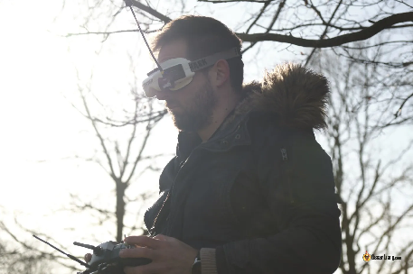  
Вибір правильних FPV-окулярів має вирішальне значення для захоплюючого досвіду занурення у світ FPV-дронів. Знайти ідеальну пару окулярів, яка б відповідала вашим потребам, може бути непростим завданням, адже на ринку представлені різні системи, такі як Analog, DJI, HDZero та Walksnail Avatar. У цьому посібнику ми розповімо про найкращі FPV-окуляри для кожної системи, щоб допомогти вам знайти ідеальну пару для покращення польотів. Незалежно від того, чи ви досвідчений пілот, чи тільки починаєте, цей вичерпний посібник забезпечить вам захоплюючий досвід польоту без перешкод, відповідно до ваших уподобань і бюджету.  
*Деякі посилання на цій сторінці є партнерськими. Я \[автор англомовної версії Оскар Ланг\] отримую комісію (без додаткових витрат для вас), якщо ви робите покупку після натискання одного із цих партнерських посилань. Це допомагає підтримувати безкоштовний контент для спільноти на цьому веб\-сайті. Будь ласка, прочитайте нашу [Політику партнерських посилань](https://oscarliang.com/affiliate-program-policy/) для отримання додаткової інформації.*

Зміст

[Цифрова проти аналогової: як обрати ідеальну FPV-систему](#цифрова-проти-аналогової:-як-обрати-ідеальну-fpv-систему)

[Найкращі FPV-окуляри DJI](#найкращі-fpv-окуляри-dji)

[Найкращі FPV-окуляри для HDZero](#найкращі-fpv-окуляри-для-hdzero)

[Найкращі FPV-окуляри Walksnail Avatar](#найкращі-fpv-окуляри-fatshark-dominator-hd-walksnail-avatar-fpv-goggleswalksnail-avatar)

[Кращі аналогові FPV-окуляри](#кращі-аналогові-fpv-окуляри)

[Найкращі шоломи](#найкращі-шоломи)

[Найкращі аналогові шоломи вартістю до $100](#найкращі-аналогові-шоломи-вартістю-до-$100)

[Дизайн FPV-окулярів](#дизайн-fpv-окулярів)

[Бінокулярні окуляри](#бінокулярні-окуляри)

[Шоломи](#шоломи)

[Ціна](#ціна)

[Роздільна здатність і екран](#роздільна-здатність-і-екран)

[Поле зору (FOV, field of view)](#поле-зору-\(fov,-field-of-view\))

[Співвідношення сторін](#співвідношення-сторін)

[Міжзінична відстань (IPD)](#міжзінична-відстань-\(ipd\))

[Відеоприймач](#відеоприймач)

[Вбудований приймач](#вбудований-приймач)

[Зовнішній модуль приймача](#зовнішній-модуль-приймача)

[Мультиантенні приймачі](#мультиантенні-приймачі)

[Детальний огляд мікросхем приймача](#детальний-огляд-мікросхем-приймача)

[Живлення FPV-окулярів](#живлення-fpv-окулярів)

[Комфорт і зручність](#комфорт-і-зручність)

[Вентилятор проти запотівання лінз](#вентилятор-проти-запотівання-лінз)

[Відеореєстратор (DVR)](#відеореєстратор-\(dvr\))

[Регулювання фокусу (діоптрійна корекція)](#регулювання-фокусу-\(діоптрійна-корекція\))

[Відео вхід і вихід](#відео-вхід-і-вихід)

[Інші функції](#інші-функції)

[Аудіовихід](#аудіовихід)

[Відстеження положення голови](#відстеження-положення-голови)

[Колір окулярів](#колір-окулярів)

[Підтримка 3D](#підтримка-3d)

[Політ з FPV-монітором](#політ-з-fpv-монітором)

[Чи є записи з відеореєстратора (DVR) справедливим відображенням якості FPV-окулярів?](#чи-є-записи-з-відеореєстратора-\(dvr\)-справедливим-відображенням-якості-fpv-окулярів?)

[Заключні думки](#заключні-думки)

[Історія редагування](#історія-редагування)

## **Цифрова проти аналогової: як обрати ідеальну FPV-систему** {#цифрова-проти-аналогової:-як-обрати-ідеальну-fpv-систему}

Перед тим, як вибирати FPV-окуляри, спочатку потрібно вирішити, яку FPV-систему ви будете використовувати.  
FPV-системи можна класифікувати на цифрові та аналогові на основі технології та апаратного забезпечення. У аналоговій FPV-системі використовуються аналогові сигнали для передачі відео, тоді як у цифрових FPV-системах використовуються цифрові сигнали. На практиці, цифрові FPV-системи забезпечують кришталево чисту якість відео, але коштують дорожче, тоді як аналогові FPV-системи забезпечують нижчу роздільну здатність за нижчу ціну. Крім того, цифрові FPV-системи менш чутливі до інтерференції (завад через накладання радіосигналів від інших систем) і мають більшу дальність польоту.  
В даний час існує 3 бренди цифрових FPV-систем: DJI, HDZero та Walksnail Avatar.  
Все ще вагаєтесь, яку FPV-систему обрати? Ознайомтеся з моїм поглибленим аналізом, який допоможе вам прийняти зважене рішення: [https://oscarliang.com/fpv-system/](https://oscarliang.com/fpv-system/)

## **Найкращі FPV-окуляри DJI**  {#найкращі-fpv-окуляри-dji}

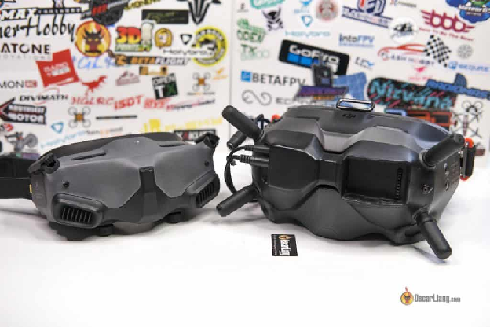

*Зліва: DJI Goggles 2; Справа: DJI Goggles V2*  
Три варіанти окулярів для DJI: DJI Goggles V2, DJI Goggles Integra та DJI Goggles 2\. Всі ці окуляри підтримують старі моделі [Runcam Link](https://oscarliang.com/runcam-phoenix-hd-phoenixhd-nano-link/), FPV Air Unit та найновіші [DJI O3 Air Unit](https://oscarliang.com/dji-o3-air-unit-fpv-goggles-2/).  
Goggles 2 має перевагу над V2 завдяки кращим функціям, таким як запис на екранному дисплеї, потужніше “залізо”, регулювання фокусу та компактний, легкий дизайн. Також мають кращу якість відео з роздільною здатністю 1080p, OLED-екрани та покращену проникність сигналу *\[краща проникність радіохвиль \- краща здатність радіохвилі долати перешкоди з меншими затуханнями \- відповідно, можливість польотів на більш далекі відстані\]*. DJI Goggles 2 з більшою ймовірністю отримає підтримку в майбутньому та буде сумісним з новітніми технологіями. Дізнайтеся більше про Goggles 2 у моєму огляді за посиланням:[https://oscarliang.com/dji-o3-air-unit-fpv-goggles-2/](https://oscarliang.com/dji-o3-air-unit-fpv-goggles-2/)  
DJI Goggles 2 можна знайти у таких постачальників:

* **GetFPV:[https://oscarliang.com/product-l6c2](https://oscarliang.com/product-l6c2)**  
* **RDQ:[https://oscarliang.com/product-ju88](https://oscarliang.com/product-ju88)**  
* **AliExpress:[https://s.click.aliexpress.com/e/\_DeYafE7](https://s.click.aliexpress.com/e/_DeYafE7)**  
* **Amazon:[https://amzn.to/3HDvOXr](https://amzn.to/3HDvOXr)**

Однак окуляри DJI Goggles V2 забезпечують краще прилягання, а також є дешевшим і доступнішим варіантом. Це чудовий варіант, якщо ціна та доступність викликають занепокоєння. Ви також можете використовувати DJI FPV Goggles V2 для аналогових систем, використовуючи AV-вхід, все, що вам потрібно, це лише [модуль аналогового приймача](https://oscarliang.com/rapidfire-fusion/) і [адаптер модуля](https://oscarliang.com/digidapter-adapter/) для підключення приймача.

DJI Goggles V2 можна знайти у таких постачальників:

* **GetFPV:[https://oscarliang.com/product-awxy](https://oscarliang.com/product-awxy)**  
* **RDQ:[https://oscarliang.com/product-fnzl](https://oscarliang.com/product-fnzl)**  
* **NBD:[https://oscarliang.com/product-75fb](https://oscarliang.com/product-75fb)**  
* **AliExpress:[https://s.click.aliexpress.com/e/\_Dd1JR4N](https://s.click.aliexpress.com/e/_Dd1JR4N)**

Однією з головних скарг щодо обох моделей окулярів від DJI є відсутність входу HDMI і підтримки інших цифрових FPV-систем. Найновіші Goggles 2 не мають навіть AV-входу, що робить їх несумісними з аналоговою системою, лише з власною системою DJI. Однак, якщо якість зображення та проникність сигналу(проходження якісного сигналу через перешкоди) є пріоритетними, система DJI, мабуть, є одним із найкращих варіантів на даний момент.  
Нові DJI Goggles Integra — це, по суті, «полегшена» версія Goggles 2\. Заощадивши 150 доларів, ви втратите кілька ключових функцій і матимете менше поле зору (від 51° до 44°). Якщо ви вже плануєте витратити $500-600 на окуляри, подумайте про додаткові $150 на придбання Goggles 2\. Детальніше про Goggles Integra читайте в моєму блозі: [https://oscarliang.com/dji-goggles-integra/](https://oscarliang.com/dji-goggles-integra/)  
У битві DJI Goggles кожна модель має свої унікальні переваги. Рішення в кінцевому підсумку залежить від ваших особистих уподобань і потреб. DJI Goggles Integra виділяють як привабливий і доступний вибір для тих, хто входить в екосистему DJI. Однак, враховуючи відносно невелику різницю в ціні ($150), Goggles 2 є більш привабливим варіантом, враховуючи додаткові функції та можливості. Якщо у вас дійсно обмежений бюджет, V2 пропонує найкраще співвідношення ціни і якості, на мою думку.

## **Найкращі FPV-окуляри для HDZero** {#найкращі-fpv-окуляри-для-hdzero}

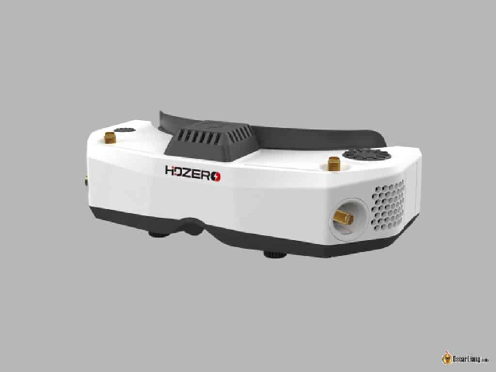

Якщо ви використовуєте систему HDZero, то окуляри HDZero Goggles \- ідеальний вибір, без сумніву. Ці окуляри не лише найкращі для HDZero, а й для аналогових систем, і вони є найкращими не-Walksnail окулярами для систем Walksnail. На мою думку, на даний момент це найбільш універсальні окуляри на ринку. Дізнайтеся більше про окуляри HDZero в цьому огляді: [https://oscarliang.com/hdzero-fpv-goggles/](https://oscarliang.com/hdzero-fpv-goggles/)

Окуляри HDZero можна знайти у таких постачальників:

* **AliExpress:[https://s.click.aliexpress.com/e/\_DFMYx5j](https://s.click.aliexpress.com/e/_DFMYx5j)**  
* **Amazon:[https://amzn.to/3FPdbPh](https://amzn.to/3FPdbPh)**

Для тих, хто хоче користуватися HDZero, але має обмежений бюджет, існують більш доступні альтернативи. По-перше, [є кілька шоломів від Fatshark і Emax](https://oscarliang.com/hdzero-digital-fpv-system/#FPV-Goggles) які стандартно підтримують HDZero.  
Крім того, ви можете придбати [автономний модуль відеоприймача HDZero](https://oscarliang.com/hdzero-vrx-2022/) сумісний з FPV-окулярами і екранами з входом HDMI. Цей економічно вигідний варіант дозволить вам насолоджуватися HDZero без зайвих витрат.

## **Найкращі FPV-окуляри 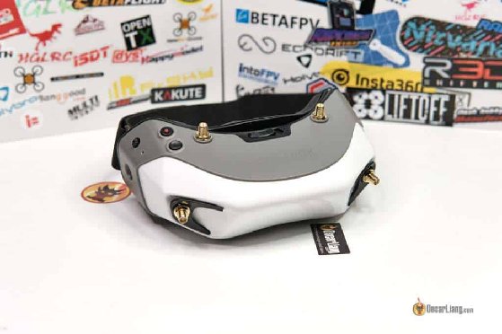Walksnail Avatar**  {#найкращі-fpv-окуляри-fatshark-dominator-hd-walksnail-avatar-fpv-goggleswalksnail-avatar}

Безсумнівно, найкращими FPV-окулярами для системи Walksnail Avatar є самі окуляри Walksnail Avatar Goggles. Щоб отримати максимум від системи Walksnail, ці окуляри просто необхідні. Ознайомтеся з моїм докладним оглядом, щоб дізнатися всі подробиці про ці окуляри: [https://oscarliang.com/walksnail-avatar-digital-fpv-system/](https://oscarliang.com/walksnail-avatar-digital-fpv-system/)  
Fatshark Dominator HD і Walksnail Avatar майже ідентичні, єдина відмінність \- це їх колір. Як результат, прошивка між ними сумісна. Просто виберіть свій улюблений колір. Однак вони мають той самий недолік, що й DJI Goggles 2 \- відсутність відеовходу, тому вони не підтримують інші FPV-системи.

Fatshark Dominator можна знайти HD тут:

* **AliExpress:[https://s.click.aliexpress.com/e/\_DmgXCCl](https://s.click.aliexpress.com/e/_DmgXCCl)**  
* **GetFPV:[https://oscarliang.com/product-m10h](https://oscarliang.com/product-m10h)**  
* **Amazon:[https://amzn.to/3CJA4kN](https://amzn.to/3CJA4kN)**

Walksnail Avatar можна знайти тут:

* **AliExpress:[https://s.click.aliexpress.com/e/\_DCFgL51](https://s.click.aliexpress.com/e/_DCFgL51)**  
* **RDQ:[https://oscarliang.com/product-46xo](https://oscarliang.com/product-46xo)**

Більш бюджетним варіантом, розробленим для системи Walksnail є [Fatshark Recon HD](https://oscarliang.com/walksnail-avatar-digital-fpv-system/#Fatshark-Recon-HD-FPV-Goggles). Однак цей шолом підтримує лише до 60 кадрів в секунду з роздільною здатністю 1080p, тобто підтримка режиму низької затримки 100 кадрів в секунду в системі Avatar є неможливою за його використання. Це призводить до збільшення затримки приблизно на 10 мс порівняно з режимом 100 кадрів/с. Крім того, через вбудовані антени шолом є менш ідеальним для польотів на великі відстані. Незважаючи на ці недоліки, це хороший вибір для тих, хто має обмежений бюджет.  
Поєднавши окуляри HDZero Goggles із відеоприймачем Walksnail Avatar, ви також можете насолоджуватися перевагами системи Walksnail Avatar. [Як раніше зазначалось у огляді відеоприймача Walksnail Avatar](https://oscarliang.com/walksnail-avatar-vrx/#Goggles-Compatibility), ця комбінація є досить дорогою, але її варто розглянути, якщо ви хочете використовувати системи HDZero, аналогову систему та Walksnail одночасно.

## **Кращі аналогові FPV-окуляри**  {#кращі-аналогові-fpv-окуляри}

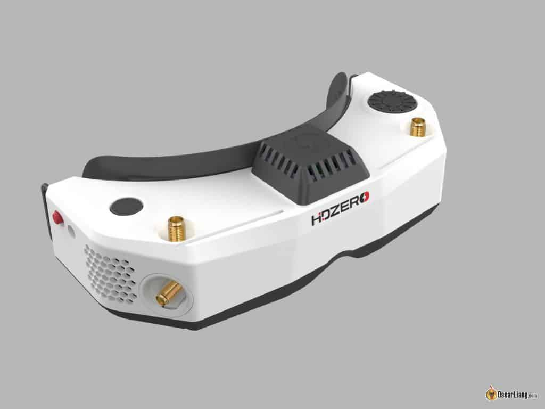

Розроблені для HDZero, окуляри HDZero Goggles також забезпечують фантастичний аналоговий досвід завдяки розширеним можливостям фільтрації сигналу та деінтерлейсингу аналогового сигналу (*англ*. de-interlacing \- [процес конвертації аналогового відео для відображення на цифровому дисплеї окулярів](https://uk.wikipedia.org/wiki/%D0%94%D0%B5%D1%96%D0%BD%D1%82%D0%B5%D1%80%D0%BB%D0%B5%D0%B9%D1%81%D0%B8%D0%BD%D0%B3), для FPV актуальний у контексті [конвертації відео](https://docs.google.com/document/d/1BBo-J2But_a2HEB3InJ_S4T_ukHyB0UbQlSXOKIWLq8/edit#heading=h.g7yrl6kni9xq) між цифрою і аналогом). Однак вам потрібно буде придбати адаптер для встановлення модулів аналогового прийому, що збільшує загальну вартість окулярів.

HDZero Goggles можна знайти у таких постачальників:

* **AliExpress:[https://s.click.aliexpress.com/e/\_DFMYx5j](https://s.click.aliexpress.com/e/_DFMYx5j)**  
* **Amazon:[https://amzn.to/3FPdbPh](https://amzn.to/3FPdbPh)**

Адаптер аналогового модуля можна знайти тут: [https://s.click.aliexpress.com/e/\_DmnRE0H](https://s.click.aliexpress.com/e/_DmnRE0H)

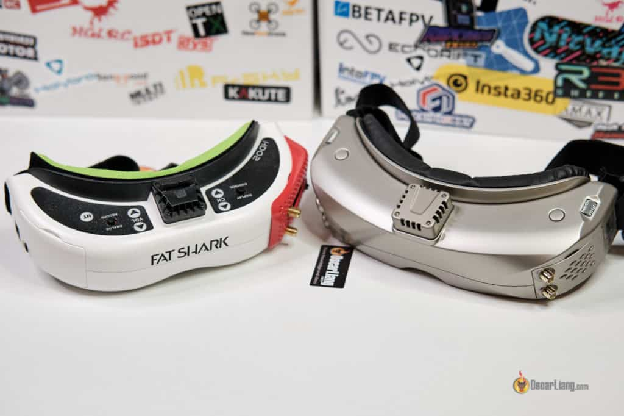

*Зліва: Fatshark HDO2; Справа: Skyzone SKY04X*  
Для тих, хто має обмежений бюджет і впевнений, що користуватиметься лише аналоговими окулярами і ніколи не перейде на системи HDZero чи Avatar, найкращими варіантами є [Fatshark HDO2](https://oscarliang.com/fatshark-hdo2-fpv-goggles/) і [Skyzone SKY04X](https://oscarliang.com/skyzone-sky04x/). Ці окуляри мають схожі технічні характеристики: OLED-екрани з чітким та якісним зображенням з роздільною здатністю 1280×960, поле зору 46°, регульований фокус і високоякісна обробка.  
Skyzone SKY04X вирізняється зручним для користувача екранним меню, модулем приймача, що входить до комплекту та наявністю двох лицьових масок. Хоча HDO2 є надійним вибором, SKY04X має кращу ціну і користувацький досвід у порівнянні з попереднім варіантом.

**Придбати SKY04X можна тут:**

* **Banggood –[https://oscarliang.com/product-9voe](https://oscarliang.com/product-9voe)**  
* **RDQ –[https://oscarliang.com/product-j1cf](https://oscarliang.com/product-j1cf)**  
* **Amazon –[https://amzn.to/30262FJ](https://amzn.to/30262FJ)**  
* **NBD –[https://oscarliang.com/product-h12o](https://oscarliang.com/product-h12o)**

**Придбати HDO2 можна тут:**

* **AliExpress:[https://s.click.aliexpress.com/e/\_DCJVcUh](https://s.click.aliexpress.com/e/_DCJVcUh)**  
* **RDQ:[http://bit.ly/330JEg0](https://bit.ly/330JEg0)**  
* **GetFPV:[http://bit.ly/2NnWX3s](https://bit.ly/2NnWX3s)**  
* **Amazon:[https://amzn.to/2K2F21v](https://amzn.to/2K2F21v)**

## **Найкращі шоломи** {#найкращі-шоломи}

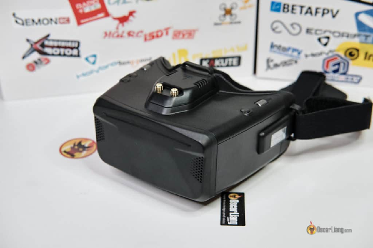

Для тих, хто не може дозволити собі витрати 600 доларів на FPV-окуляри, Skyzone Cobra X є чудовою альтернативою. Хоча це трохи дороговартісний шолом, Cobra X має збірку гідної якості та безліч функцій. Це чудовий вибір для тих, хто використовує лише аналоговий формат.  
Хоча Cobra X має вхід HDMI і підтримує відеоприймачі HDZero та Walksnail, затримка відео помітно вища, ніж у інших шоломів. Тим не менш, Skyzone Cobra X є надійним варіантом для пілотів, що використовують аналогові системи, та шукають більш доступні за ціною якісні FPV-шоломи. Щоб дізнатися більше про цей шолом [перегляньте мій огляд](https://oscarliang.com/skyzone-cobra-s-x-fpv-goggles/).

**Купуйте Skyzone Cobra X тут:**

* **AliExpress (S і X):[https://s.click.aliexpress.com/e/\_DmFcfqZ](https://s.click.aliexpress.com/e/_DmFcfqZ)**  
* **RDQ (версія S):[https://oscarliang.com/product-ui8f](https://oscarliang.com/product-ui8f)**  
* **RDQ (версія X):[https://oscarliang.com/product-xslf](https://oscarliang.com/product-xslf)**

## **Найкращі аналогові шоломи вартістю до $100**  {#найкращі-аналогові-шоломи-вартістю-до-$100}

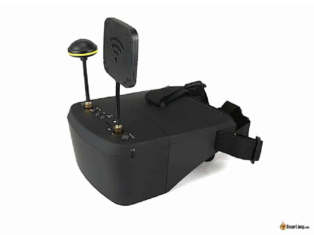

За необхідності придбання недорогого аналогового FPV-шолому, Eachine EV800D на мою думку є найкращим вибором. Ця перевірена та надійна модель має широкий спектр функцій, включаючи мультиантенні приймачі (хіпс., лін. ж.: «дайверсіті-приймач»), вбудований відеореєстратор та антени. Вражаючий набір функцій і доступна ціна роблять EV800D чудовим вибором для новачків або тих, хто має обмежений бюджет. Шолом EV800D має один великий екран, який додатково збільшується за допомогою лінзи, що забезпечує набагато більше поле зору порівняно з більш дорогими компактними окулярами. Однак, недоліком шолому є значно об’ємніша і важча конструкція, яка може підійти не всім. Крім того, деякі пілоти можуть вважати великий кут огляду занадто великим, оскільки вони змушені переводити погляд, дивлячісь на різні ділянки екрану.  
Для новачків, які не можуть виправдати покупку висококласних окулярів, Eachine EV800D є ідеальним варіантом для початкового рівня.

**Придбати EV800D можна тут:**

* **AliExpress:[https://s.click.aliexpress.com/e/\_DdkKba7](https://s.click.aliexpress.com/e/_DdkKba7)**  
* **GetFPV:[https://oscarliang.com/product-cd8a](https://oscarliang.com/product-cd8a)**  
* **RDQ:[https://oscarliang.com/product-4c0e](https://oscarliang.com/product-4c0e)**  
* **Banggood:[https://oscarliang.com/product-g91l](https://oscarliang.com/product-g91l)**

---

## **Дизайн FPV-окулярів**  {#дизайн-fpv-окулярів}

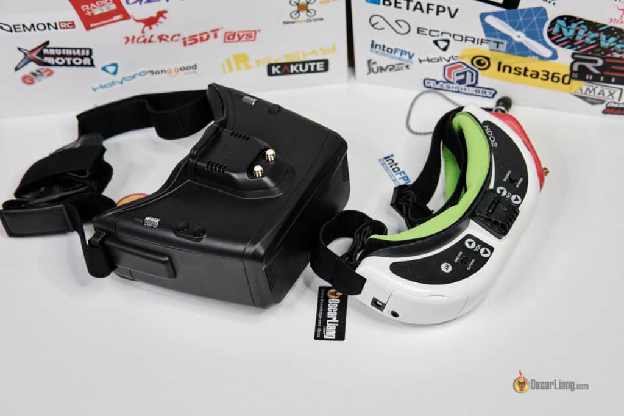

Що стосується дизайну FPV-окулярів, ми можемо розділити їх на дві основні групи, кожна з яких використовує різні технології відображення: бінокулярні окуляри та шоломи. Це безпосередньо впливає на форм-фактор, комфорт, ціну та загальну естетику.

### **Бінокулярні окуляри** {#бінокулярні-окуляри}

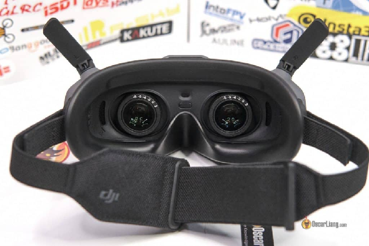

Коли ви уявляєте пілотів FPV, на думку спадає образ людини в бінокулярних окулярах. Бінокулярні FPV-окуляри, найпопулярніший тип,  — це компактні пристрої, з двома незалежними екранами — по одному для кожного ока. Через необхідність використання двох екранів і спеціалізованої електроніки, ці окуляри зазвичай дорожчі і коштують від $400 до $700.  
Бінокулярні FPV-окуляри мають витончений дизайн з двома невеликими екранами, на які виводиться дублююче зображення. Завдяки такому компактному форм-фактору, вони значно менші і легші, ніж шоломи. Тому їх легко носити з собою,  і у вас не буде відчуття, що ви засунули обличчя в тостер\! Однак будьте готові заплатити за зручність і естетику мікроекранів у цих окулярах.

| Модель |  X Skyzone SKY04L | 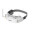Eachine EV200D | 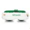 Fatshark Attitude V6 | 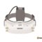Eachine EV300D | Skyzone SKY02O |
| :---: | :---: | :---: | :---: | :---: | :---: |
| **Ціна** | $379,99  | $300  | $350  | $360 | $370  |
| **Магазини** | [GetFPV](https://www.getfpv.com/skyzone-sky04l-v2-lite-lcos-5-8ghz-48ch-fpv-goggles-w-steadyview-receiver.html?afid=M1RXSkVIZ2tWV1E9) | Припинено | Припинено | [Banggood](https://oscarliang.com/product-wobf) | [Banggood](https://oscarliang.com/product-yaj8) |
| **Екран** | LCOS | LCD | LCOS | LCOS | OLED |
| **Поле зору (FOV**)  | 39° | 42° | 39° | 42° | 29° |
| **Роздільна здатність** | 1280 X 960 | 1280 x 720 | 1280 X 960 | 1280 x 960 | 640 x 400 |
| **Співвідношення сторін** | 4:3 і 16:9 | 4:3 і 16:9 | 4:3 і 16:9 | 4:3 і 16:9 | 16:10 |
| **Міжзінична відстань (IPD)** | 58-71мм | 56-72 мм | 54-74 мм | 56-72 мм | 59-69 мм |
| **Діоптрійна корекція** | від \+6 до \-6 | Немає | від \+2 до \-6 | Уточнюється | Немає |
| **Модуль радіоприймача** | В комплекті модульний | В комплекті модульний | В комплекті модульний | В комплекті модульний | Вбудований 48 каналів |
| **Відеореєстратор (DVR)** | Так | Так | Так | Так | Так |
| **Аудіовихід** | Так | Так | Так | Так | Так |
| **Вхід HDMI** | Так | Так | Так | Так | Так |
| **Вага** | 267г | Уточнюється | 199г | 208г | 207г |

|  |  |  |  |  |  |
| :---- | :---- | :---- | :---- | :---- | :---- |

| Модель | 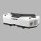HDZero Goggles | 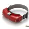Eachine EV300O | 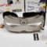Skyzone SKY04X | 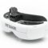Fatshark HDO2 | 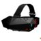Orqa FPV.ONE Pilot |
| :---- | :---- | :---- | :---- | :---- | :---- |
| **Ціна** | $599,99  | $450  | $500 | $500  | $569 |
| **Магазини** | [AliExpress](https://s.click.aliexpress.com/e/_DFMYx5j) | [Banggood](https://oscarliang.com/product-ekrs) | [RDQ](https://oscarliang.com/product-j1cf) |[NBD](https://oscarliang.com/product-h12o) |[Banggood](https://oscarliang.com/product-9voe) | [AliExpress](https://s.click.aliexpress.com/e/_DCJVcUh) | [GetFPV](https://oscarliang.com/product-sfki) |
| **Екран** | OLED | OLED | OLED | OLED | OLED |
| **Поле зору (FOV)** | 46° | 38° | 46° | 46° | 37° |
| **Роздільна здатність** | 1920x1080 | 1024×768 | 1280x960 | 1280×960 | 1280×960 |
| **Співвідношення сторін** | 16:9 і 4:3 | 4:3 і 16:9 | 4:3 і 16:9 | 4:3 і 16:9 | 4:3 і 16:9 |
| **Міжзінична відстань (IPD)** | 57-70мм | 58-71мм | 58-71мм | 54-74 мм | 56-74 мм |
| **Діоптрійна корекція** | від \+6 до \-6 | від \+6 до \-6 | від \+6 до \-6 | від \+2 до \-6 | від \-4 до \+4 |
| **Модуль відеоприймача** | Не входить | В комплекті модульний | В комплекті модульний | Не входить | Не входить |
| **Аудіовихід** | Так | Так | Так | Так | Так |
| **Вхід HDMI** | Так | Так | Так | Так | Так |
| **Вага** | 360г | 262г | 267г | 208г | 210г |

### **Шоломи** {#шоломи}

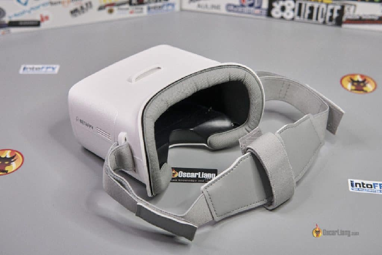

На відміну від бінокулярних окулярів, у шоломах використовується один LCD-екран, зазвичай розміром від 3 до 6 дюймів. Більша площа екрану означає більше поле зору (FOV), що забезпечує більш захоплюючий досвід польоту для тих, хто цього прагне. Але пілоти гоночних дронів можуть віддати перевагу меншому куту огляду, щоб під час змагань підтримувати фокус, подібний до тунельного зору.  
Однак у шоломах часто використовують дешевші екрани, що призводить до нижчої якості зображення порівняно з OLED-екранами в бінокулярних окулярах. Незважаючи на це, шоломи можуть бути більш зручними та бюджетними, що робить їх чудовим вибором як для звичайних пілотів, так і для любителів.  
Шоломи також підходять для користувачів із особливими потребами, наприклад для тих, хто носить окуляри або має нестандартні показники міжзіничної відстані  (IPD). Їх містка конструкція дозволяє носити звичайні окуляри для корекції зору під час використання, а відсутність обмежень міжзіничної відстані (IPD) підходить для людей, яким важко сфокусуватися на невеликих екранах в бінокулярних окулярах.

| Модель | 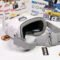BetaFPV VR03 | 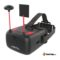Eachine EV800D | 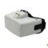Skyzone Cobra S | 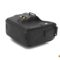Skyzone Cobra X | 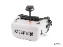Fatshark Scout |
| :---: | :---: | :---: | :---: | :---: | :---: |
| **Ціна** | $69,99  | $99  | $170 | $220  | $230  |
| **Магазини** | [BetaFPV](https://oscarliang.com/product-ckgq) | [AliExpress](https://s.click.aliexpress.com/e/_DdkKba7) |[GetFPV](https://oscarliang.com/product-cd8a) | Припинено | [AliExpress](https://s.click.aliexpress.com/e/_DmFcfqZ) |[RDQ](https://oscarliang.com/product-xslf) | [RDQ](https://oscarliang.com/product-5zp6) |[GetFPV](https://oscarliang.com/product-f8bp) |
| **Роздільна здатність** | 800 x 480 | 800 x 480 | 800 x 480 | 1280 x 720 | 1136 x 640 |
| **Співвідношення сторін** | 16:9 | 16:9 і 4:3 | 4:3 | 16:9 і 4:3 | 16:9 |
| **Поле зору (FOV)** | 40° | 50°+ | 50° | 50° | 50° |
| **Вбудований відеоприймач (VRX)** | Так | Так | Так | Так | Так |
| **Канали** | 48ch | 40ч | 48ch | 48ch | 40ч |
| **Відеореєстратор (DVR)** | Так | Так | Так | Так | Так |
| **Мультиантенний приймач** | Немає | Так | Так | Так | Немає |
| **Вага** | 300г | 362г | 332г | 332г | 337г |

## **Ціна** {#ціна}

Потрапити у світ FPV-пілотування не обов'язково означає розоритися. Ви можете почати зі скромного монітора за $30 або вибрати шолом за $100. Однак, якщо вам потрібні першокласні функції та якість зображення, будьте готові викласти $500 або більше за пару високоякісних FPV-окулярів. Але не бійтеся — є безліч доступних варіантів, які забезпечують відмінну продуктивність.  
Пам’ятайте, FPV-окуляри – це довгострокова інвестиція\! Варто витратити трохи більше.  
На відміну від дронів, FPV-окуляри не падають та не розбиваються (за умови що ви носите їх на голові, а не прикріплюєте до дрона). Оскільки окуляри є одним із найміцніших і довговічних компонентів у вашому арсеналі, ви будете використовувати окуляри з усіма своїми моделями дронів.  
Тому не соромтеся інвестувати в окуляри FPV стільки, скільки ви можете собі дозволити, адже вони будуть служити вам довго і надійно.

## **Роздільна здатність і екран** {#роздільна-здатність-і-екран}

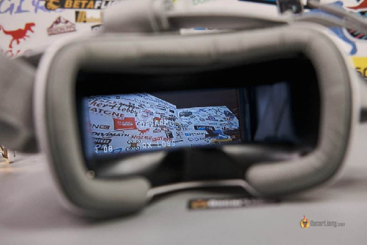

Оскільки пілоти покладаються виключно на свій зір під час польоту, дуже важливо, щоб зображення було чітким і ясним, щоб пілоти могли виконувати надзвичайно точні повороти та маневри, що неможливо зробити з розмитим зображенням.  
Як правило, вища роздільна здатність означає кращу якість зображення \- за умови, що відеопотік з камери відповідає роздільній здатності екрана. Для цифрових FPV-систем, що передають відео з роздільною здатністю 720p або навіть 1080p, окуляри з вищою роздільною здатністю, безсумнівно, покращать враження від використання. Однак для аналогових FPV-систем різниця між використанням окулярів нижчого класу з роздільною здатністю 720p і вищого класу з роздільною здатністю 1080p мінімальна, враховуючи відносно низьку роздільну здатність зображення з аналогових камер.  
Тип екрана також може відігравати значну роль у якості зображення. OLED-екрани зазвичай мають більш контрастні та яскраві кольори порівняно з дешевшими LCD або LCOS-екранами, що покращує загальний візуальний досвід.

## **Поле зору (FOV, field of view)** {#поле-зору-(fov,-field-of-view)}

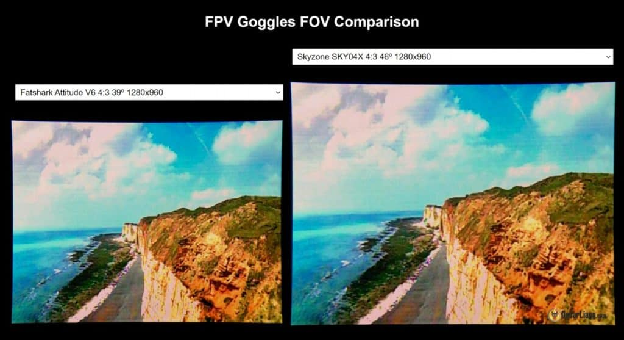

Простими словами, поле зору (FOV) — це вимір розміру FPV-екрану. Більше поле зору відповідає більшому екрану та потенційно означає більший ефект занурення. Наприклад, з полем зору 35 градусів у FPV-окулярах, краї екрана знаходяться під кутом 35 градусів відносно центра ока. Зауважте, що існує горизонтальне, вертикальне та діагональне поле зору, які представляють різні поля зору екрану. Діагональне поле зору є найпоширенішим вимірюванням в FPV-окулярах; якщо поле зору явно не вказано, зазвичай мається на увазі діагональне поле зору.  
Більше поле зору може створити більш захоплюючий досвід, але занадто велике поле може відволікати. Через більшу ширину екрану, більше поле зору ускладнює перегляд зображення на краях. Під час перегонів важливо бачити все, що відбувається перед очима, щоб приймати рішення за долі секунди. Крім того, менший екран гарантує, що вам не доведеться постійно рухати очима, щоб читати інформацію на екрані.  
Як правило, шоломи мають поле зору від 50 до 80 градусів, тоді як бінокулярні окуляри мають поле зору від 30 до 50 градусів. Для порівняння поля зору різних FPV-окулярів можна використовувати цей інструмент: [https://oscarliang.com/js/fpvgogglefov.html](https://oscarliang.com/js/fpvgogglefov.html).  
Зрештою, поле зору – це питання особистих уподобань. Для бінокулярних окулярів я віддаю перевагу діапазону від 40 до 45 градусів. Не плутайте поле зору (FOV) FPV-окулярів із кутом огляду камери, це абсолютно не пов’язані між собою величини.

## **Співвідношення сторін** {#співвідношення-сторін}

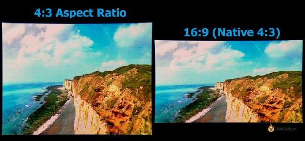

Співвідношення сторін екрану відіграє вирішальну роль у визначенні того, як відео відображається на екрані, що в кінцевому підсумку впливає на роздільну здатність і поле зору.  
Найпоширенішими співвідношеннями сторін для FPV-дронів є 16:9 і 4:3. Хоча існують й інші співвідношення сторін, вони рідкісні і часто призводять до спотворення зображення через невідповідність між камерою та екраном. Важливо переконатися, що ваші FPV-окуляри підтримують як 16:9, так і 4:3, або мають правильне співвідношення сторін відповідно до вашої камери. Використання неправильного співвідношення сторін може призвести до розтягування або стискання зображення.  
Багато FPV-окулярів (і камер) зараз мають можливість перемикання між співвідношеннями сторін, що забезпечує більшу універсальність і сумісність. Однак пам’ятайте яке вас співвідношення сторін дисплею шолома чи окулярів, оскільки перемикання на інші співвідношення сторін може призвести до кадрування та фактично зменшити загальне поле зору та роздільну здатність. Наприклад, екран 4:3 із роздільною здатністю 1280 × 960 і полем зору 46 градусів, при переключенні на 16:9, матиме меншу роздільну здатність 1280 × 720 і поле зору 42 градуси (з обрізаними верхнім та нижнім краями).

## **Міжзінична відстань (IPD)** {#міжзінична-відстань-(ipd)}

Міжзінична відстань (IPD) — це відстань між центрами двох зіниць. Цей показник важливий для бінокулярних окулярів, у яких використовуються окремі екрани для кожного ока і потребується певне розташування щоб сформувалось правильне зображення для користувача. Використання окулярів із неправильним налаштуванням міжзіничної відстані може призвести до того, що краї зображення будуть розмитими.  
Оскільки показник міжзіничної відстані у всіх людей різний, важливо знати свій показник при виборі FPV-окулярів і переконатися, що вони підтримують ваші конкретні виміри. Більшість бінокулярних FPV-окулярів дозволяють регулювати цей показник, але лише в певному діапазоні.  
Однак міжзінична відстань не є проблемою при використанні шоломів.

## **Відеоприймач** {#відеоприймач}

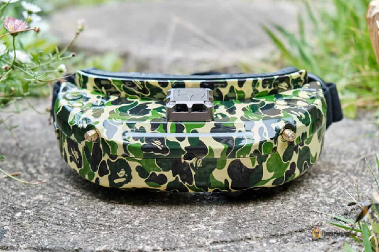

Щоб FPV-окуляри працювали, вони повинні бути обладнані відповідним модулем відеоприймача (VRX). Це дозволить їм отримувати зображення з дрона.

### **Вбудований приймач** {#вбудований-приймач}

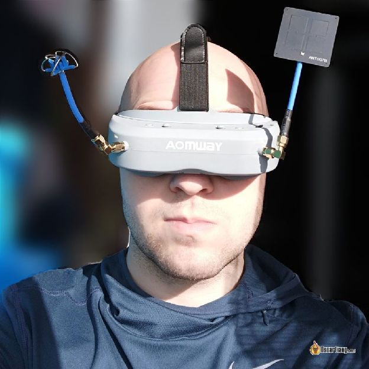

Деякі FPV-окуляри комплектуються вбудованим відеоприймачем, що дуже зручно, оскільки вони працюватимуть одразу після першого ввімкнення, усуваючи потребу в додатковому придбанні приймача.  
Вбудовані приймачі зазвичай не можна оновити, і ви будете обмежені вбудованими функціями. За необхідності оновити приймач, потрібно буде повністю замінити окуляри.

### **Зовнішній модуль приймача** {#зовнішній-модуль-приймача}

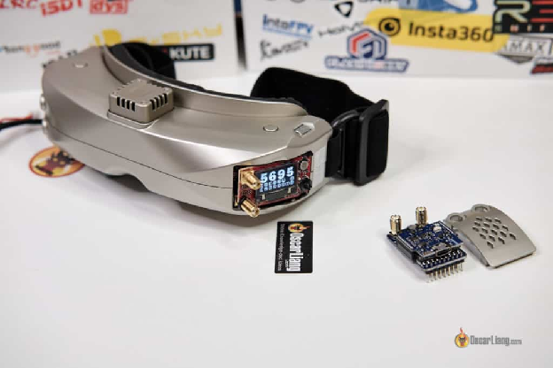

Якщо окуляри не мають вбудованого відеоприймача, можна обрати один із багатьох потужних модулів, що продаються на ринку додаткових компонент. Ці модулі зазвичай мають вищу якість відео та додаткові функції, які покращують ваш досвід польотів. Більшість зовнішніх приймачів підтримують рознесення антен \- diversity setup *\[англ. diversity \- режим, при якому приймач вибирає найкращий сигнал з двох антен, що знижує можливість повної втрати сигналу\]*, що покращує якість відеоканалу. Хоча зовнішні модулі вимагають більших витрат, інвестиції в них цілком виправдовують себе завдяки покращеній продуктивності та пристосовуваності.

### **Мультиантенні приймачі** {#мультиантенні-приймачі}

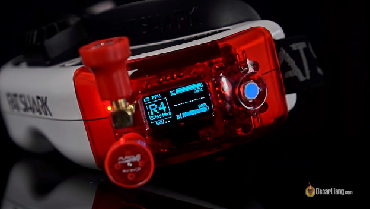

Збірки з рознесеними антенами включають два відеоприймачі в одному модулі, автоматично обирається приймач із сильнішим сигналом для забезпечення відеозв’язку найкращої якості. Деякі вдосконалені збірки з рознесеними антенами об’єднують два сигнали в один, мінімізуючи переривання відео і статичні перешкоди — це часто називають система “з чесним рознесенням”.  
Старіші покоління збірок з рознесеними антенами просто перемикалися на сильніший сигнал, що призводило до миттєвої появи порожнього екрану під час перемикання. Однак новіші покоління, такі як TBS Fusion, ImmersionRC rapidFIRE і SteadyView від Skyzone, поєднують сигнали з двох джерел для створення відео кращої якості. Деякі навіть мають так звану технологію відновлення імпульсів синхронізації ( *англ*. Sync Pulse Reconstruction технологія аналізу прийнятого сигналу і відновлення спотворених синхронізаційних імпульсів) для запобігання переривання відео, коли сигнал слабкий.  
Коротше кажучи, система з «чесним рознесенням» є обов’язковою частиною сучасних аналогових FPV-окулярів, оскільки вона значно покращує якість відео.  
Найефективнішими додатковими модулями є Rapidfire і TBS Fusion. Вони мають таку ж максимальну дальність дії, як і інші модулі, але мають більшу перевагу у боротьбі з багатопроменевими перешкодами *\[коли відбитий від поверхонь радіосигнал приходить і накладається на основний\]*. Для отримання додаткової інформації про те, який модуль купити, дивіться мій огляд: [https://oscarliang.com/rapidfire-fusion/](https://oscarliang.com/rapidfire-fusion/)

**ImmersionRC Rapidfire модуль можна знайти тут:**

* **Banggood:[https://s.click.aliexpress.com/e/\_DlKuG0V](https://s.click.aliexpress.com/e/_DlKuG0V)**  
* **GetFPV:[https://oscarliang.com/product-7se8](https://oscarliang.com/product-7se8)**  
* **RDQ:[https://oscarliang.com/product-38n2](https://oscarliang.com/product-38n2)**

**Отримати модуль TBS Fusion можна тут:**

* **AliExpress:[https://s.click.aliexpress.com/e/\_DkXFpMh](https://s.click.aliexpress.com/e/_DkXFpMh)**  
* **GetFPV:[http://bit.ly/2RcYKv6](http://bit.ly/2RcYKv6)**  
* **Amazon:[https://amzn.to/2RwJN6l](https://amzn.to/2RwJN6l)**

Модуль мультиантенного приймача має дві антени, які можуть бути спрямовані  у різних напрямках. Ви навіть можете використовувати різні типи антен, наприклад спрямовану *\[приймають сигнал переважно з одному напрямку\]* та всеспрямовану *\[забезпечують прийом сигналу з будь-якого напрямку\]*, для отримання оптимальних результатів в залежності від застосування.  
Читати далі: [Як вибрати найкращі FPV-антени](https://oscarliang.com/best-fpv-antenna/).

### **Детальний огляд мікросхем приймача** {#детальний-огляд-мікросхем-приймача}

Багато аналогових відеоприймачів використовують одну і ту саму мікросхему – RTC6715, мікросхему приймача, створену компанією RichWave. RTC6705 \- мікросхема передавача. Наскільки нам відомо, RTC6715 — це єдина мікросхема на ринку, якою можна управляти через послідовний периферійний інтерфейс (SPI). Якщо ви натрапили на модуль приймача, який використовує DIP-перемикачі *\[коробочка з важелями на платі\]* для зміни каналів, швидше за все, у ньому використовується мікросхема, якою не можна управляти через послідовний периферійний інтерфейс (SPI).  
Ось деякі ключові особливості RTC6715:

* Живиться від мережі 3,3 В  
* Чутливість \-85 дБм

Камера надсилає сигнал синхронізації, але через багатопроменевість або втрату сигналу синхроімпульси іноді можуть спотворюватися і не зчитуватися в окулярах.  Щоб мінімізувати мерехтіння екрана, синхроімпульси повинні генеруватися на приймачі.  
Більшість аналогових відеоприймачів 5,8 ГГц відрізняються насамперед обробкою відеосигналу та програмним забезпеченням. Існують деякі відмінності у фільтрації радіочастотного сигналу та якості компонентів, але різниця в апаратній чутливості між найкращим і найгіршим модулями приймача зазвичай становить лише 1-3 дБ.

## **Живлення FPV-окулярів**  {#живлення-fpv-окулярів}

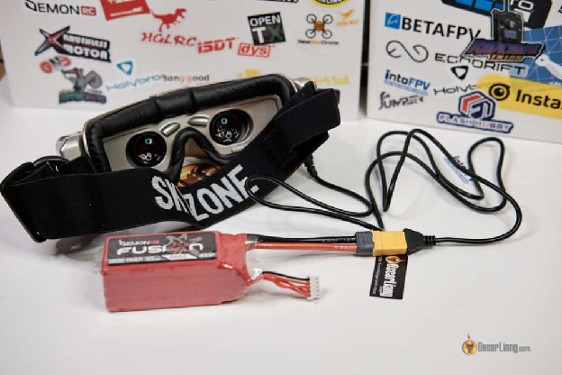

Зазвичай FPV-окуляри живляться від одного із двох джерел: вбудованого акумулятора або зовнішнього акумулятора. Більшість FPV-окулярів працюють від зовнішнього акумулятора, який зазвичай не входить у комплект. Це можуть бути LiPo або літій-іонні акумулятори.  
Для окулярів, які підтримують 2S, хорошим варіантом є літій-іонний акумулятор Auline 2S 4800mAh Li-Ion Goggle:

* **Amazon:[https://amzn.to/3mSco9s](https://amzn.to/3mSco9s)**  
* **RDQ:[https://oscarliang.com/product-kce6](https://oscarliang.com/product-kce6)**  
* **GetFPV:[https://oscarliang.com/product-j5q9](https://oscarliang.com/product-j5q9)**

Хоча існують акумулятори, розроблені спеціально для живлення FPV-окулярів, використання акумулятора дрона для живлення окулярів, які підтримують до 4S (а деякі навіть до 6S), є зручним рішенням. Обов'язково стежте за напругою акумулятора, щоб уникнути його розрядки під час польоту. Важливо мати якесь попередження про низький заряд.  
При оцінці акумуляторів для FPV-окулярів, слід враховувати кілька факторів:

1. Розташування: визначте, чи акумулятор вбудованиий в окуляри чи закріплений на ремінці. Вбудовані акумулятори мають більш елегантний вигляд і простіше управління, а також дозволяють окулярам самостійно відстежувати стан заряду та виводять на екран попередження перед розрядкою. З іншого боку, зовнішні акумулятори можна замінити в польових умовах і зарядити за допомогою стандартного зарядного обладнання.  
2. Ємність: оцініть очікуваний час автономної роботи. Чи вистачить його на весь сеанс польоту? Рекомендується обирати обладнання з принаймні 2 годинами автономної роботи, щоб не відволікатися на заряд акумулятора.  
3. Зарядка: зверніть увагу на спосіб заряджання акумулятора. Деякі акумулятори можна заряджати від автомобільного прикурювача або USB-порту, для інших потрібен зарядний пристрій LiPo.

## **Комфорт і зручність** {#комфорт-і-зручність}

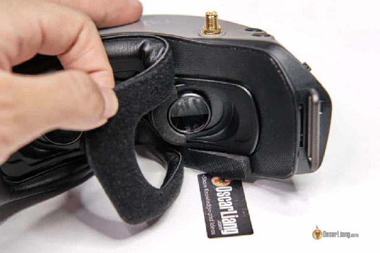

Комфорт є, мабуть, найважливішим фактором при виборі FPV-окулярів, але його нелегко визначити, просто прочитавши специфікації або переглянувши відгуки. У всіх людей різна будова обличчя, тому окуляри, зручні для однієї людини, можуть бути незручними для іншої. Наприклад, деякі окуляри можуть тиснути на ніс/перенісся одним людям, в той час як іншим вони ідеально підходитимуть.  
Питання зручності носіння, як правило, важливе для бінокулярних окулярів, тоді як шоломи, як правило, не сворюють цих проблем. Втім, якщо є сумніви, ми рекомендуємо відвідати кілька FPV-тусовок і запитати людей, чи можна приміряти їх окуляри, щоб отримати уявлення про те, що найкраще підходить саме вам.

## **Вентилятор проти запотівання лінз** {#вентилятор-проти-запотівання-лінз}

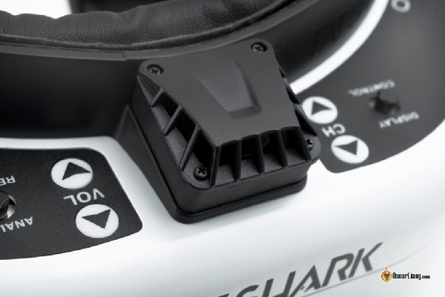

У спекотних і вологих умовах окуляри можуть запотівати, що може суттєво вплинути на політ. Деякі окуляри мають вбудований вентилятор (або навіть кілька вентиляторів) для вирішення цієї проблеми. Ці вентилятори допомагають повітрю циркулювати всередині окулярів, запобігаючи запотіванню лінз і забезпечуючи чіткий огляд. Якщо ви плануєте літати в жарких країнах або районах з підвищеною вологістю, наявність належного вентилятора проти запотівання є важливою особливістю, яку слід враховувати при виборі FPV-окулярів.

## **Відеореєстратор (DVR)** {#відеореєстратор-(dvr)}

DVR або цифровий відеореєстратор — це функція, що дозволяє записувати відео, яке ви бачите в окулярах, на [карту micro SD](https://oscarliang.com/sd-cards-fpv/). Це схоже до оснащення вашого FPV-дрона екшн-камерою HD, але без збільшення ваги чи наявності аеродинамічних втрат через встановлення камери. Крім того, вам не доведеться турбуватися про пошкодження екшн-камери під час падіння. Однак варто зазначити, що записи з відеореєстратора (DVR) зазвичай мають нижчу якість, ніж відео з [екшн-камери](https://oscarliang.com/action-camera/).  
Тим не менш, наявність відеореєстратора (DVR) має багато практичних переваг, і його зазвичай додають в окулярах середнього та високого класу. Однією з переваг відеореєстратора є те, що він може допомогти знайти дрон у разі падіння, оскільки більшість окулярів із функцією відеореєстратора (DVR) дозволяють відтворювати відзнятий матеріал безпосередньо через окуляри. З цієї причини я завжди починаю запис на відеореєстратор перед зльотом. Крім того, використання відеореєстратора (DVR) дозволяє зменшити вагу дрона, оскільки він потенційно може замінити екшн-камеру, якщо вас не турбує низька роздільна здатність і переривання сигналу під час польоту.

## **Регулювання фокусу (діоптрійна корекція)** {#регулювання-фокусу-(діоптрійна-корекція)}

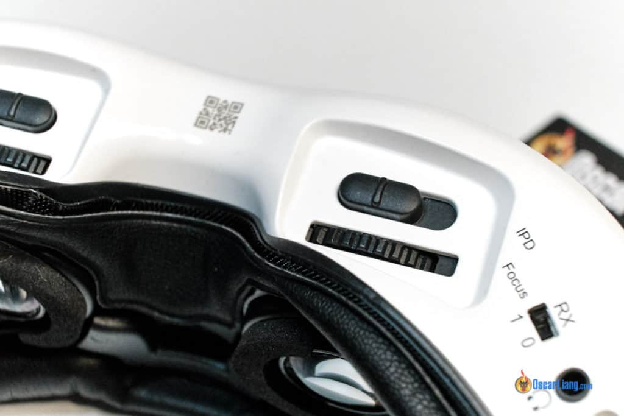

Для тих, хто носить окуляри, важливо, щоб FPV-окуляри мали діоптрійну корекцію. Ця функція дозволяє налаштовувати діоптрії, зазвичай в діапазоні від \-6 до \+6 в залежності від моделі, та усуває потребу в додаткових лінзах.

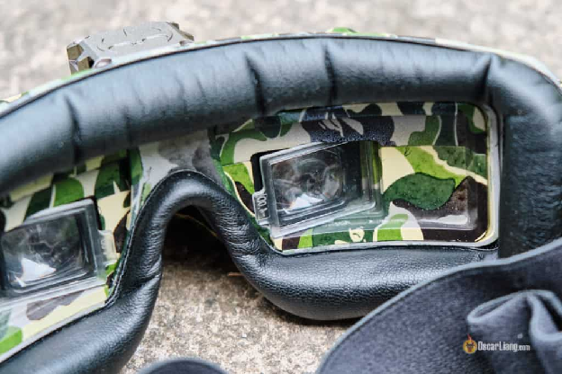

Деякі старі окуляри, такі як Fatsharks, мають отвори для встановлення діоптрійних вставок/лінз. Ви можете придбати діоптрійні лінзи, щоб встановити їх у свої окуляри (якщо вони підтримують цю функцію) тут:

* Amazon:[https://amzn.to/3MdEqHh](https://amzn.to/3MdEqHh)  
* AliExpress:[https://s.click.aliexpress.com/e/\_DeYTvRb](https://s.click.aliexpress.com/e/_DeYTvRb)  
* GetFPV:[https://oscarliang.com/product-bv45](https://oscarliang.com/product-bv45)  
* RDQ:[https://oscarliang.com/product-g8mp](https://oscarliang.com/product-g8mp)

## **Відео вхід і вихід** {#відео-вхід-і-вихід}

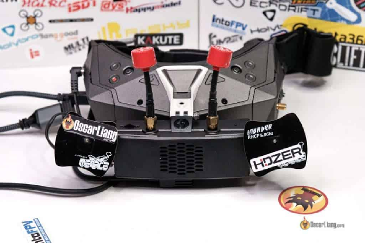

Багато FPV-окулярів початкового рівня, як правило, не мають роз'ємів для входу і виходу відео, покладаючись виключно на аналоговий приймач 5,8 ГГц як єдиний спосіб подачі відео на окуляри. Хоча така схема цілком підходить для початківців, вона має певні обмеження.  
Можливість подавати відео з альтернативних джерел на окуляри дуже важлива, якщо ви плануєте в майбутньому використовувати наземну станцію – популярний вибір серед пілотів, що літають [на далекі відстані](https://oscarliang.com/long-range-fpv-flying-mini-quad/).  
Вхідні порти HDMI, зокрема, є чудовою функцією. Ці порти не лише дозволяють підключати окуляри до цифрових FPV-систем, таких як [Walksnail](https://oscarliang.com/walksnail-avatar-vrx/) і [HDZero](https://oscarliang.com/hdzero-vrx-2022/), але й використовувати окуляри як монітор для тренувань на FPV-симуляторі з ефектом присутності.

## **Інші функції** {#інші-функції}

### **Аудіовихід** {#аудіовихід}

Встановивши мікрофон у дрон, можна слухати, як змінюються обороти двигуна, що дасть вам відчуття більшого зв'язку з навколишнім світом.  Багато окулярів мають аудіовихід через роз’єм для навушників. Перегляньте цю статтю, щоб дізнатися, як налаштувати звук для FPV: [https://oscarliang.com/microphone-fpv/](https://oscarliang.com/microphone-fpv/)

### **Відстеження положення голови** {#відстеження-положення-голови}

Хоча функція відстеження положення голови використовується нечасто, вона є дуже корисною. Вона дозволяє окулярам розпізнавати рухи голови пілота та синхронізувати їх з камерою на борту дрона, встановленою на підвісі. Коли пілот рухає головою, камера також рухається, створюючи ще більш захоплюючий досвід польоту. Підвіс може значно збільшити вагу, тому він  більше підходить для платформ із нерухомим крилом, ніж для мультикоптерів.

## **Колір окулярів** {#колір-окулярів}

Колір здебільшого залежить від особистих переваг. Чорні або інші темні окуляри, як правило, нагріваються на сонці, але в окулярах світлих кольорів певних моделей може просочуватись світло через пластик. Це ще одна вагома причина ознайомитись з [моїми відгуками](https://oscarliang.com/tag/fpv-goggles/) перед прийняттям рішення.  
Порада професіонала: не залишайте окуляри під прямими сонячними променями. Через оптику окулярів прямі сонячні промені можуть бути шкідливими для екрана, а при тривалому знаходженні на сонці екран може перегоріти. Переконайтеся, що ви тримаєте екран/оптику подалі від сонця, коли кладете їх на місце.

### **Підтримка 3D** {#підтримка-3d}

Підтримка 3D дозволяє використовувати  [3D FPV-камери/передавачі](https://oscarliang.com/3d-fpv-multirotor/). Однак наразі існує не так багато варіантів налаштування 3D-камер, тому це не є критично важливим фактором.

## **Політ з FPV-монітором** {#політ-з-fpv-монітором}

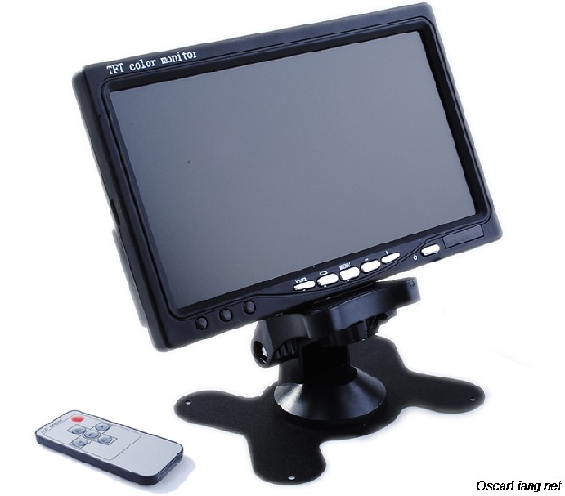

Цілком можливо літати, використовуючи монітор замість FPV-окулярів. Однак у цього підходу є свої плюси і мінуси, які слід ретельно зважити.  
Позитивним моментом є те, що монітори, як правило, більш доступні за ціною і дозволяють пілотам легко перемикатися між польотом прямої видимості та FPV. Вони також можуть бути більш зручнішими для тих, хто носить окуляри, хоча багато виробників окулярів зараз пропонують діоптрійні лінзи або регулювання фокусу відповідно до потреб.  
До недоліків відносять те, що при використанні FPV-монітора зменшуються ефект занурення. Крім того, під час польоту під прямими сонячними променями можуть виникнути проблеми з видимістю екрану через відблиски і недостатню яскравість екрану.  
Особисто я наполегливо рекомендую обирати правильні FPV-окуляри, а не монітор. Однак, якщо ви налаштовані використовувати монітор, ось кілька ключових факторів, про які слід пам’ятати:

1. **Правильний відеовхід**: переконайтеся, що монітор підтримує правильний вхід, сумісний із вашим відеоприймачем (наприклад, AV-вхід або HDMI).  
2. **Розмір**: Мінімальний розмір екрану 5 дюймів ідеально підходить для FPV-монітора; на меншому екрані може бути складно чітко бачити деталі.  
3. **Яскравість та підсвітка**: вибирайте монітор з регульованою яскравістю та підсвіткою для кращої видимості в різних умовах освітлення.  
4. **Не синій екран**: Уникайте моніторів, які переходять на синій або чорний екран при слабкому відеосигналі, якщо використовуєте аналогову систему. Екран зі статичним зображенням є кращим, оскільки він може допомогти вам повернутися до зони з кращим прийомом сигналу.

У крайньому разі, будь-який екран з AV входом можна підключити до відеоприймача з частотою 5,8 ГГц. Наприклад:

* AliExpress –[https://s.click.aliexpress.com/e/\_DmEb9Rj](https://s.click.aliexpress.com/e/_DmEb9Rj)  
* Amazon:[https://amzn.to/3sOTPkb](https://amzn.to/3sOTPkb)

Ви навіть можете використовувати телевізор, смартфон або планшет для FPV за допомогою аналого-цифрового відеоконвертера:

* **Конвертер AV в HDMI: [https://s.click.aliexpress.com/e/\_DChdPol](https://s.click.aliexpress.com/e/_DChdPol)**  
* **Відеоприймач з USB-виходом: [https://s.click.aliexpress.com/e/\_DDezed7](https://s.click.aliexpress.com/e/_DDezed7)**

Однак я б не рекомендував такий підхід через високу затримку. Це може бути прийнятним варіантом для спостерігачів, але не для найкращого досвіду FPV.

## **Чи є записи з відеореєстратора (DVR) справедливим відображенням якості FPV-окулярів?** {#чи-є-записи-з-відеореєстратора-(dvr)-справедливим-відображенням-якості-fpv-окулярів?}

Думка про те, що відеозапис з FPV-окулярів не точно відображає реальну якість відео, яке бачать пілоти, є застарілою, оскільки старі FPV-окуляри мають посередні системи відеореєстрації (DVR).  
Сучасні окуляри, такі як DJI Goggles 2, Walksnail Avatar і HDZero, мають високоякісні системи відеореєстрації (DVR), які забезпечують точну передачу відео, що відображається в окулярах.  
Такі фактори, як стиснення бітрейту YouTube і OLED-екрани, можуть впливати на сприйняття якості відео. Хоча бітрейт YouTube може погіршити якість завантаженого відео, вибір опції 4K під час відтворення може допомогти. OLED-екрани в окулярах можуть робити вигляд відео кращим завдяки своїй яскравості та контрастності.

## **Заключні думки** {#заключні-думки}

FPV-окуляри — це довгострокова інвестиція, яка слугуватиме вам роками, поки ви будете постійно вдосконалювати свій дрон, щоб залишатися конкурентоспроможним. Вибір правильних окулярів має вирішальне значення для оптимального досвіду польоту. Якщо процес вибору здається вам надто складним, зверніться до моїх рекомендацій на початку цього посібника, де ви знайдете список надійних FPV-окулярів. Майте на увазі, що правильний вибір не тільки покращить досвід польоту, але й забезпечить максимальну віддачу інвестицій в цей важливий елемент FPV-спорядження.

#### **Історія редагування** {#історія-редагування}

* Березень 2015 – Стаття створена  
* Квітень 2017 р. – Оновлені продукти  
* Січень 2018 р. – статтю відредаговано, продукти оновлено  
* Квітень 2018 р. – додано рекомендовані параметри для різних категорій  
* Вересень 2019 р. – Оновлений список продуктів  
* Січень 2020 р. – додано HDO2  
* Березень 2021 р. – оновлений посібник, додано SKY04X, EV300O, Scout, Recon V3, DJI FPV Goggles, Attitute V6, Cobra X  
* Березень 2023 р. – оновлений посібник і рекомендації щодо виробництва

[image1]: 

[image2]: 

[image3]: 

[image4]: 

[image5]: 

[image6]: 

[image7]: 

[image8]: 

[image9]: 

[image10]: 

[image11]: 

[image12]: 

[image13]: 

[image14]: 

[image15]: 

[image16]: 

[image17]: 

[image18]: 

[image19]: 

[image20]: 

[image21]: 

[image22]: 

[image23]: 

[image24]: 

[image25]: 

[image26]: 

[image27]: 

[image28]: 

[image29]: 

[image30]: 

[image31]: 

[image32]: 

[image33]: 

[image34]: 

[image35]: 

[image36]: 

[image37]: 

[image38]: 

[image39]: 

[image40]: 