Стисле посилання на цей переклад: [bit.ly/flying-at-night](https://bit.ly/flying-at-night) 

|  | Нижче вичитаний людьми машинний український переклад оригіналу. Для [VictoryDrones](https://www.victory-drones.com/) переклад вичитали: Faina, Max Well\!. Хочете покращити переклад чи знайшли помилку? — Лишіть коментар (Ctrl+Alt+M або «Меню» \> «Вставка» \> «Коментар»). Ми теж живі люди (як і ви) і робим помилки. Роботи їх, до речі, також роблять 😉 |
| :---: | :---- |

# **Політ на FPV дронах вночі \- найкращі камери для  низького освітлення та поради** 

# 6th April 2024  {#6th-april-2024}

Не у всіх є можливість літати вдень, або можливо, ви просто хочете дослідити нічне небо з допомогою свого FPV-дрона. У цій статті я поділюся важливими порадами та хитрощами, які допоможуть вам безпечно літати вночі та розкажуть як вибрати найкращу аналогову FPV-камеру для роботи в умовах слабкого освітлення. 

*Деякі посилання на цій сторінці є партнерськими. Я \[автор англомовної версії Оскар Ланг\] отримую комісію (без додаткових витрат для вас), якщо ви робите покупку після натискання одного із цих партнерських посилань. Це допомагає підтримувати безкоштовний контент для спільноти на цьому веб\-сайті. Будь ласка, прочитайте нашу [Політику партнерських посилань](https://oscarliang.com/affiliate-program-policy/) для отримання додаткової інформації.*

 Ви можете дізнатися більше про камери FPV у цьому посібникy для покупців: [https://bit.ly/LiangFPVCamera](https://bit.ly/LiangFPVCamera) 

Зміст 

	**[1](#6th-april-2024)**

[Найкращі камери для FPV в умовах низького освітлення	2](#найкращі-камери-для-fpv-в-умовах-низького-освітлення)

[Caddx Ratel Pro	3](#caddx-ratel-pro)

[Foxeer CAT 3	4](#foxeer-cat-3)

[Runcam Night Eagle 3	5](#runcam-night-eagle-3)

[Порівняння кадрів дня та ночі	5](#порівняння-кадрів-вдень-та-вночі)

[Наскільки добре камери FPV працюють вночі?	6](#наскільки-добре-камери-fpv-працюють-вночі?)

[Саморобний ІЧ-ліхтар	8](#саморобний-іч-ліхтар)

[Поради для польоту в умовах слабкого освітлення	12](#поради-для-польоту-в-умовах-слабкого-освітлення)

[Порівняння камер у 2018 році	13](#порівняння-камер-у-2018-році)

[Висновок	14](#висновок)

[Історія редагування	14](#історія-редагування)

## **Найкращі камери для FPV в умовах низького освітлення** {#найкращі-камери-для-fpv-в-умовах-низького-освітлення}

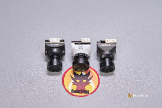

Хоча на ринку є багато варіантів камер FPV, не всі підходять для умов слабкого освітлення. На щастя, кожен великий бренд камер FPV пропонує камери, спеціально розроблені для таких сценаріїв. Я провів комплексне тестування всіх із них, щоб надати вам детальний огляд\!

### **Caddx Ratel Pro** {#caddx-ratel-pro}

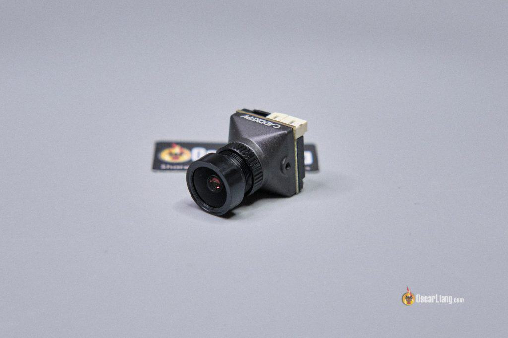

**Придбати Caddx Ratel Pro:**

* **Caddx:[https://oscarliang.com/product-b0o5](https://oscarliang.com/product-b0o5)**

* **AliExpress:[https://s.click.aliexpress.com/e/\_DDa4vCt](https://s.click.aliexpress.com/e/_DDa4vCt)**

* **Banggood:[https://oscarliang.com/product-rmaq](https://oscarliang.com/product-rmaq)**

* **RDQ:[https://oscarliang.com/product-v7m3](https://oscarliang.com/product-v7m3)**

### **Foxeer CAT 3** {#foxeer-cat-3}

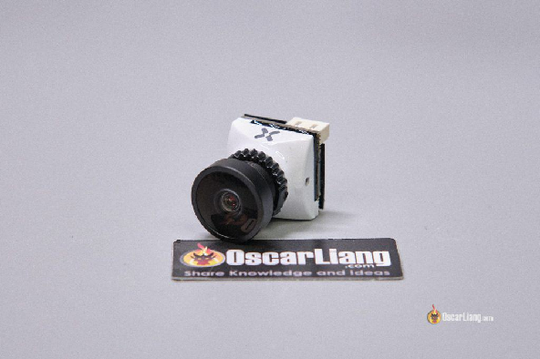

**Придбати Foxeer CAT 3:**

* **AliExpress:[https://s.click.aliexpress.com/e/\_DBijUlB](https://s.click.aliexpress.com/e/_DBijUlB)**

* **RDQ:[https://oscarliang.com/product-qxsv](https://oscarliang.com/product-qxsv)**

* **GetFPV:[https://oscarliang.com/product-7ezk](https://oscarliang.com/product-7ezk)**

### **Runcam Night Eagle 3** {#runcam-night-eagle-3}

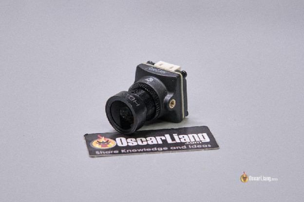

**Придбати Runcam Night Eagle:**

* **AliExpress:[https://s.click.aliexpress.com/e/\_DcftoLj](https://s.click.aliexpress.com/e/_DcftoLj)**

* **GetFPV:[https://oscarliang.com/product-iz6x](https://oscarliang.com/product-iz6x)**

* **Speedybee:[https://oscarliang.com/product-ok0b](https://oscarliang.com/product-ok0b)**

### **Порівняння кадрів вдень та вночі** {#порівняння-кадрів-вдень-та-вночі}

Як і в багатьох інших оглядах і підручниках, для цього потрібні час і гроші – це порівняння зайняло цілий день і коштувало понад 150 доларів США для покупки цих камер. Сподіваюся, вам сподобається цей тип вмісту, і ви подумаєте [підтримуючи мене Patreon](https://oscarliang.com/patreon-support-annoucement/).

[Найкраща FPV-камера для низького освітлення: Caddx Ratel Pro, Foxeer Cat 3, Runcam Night Eagle 3: https://www.youtube.com/watch?v=RX0o1MzikKY\&feature=youtu.be](https://youtu.be/RX0o1MzikKY)

В умовах слабкого освітлення Runcam Night Eagle 3 і Caddx Ratel Pro є явними переможцями\! Обидва вони працюють надзвичайно добре, навіть у майже повній темряві. Наявність лише кількох ліхтарів значно покращує видимість. Night Eagle помітно менш шумний/зернистий, ніж Ratel Pro, i демонструє неперевершену продуктивність при слабкому освітленні.

Вдень і Caddx Ratel Pro, і Foxeer Cat 3 забезпечують чудові зображення. Якість зображення у Ratel Pro більш контрастна, різкіша, а кольори більш яскраві, але зображення здається зарізким, і цифровий шум може відволікати. Cat 3 пропонує більш м’яке та плавне зображення з дещо нижчою насиченістю. [У моєму початковому огляді](https://oscarliang.com/caddx-ratel-pro-fpv-camera/), я ставив під сумнів малий кут огляду (FOV) Ratel Pro порівняно зі звичайними камерами FPV. Тепер я починаю замислюватися, може Caddx просто намагався зрівнятися з камерами слабкого освітлення своїх конкурентів, оскільки я зрозумів, що всі три камери мають однаково вузький кут огляду.

Загалом, Caddx Ratel Pro виділяється як найкращий універсальний пристрій, який чудово працює як у денний, так і в нічний час. Незважаючи на те, що Runcam Night Eagle 3 трохи перевершує його в умовах недостатнього освітлення, відставання невелике. Однак, оскільки Runcam Night Eagle 3 працює лише в чорно-білому режимі, він не дуже підходить для польотів удень.

## **Наскільки добре камери FPV працюють вночі?** {#наскільки-добре-камери-fpv-працюють-вночі?}

Камери для слабкого освітлення чудово підходять для оптимізації наявногo освітлення. Їх продуктивність в умовах слабкого освітлення вимірюється параметром, відомим як «LUX». Що нижче значення LUX, то краща нічна робота камери. Сьогодні можна знайти камери FPV із яскравістю всього 0,00001 люкс у чорно-білому режимі, що ідеально підходить для нічних польотів.

Ось приклад, який демонструє можливості цих камер уночі. Нижче показано, наскільки темним ігровий майданчик виглядає неозброєним оком або через звичайну камеру телефону:

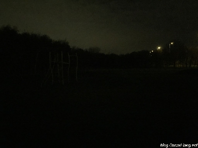  
*Середовище з низьким освітленням, знятe камерою телефону*

Порівняйте: ось та сама сцена, яку можна побачити через наші FPV-камери з підтримкою слабкого освітлення, якість зображення краща навіть без додаткових джерел світла:

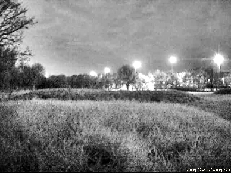

*Оточення з низьким освітленням, зняте камерою FPV із підтримкою слабкого освітлення*

Однак без ясного неба та повного місяця або освітлення від вуличних ліхтарів поблизу, ваша камера все одно може мати труднощі у створенні чіткого зображення. Ось де саморобний ІЧ-ліхтарик стане в нагоді.

## **Саморобний ІЧ-ліхтар** {#саморобний-іч-ліхтар}

У надзвичайно темному середовищі якість зображення вашої FPV-камери може значно погіршитися, що призведе до шумного та розмитого відео, на якому важко орієнтуватися. Однак існує практичне вирішення цієї проблеми.

Одним із способів покращити видимість без шкоди для непомітності нічних польотів є використання ІЧ (інфрачервоних) світлодіодів. На відміну від видимого світла, ІЧ-промені невидимі для людського ока, але можуть бути виявлені лише цифровими камерами.

Найефективніше рішення, яке я знайшов, передбачає використання 48 ІЧ-світлодіодних панелей, які коштують близько 6 фунтів стерлінгів (8 доларів США). Єдиною необхідною модифікацією було припаювання балансувального роз’єму до світлодіодної плати, що дало можливість прямого підключення до батареї 3S, оскільки вони приймають 12 В. Якщо ви використовуєте 4S або 6S LiPo, вам може знадобитися зовнішній [регулятор напруги](https://oscarliang.com/3a-voltage-regulator/) щоб знизити напругу до 12В.

Придбати цю ІЧ-світлодіодну плату:

* Amazon:[https://amzn.to/49rzoP2](https://amzn.to/49rzoP2)

* AliExpress:[https://s.click.aliexpress.com/e/\_Dllw9rT](https://s.click.aliexpress.com/e/_Dllw9rT)

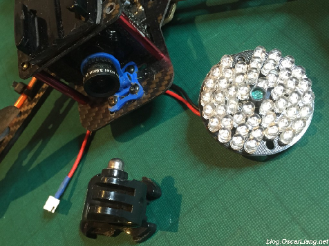

Я просто встановив світлодіодну плату на кріплення GoPro, розмістивши її на квадрокоптері. Таке налаштування зручнe, оскільки дозволяє регулювати кут.

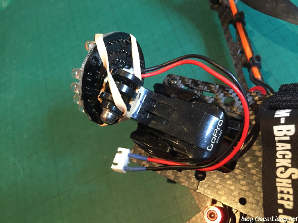

Для тих, хто не має кріплення GoPro, розгляньте креативну альтернативу, якою поділився колега-пілот Конрад Степанайтис. Він встановив світлодіодну панель на картонну коробку, яка потім встановлюється на квадрокоптері.

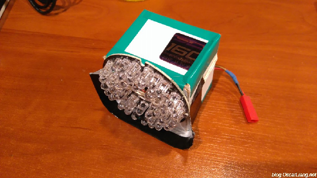

Щоб уникнути відблисків, переконайтеся, що світлодіодний індикатор знаходиться подалі від об’єктива камери.

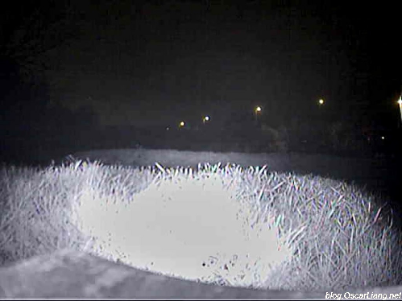

На відміну від звичайного ліхтарика, ІЧ-світлодіод не створює яскравої білої плями, а натомість випромінює м’яке, широке світіння, покращуючи видимість.

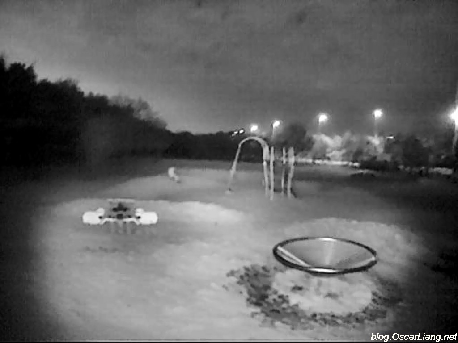

Поради щодо використання саморобного ІЧ-ліхтарика:

* Ваша камера FPV НЕ повинна мати ІЧ-фільтр, щоб ефективно бачити ІЧ-світло.

* Тримайте ІЧ-світлодіод на відстані від об’єктива камери, щоб уникнути відблисків, які можуть погіршити видимість.

* Перевірте вимоги до напруги вашої ІЧ-світлодіодної панелі. Моя 12-вольтна панель підключається безпосередньо до акумулятора 3S LiPo квадрокоптера через балансувальний роз’єм. Якщо використовується 4S або 6S LiPo, для належного живлення знадобиться регулятор напруги або BEC *(перетворювач)* від польотного контролера.

## **Поради для польоту в умовах слабкого освітлення** {#поради-для-польоту-в-умовах-слабкого-освітлення}

**Чорно-білий режим:** На FPV-камері встановіть параметр День/Ніч *\[Day/Night\]* на автоматичний або чорно-білий режим. Цей режим забезпечує кращу видимість вночі, зменшуючи цифровий шум порівняно з кольоровим режимом.

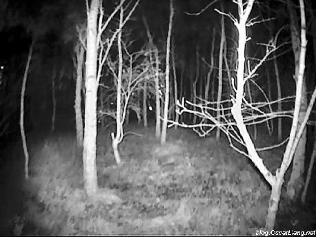

**Уповільнення:** Знижена видимість, властива нічним польотам, означає, що вам слід летіти повільніше, щоб мати достатньо часу для реагування на перешкоди.

**Зберігайте лінію видимості:** В умовах слабкого освітлення орієнтуватися досить складно; так що не ускладнюйте процес ще більше, літаючі там де сигнал зазнає перешкод. Навіть за умови чіткої трансляції камери утримання дрона в межах прямої видимості забезпечує надійну передачу відео та є важливою практикою безпеки.

**Використання підстраховки:** Політ з партнером для підстраховки може покращити безпеку. Партнер для підстраховки може попередити вас про наближення людей або тварин, яких важко помітити в окулярах.

**Виберіть вдале розташування:** Польоти в місцях з деякими джерелами світла, наприклад поблизу вуличних ліхтарів, можуть значно покращити видимість вночі.

**Додайте зумер і трекер з автономним живленням:** Щоб запобігти втраті дрона, рекомендується прикріпити зумер із вбудованим акумулятором: [https://oscarliang.com/drone-buzzers-with-battery/](https://oscarliang.com/drone-buzzers-with-battery/). Трекер також може допомогти легше знайти ваш дрон.

**Налаштування GoPro для слабкого освітлення:** Якщо ви знімаєте свій політ за допомогою GoPro, зверніть увагу на рекомендовані мною налаштування для умов слабкого освітлення, доступні тут: [https://oscarliang.com/gopro-settings-fpv/\#For-LowlightNight-Shooting](https://oscarliang.com/gopro-settings-fpv/#For-LowlightNight-Shooting)

## **Порівняння камер у 2018 році** {#порівняння-камер-у-2018-році}

Ще в 2018 році я провів порівняння кількох FPV камер із слабким освітленням, більшість із яких з тих пір було знято з виробництва. Однак вони все ще можуть бути в наявності, тому я вирішив залишити відео тут. Камери тестувалися вночі в двох місцях з різними рівнями яскравості.

[Найкраща камера FPV для нічних польотів | Micro Eagle, Falkor, Night Eagle 2, порівняння сови](https://www.youtube.com/watch?v=CpRWADZs_jU)

[https://www.youtube.com/watch?v=CpRWADZs\_jU](https://www.youtube.com/watch?v=CpRWADZs_jU)

У цьому конкретному тесті Runcam Night Eagle став явним переможцем, хоча варто зазначити, що він працює лише в чорно-білому режимі, що робить його менш привабливим для використання вдень.

Runcam Micro Eagle трохи перевершив Runcam Owl 2 Pro, незважаючи на те, що Runcam Owl 2 Pro розроблений для умов слабкого освітлення. Однак під час тестування Owl продемонстрував менше цифрового шуму. Примітно, що Eagle запропонував кращу якість зображення вдень порівняно з Owl, позиціонуючи його як більш універсальну камеру «All-Around». Таким чином, Micro Eagle став моїм другим вибором.

Foxeer Falkor виділявся винятковою якістю денного зображення – можливо, одним із найкращих. Проте для слабкого освітлення або нічних польотів я вважаю його непридатним, насамперед через помилку в режимі «Автоматичний день/ніч», яка спричиняла мерехтіння екрана на певних рівнях яскравості через постійне перемикання між кольоровим і чорно-білим режимом. Корисна порада щодо зменшення цифрового шуму за слабкого освітлення – змінити параметр DNR від 0 до 1; Я не помітив подальших покращень, якщо поставити більше “1”.

## **Висновок** {#висновок}

Нічні польоти з дронами FPV пропонують неперевершені враження. Завдяки правильній камері, ретельному плануванню та дотриманню правил безпеки та правил, пілоти можуть безпечно досліджувати цей складний, але корисний аспект польоту безпілотника. Вирушаючи вночі, пам’ятайте, що ретельна підготовка та вибір правильного обладнання мають вирішальне значення.

#### **Історія редагування** {#історія-редагування}

* **Грудень 2015:** Стаття створена.

* **Грудень 2017:** Статтю оновлено останніми параметрами камери FPV.

* **Листопад 2018:** Додано нічне порівняння камер FPV.

* **квітень 2024:** Статтю оновлено з найновішими параметрами камери FPV і порівняннями.

**КОМЕНТАРІ**

HH CHANG

26 грудня 2017 р. \- 02:36

Оскар,

Runcam Eagle 2 PRO зовсім не підходить для нічних польотів.  
Оскільки вони зменшують, це “мін. освітлення” Від 0,0001 люкс при 1,2 F (Eagle 2\) до 0,01 люкс при 1,2 F (Eagle 2 Pro)

Як власник Eagle 2, я задоволений його нічними характеристиками. Я отримую новий Night Eagle 2 Pro. Ваша стаття дійсно помічна\!

[image1]: 

[image2]: 

[image3]: 

[image4]: 

[image5]: 

[image6]: 

[image7]: 

[image8]: 

[image9]: 

[image10]: 

[image11]: 

[image12]: 

[image13]: 

[image14]: 