Оригінал: [https://oscarliang.com/soldering-guide](https://oscarliang.com/soldering-guide/)      
Стисле посилання на цей переклад: [https://bit.ly/LiangSolderingGuide](https://bit.ly/LiangSolderingGuide)   

| 🫂 | Нижче вичитаний людьми машинний український переклад оригіналу. Для [VictoryDrones](https://www.victory-drones.com/) переклад вичитали: Oleg, Block(chain). Хочете покращити переклад чи знайшли помилку? — Лишіть коментар (Ctrl+Alt+M або «Меню» \> «Вставка» \> «Коментар»). Ми теж живі люди (як і ви) і робим помилки. Роботи їх, до речі, також роблять 😉 |
| :---: | :---- |

# Паяння *\[солов., милоз.: лютування — але досі маловживане, на жаль\]* FPV-дронів — посібник для початківців

12 березня 2023 року

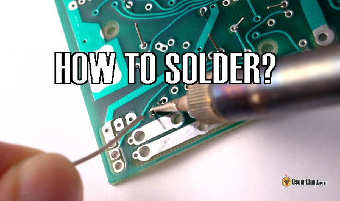

Паяння є важливою навичкою для будь-якого конструктора FPV-дронів, але це може лякати новачків. У цьому посібнику ми розповімо все, що вам потрібно знати, щоб розпочати паяння та створити міцні та надійні з’єднання для вашого дрона.

*Деякі посилання на цій сторінці є партнерськими. Я \[автор англомовної версії Оскар Ланг\] отримую комісію (без додаткових витрат для вас), якщо ви робите покупку після натискання одного із цих партнерських посилань. Це допомагає підтримувати безкоштовний контент для спільноти на цьому веб\-сайті. Будь ласка, прочитайте нашу [Політику партнерських посилань](https://oscarliang.com/affiliate-program-policy/) для отримання додаткової інформації.*

Ви новачок у FPV і все ще цікавитесь, які інструменти можуть знадобитися для створення та ремонту FPV дронів? [Перегляньте цю публікацію, щоб з’ясувати список основних інструментів, які вам знадобляться](https://oscarliang.com/fpv-tools/).

Зміст

[Що таке паяння?](#що-таке-паяння?)

[Паяльні інструменти](#паяльні-інструменти)

[Підготовка перед паянням](#підготовка-перед-паянням)

[Лудіння контактів](#лудіння-контактів)

[Припаювання малого дроту до контактів плати](#припаювання-малого-дроту-до-контактів-плати)

[Припаювання великого дроту до контактів плати](#припаювання-великого-дроту-до-контактів-плати)

[Паяння штирьового роз’єму до наскрізного отвору](#паяння-штирьового-роз’єму-до-наскрізного-отвору)

[Паяння дроту до наскрізного отвору](#паяння-дроту-до-наскрізного-отвору)

[З’єднання двох проводів](#з’єднання-двох-проводів)

[Паяння штирька (піна) до контактного майданчика плати](#паяння-штирька-\(піна\)-до-контактного-майданчика-плати)

[Роз’єм XT60](#роз’єм-xt60)

[Очищення паяних з’єднань](#очищення-паяних-з’єднань)

[Поширені помилки при паянні та способи їх усунення](#поширені-помилки-при-паянні-та-способи-їх-усунення)

[Перегрів](#перегрів)

[Недостатньо пропаяне з’єднання](#недостатньо-пропаяне-з’єднання)

[Перемички з припою](#перемички-з-припою)

[Недостатня очистка жала паяльника](#недостатня-очистка-жала-паяльника)

[Температура паяння](#температура-паяння)

[Температура чи потужність?](#температура-чи-потужність?)

[Практика і наполегливість ведуть до досконалості](#практика-і-наполегливість-ведуть-до-досконалості)

[Корисні ресурси](#корисні-ресурси)

[Історія редагування](#історія-редагування)

## 

## Що таке паяння? {#що-таке-паяння?}

Паяння є основною навичкою у світі створення та ремонту безпілотників FPV. Навичка передбачає використання розплавленого припою для з’єднання двох металевих компонентів. Хоча це може здатися простим, для його освоєння потрібно багато практики. Перш ніж заглибитися в процес паяння, важливо мати на увазі кілька речей.

* Відсутність тремора (і терпіння) мають вирішальне значення — тому спробуйте обмежити споживання кофеїну :)  
* Важливо використовувати якісний паяльник зі змінним жалом, щоб забезпечити стабільне та точне паяння.  
* Терпіння та рішучість є ключовими – найкращі паяні з’єднання виконуються швидко, але без поспіху.  
* Нарешті, завжди будьте обережні, щоб не обпектися в процесі\!

## Паяльні інструменти {#паяльні-інструменти}

Наявність високоякісного обладнання так само важливо, як і хороші навички паяння. Ця публікація містить рекомендації щодо паяльного обладнання, включаючи паяльник, припій *\[солов., милоз., але досі маловживане: [лют](https://goroh.pp.ua/%D0%95%D1%82%D0%B8%D0%BC%D0%BE%D0%BB%D0%BE%D0%B3%D1%96%D1%8F/%D0%BB%D1%8E%D1%82%D1%83%D0%B2%D0%B0%D1%82%D0%B8)\]* та інші інструменти: [**https://oscarliang.com/soldering-iron-buyers-guide/**](https://oscarliang.com/soldering-iron-buyers-guide/)

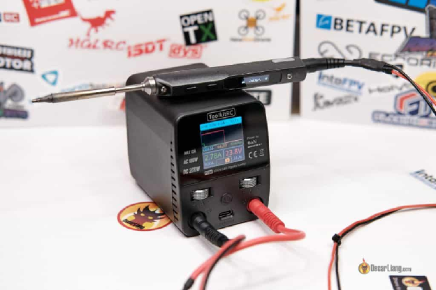

## Підготовка перед паянням {#підготовка-перед-паянням}

При нагріванні припій може виплеснутися, відправляючи крихітні розплавлені кульки припою в довільному напрямку. Ці краплі можуть спричинити замикання між електричними контактами або компонентами під час живлення пристрою. Тож доцільно закрити місця на польотному контролері, де ви не паяєте, малярською стрічкою, ізоляційною стрічкою або [каптоновою](https://technoplus-pro.com/catalog/details/lenta_kaptonovaya_termostojkaya_18_15_mm/) *\[англ. [Вікі](https://en.wikipedia.org/wiki/Kapton)\]* стрічкою.

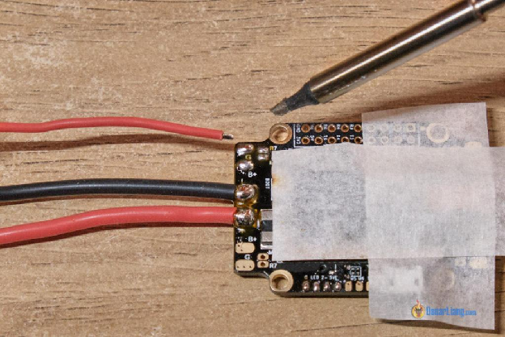

Далі переконайтеся, що ваш паяльник нагрітий до потрібної температури. Для дрібних з’єднань слід нагріти жало приблизно до 390°C, а для великих — близько 450°C. Дешевші паяльники зазвичай не можуть забезпечити достатньо тепла, тому важливо переконатися, що ваш паяльник може досягти необхідної температури.

На жалі паяльника може накопичуватися тьмяно-сірий і коричневий наліт, що впливає на його здатність передавати тепло на з’єднання. Щоб почистити жало, просто протріть його мокрою губкою або латунною чи мідною стружкою, а потім додайте туди трохи припою. Це допоможе поліпшити тепловіддачу до місця паяння.

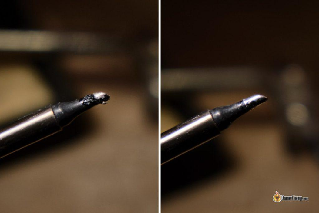

Порада: щоб продовжити термін служби паяльного жала, треба додавати пристойну кількість припою на жало, перш ніж вимкнути паяльник. Це створює захисний шар на жалі і допоможе запобігти окисленню.

Надійно тримайте друковану плату або компонент на місці за допомогою тримача для плат. Маса [Blu-tack](https://diy.bostik.com/en-UK/products/stationery-craft/blu-tack) *\[прим. пер.: пластилін, що не залишає слідів та плям\]* також може швидко і надійно закріпити дроти і друковану плату на вашому столі.

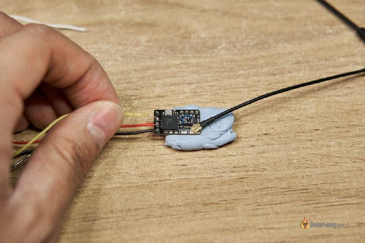

## Лудіння контактів {#лудіння-контактів}

Завжди спочатку «лудіть» контактні майданчики та дроти, перш ніж намагатися спаяти їх разом, це полегшить їх з’єднання пізніше. Лудіння в основному означає покриття проводів і контактних майданчиків відповідною кількістю припою перед з’єднанням. Лудіння дозволяє паяти швидше, оскільки ви вже покрили колодку та дріт припоєм.

Для паяння контактів друкованих плат нанесіть трохи припою на паяльник та доторкніться до контакту. Уникайте використовувати забагато припою, оскільки це може призвести до того, що він потече через край контактного майданчика та створить безлад. Якщо ви не використовуєте припій із каніфолевим сердечником або якщо припій не прилипає до майданчика, можливо, ви захочете спочатку нанести на контакт трохи флюсу *\[прим. пер.: флюсом може бути каніфоль, розчин каніфолі в спирту або спеціальні пасти\].*

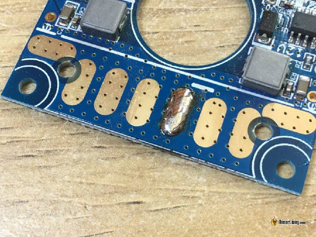  
Що стосується проводів — зачистіть їх, щоб оголити металеві дроти. Зробіть це достатньою для контактних майданчиків мірою, потім скрутіть і залудіть ці дроти. Під час нагрівання дроту обов’язково використовуйте паяльник, щоб нагріти дріт, а не сам припій. Коли дріт нагріється достатньо, припій розплавиться і з’єднається із дротом. Знову ж таки, якщо припій погано прилипає до дроту, нанесіть трохи флюсу на дріт перед паянням.

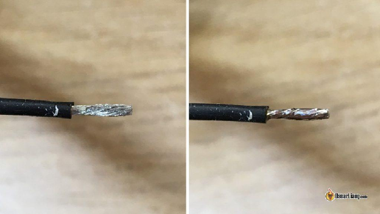  
*До лудіння, Після лудіння*

## Припаювання малого дроту до контактів плати {#припаювання-малого-дроту-до-контактів-плати}

Найпоширенішою роботою з паяння є припаювання дроту до контактного майданчика польотного контролера *\[flight controller, FC\].* Щоб почати, переконайтеся, що дріт і колодка луджені (тобто покриті припоєм), а паяльник нагрітий до потрібної температури. Потім розтопіть пляму припою на контакті плати, піднісши до неї паяльник, і покладіть дріт на майданчик. Обов’язково уникайте натискати на дріт паяльником, оскільки це може призвести до пошкоджень жил дроту.

Після того, як дріт і колодка з’єднаються під гладким куполом припою, обережно вийміть паяльник і утримуйте дріт на місці кілька секунд, доки паяне з’єднання повністю не охолоне і не затвердіє. Пам’ятайте, що не слід переміщати деталі, поки паяльний шов не охолоне, оскільки це може призвести до тріщин у з’єднанні, з’єднання можуть легше вийти з ладу через вібрацію та удари.

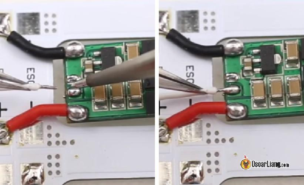

Порада: сміливо використовуйте трохи більше припою. Якщо ви пожалієте дати його достатньо — згодом з’єднання може легко відірватися. Якщо у паяному з’єднанні замало припою, воно виглядатиме нерівним, а жилки дроту будуть виступати над поверхнею. Використовуючи більше припою, ви можете забезпечити міцніше та надійніше з’єднання.

Готові з’єднання повинні виглядати круглими, блискучими, міцними та повністю покритими припоєм. Ось приклад того, як має виглядати правильно зпаяне з’єднання.

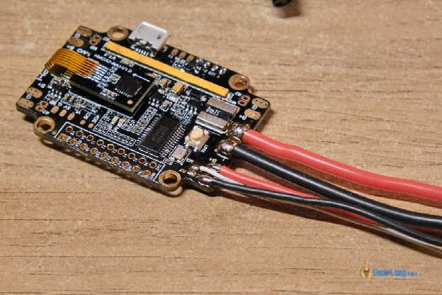

## Припаювання великого дроту до контактів плати {#припаювання-великого-дроту-до-контактів-плати}

При паянні товстих дротів силової частини, таких як перехідник із гнучким виходом *\[хіпс., лін.ж.: «пігтейл»\]* XT60, до електронного регулятора швикдості (ESC), важливо відповідним чином відрегулювати температуру паяльника та використовувати паяльне жало більшого розміру. Це гарантує належний нагрів товстого дроту.

Під час лудіння більших дротів і контактних майданчиків використовуйте стільки припою, скільки може вмістити контактний майданчик (див. приклад нижче). Але не занадто багато, це може призвести до появи перемички із припою *\[solder bridge\]* — коли зайвий припой розтікається поверх плати і замикає сусідні контакти.

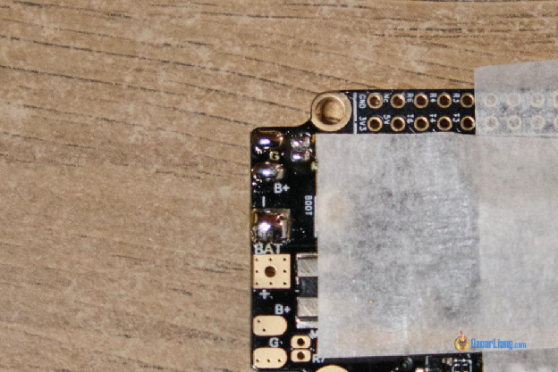  
Також рекомендується нанести пристойну кількість флюсу для припою на контакт перед приєднанням дроту.  
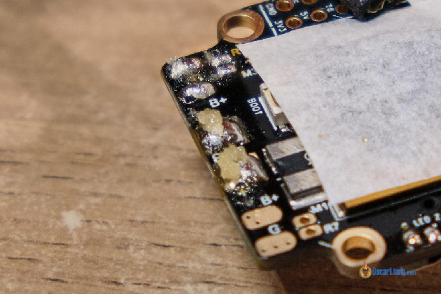

Щоб розігріти припій на масивних елементах, таких як силові дроти від батареї, вам знадобиться більше часу щоб прогріти більші шматки металу. Будьте обережні, старайтесь не натискати паяльником надто сильно, розплавляючи припій на великому дроті, оскільки це може розкрутити жилки дроту.

Вдале паяння для більших проводів має бути круглим, блискучим і повністю закривати жилки дроту.  
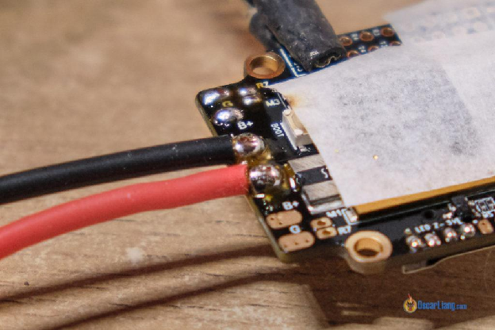

## Паяння штирьового роз’єму до наскрізного отвору {#паяння-штирьового-роз’єму-до-наскрізного-отвору}

Припаюючи штирьові контакти до наскрізних отворів, уникайте лудити контакти попередньо, інакше вам буде складно протягнути штир через отвір.

1. Вставте штир в отвір, тримайте його під потрібним кутом тримачем або за допомоги Blu-Tack.  
2. Нагрівайте виступаючу частину штира та кільце наскрізного отвору протягом кількох секунд.  
3. Піднесіть припій до з’єднання. Він повинен стати міцним блискучим з’єднанням, схожим на вулкан. 🌋😉

Ось [як ви можете навчитись випаюти штирі з наскрізних отворів](https://oscarliang.com/how-to-remove-header-pins/).  
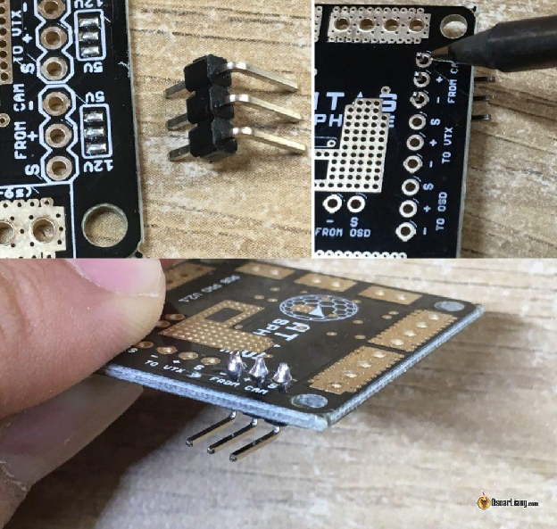

## Паяння дроту до наскрізного отвору {#паяння-дроту-до-наскрізного-отвору}

Є два способи підійти до цього: ви можете або поводитися з наскрізним отвором, як з паяльним майданчиком (покладіть дріт на отвір і припаюйте зверху), або зробити це, припаявши його як штирьовий контакт (просунути дріт через отвір, згодом припаяти частину яка вилізла). Це залежить від того — до якої сторони друкованої плати вам легше отримати доступ.

Ось як припаяти дріт безпосередньо поверх наскрізного отвору:  
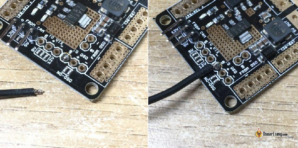  
Ось як вставити дріт через отвір і припаяти знизу, як штирьковий вивід.  
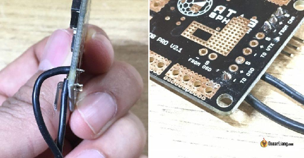

## З’єднання двох проводів {#з’єднання-двох-проводів}

Коли справа доходить до з’єднання двох проводів, надзвичайно корисно мати тримач «третю руку» або массу blu-tack. Якщо ви плануєте використовувати термоусадку, не забудьте надіти термозбіжну трубку на дроти **перед паянням**.

Для маленьких дротів і швидкої роботи ви можете припаяти один провід безпосередньо до іншого. Також корисно скрутити їх разом перед паянням, щоб збільшити механічну міцність з’єднання.  
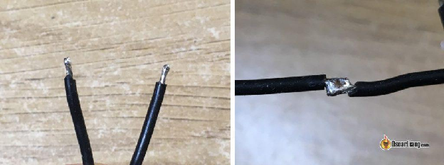  
З’єднуючи два багатожильні дроти більшого діаметру, розведіть нитки та зіштовхніть два дроти один до одного, а потім скрутіть їх разом, щоб запобігти їх роз’єднанню. Нанесіть трохи флюсу для припою та спаяйте дроти разом.

Цей метод максимізує площу контакту металів, що призводить до меншого за розміром та міцнішого паяного з’єднання. У будь-якому випадку, якщо з’єднання міцне, воно працюватиме нормально.

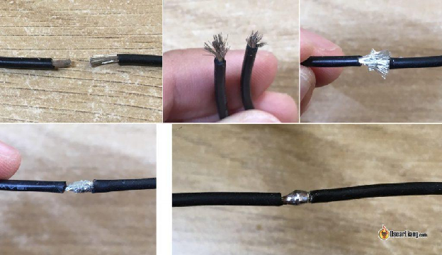

## Паяння штирька (піна) до контактного майданчика плати {#паяння-штирька-(піна)-до-контактного-майданчика-плати}

У цьому випадку уникайте лудити ані штирьок роз’єму, ані контактний майданчик.

1. Піднесіть штирьок до контактного майданчика та утримуйте його там тримачем “третя рука” або массою Blu-tack.  
2. Грійте штир і колодку протягом кількох секунд і потім піднесіть припій до з’єднання.  
3. Приберіть паяльник і дайте з’єднанню охолонути.

При пайці великого роз’єму з кількома пінами переконайтеся, що перший пін, який ви паяєте, стоїть рівно. Вся робота стане легшою, якщо роз’єм надійно зафіксований у потрібному місці першим піном.

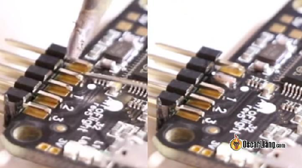

## Роз’єм XT60 {#роз’єм-xt60}

1. Закріпіть роз’єм XT60 тримачем “третя рука” або струбциною, щоб утримувати його стабільним під час процесу паяння.  
2. Використовуйте невелику кількість припою, щоб злегка залудити внутрішню частину роз’єму XT60. Забагато припою може ускладнити вставляння дроту в отвори.  
3. Залудіть електричний дріт, нагрівши його паяльником і наносячи припій до рівномірного покриття дроту.  
4. Вставте луджений дріт в отвір на роз’ємі XT60 і нагрійте дріт і роз’єм паяльником.  
5. Піднесіть припій до з’єднання та дайте йому стекти на дріт, доки дріт повністю не покриється та не сховається в припої. Будьте обережні, щоб не наносити занадто багато припою, оскільки це може спричинити небажані перемички між з’єднаннями.  
6. Після завершення з’єднання вийміть паяльник і дайте з’єднанню охолонути принаймні 10 секунд, перш ніж братися за нього.

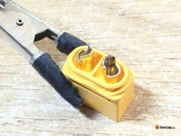 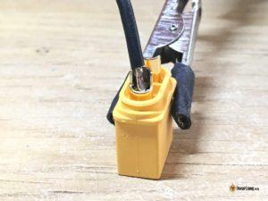

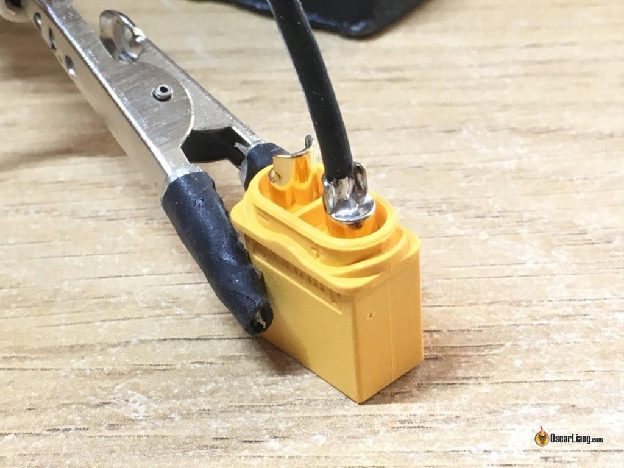

Професійна порада: перед паянням підключіть гніздо XT60 до штекерного роз’єму, це може запобігти деформації пластику під впливом тепла.

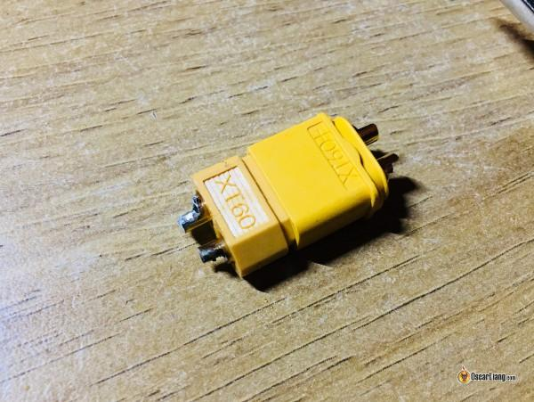

## Очищення паяних з’єднань {#очищення-паяних-з’єднань}

Після паяння ви можете виявити залишки навколо паяних з’єднань, які є пригорілим флюсом. Хоча цей залишок не є електропровідним і не має негативного впливу на продуктивність ваших паяних з’єднань, він допомагає покращити загальний вигляд вашої конструкції *\[прим. пер.: при пайці масивних деталей з агресивними флюсами, наприклад кислотою, змивати залишки флюсу обов’язково — це дозволить уникнути корозії\].*

Щоб видалити залишки, можна скористатися ватним тампоном, змоченим ізопропіловим спиртом. Ви також можете використовувати щітку, щоб очистити залишки, але переконайтеся, що це щітка з м’якою щетиною, щоб не подряпати компоненти. 

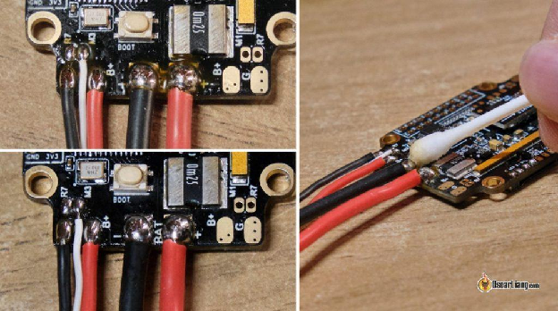

## Поширені помилки при паянні та способи їх усунення {#поширені-помилки-при-паянні-та-способи-їх-усунення}

Паяння є важливою навичкою для створення та ремонту FPV-дронів, але навіть найдосвідченіші любителі можуть припуститися помилок. У цьому розділі ми розглянемо деякі поширені помилки при паянні та способи їх усунення.

## Перегрів {#перегрів}

Дуже важливо уникати перегріву невеликих паяльних майданчиків під час паяння. Залишення паяльника на контакті надто довго може призвести до того, що мідний шар від’єднається від плати, що призведе до дорогого ремонту плати або навіть викидання всієї плати у смітник.

## Недостатньо пропаяне з’єднання {#недостатньо-пропаяне-з’єднання}

Якщо припій не повністю розплавився або ви використовуєте недостатню кількість припою. Холодне з’єднання виглядає зернистим і тьмяним, вважається поганим контактом між компонентами і часто є ненадійним. Виправлення полягає в тому, щоб повторно нагріти з’єднання та застосувати більше припою, поки з’єднання не стане блискучим.

Інша проблема, яка може виникнути, полягає в тому, що припій прилипає до паяльника, коли ви знімаєте його зі з’єднання. Це ознака того, що флюс вигорів, і настав час додати ще трохи флюсу або використовувати свіжий припій.

## Перемички з припою {#перемички-з-припою}

Перемички з припою виникають, коли два сусідні контактні майданчики випадково з’єднуються припоєм, створюючи коротке замикання. Рішення полягає в тому, щоб прибрати надлишки припою за допомогою спеціального інструменту для видалення припою типу “відсос” або тасьми для видалення припою.

## Недостатня очистка жала паяльника {#недостатня-очистка-жала-паяльника}

Брудне або окисление жало може перешкодити належній теплопередачі та призвести до холоднопаяних з’єднань. Регулярне чищення вологою губкою або латунною стружкою допоможе вирішити цю проблему.

## Температура паяння {#температура-паяння}

Залишення паяльника на контактному майданчику надто довго може призвести до перегріву, що призведе до пошкодження компонентів або зсуву чи відпадання мідного майданчика контакту ([можливий ремонт цієї біди](https://oscarliang.com/repair-ripped-off-solder-pads/)). Тому важливо швидко підносити та прибирати паяльник.

Щоб досягти цього, бажано використовувати трохи вищу температуру, щоб швидше розплавити припій. Але будьте обережні, щоб не використовувати занадто високу температуру, оскільки це також може завдати шкоди.

Важливо зауважити, що використання низької температури жала збільшує ризик перегріву плати, зсуву інших елементів на платі, оскільки розплавлення припою займає більше часу, а це означає, що паяльник довше лишається на контактному майданчику.

Як орієнтир щодо температури я вважаю за краще використовувати наступні температури за умови використання якісного припою 63/37(Sn63Pb37):

* 300°C (580°F) для надзвичайно делікатних робіт  
* 390°C (734°F) для паяння сигнальних дротів на польотному контроллері або регуляторі ESC  
* 450°C (842°F) для великих роз’ємів, живлення регулятора ESC і косички XT60

Якщо у вас виникають труднощі з паянням великих роз’ємів або проводів, не підвищуйте температуру наосліп. Спочатку перевірте якість і тип припою, який ви використовуєте ([мої рекомендації](https://oscarliang.com/soldering-iron-buyers-guide/)), спробуйте більш масивне жало, яке акумілює більше тепла і може ефективніше передавати тепло, і нанесіть флюс на з’єднання перед паянням.

## Температура чи потужність? {#температура-чи-потужність?}

Вищі температури та більш масивне жало можуть сприяти швидшій передачі тепла. Крім того, використання паяльника більшої потужності може допомогти швидше нагріти ваші контакти та запобігти занадто сильному падінню температури, коли ви прикладаєте паяльник до місця з’єднання.

Важливо мати на увазі, що коли паяльник доторкається з’єднанням, температура починає падати, оскільки тепло розсіюється через метал. Це може бути особливо складним під час паяння великих компонентів або товстіших дротів, оскільки вони діють як радіатори та можуть швидко охолоджувати з’єднання. Ось тут і стане в нагоді більш масивний наконечник паяльника — він утримує більше тепла та може розплавити більші ділянки припою швидше, ніж менший наконечник.

## Практика і наполегливість ведуть до досконалості {#практика-і-наполегливість-ведуть-до-досконалості}

Придбайте набір з платою для практики паяння Diatone:

* AliExpress:[https://s.click.aliexpress.com/e/\_DnE2Ewh](https://s.click.aliexpress.com/e/_DnE2Ewh)  
* Amazon:[https://amzn.to/3yzEI33](https://amzn.to/3yzEI33)  
* GetFPV:[https://oscarliang.com/product-6wvs](https://oscarliang.com/product-6wvs)  
* RDQ:[https://oscarliang.com/product-bwwe](https://oscarliang.com/product-bwwe)

## Корисні ресурси {#корисні-ресурси}

* Інструкції як НЕ ТРЕБА паяти від IntoFPV — [http://intofpv.com/t-how-not-to-solder](http://intofpv.com/t-how-not-to-solder)  
* Загальне паяння від Adafuit — [https://learn.adafruit.com/adafruit-guide-excellent-soldering](https://learn.adafruit.com/adafruit-guide-excellent-soldering)

## Історія редагування {#історія-редагування}

* Вересень 2017 — посібник створено.  
* Грудень 2018 — додано більше професійних порад і завантажено приклади зображень.  
* Березень 2019 — додано «очищення паяних з’єднань» і деякі інші інструменти.  
* Грудень 2019 — оновлено.  
* Березень 2023 — посібник переглянуто.

[image1]: 

[image2]: 

[image3]: 

[image4]: 

[image5]: 

[image6]: 

[image7]: 

[image8]: 

[image9]: 

[image10]: 

[image11]: 

[image12]: 

[image13]: 

[image14]: 

[image15]: 

[image16]: 

[image17]: 

[image18]: 

[image19]: 

[image20]: 

[image21]: 

[image22]: 

[image23]: 