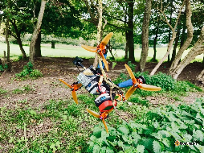
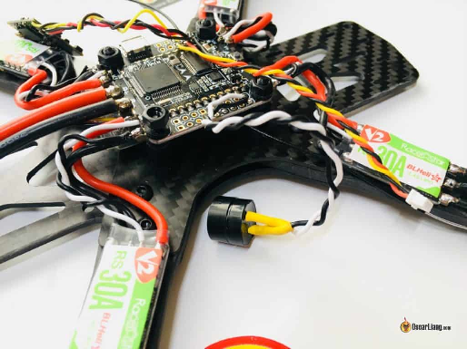
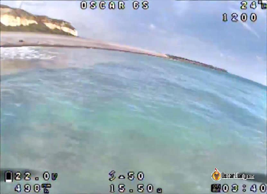
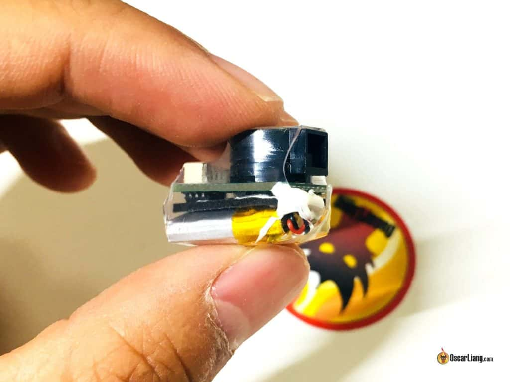

Стисле посилання на цей переклад: [https://bit.ly/findFPV](https://bit.ly/findFPV)  

|  | Нижче вичитаний людьми машинний український переклад оригіналу. Для [VictoryDrones](https://www.victory-drones.com/) переклад вичитали: Faina, Max Well. Хочете покращити переклад чи знайшли помилку? — Лишіть коментар (Ctrl+Alt+M або «Меню» \> «Вставка» \> «Коментар»). Ми теж живі люди (як і ви) і робим помилки. Роботи їх, до речі, також роблять 😉 |
| :---- | :---- |

# Як знайти втрачений FPV дрон {#як-знайти-втрачений-fpv-дрон}

4th November 2018

Буває що квадрокоптер падає, і як би ви не намагалися, просто не можете його знайти\! У цій статті я покажу вам, як знайти дрон і які заходи безпеки ви можете вжити. 

*Деякі посилання на цій сторінці є партнерськими. Я \[автор англомовної версії Оскар Ланг\] отримую комісію (без додаткових витрат для вас), якщо ви робите покупку після натискання одного із цих партнерських посилань. Це допомагає підтримувати безкоштовний контент для спільноти на цьому веб\-сайті. Будь ласка, прочитайте нашу [Політику партнерських посилань](https://oscarliang.com/affiliate-program-policy/) для отримання додаткової інформації.*

**Зміст**

**Знайти загублений FPV дрон якщо акумулятор все ще підключений:**	

[Обов'язково – aктивувати пристрій для звукового сигналу	3](#обов'язково-–-активувати-пристрій-для-звукового-сигналу)

[Перевірте DVR (відеозапис).	3](#перевірте-dvr-\(відеозапис\).)

[Використання шолома для пошуку загубленого дрона	4](#використання-fpv-окулярів-для-пошуку-загубленого-дрона)

[Використання пульта для пошуку загубленого дрона	6](#використання-пульта-для-пошуку-загубленого-дрона)

**Знайти загублений FPV дрон якщо акумулятор LiPo відключився під час аварії** (Як це визначити? Ви, ймовірно, втратили обидва сигнали радіосистеми/відео в цей момент):

[Зумер із власною батареєю	7](#зумер-із-власною-батареєю)

[Останні координати GPS	8](#останні-координати-gps-якщо-у-вас-встановлений-gps-модуль,-ви-можете-або-відобразити-gps-координати-в-osd-https://bit.ly/liangbetaflightosd,-або-записати-їх-у-ваш-taranis-як-частину-телеметричних-даних.)

[Системи Пошуку Дронів	9](#системи-пошуку-дронів)

[Loc8tor Lite	9](#loc8tor-lite)

[tBeacon GPS-трекер	9](#tbeacon-gps-трекер)

## **Обов'язково – активувати пристрій для звукового сигналу** {#обов'язково-–-активувати-пристрій-для-звукового-сигналу}

Сподіваюся, ви вже знаєте це. Якщо ні, ось як [встановити зумер](https://oscarliang.com/buzzer-quadcopters/) [https://oscarliang.com/buzzer-quadcopters/](https://oscarliang.com/buzzer-quadcopters/) у ваш квадрокоптер і увімкнути режим пристрою для звукового сигналу *\[пікалки\]* на вкладці режимів Betaflight [https://bit.ly/LiangBetaflightModes](https://bit.ly/LiangBetaflightModes). Також дуже корисно увімкнути маяк регуляторами обертів DShot як резервний варіант. [https://oscarliang.com/dshot-beacon/](https://oscarliang.com/dshot-beacon/)

  
Єдиний недолік зумера полягає в тому, що ви повинні бути дуже близько до квадрокоптера, щоб чути звуковий сигнал. Якщо у вас все ще є сигнал радіосистеми (наприклад, телеметрія), але ви не чуєте зумера, це, ймовірно, означає, що ви занадто далеко. У такому випадку спробуйте наступний метод.

## **Перевірте DVR (відеозапис).**  {#перевірте-dvr-(відеозапис).}

Я постійно це наголошую: ЗАВЖДИ записуйте свій політ на DVR. Коли ви розіб'єтеся, ви зможете переглянути запис і дізнатися, де саме ви розбилися. Під час мої останньoї [аварії](https://oscarliang.com/quadcopter-crash-into-water/) [https://oscarliang.com/quadcopter-crash-into-water/](https://oscarliang.com/quadcopter-crash-into-water/) в морі я зміг повернути свій квадрокоптер лише тому, що мав запис на DVR\!  
У окулярах [Fatshark](https://oscarliang.com/fatshark-hdo-hd3/) ви можете увімкнути “Автозапис” у меню DVR.

## **Використання FPV-окулярів для пошуку загубленого дрона** {#використання-fpv-окулярів-для-пошуку-загубленого-дрона}

Не багато людей знають цей трюк, але він може бути надзвичайно корисним і допоміжним\!

Ви можете використовувати приймач відеосигналу у FPV-окулярах, щоб знайти дрон\! Цей трюк базується на значенні RSSI (рівень сигналу).

Зніміть всеспрямовану антену, використовуйте лише одну спрямовану антену [bit.ly/LiangBestFPVAnt](http://bit.ly/LiangBestFPVAnt), таку як спіральна або патч-антена (чим вище підсилення, тим краще). 

Якщо направити тільки спрямовану антену на ваш дрон, значення RSSI буде найвищим. Коли ви відвернете її від дрона, значення RSSI зменшиться. Таким чином, ви можете визначити, в якому напрямку лежить ваш дрон.

Я створив цю інфографіку, щоб допомогти вам візуалізувати, як це працює :)

Цей спрацює тільки якщо ваш квадрокоптер ще увімкнений. Коли ви наближаєтеся до квадрокоптера, буде важче визначити напрямок; у цьому випадку спробуйте знизити потужність VTX у меню OSD Betaflight (якщо у вас налаштовано керування VTX [https://oscarliang.com/vtx-control/](https://oscarliang.com/vtx-control/)). І використовуйте ще додатково пристрій для звукового сигналу *\[пікалку\]*.

Деякі модулі VRX мають вбудований «режим пошуку», який має приємніший інтерфейс, але принцип той самий.

## **Використання пульта для пошуку загубленого дрона** {#використання-пульта-для-пошуку-загубленого-дрона}

У схожий спосіб можна задіяти пульт для пошуку квадрокоптера.

Найкраще, якщо ваш передавач TX читає числове значення RSSI, якщо ні, просто дивіться на індикатор сигналу у верхній частині екрану.

Сигнал найслабший, коли антена спрямована безпосередньо на квадрокоптер. Тому рухайте антену передавача, і коли знайдете найнижче значення RSSI, йдіть у напрямку, в який вказує антена.

Чим ближче ви підходите до квадрокоптера, тим сильнішим стає сигнал, і тим важче визначити напрямок. Просто переведіть передавач у режим перевірки дальності test mode (на сторінці налаштування моделі Taranis, поруч із опцією Bind «Біндувати», ви побачите опцію Range «Дальність»).  
Знову ж таки, це працюватиме тільки якщо ваш квадрокоптер ще ввімкнений *\[прим пер.: і якщо на приймачі і на передавачі включена телеметрія\]*. Якщо батарея від'єдналася, вам доведеться покладатися на деякі з наступних методів.

## **Зумер із власною батареєю**  {#зумер-із-власною-батареєю}

Ці автономні зумери будуть продовжувати працювати навіть коли ваша основна LiPo батарея від’єднається. І вони можуть замінити ваш звичайний зумер у квадрокоптері, тому додаткова вага та розмір мінімальні.

У мене є пост, де я порівнюю кілька популярних варіантів [https://oscarliang.com/drone-buzzers-with-battery/](https://oscarliang.com/drone-buzzers-with-battery/).

  
Хоча деякі з цих варіантів голосніше, ніж звичайні пристрої для звукового сигналу, вам все одно потрібно бути досить близько до квадрокоптера, щоб почути його.

## **Останні координати GPS** Якщо у вас встановлений GPS-модуль, ви можете або відобразити GPS-координати в OSD [**https://bit.ly/LiangBetaflightOSD**](https://bit.ly/LiangBetaflightOSD), або записати їх у ваш Taranis як частину телеметричних даних. {#останні-координати-gps-якщо-у-вас-встановлений-gps-модуль,-ви-можете-або-відобразити-gps-координати-в-osd-https://bit.ly/liangbetaflightosd,-або-записати-їх-у-ваш-taranis-як-частину-телеметричних-даних.}

## Тут у мене є підручник [**https://bit.ly/LiangTelemetryLogEdgeTX**](https://bit.ly/LiangTelemetryLogEdgeTX), який пояснює, як записувати GPS-координати та інші телеметричні дані в пульті OpenTX/EdgeTX.

## Після отримання координат просто скопіюйте їх і вставте в Google Maps, і вам буде показано місце розташування.

## **Системи Пошуку Дронів**  {#системи-пошуку-дронів}

Існують також інші, більш спеціалізовані системи для пошуку впавших дронів. 

### **Loc8tor Lite** {#loc8tor-lite}

[Знаходить ваш дрон на відстані,якщо я не помиляюся, до 120 метрів, базуючись на радіохвилях. Виправте мене, якщо я неправий. Сторінка](https://amzn.to/2DkCObL) виробу[: https://amzn.to/2DkCObL](https://amzn.to/2DkCObL)

### **tBeacon GPS-трекер**  {#tbeacon-gps-трекер}

Деякі досить дорогі GPS-трекери, які ви можете встановити на свої квадрокоптери. Сторінка виробу: [https://tbeacon.org/?page=10\&language=en](https://tbeacon.org/?page=10&language=en)  
Я впевнений, що існують й інші подібні вироби, я буду оновлювати список. Дайте мені знати, якщо я щось пропустив.

**8 comments**

[Reply](https://oscarliang.com/find-lost-quadcopter/#comment-130462)

Ben

4th September 2020 \- 8:40 pm

Ось трюк з аматорського радіо, який ми можемо використати для визначення напрямку радіоджерела:  
Ваша батарея повинна залишатися підключеною.  
Притисніть радіопередавач до свого тіла, наприклад, до живота, і подивіться на значення RSSI.  
Тепер повільно обертайтеся на місці на 360 градусів, звертаючи увагу на те, де значення RSSI максимальне. По суті, ви використовуєте своє тіло як щит для блокування сигналу.  
Там, де RSSI максимальне, знаходиться напрямок вашого квадрокоптера. Я зміг використати цей метод, щоб знайти впалий квадрокоптер на другий день польотів після того, як я розбився у високій траві. 

[Reply](https://oscarliang.com/find-lost-quadcopter/#comment-34081)

Maxwell

4th July 2019 \- 9:09 am

Цікаво, чи варто спробувати навмисно заблокувати/закрити антену FPV окулярів, щоб "зосередити" прийом сигналу на меншій і більш спрямованій області? Можливо, розмістити металеву трубку над нею з отвором або щілиною з одного боку? Чи це не спрацює через те, що радіосигнал все одно відбивається від багатьох об'єктів? Я новачок у цій справі і мало що знаю про радіочастотні речі. 

[Reply](https://oscarliang.com/find-lost-quadcopter/#comment-21232)

Oscar

15th July 2019 \- 4:39 pm  
Не зовсім обов'язково… Відбиття сигналу не повинно на це впливати.  

[image1]: 

[image2]: 

[image3]: 

[image4]: 

[image5]: 