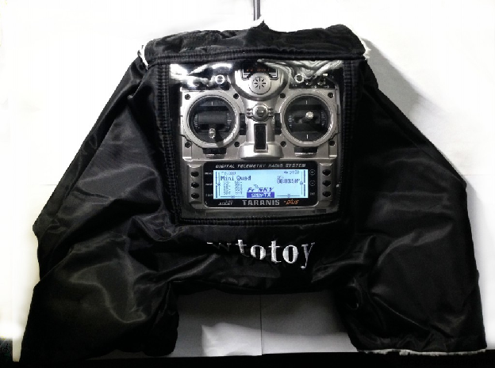
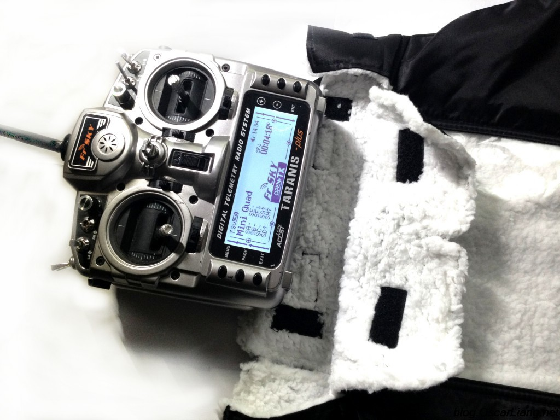
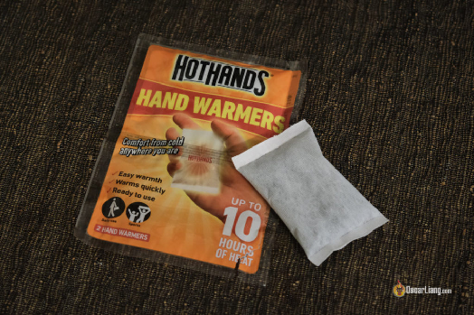
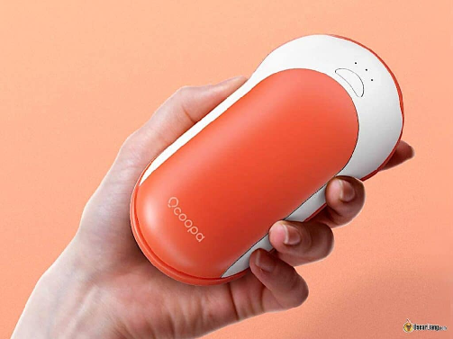
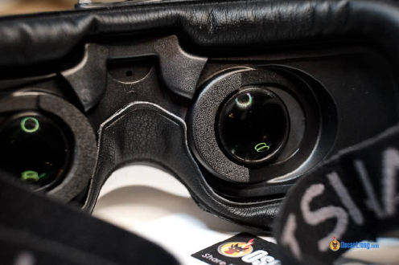
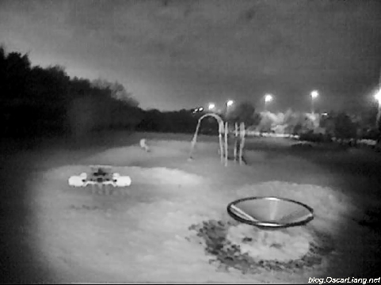
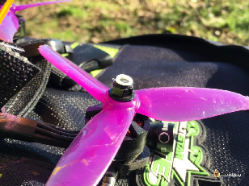
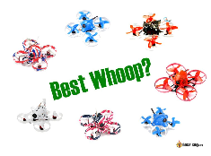
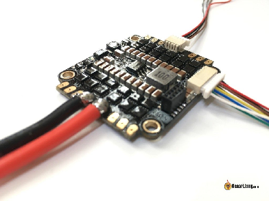

Стисле посилання на цей переклад: [https://bit.ly/LiangWinterFlyFPV](https://bit.ly/LiangWinterFlyFPV)    

|  | Нижче вичитаний людьми машинний український переклад оригіналу. Для [VictoryDrones](https://www.victory-drones.com/) переклад вичитали: Faina, Max Well\!. Хочете покращити переклад чи знайшли помилку? — Лишіть коментар (Ctrl+Alt+M або «Меню» \> «Вставка» \> «Коментар»). Ми теж живі люди (як і ви) і робим помилки. Роботи їх, до речі, також роблять 😉 |
| :---: | :---- |

# **Як літати на FPV-дроні взимку: поради**

5 грудня 2022 р

Політ на FPV-дроні взимку може бути складним для пілотів і моделей літальних апаратів. Низькі температури можуть призвести навіть до таких висловів, як «гарна погода для польоту, але занадто холодно, щоб вийти на вулицю\!» Ось кілька порад, які допоможуть вам і вашим дронам пережити морозні зимові сеанси FPV.

*Деякі посилання на цій сторінці є партнерськими. Я \[автор англомовної версії Оскар Ланг\] отримую комісію (без додаткових витрат для вас), якщо ви робите покупку після натискання одного із цих партнерських посилань. Це допомагає підтримувати безкоштовний контент для спільноти на цьому веб\-сайті. Будь ласка, прочитайте нашу [Політику партнерських посилань](https://oscarliang.com/affiliate-program-policy/) для отримання додаткової інформації.*

Зміст

[Батареї і холодна погода](#батареї-і-холодна-погода)

[Робота з передавачами в холодну погоду](#робота-з-передавачами-в-холодну-погоду)

[Одноразові підігрівачі рук](#одноразові-підігрівачі-рук)

[Oбігрівач рук, що підзаряджається](#oбігрівач-рук,-що-підзаряджається)

[Керування дроном з автомобіля](#керування-дроном-з-автомобіля)

[Запотівання окулярів](#запотівання-окулярів)

[Ночні польоти](#ночні-польоти)

[На холоді деякі компоненти ламаються](#на-холоді-деякі-компоненти-ламаються)

[FPV симулятори](#fpv-симулятори)

[Польот у квартирі](#польот-у-квартирі)

[Придбайте розрядник](#придбайте-розрядник)

[Висновок: Зима не означає перерву у польоті FPV\!](#висновок:-зима-не-означає-перерву-у-польоті-fpv!)

[Історія редагувань](#історія-редагувань)

* 

## **Батареї і холодна погода** {#батареї-і-холодна-погода}

Холодні температури мають значний вплив на продуктивність батареї. Холод запобігає перегріву компонентів і робить повітря щільнішим, що покращує ефективність пропелерів, але [можe призвести до поганої роботи батарей](https://intofpv.com/t-temperature-affects-battery-s-power-and-max-discharge-rate). Особливо холод діє на акумулятори LiPo і Li-ion, які працюють найкраще при температурі близько 35°C (95°F). При температурі нижче 18°C (64°F) ви помітите помітне зниження потужності і скорочення часу польоту.

Важливо підтримувати батареї в теплі перед і під час польоту. Запасні батареї в кишені і використані LiPo-акумулятори як обігрівачі рук \- це практичні рішення. 

Насправді, той самий принцип застосовується до будь-якої батареї, яка зазвичай використовується в обладнанні FPV, включаючи ті, що використовуються для камер GoPro. Вони також не триматимуться так довго в холоді. Зазвичай ви можете отримати 10 польотів з однієї батареї, але взимку це число може скоротитися до 7 перед відключенням. Корисний трюк \- мати кілька запасних батарей і чергувати їх для кожного польоту. Тримайте їх у теплому місці (наприклад, у кишені) перед тим як вставляти в  в GoPro i це може значно збільшити час роботи. Також існують спеціальні батареї GoPro, призначені для холодних температур. 

Для підтвердження цієї теорії я провів експеримент приблизно при 10°C. Я керував дроном по трасі кілька разів і записував максимальну вихідну потужність батареї. Як видно з графіка, максимальна вихідна потужність поступово зростає, досягаючи піку під час польоту, коли батарея нагрівається, але потім повільно зменшується, коли заряд батареї вичерпується. 

---

## **Робота з передавачами в холодну погоду**  {#робота-з-передавачами-в-холодну-погоду}

  
Холодна погода впливає на вашу спритність, i пальці німіють, ускладнюючи плавне керування дроном. Рукавички “Radio gloves” – для мене хорошe рішення, щоб тримати пальці в теплі.  
Ці рукавички для передавача, які я використовую вже кілька років, закривають передавач і руки, але дозволяють чітко бачити екран. Pекомендую\! Отримайте їх тут:

* **AliExpress: [https://s.click.aliexpress.com/e/\_DDu4hsZ](https://s.click.aliexpress.com/e/_DDu4hsZ)**  
* **Amazon: [https://amzn.to/3Ry1EKk](https://amzn.to/3Ry1EKk)**

Це підходить для різних повноформатних передавачів, включаючи Radiomaster TX16S, Boxer, Zorro, Pocket, Jumper T20S та T-Lite. Однак, майте на увазі, що пластикова кришка гнеться і перешкоджає керуванню. Я просто використовую картонні вставки, щоб утримувати кришку. 

---

## **Одноразові підігрівачі рук**  {#одноразові-підігрівачі-рук}

**Можна придбати тут, Amazon: [https://amzn.to/3VRawtP](https://amzn.to/3VRawtP).**

За ціною всього 1 долар за упаковку, приблизно на 8 годин (перевірено і підтверджено), це, ймовірно, найбільш економічний спосіб нагріватися для тих, хто не літає часто. Наскільки вони теплі? Вони трохи тепліші, ніж LiPo після інтенсивного польоту на FPV-дроні з 5-дюймовим пропелером, але не настільки гарячі, щоб обпекти руки.  
Ці одноразові розігрівачі рук схожі на великі чайні пакети і надзвичайно прості у використанні. Просто вийміть їх з упаковки, і вони починають нагріватися протягом кількох хвилин.  
Ці розігрівачі рук ідеально підходять не тільки для FPV, вони також чудові для прогулянок на вулиці в холодну погоду. Особливо мені подобається помістити один в мою рукавичку передавача і кишеню для виняткового тепла, трохи схоже на чашку ірландської кави, але для рук :D 

---

## **Oбігрівач рук, що підзаряджається**  {#oбігрівач-рук,-що-підзаряджається}

   
**Можна придбати тут:**

* **Amazon: [https://amzn.to/3OYNGy9](https://amzn.to/3OYNGy9)**  
* **AliExpress: [https://s.click.aliexpress.com/e/\_DlBIDRV](https://s.click.aliexpress.com/e/_DlBIDRV)**

Якщо ви часто літаєте взимку, oбігрівач рук, що підзаряджається, може бути вигідною інвестицією. Деякі моделі також функціонують як банки живлення, здатні перезаряджати вашу камеру GoPro та смартфон на місці, що досить зручно. Вони також можуть використовуватися для підігріву вашої батареї.

Ви можете помістити ці обігрівачі рук всередину безпалецевих рукавичок, щоб не замерзали кінчики пальців. Але важливо обрати обігрівачі рук, які достатньо тонкі, щоб зручно поміститися всередині рукавичок.

## **Керування дроном з автомобіля**  {#керування-дроном-з-автомобіля}

Один зі способів не замерзнути під час польоту на FPV-дронах взимку – це сидячі y автомобілі з увімкненим обігрівачем. 

Однак, слід пам'ятати, що керування дроном з автомобіля може послабити сигнал. Ви, можливо, зможете управляти дроном, якщо залишитесь у відносно близькому діапазоні. Рекомендується спочатку літати обережно, щоб оцінити зменшення дальності і адаптуватися відповідно.

**Як керувати FPV з автомобіля**

Якщо ви плануєте літати на значну відстань, можна використовувати антени збільшеної довжини або зовнішні приймачі, розташовуючи їх на даху автомобіля.

Наприклад, для радіопередавача можна використовувати SMA-подовжувач з магнітною підставкою. Ці подовжувачі підходять як для систем з частотою 900 МГц (Crossfire & ExpressLRS), так і для систем з частотою 2,4 ГГц (ExpressLRS, Ghost, Frsky). Проте слід пам'ятати, що довгий коаксіальний кабель також може призвести до згасання сигналу. Альтернативою може бути монтаж передавача зовні автомобіля, хоча це може бути складніше. 

Придбайте SMA-подовжувач з магнітною підставкою (3 метри): 

* **Amazon: [https://amzn.to/3h0zpV7](https://amzn.to/3h0zpV7)**  
* **AliExpress: [https://s.click.aliexpress.com/e/\_DewKkUj](https://s.click.aliexpress.com/e/_DewKkUj)**

Для відео зв'язку ви можете встановити зовнішній приймач зверху на машинi і підключити його до окулярів за допомогою довгого AV кабелю. [FuriousFPV Dock-King](https://oscarliang.com/furiousfpv-dockking-ground-station/) був хорошим варіантом завдяки вбудованому магніту, який прикріплюється до металу, але він більше не виробляється. Як альтернативу, ви можете зробити [щось подібне до того, що я зробив тут](https://oscarliang.com/diy-fpv-display-fatshark-module/) і замовити його друк на 3D принтері. 

---

## **Запотівання окулярів** {#запотівання-окулярів}

FPV-окуляри можуть запотівати взимку через різницю температур. Я виявив, що попереднє підігрівання їх перед використанням, наприклад, надіти їх на лоба або просто залишити їх підключеними протягом 10 хвилин, може допомогти.  

---

## **Ночні польоти** {#ночні-польоти}

У зимовий період дні стають коротшими, тому люди з роботою з 9 до 5 можуть пропустити можливість літати протягом дня. Однак, ви можете літати на FPV вночі з доброю камерою нічного бачення. Перегляньте цю статтю, [де я пояснюю, як літати вночі, і порівнюю кілька відмінних FPV-камер для нічного польоту](https://oscarliang.com/flying-fpv-at-night/). Камери, які я тестував у тому пості, можуть бути трохи застарілими, ось новіші камери, які добре справляються з низьким освітленням.

**Для DJI – найкращі Caddx Polar і Runcam Wasp:**

**Caddx Polar:**

* **AliExpress: [https://s.click.aliexpress.com](https://s.click.aliexpress.com/e/_DBKfPMH)**  
* **GetFPV: [https://oscarliang.com/product-f5tq](https://oscarliang.com/product-f5tq)**  
* **Amazon: [https://amzn.to/3IOSkL9](https://amzn.to/3IOSkL9)**  
* **Caddx: [https://oscarliang.com/product-agow](https://oscarliang.com/product-agow)**  
* **NBD: [https://oscarliang.com/product-wcdg](https://oscarliang.com/product-wcdg)**

**Runcam Wasp:**

* **AliExpress: [https://s.click.aliexpress.com](https://s.click.aliexpress.com/e/_DBmAyfh)**  
* **GetFPV: [https://oscarliang.com/product-flho](https://oscarliang.com/product-flho)**  
* **RDQ: [https://oscarliang.com/product-awlg](https://oscarliang.com/product-awlg)**

**Для Walksnail – найкращі Avatar Pro:**

* **Caddx: [https://oscarliang.com/product-xpso](https://oscarliang.com/product-xpso)**  
* **RDQ: [https://oscarliang.com/product-tfta](https://oscarliang.com/product-tfta)**  
* **GetFPV: [https://oscarliang.com/product-65ws](https://oscarliang.com/product-65ws)**  
* **AE: [https://s.click.aliexpress.com/e/\_DdGReBT](https://s.click.aliexpress.com/e/_DdGReBT)**  
* **Amazon: [https://amzn.to/3JvbW8H](https://amzn.to/3JvbW8H)**

**Аналоговi камери – найкращі нічні камери Foxeer Micro CAT 3:**

* **GetFPV: [https://oscarliang.com/product-kg72](https://oscarliang.com/product-kg72)**  
* **RDQ: [https://oscarliang.com/product-5b8q](https://oscarliang.com/product-5b8q)**  
* **Amazon: [https://amzn.to/3CeKiZA](https://amzn.to/3CeKiZA)**

Якщо вам потрібна камера Nano-розміру для нічного польоту, то Toothless 2 Nano Starlight є досить хорошим варіантом. Проте, переконайтеся, що ви купуєте версію Starlight для слабкого освітлення. Купуйте **Foxeer Toothless 2 Nano Starlight**. 

* **GetFPV: [https://oscarliang.com/product-zsne](https://oscarliang.com/product-zsne)**  
* **RDQ: [https://oscarliang.com/product-vp2w](https://oscarliang.com/product-vp2w)**  
* **NBD: [https://oscarliang.com/product-dyda](https://oscarliang.com/product-dyda)**

---

## **На холоді деякі компоненти ламаються**  {#на-холоді-деякі-компоненти-ламаються}

Холодні температури роблять пластикові деталі, такі як пропелери і TPU, більш крихкими, стрічка і клей також можуть втратити липкість, що збільшує ймовірність ламання. Запасні частини є обов'язковими. 

*Нейлонова гайка для фіксації пропелера не підходить для зими...* 

---

## **FPV симулятори** {#fpv-симулятори}

Холодно на вулиці? FPV-симулятори чудово підходять для тренування в приміщенні. 

Зараз є так багато варіантів FPV-симуляторів з безліччю трас і мап, на яких ви можете тренуватися. Вони будуть розважати вас, поки не набридне. 

Подивіться наш [огляд всіх популярних варіантів FPV-симуляторів](https://oscarliang.com/fpv-simulator/).

## **Польот у квартирі** {#польот-у-квартирі}

Ви можете придбати малий вуп і літати в будинку, вони маленькі і веселі (доки ви не залетите y волосся вашої дружини)\! Якщо ви цікавитесь, які маленькі вупи краще придбати, перегляньте [мій посібник по маленьким вупам, в якому я пояснюю всі популярні варіанти і аксесуари](https://docs.google.com/document/d/1ngEiojqBdi4zSps7nWCmysh8VqM02WEw0fXrJzm4nNc/edit). 

  
**Гідроізоляція і застосування конформного покриття**

Гідроізоляція вашої електроніки є надзвичайно важливою не тільки для польотів над водою, але й для захисту від надмірної вологості і крапель води в повітрі та на траві взимку. Важливо тримати вашу модель сухою після кожної сесії польоту.

Привчіть себе складати все в сумку перед тим як нести до хати. Переконайтеся, що сумка закрита, щоб утримувати холодне, сухе повітря всередині. Це запобігає конденсації на вашій електроніці від теплого, вологого повітря всередині приміщення. Як тільки все прогріється до кімнатної температури, ви можете вийняти їх з сумки. 

На мою думку, найкращий спосіб захисту від води \- це конформнe покриття. Це необов'язково для моторів, оскільки вони не зaкоротяться при змочуванні. Однак розгляньте можливість нанесення конформного покриття на ваш польотний контролер, регулятор обертів, відеопередавач, приймач і, можливо, на камеру FPV. Будьте обережні при нанесенні покриття; уникайте потрапляння на кнопки, USB-роз'єми, барометри і сенсори зображення камери, оскільки це може пошкодити ці компоненти. 

 Ось мій посібник “[Гідроізоляція електроніки FPV-дронів — посібник із застосування силіконового конформного покриття](https://docs.google.com/document/d/1Vyb1BFbSqjQI7YqLs5BeRQi3s8M7RHPID1ZycVYRPFw/edit)”. 

Remember, many electronic components can stop working or even burn out upon contact with water, especially salt water, which is more electrically conductive than fresh water. Waterproofing can protect your components when flying or crashing in wet environments.

Also, bringing a landing mat can be a simple yet effective solution to keep your drone clean and dry. Be mindful of where you land – avoid puddles, mud, and snow as much as possible.

Пам'ятайте, багато електронних компонентів можуть перестати працювати або навіть вигоріти при контакті з водою, особливо морською водою, яка є більш електропровідною, ніж прісна вода. Гідроізоляція може захистити ваші компоненти під час польоту або аварії у вологих середовищах.

Також, використання спеціальної підстилки для посадки може бути простим, але ефективним рішенням щоб дрон залишався чистим і сухим. Будьте уважні щодо місця посадки \- уникайте калюж, бруду і снігу, наскільки це можливо. 

## **Придбайте розрядник** {#придбайте-розрядник}

Догляд за вашими LiPo-акумуляторами є надзвичайно важливим, навіть якщо ви не літаєте.

Якщо ви не плануєте літати протягом тривалого періоду (наприклад, місяця або більше), зберігайте всі свої акумулятори в вогнестійкому контейнері та переконайтеся, що вони розряджені до приблизно 3,8 В та 3,85 В (напруга зберігання), щоб максимізувати їхній термін служби.

Якщо у вас залишилися повні заряджені акумулятори після сеансу, використовуйте розрядник, щоб зручно привести їх до напруги зберігання. 

## **Висновок: Зима не означає перерву у польоті FPV\!** {#висновок:-зима-не-означає-перерву-у-польоті-fpv!}

Польоти на FPV дронах взимку \- це захоплюючий досвід, який ставить перед вами унікальні виклики. Підготовивши своє обладнання, розуміючи вплив навколишнього середовища і адаптуючи техніки польоту, ви зможете насолоджуватися безпечними і незабутніми польотами. Пам'ятайте, що зимові польоти можуть знизити ефективність вашого дрона, але краса пейзажу і свіжий повітря можуть зробити ваші польоти надзвичайно захопливими. Залишайтесь у теплі, будьте у безпеці і насолоджуйтесь небесами протягом зимового сезону. 

#### **Історія редагувань** {#історія-редагувань}

\- Листопад 2015 р. \- Стаття створена  
\- Грудень 2017 р. \- Додана інформація про продуктивність LiPo, Гідроізоляція, FPV-симулятор і нагрівальний пакет  
\- Листопад 2018 р. \- Додана інформація про "політ з автомобіля", оновлена стаття  
\- Січень 2020 р. \- Оновлено  
\- Січень 2021 р. \- Оновлено  
\- Грудень 2022 р. \- Оновлено, скорочено URL  
\- Грудень 2023 р. \- Оновлено статтю і посилання на продукт 

**Kоментарі**

Добрa стаття, як завжди, Оскаре. Чи можна залишити ліпо-батареї разом у одній ліпо-сумці *\[сумка для зберігання батарей\],* при напрузі 3,8 В, у дуже холодному гаражі (приблизно 2C/35F)?

ВІДПОВІДЬ  
ОСКАР  
7 лютого 2021 р. \- 20:25  
Мені здається, що це нормально. Але якщо у вас є більше ліпо-сумок, то я б розділив їх між якомога більшою кількістю сумoк :)

[REPLY](https://oscarliang.com/fly-fpv-winter/#comment-52885)

ЛЮК СКАЙВОКЕР  
29 січня 2020 року \- 21:48  
Добрa стаття,  
Вам зовсім не потрібен відеоприймач зовні, лише антена зовні. Той самий тип магнітного SMA-подовжувача кабелю підійде для вашого відеоприймача в окулярах з антеною на даху вашої машини.

РАЙАН МОНАГАН  
25 листопада 2018 року \- 7:21 ранку  
Ви також можете нагрівати свій передавач зсередини \-\> instagram.com/p/BpAOXtZnXuA/

ВІДПОВІДЬ  
ОСКАР  
8 грудня 2018 року \- 2:36 пополудні  
Я натрапив на цю ідею 2-3 роки тому, я б це зробив, якби товар не був відсутній на складі :) Але зараз я думаю, що я використовую його лише 2-3 місяці на рік, це занадто багато роботи :D 

[REPLY](https://oscarliang.com/fly-fpv-winter/#comment-19634)

ФРЕЙЗЕР СТІН  
23 листопада 2018 р. \- 12:41 пополудні  
Я взяв шматок шампура для барбекю і вставив його в петлі ретязка таранісa, щоб створити намет у моїй рукавиці для пульта і тримати його на відстані від моїх пальців.

ВІДПОВІДЬ  
ОСКАР  
8 грудня 2018 р. \- 2:15 пополудні  
Яка гарна ідея\!

ТОМАС  
26 лютого 2018 року \- 14:59  
Я використовую обігрівач від Hobbyking разом з рукавичкою для передавача. Затишно тепло\! НЕ використовуйте його з 3S. На ньому написано, що він працює, але він починає плавитись. З 2S все гаразд. Рекомендую використовувати 3000mAh 2S Lipos. Спочатку я використовував FPV Pack ємністю 1200mAh, але він швидко розряджався.  
Посилання: hobbyking.com/de\_de/hobbyking-universal-heater-system.html

ТОМАС ГАБРІЕЛЬ  
12 листопада 2018 року \- 8:00 ранку  
Я також використовую його і підтверджую попередження. Використовуйте тільки 2S. На 3S воно розплавиться\!  
Я головним чином пілот RC-гелікоптера. Стрес на 12S-акумулятори порівнянний зі стресом на гоночні квадрокоптери. Я використовую спеціально збудований нагрівальний кофр для попереднього підігріву моїх ліпоакумуляторів. Як тільки вони зігріваються, ви можете літати при будь-якій температурі, оскільки під навантаженням вони більше не охолоджуються під час польоту. 

[REPLY](https://oscarliang.com/fly-fpv-winter/#comment-19410)

МАКСИМ  
10 листопада 2015 року \- 13:37  
Привіт, Оскар,  
Ще одне дуже дешеве рішення, як тримати руки в теплі, \-- це купити дешеві полярні рукавички і вирізати половину великого пальця. Це ідеально підходить для температури в середині сезону.  
Максим

ВІДПОВІДЬ  
ОСКАР  
11 листопада 2015 року \- 13:11  
Так, це дуже правда :) Це також буде швидке і дешеве рішення :) 

[REPLY](https://oscarliang.com/fly-fpv-winter/#comment-7875)

ПЕТЕР  
7 листопада 2018 року \- 13:29  
Я використовую стрілецькі рукавички, в яких є знімний великий палець і вказівний палець. Це означає, що вони працюють як звичайні рукавички, поки ви не готові летіти. Виробляють їх компанія SealSkinz. 

[image1]: 

[image2]: 

[image3]: 

[image4]: 

[image5]: 

[image6]: 

[image7]: 

[image8]: 

[image9]: 

[image10]: 