Стисле посилання на цей переклад: [https://bit.ly/LiangTinyWoops](https://bit.ly/LiangTinyWoops)   

| 🫂 | Нижче вичитаний людьми машинний український переклад оригіналу. Для [VictoryDrones](https://www.victory-drones.com/) переклад вичитали: Faina\!. Хочете покращити переклад чи знайшли помилку? — Лишіть коментар (Ctrl+Alt+M або «Меню» \> «Вставка» \> «Коментар»). Ми теж живі люди (як і ви) і робимо помилки. Роботи їх, до речі, також роблять 😉 |
| :---: | :---- |

# Найкращі Малі Вупи та аксесуари | «Кімнатні» мікро FPV-дрони

19 квітня 2023 року

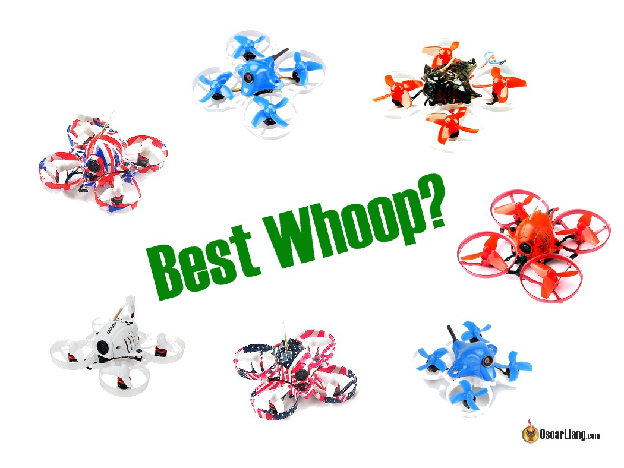

Дізнайтеся про найкращі Малі Вупи на ринку: ці маленькі FPV-дрони ідеально підходять для польотів і перегонів у приміщенні. У цій статті ми надамо вичерпний список найпопулярніших доступних Малих Вупів із детальним описом їхніх характеристик, плюсів і мінусів, щоб допомогти вам прийняти зважене рішення.

*Деякі посилання на цій сторінці є партнерськими. Я \[автор англомовної версії Оскар Ланг\] отримую комісію (без додаткових витрат для вас), якщо ви робите покупку після натискання одного із цих партнерських посилань. Це допомагає підтримувати безкоштовний контент для спільноти на цьому веб\-сайті. Будь ласка, прочитайте нашу [Політику партнерських посилань](https://oscarliang.com/affiliate-program-policy/) для отримання додаткової інформації.*

* # Зміст

[Що таке Малі Вупи?](#що-таке-малі-вупи?)

[Найкращi 65-мм Малі Вупи](#найкращi-65-мм-малі-вупи)

[Mobula6](#mobula6)

[NewBeeDrone Acrobee65 BLV4](#newbeedrone-acrobee65-blv4)

[Mobeetle6](#mobeetle6)

[Mobula6 HDZero Edition](#mobula6-hdzero-edition)

[Найкращий 75-мм Mалий Bуп](#найкращий-75-мм-mалий-bуп)

[Mobula7 1S](#mobula7-1s)

[Moblite7](#moblite7)

[BetaFPV Meteor75 Pro](#betafpv-meteor75-pro)

[Політна основа: 65 мм або 75 мм](#політна-основа:-65-мм-або-75-мм)

[Колекторні і безколекторні мотори](#колекторні-і-безколекторні-мотори)

[Кількість елементів батареї: 1S або 2S](#кількість-елементів-батареї:-1s-або-2s)

[Роз'єми LiPo батареї](#роз'єми-lipo-батареї)

[Купити роз’єми BT2.0](#купити-роз’єми-bt2.0)

[Купити роз’єми PH2.0](#купити-роз’єми-ph2.0)

[Купити роз’єми A30](#купити-роз’єми-a30)

[Основні аксесуари та запчастини](#основні-аксесуари-та-запчастини)

[Найкращі батареї 1S LiPo для 65мм Малих Вупів](#найкращі-батареї-1s-lipo-для-65мм-малих-вупів)

[BetaFPV 1S 300мА/г (BT2)](#betafpv-1s-300ма/г-\(bt2\))

[Tattu 1S 300мА/г (BT2)](#tattu-1s-300ма/г-\(bt2\))

[Tattu 1S 300мА/г (PH2)](#tattu-1s-300ма/г-\(ph2\))

[Nitro Nectar Gold 1S 300мА/г (PH2)](#nitro-nectar-gold-1s-300ма/г-\(ph2\))

[Батареї 1S LiPo для 75mm Малих Вупів](#батареї-1s-lipo-для-75mm-малих-вупів)

[BetaFPV 1S 450мА/г (BT2)](#betafpv-1s-450ма/г-\(bt2\))

[BetaFPV 1S 550мА/г (BT2)](#betafpv-1s-550ма/г-\(bt2\))

[GNB 1S 450мА/г (PH2)](#gnb-1s-450ма/г-\(ph2\))

[Emax 1S 450мА/г (PH2)](#emax-1s-450ма/г-\(ph2\))

[Батареї 2S LiPo для 75mm Малих Вупів](#батареї-2s-lipo-для-75mm-малих-вупів)

[Tattu 2S 450мА/г](#tattu-2s-450ма/г)

[GNB 2S 450мА/г](#gnb-2s-450ма/г)

[Найкращі зарядні пристрої для Малих Вупів](#найкращі-зарядні-пристрої-для-малих-вупів)

[Vifly WhoopStor V3](#vifly-whoopstor-v3)

[6-портовий зарядний пристрій BetaFPV 6-портів 1S LiPo](#6-портовий-зарядний-пристрій-betafpv-6-портів-1s-lipo)

[3арядний пристрій BetaFPV BT2.0 V2](#3арядний-пристрій-betafpv-bt2.0-v2)

[Смарт-пристрій для зарядки NewBeeDrone Nectar Injector](#смарт-пристрій-для-зарядки-newbeedrone-nectar-injector)

[3арядна плата ViFly Whoop Serial](#3арядна-плата-vifly-whoop-serial)

[31-міліметрові пропелери для 65-міліметрових вупів](#31-міліметрові-пропелери-для-65-міліметрових-вупів)

[Три-лопатевий Gemfan 1219-3 з валом 1мм](#три-лопатевий-gemfan-1219-3-з-валом-1мм)

[Три-лопатевий Gemfan 1208 Triblade з валом 1мм](#три-лопатевий-gemfan-1208-triblade-з-валом-1мм)

[Дво-лопатеві пропелери Gemfan 1210-2](#дво-лопатеві-пропелери-gemfan-1210-2)

[40-міліметрові пропелери для 75-міліметрових вупів](#40-міліметрові-пропелери-для-75-міліметрових-вупів)

[Дво-лопатеві пропелери Gemfan 1610-2](#дво-лопатеві-пропелери-gemfan-1610-2)

[Три-лопатевi HQProp 40MM з валом 1.5мм](#три-лопатевi-hqprop-40mm-з-валом-1.5мм)

[Мотори](#мотори)

[Happymodel SE0702 Motor 26000кВ](#happymodel-se0702-motor-26000кв)

[T-Motor M0802 Micro](#t-motor-m0802-micro)

[Польотні контролери](#польотні-контролери)

[BETAFPV F4 1S 5A AIO FC Board](#betafpv-f4-1s-5a-aio-fc-board)

[JHEMCU GSF405A 5A AIO FC Board](#jhemcu-gsf405a-5a-aio-fc-board)

[Happymodel F4 5A 5in1 ExpressLRS AIO FC Board](#happymodel-f4-5a-5in1-expresslrs-aio-fc-board)

[Антена відеопередавача (VTX)](#антена-відеопередавача-\(vtx\))

[TrueRC Singularity 5.8GHz Антена з коротким роз’ємом U.FL](#truerc-singularity-5.8ghz-антена-з-коротким-роз’ємом-u.fl)

[Запасні 65-міліметрові рами для кріплення](#запасні-65-міліметрові-рами-для-кріплення)

[Рама BetaFPV Meteor65](#рама-betafpv-meteor65)

[Рама NewBeeDrone V2 Cockroach](#рама-newbeedrone-v2-cockroach)

[Приймачі ExpressLRS](#приймачі-expresslrs)

[Використання Expo тяги для польотів в приміщенні](#використання-expo-тяги-для-польотів-в-приміщенні)

[Історія редагування](#історія-редагування)

* 

## **Що таке Малі Вупи?** {#що-таке-малі-вупи?}

Малі Вупи — це невеликi кімнатні FPV-дрони із пропелерами діаметром 31–40 мм, що мають захисні кожухи (також відомими як повітропроводи) та рамою 65 або 75 мм. Зазвичай вони працюють від батарей  LiPo 1S або 2S. “Tiny Whoop” — торгова марка американської компанії, яка популяризувала цей тип мікродронів, тому люди, які займаються хобі, називають усі ці маленькі дрони просто «Tiny Whoops– Малі Вупи». Ці доступні, прості в управлінні FPV ідеально підходять для польотів у приміщенні, а також можуть літати на відкритому повітрі в захищених від вітру місцях. Захист пропелерів покращує безпеку та зменшує пошкодження під час аварій.

## **Найкращi 65-мм Малі Вупи** {#найкращi-65-мм-малі-вупи}

Ці 65-мм Малі Вупи невеликі, відносно тихі, ними легко керувати, що робить їх найкращими для польотів у приміщенні. Кілька моделей «з'єднай (пульт) і лети». *\[bind and fly\]* виділяються завдяки своїй чудовій продуктивності, довговічності та хорошому співвідношенню ціна-якість.

### **Mobula6** {#mobula6}

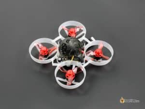

Я вважаю Happymodel Mobula6 одним із найкращих кімнатних дронів. Компактний розмір у поєднанні з маневреністю та керованістю робить його надійним для навігації в приміщенні. З батареями та аксесуарами в комплекті – це хороше співвідношення ціна-якість. Mobula6 — один із найменших Малих Вупів із рамою 65 мм і опорами 31 мм. Спочатку він поставлявся з протоколом FrSky D8, але остання версія доступна з ExpressLRS, що забезпечує ще кращий діапазон і кращy загальну продуктивність.

Виберіть варіант мотору на 25 000 кВ для більшої потужності та для сумісності з найновішими прошивками i налаштуйте [потужність мотору в Betaflight](https://oscarliang.com/reduce-power-throttle-taranis-betaflight/#betaflight-cli), щоб відрегулювати. Mobula6 може похвалитися плавним польотом і спритним керуванням, завдяки чому літати крізь вітальні чи офісні приміщення стає справжньою розвагою. Головним недоліком є, ймовірно, не завжди хороший контроль якості. [Перегляньте мій повний огляд Mobula6 тут](https://oscarliang.com/mobula6/).

**Версія ELRS (рекомендовано):**

**Ali:[https://s.click.aliexpress.com/e/\_Dedulot](https://s.click.aliexpress.com/e/_Dedulot)**  
**BG:[https://oscarliang.com/product-hh70](https://oscarliang.com/product-hh70)**  
**GetFPV:[https://oscarliang.com/product-9aey](https://oscarliang.com/product-9aey)**  
**Amazon:[https://amzn.to/3vFY0BR](https://amzn.to/3vFY0BR)**

**Версія Frsky/Flysky**

**Banggood:[https://bit.ly/3gbi6L4](https://bit.ly/3gbi6L4)**  
**GetFPV:[https://bit.ly/2BpcjTb](https://bit.ly/2BpcjTb)**

### **NewBeeDrone Acrobee65 BLV4** {#newbeedrone-acrobee65-blv4}

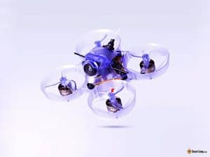

AcroBee65 BLV4 від NewBeeDrone — це багатофункціональний малий FPV вуп для новачків. Однією з суттєвих переваг цієї моделі є сам виробник. Компанія NewBeeDrone, що базується в Каліфорнії, відома своєю чудовою підтримкою клієнтів, яка є важливою для новачків.

Він пропонує такі оновлення, як ExpressLRS, регулятор обертів BlueJay більш міцну раму. Однак він має недоліки, такі як більша вага та застарілий роз'єм батареї PH2.0. Перегляньте цю публікацію, щоб дізнатися більше про цей дрон: [https://oscarliang.com/newbeedrone-acrobee65-blv4-tiny-whoop/](https://oscarliang.com/newbeedrone-acrobee65-blv4-tiny-whoop/)

Це непростий вибір між Acrobee i Mobula6, враховуючи різні фактори, такі як ціна та вага (що впливає на продуктивність польоту). Найсильніша сторона Acrobee полягає в підтримці, яку ви отримуєте від виробника. З NewBeeDrone ви купуєте не просто продукт, а й спеціальне обслуговування клієнтів.

**Отримайте Acrobee65 BL4 від цих постачальників:**

**NBD:[https://oscarliang.com/product-qc15](https://oscarliang.com/product-qc15)**  
**RDQ:[https://oscarliang.com/product-snww](https://oscarliang.com/product-snww)**

### **Mobeetle6** {#mobeetle6}

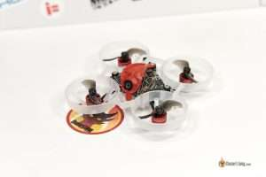

Happymodel Mobeetle6 — це надлегкий FPV дрон із політною основою 65 мм і вагою лише 17,5 г. Він пропонує підтримку ExpressLRS, відеопередавач VTX потужністю 400 мВт і можливість перетворюватися на мікродрон-”зубочистку”. Незважаючи на невеликі розміри, він забезпечує вражаючу продуктивність і маневреність. Але не дуже підходе для фрістайл польотів  і акро польотів через обмежений крутний момент крихітних двигунів. Mobeetle6 ідеально підходить для тих, хто надає перевагу компактності та універсальності. Щоб отримати докладніший огляд, перегляньте цю публікацію: [https://oscarliang.com/happymodel-mobeetle/](https://oscarliang.com/happymodel-mobeetle/)

**Знайдіть Mobeetle у цих продавців:**

**Алі:[https://s.click.aliexpress.com/e/\_DEKxKLb](https://s.click.aliexpress.com/e/_DEKxKLb)**  
**BG:[https://oscarliang.com/product-z2jn](https://oscarliang.com/product-z2jn)**  
**RDQ:[https://oscarliang.com/product-ea71](https://oscarliang.com/product-ea71)**  
**MF:[https://oscarliang.com/product-mtaq](https://oscarliang.com/product-mtaq)**  
**GetFPV:[https://oscarliang.com/product-k2eb](https://oscarliang.com/product-k2eb)**

### **Mobula6 HDZero Edition** {#mobula6-hdzero-edition}

### 

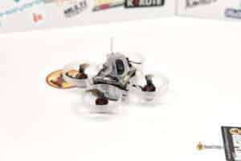

Mobula6 HDZero Edition для тих хто використовує систему HDZero FPV, оснащена комбінацією вражаючої камери HDZero Nano Lite i відеопередавача VTX. При вазі лише 4 грами, ця комбінація цифрової камери та відеопередавача забезпечує чудовий радіус дії та якість відео порівняно з аналоговою камерою. Хоча додаткова вага помітна під час польоту в приміщенні, покращені візуальні ефекти та відеореєстратор 720p роблять його переконливим вибором. Щоб краще впоратися з доданою вагою, дуже рекомендую модернізувати мотори з більшою потужністю кВ, наприклад мотори 0802 25000 кВ або 27000 кВ. Повний огляд: [https://oscarliang.com/mobula6-hdzero/](https://oscarliang.com/mobula6-hdzero/)

**Отримайте Mobula6 HDZero Edition з:**

**АЛЕ:[https://s.click.aliexpress.com/e/\_DlhVhUt](https://s.click.aliexpress.com/e/_DlhVhUt)**  
**BG:[https://oscarliang.com/product-evin](https://oscarliang.com/product-evin)**  
**GetFPV:[https://oscarliang.com/product-fdlt](https://oscarliang.com/product-fdlt)**  
**RDQ:[https://oscarliang.com/product-l7ai](https://oscarliang.com/product-l7ai)**

---

## **Найкращий 75-мм Mалий Bуп** {#найкращий-75-мм-mалий-bуп}

Якщо вам потрібен потужніший малий вуп, можливо навіть для польотів надворі, 75-мм є кращим вибором, ніж 65-мм. Є також більше можливостей, коли справа доходить до систем HD Digital FPV.

### **Mobula7 1S** {#mobula7-1s}

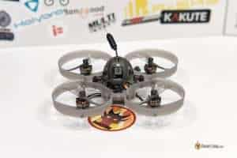

Mobula7 1S спирається на сильні сторони Mobula6, пропонуючи більшу платформу з більшими пропелерами для збільшення потужності, швидкості та часу польоту. Усі ці сильні сторони сприяють універсальності. Незважаючи на те, що Mobula7 1S трохи менш маневрений, через велику вагу, він вирізняється потужністю та швидкістю, завдяки чому літати у великому внутрішньому просторі стає цікавіше, навіть можливo літати на вулиці в тихий день. Він також забезпечує вдосконалене апаратне забезпечення та легше регулювання нахилy камери. Якби мeні можна було вибрати тільки один малий вуп, я б вибрав цей. Перегляньте мій повний огляд Mobula7 тут: [https://oscarliang.com/mobula7-1s-whoop/](https://oscarliang.com/mobula7-1s-whoop/)

Цей доступний малий вуп 1S можна легко відрегулювати, щоб зменшити потужність для польотів у приміщенні, змінивши кут камери та обмеживши максимальнy тягy. Підручник: [Як зменшити максимальну потужність?](https://oscarliang.com/reduce-power-throttle-taranis-betaflight/)

**Придбайте Mobula7 у цих постачальників:**

**АЛЕ:[https://s.click.aliexpress.com/e/\_DBguz3f](https://s.click.aliexpress.com/e/_DBguz3f)**  
**BG:[https://oscarliang.com/product-124e](https://oscarliang.com/product-124e)**  
**RDQ:[https://oscarliang.com/product-5ytr](https://oscarliang.com/product-5ytr)**  
**GetFPV:[https://oscarliang.com/product-ja41](https://oscarliang.com/product-ja41)**  
**Amazon:[https://amzn.to/41EOflP](https://amzn.to/41EOflP)**

### **Moblite7** {#moblite7}

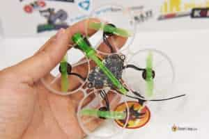

Moblite 7 — це надлегкий варіант Mobula7, який забезпечує виняткову швидкість і подовжений час польоту завдяки мінімальній вазі. Однак його невелика вага можлива за рахунок довговічності та зручності використання. Для отримання додаткової інформації зверніться до повного огляду Moblite7. [https://oscarliang.com/moblite6-moblite7/](https://oscarliang.com/moblite6-moblite7/)

У порівнянні з Mobula6, Moblite7 рекомендовано через його вражаючу швидкість і час польоту понад 10 хвилин. Компроміс полягає в тому, що Moblite7 може бути важче контролювати в обмеженому просторі через його підвищену швидкість і імпульс. Навпаки, Mobula6 забезпечує більш точне керування та стійкість до аварій. Якщо ваш пріоритет — продуктивність польоту, Moblite 7 — чудовий вибір. Однак, якщо довговічність є більш важливою, зверніть увагу на Mobula6 і Mobula7.

**Сторінки продукту Mobite7:**

**АЛЕ:[https://s.click.aliexpress.com/e/\_Dm5hTFP](https://s.click.aliexpress.com/e/_Dm5hTFP)**  
**BG:[https://oscarliang.com/product-lhzs](https://oscarliang.com/product-lhzs)**  
**GetFPV:[https://oscarliang.com/product-usjp](https://oscarliang.com/product-usjp)**  
**RDQ:[https://oscarliang.com/product-oh82](https://oscarliang.com/product-oh82)**

### **BetaFPV Meteor75 Pro** {#betafpv-meteor75-pro}

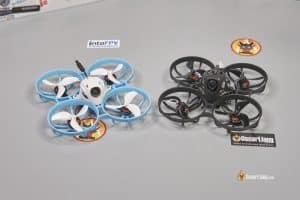

[BetaFPV Meteor75](https://oscarliang.com/betafpv-meteor75-pro-whoop-analog/) — це малий вуп 1S, який доступний у різних системах FPV: аналогових, Walksnail Avatar і HDZero, i забезпечує чудове HD-відео. Він має інтегрований ExpressLRS, що забезпечує чудовий діапазон. У ньому використовуються трохи більші пропелери, що дає їм додаткову потужність і стабільність для польотів надворі. Але Meteor75 важчий за Mobula7 через більший розмір, що впливає на його маневреність, особливо під час польоту в приміщенні.

Незважаючи на це, Meteor75 все ще пропонує плавний, приємний досвід польоту, а стандартна настройка ПІД досить пристойна. HD-відео, надане Walksnail VTX, вражає, забезпечуючи чіткіші та захоплюючі зображення. Але аналогова версія легша, тому вона також літає трохи краще. Якщо ви шукаєте малий вуп 1S для польотів надворі, це варто розглянути.

**HD версія**

**BetaFPV:[https://oscarliang.com/product-r2la](https://oscarliang.com/product-r2la)**  
**RDQ:[https://oscarliang.com/product-nghw](https://oscarliang.com/product-nghw)**  
**Amazon:[https://amzn.to/42J9jbL](https://amzn.to/42J9jbL)**  
**AliExpress:[https://s.click.aliexpress.com/e/\_DlLKttR](https://s.click.aliexpress.com/e/_DlLKttR)**

**Аналогова версія**

**BetaFPV:[https://oscarliang.com/product-l5z4](https://oscarliang.com/product-l5z4)**  
**Amazon:[https://amzn.to/3BwAQS0](https://amzn.to/3BwAQS0)**  
**Aliexpress:[https://s.click.aliexpress.com/e/\_DdvPnnx](https://s.click.aliexpress.com/e/_DdvPnnx)**  
**RDQ:[https://oscarliang.com/product-ghtu](https://oscarliang.com/product-ghtu)**

## **Політна основа: 65 мм або 75 мм** {#політна-основа:-65-мм-або-75-мм}

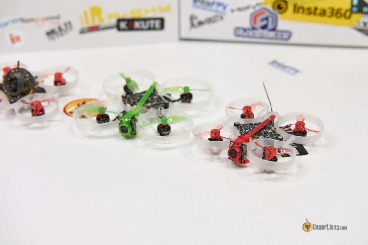

*Праворуч: малий вуп 65 мм, посередині: малий вуп 75 мм*

Політна основа стосується розміру рами, тобто відстані між двома діагональними моторами. Для малих вупів політнa базa зазвичай бува двyх розміpiв: 65 мм і 75 мм.

65-мм вупи є класичними, вони маневреніші та легші в управлінні, і є більш популярним вибором для польотів у приміщенні, оскільки вони також трохи меншими. З іншого боку, 75-міліметрові вупи пропонують більшу потужність завдяки більшим пропелерам та батареям. Mоже здатися, що ними важче керувати, ніж 65-мм, але вони універсальніші та швидші.

Якщо ви не визначитеся між 65-мм і 75-мм вупом, –75-мм, як правило, забезпечує довший час польоту, вищу швидкість і кращу стабільність для польотів надворі. Однак 65-міліметрові вуп є більш гнучкими та можe переміщатися в менших просторах. На деяких гонках допускається лише 65-мм вупи, тож візьміть це до уваги, якщо ви серйозно ставитеся до перегонів.

### **Колекторні і безколекторні мотори** {#колекторні-і-безколекторні-мотори}

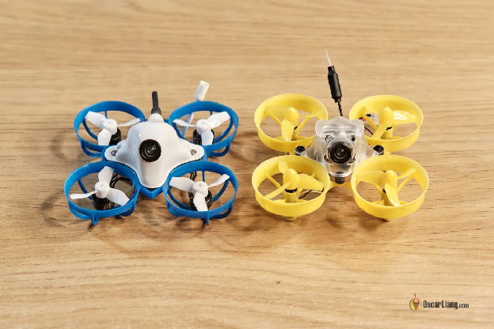

Tiny Whoops використовує два типи моторів: [колекторні і безколекторні](https://oscarliang.com/brushed-vs-brushless-tiny-whoops/).   
Коротко:

* Безколекторний Вуп: потужніший, краща довговічність мотора, підтримує режим черепахи, 48 кГц і фільтр обертів на хвилину

* Колекторний Вуп: дешевший, простий і легкий

Раніше вибір типу мотора для малих вупів був більш складним. Однак із впровадженням у BLHeli\_S таких функцій продуктивності, як фільтр обертів/ хвилину і підтримка 48 кГц, безколекторні мотори стали очевидним вибором. Зараз рідко можна зустріти Малий Вуп із колекторним моторoм.

### **Кількість елементів батареї: 1S або 2S** {#кількість-елементів-батареї:-1s-або-2s}

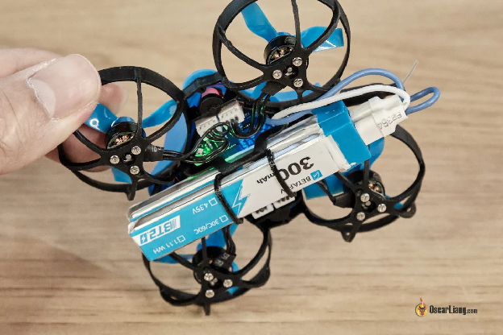

Дізнайтеся про кількість елементів LiPo [у цьому підручнику](https://docs.google.com/document/d/1bYaQQ59u0c7EJcsN8B8-amzMMHvdYYn2boU1-4rCjug/edit).

Малі вупи зазвичай працюють на блоках батарей 1S або 2S, де 1S означає один елемент, а 2S — два елемента. Як правило, чим вище число елементів, тим потужніший дрон.

Малі вупи 1S легші, тихіші, безпечніші та завдають менше шкоди під час аварій, що робить їх ідеальними для звичайних польотів FPV у приміщенні. З іншого боку, 2S вупи потужніші та більше підходять для польотів надворі в тиху погоду або для підйому більшого корисного вантажу, наприклад кращих камер або систем FPV. Проте їм може бути важче літати в закритих приміщеннях.

### **Роз'єми LiPo батареї** {#роз'єми-lipo-батареї}

[Як перевірено, роз’єм BT2.0 краще роз’ємy PH2.0](https://oscarliang.com/micro-battery-connectors-testing/) завдяки більшій потужності та трохи довшому часу польоту. Це пояснюється його меншим опором і меншим падінням напруги під навантаженням. Використовувyйте BT2.0, коли можете.

Маючи роз’єм PH2.0, ви можете легко замінити його на роз’єм BT2.0, якщо знаєте, як паяти. Уникайте використання адаптера, оскільки він створює опір і зводить нанівець переваги роз’єму BT2.0.

Втім, роз’єми PH2.0 функціональні та достатні для звичайних польотів, а батареї з роз’ємом такого типу більш доступні. Важливо вибрати тип роз’єму, перш ніж купувати LiPo батареї оптом, щоб переконатися, що вони мають відповідні роз’єми.

[A30 \- це новий роз'єм від GNB](https://oscarliang.com/a30-battery-connector/). Він має продуктивність подібну до BT2.0, але не повністю сумісний з BT2.0.

#### **Купити роз’єми BT2.0** {#купити-роз’єми-bt2.0}

AliExpress:[https://s.click.aliexpress.com/e/\_DDTv0pr](https://s.click.aliexpress.com/e/_DDTv0pr)  
BetaFPV:[https://oscarliang.com/product-awi0](https://oscarliang.com/product-awi0)  
GetFPV:[https://oscarliang.com/product-mi5n](https://oscarliang.com/product-mi5n)  
RDQ:[https://oscarliang.com/product-nltm](https://oscarliang.com/product-nltm)

#### **Купити роз’єми PH2.0** {#купити-роз’єми-ph2.0}

AliExpress:[https://s.click.aliexpress.com/e/\_DevCP1j](https://s.click.aliexpress.com/e/_DevCP1j)  
NBD:[https://oscarliang.com/product-hr8f](https://oscarliang.com/product-hr8f)  
GetFPV:[https://oscarliang.com/product-hfwp](https://oscarliang.com/product-hfwp)  
RDQ:[https://oscarliang.com/product-pedr](https://oscarliang.com/product-pedr)

#### **Купити роз’єми A30** {#купити-роз’єми-a30}

AliExpress:[https://s.click.aliexpress.com/e/\_DBQgEW1](https://s.click.aliexpress.com/e/_DBQgEW1)

---

## **Основні аксесуари та запчастини** {#основні-аксесуари-та-запчастини}

Ось деякі корисні аксесуари та деталі для Малих Вупів.

### **Найкращі батареї 1S LiPo для 65мм Малих Вупів** {#найкращі-батареї-1s-lipo-для-65мм-малих-вупів}

Більшість Малих Вупів використовують батареї LiHV для більшої потужності та ємності при меншій вазі, але вони також сумісні i з батареями LiPo. Батареї LiHV – це стандартний варіант.

Батареї підключаються до вашого малого вупа через роз’єм. Більшість вупів мають роз’єм PH2.0, тому переконайтеся, що придбані вами батареї сумісні *\[прим. пер.: якщо не сумісні \- шукайте перехідники\]*. Усі представлені тут батареї мають стандартну прямокутну форму та розміри, які щільно поміщаються в стандартні рами вупів.

#### **BetaFPV 1S 300мА/г (BT2)** {#betafpv-1s-300ма/г-(bt2)}

BetaFPV:[https://oscarliang.com/product-a2dx](https://oscarliang.com/product-a2dx)  
RDQ:[https://oscarliang.com/product-jtwz](https://oscarliang.com/product-jtwz)  
GetFPV:[https://oscarliang.com/product-25uo](https://oscarliang.com/product-25uo)  
AliExpress:[https://s.click.aliexpress.com/e/\_Dl271br](https://s.click.aliexpress.com/e/_Dl271br)

#### **Tattu 1S 300мА/г (BT2)** {#tattu-1s-300ма/г-(bt2)}

GetFPV:[https://oscarliang.com/product-9m75](https://oscarliang.com/product-9m75)  
RDQ:[https://oscarliang.com/product-zbeg](https://oscarliang.com/product-zbeg)  
AliExpress:[https://s.click.aliexpress.com/e/\_Dl271br](https://s.click.aliexpress.com/e/_Dl271br)  
NBD:[https://oscarliang.com/product-4ug9](https://oscarliang.com/product-4ug9)

#### **Tattu 1S 300мА/г (PH2)** {#tattu-1s-300ма/г-(ph2)}

AliExpress:[https://s.click.aliexpress.com/e/\_Dl271br](https://s.click.aliexpress.com/e/_Dl271br)  
NBD:[https://oscarliang.com/product-8z8o](https://oscarliang.com/product-8z8o)  
RDQ:[https://oscarliang.com/product-zbeg](https://oscarliang.com/product-zbeg)  
GetFPV:[https://oscarliang.com/product-ziy3](https://oscarliang.com/product-ziy3)

#### **Nitro Nectar Gold 1S 300мА/г (PH2)** {#nitro-nectar-gold-1s-300ма/г-(ph2)}

GetFPV:[https://oscarliang.com/product-jcny](https://oscarliang.com/product-jcny)  
NewBeeDrone:[https://oscarliang.com/product-7ih4](https://oscarliang.com/product-7ih4)  
RDQ:[https://oscarliang.com/product-qrnp](https://oscarliang.com/product-qrnp)  
AliExpress:[https://s.click.aliexpress.com/e/\_DEmkOyN](https://s.click.aliexpress.com/e/_DEmkOyN)

---

### **Батареї 1S LiPo для 75mm Малих Вупів** {#батареї-1s-lipo-для-75mm-малих-вупів}

#### **BetaFPV 1S 450мА/г (BT2)** {#betafpv-1s-450ма/г-(bt2)}

AliExpress: https://s.click.aliexpress.com/e/\_DDASpDL  
BetaFPV:[https://oscarliang.com/product-xej9](https://oscarliang.com/product-xej9)  
RDQ:[https://oscarliang.com/product-3ydl](https://oscarliang.com/product-3ydl)  
GetFPV:[https://oscarliang.com/product-ggeh](https://oscarliang.com/product-ggeh)

#### **BetaFPV 1S 550мА/г (BT2)** {#betafpv-1s-550ма/г-(bt2)}

BetaFPV:[https://oscarliang.com/product-xp39](https://oscarliang.com/product-xp39)  
AliExpress:[https://s.click.aliexpress.com/e/\_DErV3lb](https://s.click.aliexpress.com/e/_DErV3lb)

#### **GNB 1S 450мА/г (PH2)** {#gnb-1s-450ма/г-(ph2)}

RDQ:[https://oscarliang.com/product-ww7b](https://oscarliang.com/product-ww7b)  
AliExpress:[https://s.click.aliexpress.com/e/\_Dkiezkh](https://s.click.aliexpress.com/e/_Dkiezkh)  
NBD:[https://oscarliang.com/product-sxa2](https://oscarliang.com/product-sxa2)  
GetFPV:[https://oscarliang.com/product-qkj0](https://oscarliang.com/product-qkj0)

#### **Emax 1S 450мА/г (PH2)** {#emax-1s-450ма/г-(ph2)}

GetFPV:[https://oscarliang.com/product-cfaw](https://oscarliang.com/product-cfaw)  
RDQ:[https://oscarliang.com/product-xbkw](https://oscarliang.com/product-xbkw)  
AliExpress:[https://s.click.aliexpress.com/e/\_DCEqLg1](https://s.click.aliexpress.com/e/_DCEqLg1)  
NBD:[https://oscarliang.com/product-3yba](https://oscarliang.com/product-3yba)

---

### **Батареї 2S LiPo для 75mm Малих Вупів** {#батареї-2s-lipo-для-75mm-малих-вупів}

#### **Tattu 2S 450мА/г** {#tattu-2s-450ма/г}

GetFPV:[https://oscarliang.com/product-vzzk](https://oscarliang.com/product-vzzk)  
RDQ:[https://oscarliang.com/product-uhx5](https://oscarliang.com/product-uhx5)  
AliExpress:[https://s.click.aliexpress.com/e/\_DEJWsCl](https://s.click.aliexpress.com/e/_DEJWsCl)

#### **GNB 2S 450мА/г** {#gnb-2s-450ма/г}

AliExpress:[https://s.click.aliexpress.com/e/\_DeS9Z4D](https://s.click.aliexpress.com/e/_DeS9Z4D)  
NBD:[https://oscarliang.com/product-3e5i](https://oscarliang.com/product-3e5i)  
RDQ:[https://oscarliang.com/product-oara](https://oscarliang.com/product-oara)

---

### **Найкращі зарядні пристрої для Малих Вупів** {#найкращі-зарядні-пристрої-для-малих-вупів}

#### **Vifly WhoopStor V3** {#vifly-whoopstor-v3}

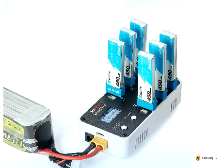

Vifly WhoopStor V3, мабуть, є одним із найбільш багатофункціональних зарядних пристроїв 1S LiPo, доступних на сьогоднi. Він вміщує популярні батареї BT2.0, A30 і PH2.0 і може незалежно заряджати до 6 батарей одночасно. Зарядний пристрій також підтримує режим розряджання та режим "зберігання", і має вражаючий зарядний струм до 1,3 А на порт. Для детального огляду зарядного пристрою WhoopStor V3 подивіться: [https://oscarliang.com/vifly-whoopstor-v3/](https://oscarliang.com/vifly-whoopstor-v3/)

**Знайдіть Vifly WhoopStor V3 у цих постачальників:**

**AliExpress:[https://s.click.aliexpress.com/e/\_DeZwHol](https://s.click.aliexpress.com/e/_DeZwHol)**  
**RDQ:[https://oscarliang.com/product-4ies](https://oscarliang.com/product-4ies)**

#### **6-портовий зарядний пристрій BetaFPV 6-портів 1S LiPo** {#6-портовий-зарядний-пристрій-betafpv-6-портів-1s-lipo}

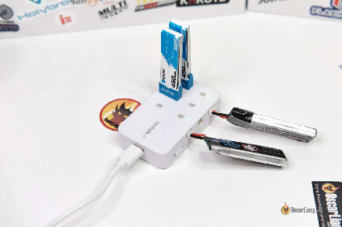

Цей універсальний зарядний пристрій 1S LiPo має роз’єми BT2.0 і PH2.0 і вхід USB-C. Це зарядний пристрій потужністю 30 Вт, але насправді він може досягати лише 25 Вт через те, що кожен порт може забезпечити зарядний струм до 1А. Проте зарядний струм 1А на порт є дуже потужним. Кінцеву напругу можна встановити на 4,20 В або 4,35 В за допомогою простого повзунка.

**Сторінки продуктів для 6-портового зарядного пристрою BetaFPV:**

**AliExpress:[https://s.click.aliexpress.com/e/\_DD1jLfr](https://s.click.aliexpress.com/e/_DD1jLfr)**  
**RDQ:[https://oscarliang.com/product-hoyr](https://oscarliang.com/product-hoyr)**  
**GetFPV:[https://oscarliang.com/product-i20d](https://oscarliang.com/product-i20d)**  
**BetaFPV:[https://oscarliang.com/product-6v8x](https://oscarliang.com/product-6v8x)**  
**Banggood:[https://oscarliang.com/product-d0mn](https://oscarliang.com/product-d0mn)**

#### **3арядний пристрій BetaFPV BT2.0 V2** {#3арядний-пристрій-betafpv-bt2.0-v2}

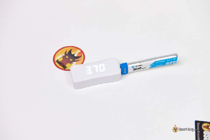

Зарядний пристрій, який виконує функцію вольтметра, призначений лише для батарей із роз’ємами BT2.0. Він отримує живлення через вхідний роз’єм USB-C і здатний заряджати два блоки одночасно до 4,35 В, тобто він сумісний лише з блоками LiHV. Не підходить для звичайних батарей LiPo, які потребують зарядки 4,20 В.

**Сторінки продукту:**

**BetaFPV:[https://oscarliang.com/product-j3s4](https://oscarliang.com/product-j3s4)**  
**GetFPV:[https://oscarliang.com/product-nxly](https://oscarliang.com/product-nxly)**

#### **Смарт-пристрій для зарядки NewBeeDrone Nectar Injector 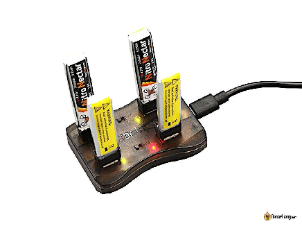 {#смарт-пристрій-для-зарядки-newbeedrone-nectar-injector}

Цей зарядний пристрій може заряджати до 4 батарей із роз’ємами PH2.0 одночасно, з регульованою кінцевою напругою для кожного боку двох портів. Перевагами цього зарядного пристрою є можливість контролювати кожну батарею, що заряджається, і постійно регулювати струм заряду, відповідно до стану зарядки. Він має режим крапельної зарядки для надто розряджених батарей (унікальна функція в зарядному пристрої 1S Lipo) і живиться від входу мікро USB 5 В.

**Сторінки продукту:**

**NewBeeDrone:[https://oscarliang.com/product-7b28](https://oscarliang.com/product-7b28)**  
**GetFPV:[https://oscarliang.com/product-c7b8](https://oscarliang.com/product-c7b8)**

#### **3арядна плата ViFly Whoop Serial 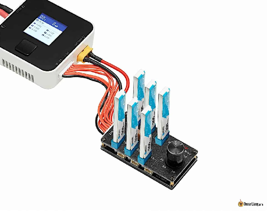 {#3арядна-плата-vifly-whoop-serial}

* **NewBeeDrone:[https://oscarliang.com/product-d3mu](https://oscarliang.com/product-d3mu)**  
* **AliExpress:[https://s.click.aliexpress.com/e/\_Dnn0omP](https://s.click.aliexpress.com/e/_Dnn0omP)**  
* **Amazon:[http://bit.ly/3VxGI5d](http://bit.ly/3VxGI5d)**

Це не зарядний пристрій, а зарядна плата. Він по суті з’єднує всі ваші батареї послідовно як одну батарею. На відміну від паралельного заряджання, при послідовному заряджанні, навіть якщо батареї мають дуже різну напругу, ви все одно можете підключити їх до плати, зарядний пристрій вирівняє напругу під час заряджання. Усі батареї мають бути одного типу (LiHV або LiPo). Ви можете дізнатися більше про послідовне заряджання в цьому посібнику: [https://oscarliang.com/serial-charging/](https://oscarliang.com/serial-charging/)

---

### **31-міліметрові пропелери для 65-міліметрових вупів** {#31-міліметрові-пропелери-для-65-міліметрових-вупів}

Хоча більшість 31-мм пропелерів призначені для моторів з валом 1 мм, найкраще підтвердити це перед замовленням, іноді мотори можуть мати вали 1,5 мм.

#### **Три-лопатевий Gemfan 1219-3 з валом 1мм** {#три-лопатевий-gemfan-1219-3-з-валом-1мм}

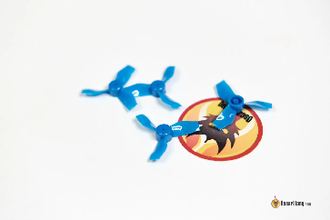

[Я випробував майже всі](https://oscarliang.com/tiny-whoop-prop/#conclusion) пропелери для вупів і виявив, що Три-лопатевий Gemfan 1219-3 з валом 1мм найкращий з точки зору потужності лише з невеликою втратою ефективності. Вони чудово підходять для моторів потужністю нижче 22000 кВ.

**Сторінки продукту:**

**BG:[https://oscarliang.com/product-0da5](https://oscarliang.com/product-0da5)**  
**GetFPV:[https://oscarliang.com/product-9k66](https://oscarliang.com/product-9k66)**  
**RDQ:[https://oscarliang.com/product-6q9s](https://oscarliang.com/product-6q9s)**  
**NBD:[https://oscarliang.com/product-1bu5](https://oscarliang.com/product-1bu5)**

#### **Три-лопатевий Gemfan 1208 Triblade з валом 1мм** {#три-лопатевий-gemfan-1208-triblade-з-валом-1мм}

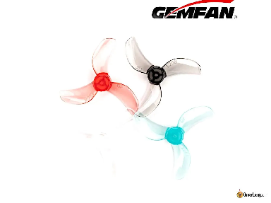

Пропелери Gemfan 1208-3 з валом  мм пропонують вражаюче поєднання легкої ваги та підвищену щільність, що робить їх улюбленим вибором серед гонщиків. Завдяки конструкції з низьким кроком ці пропепери добре поєднуються з моторами, що мають високий кВ, забезпечуючи довгий час польоту та чутливість. Монтажний отвір відповідного розміру з відкритим верхом забезпечує безпроблемну установку та демонтаж, що робить ці трилопатеві пропелери надійним варіантом для пілотів.

**AliExpress:[https://s.click.aliexpress.com/e/\_DkTm3EV](https://s.click.aliexpress.com/e/_DkTm3EV)**

#### **Дво-лопатеві пропелери Gemfan 1210-2**  {#дво-лопатеві-пропелери-gemfan-1210-2}

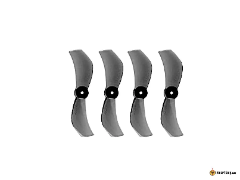

Щодо пропелерів, то мої улюблені для моторів з високим кВ (\>26000кВ) –   
Gemfan 1210-2. Для моторів з нижчими кВ можна спробувати різні варіанти, бо вони можуть значно вплинути на польотні характеристики. Завжди варто мати під рукою вибір пропелерів.

Сторінки товарів

BG:[https://oscarliang.com/product-hatc](https://oscarliang.com/product-hatc)  
GetFPV:[https://oscarliang.com/product-cs7a](https://oscarliang.com/product-cs7a)  
RDQ:[https://oscarliang.com/product-0r3x](https://oscarliang.com/product-0r3x)  
NBD:[https://oscarliang.com/product-uofa](https://oscarliang.com/product-uofa)

---

### **40-міліметрові пропелери для 75-міліметрових вупів** {#40-міліметрові-пропелери-для-75-міліметрових-вупів}

Це один із найефективніших пропелерів на ринку з чудовим балансом між потужністю та ефективністю. Обов’язково вибирайте правильний діаметр вала відповідно до моторів.

#### **Дво-лопатеві пропелери Gemfan 1610-2**  {#дво-лопатеві-пропелери-gemfan-1610-2}

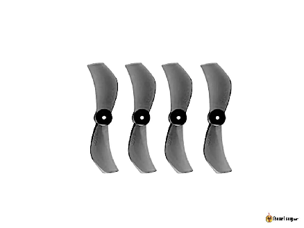

вал 1 мм:

NBD:[https://oscarliang.com/product-18le](https://oscarliang.com/product-18le)  
GetFPV:[https://oscarliang.com/product-6jdv](https://oscarliang.com/product-6jdv)  
BG:[https://oscarliang.com/product-u5do](https://oscarliang.com/product-u5do)

вал 1,5 мм

BG:[https://oscarliang.com/product-u5do](https://oscarliang.com/product-u5do)  
NBD:[https://oscarliang.com/product-qaaz](https://oscarliang.com/product-qaaz)  
GetFPV:[https://oscarliang.com/product-6oa8](https://oscarliang.com/product-6oa8)

#### **Три-лопатевi HQProp 40MM з валом 1.5мм**  {#три-лопатевi-hqprop-40mm-з-валом-1.5мм}

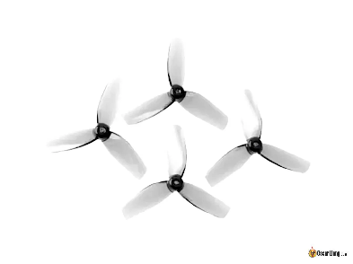

Ці пропелери ідеально підходять для малих вупів 75-ммі ідеально підходять для мотору розміру 1002\.

GetFPV:[https://oscarliang.com/product-bctm](https://oscarliang.com/product-bctm)  
RDQ:[https://oscarliang.com/product-un5c](https://oscarliang.com/product-un5c)

---

### **Мотори** {#мотори}

В Малих Вупах тенденція до використання моторів з вищим кВ (наприклад, 25000 кВ і 26000 кВ), бо вони дають більше потужності. Коротше кажучи, вищий кВ означає, що мотор обертатиметься швидше, якщо подавати ту саму напругу. Перегляньте [цю публікацію для більш детального пояснення](https://docs.google.com/document/d/1j43wgFqP1035SaA-8wyeigxSsuTFs5-sjlgJR2YPyOk/edit). 

Але вам потрібно підібрати правильні пропелери, щоб отримати максимальну продуктивність. Я виявив, що поєднання моторів з таким кВ з дволопатевими пропелерами Gemfan призводить до блискучих результатів. Це, мабуть, одні з найкращих пропелерів в Малих Вупах. Дволопатевим пропелерам потрібні високі оберти, щоб розкрити бажану потужність, зазвичай їх поєднання з моторами в діапазоні від 28 000 до 32 000 кВ дає чудовий результат.

У той час як досвідчені пілоти можуть використовувати весь потенціал двигунів з високим кВ, початківці та пілоти середнього рівня можуть вважати їх складними. Замість того, щоб купувати мотори з низьким кВ, я б рекомендував почати з моторів мінімум 26 000 кВ, а потім використовувати тягу або обмеження потужності мотора, щоб зменшити потужність, якщо це необхідно. За допомогою цього методу навіть менш досвідчені пілоти можуть поступово звикнути до моторів з вищим кВ, маючи при цьому можливість гнучко контролювати їх потужність.

Зауважте, що зазвичай не рекомендується обмежувати мотор нижче 65–70%, бо це може спричинити деякі проблеми з роздільною здатністю тяги.

#### **Happymodel SE0702 Motor 26000кВ** {#happymodel-se0702-motor-26000кв}

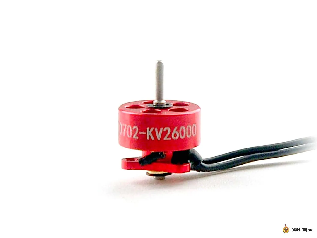

Мотор SE0702 від Happymodel — чудовий для легких гоночних збірок і один із найпопулярніших моторів. Висока потужність 26000 кВ забезпечує гнучкість, оскільки ви можете зменшити ліміт потужності моторy для кращого ККД над потужністю, напр. встановивши потужність моторy приблизно на 90%, ви отримаєте таку ж продуктивність, як і мотор на 24000 кВ.

RDQ:[https://oscarliang.com/product-mgoy](https://oscarliang.com/product-mgoy)  
GetFPV:[https://oscarliang.com/product-zko2](https://oscarliang.com/product-zko2)  
AliExpress:[https://s.click.aliexpress.com/e/\_Dc9FIet](https://s.click.aliexpress.com/e/_Dc9FIet)

#### **T-Motor M0802 Micro** {#t-motor-m0802-micro}

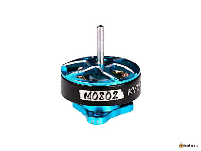

Мікромотори T-Motor M0802 можуть похвалитися відмінною якістю збірки. Вони ідеально підходять як для 65-мм, так і для 75-мм 1S Малих Вупів. Вибирайте варіант із вищою напругою 25000 кВ для кращогo результату, оскільки ви завжди можете зменшити потужність мотору для довшого часу польоту та ефективності або залишити стандартні заводські настройки для збільшення потужності.

GetFPV:[https://oscarliang.com/product-mv4s](https://oscarliang.com/product-mv4s)  
RDQ:[https://oscarliang.com/product-dk9g](https://oscarliang.com/product-dk9g)  
AliExpress:[https://s.click.aliexpress.com/e/\_DmTjMUN](https://s.click.aliexpress.com/e/_DmTjMUN)

Якщо ви хочете створити 75-мм Малий Вуп, мотори 1002 стануть чудовим вибором. Ці мотори пропонують вражаючу здатність керувати більшими 1,6-дюймовими (40 мм) пропелерами. У поєднанні з дволопатевими або трилопатевими пропелерами Gemfan і квадратною батареєю на 450 мА/г ці мотори працюють неймовірно добре.

---

### **Польотні контролери** {#польотні-контролери}

#### **BETAFPV F4 1S 5A AIO FC Board** {#betafpv-f4-1s-5a-aio-fc-board}

BetaFPV F4 FC — це легкий AIO *\[все-в-одному\]* з низькою затримкою ExpressLRS і надійною продуктивністю, схожою на якість і продуктивність популярних опцій від Happymodel. Його нова версія містить вбудований чіп Blackbox, який робить налаштування більш простим, а штекери двигуна можна знімати з прокладками під ними для додаткової економії ваги.

BetaFPV:[https://oscarliang.com/product-a2hg](https://oscarliang.com/product-a2hg)  
AliExpress:[https://s.click.aliexpress.com/e/\_Dc8QB7B](https://s.click.aliexpress.com/e/_Dc8QB7B)  
RDQ:[https://oscarliang.com/product-aqo5](https://oscarliang.com/product-aqo5)

#### **JHEMCU GSF405A 5A AIO FC Board** {#jhemcu-gsf405a-5a-aio-fc-board}

GSF405A від JHEMCU — це багатофункціональний польотний контролер для Малих Вупів, сумісний як з батареями 1S, так і 2S. Він поставляється з вбудованою Чорною скринькою, приймачем ExpressLRS на основі UART *\[універсальний асинхронний приймач/передавач\]*  і підтримує як цифрові, так і аналогові відеопередавачі VTX.

AliExpress:[https://s.click.aliexpress.com/e/\_DCeZKRx](https://s.click.aliexpress.com/e/_DCeZKRx)  
GetFPV:[https://oscarliang.com/product-jb2q](https://oscarliang.com/product-jb2q)  
RDQ:[https://oscarliang.com/product-dle2](https://oscarliang.com/product-dle2)

#### **Happymodel F4 5A 5in1 ExpressLRS AIO FC Board** {#happymodel-f4-5a-5in1-expresslrs-aio-fc-board}

Kомпактний і популярний польотний контролер Happymodel F4 є в багатьох Малих Вупax BNF. Він також має вбудований приймач ExpressLRS. Однак йому не вистачає можливостей Чорної скриньки, що ускладнює налаштування.

GetFPV:[https://oscarliang.com/product-dc69](https://oscarliang.com/product-dc69)  
AliExpress:[https://s.click.aliexpress.com/e/\_DFpbvhT](https://s.click.aliexpress.com/e/_DFpbvhT)

---

### **Антена відеопередавача (VTX)** {#антена-відеопередавача-(vtx)}

#### **TrueRC Singularity 5.8GHz Антена з коротким роз’ємом U.FL** {#truerc-singularity-5.8ghz-антена-з-коротким-роз’ємом-u.fl}

Більшість Малих Вупів BNF *\[з’єднай (пульт) і лети\]* постачаються з простою штирьовою антеною (лінійна поляризована дипольна антена). Вони нормальні, але оновлення до антени TrueRC Singularity забезпечує помітне покращення продуктивності, додаючи лише півграма ваги. Якщо у вас виникають проблеми з відеосигналом під час польоту в приміщенні, вам слід розглянути можливість переходу на антену з круговою поляризацією.[Тут я пояснив, чому антени з круговою поляризацією кращі для FPV, ніж антени з лінійною поляризацією.](https://drive.google.com/file/d/13ytwiuHZ9DEcv1IHZMO8-Q5EomyfTl37/edit).

Сторінки продукту:

* RDQ[https://oscarliang.com/product-2jy6](https://oscarliang.com/product-2jy6)  
* NBD:[https://oscarliang.com/product-93h6](https://oscarliang.com/product-93h6)

---

### **Запасні 65-міліметрові рами для кріплення** {#запасні-65-міліметрові-рами-для-кріплення}

Обидва варіанти є одними з найміцніших рам. Вони також мають багато варіантів кольорів. Будь яка рама хороша.

#### **Рама BetaFPV Meteor65**  {#рама-betafpv-meteor65}

* BetaFPV:[https://oscarliang.com/product-j3ax](https://oscarliang.com/product-j3ax)  
* GetFPV:[https://oscarliang.com/product-03gl](https://oscarliang.com/product-03gl)  
* RDQ:[https://oscarliang.com/product-5kfe](https://oscarliang.com/product-5kfe)

#### **Рама NewBeeDrone V2 Cockroach**  {#рама-newbeedrone-v2-cockroach}

* NBD:[https://oscarliang.com/product-adx1](https://oscarliang.com/product-adx1)  
* GetFPV:[https://oscarliang.com/product-k2v8](https://oscarliang.com/product-k2v8)

---

### **Приймачі ExpressLRS** {#приймачі-expresslrs}

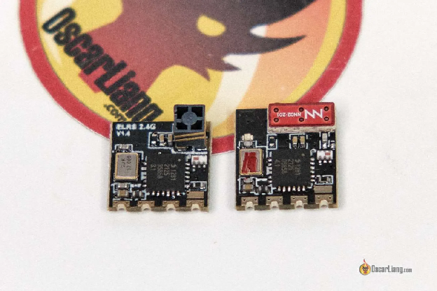

*Зліва: керамічна антена; Справа: плоска антена*

ExpressLRS найкращий зв'язок керування для Малих Вупів з багатьох причин. По-перше, відкритий код *\[open source\]* робить його доступним і адаптованим. Ця функція дозволила виробникам включити її у свої польотні контролери.

Крім того, ExpressLRS пропонує чудовий діапазон і проникнення, перевершуючи багатьох конкурентів на ринку (таких як Frsky D8/D16). Крім того, ExpressLRS повністю підтримує телеметрію. Правда, деяким користувачам спочатку налаштувати його може бути дещо складно, але коли ви його освоїте, побачите що продуктивність і універсальність варті того.

Багато польотних контролерів малих вупів мають вбудований приймач ELRS *\[система радіозв'язку FPV на далекі відcтані із інструментами швидкого налаштування\],* але якщо його немає, ви також можете підключити зовнішній приймач ELRS, якщо є запасний UART. Приймач RX дуже легкий, а антена компактна і не потребує монтажу. Щоб заощадити місце, обов’язково придбайте керамічнy (або пласкy) антену.

Щоб отримати оновлений список доступних приймачів, [перегляньте цей список](https://docs.google.com/document/d/1pxYxx-YFGNRM23mKjcozpws3Zwz7QE002h4_-P5WaUI/edit). 

## **Використання Expo тяги для польотів в приміщенні** {#використання-expo-тяги-для-польотів-в-приміщенні}

Щоб полегшити керування дроном в приміщенні, застосуйте Expo тяги.

Expo тяги стосується експоненціального регулювання кривої тяги, що дозволяє точніше контролювати тягу у вузьких пpоходах, особливо коли зараз більшість малих вупів оснащені потужними моторами.

З моторами, що мають високу кВ існує тенденція до значної втрати роздільної здатності тяги, що може ускладнити точне керування. Але під час польоту в приміщенні ви зазвичай зависаєте або летите на 30-35% тяги. Застосування 20-30 Expo тяги навколо цього значення тяги може зробити керування більш точним і легшим.

Дізнайтеся більше про [Throttle Expo тут](https://docs.google.com/document/d/1p-XaySAWipsd7i3cEpEaNVHczfDj1pL2qoWbJZqbxHc/edit). 

---

# **Історія редагування** {#історія-редагування}

* Жовтень 2018 р. – Допис створено: Mobula7, Beta65X/75X, AcroBee, UR65, UK65, US65, Snappy7  
* Січень 2019 р. – Оновлений список: Кошик, Beta75 Pro2, Beebrain Lite  
* Липень 2019 р. – додано TinyHawk-S, QX65  
* Червень 2020 р. – додано Meteor65, UZ65 і Mobula6  
* Березень 2021 р. – додано Moblite6 і Moblite7  
* Квітень 2022 р. – оновлено продукти, додано маленькі аксесуари та деталі для вигуків  
* Квітень 2023 р. – Оновлені продукти

**ВИБРАНІ КОМЕНТАРІ**

**STEVE**

2 жовтня 2023 року \- 15:38

Можливо, варто змінити інформацію щодо NBD і обслуги клієнтів... У моделі BLV4 ELRS є проблема з роз'ємами моторів, і офіційна рекомендація служби підтримки полягає в тому, щоб скоротити дроти та перепаяти їх (але це також не вирішує проблему). Це не для початківців\! Крім того, роз'єм відірвався від плати, коли я спробував. Початкова проблема полягає в тому, що мотори гальмують при взведенні через низьку якість роз'ємів.

**YARON**

5 серпня 2020 р. \- 7:19 ранку

Привіт Оскар, чи можеш ти згадати, який передавач FrSky можна підключити до приймача D8, наприклад Mobula 6 або TinyHawk 2?  
[ВІДПОВІДЬ](https://oscarliang.com/best-tiny-whoop/#comment-31757)  
**OSCAR**

17 серпня 2020 р. \- 18:04

TX16S:[https://oscarliang.com/radiomaster-tx16s/](https://oscarliang.com/radiomaster-tx16s/)  
або RadioLite 2[https://oscarliang.com/betafpv-literadio-2/](https://oscarliang.com/betafpv-literadio-2/)  
[ВІДПОВІДЬ](https://oscarliang.com/best-tiny-whoop/#comment-32758)

[ВІДПОВІДЬ](https://oscarliang.com/best-tiny-whoop/#comment-124480)  
**FRANZ P. VAL**

31 жовтня 2018 р. \- 12:01 год

Хороша стаття. Минулого року я купив Eachine Aurora 68, і він літав не дуже добре. Мав багато клопоту (більше, ніж 5-дюймові збірки), щоб привести його до хорошої продуктивності. Він приємний, але все ж занадто потужний (2S) і важкий для крихітних європейських віталень. Тож цього року я купив UK65 (передпродаж). Після застосування параметра Mockingbird він летів дуже добре, але рамка справді тендітна. Після того, як я зламав тримач батареї та шматок одного кожухa, я помістив «це» в рамку BetaFPV 65pro. Тепер це чудовий малий вуп.

[image1]: 

[image2]: 

[image3]: 

[image4]: 

[image5]: 

[image6]: 

[image7]: 

[image8]: 

[image9]: 

[image10]: 

[image11]: 

[image12]: 

[image13]: 

[image14]: 

[image15]: 

[image16]: 

[image17]: 

[image18]: 

[image19]: 

[image20]: 

[image21]: 

[image22]: 

[image23]: 

[image24]: 

[image25]: 