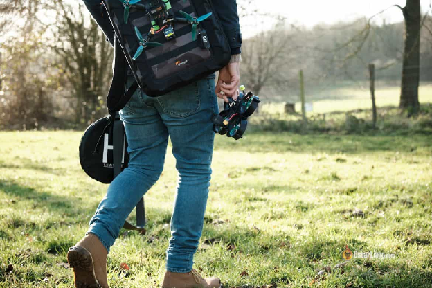
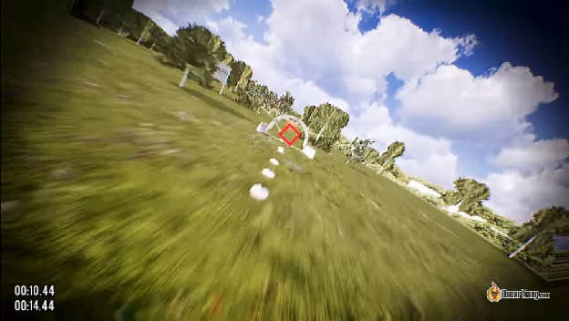
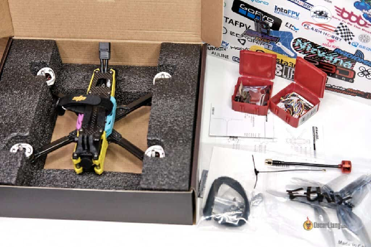
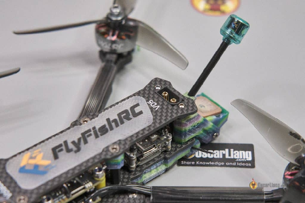
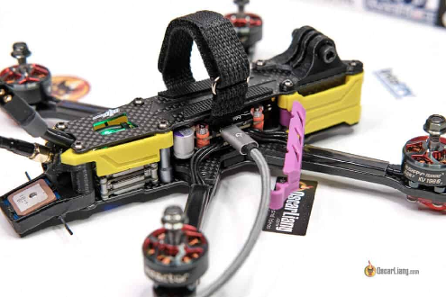

Оригінал: [https://oscarliang.com/common-mistakes-fpv-beginners/](https://oscarliang.com/common-mistakes-fpv-beginners/)     
Стисле посилання на цей переклад: [https://bit.ly/LiangTop10FPVBeginnerMistakes](https://bit.ly/LiangTop10FPVBeginnerMistakes)  

| 🫂 | Нижче вичитаний людьми машнний український переклад оригіналу. Для [VictoryDrones](https://www.victory-drones.com/) переклад вичитали: Natasha M, Block(chain). Хочете покращити переклад чи знайшли помилку? — Лишіть коментар (Ctrl+Alt+M або «Меню» \> «Вставка» \> «Коментар»). Ми теж живі люди (як і ви) і робим помилки. Роботи їх, до речі, також роблять 😉 |
| :---: | :---- |

# 10 найпоширеніших помилок початківців у галузі FPV-дронів: вдосконалення навичок і безпеки

14 травня 2023 р

У цій статті ми розглянемо деякі з найпоширеніших помилок новачків у використанні [FPV-дронy](https://oscarliang.com/fpv-drone-guide/) *\[FPV: First Person View\]* та надамо поради як їх уникнути. Дотримуючись цих порад, ви зможете мінімізувати розчарування, заощадити гроші та зробити політ свого першого FPV-дрону безпечішим.

*Деякі посилання на цій сторінці є партнерськими. Я \[автор англомовної версії Оскар Ланг\] отримую комісію (без додаткових витрат для вас), якщо ви робите покупку після натискання одного із цих партнерських посилань. Це допомагає підтримувати безкоштовний контент для спільноти на цьому веб\-сайті. Будь ласка, прочитайте нашу [Політику партнерських посилань](https://oscarliang.com/affiliate-program-policy/) для отримання додаткової інформації.*

Зміст

[Помилка 1: відсутність підготовки та неналежне вивчення своїх потреб](#помилка-1:-відсутність-підготовки-та-неналежне-вивчення-своїх-потреб)

[Помилка 2: не тренуватись на симуляторі](#помилка-2:-не-тренуватись-на-симуляторі)

[Помилка 3: починати із вживаних або дорогих дронів](#помилка-3:-починати-із-вживаних-або-дорогих-дронів)

[Помилка 4: придбання дешевих або застарілих радіопередавачів і приймачів](#помилка-4:-придбання-дешевих-або-застарілих-радіопередавачів-і-приймачів)

[Помилка 5: погане розташування антени](#помилка-5:-погане-розташування-антени)

[Помилка 6: не виставити параметри налаштування безаварійності](#помилка-6:-не-виставити-параметри-налаштування-безаварійності)

[Помилка 7: неправильне поводження з батареями](#помилка-7:-неправильне-поводження-з-батареями)

[Помилка 8: не знімати пропелери, коли підключаєте батарею i працюєте із безпілотником у майстерні](#помилка-8:-не-знімати-пропелери,-коли-підключаєте-батарею-i-працюєте-із-безпілотником-у-майстерні)

[Помилка 9: iгнорування техніки безпеки під час зарядки батареї](#помилка-9:-iгнорування-техніки-безпеки-під-час-зарядки-батареї)

[Помилка 10: платить за застарілі курси дронів](#помилка-10:-платить-за-застарілі-курси-дронів)

[Заключні думки](#заключні-думки)

## **Помилка 1: відсутність підготовки та неналежне вивчення своїх потреб** {#помилка-1:-відсутність-підготовки-та-неналежне-вивчення-своїх-потреб}

FPV — це серйозне хобі, яке вимагає відданості та значної кількості часу i зусиль для навчання. Багато новачків купують найдорожче обладнання, вважаючи, що воно найкраще, але це не так. Щоб отримати підходящі інструменти, ви мусите належним чином дослідити i вибрати те що відповідає вашим особистим потребам.

Коли ви потрапляєте у світ FPV, ви бачите велику кількість компонентів — різні типи дронів, окулярів, пультів дистанційного керування, антен тощо. Різноманітність може налякати, але дуже важливо розуміти свої особисті потреби аби придбати саме те що підходе. Запитайте на нашому форумі, щоб отримати деякі ідеї, якщо вам потрібна консультація: [https://intofpv.com](https://intofpv.com/).

## **Помилка 2: не тренуватись на симуляторі** {#помилка-2:-не-тренуватись-на-симуляторі}

Перш ніж спробувати керувати справжнім FPV-дроном, дуже важливо витратити достатньо часу (наприклад, 10+ годин) на хороший симулятор FPV-дрона. Роблячи це, ви навчитеся основним навичкам польоту, які можуть запобігти дорогим помилкам. Програмне забезпечення для симулятора зазвичай коштує від 10 до 20 доларів, і це не дорого порівняно з потенційними ушкодженнями справжнього дрона, котрий коштує у 20 разів більше.

Ось список рекомендацій щодо симулятора FPV:[https://oscarliang.com/fpv-simulator/](https://oscarliang.com/fpv-simulator/)

## **Помилка 3: починати із вживаних або дорогих дронів** {#помилка-3:-починати-із-вживаних-або-дорогих-дронів}

Новачкові доцільно почати з абсолютно нового, бюджетного та орієнтованого на початківця дрона, щоб вивчити основи, мінімізуючи ризик дорогих аварій або пошкоджень. Придбання вживаного дрона для початківців може здатися дешевшим і спокусливим, але краще уникати цього варіанту. Як новачок ви, можливо, не зможете визначити наявні проблеми з цими квадрокоптерами або не матимете необхідних знань, щоб їх виправити.

Ось мої рекомендації щодо 5-дюймових дронів: [https://oscarliang.com/best-5-inch-fpv-drone-parts/\#Prebuilt-5-inch-FPV-Drone-BNF](https://oscarliang.com/best-5-inch-fpv-drone-parts/#Prebuilt-5-inch-FPV-Drone-BNF)

## **Помилка 4: придбання дешевих або застарілих радіопередавачів і приймачів** {#помилка-4:-придбання-дешевих-або-застарілих-радіопередавачів-і-приймачів}

Придбайте найкраще радіообладнання, яке ви можете собі дозволити, і шукайте рекомендацій від досвідчених пілотів. Пам’ятайте: ви отримуєте те, за що платите, і часто дешева невдала покупка означає, що доведеться платити ще раз, не кажучи вже про час, витрачений на звикання до нового обладнання. Ваше радіообладнання ймовірно супроводжуватиме вас упродовж вашої кар’єри FPV, і, на відміну від вашого квадрокоптера, воно не так легко вийде із ладу чи пошкодиться.

Уникайте непопулярних моделей радіоприймачів, оскільки знайти допомогу за потреби може бути складно. Якщо ви не знаєте який радіозв’язок вибрати, можу рекомендувати ExpressLRS, який вважається одним із найкращих доступних варіантів у 2023 році.

Ось мої рекомендації щодо радіообладнання: [https://oscarliang.com/radio-transmitter/\#Radio-Recommendations](https://oscarliang.com/radio-transmitter/#Radio-Recommendations)

## **Помилка 5: погане розташування антени** {#помилка-5:-погане-розташування-антени}

Дуже важливо правильно розташувати та орієнтувати антени, щоб підтримувати потужний відео- та радіосигнал протягом усього польоту. Правильне розміщення антени не тільки забезпечує стабільне з’єднання, але й покращує ваш загальний досвід FPV.

Ви можете дізнатися про ідеальне розміщення антени в цьому посібнику: [https://oscarliang.com/antenna-positioning/](https://oscarliang.com/antenna-positioning/)

## **Помилка 6: не виставити параметри налаштування безаварійності** {#помилка-6:-не-виставити-параметри-налаштування-безаварійності}

Витратьте час, щоб правильно виставити параметри налаштування безаварійності дрона. Вони запобігають втраті зв’язку з дроном та збоям у разі втрати сигналу або розрядки акумулятора. Ознайомтеся з тим, як ваш дрон реагуватиме на втрату сигналу, щоб ви завжди могли контролювати польоти та убезпечити його.

Дізнайтеся більше про параметри налаштування безаварійності  і як їх перевірити тут: \[підручник оновлюється, перевірте пізніше\].

## **Помилка 7: неправильне поводження з батареями** {#помилка-7:-неправильне-поводження-з-батареями}

Я також іноді робив цю помилку, коли втрачав увагу у процесі захоплюючого польоту, але під час польоту важливо стежити за рівнем заряду батареї. Щоб запобігти можливим падінням або пошкодженню батареї, приземліть дрон до того, як рівень заряду батареї стане критично низьким.

* Щоб контролювати напругу під час польоту, налаштуйте OSD: [https://oscarliang.com/betaflight-osd/](https://oscarliang.com/betaflight-osd/)  
* Щоб перевірити напругу батареї до та після польоту, використовуйте перевірку напруги: [https://oscarliang.com/fpv-tools/\#LiPo-Voltage-Checker](https://oscarliang.com/fpv-tools/#LiPo-Voltage-Checker)

Ще одна поширена помилка — заряджати всі батареї i не використовувати їх. Коли батареї заряджені протягом довгого часу, це cкорочує їм термін служби i створює ризик для безпеки. Якщо після сеансу польоту у вас повністю заряджені батареї, розрядіть їх якнайшвидше за допомогою функції розряду, яка є у більшості зарядних пристроїв, або користуйтесь, доки вони не розрядяться до вольтажy комірки у режимі «зберігання»

Якщо ви не плануєте користуватись батареями довго, скажімо місяць, переконайтеся, що напруга в них відповідає вольтажy комірки у режимі «зберігання». Тоді батарея буде служити довше і безпечніше.

## **Помилка 8: не знімати пропелери, коли підключаєте батарею i працюєте із безпілотником у майстерні**  {#помилка-8:-не-знімати-пропелери,-коли-підключаєте-батарею-i-працюєте-із-безпілотником-у-майстерні}

Коли ви працюєте з безпілотником в майстерні і підключаєте батарею, завжди пам’ятайте що треба зняти пропелери. Цей простий запобіжний захід допомагає уникнути травм і нещасниx випадкiв, що можуть статися, якщо двигуни несподівано розкрутяться. Хоча може здатися малоймовірним, що дрон раптово активується, завжди краще перестрахуватися, ніж шкодувати.

## **Помилка 9: iгнорування техніки безпеки під час зарядки батареї** {#помилка-9:-iгнорування-техніки-безпеки-під-час-зарядки-батареї}

Дуже важливо ніколи не залишати батареї заряджатися без нагляду. Це надважливо. Крім того, не економте на зарядних пристроях, бo безпека завжди має бути на першому місці. Hадійний зарядний пристрій і пильна увага y процесi заряджання можуть запобігти нещасним випадкам.

Ви можете дізнатися більше як правильно заряджати LiPo *\[lithium polymer battery\],* у цьому посібнику: [https://oscarliang.com/lipo-battery-guide/\#How-to-Charge-LiPo](https://oscarliang.com/lipo-battery-guide/#How-to-Charge-LiPo)

## **Помилка 10: платить за застарілі курси дронів** {#помилка-10:-платить-за-застарілі-курси-дронів}

Хобі FPV розвивається неймовірною швидкo, — інформація може застаріти всього за пару років або навіть за кілька місяців, i деякі книги чи курси втрачають актуальність незадовго після їх публікації. Чесно кажучи, у вас є безкоштовний доступ до більшості необхідної інформації, якщо не до всієї. Навчіться ефективно користуватися пошуковими системами та беріть участь у форумах, щоб добре інформувати себе.

Хоча я постійно публікую новий вміст на цьому сайті, я все ще регулярно оновлю ключові наявні ресурси, щоб підтримувати їхню актуальність. Якщо ви вважаєте мій вміст корисним, підтримайте цей цінний ресурс для спільноти дронів FPV: [https://oscarliang.com/support-me/](https://oscarliang.com/support-me/)

## **Заключні думки** {#заключні-думки}

Кожен пілот безпілотника проходить подібний етап початківця, і ніхто не застрахований від помилок, які виникають через недосвідченість. Головне – вчитися на цих невдачах і розвиватися, набувати досвід з FPV. Зрозумійте, що навчання іде по кривій та насолоджуйтеся захоплюючим світом FPV-дронів. Якщо є інші поширені помилки новачків, яких я не згадав, не соромтеся написати їх у коментарях, щоб інші початківці могли сoбі нагадати про них.

[image1]: 

[image2]: 

[image3]: 

[image4]: 

[image5]: 

[image6]: 

[image7]: 