Оригінал: [https://oscarliang.com/fpv-camera/](https://oscarliang.com/fpv-camera/)   
Стисле посилання на цей переклад: [https://bit.ly/LiangFPVCamera](https://bit.ly/LiangFPVCamera)   

| 🫂 | Нижче вичитаний людьми машинний український переклад оригіналу. Для [VictoryDrones](https://www.victory-drones.com/) переклад вичитали: Kristina, Oleg. Хочете покращити переклад чи знайшли помилку? — Лишіть коментар (Ctrl+Alt+M або «Меню» \> «Вставка» \> «Коментар»). Ми теж живі люди (як і ви) і робим помилки. Роботи їх, до речі, також роблять 😉 |
| :---: | :---- |

# Оберіть FPV-Камеру: вичерпний посібник і рекомендації щодо продуктів

# 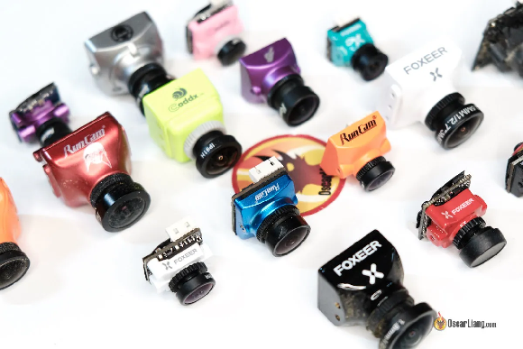

# 2 квітня 2023 року

# FPV-камера є ключовим компонентом систем FPV-дронів. Вона знімає відео в реальному часі, яке передається на окуляри або монітор пілота. Ці маленькі та легкі камери мають наднизьку затримку та широкий динамічний діапазон і надають важливу візуальну інформацію для пілотів FPV-дронів для навігації та виконання маневрів. Завдяки розвитку технологій деякі з найновіших FPV-камер тепер пропонують вбудований запис із якістю зображення, що конкурує з екшн-камерами, такими як DJI O3. У цьому посібнику ми обговоримо ключові фактори, які слід враховувати при виборі найкращої FPV-камери для FPV-дронів.

# *Деякі посилання на цій сторінці є партнерськими. Я \[автор англомовної версії Оскар Ланг\] отримую комісію (без додаткових витрат для вас), якщо ви робите покупку після натискання одного із цих партнерських посилань. Це допомагає підтримувати безкоштовний контент для спільноти на цьому веб\-сайті. Будь ласка, прочитайте нашу [Політику партнерських посилань](https://oscarliang.com/affiliate-program-policy/) для отримання додаткової інформації.*

# Зміст

[Аналогові та цифрові FPV-системи](#аналогові-та-цифрові-fpv-системи)

[Рекомендації щодо FPV-камери](#рекомендації-щодо-fpv-камери)

[DJI O3 Air Unit](#dji-o3-air-unit)

[Найкраща камера для DJI O3](#найкраща-камера-для-dji-o3)

[DJI Vista / FPV Air Unit](#dji-vista-/-fpv-air-unit)

[Камера з найкращим зображенням](#камера-з-найкращим-зображенням)

[Найкраща камера для слабкого освітлення](#найкраща-камера-для-слабкого-освітлення)

[Найдешевше, що варто мати](#найдешевше,-що-варто-мати)

[Найменша камера](#найменша-камера)

[Walksnail](#walksnail)

[Камера з найкращим зображенням](#камера-з-найкращим-зображенням-1)

[Найкраща камера для слабкого освітлення](#найкраща-камера-для-слабкого-освітлення-1)

[Найменша камера](#найменша-камера-1)

[HDZero](#hdzero)

[Найкраща камера](#найкраща-камера)

[Найменша камера](#найменша-камера-2)

[Аналогові](#аналогові)

[Вершина лінійки](#вершина-лінійки)

[Найкраща ціна/якість](#найкраща-ціна/якість)

[Найдешевше, що варто мати](#найдешевше,-що-варто-мати-1)

[Найменша камера](#найменша-камера-3)

[Популярна для перегонів](#популярна-для-перегонів)

[Найкраща для слабкого освітлення](#найкраща-для-слабкого-освітлення)

[Розмір і вага](#розмір-і-вага)

[Співвідношення сторін](#співвідношення-сторін)

[Поле зору](#поле-зору)

[Широкий динамічний діапазон](#широкий-динамічний-діапазон)

[Продуктивність при слабкому освітленні](#продуктивність-при-слабкому-освітленні)

[Затримка](#затримка)

[Зауваження щодо аналогової FPV-камери](#зауваження-щодо-аналогової-fpv-камери)

[CCD і CMOS](#ccd-і-cmos)

[Розмір датчика зображення](#розмір-датчика-зображення)

[Об'єктив камери](#об'єктив-камери)

[NTSC і PAL](#ntsc-і-pal)

[TVL](#tvl)

[Як підключити аналогову FPV-камеру до відеопередавача?](#як-підключити-аналогову-fpv-камеру-до-відеопередавача?)

[Запис відео](#запис-відео)

[Чи можна використовувати HD-камери як камери FPV?](#чи-можна-використовувати-hd-камери-як-камери-fpv?)

[Як налаштувати екранне меню](#як-налаштувати-екранне-меню)

[Ти це зробив\!](#ти-це-зробив!)

[Історія редагування](#історія-редагування)

* # 

## **Аналогові та цифрові FPV-системи**  {#аналогові-та-цифрові-fpv-системи}

# 

# FPV-системи поділяються на дві категорії: аналогові та цифрові.

# Аналогові FPV-камери несумісні з цифровими FPV-системами, і навпаки. На даний момент існує три цифрові FPV-системи: DJI, Walksnail і HDZero. Камери, розроблені для певної цифрової FPV-системи, несумісні з іншими цифровими FPV-системами.

# Якщо ви не впевнені, яку FPV-систему обрати, подивіться на плюси та мінуси кожної системи в моєму огляді: [https://oscarliang.com/fpv-system/](https://oscarliang.com/fpv-system/)

## **Рекомендації щодо FPV-камери**  {#рекомендації-щодо-fpv-камери}

# Нижче наведено мої найкращі рекомендації щодо FPV-камер для кожної FPV-системи.

### 

### **DJI O3 Air Unit** {#dji-o3-air-unit}

| Найкраща камера для DJI O3 |
| ----- |
| **Камера DJI O3** |
| 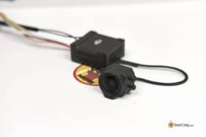 |
| Для DJI O3 Air Unit доступна лише одна камера. Хоча вона може не вирізнятися затримкою, продуктивністю при слабкому освітленні, розміром або вагою, вона, безсумнівно, виділяється з точки зору якості зображення серед усіх FPV-камер. Ви можете дізнатися більше про цю камеру в моєму огляді :[https://oscarliang.com/dji-o3-air-unit-fpv-goggles-2/\#A-Closer-Look-at-the-DJI-O3-Air-Unit](https://oscarliang.com/dji-o3-air-unit-fpv-goggles-2/#A-Closer-Look-at-the-DJI-O3-Air-Unit) |
| **Отримайте свою DJI O3 Air Unit від цих постачальників: RDQ: [https://oscarliang.com/product-sadl](https://oscarliang.com/product-sadl)GetFPV: [https://oscarliang.com/product-4blv](https://oscarliang.com/product-4blv)AliExpress: [https://s.click.aliexpress.com/e/\_DdQYArv](https://s.click.aliexpress.com/e/_DdQYArv)Amazon: [https://amzn.to/3RtWfm1](https://amzn.to/3RtWfm1)** |

# ---

### **DJI Vista / FPV Air Unit** {#dji-vista-/-fpv-air-unit}

# Для [Runcam Link (також відомий як Caddx Vista)](https://oscarliang.com/runcam-phoenix-hd-phoenixhd-nano-link/) і DJI O3 Air Unit, є кілька варіантів камер, які виділяються в різних аспектах. Якщо вам потрібна найменша затримка (близько 30 мс), виберіть камеру із швидкістю 120 кадрів на секунду — наприклад, Runcam Wasp, DJI OG cam, Nebula Pro і Pro Nano або Falcon Nano. Деякі старі камери, які можуть обробляти лише 60 кадрів на секунду та матимуть більшу затримку, близько 40 мс.

| Камера з найкращим зображенням | Найкраща камера для слабкого освітлення |
| :---: | :---: |
| **Nebula Pro / DJI AND Cam** | **Caddx Polar / Runcam Wasp** |
| 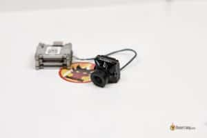 | 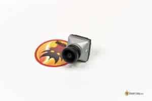 |
| [Nebula Pro](https://oscarliang.com/caddx-nebula-pro/) пропонує якість зображення, майже ідентичну оригінальній камері DJI (OG cam), якій я особисто віддаю перевагу для денних умов. Це також камера 120 кадрів на секунду. Якщо ви вже використовуєте оригінальну камеру DJI, перемикатися не потрібно. Однак, якщо ви купуєте нову камеру сьогодні, я рекомендую Nebula Pro завдяки її мікророзмірному кріпленню, яке підходить майже до всіх доступних сьогодні рам. Основним недоліком Nebula Pro є її продуктивність за слабкого освітлення; для нічних польотів ви можете натомість обрати Polar. | Після тестування [Caddx Polar](https://oscarliang.com/caddx-polar/) очевидно, що вона чудово працює в умовах слабкого освітлення. Вона також добре працює вдень, що робить її гідною з усіх боків FPV-камерою . Однак основним недоліком є ​​те, що це камера зі швидкістю 60 кадрів на секунду, яка має трохи більшу затримку, ніж Nebula Pro із 120 кадрів на секунду, і вона зафіксована на співвідношенні сторін 16:9. The [Runcam Wasp](https://oscarliang.com/runcam-wasp/) також добре працює в умовах слабкого освітлення, хоча вона трохи перевершує Polar, це 120 кадрів на секунду та підтримка 4:3. |
| **Знайдіть Nebula Pro у цих постачальників: АЛЕ:[https://s.click.aliexpress.com/e/\_DF4LJ8H](https://s.click.aliexpress.com/e/_DF4LJ8H)GetFPV:[https://oscarliang.com/product-phtx](https://oscarliang.com/product-phtx)NBD:[https://oscarliang.com/product-1wlv](https://oscarliang.com/product-1wlv)Amazon:[https://amzn.to/35XjXU0](https://amzn.to/35XjXU0)** | **Знайдіть Caddx Polar у цих постачальників: AliExpress:[https://s.click.aliexpress.com](https://s.click.aliexpress.com/e/_DBKfPMH)GetFPV:[https://oscarliang.com/product-f5tq](https://oscarliang.com/product-f5tq)Amazon:[https://amzn.to/3IOSkL9](https://amzn.to/3IOSkL9)Caddx:[https://oscarliang.com/product-agow](https://oscarliang.com/product-agow)NBD:[https://oscarliang.com/product-wcdg](https://oscarliang.com/product-wcdg) Отримайте Runcam Wasp тут: AliExpress:[https://s.click.aliexpress.com](https://s.click.aliexpress.com/e/_DBmAyfh)GetFPV:[https://oscarliang.com/product-flho](https://oscarliang.com/product-flho)RDQ:[https://oscarliang.com/product-awlg](https://oscarliang.com/product-awlg)** |

# 

# 

| Найдешевше, що варто мати | Найменша камера |
| :---: | ----- |
| **Runcam Wasp** | **Caddx Nebula Pro Nano / Runcam Falcon Nano** |
| 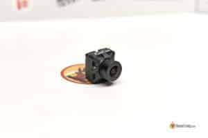 | 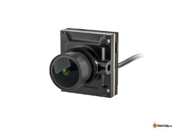 |
| Варіантів камери для Vista небагато, але Runcam Wasp є найдоступнішим вибором, який при цьому забезпечує гідну якість зображення. Ця камера також добре працює в умовах слабкого освітлення. Однак, якщо ви шукаєте кращу якість зображення, вам слід обрати OG Cam або Nebula Pro. | Caddx Nebula Pro Nano — чудовий вибір для невеликих FPV-дронів. Це менша версія вражаючого Nebula Pro, яка підтримує співвідношення сторін 4:3 і 120 кадрів/с. Незважаючи на те, що тут якість зображення не така гарна, як у більшої Nebula Pro, через менший датчик і об’єктив, це все одно найкращий доступний варіант серед нанокамер. Примітка: не плутайте її з Nebula Nano, яка дещо розчаровує. Runcam Falcon Nano — це, по суті, та сама камера (з тим самим датчиком зображення), але, схоже, менш доступна, ніж Nebula Pro Nano. |
| **Отримайте Runcam Wasp тут: АЛЕ:[https://s.click.aliexpress.com/e/\_DBmAyfh](https://s.click.aliexpress.com/e/_DBmAyfh)Runcam:[https://shop.runcam.com](https://shop.runcam.com/runcam-link-wasp/)GetFPV:[https://oscarliang.com/product-flho](https://oscarliang.com/product-flho)RDQ:[https://oscarliang.com/product-awlg](https://oscarliang.com/product-awlg)** | **Ви можете знайти камеру Nebula Pro Nano тут: АЛЕ:[https://s.click.aliexpress.com/e/\_DmvVECv](https://s.click.aliexpress.com/e/_DmvVECv)GetFPV:[https://oscarliang.com/product-8a4i](https://oscarliang.com/product-8a4i)RDQ:[https://oscarliang.com/product-gj04](https://oscarliang.com/product-gj04)NBD:[https://oscarliang.com/product-508q](https://oscarliang.com/product-508q)** |

# ---

### **Walksnail** {#walksnail}

# Walksnail пропонує кілька різних варіантів камери для різного застосування.

| Камера з найкращим зображенням | Найкраща камера для слабкого освітлення |
| :---: | :---: |
| **Walksnail Avatar V2** | **Walksnail Avatar Pro** |
| 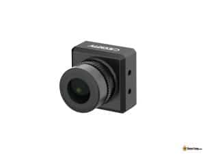 |  |
| Стандартна версія камери Avatar V2 VTX дуже схожа на оригінальну камеру V1, має схожу якість зображення та затримку, але у V2 використовується рідний датчик зображення 4:3 замість 16:9. Він забезпечує чудову якість зображення при денному світлі. При порівнянні камери Avatar V2 з камерами DJI стає очевидним, що нові камери Avatar V2 забезпечують кращу якість зображення, ніж камера DJI OG, хоча вони не зовсім досягають рівня DJI O3. | Камера Avatar Pro оснащена 1/1,8-дюймовим датчиком Sony Starvis і вбудованими датчиками зображення 4:3. Хоча версія Pro чудово працює в умовах слабкого освітлення, стандартна камера пропонує трохи кращу якість зображення при денному світлі. Камера Avatar Pro справді виділяється в умовах слабкого освітлення, перевершуючи всі інші камери в лінійці Avatar. Камера Pro має дещо вищу затримку (менше 5 мс), ніж камера V2. |
| **Ви можете знайти камеру/набір Avatar V2 тут: GetFPV:[https://oscarliang.com/product-wy8i](https://oscarliang.com/product-wy8i)RDQ:[https://oscarliang.com/product-im46](https://oscarliang.com/product-im46)АЛЕ:[https://s.click.aliexpress.com/e/\_DlDWGKt](https://s.click.aliexpress.com/e/_DlDWGKt)Amazon:[https://amzn.to/3JRXY1Z](https://amzn.to/3JRXY1Z)Caddx:[https://oscarliang.com/product-qe4v](https://oscarliang.com/product-qe4v)** | **Ви можете знайти камеру/набір Avatar Pro тут: Caddx:[https://oscarliang.com/product-xpso](https://oscarliang.com/product-xpso)RDQ:[https://oscarliang.com/product-tfta](https://oscarliang.com/product-tfta)GetFPV:[https://oscarliang.com/product-65ws](https://oscarliang.com/product-65ws)АЛЕ:[https://s.click.aliexpress.com/e/\_DdGReBT](https://s.click.aliexpress.com/e/_DdGReBT)Amazon:[https://amzn.to/3JvbW8H](https://amzn.to/3JvbW8H)** |

# 

# 

| Найменша камера |
| :---: |
| **Walksnail Avatar 1S Mini Lite** |
| 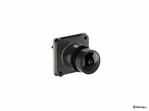 |
| Камера 1S Mini Lite вагою менше 2 грам є найкомпактнішою камерою в системі Avatar. Це камера нанорозміру (14x14 мм), але в ній немає монтажних отворів і потрібні спеціальні кріплення. Порівняно з якістю зображення стандартної камери V2, Lite Camera має дещо менший кут зору, трохи м’якіше зображення та повільнішу зміну експозиції залежно від умов освітлення. Проте економія ваги може переважити недоліки мікродронів. |
| **Отримайте камеру Walksnail Lite від: Caddx:[https://oscarliang.com/product-d75h](https://oscarliang.com/product-d75h)AliExpress:[https://s.click.aliexpress.com/e/\_DdCMC0z](https://s.click.aliexpress.com/e/_DdCMC0z)GetFPV:[https://oscarliang.com/product-27gi](https://oscarliang.com/product-27gi)RDQ:[https://oscarliang.com/product-3uda](https://oscarliang.com/product-3uda)Amazon:[https://amzn.to/3FASTZv](https://amzn.to/3FASTZv)** |

# ---

### 

### **HDZero** {#hdzero}

# HDZero пропонує кілька варіантів камери для різних програм.

| Найкраща камера | Найменша камера |
| :---: | :---: |
| **Камера Runcam HDZero Nano90** | **HDZero Whoop Lite** |
| 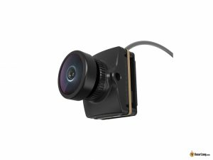 | 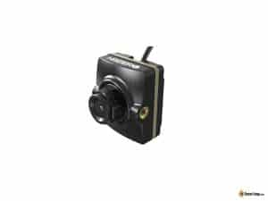 |
| Камера Runcam HDZero Nano90 забезпечує переможну продуктивність для системи HDZero в режимі 540p 90 кадрів на секунду, забезпечуючи найнижчу затримку серед усіх доступних сьогодні відео-каналів. Вона також підтримує 720p 60 кадрів/с для більш високої роздільної здатності та може похвалитися вражаючою продуктивністю при слабкому освітленні. Зверніть увагу, що лише [Окуляри HDZero](https://oscarliang.com/hdzero-fpv-goggles/) підтримують режим 540p 90 кадрів/с; для [HDZero VRX](https://oscarliang.com/hdzero-vrx-2022/) ви можете використовувати лише 720p 60 кадрів/с. Незважаючи на це, якість зображення на рівні попередньої моделі Runcam Micro V2. | Камера HDZero Nano Lite розроблена для надлегких FPV-дронів вагою лише 1,5 г. У поєднанні з новим Whoop Lite VTX вагою 4,5 г і дипольною антеною 0,4 г, ця комбінація являє собою найлегше у світі цифрове рішення FPV із загальною вагою менше 7 г. Використовуючи той самий датчик, що й Runcam Micro V2, ця камера пропонує перемикання режимів 4:3 / 16:9, налаштування параметрів зображення та виняткову продуктивність за слабкого освітлення. |
| **Купуйте камеру Runcam HDZero Nano 90 тут: GetFPV:[https://oscarliang.com/product-cwhq](https://oscarliang.com/product-cwhq)Amazon:[https://amzn.to/3yIjakU](https://amzn.to/3yIjakU)АЛЕ:[https://s.click.aliexpress.com/e/\_DnS4LtL](https://s.click.aliexpress.com/e/_DnS4LtL) Якщо ви не використовуєте режим 90 кадрів/с і хочете камеру мікророзміру, перевірте Runcam Micro V2: GetFPV:[https://oscarliang.com/product-5rbr](https://oscarliang.com/product-5rbr)RDQ:[https://oscarliang.com/product-fbtl](https://oscarliang.com/product-fbtl)АЛЕ:[https://s.click.aliexpress.com/e/\_AA5H5t](https://s.click.aliexpress.com/e/_AA5H5t)** | **Знайдіть камеру HDZero Whoop Lite тут: АЛЕ:[https://s.click.aliexpress.com/e/\_DDtI5wD](https://s.click.aliexpress.com/e/_DDtI5wD)GetFPV:[https://oscarliang.com/product-dl3i](https://oscarliang.com/product-dl3i)** |

### **Аналогові** {#аналогові}

| Вершина лінійки | Найкраща ціна/якість |
| :---: | :---: |
| **Foxeer T-Rex** | **Caddx Ratel 2** |
| 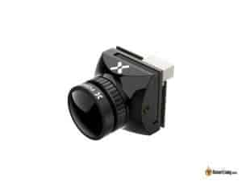 | 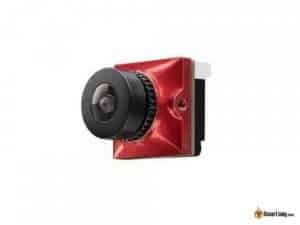 |
| Foxeer T-Rex є однією з найкращих камер з точки зору деталізації та різкості зображення. Незалежно від того, чи є рекламоване значення 1500TVL точним, T-Rex, безсумнівно, забезпечує виняткову якість зображення. Хоча аналоговий FPV не зовсім відповідає рівню HD-відео з точки зору деталізації зображення, T-Rex все одно перевершує інші аналогові камери, забезпечуючи помітно покращене зображення. | Caddx Ratel 2 на ринку вже багато років і отримала значну кількість позитивних відгуків. Це відносно доступна камера, враховуючи продуктивність, яку вона пропонує. Ratel 2 може похвалитися хорошим балансом широкого динамічного діапазону та контрастності, без жодних цифрових артефактів і з природним відтворенням кольорів. |
| **Знайдіть Foxeer T-Rex у цих постачальників: АЛЕ:[https://s.click.aliexpress.com/e/\_De7jGA5](https://s.click.aliexpress.com/e/_De7jGA5)GetFPV:[https://oscarliang.com/product-yhi6](https://oscarliang.com/product-yhi6)RDQ:[https://oscarliang.com/product-ywoj](https://oscarliang.com/product-ywoj)Amazon:[https://amzn.to/3pAXsLt](https://amzn.to/3pAXsLt)** | **Знайдіть Caddx Ratel 2 у цих постачальників: Banggood:[https://oscarliang.com/product-b7rd](https://oscarliang.com/product-b7rd)GetFPV:[https://oscarliang.com/product-c4hh](https://oscarliang.com/product-c4hh)RDQ:[https://oscarliang.com/product-8y8i](https://oscarliang.com/product-8y8i)Amazon:[https://amzn.to/3CfhFvg](https://amzn.to/3CfhFvg)NBD:[https://oscarliang.com/product-27zm](https://oscarliang.com/product-27zm) Потрібна менша версія? Перегляньте Caddx Baby Ratel 2 Nano (14x14 мм): АЛЕ:[https://s.click.aliexpress.com/e/\_DELJQ2H](https://s.click.aliexpress.com/e/_DELJQ2H)GetFPV:[https://oscarliang.com/product-a5rx](https://oscarliang.com/product-a5rx)RDQ:[https://oscarliang.com/product-dz2k](https://oscarliang.com/product-dz2k)NBD:[https://oscarliang.com/product-zzia](https://oscarliang.com/product-zzia)** |

# 

# 

| Найдешевше, що варто мати | Найменша камера |
| :---: | :---: |
| **Foxeer Razer Micro** | **Runcam Phoenix 2 Nano** |
| 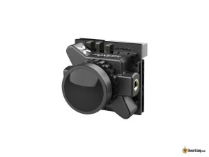 | 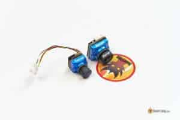 |
| За ціною всього 18 доларів Foxeer Razer Micro, ймовірно, є найдоступнішою аналоговою камерою, яка все ще забезпечує гідне зображення. Користуйтесь Foxeer Razer Micro/Nano та уникайте інших моделей Razer, щоб отримати найкращу якість за помірну ціну. | Вона дозволяє змінювати налаштування та мати повний контроль над камерою, є більш потужною та краще працює в ширшому діапазоні умов. |
| **Отримайте Foxeer Razer Micro тут: GetFPV:[https://oscarliang.com/product-82uc](https://oscarliang.com/product-82uc)АЛЕ:[https://s.click.aliexpress.com/e/\_DB4GQBv](https://s.click.aliexpress.com/e/_DB4GQBv)RDQ:[https://oscarliang.com/product-pzsy](https://oscarliang.com/product-pzsy)** | **Ви можете знайти Phoenix 2 Nano тут: Banggood:[https://oscarliang.com/product-2g3c](https://oscarliang.com/product-2g3c)GetFPV:[https://oscarliang.com/product-wmm6](https://oscarliang.com/product-wmm6)RDQ:[https://oscarliang.com/product-iwm4](https://oscarliang.com/product-iwm4)Amazon:[https://amzn.to/2R04kUu](https://amzn.to/2R04kUu)** |

# 

# 

| Популярна для перегонів | Найкраща для слабкого освітлення |
| ----- | :---: |
| **Foxeer Predator Micro** | **Foxeer Micro CAT 3** |
| 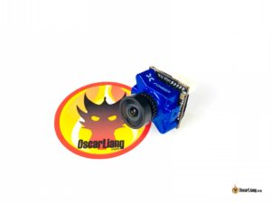 | 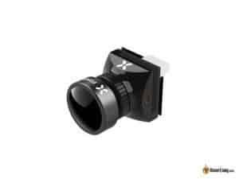 |
| Foxeer Predator Micro — це дуже популярна FPV-камера серед пілотів. Її наднизька затримка, висока роздільна здатність і контрастність зображення дозволяють чітко виділити перешкоди. Крім того, вона пропонує широке поле огляду, що бажано під час перегонів, і має розумну ціну. | Foxeer Micro CAT 3 чудово працює при слабкому освітленні FPV завдяки своїй високій світлочутливості. На відміну від більшості інших нічних камер, які відображають лише чорно-біле зображення або мають проблеми вдень, CAT 3 також є життєздатним варіантом для денних польотів, навіть якщо він спеціально не розроблений для цієї мети. |
| **Знайдіть Predator Micro тут: AliExpress:[https://s.click.aliexpress.com/](https://s.click.aliexpress.com/e/_DCo5kO5)GetFPV:[https://oscarliang.com/product-te58](https://oscarliang.com/product-te58)Amazon:[https://amzn.to/3IPsqXC](https://amzn.to/3IPsqXC)NBD:[https://oscarliang.com/product-xt1f](https://oscarliang.com/product-xt1f) Потрібна менша камера? Перегляньте Foxeer Predator Nano (14x14 мм): АЛЕ:[https://s.click.aliexpress.com/e/\_DlGfQmN](https://s.click.aliexpress.com/e/_DlGfQmN)GetFPV:[https://oscarliang.com/product-owbk](https://oscarliang.com/product-owbk)NBD:[https://oscarliang.com/product-dkdv](https://oscarliang.com/product-dkdv)** | **Купити Foxeer Micro CAT можна тут: AliExpress:[https://s.click.aliexpress.com/](https://s.click.aliexpress.com/e/_DCz5Nqh)GetFPV:[https://oscarliang.com/product-kg72](https://oscarliang.com/product-kg72)RDQ:[https://oscarliang.com/product-5b8q](https://oscarliang.com/product-5b8q)Amazon:[https://amzn.to/3CeKiZA](https://amzn.to/3CeKiZA)NBD:[https://oscarliang.com/product-dxim](https://oscarliang.com/product-dxim) Для нанорозміру Foxeer Toothless 2 Nano Starlight також дуже хороший, він також чудовий для денного часу: АЛЕ:[https://s.click.aliexpress.com/e/\_DeI4l45](https://s.click.aliexpress.com/e/_DeI4l45)GetFPV:[https://oscarliang.com/product-zsne](https://oscarliang.com/product-zsne)RDQ:[https://oscarliang.com/product-vp2w](https://oscarliang.com/product-vp2w)NBD:[https://oscarliang.com/product-dyda](https://oscarliang.com/product-dyda)** |

## 

## **Розмір і вага** {#розмір-і-вага}

# 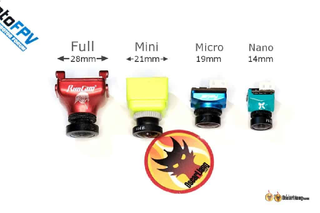

# Розміри FPV-камер визначаються шириною, тобто відстанню між монтажними отворами з обох боків. Вибір розміру камери залежить від вашої [Рами FPV-дрона](http://bit.ly/LiangFPVDroneFrames-uk-UA) і від того, як ви плануєте її монтувати. Загальні розміри включають:

* # Стандартний, також «повнорозмірний» (28 мм)

* # Маленький (21 мм)

* # Мікро (19 мм)

* # Нано (14 мм)

# Мікророзмір є найпопулярнішим у наші дні, оскільки він зазвичай добре працює з сучасними 3-дюймовими, 4-дюймовими та 5-дюймовими рамами (і більшими). Менші дрони зазвичай використовують нанорозмір. Обов’язково ще раз перевірте характеристики вашої рами, щоб підтвердити сумісність і уникнути сюрпризів.

## **Співвідношення сторін** {#співвідношення-сторін}

# 

# У FPV-камерах є два співвідношення сторін: 4:3 і 16:9.

# Формат 4:3 є кращим для FPV-польотів, оскільки він забезпечує більш вертикальне поле зору, що корисно, коли дрон нахиляється вперед або назад під час прискорення або сповільнення. Це дозволяє чіткіше бачити те, що перед вами. 16:9, навпаки, пропонує ширший огляд з боків, але ця інформація менш корисна для пілотів.

# Крім того, якщо ви плануєте стабілізувати відзнятий матеріал за допомогою такого програмного забезпечення як [Gyroflow](https://oscarliang.com/how-to-use-gyroflow-video-stabilization-tool-for-fpv/), то 4:3 має перевагу над 16:9, оскільки менше обрізає зображення під час візуалізації у відео 16:9 для завантаження на такі платформи, як YouTube.

# В ідеалі ваші [FPV окуляри](https://bit.ly/LiangFPVGogglesGuide) мають підтримувати співвідношення сторін FPV-камери. Невідповідне співвідношення сторін може призвести до спотворення зображення в окулярах. Наприклад, якщо у вас камера 4:3 і окуляри 16:9, зображення буде виглядати розтягнутим.

# Деякі FPV-камери дозволяють перемикатися між співвідношеннями сторін 4:3 і 16:9. Однак під час переходу на нестандартне співвідношення сторін ви відчуєте зменшення кута зору через кадрування. Для оптимальної продуктивності найкраще використовувати рідне співвідношення сторін камери.

## **Поле зору** {#поле-зору}

# 

# Поле зору (FOV) FPV-камери визначає кут захопленого зображення. Менший кут огляду призводить до більш збільшеного зображення, дозволяючи чіткіше бачити перешкоди – наприклад, гілки. Ширший кут зору дозволяє бачити більше навколишнього середовища, що може бути кращим для польотів на близькій відстані та перегонів.

# Однак, коли поле зору занадто велике, зображення виглядає спотвореним, що призводить до так званого ефекту «риб’ячого ока». Об’єкти в центрі виглядатимуть меншими та віддаленішими, ніж вони є насправді, тоді як краї зображення виглядатимуть зігнутими та спотвореними.

# Немає «найкращого» поля зору, оскільки це залежить від особистих уподобань і типу середовища, в якому ви літаєте.

# Поле зору залежить від фокусної відстані об’єктива та розміру датчика зображення. Менша фокусна відстань і більший розмір датчика забезпечують ширший кут огляду. Ось приблизна оцінка кута зору для камери з розміром датчика 1/3 дюйма та співвідношенням сторін 4:3:

| Фокусна відстань об'єктива | Приблизне поле зору |
| :---- | :---- |
| 1,8 мм | 160° – 170° |
| 2,1 мм | 150° – 160° |
| 2,3 мм | 140° – 150° |
| 2,5 мм | 130° – 140° |
| 2,8 мм | 120° – 130° |
| 3,0 мм | 110° – 120° |

# Як згадувалося раніше, співвідношення сторін також може впливати на поле зору, якщо камера підтримує як 16:9, так і 4:3. У цьому випадку вибір нестандартного співвідношення просто обріже боки або верх і низ, що призведе до меншого кута зору.

## **Широкий динамічний діапазон** {#широкий-динамічний-діапазон}

# 

# Широкий динамічний діапазон (WDR) FPV-камери визначає якість зображення в умовах екстремального освітлення, коли в одному кадрі присутні як яскраві, так і темні області. Хороша камера в ідеалі повинна дозволяти пілоту бачити якомога більше деталей у тіні, не допускаючи надмірної експозиції неба. Вибір FPV-камери із гідною можливістю WDR має вирішальне значення, оскільки вона допомагає вам краще бачити під час польоту, зрештою допомагаючи уникати перешкод і аварій.

## **Продуктивність при слабкому освітленні** {#продуктивність-при-слабкому-освітленні}

# 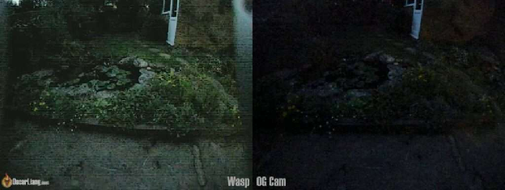

# Якщо ви плануєте літати в умовах слабкого освітлення, наприклад у приміщенні або під час заходу сонця/вночі, важливо обрати камеру з хорошими можливостями слабкого освітлення.

# Окрім перевірки відгуків, ви можете оцінити продуктивність камери в умовах слабкого освітлення за її числом LUX у специфікаціях. Що нижче значення LUX, то краще працює камера при слабкому освітленні. Крім того, камери з більшими датчиками зображення зазвичай краще працюють в умовах слабкого освітлення, оскільки більше світла потрапляє на датчик.

## **Затримка** {#затримка}

# Затримка означає час, потрібний FPV-камері для захоплення, обробки та передачі зображення на відеопередавач. Для ентузіастів гонок на дронах або тих, хто займається високошвидкісними польотами, затримка може бути вирішальним фактором у виборі FPV-камери. Менша затримка дозволяє пілотам реагувати швидше, забезпечуючи кращий контроль і уникаючи потенційних перешкод або аварій.

## **Зауваження щодо аналогової FPV-камери**  {#зауваження-щодо-аналогової-fpv-камери}

### **CCD і CMOS** {#ccd-і-cmos}

# 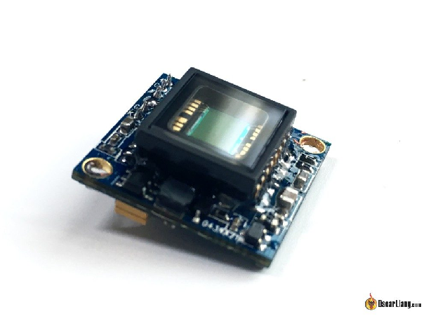

# В аналогових FPV-камерах використовуються два типи датчиків зображення: CCD і CMOS, кожен із яких має унікальні характеристики та переваги.

# CCD – це старіша технологія, яка раніше була основним датчиком зображення для FPV-камер, оскільки на той час вона працювала краще, ніж CMOS. Однак технологія CMOS швидко вдосконалювалась, і тепер вона така ж добра, як CCD, якщо не краща. Сучасні аналогові FPV-камери майже виключно використовують датчики CMOS, які постійно стають кращими та доступнішими.

# Щоб дізнатися більше, перегляньте цю статтю про відмінності між CCD і CMOS: [https://oscarliang.com/cmos-ccd-fpv-camera-multicopter/](https://oscarliang.com/cmos-ccd-fpv-camera-multicopter/). Ось підсумок плюсів і мінусів обох типів датчиків:

# CCD:

* # Менше ефекту желе у відео завдяки глобальному затвору

* # Менше обробки зображень і цифрових артефактів, однак роздільна здатність і деталізація зображення зазвичай нижчі, ніж у найкращих камер CMOS

* # Продуктивність вище середнього за слабкого освітлення, динамічний діапазон і перехід світло/темно

* # Кращий контраст зображення, ніж CMOS

* # На відміну від камер CMOS із різною продуктивністю, CCD-камери працюють однаково за всіма параметрами

# CMOS:

* # Більш чутливий до желе через ковзний затвор

* # Різна продуктивність і ціна: найдорожчі камери – це, як правило, CMOS, і за іронією долі, найдешевші камери – також CMOS, тоді як CCD зазвичай у середньому ціновому діапазоні

* # Зазвичай менша затримка

* # Вища роздільна здатність і чіткіше зображення з компромісом потенційно надмірної різкості та цифрових артефактів

* # FPV-камери для слабкого освітлення/ночі зазвичай використовують великі датчики CMOS

* # Зазвичай гнучкіші/динамічніші з налаштуваннями камери

### **Розмір датчика зображення** {#розмір-датчика-зображення}

# 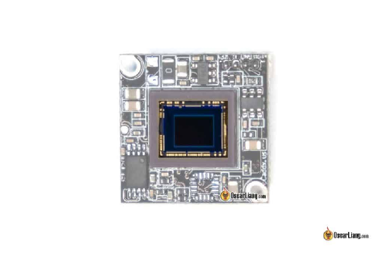

# Окрім типів CCD і CMOS, датчики зображення також бувають різних розмірів. Два популярних розміри датчика для аналогових камер — 1/1,8" і 1/3", причому перший має більший розмір, а другий — менший.

# Розмір датчика впливає на роботу в умовах слабкого освітлення та динамічний діапазон. Як правило, камера з більшим датчиком може мати кращу продуктивність при слабкому освітленні за тих самих налаштувань. Крім того, більший датчик забезпечує ширше поле зору (FOV) при використанні об’єктива з тією самою фокусною відстанню.

### **Об'єктив камери** {#об'єктив-камери}

# 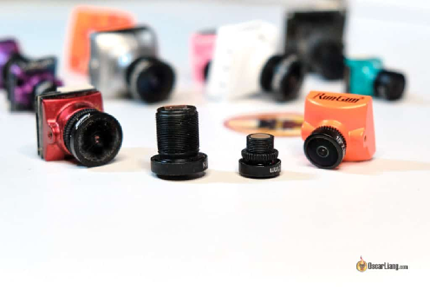

# Ви можете замінити об’єктив на аналоговій FPV-камері, щоб досягти іншого кута зору або якості зображення. Об’єктиви FPV-камери відрізняються, в основному, двома параметрами: фокусною відстанню та розміром різьби. Щоб отримати більш детальну інформацію, ви можете звернутися до [нашої статті спеціально про об’єктиви камер FPV](https://oscarliang.com/fpv-camera-lens/).

# У повнорозмірних камерах зазвичай використовуються більші та важчі об’єктиви з різьбою діаметром 12 мм, які можна загвинтити в корпуси, відомі як об’єктиви M12. Менші 8-мм об’єктиви або об’єктиви M8 використовуються, щоб зробити камери більш компактними та легкими. Лінзи M12 пропускають більше світла, що забезпечує трохи кращу якість зображення порівняно з лінзами M8. Об’єктиви M8 дуже компактні та в основному використовуються в камерах Micro та Nano.

### **NTSC і PAL** {#ntsc-і-pal}

# 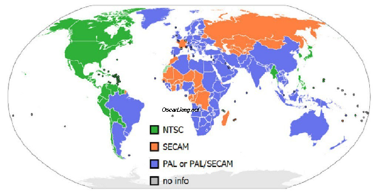

# Основна відмінність між NTSC і PAL полягає в їх роздільній здатності та частоті кадрів. PAL (720 x 576 при 25 кадрах на секунду) пропонує трохи кращу роздільну здатність, тоді як NTSC (720 x 480 при 30 кадрів на секунду) забезпечує вищу частоту кадрів. Якщо ви бажаєте кращу якість зображення, виберіть PAL; якщо ви хочете більш плавне відео, виберіть NTSC. Для більш детального порівняння [перегляньте цю публікацію](https://oscarliang.com/pal-ntsc-fpv-quadcopter/).

# Традиційно NTSC використовується в Північній Америці, Японії та Південній Кореї, тоді як PAL використовується в більшості країн Європи, Австралії та значних частинах Африки та Азії. Було б гарною ідеєю дотримуватися стандарту вашої країни. Однак сьогодні це не викликає занепокоєння, оскільки обидва відеоформати повністю підтримуються всім FPV-обладнанням.

# Не забудьте вказати відповідний формат вашої камери в [Betaflight OSD](https://bit.ly/LiangBetaflightOSD), щоб переконатися, що текст відображається правильно.

### **TVL** {#tvl}

# TVL або «телевізійні лінії» — це термін, який використовують виробники для вимірювання роздільної здатності аналогових FPV-камер.

# TVL вимірюється шляхом підключення камери до дисплея та отримання зображення картки з чередуванням чорних і білих ліній. Максимальна кількість чітких чорних і білих ліній, які може виявити камера, є її значенням TVL, яке представляє деталізацію зображення, яку здатна створити камера.

# Однак за останні роки TVL став менш значущим, оскільки виробники часто завищують ці цифри як маркетинговий інструмент. Замість того, щоб покладатися на TVL, обирайте камеру на основі якості зображення, продемонстрованого в оглядах.

### **Як підключити аналогову FPV-камеру до відеопередавача?** {#як-підключити-аналогову-fpv-камеру-до-відеопередавача?}

# 

# Підключення аналогової FPV-камери до вашого дрона залежить від застосування та залучених компонентів. У найпростішому вигляді FPV-камера має три дроти для підключення: відеосигнал, живлення та маса.

# Щоб під’єднати FPV-камеру безпосередньо до відеопередавача, підключіть сигнальні дроти та переконайтеся, що у ваших FPV-окулярах відеоприймач працює на тому ж каналі, щоб отримати зображення. Також під’єднайте дроти маси FPV-камери та відеопередавача *\[VTX\]*, якщо вони живляться від різних джерел.

# Сучасні FPV-камери підтримують широкий діапазон вхідної напруги (наприклад, від 5 В до 36 В), що дозволяє живити їх від 5В регульованої напруги або безпосередньо від LiPo акумулятора (2S-8S).

# Дотримуйтесь цих хороших практик для чистішого відео: [https://oscarliang.com/connect-vtx-fpv-camera/](https://oscarliang.com/connect-vtx-fpv-camera/)

# Використання польотного контролера *\[FC\]* із вбудованим чіпом наекранного меню *\[OSD\]* є найпоширенішим способом підключення FPV-камери. Під’єднайте сигнал камери до відеовходу польотного контролера, а відеовихід польотного контролера – до відеопередавача.

# 

# Залежно від функцій камери можуть бути доступні деякі додаткові з’єднання, наприклад:

* # TX і RX (інтерфейса UART) для підключення до польотного контролера, що дозволяє змінювати налаштування камери за допомогою пульта

* # Контакти наекранного меню або меню для підключення джойстика для зміни налаштувань камери

* # VBAT або VSEN для моніторингу напруги акумулятора

## **Запис відео** {#запис-відео}

# Є кілька способів записувати відео польоту з FPV-камери:

1. # **FPV-окуляри з відеореєстратором(DVR):** [Більшість окулярів FPV](https://bit.ly/LiangFPVGogglesGuide) мають вбудований цифровий відеореєстратор, який записує все, що відображається на екрані, навіть включно з розривами сигналу.

2. # **Відеопередавач із вбудованим записом:** Деякі відеопередавачі мають вбудовані можливості запису, які забезпечують більш високу якість відео порівняно з записами відеореєстратора в окулярах. В запис не потрапляють пропадання сигналу під час польоту. Приклади таких відеопередавачів включають [DJI O3 Air Unit](https://oscarliang.com/dji-o3-air-unit-fpv-goggles-2/) і [Walksnail Avatar VTX](https://oscarliang.com/walksnail-avatar-hd-pro-v2-kit/).

3. # **Зовнішній відеореєстратор на дроні:** Для аналогових камер можна використовувати [зовнішній відеореєстратор](https://oscarliang.com/onboard-dvr/), який підключається безпосередньо до FPV-камери всередині дрона. Цей метод записує відео без будь-яких перешкод і, як правило, забезпечує кращу якість зображення, оскільки не має втрат через бездротове з’єднання 5,8 ГГц.

# Щоб отримати найкращу якість зображення, подумайте про встановлення [екшн-камери](https://oscarliang.com/action-camera/), як-от GoPro, на вашому дроні. Ця опція знімає високоякісні відеоматеріали, які можна використовувати для різних цілей, зокрема для обміну онлайн або аналізу продуктивності польоту.

## **Чи можна використовувати HD-камери як камери FPV?** {#чи-можна-використовувати-hd-камери-як-камери-fpv?}

# Хоча це правда, що багато приголомшливих HD FPV відео на YouTube знято за допомогою HD екшн-камер, таких як GoPro або Runcam 3, ці камери, як правило, не підходять для FPV-польотів у реальному часі.

# Деякі камери високої чіткості пропонують можливості «виходу відео», що дозволяє підключати їх до передавача відео для FPV. Однак затримка в цих камерах зазвичай надто велика для FPV-польоту (часто понад 100 мс), що ускладнює вчасну реакцію, щоб запобігти збоям. Тому для польотів у реальному часі рекомендується використовувати спеціальну FPV-камеру.

## **Як налаштувати екранне меню** {#як-налаштувати-екранне-меню}

# 

# Наекранне меню (OSD, on-screen display) — це функція, яка накладає корисну інформацію про політ на відео для відображення в окулярах FPV під час польоту. Залежно від конкретної FPV-системи процес налаштування наекранного меню може відрізнятися. Нижче наведено навчальні посібники для різних систем:

* # Аналогова: [https://bit.ly/LiangBetaflightOSD](https://oscarliang.com/betaflight-osd/)

* # HDZero: [https://oscarliang.com/setup-hdzero/\#Betaflight-OSD-Setup](https://oscarliang.com/setup-hdzero/#Betaflight-OSD-Setup)

* # Walksnail: [https://oscarliang.com/setup-avatar-fpv-system/\#Betaflight-Configurations](https://oscarliang.com/setup-avatar-fpv-system/#Betaflight-Configurations)

* # DJI: [https://oscarliang.com/dji-o3-air-unit-fpv-goggles-2/\#OSD](https://oscarliang.com/dji-o3-air-unit-fpv-goggles-2/#OSD)

# Ці навчальні посібники проведуть вас через необхідні кроки для налаштування наекранного меню для кожної системи та допоможуть забезпечити доступ до цінної інформації про політ під час FPV-польоту .

## **Ти це зробив\!** {#ти-це-зробив!}

# Вітаємо з завершенням цього вичерпного посібника з FPV-камери \! Я щиро сподіваюся, що надана інформація допомогла вам у пошуках ідеальної FPV-камери для ваших потреб. Якщо у вас є запитання чи коментарі, будь ласка, не соромтеся звертатися. Щасливого польоту\!

#### **Історія редагування** {#історія-редагування}

* # Грудень 2014 – Стаття створена

* # Листопад 2016 р. – Оновлено інформацію про CMOS і CCD, додано інформацію про екранне меню та розмір камери

* # Травень 2018 р. – додано інформацію про керування камерою

* # Листопад 2018 р. – додано інформацію про можливості роботи в умовах слабкого освітлення

* # Березень 2019 р. – додано невелику історію розробки камери в період 2013-2016 рр

* # Жовтень 2019 р. – Оновлена ​​інформація щодо кута огляду, розмірів об’єктивів, сенсорів, CCD/CMOS, вбудованого мікрофона, відеореєстратора та з’єднання

* # Квітень 2023 р. – додано рекомендації щодо FPV-камер для всіх доступних систем FPV, DJI, HDZero, Walksnail та аналогових. Переглянуто посібник, скорочено URL-адресу.

[image1]: 

[image2]: 

[image3]: 

[image4]: 

[image5]: 

[image6]: 

[image7]: 

[image8]: 

[image9]: 

[image10]: 

[image11]: 

[image12]: 

[image13]: 

[image14]: 

[image15]: 

[image16]: 

[image17]: 

[image18]: 

[image19]: 

[image20]: 

[image21]: 

[image22]: 

[image23]: 