Оригінал: [https://oscarliang.com/video-transmitter/](https://oscarliang.com/video-transmitter/)    
Стисле посилання на цей переклад: [bit.ly/LiangBestVTX4FPV-uk-UA](https://bit.ly/LiangBestVTX4FPV-uk-UA)  

|  | Нижче вичитаний людьми машнний український переклад оригіналу. Для [VictoryDrones](https://www.victory-drones.com/) переклад вичитали: Anastasiia, Block. Хочете покращити переклад чи знайшли помилку? Попросіть права редагування. Знайшли помилку — лишіть коментар (Ctrl+Alt+M або «Меню» \> «Вставка» \> «Коментар»). Ми теж живі люди (як і ви) і робим помилки. Роботи їх, до речі, також роблять 😉 |
| :---: | :---- |

# **Вибір відеопередавача для FPV-дронів — ретельний посібник для початківців** {#вибір-відеопередавача-для-fpv-дронів-—-ретельний-посібник-для-початківців}

6th May 2024

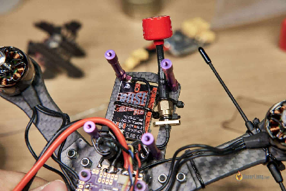

Відеопередавач *\[англійською прийнято скорочувати як VTX\]* — це важливий компонент системи FPV, який бездротовим шляхом передає зображення з камери на FPV-окуляри. Обираючи відеопередавач з частотою 5,8 ГГц беріть до уваги компактність розміру, функції, підтримку каналів і точну частоту передачі. На додаток до великої дальності і високої вихідної потужності це забезпечить оптимальну продуктивність польоту і мінімальні перешкоди для інших пілотів. Розуміючи ці ключові фактори, ви будете краще підготовлені до вибору оптимального відеопередавача 5,8 ГГц для вашого FPV-дрона і зможете насолоджуватися більш захоплюючим і комфортним досвідом польотів.

*Деякі з посилань на цій сторінці є партнерськими. Я отримую комісію (без додаткових витрат для вас), якщо ви здійснюєте покупку після натискання на одне з цих партнерських посилань. Це допомагає підтримувати безкоштовний контент для спільноти на цьому веб\-сайті. Будь ласка, прочитайте нашу [Політику щодо партнерських посилань](https://oscarliang.com/affiliate-program-policy/) для отримання додаткової інформації.* 

Зміст

[Вибір відеопередавача для FPV-дронів — ретельний посібник для початківців](#вибір-відеопередавача-для-fpv-дронів-—-ретельний-посібник-для-початківців)

[Аналогові та цифрові системи FPV](#аналогові-та-цифрові-системи-fpv)

[Рекомендації по вибору VTX](#рекомендації-по-вибору-vtx)

[DJI](#dji)

[Найвища якість зображення та дальність передачі](#найвища-якість-зображення-та-дальність-передачі)

[Універсальний і доступний](#універсальний-і-доступний)

[Walksnail](#walksnail)

[Walksnail Moonlight](#walksnail-moonlight)

[Найкращий універсальний VTX](#найкращий-універсальний-vtx)

[Чудово підходить для мікродронів](#чудово-підходить-для-мікродронів)

[HDZero](#hdzero)

[Варіант з легкою конструкцією](#варіант-з-легкою-конструкцією)

[Найкращий VTX для мікродронів](#найкращий-vtx-для-мікродронів)

[Аналоговий](#аналоговий)

[VTX гідної вартості](#vtx-гідної-вартості)

[Найбільш універсальний VTX преміум-класу](#найбільш-універсальний-vtx-преміум-класу)

[Найкращий для польотів на великі відстані](#найкращий-для-польотів-на-великі-відстані)

[Найдешевший, що варто придбати](#найдешевший,-що-варто-придбати)

[Найбільш бюджетний](#найбільш-бюджетний)

[Найменший з преміум-класу](#найменший-з-преміум-класу)

[Якість зображення](#якість-зображення)

[Якість сигналу](#якість-сигналу)

[Конектор антени](#конектор-антени)

[SMA і RP-SMA](#sma-і-rp-sma)

[UFL](#ufl)

[MMCX](#mmcx)

[Живлення VTX](#живлення-vtx)

[Вихідна потужність](#вихідна-потужність)

[Вища потужність для більшого діапазону](#вища-потужність-для-більшого-діапазону)

[Недоліки високої вихідної потужності](#недоліки-високої-вихідної-потужності)

[Антени: рівноцінно або більш важливі](#антени:-рівноцінно-або-більш-важливі)

[Розуміння каналів VTX](#розуміння-каналів-vtx)

[Вбудований мікрофон](#вбудований-мікрофон)

[Ключові аспекти аналогового VTX](#ключові-аспекти-аналогового-vtx)

[Зміна налаштувань VTX](#зміна-налаштувань-vtx)

[Pitmode](#pitmode)

[Підключення аналогової FPV-камери до VTX](#підключення-аналогової-fpv-камери-до-vtx)

[Найкращі практики використання VTX](#найкращі-практики-використання-vtx)

[Ніколи не вмикайте живлення VTX без антени](#ніколи-не-вмикайте-живлення-vtx-без-антени)

[Як уникнути шуму при відтворенні відео](#як-уникнути-шуму-при-відтворенні-відео)

[Уникайте контакту між заземленням антени VTX і рамою](#уникайте-контакту-між-заземленням-антени-vtx-і-рамою)

[Висновок](#висновок)

## **Аналогові та цифрові системи FPV** {#аналогові-та-цифрові-системи-fpv}

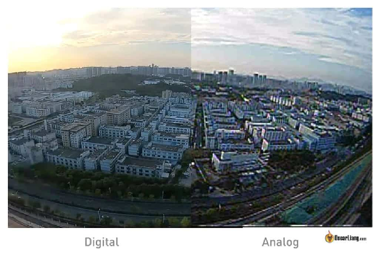  
*Ліворуч: зображення із цифрового передавача.*  
*Праворуч: зображення із аналогового передавача* 

Системи FPV можна розділити на два типи: аналогові та цифрові. Аналогове обладнання не сумісне з цифровим обладнанням FPV. На сьогоднішній день існує три цифрові системи FPV: DJI, Walksnail та HDZero. Камери та VTX, розроблені для конкретної цифрової системи FPV, також несумісні з іншими цифровими системами FPV. Якщо ви не впевнені, яку систему FPV обрати — перегляньте зроблений мною огляд, у якому пояснюються переваги та недоліки кожної системи: [https://oscarliang.com/fpv-system/](https://oscarliang.com/fpv-system/)

## **Рекомендації по вибору VTX** {#рекомендації-по-вибору-vtx}

У цьому розділі я порекомендую найкращий VTX для кожної системи FPV для різних потреб.

### 

### **DJI** {#dji}

| Найвища якість зображення та дальність передачі  DJI O3 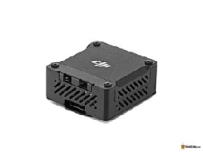 Система DJI O3 забезпечує виняткову якість зображення та дальність передачі, що робить її відмінним вибором для кінематографістів та пілотів FPV фристайлу (і гасити русню \- примітка перекладача). Вона поєднує в собі можливості системи FPV та екшн-камери з роздільною здатністю 4K. Майте на увазі, що O3 підтримує виключно окуляри [DJI FPV Goggles V2](https://oscarliang.com/dji-fpv-goggles-v2/), [Goggles 2](https://oscarliang.com/dji-o3-air-unit-fpv-goggles-2/), i [Goggles Integra](https://oscarliang.com/dji-goggles-integra/), але НЕ окуляри V1. На момент виходу цього оновлення, для O3 Air Unit доступна лише одна камера – модуль камери O3. Знайти DJI O3 Air Unit можна тут: RDQ:[https://oscarliang.com/product-sadl](https://oscarliang.com/product-sadl)GetFPV:[https://oscarliang.com/product-4blv](https://oscarliang.com/product-4blv)АЕ:[https://s.click.aliexpress.com/e/\_DdQYArv](https://s.click.aliexpress.com/e/_DdQYArv)Amazon:[https://amzn.to/3RtWfm1](https://amzn.to/3RtWfm1)NBD:[https://oscarliang.com/product-ewnq](https://oscarliang.com/product-ewnq) | Універсальний і доступний RunCam Link / Caddx Vista 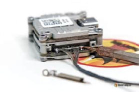 RunCam Link (також відомий як Caddx Vista) — це компактна та легка опція VTX, розроблена для пілотів DJI, які шукають варіант з легким монтажем та не потребують запису на вбудовану пам’ять. Завдяки доступності різних варіантів камер, ви можете вибрати найкращий варіант для своїх потреб. RunCam Link — це універсальне та економічно вигідне рішення для тих, хто хоче насолодитися перевагами системи DJI FPV без зайвих витрат.  Придбати Runcam Link Air Unit можна тут: AliExpress:[https://s.click.aliexpress.com/](https://s.click.aliexpress.com/e/_DC04Wm5)GetFPV:[https://oscarliang.com/product-flho](https://oscarliang.com/product-flho)Amazon:[https://amzn.to/3KB78R5](https://amzn.to/3KB78R5)RDQ:[https://oscarliang.com/product-awlg](https://oscarliang.com/product-awlg)NBD:[https://oscarliang.com/product-sg0a](https://oscarliang.com/product-sg0a) |
| :---: | :---: |
|  |  |
|  |  |

---

### **Walksnail** {#walksnail}

### **Walksnail Moonlight** {#walksnail-moonlight}

*Параметри відео: 4K 60FPS*   
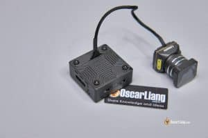

Kомплект Камера/VTX Walksnail Avatar Moonlight є сильним конкурентом на ринку HD FPV. Він пропонує запис 4K, вражаючу продуктивність при слабкому освітленні та гнучкі налаштування камери. Це відповідь Walksnail на DJI O3 Air Unit. Mій огляд:  
 [https://oscarliang.com/walksnail-moonlight/](https://oscarliang.com/walksnail-moonlight/)  
**Комплекти камер/VTX Walksnail Moonlight можна придбати y цих постачальників:**  
GetFPV: [https://oscarliang.com/product-l78p](https://oscarliang.com/product-l78p)  
RDQ: [https://oscarliang.com/product-b159](https://oscarliang.com/product-b159)  
AE: [https://s.click.aliexpress.com/e/\_DCqPOtR](https://s.click.aliexpress.com/e/_DCqPOtR)  
Caddx: [https://oscarliang.com/product-znl4](https://oscarliang.com/product-znl4)

| Найкращий універсальний VTX Walksnail Avatar HD VTX V2 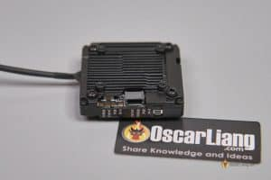 Walksnail Avatar HD V2 VTX пропонує розширені функції, такі як 32 ГБ вбудованої пам’яті для можливості запису відео з роздільною здатністю 1080p, підтримку Gyroflow для стабілізації зображення, заземлений радіатор для зменшення перешкод GPS і додаткові варіанти кріплення 20x20 мм для більшої сумісності з рамою. Залежно від ваших уподобань щодо якості зображення, роботи в умовах низької освітленості або потреби у легкій конструкції, доступні різні сумісні камери. Як бюджетна альтернатива системам DJI, Walksnail V2 VTX має певні недоліки, такі як відсутність слота для SD-карти для розширення пам’яті, відсутність можливості запису у форматі 4K, а також конструкція з однією антеною, що може вплинути на діапазон та проникність. Придбайте Walksnail VTX V2 тут: AliExpress:[https://s.click.aliexpress.com](https://s.click.aliexpress.com/e/_Dl13FYN)GetFPV:[https://oscarliang.com/product-escn](https://oscarliang.com/product-escn)Amazon:[https://amzn.to/40GZkTf](https://amzn.to/40GZkTf)RDQ:[https://oscarliang.com/product-rs15](https://oscarliang.com/product-rs15)Caddx:[https://oscarliang.com/product-sjj8](https://oscarliang.com/product-sjj8) | Чудово підходить для мікродронів Walksnail Avatar 1S Lite VTX 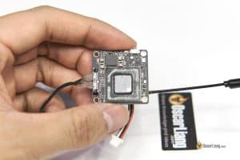 Walksnail Avatar HD Mini 1S Lite VTX ідеально підходить для мікродронів, таких як Tiny Whoops, має компактний дизайн і важить лише 8,7 грама разом із нанокамерою Lite. Підтримує передачу HD FPV  зображення з роздільною здатністю 720p і 1080p, а також має 8 ГБ вбудованої пам’яті для запису відео. Однак для Mini 1S Lite VTX потрібна вхідна напруга від 3,1 до 5 В, тому його можна живити безпосередньо від акумулятора 1S LiPo або 5V 2A BEC, якщо ви використовуєте акумулятори 2S. Переконайтеся, що 5 В BEC може забезпечити достатню силу струму для оптимальної роботи. Сторінки товару: Caddx:[https://oscarliang.com/product-d75h](https://oscarliang.com/product-d75h)АЕ:[https://s.click.aliexpress.com/e/\_DdCMC0z](https://s.click.aliexpress.com/e/_DdCMC0z)GetFPV:[https://oscarliang.com/product-27gi](https://oscarliang.com/product-27gi)RDQ:[https://oscarliang.com/product-3uda](https://oscarliang.com/product-3uda)Amazon:[https://amzn.to/3FASTZv](https://amzn.to/3FASTZv) |
| ----- | ----- |
|  |  |
|  |  |
|  |  |
|  |  |

---

### **HDZero**  {#hdzero}

| HDZero Freestyle V2Best for Freestyle and Long Range |
| ----- |
| 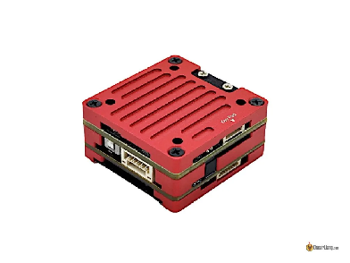 |
| HDZero Freestyle VTX забезпечує найкращий діапазон та проникність для систем HDZero завдяки потужності передачі 1 Вт. Ідеально підходить для агресивного фристайлу і польотів на великі відстані, має масивні радіатори з  обох сторін для фізичного захисту та охолодження. З коробки він підтримує 25 мВт/200 мВт, але з ліцензією на радіостанцію НАМ, його можна оновити до 1 Вт за допомогою спеціальної прошивки. VTX важить 22.3 г і підтримує акумулятори 2S-6S (стара версія підтримує до 4S), сумісний із SmartAudio та MSP Canvas Mode. |
| **Знайти HDZero 1W Freestyle V2 VTX можна тут:AE:[https://s.click.aliexpress.com/e/\_DkoyILh](https://s.click.aliexpress.com/e/_DkoyILh)RDQ: [https://oscarliang.com/product-47i8](https://oscarliang.com/product-47i8)GetFPV: [https://oscarliang.com/product-1lf1](https://oscarliang.com/product-1lf1)** |

| Варіант з легкою конструкцією | Найкращий VTX для мікродронів |
| ----- | ----- |
| **HDZero Race V2 VTX** | **HDZero Whoop Lite** |
| 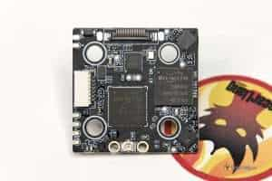 | 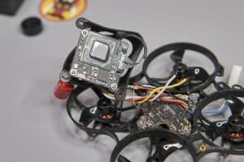 |
| HDZero Race V2 VTX розроблений для зйомки перегонів, має компактну та легку конструкцію, яка підходить для кріплення M3 20x20 мм. Підтримує SmartAudio, що дозволяє змінювати налаштування VTX з екранного меню Betaflight і радіоконтролеру OpenTX/EdgeTX. Роз’єм U.FL можна зафіксувати  за допомогою застібки-блискавки, щоб запобігти від’єднанню антени під час падіння, має вбудований TVS діод для захисту живлення. Однак його вихідна потужність у 200 мВт є незначною і може бути не ідеальною для польотів на великі відстані. Це обмеження не є суттєвим для перегонів, оскільки під час більшості змагань є обмеження на вихідну потужність до 25 мВт. | HDZero Whoop Lite VTX — це найменший і найлегший VTX  серед систем HDZero, розроблений спеціально для мікродронів FPV, таких як маленькі Whoops. Універсальний, з підтримкою живлення від 1S до 3S, можна живити безпосередньо від більшості акумуляторів мікродронів. Також має функцію SmartAudio для зміни налаштувань VTX в екранному меню Betaflight. У поєднанні з камерою HDZero Nano Lite (1,5 г) і дипольною антеною 0,4 г створює найлегше у світі цифрове FPV-рішення загальною вагою менше 7 г. |
| **Сторінки товару: GetFPV:[https://oscarliang.com/product-ee00](https://oscarliang.com/product-ee00)RDQ:[https://oscarliang.com/product-i6a0](https://oscarliang.com/product-i6a0)AliExpress:[https://s.click.aliexpress.com/](https://s.click.aliexpress.com/e/_9JbEVV)** | **Придбайте HDZero Whoop Lite тут: RDQ:[https://oscarliang.com/product-x3g9](https://oscarliang.com/product-x3g9)АЕ:[https://s.click.aliexpress.com/e/\_DeXQpih](https://s.click.aliexpress.com/e/_DeXQpih)GetFPV:[https://oscarliang.com/product-nsgx](https://oscarliang.com/product-nsgx)NBD:[https://oscarliang.com/product-wrqp](https://oscarliang.com/product-wrqp)** |

---

### 

### **Аналоговий** {#аналоговий}

| VTX гідної вартості | Найбільш універсальний VTX преміум-класу |
| ----- | ----- |
| **Rush Tank Ultimate Plus** | **TBS Unify Pro32 HV** |
| 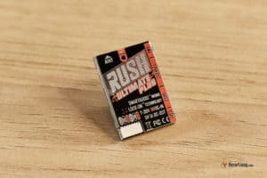 | 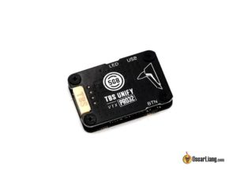 |
| VTX з високою потужністю передачі 800 мВт є надійним вибором для аналогового підсилювача, що забезпечує хороший баланс між продуктивністю та вартістю. Rush Ultimate Plus ідеально підходить для збірки з обмеженим простором для додаткової плати в стеку польотного контролера. Однак, в комплекті є адаптер 30,5 × 30,5 мм для встановлення на верхній частині польотного контролера, якщо це необхідно. Вбудований мікрофон є бонусом, що дозволяє чути двигуни та звуковий сигнал через аудіовихід ваших FPV-окулярів. | TBS Unify Pro32 HV — це універсальний VTX преміум-класу, відомий своїми точними рівнями вихідної потужності, чистою передачею сигналу, високою якістю та надійністю. З вихідною потужністю до 1000 мВт у компактному корпусі, він ідеально підходить для довгих дистанцій, перегонів або повсякденного фрістайлу. VTX також підтримує системи TBS Crossfire, що дозволяє користувачам перемикати канали та рівні потужності через приймач Crossfire. Ця функція особливо корисна для пілотів, які не мають контролера польоту або екранного меню Betaflight, наприклад, для тих, хто керує літальними апаратами з нерухомим крилом. |
| **Знайти Rush Tank Ultimate Plus можна тут: АЕ:[https://s.click.aliexpress.com/e/\_DE9aA0t](https://s.click.aliexpress.com/e/_DE9aA0t)GetFPV:[https://oscarliang.com/product-211v](https://oscarliang.com/product-211v)** | **Придбайте TBS Unify Pro32 HV тут: GetFPV:[http://bit.ly/2m9XMmT](http://bit.ly/2m9XMmT)NBD:[https://oscarliang.com/product-z0ht](https://oscarliang.com/product-z0ht)AliExpress:[https://s.click.aliexpress.com/](https://s.click.aliexpress.com/e/_DeMKgup)** |

| Найкращий для польотів на великі відстані | Найдешевший, що варто придбати |
| ----- | ----- |
| **Rush Tank MAX SOLO (2,5 Вт) / SOLO (1,6 Вт)** | **Eachine TX805** |
| 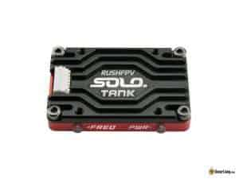 | 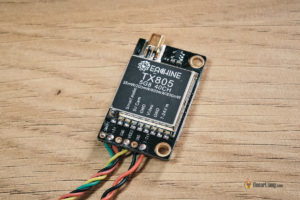 |
| Для пілотів, що працюють на дальних дистанціях, RushFPV Tank Solo пропонує найпотужніші варіанти VTX, доступні в галузі FPV. Є дві версії: SOLO з вихідною потужністю до 1,6 Вт і MAX SOLO з вихідною потужністю до 2,5 Вт. Обидва VTX оснащені радіатором з міцним алюмінієвим корпусом, який допомагає підтримувати максимальну вихідну потужність і запобігає втраті продуктивності через перегрів. SOLO не має вентилятора, тож він легший і компактніший порівняно з MAX SOLO. | Eachine TX805 \- аналоговий відеопередавач, який коштує всього 13$. Незважаючи на свою доступність, він наповнений функціями: компактність, шаблони монтажу 30x30 мм, сумісність з широким діапазоном вхідної напруги (7В-24В) та підтримка 5 діапазонів. Більш того, він відзначається вихідною потужністю до 800 мВт. Його компактний та легкий дизайн гарантує, що установка буде легкою. Дивіться мій огляд для додаткової інформації [https://oscarliang.com/eachine-tx805-vtx/](https://oscarliang.com/eachine-tx805-vtx/) |
| **Придбайте Rush SOLO 1,6 Вт тут: Banggood:[https://oscarliang.com/product-rh88](https://oscarliang.com/product-rh88)GetFPV:[https://oscarliang.com/product-5s6o](https://oscarliang.com/product-5s6o)RDQ:[https://oscarliang.com/product-m23h](https://oscarliang.com/product-m23h)АЕ:[https://s.click.aliexpress.com/e/\_DCbhkhL](https://s.click.aliexpress.com/e/_DCbhkhL) Отримайте Rush MAX SOLO 2,5 Вт тут: АЕ:[https://s.click.aliexpress.com/e/\_DcxFoE9](https://s.click.aliexpress.com/e/_DcxFoE9)RDQ:[https://oscarliang.com/product-bygk](https://oscarliang.com/product-bygk)Banggood:[https://oscarliang.com/product-ahro](https://oscarliang.com/product-ahro)** | **Знайти Everyine TX805 VTX можна тут: [https://s.click.aliexpress.com/e/\_DDjctY1](https://s.click.aliexpress.com/e/_DDjctY1) Banggood: [http://bit.ly/2UaVBPX](http://bit.ly/2UaVBPX)**  |

|  Найбільш бюджетний |  Найменший з преміум-класу  |
| ----- | ----- |
| **HGLRC Zeus Nano** | **TBS Unify Pro32 Nano** |
| 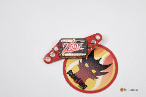 | 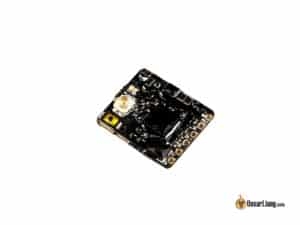 |
| HGLRC Zeus Nano VTX \- це універсальний та легкий відеопередавач, ідеальний для тих, хто потребує компактний VTX. Гнучке рішення для монтажу полегшує установку. Він має вбудований мікрофон, а ціна є конкурентною \- всього 20 $.Його легка вага робить його ідеальним для менших дронів, тоді як його розгорнутий набір функцій приваблює тих, хто шукає економічно ефективне, але потужне рішення VTX. | TBS Unify Pro32 Nano — це найкращий вибір для мікродронів і Tiny Whoops, якщо ви шукаєте найменший і найпотужніший VTX. Є найкомпактнішим відеопередавач на ринку, розміри якого становлять всього 15x13x2 мм, а вага \- 1 грам. Незважаючи на свій маленький розмір, Pro32 Nano може надавати вражаючу вихідну потужність до 500 мВт. Його можна живити безпосередньо від акумулятора 2S або 3S LiPo, що робить його зручним та ідеальним варіантом, коли немає доступного джерела 5В. |
| **Знайти HGLRC Zeus Nano VTX можна тут: [https://s.click.aliexpress.com/e/\_De7QrEj](https://s.click.aliexpress.com/e/_De7QrEj) GetFPV- [https://oscarliang.com/product-j8ej](https://oscarliang.com/product-j8ej) RDQ – [https://oscarliang.com/product-pf2h](https://oscarliang.com/product-pf2h) Amazon – [https://amzn.to/3Uqy2ia](https://amzn.to/3Uqy2ia)** | **Магазини: АЕ:[https://s.click.aliexpress.com/e/\_DdeBxKh](https://s.click.aliexpress.com/e/_DdeBxKh)GetFPV:[http://bit.ly/2ma58qv](http://bit.ly/2ma58qv)NBD:[https://oscarliang.com/product-ctdh](https://oscarliang.com/product-ctdh)** |

## **Якість зображення** {#якість-зображення}

Хоча ціни на VTX можуть значно відрізнятися, якість зображення здебільшого визначається  вашою [FPV-камерою](https://oscarliang.com/fpv-camera/), а не VTX. Заплативши більше за висококласний VTX, ви в більшості випадків не зможете кардинально покращити якість зображення. Однак вибір VTX з відмінними характеристиками та надійною якістю сигналу може покращити загальний досвід польоту.

## **Якість сигналу** {#якість-сигналу}

Основними факторами, що впливають на якість і дальність сигналу FPV, є якість і розташування антен, а також точність VTX при передачі на заданій частоті.  
Високоякісні аналогові VTX забезпечують більш точні частоти передачі та чистіші сигнали, які менше впливають на сусідні канали. Антени мають бути розроблені та налаштовані для конкретного діапазону частот–ви можете перевірити це в наших схемах КСХ: https://oscarliang.com/fpv-antenna-swr/.  
Деякі цифрові VTX пропонують подвійні антени (рознесенi, diversity), що дозволяє встановлювати їх під кутом 90 градусів для поліпшення якості сигналу незалежно від положення вашого апарату під час польоту. 

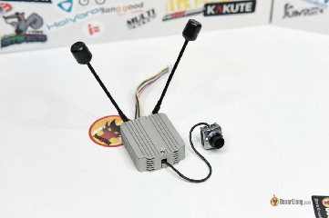

Ви можете дізнатися більше про оптимальне розміщення антен у цій публікації:[https://oscarliang.com/antenna-positioning/](https://oscarliang.com/antenna-positioning/)

## **Конектор антени** {#конектор-антени}

Більшість VTX постачається з антенами, які ви можете просто під'єднати. Однак, якщо ви хочете оновити або замінити їх, важливо знати тип конектору, з яким постачається ваш VTX.  
VTX мають різні конектори, найпопулярнішими типами є SMA, RP-SMA, IPEX (також відомий як UFL) та MMCX.

### **SMA і RP-SMA** {#sma-і-rp-sma}

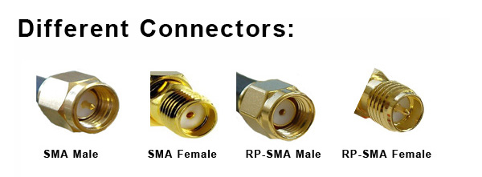  
*Види коннекторів: [SMA](https://en.wikipedia.org/wiki/SMA_connector) «Тато», SMA «Мама», RP-SMA «Тато», RP-SMA «Мама»*

SMA та RP-SMA — це найстаріші конектори, які використовуються в FPV-обладнанні. Вони відносно великі та мають різьбу. Є два види: SMA та RP-SMA, переконайтеся, що ви співставляєте тип конектора з відповідною антеною. Для несумісних конекторів можна використовувати перехідник SMA в RP-SMA та адаптерні кабелі, але майте на увазі, що з кожним використаним адаптером якість сигналу погіршується. Зазвичай, небагато, сигнал втрачається на кілька відсотків.

### **UFL** {#ufl}

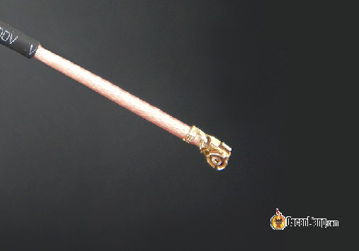

Конектори IPEX або U.FL популярні для невеликих VTX завдяки своїй  низькопрофільній конструкції, порівняно з конекторами SMA. Однак, вони швидше зношуються через значно меншу кількість циклів з’єднання. Ви можете підключити до VTX адаптер U.FL до SMA або використовувати антену з конектором U.FL. Цей конектор менший за конектори SMA, і встановлюється на місце із зусиллям, через що може випадати при падіннях, тому виробники, як правило, закріплюють його клеєм або фіксатором.

### **MMCX** {#mmcx}

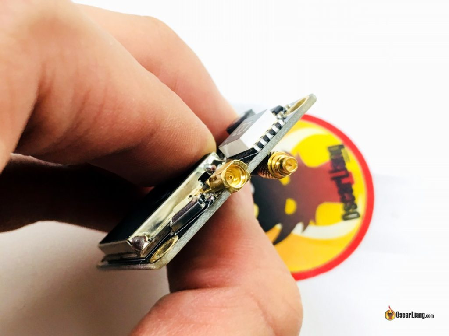  
MMCX \- це баланс між крихкими U.FL і громіздкими SMA конекторами. Це новий тип конекторів, зі щільною посадкою, але набагато міцнішою, ніж UFL, що робить його менш схильним до випадання під час падіння. MMCX також має більшу кількість циклів з’єднання, у порівнянні з UFL. Ця конструкція є балансом між довговічністю SMA та розміром і вагою U.FL. Однак знайти антену з конектором MMCX може бути складно, оскільки вона ще не така поширена, як попередніх два варіанти.

## **Живлення VTX** {#живлення-vtx}

Сучасні відеопередавачі (VTX) зазвичай підтримують широкий діапазон вхідної напруги, що дозволяє живити їх безпосередньо від акумулятора дрона (наприклад, 4S або навіть 6S LiPo). Однак популярним підходом є живлення VTX за допомогою стабілізатора напруги на контролері польоту, широко відомого як BEC (Battery Elimination Circuit \- схема відключення акумулятора).  
BEC не тільки перетворює вищу напругу в нижчу, але й діє як фільтр для джерела живлення вашого VTX. Акумулятори дронів можуть сильно впливати на якість відеопотоку, через перешкоди, які генерують електронний контроллер швидкості і двигуни. В наш час більшість контролерів польоту оснащені вбудованими BEC, спеціально розробленими для живлення VTX. Вони забезпечують вихідну напругу  9 В  або 12 В і мають відмінну схему фільтрації для мінімізації стрибків напруги та електричних перешкод від системи живлення.  
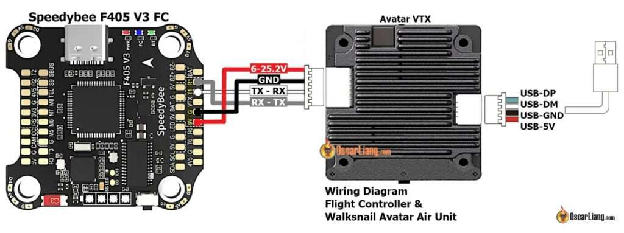

*Наприклад, Speedybee F405 V3 FC має спеціальний 9V BEC для живлення відеопередавачів.*

Ще одним важливим фактором, який слід враховувати при живленні VTX від BEC (або будь-якого іншого стабілізатора напруги), є забезпечення необхідної сили струму для правильної роботи VTX. Виробники не завжди вказують параметри підсилювача у своїх специфікаціях, тому корисно ознайомитися з моїми оглядами, оскільки я завжди намагаюся надавати таку інформацію. Недостатня потужність VTX може призвести до зменшення діапазону або нестабільності, що вплине на ваш загальний досвід використання FPV.  
Якщо ви вирішили живити VTX безпосередньо від акумулятора, переконайтеся, що він має належну фільтрацію живлення, щоб запобігти появі шумів та ліній на відео. Популярним методом фільтрації є використання [LC фільтра](https://oscarliang.com/lc-filter-fpv/) або просто [додавання конденсатора з низьким ESR](https://oscarliang.com/capacitors-mini-quad/) ([bit.ly/WhyCapacitorsAreImportant](http://bit.ly/WhyCapacitorsAreImportant)) на вході живлення.

## **Вихідна потужність** {#вихідна-потужність}

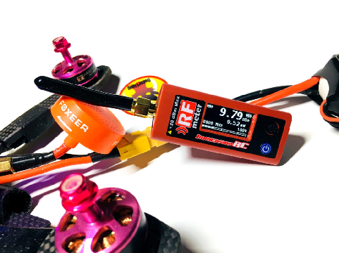

Вихідна потужність відеопередавача визначає кількість енергії, яку він випромінює. Вихідна потужність VTX вимірюється в міліватах (мВт) або децибел-міліватах (дБм). Більшість VTX мають регульовану вихідну потужність, що забезпечує гнучкість в залежності від умов польоту і ваших уподобань.  
Вища вихідна потужність зазвичай використовує більше струму.

* 25 мВт: Часто використовується для польотів у приміщенні, щоб мінімізувати перешкоди для інших пілотів і підходить для використання на коротких відстанях.  
* 200 мВт до 600 мВт: Забезпечує оптимальний баланс для використання на відкритому повітрі, пропонуючи розширений діапазон без надмірного споживання енергії.  
* 800 мВт або більше: Ідеально підходить для польотів на довгі відстані або в районах із суттєвими екологічними перешкодами, забезпечуючи більш чітке відео на більших відстанях.  
  """ 

### **Вища потужність для більшого діапазону**  {#вища-потужність-для-більшого-діапазону}

Як правило, більша потужність означає більший діапазон, але це має свої недоліки, такі як підвищене нагрівання VTX і потенційні перешкоди для інших дронів. Крім того, кожна країна може мати різні законодавчі обмеження щодо максимальної вихідної потужності, яку вам дозволено передавати.  
Зазвичай, 25 мВт відмінно підходить для польотів у приміщенні та для групових польотів, забезпечуючи достатній діапазон для більшості гоночних трас. З іншого боку, пілоти, як правило, використовують більшу вихідну потужність під час польотів на відкритому повітрі для надійнішого зв’язку і для  продовження польоту. Майте на увазі, що збільшення вихідної потужності призводить до зменшення ефективності покращення діапазону, оскільки для подвоєння діапазону потрібно в чотири рази більше потужності. Дізнайтеся, як розрахувати дальність у цьому посібнику:[https://oscarliang.com/calculate-fpv-range/](https://oscarliang.com/calculate-fpv-range/)

### **Недоліки високої вихідної потужності** {#недоліки-високої-вихідної-потужності}

Висока вихідна потужність також генерує більше тепла, що може призвести до перегріву VTX, погіршення його продуктивності або навіть вимкнення під час польоту в крайніх випадках. Висока потужність не завжди найкращий варіант в умовах значних багатопроменевих перешкод, наприклад, у гаражі або на стадіоні, де сигнали можуть відбиватися від бетонних або металевих поверхонь. У таких ситуаціях має сенс використовувати меншу вихідну потужність.  
Під час групових польотів краще не використовувати потужні VTX, оскільки вони можуть створювати перешкоди на відеоканалах інших пілотів, що ускладнює спільний політ. Під час більшості перегонів від пілотів вимагається використання 25 мВт VTX.

### **Антени: рівноцінно або більш важливі** {#антени:-рівноцінно-або-більш-важливі}

На додаток до вихідної потужності вашого VTX, антени на передавачі та FPV-окулярах або приймачі значно впливають на діапазон та якість сигналу. Доведено, що при оптимальному налаштуванні антени, 25 мВт здатні забезпечити діапазон понад 5 км, а 400 мВт \- у чотири рази більше (понад 20 км) в ідеальних умовах. Багато факторів, таких як перешкоди, вирівнювання та розміщення антени, також можуть впливати на максимальний діапазон. Щоб дізнатися більше про FPV-антени, перегляньте цей посібник: [bit.ly/LiangBestFPVAnt](https://bit.ly/LiangBestFPVAnt)

## **Розуміння каналів VTX** {#розуміння-каналів-vtx}

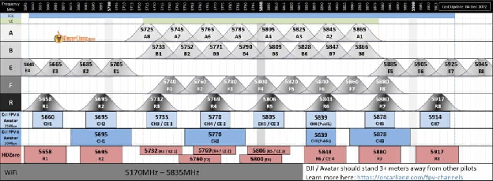  
Канали VTX – це попередньо встановлені частоти, які ви можете використовувати для трансляції відео на відеоприймач. Щоб встановити з’єднання, встановіть один і той же канал на відеопередавачі та відеоприймачі. 5,8 ГГц (5800 МГц) — бажана частотна смуга для FPV, оскільки вона є дозволеною у багатьох країнах, і антени для цієї смуги можуть бути невеликого розміру.  
В аналоговій системі існує п’ять діапазонів: A, B, E, F (Fatshark) і R (Raceband), із вісьмома каналами у кожному діапазоні. Загалом, 40 каналів на вибір. Хоча існують інші не менш поширені діапазони, та не всі частоти є законними для використання. Крім того, деякі канали перекриваються між різними діапазонами, що унеможливлює одночасні польоти 40 дронів. Насправді, виконувати одночасні польоти навіть 8 дронів – досить складно. Щоб максимізувати кількість дронів у повітрі без перешкод, важливо використовувати якісні VTX із чистим сигналом, а також забезпечити розподіл каналів із достатнім частотним розділенням.  
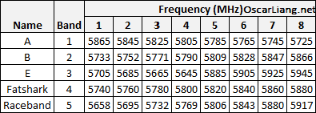  
Для цифрових систем FPV управління каналами є простішим, оскільки доступний лише один діапазон (всього 8 каналів), і ним легше керувати. Ці канали працюють на тих самих або схожих частотах, що й аналогові канали Raceband.

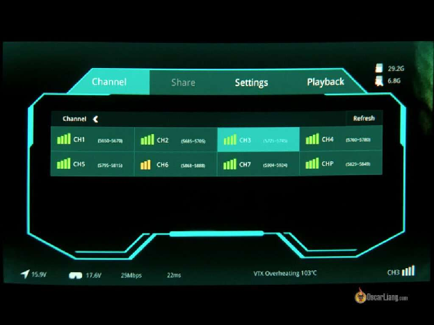

*Це екран вибору каналу Walksnail Avatar в окулярах FPV.*  
Якщо це одиночний політ, немає необхідності турбуватися про те, який канал VTX використовувати — просто оберіть будь-який\! Однак, у груповому польоті важливо ретельно розподіляти канали, щоб мінімізувати перешкоди. Щоб дізнатися більше про вибір найкращого FPV-каналу, перегляньте цю публікацію: [https://bit.ly/LiangChannelsFreqs-uk-UA](https://bit.ly/LiangChannelsFreqs-uk-UA)   

## **Вбудований мікрофон** {#вбудований-мікрофон}

Наявність мікрофона в дроні дозволяє прослуховувати роботу двигунів, що, як стверджують деякі пілоти, дає їм змогу відчувати більший зв'язок з дроном, особливо під час польотів на відстані, де звук дрона вже недосяжний. Для отримання додаткової інформації відвідайте сторінку: [https://oscarliang.com/microphone-fpv/](https://oscarliang.com/microphone-fpv/)  
Виробники цифрових FPV-систем, як правило, не вбудовують мікрофони у конструкції VTX. Однак деякі аналогові VTX і FPV-камери мають вбудовані мікрофони, якщо ви бажаєте додати цю функцію у конфігурацію FPV.

## **Ключові аспекти аналогового VTX** {#ключові-аспекти-аналогового-vtx}

Хоча якість аналогового відео значно відстає від цифрових систем, з їх розмитими зображеннями (через  низьку роздільну здатність та шуми), вони залишаються популярними завдяки доступності, низькій вартості, компактному розміру та низькій затримці сигналу. Ще однією ключовою перевагою аналогових систем є їхня сумісність, що дозволяє при заміні використовувати відеопередавачі різних марок.  
Для початківців підійде практично будь-який аналоговий VTX, але для групових польотів важливо мати високоякісний VTX. Деякі універсальні VTX низької якості продукують «брудні» сигнали, які розсіюються за межами фактично встановленого каналу на інші частоти, створюючи перешкоди для сигналів інших пілотів.

### **Зміна налаштувань VTX** {#зміна-налаштувань-vtx}

На VTX існує кілька способів перемикання каналів, діапазонів і налаштувань потужності.  
Майже всі сучасні VTX оснащені кнопкою для перемикання каналів та зміни інших параметрів. Однак зміна налаштувань може бути заплутаною і  ускладнюватись через наявність лише однієї кнопки і обмеженої кількості індикаторів стану (світлодіодних індикаторів).  
Найефективнішим способом зміни налаштувань аналогового VTX є використання екранного меню Betaflight. Якщо ваш VTX підтримує протоколи SmartAudio або Tramp, для налаштування керування можна скористатись наступним довідником: [https://oscarliang.com/vtx-control/](https://oscarliang.com/vtx-control/)  
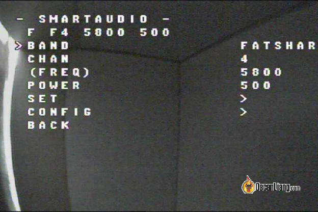

### **Pitmode**  {#pitmode}

Режим Pitmode є важливою функцією для тих, хто бере участь у перегонах або групових польотах *\[і валить русню 😈\].*  Він дозволяє  знизити вихідну потужність VTX до надзвичайно низького рівня (практично до нуля), коли дрон увімкнений, але не використовується, або вийшов з ладу. Таким чином ви можете змінити налаштування VTX або забрати свій дрон, не заважаючи іншим пілотам, дрони яких все ще можуть бути в повітрі.

### **Підключення аналогової FPV-камери до VTX** {#підключення-аналогової-fpv-камери-до-vtx}

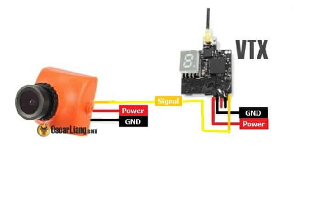

Підключення аналогового VTX до вашого дрона може відрізнятися залежно від компонентів, що викокистовуються. У найпростішому випадку VTX потрібно три з’єднання: відеовхід, живлення та заземлення.  
Щоб під’єднати FPV-камеру безпосередньо до VTX, підключіть сигнальні дроти та, щоб отримати зображення, переконайтеся, що VTX та FPV-окуляри підключені до однакового каналу. Якщо FPV-камера і VTX живляться від різних джерел, з’єднайте їхні дроти заземлення.  
Найпоширеніший спосіб підключення VTX — через польотний контролер, якщо він має вбудовану мікросхему OSD. На польотному контролер знайдіть відеовхід (Vin) для підключення сигналу камери та відеовихід (Vout) для підключення до VTX.

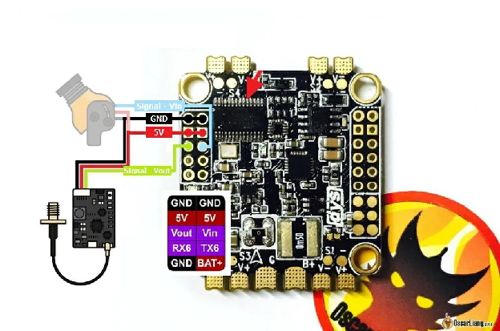

Переконайтеся, що ви забезпечили правильну напругу для вашого VTX, щоб уникнути його пошкодження або нестачі живлення. Зазвичай, можна живити VTX безпосередньо від контролера польоту, якщо він має BEC (вбудований регулятор напруги, який подає 5 В, 9 В або 12 В тощо). Більшість сучасних VTX підтримують широкий діапазон вхідної напруги, тому можна живити їх безпосередньо від акумулятора LiPo.

## **Найкращі практики використання VTX** {#найкращі-практики-використання-vtx}

###  **Ніколи не вмикайте живлення VTX без антени** {#ніколи-не-вмикайте-живлення-vtx-без-антени}

Завжди підключайте антену до VTX перед увімкненням. Якщо ви увімкнете живлення VTX без антени, для енергії не буде виходу, що призведе до накопичення тепла в передавачі. З часом цей надлишок тепла може пошкодити VTX.

### **Як уникнути шуму при відтворенні відео** {#як-уникнути-шуму-при-відтворенні-відео}

Двигуни та електронний контроллер швидкості можуть генерувати значну кількість електричних перешкод у системі живлення, що може вносити шум у відеопоток. Якщо ви живите FPV-обладнання (наприклад, VTX і камеру) безпосередньо від акумулятора, електричні перешкоди можуть спричинити завади, в результаті чого на екрані з'являться  білі смуги або мерехтіння.  
Щоб вирішити ці проблеми та запобігти їх виникненню, спробуйте зробити наступне:

1. Додайте конденсатори з низьким ESR, щоб зменшити шум у системі живлення, якщо ви цього ще не зробили. Ці конденсатори можуть допомогти відфільтрувати електричні перешкоди, створювані електронним контроллером швидкості і двигунами, та забезпечити чистіше відео.  
2. Належним чином поводьтесь з проводкою, заземленням і розподілом живлення. Тримайте дроти відеосигналу та живлення якомога далі один від одного та використовуйте скручені або екрановані кабелі, щоб мінімізувати перешкоди.  
3. Використовуйте спеціальний стабілізатор напруги або LC-фільтр для VTX і камери. Це допоможе зменшити шум і стабілізувати джерело живлення, що призведе до чистішого відеосигналу.

Для більш детальної інформації про те, як усунути шуми FPV, ознайомтеся з цими статтями:

* Додавання конденсаторів з низьким ESR для зменшення шуму в живленні:[https://oscarliang.com/capacitors-mini-quad/](https://oscarliang.com/capacitors-mini-quad/)  
* Як усунути шум FPV – проводка, фільтр та живлення:[https://oscarliang.com/fpv-video-noise/](https://oscarliang.com/fpv-video-noise/)

### **Уникайте контакту між заземленням антени VTX і рамою** {#уникайте-контакту-між-заземленням-антени-vtx-і-рамою}

Деякі рами дронів мають отвір у вуглепластику, який дозволяє кріпити роз’єм антени SMA безпосередньо до рами. Однак це створює контакт між заземленням антени і вуглепластиковою рамою, яка є провідною. Якщо будь-який провід під напругою торкнеться рами, це потенційно може призвести до згорання VTX. Крім того, цей контакт може спричинити зворотне потрапляння шуму в систему, що призведе до низки проблем, зокрема до перегріву VTX через підвищений опір.

## **Висновок** {#висновок}

На завершення, розуміння всіх тонкощів роботи відеопередавачів є важливим для оптимальної роботи з FPV. У цьому посібнику ми розглянули основні аспекти роботи відеопередавачів, зокрема питання вихідної потужності, каналів і частоти, способи зміни налаштувань VTX та найкращі практики правильного використання.  
Дотримуючись цих вказівок і рекомендацій, ви зможете приймати зважені рішення при виборі та налаштуванні відеопередавача як для аматорських, так і для професійних польотів. Зрештою, освоєння використання VTX забезпечить безперебійний і комфортний досвід використання FPV, що дозволить вам досліджувати небо з упевненістю та точністю.

#### **Історія редагування**

* Квітень 2016 — Статтю створено.  
* Квітень 2017 — статтю оновлено, додано «цифрова система FPV», «розумну функцію аудіо та телеметрії», «10 діапазонів, 80 каналів».  
* Березень 2018  — Статтю оновлено інформацією про конектори антени, керування VTX, підключення живлення та сигналу  
* Жовтень 2019 — Оновлена ​​інформація про підключення  
* Грудень 2022 — Оновлено розділ про вихідну потужність  
* Квітень 2023 — статтю переглянуто, додано рекомендації щодо продуктів, скорочено URL-адресу.  
* May 2024 – Updated guide.

[image1]: 

[image2]: 

[image3]: 

[image4]: 

[image5]: 

[image6]: 

[image7]: 

[image8]: 

[image9]: 

[image10]: 

[image11]: 

[image12]: 

[image13]: 

[image14]: 

[image15]: 

[image16]: 

[image17]: 

[image18]: 

[image19]: 

[image20]: 

[image21]: 

[image22]: 

[image23]: 

[image24]: 

[image25]: 

[image26]: 

[image27]: 

[image28]: 

[image29]: 