Стисле посилання на цей переклад: [bit.ly/LiangESC-Guide](https://bit.ly/LiangESC-Guide)   

| 🫂 | Нижче вичитаний людьми машнний український переклад оригіналу. Для [VictoryDrones](https://www.victory-drones.com/) переклад вичитали: Kristina, Oleg. Хочете покращити переклад чи знайшли помилку? – Лишіть коментар (Ctrl+Alt+M або «Меню» \> «Вставка» \> «Коментар»). Ми теж живі люди (як і ви) і робим помилки. Роботи їх, до речі, також роблять 😉 |
| :---: | :---- |

# Найкращий ESC для FPV-дронів: посібник покупця електронного контролера швидкості

# 4 травня 2024 року

# 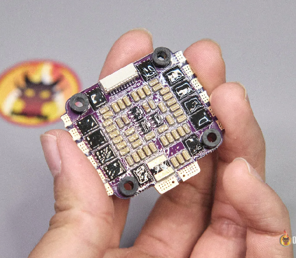

# У цій статті ми розглянемо основи електронних контролерів швидкості (ESC) та їхню роль у FPV-дронах. Цей вичерпний посібник має на меті надати цінну інформацію, таку як номінальні значення напруги та струму, переваги різних типів ESC та анатомічну будову ESC.

*Деякі посилання на цій сторінці є партнерськими. Я \[автор англомовної версії Оскар Ланг\] отримую комісію (без додаткових витрат для вас), якщо ви робите покупку після натискання одного із цих партнерських посилань. Це допомагає підтримувати безкоштовний контент для спільноти на цьому веб\-сайті. Будь ласка, прочитайте нашу [Політику партнерських посилань](https://oscarliang.com/affiliate-program-policy/) для отримання додаткової інформації.*

# Зміст

[Що таке електронний контролер швидкості?](#що-таке-електронний-контролер-швидкості?)

[Рекомендації по ESC](#рекомендації-по-esc)

[Вершина лінійки](#вершина-лінійки)

[Holybro Tekko32 F4 65A](#holybro-tekko32-f4-65a)

[ESC середнього рівня](#esc-середнього-рівня)

[XRotor Micro 60A](#xrotor-micro-60a)

[Найдешевше, що варто мати](#найдешевше,-що-варто-мати)

[SpeedyBee BLHeli\_S 55A](#speedybee-blheli_s-55a)

[Найкращий 20x20 мм ESC](#найкращий-20x20-мм-esc)

[Aikon AK32PRO 50A V2](#aikon-ak32pro-50a-v2)

[Найкращий одинарний ESC](#найкращий-одинарний-esc)

[Aikon AK32 35A ESC](#aikon-ak32-35a-esc)

[Типи ESC](#типи-esc)

[4в1 ESC](#4в1-esc)

[Одинарний ESC=](#одинарний-esc=)

[Визначення вимог до ESC](#визначення-вимог-до-esc)

[Номінальна напруга](#номінальна-напруга)

[Струмовіддача](#струмовіддача)

[Розуміння обмежень акумулятора](#розуміння-обмежень-акумулятора)

[Визначення розміру вашого ESC](#визначення-розміру-вашого-esc)

[Прошивка ESC](#прошивка-esc)

[SimonK та BLHeli](#simonk-та-blheli)

[BLHeli\_S i Bluejay](#blheli_s-i-bluejay)

[BLHeli\_32](#blheli_32)

[AM32](#am32)

[Яку прошивку ESC обрати?](#яку-прошивку-esc-обрати?)

[Протоколи ESC](#протоколи-esc)

[Як підключити ESC?](#як-підключити-esc?)

[Будова ESC](#будова-esc)

[LDO](#ldo)

[Мікроконтролер](#мікроконтролер)

[Дравер затвора транзистора](#дравер-затвора-транзистора)

[МДН-транзистор](#мдн-транзистор)

[Датчик струму](#датчик-струму)

[Процесор ESC](#процесор-esc)

[Процесори BLHeli\_32 ESC](#процесори-blheli_32-esc)

[Процесори SILABS F330 і F39X](#процесори-silabs-f330-і-f39x)

[Процесори Busybee (EFM8BB).](#процесори-busybee-\(efm8bb\).)

[Як працює ESC?](#як-працює-esc?)

[Висновок](#висновок)

[Історія редагування](#історія-редагування)

# 

## **Що таке електронний контролер швидкості?** {#що-таке-електронний-контролер-швидкості?}

# ESC, або електронний контролер швидкості, відповідає за контроль швидкості моторів у [FPV-дрон](https://oscarliang.com/fpv-drone-guide/)і. ESC отримує сигнали тяги від польотного контролера та приводить у дію безколекторний мотор на бажаній швидкості. Використання високоякісних ESC забезпечує надійний і плавний політ, хоча багато інших факторів також відіграють важливу роль у загальній продуктивності.

# Електронні контролери швидкості є важливою частиною продуктивності дрона, оскільки вони відповідають за управління змінною швидкістю моторів. Вони живляться постійним струмом (DC) від LiPo акумулятора та приймають сигнали мотора від польотного контролера, забезпечуючи трифазний змінний струм для живлення мотора.

## **Рекомендації по ESC** {#рекомендації-по-esc}

# 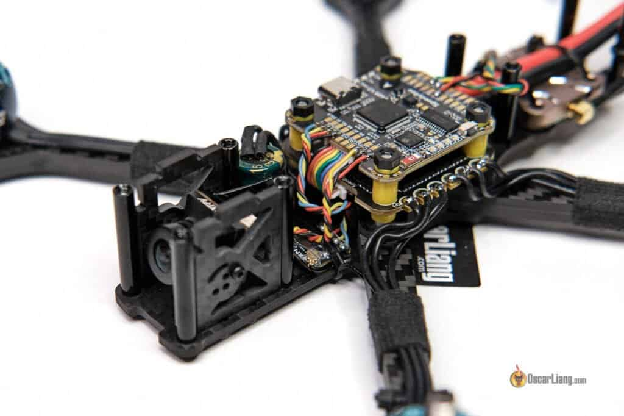

# Я дуже рекомендую застосування повного стеку польотного контролера / електронного контролера швидкості – може спростити процес створення дрона, оскільки він зорієнтований на просте вмикання в роботу («підключи та грай»). Такий підхід зводить до мінімуму необхідність турбуватися про сумісність підключень між різними виробниками. Ознайомтеся з рекомендованими мною наборами польотних контролерів тут: [https://oscarliang.com/top-5-best-fc-mini-quad/](https://oscarliang.com/top-5-best-fc-mini-quad/)

# Для тих, хто вважає за краще купувати ESC окремо, розглянемо наступні рекомендації.

# Використовуючи ESC 4в1 і польотний контролер від різних брендів, дуже важливо перевірити схему розташування виводів перед їх підключенням, щоб запобігти потенційному пошкодженню компонентів. Перед підключенням завжди перевіряйте та, за потреби, регулюйте дроти в джгуті.

### **Вершина лінійки** {#вершина-лінійки}

#### **Holybro Tekko32 F4 65A** {#holybro-tekko32-f4-65a}

# 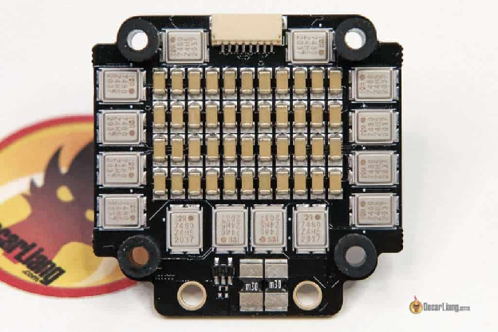

# **Ви можете придбати Tekko32 F4 ESC у таких постачальників:**

* # **GetFPV: [https://oscarliang.com/product-2lkt](https://oscarliang.com/product-2lkt)**

* # **AliExpress: [https://s.click.aliexpress.com/e/\_DnTcDLV](https://s.click.aliexpress.com/e/_DnTcDLV)**

* # **RDQ: [https://oscarliang.com/product-onoj](https://oscarliang.com/product-onoj)**

* # **Amazon: [https://amzn.to/346eCJh](https://amzn.to/346eCJh)**

# Holybro Tekko32 F4 65A – це, мабуть, найнадійніший і найменш “шумний” серед доступних ESC, завдяки вражаючій вбудованій фільтрації шуму. Ви будете вражені чистою потужністю, яку забезпечує цей ESC. Використовуючи один із найпотужніших процесорів F4 у ESC, Tekko32 розрахований на 65 А при максимальному короткочасному струмі 85 А. Це максимальна потужність для фрістайлу та гоночних збірок як 4S, так і 6S. Щоб дізнатися більше, перегляньте мій огляд: [https://oscarliang.com/holybro-kakute-h7-bt-fc-tekko32-f4-50a-65a-esc/](https://oscarliang.com/holybro-kakute-h7-bt-fc-tekko32-f4-50a-65a-esc/)

### **ESC середнього рівня** {#esc-середнього-рівня}

#### **XRotor Micro 60A** {#xrotor-micro-60a}

# 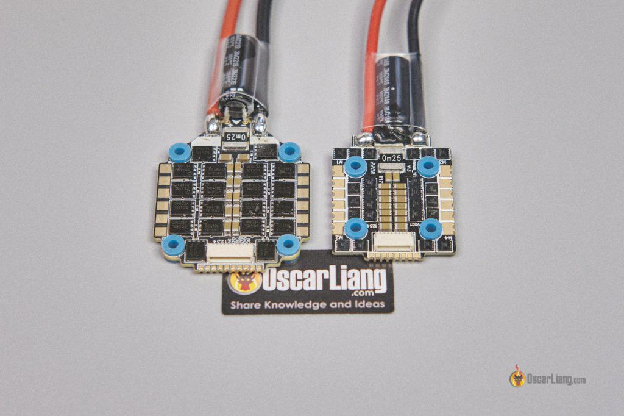

# **Ви можете знайти XRotor G2 65A ESC у таких постачальників:**

* # **AliExpress:[https://s.click.aliexpress.com/e/\_DlMl6hJ](https://s.click.aliexpress.com/e/_DlMl6hJ)**

* # **RDQ:[https://oscarliang.com/product-eczg](https://oscarliang.com/product-eczg)**

* # **Amazon:[https://amzn.to/3TR72b1](https://amzn.to/3TR72b1)**

* # **GetFPV: [https://oscarliang.com/product-919d](https://oscarliang.com/product-919d)**

# **Придбайте XRotor G2 45A ESC тут:**

* # **AliExpress:[https://s.click.aliexpress.com/e/\_DB9wUEv](https://s.click.aliexpress.com/e/_DB9wUEv)**

# Hobbywing XRotor G2 45A/65A є одним із найбільш впізнаваних у галузі ESC 4в1, схваленим багатьма провідними пілотами. Цей багатофункціональний ESC пропонує DShot і динамічну підтримку частоти ШІМ 120 кГц, надійні польові транзистори, прямі виводи для конденсатора з низьким ESR і можливість використання роз'єму для налаштування простого вмикання в роботу («підключи та грай») або прямої пайки до польотного контролера. Якщо бюджет не є проблемою, цей ESC є сильним претендентом на розгляд. Більше інформації тут: [https://oscarliang.com/hobbywing-xrotor-g2-4in1-esc-45a-65a/](https://oscarliang.com/hobbywing-xrotor-g2-4in1-esc-45a-65a/)

### **Найдешевше, що варто мати** {#найдешевше,-що-варто-мати}

#### **SpeedyBee BLHeli\_S 55A** {#speedybee-blheli_s-55a}

# 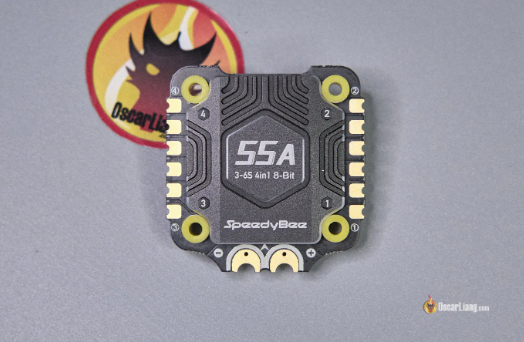

# **Ви можете придбати SpeedyBee 55A  у таких постачальників:**

* # **AliExpress: [https://s.click.aliexpress.com/e/\_Dnddgvl](https://s.click.aliexpress.com/e/_Dnddgvl)**

* # **Amazon: [https://amzn.to/3UM93aD](https://amzn.to/3UM93aD)**

* # **GetFPV: [https://oscarliang.com/product-rthp](https://oscarliang.com/product-rthp)**

* # **RDQ: [https://oscarliang.com/product-jkef](https://oscarliang.com/product-jkef)**

* # **Speedybee: [https://oscarliang.com/product-ku80](https://oscarliang.com/product-ku80)**

# SpeedyBee BLHeli\_S 55A 4в1, вартістю трохи більше $40, є одним із найдоступніших регуляторів ESC 4в1 на ринку, який забезпечує надійну та гідну продуктивність. Я особисто тестував цей ESC і літаю на ньому більше року. Він досі міцний і добре працює. Вам слід серйозно розглянути можливість придбання цього ESC разом із SpeedyBee F4 V3 FC у комплекті. Разом вони коштують менше $70, що робить цей комплект одним із найкращих серед доступних у 2024 році. Для більш детальної інформації, дивіться мій огляд: [https://oscarliang.com/speedybee-f405-v4/](https://oscarliang.com/speedybee-f405-v4/)

### **Найкращий 20x20 мм ESC**  {#найкращий-20x20-мм-esc}

#### **Aikon AK32PRO 50A V2** {#aikon-ak32pro-50a-v2}

# 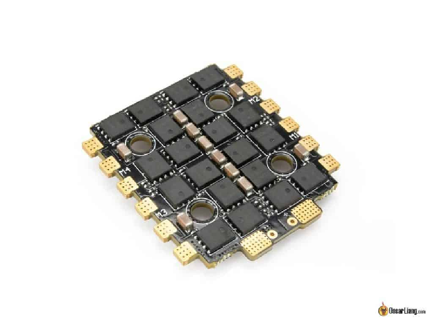

# **Ви можете придбати Aikon AK32PRO 4in1 ESC у таких постачальників:**

* # **AliExpress:[https://s.click.aliexpress.com/e/\_DeDfP5P](https://s.click.aliexpress.com/e/_DeDfP5P)**

* # **RDQ:[https://oscarliang.com/product-id38](https://oscarliang.com/product-id38)**

* # **GetFPV:[https://oscarliang.com/product-o7t9](https://oscarliang.com/product-o7t9)**

# 20x20mm ESC менші та легші, але не такі надійні, як 30x30mm ESC, через більші польові транзистори (МДН-транзистори) на останніх. Крім того, паяти 30x30 мм ESC легше завдяки більшим контактним майданчикам. Обирайте 30x30 мм ESC, коли це можливо; однак для легких гоночних дронів або менших дронів популярним варіантом є 20x20 мм.

# Не зважаючи на компактний форм-фактор (монтажні отвори 20x20 мм), ці ESC забезпечують продуктивність, подібну до деяких плат 30x30 мм, із струмовіддачею 50 А на окремий вивод мотора та підтримкою до 6S. Вони досить малі, щоб уміститись у 3-дюймові корпуси. Якщо вам колись знадобиться 20x20 мм ESC 4в1 навіть для легкого 5-дюймового корпусу, це також чудовий вибір.

# ---

### **Найкращий одинарний ESC** {#найкращий-одинарний-esc}

#### **Aikon AK32 35A ESC** {#aikon-ak32-35a-esc}

# 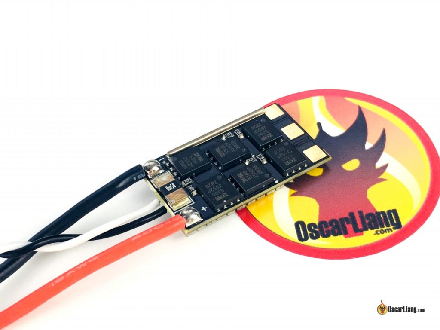

# **Ви можете знайти Aikon AK32 35A ESC у таких постачальників:**

* # **AliExpress:[https://s.click.aliexpress.com/e/\_DDvLwrJ](https://s.click.aliexpress.com/e/_DDvLwrJ)**

* # **GetFPV:[http://bit.ly/2F8TLqh](http://bit.ly/2F8TLqh)**

* # **Amazon:[https://amzn.to/32nKnKK](https://amzn.to/32nKnKK)**

# Хоча я особисто віддаю перевагу ESC 4в1 через їхню простоту використання, у вас можуть бути причини обрати одинарний ESC. У такому випадку я рекомендую AK32 35A ESC від Aikon. Я використовую ці ESC вже кілька років без жодних проблем, і вони забезпечують чудову надійність і продуктивність. Це звичайні регулятори BLHeli\_32 без модних RGB-світлодіодів, розраховані на напругу від 2S до 6S, із максимальною короткочасною струмовіддачею до 45A.

# ---

## 

## **Типи ESC** {#типи-esc}

# Є два основних типи ESC: 4в1 та одинарний.

### **4в1 ESC** {#4в1-esc}

# 

# ESC 4в1 інтегрує чотири окремих ESC на одній платі, кожен з яких керує окремим мотором.

# Зазвичай ESC 4в1 мають такий самий розмір, як і польотний контролер, що дозволяє легко їх збирати і спрощує установку. З меншою кількістю паяних з'єднань вони потребують менше пайки та проводки. ESC 4в1 зазвичай встановлюється під польотним контролером і підключається через один джгут дротів. Однак якщо один ESC пошкоджено, вам доведеться замінити всю плату – це компроміс між ризиком і зручністю. Втім, сьогодні ESC 4в1 дуже надійні, тому загалом тут не варто хвилюватись.

# 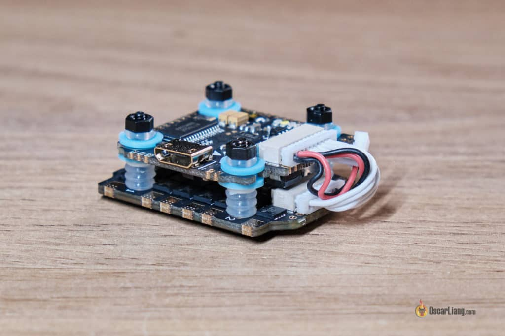

# Крім того, ESC 4в1 забезпечують кращий розподіл ваги завдяки їх централізованій масі, що може підвищити чутливість дрона.

# Доступні 2 розміри 4in1 ESC на основі схем кріплення для різних розмірів дронів: 30x30 мм i 20x20 мм. Більші ESC зазвичай довговічніші та потужніші завдяки більшим польовим транзисторам. Для FPV-дронів розміром 5 дюймів і більше, найбільш поширеним є 30x30 мм.

Також стає популярним інтегрувати ESC 4in1 y польотний контролер на одній платі з розміром кріплення 25.5×25.5mm. Ці плати розроблені для менших FPV дронів, спеціально для 3" або менших cinewhoops та ультралегких (так званих "зубочисток"), які зазвичай не використовують багато ампер. 

### **Одинарний ESC=** {#одинарний-esc=}

# 

# Одинарні ESC керують лише одним мотором і були більш популярними в минулому, але останніми роками стали менш поширеними.

# Основна перевага одиночних ESC полягає в їх простоті у використанні та економічності при заміні, оскільки в разі пошкодження їх можна замінити окремо. Оскільки вони зазвичай встановлюються на променях дрона, вони отримують більше повітря та мають кращі можливості охолодження.

# 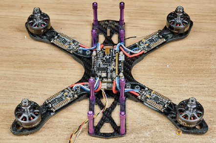

# При використанні одинарних ESC їх зазвичай потрібно під'єднати до однієї плати розподілу живлення (PDB) або "польотного контролера AIO" (тип польотного контролера з вбудованою платою розподілу живлення) для електроживлення.

# Однак одинарні ESC мають деякі недоліки – наприклад, більше пайки та дротів, що також може призвести до збільшення ваги дрона через додаткову вагу дротів і плати розподілу живлення. Крім того, маса ESC розташована далі від центру дрона, що збільшує момент інерції дрона та може знизити його чутливість до команд стіку.. 

# ---

## **Визначення вимог до ESC** {#визначення-вимог-до-esc}

# Щоб вибрати відповідний ESC для вашого FPV-дрона, переконайтеся, що він сумісний з напругою вашого акумулятора та може витримати струм, який споживають обрані вами мотори і пропелери на 100% тязі.

### **Номінальна напруга** {#номінальна-напруга}

# 

# Переконайтеся, що ваш ESC підтримує напругу вашого акумулятора. Використання занадто високої напруги акумулятора для вашого ESC може призвести до його пошкодження. Більшість ESC підтримують вхідну напругу до 6S, тоді як інші – лише до 4S або нижче. Терміни 6S і 4S означають кількість елементів у вашому LiPo акумуляторі. Якщо ви не знайомі з цими термінами, зверніться до мого посібника для початківців по LiPo акумуляторам: [https://bit.ly/LiPo-Batteries-forFPV-Drones](https://oscarliang.com/lipo-battery-guide/#Cell-Count)

### **Струмовіддача** {#струмовіддача}

# 

# Струмовіддача ESC вимірюється в амперах і іноді називається «номінальним струмом». Вона вказує на максимальний струм, який ESC може витримувати без пошкоджень. Майте на увазі, що це **HE** сила струму, що подається на мотори, а просто максимум, тому не хвилюйтеся, що значення «занадто велике». Номінальний струм ніколи не може бути надто високим, лише надто низьким.

# Для звичайного пілота FPV-дрона номінальна сила струму більшості ESC більш ніж достатня. Якщо ви створюєте спеціалізований гоночний дрон, який потребує екстремальних характеристик або високошвидкісних польотів, вам потрібно буде звернути пильну увагу на номінальну силу струму ESC, а також на інші фактори. Однак за нормального використання більшість пілотів не навантажують свої акумулятори настільки сильно, щоб перевищити струмовіддачу своїх ESC.

# Існує два значення струмовіддачі для ESC: постійна та максимальна короткочасна. Постійна струмовіддача означає постійний струм, який ESC може безпечно витримувати, тоді як максимальна короткочасна струмовіддача – це максимальний струм, який ESC може витримувати протягом коротких періодів часу – як правило, менше 10 секунд.

#### **Розуміння обмежень акумулятора** {#розуміння-обмежень-акумулятора}

# Я спробую пояснити, чому я сказав, що вам не потрібно хвилюватися про струмовіддачу в більшості випадків. 

# Якщо у вас ESC 4in1 на 55А (постійна струмовіддача), він повинен витримувати 220A загального струму для чотирьох моторів, припускаючи, що кожен мотор споживає однакову силу струму. 

# 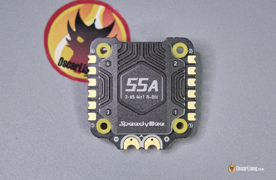

# Якщо загалом ви споживаєте лише 100А, кожен мотор споживає близько 25А, що в межах граничного значення в 55А. Споживання 100А – це значне навантаження для 5-дюймового FPV-дрона, і воно близьке до межі можливостей LiPo акумуляторів, а це означає, що вони не зможуть підтримувати такий високий струм настільки довго, щоб дійсно пошкодити ваш ESC. Крім того, ліміт короткочасного струму ESC зазвичай вище, ніж ліміт постійного струму, що дозволяє ESC, розрахованому на 55А, витримувати піки в 70А або навіть 80А протягом декількох секунд. Тому, якщо обрати один із рекомендованих на нашій сторінці ESC, його має бути достатньо для більшості 5-дюймових FPV-дронів без особливих проблем.

**Міркування щодо міцності та ваги**

# Сучасні ESC часто продаються з більш високими показниками сили струму, що вказує на підвищену довговічність і стійкість до стрибків напруги. Хоча ваш дрон може не потребувати 50 або 60 ампер під час звичайного використання, може бути краще мати ESC з вищим показником, щоби забезпечити його більшу надійність. ESC з нижчими показниками – наприклад, 30-амперні моделі, можуть бути більш чутливими до пошкоджень під час аварій, незважаючи на те, що вони достатні для звичайного використання. Але будьте обережні із збільшенням ваги – якщо ви будуєте легкий дрон, ви, ймовірно, не захочете переборщити з вагою.

#### **Визначення розміру вашого ESC** {#визначення-розміру-вашого-esc}

# При виборі розміру ESC враховуйте наступні фактори:

* # Зверніться по рекомендації до досвідчених пілотів, які створювали подібні дрони.

* # Використовуйте ESC з вищим рейтингом, якщо ви можете собі їх дозволити, оскільки вони, як правило, більш надійні та довговічні.

* # Якщо ви розробляєте унікальну конструкцію дрона або використовуєте незвичайний мотор, отримайте дані випробувань тяги або проконсультуйтеся з виробником, щоб визначити відповідну потужність ESC.

# ---

## **Прошивка ESC** {#прошивка-esc}

# 

# У цьому розділі я надам огляд найбільш важливих і популярних прошивок ESC. Повний та актуальний список прошивок ESC можна знайти за посиланням: [https://oscarliang.com/esc-firmware-protocols/](https://oscarliang.com/esc-firmware-protocols/)

### **SimonK та BLHeli** {#simonk-та-blheli}

# Дві найстаріші прошивки ESC з відкритим кодом для мультироторів – це SimonK і BLHeli. Зараз вони застаріли і більше не використовуються в сучасних ESC, але вони заслуговують на почесну згадку за те, що заклали основу FPV-дронів.

### **BLHeli\_S i Bluejay** {#blheli_s-i-bluejay}

# Прошивка BLHeli\_S – це друге покоління прошивки BLHeli, розроблене спеціально для ESC із швидшими 8-розрядними процесорами Busybee. У цій статті пояснюється, як підключати, прошивати та налаштовувати ESC BLHeli\_S: [https://oscarliang.com/connect-flash-blheli-s-esc/](https://oscarliang.com/connect-flash-blheli-s-esc/)

# Хоча офіційна прошивка BLHeli\_S більше не оновлюється (оскільки розробка перейшла на BLHeli\_32), з'явилися кастомні прошивки для підтримки обладнання, яке постачається з BLHeli\_S, пропонуючи найсучасніші функції та продуктивність, порівнянну з найновішими та дорожчими ESC BLHeli\_32. Яскравим прикладом є Bluejay. Щоб отримати вичерпний посібник із перепрошивки Bluejay на ваш BLHeli\_S ESC, відвідайте:[https://oscarliang.com/bluejay-blheli-s/](https://oscarliang.com/bluejay-blheli-s/)

### **BLHeli\_32** {#blheli_32}

# Прошивка BLHeli\_32 ESC є третім і останнім поколінням BLHeli. Розроблена спеціально для 32-розрядного обладнання, в цій ітерації вона має закритий код. Більш потужні процесори забезпечують більш плавну, точну та надійну роботу, ніж попередні ESC. У цій сатті пояснюється, як підключити, прошити та налаштувати ESC BLHeli\_32: [https://oscarliang.com/connect-flash-blheli-32-esc/](https://oscarliang.com/connect-flash-blheli-32-esc/)

# BLHeli\_32 має багато налаштувань, які можуть заплутати, і я пояснюю їх тут: [https://oscarliang.com/best-blheli-32-settings/](https://oscarliang.com/best-blheli-32-settings/)

### **AM32** {#am32}

# AM32 – це відносно нова прошивка з відкритим кодом, яка може стати перевіреною альтернативою BLHeli\_32. Деякі новітні ESC вже постачаються з прошивкою AM32. Дізнайтеся більше про AM32 тут: [https://oscarliang.com/am32-esc-firmware-an-open-source-alternative-to-blheli32/](https://oscarliang.com/am32-esc-firmware-an-open-source-alternative-to-blheli32/)

### **Яку прошивку ESC обрати?** {#яку-прошивку-esc-обрати?}

# Різниця в продуктивності між BLHeli\_S (прошита з Bluejay) і BLHeli\_32 мінімальна, тож ви не помилитесь із жодним із варіантів. Обидві прошивки тепер підтримують двонаправлений протокол DShot, що означає, що ви можете ввімкнути фільтрацію за обертами у Betaflight із будь-яким типом ESC.

# BLHeli\_32, як нове покоління, пропонує розширені функції, яких немає у BLHeli\_S – такі як телеметрія ESC і підтримка RGB LED. Однак ці функції не впливають на польотні характеристики і тому не є критично важливими. Обирайте BLHeli\_32, якщо вам потрібна більш перспективна ESC, або BLHeli\_S, якщо у вас обмежений бюджет.

---

## **Протоколи ESC** {#протоколи-esc}

# 

# *Протокол Oneshot*

# Протоколи ESC визначають швидкість передачі сигналу мотора між польотним контролером і ESC. Ось список протоколів ESC, які зазвичай використовуються в FPV-дронах, упорядкований від найстаріших до найновіших:

* # Стандартний ШІМ

* # [Oneshot125](https://oscarliang.com/oneshot125-esc-quadcopter-fpv/)

* # [Oneshot42](http://intofpv.com/t-oneshot42-explained-kiss-esc-fc-protocol)

* # Багатозарядний

* # [DShot](https://oscarliang.com/dshot/) (DShot150, DShot300, DShot600)

# Не заглиблюючись у технічні деталі, просто знайте, що DShot наразі є стандартним протоколом ESC для FPV-дронів. Для оптимальної продуктивності Вам слід використовувати DShot у Betaflight. 

# DShot має різні швидкості, позначені цифрами в кінці назви. Швидкість, яку ви обираєте, залежить від частоти циклу ПІД-регулятора, встановленої в Betaflight.

* # Для 2 кГц/ 1.6 кГц використовуйте DShot150; 

* # для 4кГц/3.2  кГц  – DShot300; 

* # для 8 кГц – DShot600.

# ---

## **Як підключити ESC?** {#як-підключити-esc?}

# ESC живиться безпосередньо від акумулятора LiPo, а швидкість мотора контролюється сигналом від польотного контролера. Мотори з'єднані з ESC трьома дротами.

# Порядок підключення дротів мотора до ESC не має значення, оскільки, помінявши місцями будь-які два з трьох дротів,  ви просто зміните напрямок обертання мотора. Ви також можете змінити напрямок обертання мотора, налаштувавши ESC у програмному забезпеченні. У мене є покрокова інструкція, як це зробити: [https://oscarliang.com/change-motor-spin-direction-quadcopter/](https://oscarliang.com/change-motor-spin-direction-quadcopter/)

# Одинарна проводка ESC:

# 

# Підключення ESC 4в1:

# 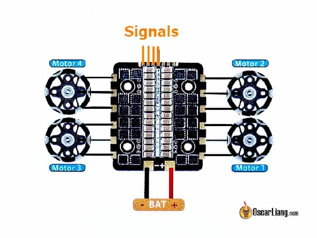

# Часто ви побачите велику кількість конденсаторів на платі ESC. Вони використовуються для фільтрації шуму, який генерують мотори та польові транзистори FETs.  Незалежно від рівня фільтрації, доступного на ESC, завжди слід припаювати додатковий конденсатор до колодок живлення вашого ESC. Це зменшить імовірність отримання зашумленого відеоканалу FPV і покращить ефективність польоту. Подивіться цю інструкцію, де я поясню, чому та які конденсатори слід використовувати: [https://oscarliang.com/capacitors-mini-quad/](https://oscarliang.com/capacitors-mini-quad/)

# ---

## **Будова ESC** {#будова-esc}

# Тепер, коли ми розглянули типи ESC, програмне забезпечення та вимоги, давайте обговоримо будову та компоненти ESC. Основними компонентами ESC є:

* # Блок мікроконтролера (MCU)

* # Драйвер управління затвором

* # МДН-транзистор *\[MOSFET\]*

* # Стабілізатор із низьким падінням напруги (LDO)

* # Датчик струму

* # Фільтруючі конденсатори

# Ці компоненти працюють разом, контролюючи швидкість мотора та забезпечуючи ефективну роботу. Нижче я поясню більш детально, що роблять ці компоненти.

# 

# ESC 4in1 – це, по суті, чотири ESC, інтегровані на одній друкованій платі. Ці ESC можуть мати спільні компоненти (такі як процесор, фільтруючі конденсатори, стабілізатори напруги тощо), що робить ESC 4in1 меншим, легшим і загалом більш економічно вигідним.

# 

### **LDO** {#ldo}

# Стабілізатор із низьким падінням напруги, або LDO, – це стабілізатор напруги, який використовується для перетворення напруги акумулятора до прийнятного рівня для живлення мікроконтролера та інших компонентів.

### **Мікроконтролер** {#мікроконтролер}

# Мікроконтролер, MCU або процесор – це мозок ESC і це також місце, де зберігається прошивка ESC.

### **Дравер затвора транзистора** {#дравер-затвора-транзистора}

# Драйвери затвора використовуються для керування МДН-транзисторами в ESC. Вони з'єднані затвором МДН-транзистора, звідси й назва "драйвер затвора". Старіші ESC використовують прості транзистори для керування МДН-транзистором. Використання спеціальних драйверів затвора покращує ефективність активного розмикання. Замість окремих драйверів затвора для трьох фаз мотору, сучасні ESC BLHeli\_32 використовують мікросхему FD6288 від Fortior. Одна з цих мікросхем містить три незалежні драйвери затворів МДН-транзистора в одній мікросхемі.

### **МДН-транзистор** {#мдн-транзистор}

# МДН-транзистори схожі на перемикачі: вони вмикають і вимикають живлення тисячі разів на секунду, саме так приводяться в дію мотори. Більші МДН-транзистори зазвичай означають, що ESC може витримувати більші напругу та струм, що робить ESC більш надійним і здатним протистояти зловживанням. Розмір МДН-транзистора особливо важливий для високовольтних установок, таких як 6S, через більш високі стрибки напруги.

# У мене є підручник, який пояснює, як працює МДН-транзистор: [https://oscarliang.com/how-to-use-mosfet-beginner-tutorial/](https://oscarliang.com/how-to-use-mosfet-beginner-tutorial/)

### **Датчик струму** {#датчик-струму}

# Датчик струму вимірює струм, який проходить через ESC, і надсилає цю інформацію до польотному контролеру. Це корисно, оскільки ви можете відображати споживання струму дроном на екрані в режимі реального часу та бачити, скільки заряду батареї було спожито.

# ---

## **Процесор ESC** {#процесор-esc}

# В основному мультироторні ESC на ринку використовують мікроконтролери ATMEL, Silabs і ARM Cortex. Кожен тип мікроконтролера має унікальні специфікації, функції та підтримку прошивок:

* # ATMEL 8-біт: сумісний із прошивками SimonK і BLHeli ESC

* # SILABS 8-біт: підтримується BLHeli або BLHeli\_S

* # ARM Cortex 32-bit (наприклад, STM32 F0, F3, L4): може запускати BLHeli\_32

# 8-розрядні ESC ATMEL під керуванням SimonK були більш поширеними, доки ESC на базі Silabs не набули популярності завдяки поширенню BLHeli\_S. У 2016 році на ринку ESC з'явилися 32-розрядні мікроконтролери ARM Core, що працюють під прошивкою BLHeli\_32.

### **Процесори BLHeli\_32 ESC** {#процесори-blheli_32-esc}

# BLHeli\_32 ESC використовують процесори STM32, [подібні до тих, що використовуються в польотних контролерах](https://oscarliang.com/f1-f3-f4-flight-controller/). Найпоширенішими процесорами, що використовуються в ESC, є F0, F3 та F4.

# З 2021 року виробники почали використовувати більш потужні мікроконтролери F3 та F4 на ESC BLHeli\_32 – насамперед, через глобальний дефіцит мікросхем, а не через їх обчислювальну потужність. Ці потужніші ESC не пропонують значних переваг порівняно з оригінальними ESC BLHeli\_32 на базі процесора F0 або старішими ESC BLHeli\_S (не STM32 MCU). Висока частота ШІМ (наприклад, 128 кГц), яку пропонують ці швидші процесори, в основному корисна для певних літальних апаратів, таких як кінематографічні літальні апарати та мікро-дрони, де бажані плавніші двигуни та краща ефективність. Така висока частота ШІМ не забезпечує оптимального прискорення та крутного моменту на низьких обертах для потужних і швидких FPV-дронів.

# Щоб отримати всі переваги від [функції "змінної частоти ШІМ в залежності від обертів" в BLHeli\_32](https://oscarliang.com/best-blheli-32-settings/#Variable-PWM-Frequency-by-RPM), менші літальні апарати можуть скористатися вищою частотою ШІМ швидшого процесора F4 (до 128 кГц), оскільки вони зазвичай мають набагато вищі оберти та більш високочастотні гармоніки. Для великих дронів, наприклад 5-дюймових, частота обертання нижча, і 96 кГц або навіть 48 кГц має бути достатньо, що робить вищу частоту ШІМ менш важливою.

### **Процесори SILABS F330 і F39X** {#процесори-silabs-f330-і-f39x}

# 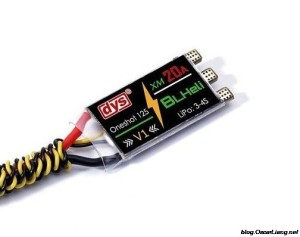

# *DYS XM20A – F390*

# Ці процесори використовуються в ESC BLHeli\_S.

# ESC на базі SiLabs оснащені різними процесорами з різними рівнями продуктивності, такими як F330 і F39X (F390/F396).

# F330 має нижчу тактову частоту, ніж F39X, і може мати проблеми з моторами з високою кількістю обертів на вольт. F39X не має цих проблем і бездоганно підтримує протокол Multishot ESC і Oneshot42. Добре відомі приклади включають Littlebee 20A (F330) і DYS XM20A (F39X).

### **Процесори Busybee (EFM8BB).** {#процесори-busybee-(efm8bb).}

# 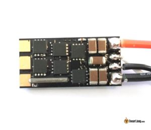

# *Aikon SEFM 20A – BusyBee*

# Це процесори ESC BLHeli\_S.

# Мікроконтролери Busybee є модернізацією F330 і F39X. Якщо у вас зараз є  BLHeli\_S, він, імовірно, використовує чіп BusyBee. Існує три чіпи BusyBee:

* # BB1 – EFM8BB10F8

* # BB2 – EFM8BB21F16

* # BB51 – EFMBB51F16

# Замість використання програмної ШІМ (широтно-імпульсної модуляції), мікроконтролери Busybee мають спеціальне обладнання для генерації сигналу ШІМ, синхронізованого з робочим циклом процесора, що забезпечує більш плавну реакцію на тягу. Вони також підтримують протокол DShot ESC, що робить їх економічно вигідним та ефективним рішенням для сучасних стандартів

# Приклади ESC, які використовують ці мікроконтролери, включають Aikon SEFM 30A та DYS XS30A.

Загальний рейтинг продуктивності 8-розрядних процесорів має такий вигляд (від кращого до гіршого): BB5/BB2 \> BB1 \> F39X \> F330 \> Atmel-8-bit.

## **Як працює ESC**?  {#як-працює-esc?}

ESC контролює мотор шляхом змiн напрямків струмів до полюсів статора мотора в конкретній послідовності, створюючи магнітне поле, яке створює рушійну силу на магнітах мотора, змушуючи його обертатися. Цей процес називається комутацією, і він повинен бути точно відтаймованим.

Користувач може налаштувати таймінг для тонкої настройки продуктивності дрона, це називається таймінг мотора в налаштуваннях ESC.

Для того, щоб мотор обертався правильно, таймінг ESC повинен ідеально відповідати швидкості та позиції обертання мотора. Будь-яке порушення цього таймінгу може спричинити розсинхронізацію, коли ESC та мотор втрачають "комунікацію", що призводить до того, що мотор починає спотикатися або повністю зупиняється. Це називається розсинхронізація ESC: [https://oscarliang.com/fix-esc-desync/](https://oscarliang.com/fix-esc-desync/). 

## **Висновок** {#висновок}

# Озброївшись необхідною інформацією про типи ESC, електричні параметри, протоколи та будову, ви будете добре підготовлені до вибору ідеального ESC для збірки вашого FPV-дрона. Майте на увазі, що більшість новітніх ESC на ринку працюють на подібному рівні, тому складно помилитися з будь-яким із варіантів, згаданих у цьому посібнику. Зосередьтеся на розумінні ваших конкретних потреб і вподобань, щоб знайти найкращий варіант для вашої збірки.

#### **Історія редагування** {#історія-редагування}

* # Липень 2016 – Статтю створено

* # Серпень 2017 р. – оновлено ​​статтю з інформацією про BLHeli\_32 і 32-розрядні процесори

* # Лютий 2020 р. – Оновлено інформацію, додано будову ESC і схеми підключення

* # Квітень 2022 р. – додано інформацію про процесор BLHeli\_32 ESC

* # Березень 2023 р. – підручник переглянуто, оновлено рекомендації по ESC

* Травень 2024 \- оновлено підручник та посилання на продукти

**КОМЕНТАРІ**  
Lars  
12th July 2024 \- 10:36 pm  
Привіт,  
я збираю y6 і у мене є питання. Я використовую два 4in1 ESC від t motor. Я припаяв 4 мотори до першого ESC і два мотори до другого ESC. На ESC є номери для моторів. Я припаяв мотор 5 до першого ESC 1 і мотор 6 до другого ESC 3\. Я переконфігурував мотори і кожен мотор крутився, крім мотора 6\. Чи потрібно мені припаяти мотор 6 до другого ESC 2 або я можу змусити ESC за допомогою Betaflight використовувати ESC 3 для мотора 6? Сподіваюся, ви зрозуміли мою проблему. Мій англійський не дуже добрий :D. 

Reply  
Oscar  
13th July 2024 \- 7:10 pm  
Вам потрібно підключити сигнал мотора 6 FC до 3-го ESC 2, і все. Можливо, ви не змінили підключення, і мотор 6 все ще підключений до 2-го ESC 2?   
Lars  
15th July 2024 \- 8:13 am  
Дякую за швидку відповідь. Якщо я вас правильно зрозумів. Мені потрібно переналаштувати комунікаційні кабелі між ESC і польотним контролером. Сигнал ESC 2, мотор 3, потрібно підключити до входу сигналу ESC для мотора 2? 

Reply  
Oscar  
15th July 2024 \- 3:33 pm  
Так

1. березня 2023 \- 7:38 ранку  
   Ніяких згадок про AM32 і Skystars KM55A?

   [ВІДПОВІДЬ](https://oscarliang.com/esc/?fbclid=IwAR1RW0fRaxYnFdXTnaWfH-AhN1By8oa8dgO7uzaMP2QeP1baII2Kbn4PRcI#comment-163479)  
   ОСКАР  
   30 березня 2023 \- 10:12 ранку  
   У повному переліку прошивок ESC у статті, на яку я посилався, я згадував AM32. Але варто зазначити, що ця прошивка є більш просунутою, і, як правило, новачкам не варто на ній зосереджуватись.  
2. 16 травня 2021 \- 15:45  
   Чи може хтось підказати, чи сумісний мій ESC (Mamba F40HV ESC) з BLHeli\_32? Не можу знайти жодної інформації щодо вбудованого мікроконтролера.

   [ВІДПОВІДЬ](https://oscarliang.com/esc/?fbclid=IwAR1RW0fRaxYnFdXTnaWfH-AhN1By8oa8dgO7uzaMP2QeP1baII2Kbn4PRcI#comment-70503)  
   ОСКАР  
   16 травня 2021 \- 16:21  
   Ні, вони не сумісні з BLHeli\_32, тільки з BLHeli\_S

3. 4 вересня 2020 \- 15:34  
   Як визначити, чи має ваш ESC 4n1 інтегровану плату розподілу живлення? Чи можу я припустити, що всі ESC 4n1 мають інтегровану плату, чи є якісь специфікації, на які слід звернути увагу? Я будую свій перший дрон... не дуже багато знаю.  
     Ось такий у мене є: rotorvillage.ca/aikon-ak32pin-25a-6s-4-in-1-blheli\_32-esc-20×20

   [ВІДПОВІДЬ](https://oscarliang.com/esc/?fbclid=IwAR1RW0fRaxYnFdXTnaWfH-AhN1By8oa8dgO7uzaMP2QeP1baII2Kbn4PRcI#comment-34039)  
   ОСКАР  
   4 вересня 2020 \- 15:44  
   Всі ESC 4в1 діють як плати розподілу живлення.  
4. 9 квітня 2019 \- 8:38 ранку  
   Доброго дня\! Чи є різниця між 2306 2600кВ з 5" стійками (20А @ 4с) і 5010 300кВ з 18" стійками (20А @ 6с), коли я обираю ESC, наприклад, 30А 3-6S blheli?

   [ВІДПОВІДЬ](https://oscarliang.com/esc/?fbclid=IwAR1RW0fRaxYnFdXTnaWfH-AhN1By8oa8dgO7uzaMP2QeP1baII2Kbn4PRcI#comment-20712)  
   ОСКАР  
   23 квітня 2019 \- 4:52 pm  
   Ні, якщо ESC відповідає чинним вимогам.  
5. 30 липня 2018 \- 15:19  
   Привіт, друже, гарний пост...  
     У мене питання, коли ви знаходите ESC 4n1, на якому написано, що він має потужність 20 ампер... це означає, що це 4 х 20 ампер або 4 х 5 ампер, що в сумі становить 20 ампер?  
   Дякую\!

   [ВІДПОВІДЬ](https://oscarliang.com/esc/?fbclid=IwAR1RW0fRaxYnFdXTnaWfH-AhN1By8oa8dgO7uzaMP2QeP1baII2Kbn4PRcI#comment-18379)  
   ОСКАР  
   31 липня 2018 \- 9:30 вечора  
   Номінальна сила струму зазвичай відноситься до кожного окремого ESC... отже, вона має бути 4x20A  
6. 29 червня 2018 \- 6:28 ранку  
   Привіт,  
    Я збираю 5-дюймовий квадрокоптер і хотів би мати пристойний квадрокоптер для фрістайлу. Тому я замовив свій польотний контролер (HGLRC F440, ESC 4в1 40А) і 1300mah 90c 4s tattu r-line акумулятори, але я не зміг замовити мотори, які хотів (3B 2207 2650kv), тому що їх не було на складі. Тож поки я чекав, коли вони з'являться на складі, я досліджував інші мотори та знайшов результати, які відкрили ще цілий ряд моторів, які я міг обрати, і тепер я знову розгублений, які мотори мені обрати.  
     Хотів дізнатися, чи допоможете ви мені обрати їх  
    (бюджет близько 130 австралійських доларів, якщо ціна буде нижчою за хорошу якість, буде чудово)  
    Дякую  
    Даніель.

   [ВІДПОВІДЬ](https://oscarliang.com/esc/?fbclid=IwAR1RW0fRaxYnFdXTnaWfH-AhN1By8oa8dgO7uzaMP2QeP1baII2Kbn4PRcI#comment-18113)  
   ОСКАР  
   30 червня 2018 \- 13:41  
   Перевірте Brotherhobby R6 2207 або 2306 :) Я спробував їх, і вони приголомшливі\!  
7. 18 березня 2018 \- 2:34 pm  
   Вам варто написати про те, як зробити маленький Raspberry PI з бета-версією та сенсорним екраном для польового кишенькового комп'ютера, який можна носити в рюкзаку.

   [ВІДПОВІДЬ](https://oscarliang.com/esc/?fbclid=IwAR1RW0fRaxYnFdXTnaWfH-AhN1By8oa8dgO7uzaMP2QeP1baII2Kbn4PRcI#comment-17046)  
   ГЕРРІТ  
   31 жовтня 2018 \- 12:42 pm  
   З'явилася швидка бджілка для Android\! Потрібен лише OTG USB кабель ;)

   [ВІДПОВІДЬ](https://oscarliang.com/esc/?fbclid=IwAR1RW0fRaxYnFdXTnaWfH-AhN1By8oa8dgO7uzaMP2QeP1baII2Kbn4PRcI#comment-19306)

   ДЖИМ  
   24 травня 2023 \- 12:28  
   Не робіть цього. Купіть адаптер Speedybee за \~$35 і використовуйте його з вашим квадрокоптером. Ви можете робити все те ж саме, що і з реальним бетафлайтером, але на телефоні.  
8. 8 січня 2017 \- 12:46  
   Привіт, я початківець, збираю zmr250. Перший раз збираю. Я замовив польотний контролер відкритого політьоту cc3d fc. Моє питання полягає в тому, чи можу я живити свій cc3d за допомогою моєї плати розподілу живлення cc3d через 5В-блок вимкнення батареї безпосередньо від мого плати розподілу живлення? Чи я маю просто заживити польотний контролер через 20А-ESC з вбудованим 5В-блоком вимкнення батареї. Я намагаюсь уникнути доставки ESC через вагу та економію грошей.

   [ВІДПОВІДЬ](https://oscarliang.com/esc/?fbclid=IwAR1RW0fRaxYnFdXTnaWfH-AhN1By8oa8dgO7uzaMP2QeP1baII2Kbn4PRcI#comment-13501)  
   TODD  
   13 травня 2017 \- 1:46 ранку  
   На брелоку має бути вихід 5В, який ви можете використовувати для живлення cc3d. На моєму квадрокоптері стоїть міні-квадрокоптер cc3d, і саме так я живлю свій. На іншому моєму квадрокоптері встановлена система Skyline Acro, і мені треба проводити гарячий дріт від плати розподілу живлення під ним до 5В на цьому брелоку, тому що у нього немає штифтів, як у більшості, що робить його схожим на опорні. Сподіваюся, це допоможе

[image1]: 

[image2]: 

[image3]: 

[image4]: 

[image5]: 

[image6]: 

[image7]: 

[image8]: 

[image9]: 

[image10]: 

[image11]: 

[image12]: 

[image13]: 

[image14]: 