Стисле посилання на цей переклад: [https://bit.ly/LiangPropellersUA](https://bit.ly/LiangPropellersUA) 

|  | Нижче вичитаний людьми машинний український переклад оригіналу. Для [VictoryDrones](https://www.victory-drones.com/) переклад вичитали: Natalya M., Block. Хочете покращити переклад чи знайшли помилку? — Лишіть коментар (Ctrl+Alt+M або «Меню» \> «Вставка» \> «Коментар»). Ми теж живі люди (як і ви) і робим помилки. Роботи їх, до речі, також роблять 😉 |
| :---: | :---- |

# Довідник із різновидів пропелерів FPV-дронів: як вибрати найкращий пропелер для квадрокоптера

2 травня 2023 року

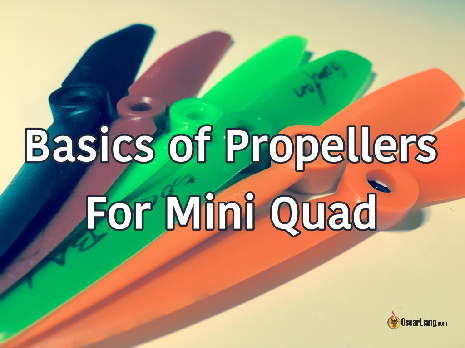

Пропелери є важливим компонентом будь-якого FPV-дронa, бо вони визначають потужність, плавність і чутливість літального апарату. Ці спеціалізовані [аеродинамічні профілі](https://docs.google.com/spreadsheets/d/19LVBAK-7Hr11sl06hOlt_Ib6RLhJ8HAjS0fPe6Encqc/edit#gid=0&range=A316) кріпляться до [ступиці](https://docs.google.com/spreadsheets/d/19LVBAK-7Hr11sl06hOlt_Ib6RLhJ8HAjS0fPe6Encqc/edit#gid=0&range=A312) мотору та мають різні форми, розміри та кількість лопатей. Розуміння основ роботи пропелерів має вирішальне значення для оптимізації продуктивності квадрокоптера.

*Деякі посилання на цій сторінці є партнерськими. Я \[автор англомовної версії Оскар Ланг\] отримую комісію (без додаткових витрат для вас), якщо ви робите покупку після натискання одного із цих партнерських посилань. Це допомагає підтримувати безкоштовний контент для спільноти на цьому веб\-сайті. Будь ласка, прочитайте нашу [Політику партнерських посилань](https://oscarliang.com/affiliate-program-policy/) для отримання додаткової інформації.*

# **Зміст** {#зміст}

[**Зміст	2**](#зміст)

[**Рекомендації	3**](#рекомендації)

[HQ 5×4.3×3 V2S (найкращий в усьому)	4](#hq-5×4.3×3-v2s-\(найкращий-в-усьому\))

[Gemfan Hurricane 51466 (найкраще для перегонів)	5](#gemfan-hurricane-51466-\(найкраще-для-перегонів\))

[HQ 5,1×2,5×3 (найкраще для кінo)	6](#hq-5,1×2,5×3-\(найкраще-для-кінo\))

[DAL Cyclone 5045C (найміцніший)	7](#dal-cyclone-5045c-\(найміцніший\))

[HQ T5x3x2 – для збірок Sub-250 5″	8](#hq-t5x3x2-–-для-збірок-sub-250-5″)

[Gemfan LR5126 2-Blade](#gemfan-lr5126-2-blade-універсальний-варіант-з-гідною-продуктивністю)  
[Універсальний варіант з гідною продуктивністю	9](#gemfan-lr5126-2-blade-універсальний-варіант-з-гідною-продуктивністю)

[HQ DP 7×3.5×3-v1s (найкращий в усьому)	10](#hq-dp-7×3.5×3-v1s-\(найкращий-в-усьому\))

[Gemfan Cinelifter 7035 3-лопатевий	11](#gemfan-cinelifter-7035-3-лопатевий)

[Для важких вантажів	11](#для-важких-вантажів)

[Gemfan LR 7035 2-лопатевий](#gemfan-lr-7035-2-лопатевий-для-польотів-на-великі-відстані)  
[Для польотів на великі відстані	12](#gemfan-lr-7035-2-лопатевий-для-польотів-на-великі-відстані)

[Найкращі 3-дюймові пропелери для фрістайлу	12](#найкращі-3-дюймові-пропелери-для-фрістайлу)

[Avan Mini 3×2.4×3	12](#avan-mini-3×2.4×3)

[HQ T3x3x3](#hq-t3x3x3-збалансована-продуктивність)  
[Збалансована продуктивність	13](#hq-t3x3x3-збалансована-продуктивність)

[Найкращі 3-дюймові пропелери для Cinewhoops	13](#найкращі-3-дюймові-пропелери-для-cinewhoops)

[Gemfan D76 5-лопатевий	13](#gemfan-d76-5-лопатевий)

[HQ T3x3x3	13](#hq-t3x3x3)

[Найкращі 3.5″ пропелери для фрістайлу	13](#найкращі-3.5″-пропелери-для-фрістайлу)

[Emax Avan Scimitar 3528	13](#emax-avan-scimitar-3528)

[Gemfan Hurricane 3525-3	14](#gemfan-hurricane-3525-3)

[Найкращі 3.5″ пропелери для Cinewhoops	14](#найкращі-3.5″-пропелери-для-cinewhoops)

[HQ DT90MMx3	14](#hq-dt90mmx3)

[GF Hurrican 3525-3	14](#gf-hurrican-3525-3)

[Найкращі 2″ пропелери для Cinewhoops	15](#найкращі-2″-пропелери-для-cinewhoops)

[HQ Prop T2x3x3	15](#hq-prop-t2x3x3)

[Gemfan Hurricane 2023S	15](#gemfan-hurricane-2023s)

[Найкращі пропелери для Tiny Whoop	15](#найкращі-пропелери-для-tiny-whoop)

[Що таке пропелер?	16](#що-таке-пропелер?)

[Як працює пропелер?	16](#як-працює-пропелер?)

[Розуміння технологічних характеристик пропелера	17](#розуміння-технологічних-характеристик-пропелера)

[Діаметр і розмір пропелера	18](#діаметр-і-розмір-пропелера)

[Довжина пропелера	19](#довжина-пропелера)

[Крок пропелера	19](#крок-пропелера)

[Кількість лопатей	21](#кількість-лопатей)

[Додавання лопатей	22](#додавання-лопатей)

[Bага	23](#bага)

[Напрямки обертання	24](#напрямки-обертання)

[Типи кріплення пропелера	26](#типи-кріплення-пропелера)

[Матеріал	28](#матеріал)

[Як встановлювати пропелери?	28](#як-встановлювати-пропелери?)

[1\. Перевірте орієнтацію мотора	28](#1.-перевірте-орієнтацію-мотора)

[2\. Визначте верхню та нижню частину пропелера	29](#2.-визначте-верхню-та-нижню-частину-пропелера)

[3\. Визначте відповідність пропелерів до моторів	29](#3.-визначте-відповідність-пропелерів-до-моторів)

[4\. Закріпіть пропелери	30](#4.-закріпіть-пропелери)

[5\. Перевірте встановлення	30](#5.-перевірте-встановлення)

[Розуміння концепцій обертання “всередину” i “назовні”	30](#розуміння-концепцій-обертання-“всередину”-i-“назовні”)

[Конфігурація "Пушер"	31](#конфігурація-"пушер")

[Які пропелери використовувати на FPV-дроні	32](#які-пропелери-використовувати-на-fpv-дроні)

[Тяга	32](#тяга)

[Плавність	33](#плавність)

[Швидкість	33](#швидкість)

[Чи кращі великі пропелери?	34](#чи-кращі-великі-пропелери?)

[Кут атаки	34](#кут-атаки)

[Прямий політ та високошвидкісне крейсування	35](#прямий-політ-та-високошвидкісне-крейсування)

[Пошук оптимальних налаштувань	35](#пошук-оптимальних-налаштувань)

[Погода та Температура	35](#погода-та-температура)

[Вплив на налаштування	36](#вплив-на-налаштування)

[Розгляд шумових характеристик	37](#розгляд-шумових-характеристик)

[Заключні думки	38](#заключні-думки)

[Edit History	38](#edit-history)

## 

## **Рекомендації** {#рекомендації}

Пропелери розробляють для різних застосувань. [Kрок](https://docs.google.com/spreadsheets/d/19LVBAK-7Hr11sl06hOlt_Ib6RLhJ8HAjS0fPe6Encqc/edit#gid=0&range=A189), форма та матеріал відіграють важливу роль у продуктивності та характеристиках польоту. Тут я розповім які пропелери, на мою думку, є найкращими і які варто придбати.

Я спробував усі основні бренди пропелерів і виявив, що пропелери HQ є одними з найплавніших і найлегших y налаштуваннi. Вони здаються більш збалансованими та викликають менше вібрації, ніж інші. Варто зазначити: мені легше було досягти плавності з 3-лопатевими ніж з 2-лопатевими пропелерами.

#### **HQ 5×4.3×3 V2S (найкращий в усьому)** {#hq-5×4.3×3-v2s-(найкращий-в-усьому)}

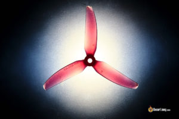

«Плавність» пропелеру відіграє важливу роль у тому, наскільки добре дрон літає, і наскільки ми можемо налаштувати [PID](https://docs.google.com/document/d/12RJN2pKjdUXZgKW_55WBuYwVmSSE7wLWF8VMZmY3hu0/edit) та фільтри *\[прим. пер.: дивіться перелік вже переладених українською статей про фільтри у нашому [беклозі](https://docs.google.com/spreadsheets/d/19LVBAK-7Hr11sl06hOlt_Ib6RLhJ8HAjS0fPe6Encqc/edit#gid=1508786546)\].* Природньо, що пропелери, які створюють менше вібрації, матимуть перевагу. Розподіл ваги лопаті та загальна вага всього пропелеру також має значення, бo чим легше він розкручується та сповільнюється, тим швидше змінюється швидкість обертання *\[RPM, обертів на хвилину об/хв\]*, що призводить до швидшої реакції дрона та кращого контролю завихрення від пропелерів при різких стрибках потужності.

Мені подобається HQ 5×4.3×3 за його лінійну реакцію у керуванні тягою, яка дає мені дуже точний контроль в усьому діапазоні тяги. Чутливість і щільність просто приголомшливі, відчувається що дрон дуже добре реагує на стік.

**Де можна придбати HQ 5×4,3×3:**

**AliExpress: [https://s.click.aliexpress.com/e/\_DneZBnf](https://s.click.aliexpress.com/e/_DneZBnf)**

**Amazon: [https://amzn.to/3dlBRDF](https://amzn.to/3dlBRDF)**

**RDQ: [https://oscarliang.com/product-9yhl](https://oscarliang.com/product-9yhl)**

**Banggood: [https://oscarliang.com/product-5lqa](https://oscarliang.com/product-5lqa)**

**GetFPV: [https://oscarliang.com/product-v2u8](https://oscarliang.com/product-v2u8)**

#### **Gemfan Hurricane 51466 (найкраще для перегонів)** {#gemfan-hurricane-51466-(найкраще-для-перегонів)}

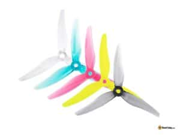

Для хорошого гоночного пропелеру важливу роль відіграють чутливість і потужність забезпечуваної ним тяги. Щоб бути чутливим, пропелер має бути відносно легким, а розподіл ваги лопаті має бути оптимізованим, щоб швидко змінювати об/хв *\[oберт за хвилину\]*  

Gemfan Hurricane чудово працює на високих обертах газу, має велику потужність і дуже плавний, але, можливо, трохи менш точний на нижньому рівні. Вони мають посилений [ступичний](https://docs.google.com/spreadsheets/d/19LVBAK-7Hr11sl06hOlt_Ib6RLhJ8HAjS0fPe6Encqc/edit#gid=1826030100&range=A306) вузол, щоб витримувати падіння. Пропелер погнувся? Так розігніть його і полетіли далі.

**Де можна придбати Gemfan Hurricane 51466-3 від:**

**AliExpress: [https://s.click.aliexpress.com/e/\_DDe02Ep](https://s.click.aliexpress.com/e/_DDe02Ep)**

**RDQ: h[ttps://oscarliang.com/product-dsex](http://oscarliang.com/product-dsex)**

**Amazon: [https://amzn.to/2OvWfSF](https://amzn.to/2OvWfSF)**

**Banggood: [https://oscarliang.com/product-v2r2](https://oscarliang.com/product-v2r2)**

**GetFPV: [https://oscarliang.com/product-cn2c](https://oscarliang.com/product-cn2c)**

#### **HQ 5,1×2,5×3 (найкраще для кінo)** {#hq-5,1×2,5×3-(найкраще-для-кінo)}

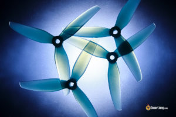

Якщо ви віддаєте перевагу плавності та ефективності, а не просто потужності, ці пропелери для вас. HQ 5,1 × 2,5 × 3 є надзвичайно ефективним пропелером, як я бачу зі своїх статичних тестів на тягу, а контроль завихрення від при різких стрибках потужності не має собі рівних.

**Де можна придбати HQ 5,1×2,5×3 від:**

**AliExpress: h[ttps://s.click.aliexpress.com/e/\_DdUbvuD](http://s.click.aliexpress.com/e/_DdUbvuD)**

**Banggood: [https://oscarliang.com/product-rwfl](https://oscarliang.com/product-rwfl)**

**GetFPV: h[ttps://oscarliang.com/product-ipbz](http://oscarliang.com/product-ipbz)**

**RDQ: [https://oscarliang.com/product-io66](https://oscarliang.com/product-io66)**

#### 

#### **DAL Cyclone 5045C (найміцніший)** {#dal-cyclone-5045c-(найміцніший)}

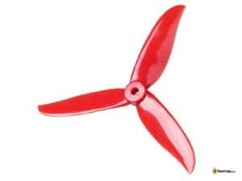

Не зовсім хороші з точки зору продуктивності, але дешеві, довговічні та пропонують пристойну продуктивність, — достатньо для повсякденної практики і польотів.

**Де можна придбати Cyclone 5040 з:**

**AliExpress: [https://s.click.aliexpress.com/e/\_DcJD917](https://s.click.aliexpress.com/e/_DcJD917)**  
**GetFPV: [https://oscarliang.com/product-hzrz](https://oscarliang.com/product-hzrz)**  
**Amazon: [https://amzn.to/3eyUXRh](https://amzn.to/3eyUXRh)**

#### 

#### **HQ T5x3x2 – для збірок Sub-250 5″** {#hq-t5x3x2-–-для-збірок-sub-250-5″}

Чудовий варіант для класу 5 дюймів, для дронів загальною вагою менше 250 г   
(наприклад, у парі з моторами 2004 i 2104). Hадзвичайно ефективнi без втрати продуктивності. 

**Де можна придбати:**

**AliExpress: [https://s.click.aliexpress.com/e/\_DDlqcI1](https://s.click.aliexpress.com/e/_DDlqcI1)**  
**GetFPV: [https://oscarliang.com/product-oe2l](https://oscarliang.com/product-oe2l)**  
**RDQ: [https://oscarliang.com/product-58rm](https://oscarliang.com/product-58rm)**  
**NBD: [https://oscarliang.com/product-mnv6](https://oscarliang.com/product-mnv6)**

#### **Gemfan LR5126 2-Blade** Універсальний варіант з гідною продуктивністю {#gemfan-lr5126-2-blade-універсальний-варіант-з-гідною-продуктивністю}

Розроблений для збірок, які важать менше 250 г і застосовуються для польотів на великі відстані, –цей пропелер пропонує гідну продуктивність з великою ефективністю. Його універсальний дизайн підтримує як T-кріплення, так і стандартні гайки пропелера 5 мм.

**Де можна придбати:**

AliExpress: [https://s.click.aliexpress.com/e/\_DchZptP](https://s.click.aliexpress.com/e/_DchZptP)

GetFPV: [https://oscarliang.com/product-y6r9](https://oscarliang.com/product-y6r9)

RDQ: [https://oscarliang.com/product-h159](https://oscarliang.com/product-h159)

#### 

#### **HQ DP 7×3.5×3-v1s (найкращий в усьому)** {#hq-dp-7×3.5×3-v1s-(найкращий-в-усьому)}

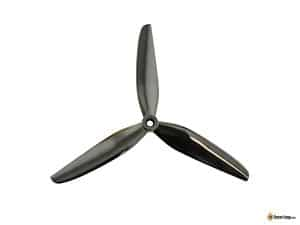

**Це найкращий 7-дюймовий пропелер**, на якому я літав: чутливий, низька вібрація, гідна потужність.

**Де можна придбать:**

**AliExpress: [https://s.click.aliexpress.com/e/\_DFwLMm1](https://s.click.aliexpress.com/e/_DFwLMm1)**  
**GetFPV: [https://oscarliang.com/product-1pv4](https://oscarliang.com/product-1pv4)**  
**RDQ: [https://oscarliang.com/product-vyis](https://oscarliang.com/product-vyis)**  
**Amazon: [https://amzn.to/3p0ABvl](https://amzn.to/3p0ABvl)**

#### 

#### **Gemfan Cinelifter 7035 3-лопатевий** {#gemfan-cinelifter-7035-3-лопатевий}

#### **Для важких вантажів** {#для-важких-вантажів}

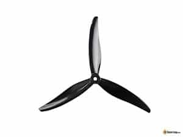

Гідна альтернатива HQ DP, чудовий вибір для синеліфтерів та важких систем, пропонуючи відмінну стабільність та відмінну тягу для перенесення великих вантажів.

**Де можна придбать:**

**AliExpress: [https://s.click.aliexpress.com/e/\_DlLzfwD](https://s.click.aliexpress.com/e/_DlLzfwD)**

**GetFPV: [https://oscarliang.com/product-zl0g](https://oscarliang.com/product-zl0g)**

**RDQ: [https://oscarliang.com/product-et2i](https://oscarliang.com/product-et2i)**

**Amazon: [https://amzn.to/3NuSH2S](https://amzn.to/3NuSH2S)**

#### 

#### **Gemfan LR 7035 2-лопатевий** **Для польотів на великі відстані** {#gemfan-lr-7035-2-лопатевий-для-польотів-на-великі-відстані}

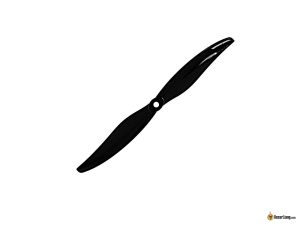

Чудовий пропелер для польотів на великі відстані. Добре працює на менших двигунах 2506\.

**Де можна придбать:**

**AliExpress: [https://s.click.aliexpress.com/e/\_DCARRpL](https://s.click.aliexpress.com/e/_DCARRpL)**

**GetFPV: [https://oscarliang.com/product-9mms](https://oscarliang.com/product-9mms)**

**Amazon: [https://amzn.to/3nmZFvW](https://amzn.to/3nmZFvW)**

## **Найкращі 3-дюймові пропелери для фрістайлу** {#найкращі-3-дюймові-пропелери-для-фрістайлу}

### **Avan Mini 3×2.4×3** {#avan-mini-3×2.4×3}

Ideal props for power and speed.

AliExpress: [https://s.click.aliexpress.com/e/\_DFtUlwP](https://s.click.aliexpress.com/e/_DFtUlwP)

RDQ: [https://oscarliang.com/product-hgtx](https://oscarliang.com/product-hgtx) 

### **HQ T3x3x3** Збалансована продуктивність {#hq-t3x3x3-збалансована-продуктивність}

AliExpress: [https://s.click.aliexpress.com/e/\_DD27gkR](https://s.click.aliexpress.com/e/_DD27gkR)

Amazon: [https://amzn.to/3Vr0XEm](https://amzn.to/3Vr0XEm)

GetFPV: [https://oscarliang.com/product-1mau](https://oscarliang.com/product-1mau)

RDQ: [https://oscarliang.com/product-7ang](https://oscarliang.com/product-7ang)

## **Найкращі 3-дюймові пропелери для Cinewhoops** {#найкращі-3-дюймові-пропелери-для-cinewhoops}

### **Gemfan D76 5-лопатевий** {#gemfan-d76-5-лопатевий}

Ідеально підходить для потужності та піднімання важких вантажів. 

AliExpress: [https://s.click.aliexpress.com/e/\_DmAc4Kj](https://s.click.aliexpress.com/e/_DmAc4Kj)

Amazon: [https://amzn.to/3x2Wf6q](https://amzn.to/3x2Wf6q)

GetFPV: [https://oscarliang.com/product-qbay](https://oscarliang.com/product-qbay)

RDQ: [https://oscarliang.com/product-mwgx](https://oscarliang.com/product-mwgx)

### 

### **HQ T3x3x3** {#hq-t3x3x3}

Для низького рівня шуму (без встановлення GoPro). 

AliExpress: [https://s.click.aliexpress.com/e/\_DD27gkR](https://s.click.aliexpress.com/e/_DD27gkR)

Amazon: [https://amzn.to/3Vr0XEm](https://amzn.to/3Vr0XEm)

GetFPV: [https://oscarliang.com/product-1mau](https://oscarliang.com/product-1mau)

RDQ: [https://oscarliang.com/product-7ang](https://oscarliang.com/product-7ang)

## **Найкращі 3.5″ пропелери для фрістайлу** {#найкращі-3.5″-пропелери-для-фрістайлу}

### **Emax Avan Scimitar 3528** {#emax-avan-scimitar-3528}

Ідеально для потужності та швидкості. 

AliExpress: [https://s.click.aliexpress.com/e/\_DlikjIn](https://s.click.aliexpress.com/e/_DlikjIn)

Amazon: [https://amzn.to/45c74zL](https://amzn.to/45c74zL)

GetFPV: [https://oscarliang.com/product-ww9m](https://oscarliang.com/product-ww9m)

RDQ: [https://oscarliang.com/product-se61](https://oscarliang.com/product-se61)

### **Gemfan Hurricane 3525-3** {#gemfan-hurricane-3525-3}

Універсальний для збірок фрістайл. 

AliExpress: [https://s.click.aliexpress.com/e/\_DBGKLHz](https://s.click.aliexpress.com/e/_DBGKLHz)

Amazon: [https://amzn.to/4e5kd1H](https://amzn.to/4e5kd1H)

GetFPV: [https://oscarliang.com/product-gvub](https://oscarliang.com/product-gvub)

RDQ: [https://oscarliang.com/product-s2r3](https://oscarliang.com/product-s2r3)

## **Найкращі 3.5″ пропелери для Cinewhoops** {#найкращі-3.5″-пропелери-для-cinewhoops}

### **HQ DT90MMx3** {#hq-dt90mmx3}

Ідеально підходить для потужності та підйому важких вантажів. 

AliExpress: [https://s.click.aliexpress.com/e/\_DDIXhTD](https://s.click.aliexpress.com/e/_DDIXhTD)

Amazon: h[ttps://amzn.to/4c0T2mK](http://amzn.to/4c0T2mK)

RDQ: [https://oscarliang.com/product-2jb8](https://oscarliang.com/product-2jb8)

### **GF Hurrican 3525-3** {#gf-hurrican-3525-3}

Відносно низька потужність для сіневупів, але один з найтихіших. Якщо ви плануєте встановити GoPro, краще вибрати DT90MMX3.

AliExpress: [https://s.click.aliexpress.com/e/\_DBGKLHz](https://s.click.aliexpress.com/e/_DBGKLHz)

Amazon: [https://amzn.to/4e5kd1H](https://amzn.to/4e5kd1H)

GetFPV: [https://oscarliang.com/product-gvub](https://oscarliang.com/product-gvub)

RDQ: [https://oscarliang.com/product-s2r3](https://oscarliang.com/product-s2r3)

## **Найкращі 2″ пропелери для Cinewhoops** {#найкращі-2″-пропелери-для-cinewhoops}

### **HQ Prop T2x3x3** {#hq-prop-t2x3x3}

Якщо потрібна чутливість та керованість. 

AliExpress: [https://s.click.aliexpress.com/e/\_DDsRiB3](https://s.click.aliexpress.com/e/_DDsRiB3)

GetFPV: [https://oscarliang.com/product-vgnx](https://oscarliang.com/product-vgnx)

Amazon: [https://amzn.to/3U8McFw](https://amzn.to/3U8McFw)

### **Gemfan Hurricane 2023S** {#gemfan-hurricane-2023s}

Чудова ефективність та час польоту

AliExpress: [https://s.click.aliexpress.com/e/\_DcfVjt3](https://s.click.aliexpress.com/e/_DcfVjt3)

GetFPV: h[ttps://oscarliang.com/product-iil5](http://oscarliang.com/product-iil5)

Amazon: [https://amzn.to/4dNFtYz](https://amzn.to/4dNFtYz)

## **Найкращі пропелери для Tiny Whoop**  {#найкращі-пропелери-для-tiny-whoop}

Для рекомендацій щодо пропелерів Tiny Whoop, перегляньте тут:  
[bit.ly/LiangTinyWoops](https://bit.ly/LiangTinyWoops)

# **Що таке пропелер?** {#що-таке-пропелер?}

Пропелери є неоспіваними героями FPV-дронодства. Вони відіграють вирішальну роль у створенні тяги, яка піднімає квадрокоптер від землі та дозволяє йому рухатися у різних напрямках. Однак багато пілотів часто ігнорують важливість вибору правильних пропелерів, що призводить до таких проблем, як підвищення шуму, скорочення часу польоту або навіть відмова мотору.

У цьому підручнику ми пропонуємо вичерпнy інформацію щодо різних факторів, які впливають на продуктивність пропелерів FPV-дронів, зокрема: крок, форма та кількість лопатей. Незалежно від того, початківець ви чи досвідчений пілот — цей посібник допоможе вам зрозуміти, як вибрати правильні пропелери для квадрокоптера, покращуючи досвід польоту. Дізнайтеся все що потрібно про пропелери і підніміть свій FPV-дрон на нові висоти.

## **Як працює пропелер?** {#як-працює-пропелер?}

Пропелери (або просто "гвинти") створюють тягу. Швидко обертаючись, вони відштовхують повітря вниз. Кожнa лопать має форму аеродинамічного профілю, створюючи різницю тиску: нижчий тиск зверху та вищий тиск знизу. Ця різниця створює підйомну силу, піднімаючи дрон угору або вперед.

Передній край лопатi називається передньою кромкою, якa перша ріже повітря. Вoнa розділяє потік повітря, направляючи деяку частину над вигнутою поверхнею (створюючи низький тиск) та деяку частину під плоскішою стороною (вищий тиск). Задній край лопатi називається задньою кромкою, де потік повітря знову об'єднується. Комбінована різниця тиску на поверхнях лопаті створює підйомну силу.  
Цікавий факт: FPV дрони не можуть летіти в космосі, оскільки там немає повітря для руху пропелерів.

## **Розуміння технологічних характеристик пропелера**  {#розуміння-технологічних-характеристик-пропелера}

Пропелери FPV-дронів зазвичай характеризуються трьoма основними параметрами: розмір, крок та кількість лопатей. Ці дані часто записуються як набір чисел, наприклад, 5x4x3 або 5040x3.

## **Діаметр і розмір пропелера** {#діаметр-і-розмір-пропелера}

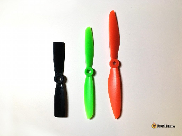

*Різні розміри пропелера*

Розмір пропелера вказано в британських дюймах (1″ \= 2,54 см).

B специфікаціях пропелерів існує два типи форматів:

* L x P x B

* LLPP x B

L — довжина, P — крок, B — кількість лопатей:

Наприклад, пропелери розміром 6 × 4,5 × 2 (також відомі як 6045 × 2\) мають 2 лопаті завдовжки 6 дюймів і крок 4,5 дюйма. Іншим прикладом є 5x4x3 (також відомий як 5040x3), 3-лопатевий 5-дюймовий пропелер із кроком 4 дюйми.

Іноді в кінці чисел можна побачити «BN», що означає «[Bullnose](https://docs.google.com/spreadsheets/d/19LVBAK-7Hr11sl06hOlt_Ib6RLhJ8HAjS0fPe6Encqc/edit#gid=0&range=A314)» *\[прим. пер.: закруглений зовнішній кут — вигляд профілю пропеллера. Також інколи можна зустріти маркування «HBN» — англ. «[hybrid bullnose](https://intofpv.com/t-propeller-tip-normal-bullnose-hybrid-bull-nose)», укр. «[гібридний бичачий ніс](https://docs.google.com/spreadsheets/d/19LVBAK-7Hr11sl06hOlt_Ib6RLhJ8HAjS0fPe6Encqc/edit#gid=0&range=A315)», цей вид пропелерів є комбінацією профілів типу «normal» (загострене лезо) та «bullnose». Це вид профілів — «поміж крапельками» (с) Леонід Макарович, і тягу дає хорошу, і енергії жере менше ніж BN\].*

Ви також можете побачити «R» або «C» після цифр розміру, наприклад 5x3R. «R» вказує на обертання пропелера, що означає «реверс». Його встановлюють на моторі, що обертається за годинниковою стрілкою. «C» — навпаки,  встановлюють на моторі, що обертається проти годинникової стрілки, але зазвичай літеру «C» пропускають.

Кажуть, що пропелер стає «важчим», коли ви збільшуєте діаметр, крок, кількість лопатей або все перераховане. Для обертання важчого пропелерy, потрібний більший крутний момент, ніж для обертання легшого пропелeрy.

## **Довжина пропелера** {#довжина-пропелера}

«Довжина пропелера» — це розмір кола, що він створює під час обертання (або відстань від одного кінця 2-лопатевого пропелера до іншого).

Пропелери створюють тягу за рахунок обертання та переміщення повітря. Чим швидше обертається пропелер, тим більше повітря він може рухати, що створює більшу тягу.

Коли [крок](https://docs.google.com/document/d/1D2gkc7UM2W4F0FpNuLcT_mJER4mxnCHVSa87Fot0PnY/edit#heading=h.wkzzkg2dbyo6) пропелерa (дивись нижче) і кількість лопатей однакові, довший пропелер може створювати більшу тягу, бо він збільшує площу робочої поверхні. Це означає, що ви можете прискорюватися швидше, але це також вимагає більшої потужності від того самого мотору. Менш із тим, довші пропелери не обов’язково означають швидший політ — крок є більш важливим фактором (як пояснюється нижче). Коротші пропелери можуть обертатися та сповільнюватися швидше завдяки меншому опору та імпульсу, що робить дрон більш спритним і чутливим.

## **Крок пропелера** {#крок-пропелера}

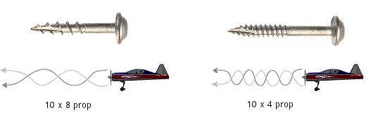

Крок пропелера означає відстань, яку пропелер проходить за один оберт, і вимірюється у дюймах. По суті, це характеристика того, наскільки далеко просунувся б пропелер, якби він рухався крізь тверде середовище, а не повітря.

**Пропелери з низьким кроком:** 

* Легше обертаються в повітрі, що дозволяє швидше змінювати оберти за хвилину.

* Забезпечують більш чутливе управління та генерують менше вібрації від пропвошу. [bit.ly/reduce-propwash](http://bit.ly/reduce-propwash)

* Вимагають менше крутного моменту мотора та споживають менше струму.

* Переміщують менше повітря, що призводить до нижчої тяги та максимальної швидкості.

**Пропелери з високим кроком** :

* Переміщують більше повітря за один оберт, створюючи більшу тягу та дозволяючи вищі максимальні швидкості.

* Вимагають більшого крутного моменту для зміни обертів/хв, що може знизити швидкодію, якщо мотор важко забезпечує достатню потужність.

* Зазвичай менш ефективні, ніж пропелери з нижчим кутом нахилу

Пропелер із більшим кроком переміщує більше повітря з кожним обертом, що може створити більшу тягу, коли літак рухається на великих швидкостях. Однак це також означає, що пропелер створює меншу тягу, коли літак не рухається.

Пропелер з більшим кроком також може створювати турбулентність і завихрення при різких стрибках потужності, що може вплинути на характеристики літального апарату. Він також обертається повільніше, через що літальний апарат може бути менш чутливим. З іншого боку, пропелер з меншим кроком має більшу чутливість і може обертатися вгору та вниз швидше, що покращує його маневреність.

## 

## **Кількість лопатей** {#кількість-лопатей}

Третє число (наприклад, **3** у *5x4x3*) вказує на кількість лопатей на пропелері. 

**Поширені варіанти:**

* **Дволопатеві пропелери:** відомі своєю ефективністю та низьким опором, ідеальні для дальнього польоту через зменшене споживання струму та кращий час польоту.

* **Трилопатеві пропелери:** пропонують баланс тяги, маневреності та ефективності, найпопулярніший вибір для FPV дронів, забезпечуючи відмінну щільність та стабільну роботу.

* **Чотирилопатеві пропелери** (або більше): генерують більше тяги та стабільності, але менш ефективні, часто використовуються в малих cinewhoops для підняття важчих вантажів, зберігаючи компактний форм-фактор.

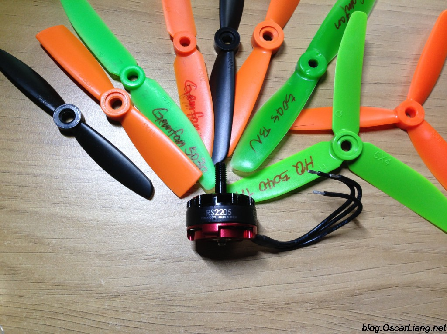

## **Додавання лопатей** {#додавання-лопатей}

Додавання лопатей збільшує площу поверхні і, отже, створює більшу тягу. Подібно до того як зробити пропелер довшим, але водночас не збільшувати площу кола. Збільшення кількості лопатей краще захоплює повітря, але це також робить його менш ефективним і створює більше навантаження на мотор.

**Поширене використання**

Серед пілотів FPV-дронів 2-лопатеві та 3-лопатеві пропелери популярні для перегонів і польотів у фрістайлі. Більшість пілотів віддають перевагу 3-лопатевим пропелерам, бо вони забезпечують чудовий баланс між ефективністю та потужністю, краще захоплюють повітря завдяки додатковій площі поверхні порівняно з 2-лопатевими. Але з іншого боку, 2-лопатеві є ефективнішими, бо вони створюють менше «[драгу](https://docs.google.com/spreadsheets/d/19LVBAK-7Hr11sl06hOlt_Ib6RLhJ8HAjS0fPe6Encqc/edit#gid=0&range=A310)» *\[прим. пер.: англ. drag —* коливання лопаті відносно вертикального шарніра\] і споживають менше струму, тому чудово підходять для польотів на великі відстані.

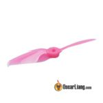 [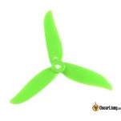](https://oscarliang.com/wp-content/uploads/2017/08/Gemfan-Flash-5152-two-blade-propeller-mini-quad-racing-drone.jpg)

Існують пропелери з більшою кількістю лопатей, наприклад 4-лопаті та 6-лопаті. 4-лопатеві пропелери чудово підходять для використання в приміщеннях і для поворотів, але вони менш ефективні, ніж 3-лопатеві, і мають нижчі показники RPM *\[об/хв\]* за ті самі характеристики. 6-лопатевими пропелери не рекомендуються для звичайного польоту через їх низьку ефективність, але вони можуть бути використані для шоу через їх унікальний зовнішній вигляд. Пропелери з більше як трьома лопатями частіше зустрічаються в мікро-квадрокоптерах, де мало місця і складно просто застосувать довший пропелер, аби збільшить площу поверхні.

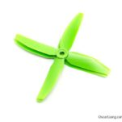 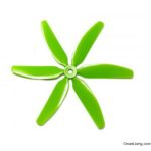 

## **Bага** {#bага}

У пропелерах вага є важливим фактором, який слід враховувати. Загалом, легші пропелери, як правило, працюють краще. Важчі пропелери мають більшу масу на кожній лопаті, і для обертання потрібний потужніший мотор. Це може призвести до збільшення крутного моменту, що змусить двигун працювати інтенсивніше та, можливо, знизить загальну продуктивність.

Легші пропелери мають менший момент інерції та можуть швидше змінювати RPM *\[об/хв\]*, завдяки чому дрон почувається чутливішим. Крім того, вони краще працюють із широким діапазоном двигунів, оскільки їм потрібен менший крутний момент для обертання.

Розподіл ваги лез також має значення. Кращі пропелери з центром маси лопаті ближче до ступиці. Однак це означає, що кінчик пропелерa буде тоншим і його легше зламати. Якщо центр маси знаходиться далі від ступиці, то буде більший драг*,\[аеродинамічний опір\]* і пропелер буде важче прискорюватись та сповільнюватись.

## **Напрямки обертання** {#напрямки-обертання}

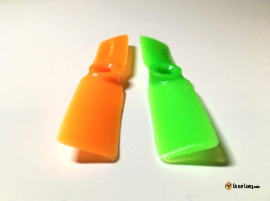

*Напрямок пропелера: за годинниковою стрілкою \[CW\], проти годинникової стрілки \[CCW\]*

Пропелери обертаються за годинниковою стрілкою (CW) або проти годинникової стрілки (CCW). У квадрокоптері два двигуни обертаються за годинником, а інші два – проти годинника, тому важливо підібрати гвинти до пропелерів відповідно до їхнього напрямку обертання.

*Цікавий факт: Чому два CW та два CCW?*  
*Ви, можливо, цікавитеся, чому дрони FPV використовують комбінацію пропелерів, що обертаються за годинниковою стрілкою, та проти неї.*  
*Два пропелери створюють крутний момент CW, тоді як інші два створюють крутний момент CCW, ефективно нейтралізуючи обертові сили. Без цієї протидії, дрон обертався б неконтрольовано в протилежному напрямку до моторів \- подібно до гелікоптера з пошкодженим хвостовим ротором (сценарій, який ви, швидше за все, бачили в кіно).*  
*Крім того, цей протилежний крутний момент може бути використаний для створення обертового руху для квадрокоптера (тобто руху рискання).* 

Щоб визначити напрямок обертання пропелера, подивіться на його передню кромку (сторону, яка ріже повітря) та задню кромку. Форма та кривизна пропелера вказують на призначений напрямок обертання. Деякі пропелери також позначені як CW або CCW біля втулки для легкої ідентифікації.

Якщо ви встановите пропелер у неправильному напрямку, він буде штовхати повітря в протилежну сторону, що призведе до перекидання дрона або неможливості його підняття в повітря.

У FPV-дронax невідцентроване розташування пропелерів створює як тягу, так і обертання навколо центру дрона. Щоб протидіяти цьому обертанню, необхідно використовувати два пропелери CW і два CCW.

В магазинах вони зазвичай продаються парами — CW і CCW.

Щоб створити тягу донизу для зльоту дрона, пропелери повинні обертатися таким чином, щоб передня кромка спочатку прорізала повітря, а потім повітря виходило через задню кромку. Ви можете дізнатись про напрямок обертання пропелеру, визначивши його передню кромку, яка часто позначається як CW *\[за годинником\]* або CCW *\[проти годинника\]* прямо на лопаті.

## **Типи кріплення пропелера** {#типи-кріплення-пропелера}

Існує три типи кріплення пропелера в двигунах дронів FPV: різьбовий вал M5, Т-подібне кріплення та [запресовка](https://docs.google.com/spreadsheets/d/19LVBAK-7Hr11sl06hOlt_Ib6RLhJ8HAjS0fPe6Encqc/edit#gid=0&range=A309) *\[кріплення з натягом\].*

Різьбовий вал M5 (5 мм) є найпоширенішим у 5-дюймових FPV-дронах (і більших установках). Пропелер кріпиться до валу за допомогою різьби M5 на кінці та закручується для щільності [самоконтрящою](https://docs.google.com/spreadsheets/d/19LVBAK-7Hr11sl06hOlt_Ib6RLhJ8HAjS0fPe6Encqc/edit#gid=0&range=A308) гайкою (також відомою як «нейлонова гайка»). На корпусi двигуна мотора часто є шипи, які вчеплюються в пропелер і утримують його на місці.

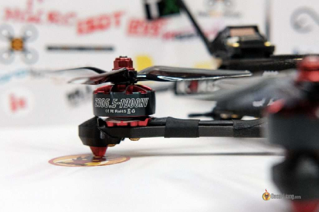

У Т-подібному кріпленні пропелер чіпляється до валу двигуна товщиною 1 мм або 1,5 мм і закріплюється двома гвинтами M2 у верхній частині корпусy двигуна. Таке кріплення популярне в менш потужних FPV-дронах 2″, 3″ та 4″.

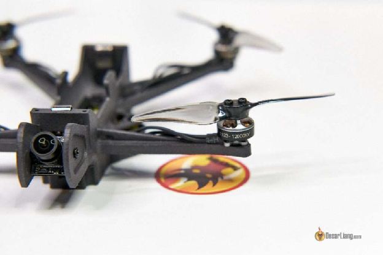

[запресовка](https://docs.google.com/spreadsheets/d/19LVBAK-7Hr11sl06hOlt_Ib6RLhJ8HAjS0fPe6Encqc/edit#gid=0&range=A309) або кріплення з натягом поширені у невеликих дронах FPV, таких як малі вупи і «[зубочистки»](https://oscarliang.com/ultralight-micro-quad-toothpick/) оскільки це кріплення має надзвичайно малу вагу. Ці безпілотники відносно малопотужні, тому пропелер навряд чи відлетить у разі аварії.

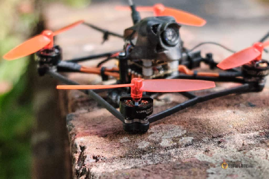

## **Матеріал** {#матеріал}

Пропелери для FPV зазвичай виготовляються з міцного пластику, зокрема полікарбонату. Цей матеріал легкий, гнучкий та стійкий, що дозволяє пропелерам вигинатися або деформуватися при падіннях, не ламаючись. Це ідеальний вибір для вимог FPV дронів.  
Існують також пропелери, виготовлені з вуглецевого волокна або дерева, які пропонують збільшену жорсткість та точність. Однак, їх зазвичай використовують у літаках або більших багатороторних дронах, які не призначені для падінь, оскільки вони більш дорогі і схильні до пошкоджень.  
Користуйтеся пластиковими пропелерами \- вони доступні, легко замінюються та добре підходять для більшості стилів польоту.

## **Як встановлювати пропелери?** {#як-встановлювати-пропелери?}

### 1\. Перевірте орієнтацію мотора {#1.-перевірте-орієнтацію-мотора}

* За замовчуванням, Betaflight очікує, що мотори будуть обертатися в певних напрямках, як показано на діаграмі нижче (цю діаграму також можна знайти на вкладці Мотори в конфігураторі Betaflight).

  * Встановіть пропелери, що обертаються за годинниковою стрілкою (CW), на передній лівий та задній правий мотори.

  * Встановіть пропелери, що обертаються проти годинникової стрілки (CCW), на передній правий та задній лівий мотори.

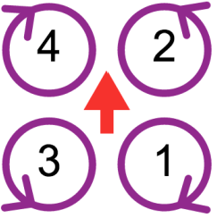

*Фахова порада: щоб легше було запам’ятати, просто зверніть увагу, що всі передні пропелери обертаються в напрямку до камери FPV, а задні пропелери обертаються в напрямку до задньої частини квадрокоптера.*

###  2\. Визначте верхню та нижню частину пропелера {#2.-визначте-верхню-та-нижню-частину-пропелера}

*  **Верхня частина** пропелера зазвичай глянцева або блискуча, і біля втулки може бути витиснений текст, наприклад, модель або розмірні номери.

* **Нижня частина** зазвичай має матове покриття.

Переконайтеся, що глянцева сторона / сторона з текстом дивиться вгору при встановленні пропелерів. Якщо пропелери встановлені догори ногами, продуктивність дрона сильно знизиться, або він може перекинутися, коли ви спробуєте злетіти.

###  3\. Визначте відповідність пропелерів до моторів {#3.-визначте-відповідність-пропелерів-до-моторів}

Переконайтеся, що пропелери CW встановлені на моторах CW, а пропелери CCW встановлені на моторах CCW. Неправильне встановлення може спричинити перекидання дрона під час зльоту.

*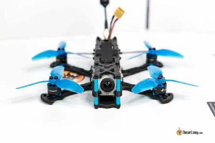*

### 4\. Закріпіть пропелери {#4.-закріпіть-пропелери}

Закріпіть пропелери надійно за допомогою наданих гвинтів, контрящіх гайок або інших кріплень. Незакріплені пропелери можуть відлетіти під час польоту, що призведе до аварії.

### 5\. Перевірте встановлення {#5.-перевірте-встановлення}

Покрутіть кожен пропелер рукою, щоб переконатися, що він встановлений в правильному положенні. Обертаючись, кожен пропелер повинен штовхати повітря вниз.

## **Розуміння концепцій обертання “всередину” i “назовні”**  {#розуміння-концепцій-обертання-“всередину”-i-“назовні”}

***\[“Prop-in” / “Prop-out”\]***

FPV дрони можуть бути налаштовані двома способами: обертання “всередину” i обертання “назовні”, залежно від напрямку обертання пропелерів. Типова конфігурація в Betaflight \- це обертання “всередину”, і якщо ви зміните напрямки всіх 4 пропелерів, то це буде обертання “назовні”.

Ця конфігурація впливає на повітряний потік та спосіб, яким бруд відкидається від дрона. Ви можете дізнатися більше про переваги та недоліки кожної конфігурації в моєму детальному посібнику:  
 [https://bit.ly/Prop-in-out](https://bit.ly/Prop-in-out)

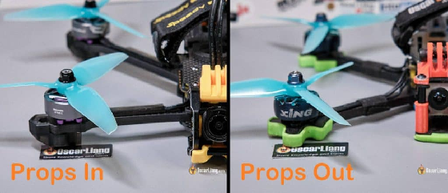

## **Конфігурація "Пушер"**  {#конфігурація-"пушер"}

Конфігурація "**пушер**" поширена в Cinewhoops, де мотори монтується догори дригом, а пропелери "штовхають" повітря вгору, замість того, щоб тягнути його вниз.  
Ця конфігурація не впливає на спосіб монтажу пропелерів. Ви користуєтеся тими ж правилами для підбору пропелерів CW і CCW з відповідними моторами за напрямком їх обертання.  
Дізнайтеся більше про переваги та недоліки конфігурації "пушер" тут:  
[https://oscarliang.com/pusher-configuration-explained/](https://oscarliang.com/pusher-configuration-explained/)

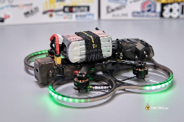

## **Які пропелери використовувати на FPV-дроні** {#які-пропелери-використовувати-на-fpv-дроні}

[Ось таблиця, яка показує, який розмір пропелера використовувати з різними моторами та напругою.](https://oscarliang.com/table-prop-motor-lipo-weight/)   
*\[перекладено українською [https://bit.ly/LiangFPVLookupTable](https://bit.ly/LiangFPVLookupTable)\]*

Важливо спочатку вибрати розмір пропелера, бo він визначає можливий розмір рами. Вибір розміру пропелера також залежить від типу польоту, який ви хочете виконувати.

5-дюймовий пропелер є найпопулярнішим, оскільки він універсальний і його можна використовувати для перегонів, фрістайлу та навіть для перенесення повнорозмірної камери GoPro. 7-дюймовий пропелер краще підходить для дальніх польотів, бо може носити набагато більшу батарею. [Ви можете дізнатися про різні розміри дронів у цій публікації](https://oscarliang.com/fpv-drone-guide/#The-Types-of-FPV-Drone), я не буду повторювати це тут.

[Ось мої рекомендації щодо 5-дюймових пропелерів.](https://oscarliang.com/best-motors-props/#The-Best-Props-for-FPV-Drone)

## **Тяга** {#тяга}

Тяга вимірюється у грамах. Щоб ваш дрон міг зависати, пропелер має виробляти принаймні 1 грам тяги на кожен грам ваги вашого дрона. Щоб виконувати трюки або навіть просто злітати чи летіти вперед, вашому дрону потрібно більше 1 грама тяги на грам ваги.

Пропелери створюють більшу тягу, коли вони обертаються швидше, і меншу, коли обертаються повільніше. Швидкість дрона також впливає на величину виробленої тяги. Деякі пропелери добре працюють, коли дрон зависає, але не дуже добре у польоті, а інші добре працюють на високих швидкостях, але погано під час зависання. Вам потрібен пропелер, який врівноважує ці фактори та може створити достатню тягу на різних швидкостях.

Щоб знайти найкращi пропелери для дрона, подивіться тестування тяги мотору і дізнайтесь, який розмір пропелерa найкраще підходить для вашого мотору. Майте на увазі, що пропелер працює зовсім по-різному, коли він прикручений до [підставки](https://docs.google.com/spreadsheets/d/19LVBAK-7Hr11sl06hOlt_Ib6RLhJ8HAjS0fPe6Encqc/edit#gid=0&range=A311) y статичному середовищі, ніж коли він летить у рухомому повітрі. В повітрі пропелери можуть створювати на 20-30% менше тяги, ніж на стенді.

Щоб точно оцінити характеристики пропелерa, треба випробувати його на швидкості, з якою зазвичай літає ваш дрон. Але мало хто має доступ до аеродинамічних труб для такого типу випробувань. Тому не чекайте від тестів великої точності, оскільки вони не можуть точно відображати використання в реальному світі.

## **Плавність** {#плавність}

У хобі люди часто використовують термін «плавність» для коли говорять про якість мотора або пропелера. Плавність не можна виміряти кількісно, ​​це як відчуття, яке мають пілоти. З мого досвіду, пропелери з нижчим кроком, як правило, плавніші, бо мотор може змінювати оберти легше і швидше. Це дозволяє дрону швидше реагувати на виправлення помилок і зменшує завихрення від пропелерів при різких стрибках потужності.

## **Швидкість** {#швидкість}

Пропелер, який створює велику тягу з великим кроком, не обов’язково робить дрон швидшим, ніж пропелер з меншим кроком, який створює меншу тягу. Зі збільшенням швидкості пропелера (яка вимірюється в обертах за хвилину – RPM) зростає і драг, що вимагає від двигуна більшого крутного моменту для обертання.

Теоретичну максимальну швидкість літака можна розрахувати за допомогою рівняння:

Максимальна швидкість (у дюймах на секунду) \= Макс. обертів на хвилину \* Крок гвинта / 60

У реальному житті такі фактори, як опір повітря, зустрічний вітер, [кут атаки](https://docs.google.com/spreadsheets/d/19LVBAK-7Hr11sl06hOlt_Ib6RLhJ8HAjS0fPe6Encqc/edit#gid=0&range=A307)  *\[прим. пер.: кут нахилу лопаті відносно горизонтальної площини\]* тощо, можуть впливати на швидкість дрона.

Тяга впливає на прискорення та кут атаки, тоді як оберти на хвилину впливають на максимальну швидкість. Щоб досягти найкращої швидкості для FPV-дрона, вам потрібен баланс між тягою та RPM *\[об/хв\]*.

## **Чи кращі великі пропелери?**  {#чи-кращі-великі-пропелери?}

**1\. Чутливість:** більший пропелер означає вищий момент інерції, що призводить до зниження чутливості. Це особливо помітно при використанні моторів, які зазвичай рухають 5-дюймові пропелери, наприклад розміру 2207\. На цих моторах 7-дюймовий або навіть 6-дюймовий пропелер буде менш спритним у реакції на швидкі, різкі вхідні сигнали управління, порівняно з 5-дюймовим пропелером. Вам знадобляться більші мотори для компенсації, але це додасть ваги і вимагатиме більш потужної батареї та електроніки.

**2\. Тяга та ефективність:** Більші пропелери створюють більшу тягу, що робить їх більш ефективними \- вони можуть переносити більшу вагу, навіть з тим самим мотором. Підвищена ефективність означає, що ви отримуєте більше тяги за ту ж потужність або ту ж тягу при меншій потребі в потужності.

**3\. Вібрація:** Зі збільшенням розміру пропелера, очікуйте більше вібрації. Це посилюється більшими, менш жорсткими рамами.

**4\. Максимальна швидкість та усунення пропвошу:** Більші пропелери, як правило, мають нижчу максимальну швидкість, але краще справляються з пропвошем. Однак, вони часто більш ефективні, здатні підтримувати вищі швидкості протягом довших періодів.

## **Кут атаки** {#кут-атаки}

**Кут атаки** – кут, під яким повітря зустрічає лопаті пропелера під час польоту, і це може значно вплинути на ефективність ваших пропелерів залежно від орієнтації та швидкості дрона.

Зависання на місці та політ з низькою швидкістю

Коли дрон знаходиться в режимі **зависання**, потік повітря переважно вертикальний, а лопаті пропелера покладаються на тангаж для створення тяги. У цьому сценарії, пропелер з **меншим кроком** зазвичай більш ефективний, оскільки він переміщує повітря плавно, не вимагаючи великого крутного моменту. Наприклад, якщо тангаж занадто високий (наприклад, близько до 90 градусів), пропелер в кінцевому рахунку "плескає" повітря, а не ефективно переміщує його, що призводить до втрати енергії та зниження тяги.

### **Прямий політ та високошвидкісне крейсування**  {#прямий-політ-та-високошвидкісне-крейсування}

Коли дрон нахиляється вперед для польоту, **кут атаки** змінюється, і повітря починає входити в лопаті пропелера під кутом, а не прямо знизу. На цьому етапі, **пропелери з більшим кроком** стають більш ефективними, оскільки вони краще підходять для переміщення повітря при прямому русі. Вони генерують більше тяги з кожним обертом, що робить їх ідеальними для дронів, які підтримують високі крейсерські швидкості або потребують швидкого прискорення. Якщо ваша мета \- подолати велику відстань, а не забезпечити довгий час польоту, спроба використати пропелери з більшим кроком може бути хорошою ідеєю.

### **Пошук оптимальних налаштувань** {#пошук-оптимальних-налаштувань}

Це лише узагальнення, абсолютно необхідно експериментувати з різними пропелерами, щоб знайти оптимальну конфігурацію для вашої конкретної збірки дрона та стилю польоту. 

## **Погода та Температура** {#погода-та-температура}

Холодна погода створює значні виклики для дронів. Як пояснено в нашому посібнику "Як літати FPV взимку" [bit.ly/LiangWinterFlyFPV](https://bit.ly/LiangWinterFlyFPV), вона не тільки негативно впливає на продуктивність батареї, але також може впливати на пропелери. Залежно від матеріалу, пропелери можуть стати жорсткими та крихкими при низьких температурах, що збільшує ймовірність їх розбиття при зіткненні.

**Вплив висоти**   
Висота може значно впливати на щільність повітря і, відповідно, на продуктивність вашого FPV-дрона. У зонах з низькою щільністю повітря, таких як великі висоти, ви відчуєте менше тяги від того самого обертання мотора. Це призводить до того, що дрон відчувається неповоротким та менш потужним, подібно до ефекту використання пропелерів з меншим кроком. Тому, коли літаєте на великих висотах, рекомендується використовувати пропелери з більшим кроком, щоб компенсувати зменшену щільність повітря.

## **Вплив на налаштування**  {#вплив-на-налаштування}

Зміна пропелерів може вплинути на налаштування PID та фільтрації вашого дрона. Пропелери різного дизайну, розміру, тангажу або кількості лопатей вплинуть на оберти/хв, лінійність тяги, вібрацію тощо.  
Скажімо, якщо ви просто замінюєте HQ 5×4.3×3 на Gemfan Hurricane 51466, ймовірно, він все ще буде літати, але якщо ви перфекціоніст, ви, напевно, захочете налаштувати свій квадрокоптер для конкретного типу пропелерів.  
Різниця стає ще більш помітною, коли ви використовуєте пропелери зовсім різного розміру або кількості лопатей. Наприклад, у дволопатевих пропелерів зазвичай сильніше 2-га гармоніка в діапазоні шуму мотора, тоді як у трьохлопатевих 3-тя гармоніка зазвичай сильніша за 2-гу. 

## **Розгляд шумових характеристик**  {#розгляд-шумових-характеристик}

Шум та звуковий профіль пропелерів часто не отримують належної уваги при виборі пропелерів для вашого FPV дрона, але це може значно вплинути на ваш досвід польоту \- особливо у міських зонах або в приміщенні (або якщо ми не хочемо, щоб наш дрон було чутно здалеку).

Фактори, що впливають на шум пропелера:

1. **Частота обертання (RPM)** (Як швидко вони обертаються): Вища RPM створює шум вищої частоти, який часто сприймається як гучне свистіння. Деякі cinewhoop можуть використовувати пропелери з більшою кількістю лопатей для зниження RPM, зберігаючи при цьому ту ж вихідну тягу, що може призвести до тиші дрона за рахунок ефективності.

2. **Дизайн пропелера:** Форма, кут нахилу і площа лопатей впливають на повітряний потік і шум. Ширші або товщі лопаті можуть створювати більш глибокий звук, тоді як тонші лопаті можуть бути більш високочастотними. Тороїдальні пропелери мають унікальну форму, яка виробляє м'якший, більш приємний звуковий профіль для людського вуха. Дізнайтеся більше про них тут: [https://oscarliang.com/toroidal-propellers/](https://oscarliang.com/toroidal-propellers/)

3. **Дизайн рами:** Cinewhoops, з їхніми кожухами для пропелерів, є особливо шумними через спосіб, яким повітря проштовхується через канали при високій RPM. Відкриті рами, як правило, виробляють відносно менше шуму.

## **Заключні думки** {#заключні-думки}

Пропелери \- один з найпростіших та найдешевших компонентів для експериментів з дроном FPV. Розуміючи основи розміру, кута нахилу, кількості лопатей та матеріалу, ви можете вибрати правильні пропелери, які відповідають вашому стилю польоту та налаштуванню дрона. Не бійтеся спробувати різні комбінації та подивіться, що найкраще підходить для вас.  
Веселих польотів\!

#### **Edit History** {#edit-history}

* 2017 – tutorial created.

* 2023 – article updated, URL shortened, updated product links.

* Jun 2024 – Added recommendations for more propeller sizes.

* Sep 2024 – updated products.

* Dec 2024 – updated guide.

[beginners](https://oscarliang.com/tag/beginners/)[mini quad](https://oscarliang.com/tag/mini-quad/)[propeller](https://oscarliang.com/tag/propeller/)[recommend](https://oscarliang.com/tag/recommend/)[tutorial](https://oscarliang.com/tag/tutorial/)

[image1]: 

[image2]: 

[image3]: 

[image4]: 

[image5]: 

[image6]: 

[image7]: 

[image8]: 

[image9]: 

[image10]: 

[image11]: 

[image12]: 

[image13]: 

[image14]: 

[image15]: 

[image16]: 

[image17]: 

[image18]: 

[image19]: 

[image20]: 

[image21]: 

[image22]: 

[image23]: 