Оригінал: [https://oscarliang.com/wires-connectors](https://oscarliang.com/wires-connectors)         
Стисле посилання на цей переклад: [https://bit.ly/LiangWiresConnectors](https://bit.ly/LiangWiresConnectors)  

| 🫂 | Нижче вичитаний людьми машнний український переклад оригіналу. Для [VictoryDrones](https://www.victory-drones.com/) переклад вичитали: Natasha M, Block(chain). Хочете покращити переклад чи знайшли помилку? — Лишіть коментар (Ctrl+Alt+M або «Меню» \> «Вставка» \> «Коментар»). Ми теж живі люди (як і ви) і робим помилки. Роботи їх, до речі, також роблять 😉  |
| :---: | :---- |

# Усе, що треба знати про електричні кабелі та роз’єми у FPV-дронах

# 12 березня 2023 року

# 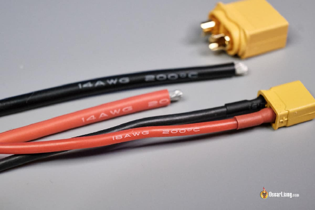

# У FPV-дронах електрична проводка та роз’єми відіграють вирішальну роль у забезпеченні ефективної та безпечної роботи дрона. У цій статті ми розглянемо все, що треба знати про електричні кабелі та з’єднувачі, включаючи різні типи та те, як розмір кабелю та з’єднувача впливає на продуктивність.

# *Деякі посилання на цій сторінці є партнерськими. Я отримую комісію (без додаткових витрат для вас), якщо ви робите покупку після натискання одного з цих партнерських посилань. Це допомагає підтримувати безкоштовний вміст для спільноти на цьому веб\-сайті. Будь ласка, прочитайте наш[Політика партнерських посилань](https://oscarliang.com/affiliate-program-policy/) для отримання додаткової інформації.*

# Зміст

[Який тип електричних кабелів треба використовувати для дрона FPV?](#який-тип-електричних-кабелів-треба-використовувати-для-fpv-дрона?)

[Електричний опір кабелів](#електричний-опір-кабелів)

[Kалібр кабелю](#kалібр-кабелю)

[Довідкова таблиця номінального струму](#довідкова-таблиця-номінального-струму)

[Де купити силіконові електричні кабелі](#де-купити-силіконові-електричні-кабелі)

[Чи відрізняються червоний і чорний кабелі?](#чи-відрізняються-червоний-і-чорний-кабелі?)

[12 AWG](#12-awg)

[14 AWG](#14-awg)

[16 AWG](#16-awg)

[20 AWG](#20-awg)

[26AWG-28AWG](#26awg-28awg)

[Вибір правильних роз’ємів для дрона FPV](#вибір-правильних-роз’ємів-для-fpv-дрона)

[Де купити роз’єми LiPo акумулятора](#де-купити-роз’єми-lipo-акумулятора)

[Роз'єми XT60](#роз'єми-xt60)

[Пігтейли XT60 14AWG](#пігтейли-xt60-14awg)

[Роз'єми XT30](#роз'єми-xt30)

[Пігтейли XT30 16AWG](#пігтейли-xt30-16awg)

[Поради щодо використання проводів і з’єднувачів](#поради-щодо-використання-проводів-і-з’єднувачів)

[Якого калібру кабелі потрібні для подовження проводів конденсатора?](#якого-калібру-кабелі-потрібні-для-подовження-проводів-конденсатора?)

[Техніка паяння](#техніка-паяння)

[Належне розміщення кабелів](#належне-розміщення-кабелів)

[Більше інформації та обговорення](#більше-інформації-та-обговорення)

[Історія редагування](#історія-редагування)

[Обрані коментарі читачів](#обрані-коментарі-читачів)

# 

## 

## **Який тип електричних кабелів треба використовувати для FPV-дрона?** {#який-тип-електричних-кабелів-треба-використовувати-для-fpv-дрона?}

# 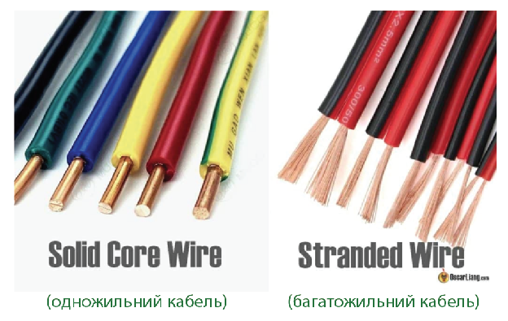

# Існує кілька типів кабелів. Найпоширеніший тип, який використовується в дронах FPV, – силіконовий багатожильний кабель. У порівнянні з одножильними кабелями, багатожильні кабелі є гнучкішими і з ними легше працювати.

# Порівняно з кабелями з ПВХ-ізоляцією кабелi із силіконовою ізоляцією є кращим варіантом для з’єднання пульта *\[RC, Remote Control\]* завдяки своїй гнучкості, особливо тому, що i рами i компоненти дронів стають все меншими за розмірами. Силіконові кабелi легші, можуть витримувати ширший діапазон температур та є міцнішими в екстремальних умовах. Крім того, вони менш схильні до плавлення або усадки під впливом тепла в процесі пайки.

## **Електричний опір кабелів** {#електричний-опір-кабелів}

# Одним з важливих факторів, які слід враховувати в процесі вибору кабелів для FPV-дрона, є опір. Довші або тонші кабелі матимуть більший опір, що може призвести до падіння напруги та втрати потужності (особливо це стосується акумулятора). Ось чому кабелі мають номінал струму.

# Щоб мінімізувати опір, якнайкоротші кабелі є найліпшими. Хоча i товщі кабелі можуть зменшити опір, але вони збільшують вагу дрона.

# Щоб забезпечити системi живлення необхідну потужність, переконайтеся, що розмір кабелю відповідає компонентам дрона. Неправильний розмір кабелю може привести до того що він стане перешкодою у вашій системі живлення і не дозволить вашому дрону працювати на найкращому рівні.

## **Kалібр кабелю** {#kалібр-кабелю}

# 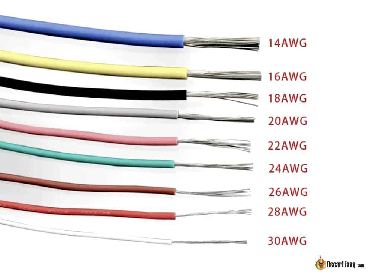

# Калiбр кабелю означає товщину електричного кабелю i вимірюється в AWG *\[[American Wire Gauge](https://uk.wikipedia.org/wiki/%D0%90%D0%BC%D0%B5%D1%80%D0%B8%D0%BA%D0%B0%D0%BD%D1%81%D1%8C%D0%BA%D0%B8%D0%B9_%D0%BA%D0%B0%D0%BB%D1%96%D0%B1%D1%80_%D0%BF%D1%80%D0%BE%D0%B2%D0%BE%D0%B4%D1%96%D0%B2) — американський калібр кабелю\].* Вибір правильного калібру важливий аби кабель витримував струм, необхідний компонентові, до якого він підключений.

# Загалом, чим вище число AWG, тим тонший кабель. Номінальний струм кабелю — це максимальна величина струму, яку він може безпечно витримати без перегріву або пошкодження.

# При створенні FPV-дрона важлива мінімізація ваги. Наприклад, ось кілька найбільш поширених калібрів кабелю для різних компонентів FPV-дрона із живленням від акумулятора [6S](https://www.getfpv.com/learn/new-to-fpv/all-about-multirotor-fpv-drone-battery/) на 5-дюймовій рамі *\[у бойових діях в Україні частіше викорстовують 7-дюймові рами\]:*

* # 14AWG для батареї та перехідника із гнучким виходом («пігтейл») XT60 

* # 18AWG-20AWG для ESC (електронний контроллер швидкості) і проводів живлення двигуна

* # 28AWG для інших малопотужних компонентів і сигналів.

# При з’єднанні двох кабелів максимальний струм, який може пройти через них, обмежується меншим кабелем. Тому, якщо ви додаєте до кабелю, найкраще використовувать той самий діаметр. Використання діаметру більшого за необхідний розмір не дає жодних переваг, але додає непотрібної ваги.

# Ось приблизна вага на метр кабелю для різних номерів AWG:

* # 24 AWG – 4,5 г

* # 20 AWG – 7,5 г

* # 18 AWG – 11g

* # 16 AWG – 20 г

* # 14 AWG – 27 г

* # 12 AWG – 39 г

* # 10 AWG – 61 г

## **Довідкова таблиця номінального струму** {#довідкова-таблиця-номінального-струму}

# Щоб визначити, який саме AWG кабель вам потрібен, спочатку розрахуйте максимальну силy струму дрона (амперність), а потім подивіться в довідкову таблицю номінального струму. Номінальний струм зазвичай є безперервним струмом, якщо не вказано щось інше.

# Різні виробники електричних проводів можуть мати різні стандарти та показники струму. Ось один приклад: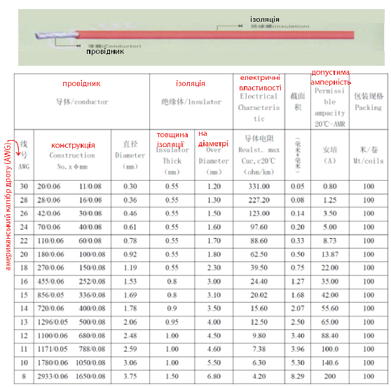

# Як загальнe правило, я особисто дотримуюся цієї таблиці на основі вимог до імпульсного струмy (наприклад, споживаний струм за пікового навантаження):

* # Кабель 10AWG: 250A

* # Кабель 12AWG: 160A

* # Кабель 14AWG: 110A

* # Кабель 16AWG: 80A

* # Кабель 18AWG: 50A

* # Кабель 20AWG: 30A

* # Кабель 22AWG: 24A

* # Кабель 24AWG: 20A

# Важливо використовувати кабель відповідного розміру, щоб мінімізувати падіння напруги та втрати потужності через опір, а також зменшити ризик перегріву. Однак у деяких випадках, щоб мінімізувати вагу, може бути прийнятним використання трохи тонших  кабелів, якщо довжина  кабелю невелика, а стрибки струму відбуваються лише протягом короткого періоду часу.

# У моїх конструкціях на акумуляторах [6S](https://www.getfpv.com/learn/new-to-fpv/all-about-multirotor-fpv-drone-battery/) із 5-дюймовою рамою, я зазвичай використовую кабелі 14 AWG для підключення батареї, навіть якщо максимальний споживаний струм трохи перевищує номінальний струм кабелю 14 AWG. Я не думаю, що це буде проблемою, тому що, по-перше, кабелі досить короткі; по-друге, стрибки струму зазвичай тривають лише пару секунд, навіть якщо ви залишите його на повній тязі довше, акумулятор  все одно не зможе за ним встигнути. Основна причина, чому я віддаю перевагу 14AWG над 12AWG, полягає в тому, що їх легше припаяти до ESC, і вони можуть зменшити пару грамів конструкції.

# Існує також номінальна напруга для електричних проводів, але зазвичай це не стосується пультів (RC), оскільки напруга, з якою ми маємо справу, значно нижче 30 В. Кабелі, які ми використовуємо, можуть витримувати набагато вищу напругу (наприклад, сотні вольт або навіть вище).

## **Де купити силіконові електричні кабелі** {#де-купити-силіконові-електричні-кабелі}

# 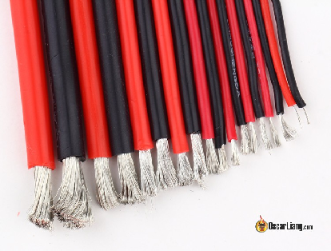

#### **Чи відрізняються червоний і чорний кабелі?** {#чи-відрізняються-червоний-і-чорний-кабелі?}

# Ні, червоний і чорний кабелі — це однакові кабелі, тільки різного кольору. Ви можете використовувати кабелі будь-якого кольору для свого дрона, але традиційно червоний використовується для позитивної потужності, а чорний – для заземлення. Дотримання цього правила полегшує маркування «де який кабель», і допомагає запобігти помилкам. Існують інші кольорові кабелi, які зазвичай призначені для сигналів, але ви самі можете вирішувати, який колір кабелів використовувати.

### **12 AWG** {#12-awg}

# Застосування: для пігтейлу XT60, високопотужних рам  на 5″, 6″ та 7″.

* # AliExpress:[https://s.click.aliexpress.com/e/\_DlSpVMh](https://s.click.aliexpress.com/e/_DlSpVMh)

* # Amazon:[https://amzn.to/3JcFN5H](https://amzn.to/3JcFN5H)

* # Banggood:[http://bit.ly/2ALByxa](http://bit.ly/2ALByxa)

* # GetFPV:[https://oscarliang.com/product-bt0a](https://oscarliang.com/product-bt0a)

* # RDQ:[https://oscarliang.com/product-wj65](https://oscarliang.com/product-wj65)

### **14 AWG** {#14-awg}

# Застосування: для пігтейлу XT60, «п’ятидюймовки» — дрони середньої потужності.

* # AliExpress:[https://s.click.aliexpress.com/e/\_DEWmXTR](https://s.click.aliexpress.com/e/_DEWmXTR)

* # Amazon:[https://amzn.to/3JvxFi1](https://amzn.to/3JvxFi1)

* # Banggood:[http://bit.ly/2ALByxa](http://bit.ly/2ALByxa)

* # GetFPV:[GetFPV](https://www.getfpv.com/silicone-wire-14awg-1mtr.html?cmid=eHZ3Y2tBWGYrQWM9&afid=M1RXSkVIZ2tWV1E9&ats=ZDltdFdRemJ3S2M9)

* # RDQ:[https://oscarliang.com/product-wj65](https://oscarliang.com/product-wj65)

### **16 AWG** {#16-awg}

# Застосування: для пігтейлів XT30 і XT60 та «довгобійні» конструкції дронів (пікове навантаження 80А).

* # AliExpress:[https://s.click.aliexpress.com/e/\_DFtzaZX](https://s.click.aliexpress.com/e/_DFtzaZX)

* # Amazon:[https://amzn.to/3Jfu0DE](https://amzn.to/3Jfu0DE)

* # Banggood:[http://bit.ly/2ALByxa](http://bit.ly/2ALByxa)

* # GetFPV:[https://oscarliang.com/product-z3it](https://oscarliang.com/product-z3it)

* # RDQ:[https://oscarliang.com/product-wj65](https://oscarliang.com/product-wj65)

### **20 AWG** {#20-awg}

# Застосування: для XT30 на конструкціях «вага менше 250 грамів» *\[«sub250» — регуляторна [вимога](https://fpvfc.org/sub-250g-regulations) США для [спрощеної процедури](https://fpvfc.org/laanc) отримання дозволу на польоти\]* подовження кабелю живлення двигунів для п’ятидюйових конструкцій. 18AWG також добре працює, якщо вас устраює невелика додаткова вага (особливо в липні).

* # AliExpress:[https://s.click.aliexpress.com/e/\_Dk5DjAZ](https://s.click.aliexpress.com/e/_Dk5DjAZ)

* # Amazon:[https://amzn.to/3UoSSOH](https://amzn.to/3UoSSOH)

* # Banggood:[http://bit.ly/2ALByxa](http://bit.ly/2ALByxa)

* # GetFPV:[https://oscarliang.com/product-jc8f](https://oscarliang.com/product-jc8f)

* # RDQ:[https://oscarliang.com/product-wj65](https://oscarliang.com/product-wj65)

### **26AWG-28AWG** {#26awg-28awg}

# Застосування: для сигналів, живлення вашої системи FPV, приймача тощо, в основному для всього, що не пов’язано з акумулятором чи двигуном.

* # AliExpress:[https://s.click.aliexpress.com/e/\_Deft3NF](https://s.click.aliexpress.com/e/_Deft3NF)

* # Amazon:[https://bit.ly/3LkxHuE](https://bit.ly/3LkxHuE)

* # Banggood:[http://bit.ly/2ALByxa](http://bit.ly/2ALByxa)

* # GetFPV:[https://oscarliang.com/product-qzda](https://oscarliang.com/product-qzda)

## **Вибір правильних роз’ємів для FPV-дрона** {#вибір-правильних-роз’ємів-для-fpv-дрона}

# 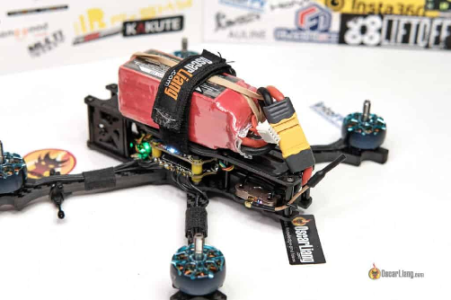

# Роз’єми є важливими для тимчасового кріплення двох компонентів, наприклад акумулятора та ESC. Ви також можете використовувати роз’єми, якщо вам не подобається пайка.

# Для передачі сигналу можете використовувати будь-який роз’єм, який хочете. Однак, коли справа доходить до живлення від акумулятора або будь-якого іншого істотного струму, дуже важливо вибрати правильний тип роз’єму, оскільки, як і дроти, роз’єми також мають обмеження по струму.

# Ось загальні вказівки щодо номінальних значень постійного та імпульсного струму деяких роз’ємів, які зазвичай використовуються:

* # Роз'єм JST: 5A (10A)

* # 2-міліметрові роз'єми: 20A (40A)

* # XT30: 30A (60A)

* # XT60: 60A (180A)

# Хоча є спокуса перестрахуватись та застосувать більшi роз’єми — це не завжди необхідно i може додати непотрібної ваги дрону. У деяких випадках це може навіть негативно вплинути на продуктивність дрона. Наприклад, коли йдеться про «Малі Вупи» ([Tiny Whoops](https://oscarliang.com/best-tiny-whoop/)), існує суперечка стосовно які роз’єми будуть кращі — [GNB27](https://oscarliang.com/micro-battery-connectors-testing/) чи роз’єми [BT2.0](https://oscarliang.com/micro-battery-connectors-testing/). Хоча роз’єми GNB27 мають нижчий опір, ніж PH2.0 і BT2.0, але вони також важчі, деякі стверджують, що BT2.0 є оптимальним вибором, оскільки він забезпечує хороший компроміс між вагою та опором.

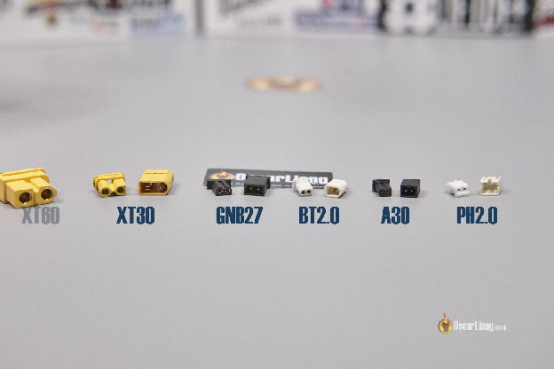

# Вибравши відповідний роз’єм відповідно до конкретних потреб дрона, можна бути впевненим, що дрон працює безпечно і ефективно.

## **Де купити роз’єми LiPo акумулятора** {#де-купити-роз’єми-lipo-акумулятора}

# 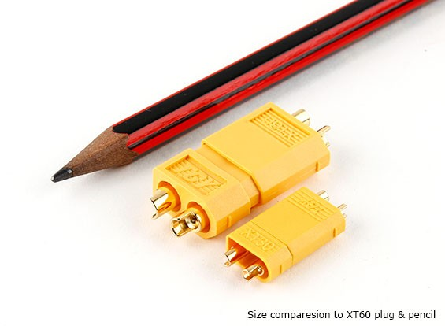

# Два з найпопулярніших роз’ємів акумулятора, які використовуються у  FPV-дронах — це роз’єми XT60 і XT30. Ці роз’єми мають однакову конструкцію, але різні розміри та розраховані на різні максимальні струми. Відповідно до офіційної таблиці даних, роз’єм XT60 розрахований на максимальний струм 60 ампер, тоді як роз’єм XT30 розрахований на максимальний струм 30 ампер. Ці рейтинги призначені для безпечної роботи роз’ємів за певних умов.

# Менше з тим, [останній тест](https://www.youtube.com/watch?v=bkVsqDOSqIY) показав, що роз’єм XT30 справді може підтримувати набагато більший безперервний струм до 60 ампер без будь-яких проблем, якщо підключені до нього кабелі достатньо великі. Це означає, що ви можете безпечно використовувати роз’єм XT30 для випадків, що потребують більшого струму, якщо ви дотримуєтеся відповідних заходів безпеки.

# З іншого боку, роз'єм XT60 також було [протестовано](https://www.youtube.com/watch?v=bkVsqDOSqIY), і з’ясувалось, що він може безпечно справлятися з імпульсами струму до 180 ампер протягом 10 секунд без будь-яких проблем. Це робить його надійним вибором для типових FPV-дронів без необхідності оновлення до більш важких і громіздких роз’ємів.

### **Роз'єми XT60** {#роз'єми-xt60}

* # RDQ:[https://oscarliang.com/product-xzn1](https://oscarliang.com/product-xzn1)

* # GetFPV:[https://oscarliang.com/product-hwx7](https://oscarliang.com/product-hwx7)

* # Amazon:[https://amzn.to/3l6oonc](https://amzn.to/3l6oonc)

* # Banggood:[http://bit.ly/2AuxHnC](http://bit.ly/2AuxHnC)

* # AliExpress:[https://s.click.aliexpress.com/e/\_Ddy57H7](https://s.click.aliexpress.com/e/_Ddy57H7)

### **Пігтейли XT60 14AWG** {#пігтейли-xt60-14awg}

# Постачається із вже припаяними дротами.

* # AliExpress:[https://s.click.aliexpress.com/e/\_DdHrwIp](https://s.click.aliexpress.com/e/_DdHrwIp)

* # Amazon:[https://amzn.to/403AkVQ](https://amzn.to/403AkVQ)

* # Banggood:[https://oscarliang.com/product-06wq](https://oscarliang.com/product-06wq)

* # GetFPV (12awg):[https://oscarliang.com/product-4bun](https://oscarliang.com/product-4bun)

* # GetFPV (16awg):[https://oscarliang.com/product-a8nh](https://oscarliang.com/product-a8nh)

* # RDQ:[https://oscarliang.com/product-l0p0](https://oscarliang.com/product-l0p0)

### **Роз'єми XT30** {#роз'єми-xt30}

* # RDQ:[https://oscarliang.com/product-6gvi](https://oscarliang.com/product-6gvi)

* # GetFPV:[https://oscarliang.com/product-0ipn](https://oscarliang.com/product-0ipn)

* # Amazon:[Amazonhttps://amzn.to/3l8PdY0](https://amzn.to/3l8PdY0)

* # Banggood:[http://bit.ly/2zTIRD6](http://bit.ly/2zTIRD6)

* # AliExpress:[https://s.click.aliexpress.com/e/\_DkJfemp](https://s.click.aliexpress.com/e/_DkJfemp)

### **Пігтейли XT30 16AWG** {#пігтейли-xt30-16awg}

# Постачається із вже припаяними дротами.

* # AliExpress:[https://s.click.aliexpress.com/e/\_DkQ06hP](https://s.click.aliexpress.com/e/_DkQ06hP)

* # GetFPV:[https://oscarliang.com/product-d6t7](https://oscarliang.com/product-d6t7)

* # Amazon:[Amazonhttps://amzn.to/3yvHtSU](https://amzn.to/3yvHtSU)

* # RDQ:[https://oscarliang.com/product-aq6b](https://oscarliang.com/product-aq6b)

## **Поради щодо використання проводів і з’єднувачів** {#поради-щодо-використання-проводів-і-з’єднувачів}

### **Якого калібру кабелі потрібні для подовження проводів конденсатора?** {#якого-калібру-кабелі-потрібні-для-подовження-проводів-конденсатора?}

# 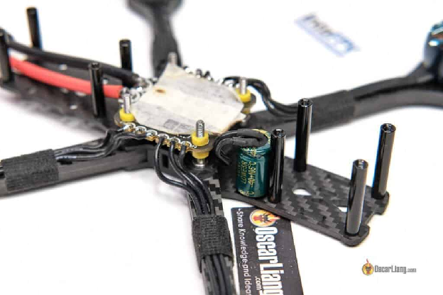

# Коли ви подовжуєте з’єднання до конденсатора у FPV-дроні, то калібр рекомендованого кабелю залежатиме від розміру конденсатора і величини струму, який він буде обробляти. Але загалом довжина дротів важливіша за їх діаметр.

# Для менших конденсаторів (менше 1000 мкФ) можна використовувати тонші кабелі, такі як 18AWG або 20AWG (наприклад, кабелі до двигуна). Для більших конденсаторів (понад 1000 мкФ) найкраще використовувати більш товсті кабелі, такі як 16AWG. Важливо, щоб кабель був якомога коротшим — аби мінімізувати опір. [Ви можете дізнатися більше про те, навіщо і як додати конденсатор у свій дрон, у цій статті](https://oscarliang.com/capacitors-mini-quad/).

### **Техніка паяння** {#техніка-паяння}

# 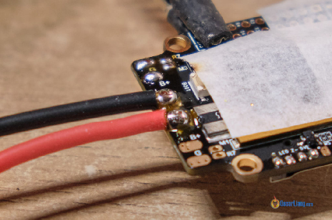

# Правильні методи паяння важливі для створення міцних і надійних електричних з’єднань у вашому дроні. Технології спаювання проводів і з’єднувачів включають лудіння, зрощування та використання термозбіжної трубки для захисту з’єднання. Важливо уникати поширених помилок при паянні, таких як перегрів дроту, утворення холодних швів або використання занадто великої кількості припою.

# [Ви можете дізнатися про те, як паяти кабелі та роз’єми, у цьому підручнику](https://oscarliang.com/soldering-guide/).

### **Належне розміщення кабелів** {#належне-розміщення-кабелів}

# 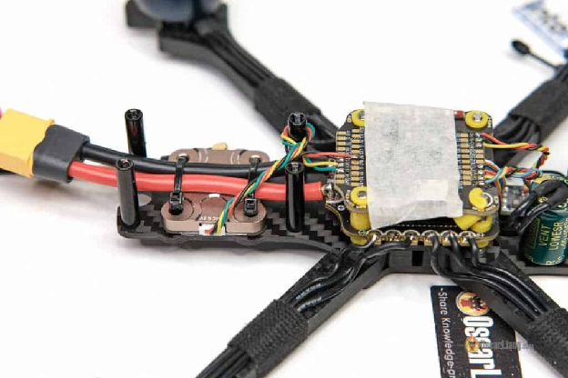

# Прокладаючи кабелі у дроні, важливо, щоб вони були як найкоротшими, щоб зменшити ризик перешкод і перепадів напруги. Якщо кабелі надто довгі, ви можете їх скрутити, щоб вони були акуратними та компактними, що також запобігає перешкодам.

# Приєднуючі кабелі до компонентів, перевірте, щоб вони були надійно закріплені, щоб не роз’єднались у процесі польоту. Погано закріплені кабелі можуть значно пошкодити дрон y польотi, що може потенційно призвести до аварії.

# Важливо також уникати розміщення кабелів на верхній частині польотного контроллера (FC). Oкрім потенційного спричинення перешкод, вони також можуть потрапити на гіроскоп, що вплине на льотні харакеристики дрона. Натомість спробуйте прокласти кабелі під або навколо польотного контроллера.

# Нарешті, щоб запобігти пошкодженню паяних з’єднань проводів акумулятора у разі аварій, рекомендується закріпити кабель акумулятора на рамі за допомогою стяжок *\[англ.: zip ties\].* Це запобігає надмірному навантаженню i розтягуванню паяних з’єднань під час аварії.

### **Більше інформації та обговорення** {#більше-інформації-та-обговорення}

# Ми маємо [схожі теми на форумі](http://intofpv.com/t-what-awg-wires-to-use) якщо ви хочете дізнатися більше про цю тему та залишити коментар.

#### **Історія редагування** {#історія-редагування}

* # Травень 2014 — статтю створено.

* # Квітень 2017 — статтю переглянуто.

* # Листопад 2017 — додано параметри покупки продуктів.

* # Березень 2023 — оновлено посібник, додано розділ «Поради», оновлено посилання на продукти, змінено URL-адресу сторінки.

# Обрані коментарі читачів {#обрані-коментарі-читачів}

**1\.** Привіт Оскаре. Я завершив збірку 5-дюймового квадро. Все працює як треба, але я на ньому ще не літав.

Моє запитання стосується зв’язки проводів, яка з’єднує ESC 4-в-1 із польотним контролером. Чи зможуть ці тонкі дроти забезпечити достатню кількість струму без спалювання чи падіння напруги?

Контролер польоту отримує напругу акумулятора 6S через проводи закріплені жгутом. Чи потрібно збільшити розмір дротів Vbat і заземлення, від’єднавши їх від зв’зяки і припаявши перемички 22 AWG або 26 AWG між контактними панелями основної батареї ESC і контактними панелями Vbat для польотного контроллера? Чи можу я додати більше компонентів, таких як GPS, до польотного контроллера у моїй поточній схемі коптера?

Я використовував Lumenier LUX F7 Ultimate Flight Controller, який забезпечує живленням усе, що перераховано нижче:  
Дві камери micro eagle FPV через 5 В  
TBS Unify EVO VTx через перемикальну панель Vbat  
TBS Crossfire Diversity Nano RX через панель 4V5  
5В зумер

**ВІДПОВІДЬ**  
ОСКАР  
15 липня 2019 р. — 17:04 год  
Ваш політний понтроллер не споживає багато струму, зазначена вами зв’язка підійде. Так, ви можете додати GPS.  
\_\_\_\_\_\_\_\_\_  
**2\. ПІНАК ОЗА**  
23 листопада 2017 року \- 17:51

Мій квадро [DH410](https://www.youtube.com/watch?v=PPEGUh3cumQ) поводиться дивно, тому мені потрібна ваша порада. Коли я вперше створив його, він мав близько 1400 г (без підвісу та камери), включаючи LiPO-батку 4S на 4000 мАг. Раніше він давав близько 11 хвилин зависання. Але потім я, щоб знизити вагу, зробив багато змін у проводці та роз’ємах, зокрема, і успішно зменшив його вагу на 100-120 грамів. В основному я видалив усі штепсельні роз’єми *\[bullet connectors\]* із кожного двигуна, а також зменшив діаметр дроту всіх 4 двигунів Sunnysky X2212 980 кВ з 18 до 22\.

Тепер Pixhawk подає сигнал про низький рівень заряду батареї після лише 30 секунд польоту, і дрон переходить в режим «RTL». АЛЕ із акумулятором 2200mAh 3S він все одно літає 9 хвилин (у цьому варіанті загальна вага складає 950 грам). А із 4000mAh 4S виходить лише 30 секунд\! У мене 2 батареї – 4S 4000mAh, і з обома вона поводиться однаково. Тож чи може це бути калібр проводів двигуна, через який дрон переходить у RTL? Телеметрія показує, що напруга буквально падає з 16,4 В до 13,8 В за кілька секунд. Порадьте, будь ласка. Дякую.

**ВІДПОВІДЬ**  
**ОСКАР**  
28 листопада 2017 р. \- 14:23  
Я думаю, що проблема, яку ви описали, спричинена чимось іншим, але спробуйте поміняти кабелі, вам не варто було міняти оригінальні кабелі, якщо їх не потрібно оновити до більшого калібру. Крім того, 4S буде споживати більше струму, ніж 3S, тому вам справді не слід використовувати менші дроти AWG.

**ВІДПОВІДЬ**  
**ПІНАК ОЗА**  
21 серпня 2018 р. \- 23:06 год  
Дякую Оскар. Вибачте за надто пізню відповідь. Проблема вирішилася давно, майже за 1-2 дні. Насправді це були світлодіодні дроти, які створювали проблему. Тепер квадро дає мені хороший час польоту з проводами 22 калібру.  
\_\_\_\_\_\_\_\_\_\_  
**3\.**  
Привіт Оскар,  
Які дроти AWG ви б порадили для наступного:

\[1\] від \[Контролер польоту\] \>\>\> \[KISS ESC 2-5S 24A Race Edition\]?  
\[2\] з \[Battery 3S/4S\] на \[PDB\]?

Дякую  
Дейв

ВІДПОВІДЬ  
ОСКАР  
21 грудня 2016 року \- 6:33 ранку  
Тут :) [http://intofpv.com/t-what-awg-wires-to-use](http://intofpv.com/t-what-awg-wires-to-use)  
\_\_\_\_\_\_\_\_\_\_\_\_\_  
**4\.**  
Привіт Оскар,

У мене є ці ESC  
(banggood.com/de/DYS-BL20A-Mini-20A-BLHeli-ESC-OPTO-2-4s-for-RC-Multicopter-p-975798.html)  
і я хочу дізнатися переріз кабелю живлення (червоний і чорний).  
Ви знаєте товщину цих кабелів?\!

Наперед дякую за допомогу\!\!\!\!

Маркус

**ВІДПОВІДЬ**  
**ОСКАР**  
13 жовтня 2016 року \- 15:44  
це кабелі 20AWG, ви можете подивитися товщину зараз :)  
\_\_\_\_\_\_\_\_\_\_\_\_\_  
**5\.**  
**МАТІЙС ГРУТУІС**  
13 вересня 2016 р. \- 11:32 год  
У мене 20A littlebee та 2300KV E-Max. Чи варто тоді орієнтуватися на теоретичні значення:

4 X 30 A (Littlebee’s Burst), що становить приблизно 120 AMPS, потребує 12 AWG?

Все ще потрібно купити батареї, але не можу знайти їх розмір AWG (шукаю на HobbyKing)

**ВІДПОВІДЬ**  
**ОСКАР**  
14 вересня 2016 року \- 14:30 год  
Ні, просто підберіть розмір кабелю до акумуляторів, які ви використовуєте, і все буде добре. Для більшості 4S 65C на 1800 мАг, наприклад, вони зазвичай використовують 14Awg.

**ВІДПОВІДЬ**  
**БРУНО**  
20 березня 2017 р. \- 03:08 год  
Оскар, я помітив, що багато акумуляторів 4S тепер постачаються з проводом 12 AWG (Lumenier 1300mAh 4s 75c LiPo Battery (XT60), PULSE Graphene 1550mAh 4S 14.8V 95C Battery with XT60, Thunder Power Adrenaline Series 1300mah 4s 80c, Tattu тощо ) Мені все ще використовувати 14 AWG, як зазвичай, чи оновити свій акумулятор?

**ВІДПОВІДЬ**  
**ОСКАР**  
24 березня 2017 р. \- 00:42 год  
Якщо ви не проти кількох зайвих грамів, я думаю, що безпечніше використовувати 12 AWG :) Але я також не думаю, що 14 AWG викличе будь-які проблеми.  
\_\_\_\_\_\_\_\_\_\_\_  
**6\.**  
**ЕРІК КРУЗ**  
16 червня 2016 року \- 05:15  
хотів запитати, я планую перевести свій існуючий квадро на раму 500, і мені потрібно буде подовжити існуючі дроти від мого двигуна 2212 кВ до мого регуля (ESC) на 20A. Мені було важко знайти дроти 20AWG, і я знайшов лише дроти 18AWG. Чи виникнуть якісь конкретні проблеми, з якими я можу зіткнутися, якщо підключити їх, щоб подовжити наявні дроти?

З нетерпінням чекаю на вашу думку\!

**ВІДПОВІДЬ**  
**ОСКАР**  
19 червня 2016 року \- 22:31  
Якщо не зважать на вагу, абсолютно нормально використовувати товщі дроти.. або комбінувати різні дроти  AWG, не має бути жодних проблем.  
\_\_\_\_\_\_\_  
**7\.**  
**ДЖО**  
**17 березня 2015 р. \- 4:53 ранку**

Мій октокоптер X8 не піднімається, коли я додаю до нього більше корисного вантажу. Наразі AUW становить 15 фунтів (без підвісу, камер чи аксесуарів FPV). Коли я під’єдную одну батарею, він нормально зависає, але літатиме лише кілька хвилин, але коли я додаю дві батареї паралельно, то через додаткову вагу він злітає протягом двох секунд і важко приземляється, коли починає хитатися вправо.

Моя розподільна плата мала роз’єми 3,5 мм, але замінила їх на роз’єми Castle Creation 5,5 мм. Через це я також замінив кульові роз’єми з торцевої сторони ESC на 4 мм. Я також оновив кабель до 10AWG, але навіть після того, як я зробив усе це, у мене все ще та сама проблема. Зараз єдині роз’єми, які я ще не замінив, – це кульові свічки двигунів, а також роз’єми на регуляторах швидкості з боку двигуна, діаметр яких становить 3,5 мм.

Пропелери, які я використовую, еквівалентні Т-мотору 15×5,5.  
Рама: Gryphon Dynamics GD-X8  
Двигуни: KDE FX4014 380kv  
ESC: KDE 35A  
Акумулятор: “MonsterRC” 35C 6s 10000mAh  
FC: NAZA V2 (з вимкненою сигналізацією низької напруги)  
AUW: орієнтовно 14-15 фунтів без підвісу, камери чи інших компонентів.

Будь-яка порада буде дуже вдячна\!

**ВІДПОВІДЬ**  
**ОСКАР**  
20 березня 2015 р. \- 14:51  
вибачте, я не маю великого досвіду роботи з мультиротором такого розміру.  
але судячи з цього, це проблема живлення? чи не могли б ви завантажити відео в цю групу? [facebook.com/groups/Copter.Fans](http://facebook.com/groups/Copter.Fans) 

**ВІДПОВІДЬ**  
**ОЛЕКСАНДР ДЖЕЙМС КЕРТІС**  
27 листопада 2015 року \- 15:53  
Я відповім. Це надто важка батарея для енергії, яку виробляють ці двигуни. 20 000 6s це ж безглудя\! Спробуйте щонайбільше 5000 6s

\_\_\_\_\_\_  
8\.  
**ZEWILL**  
30 липня 2015 р. \- 01:31  
Привіт Оскар,  
У мене є запитання щодо роз’ємів jst. У мене є 3s lipo 1500 mah 35c з роз’ємом xt60 з 14 або 16 awg. Я хотів би зробити адаптер для jst, але мої дроти jst досить тонкі (22 awg). Чи буде це проблематично? Що може статися? Це лише для живлення легкого літака, тому 1 двигун ESC і 3 сервоприводи\! Дякую\!

**ВІДПОВІДЬ**  
**ОСКАР**  
30 липня 2015 року \- 11:06 год  
залежить від вашого максимального споживання струму через цей роз'єм JST? Приблизно для 10 А ваш дріт 22awg має бути в порядку… ви можете уникнути, якщо через нього проходить трохи більший струм, але він може почати нагріватися.  
\_\_\_  
**9\.**  
**Moosetang**  
23 серпня 2015 року \- 15:52  
Тож у мене проблема з коливаннями на маленькому квадро, який я побудував із 18a spider esc. Штука маленька, 141 грам з батарейкою. Я спробував усі можливі комбінації pid, tpa тощо, тощо, але все одно він коливається на повному газі. Погугливши це, я знайшов когось, хто нібито виправив свої коливання, змінивши кабель вищого калібру для escs, тож я переглянув усі свої кабелi, і кабель акумулятора має 18awg, але мій кабель живлення jst має 22awg. Я замовив декілька роз’ємів 18awg jst, але мені цікаво, чи може це вузьке місце в розподілі живлення викликати такі коливання? У мене esc припаяний до pdb.

**ВІДПОВІДЬ**  
**ОСКАР**  
24 серпня 2015 року \- 11:15 год  
У цьому хобі все можливо :D, але кабель 22awg для основного живлення справді звучить мало, і коли ESC може не отримати достатньо потужності на високому газі та почати боротися.  
Найкраще, що потрібно зробити, це перевірити свою комбінацію двигуна та опори та подивитися, скільки струму вони споживають, щоб визначити найкращий кабель awg для використання… інакше ви можете просто використовувати той самий кабель awg на акумуляторі.

**ВІДПОВІДЬ**  
**Moosetang**  
24 серпня 2015 року \- 21:57  
вибачте, насправді це 20awg, але все одно.

[image1]: 

[image2]: 

[image3]: 

[image4]: 

[image5]: 

[image6]: 

[image7]: 

[image8]: 

[image9]: 

[image10]: 

[image11]: 