Стисле посилання на цей переклад: [https://bit.ly/LiangFC-Explained](https://bit.ly/LiangFC-Explained)  

| 🫂 | Нижче вичитаний людьми машинний український переклад оригіналу. Для [VictoryDrones](https://www.victory-drones.com/) переклад вичитали: VPS, Block. Хочете покращити переклад чи знайшли помилку? — Лишіть коментар (Ctrl+Alt+M або «Меню» \> «Вставка» \> «Коментар»). Ми теж живі люди (як і ви) і робим помилки. Роботи їх, до речі, також роблять 😉 |
| :---: | :---- |

# **Пояснення польотного контролера: посібник із розуміння систем керування FPV-дронами** 

# Червень 2024 року

# 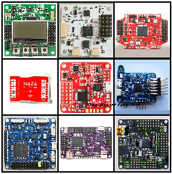

# Польотний контролер[^1] є одним із найважливіших компонентів FPV-дрона. Він відповідає за стабілізацію апарату, забезпечення точних маневрів польоту та надання даних пілоту. У цій статті ми детально пояснимо, що таке польотний контролер, як він працює та чому він є такою важливою частиною будь-якого дрона. Незалежно від того, початківець ви чи досвідчений пілот, розуміння основ керування польотом має вирішальне значення, щоб отримати максимальну віддачу від польоту.

*Деякі посилання на цій сторінці є партнерськими. Я \[автор англомовної версії Оскар Лянг\] отримую комісію (без додаткових витрат для вас), якщо ви робите покупку після натискання одного із цих партнерських посилань. Це допомагає підтримувати безкоштовний контент для спільноти на цьому веб\-сайті. Будь ласка, прочитайте нашу [Політику партнерських посилань](https://oscarliang.com/affiliate-program-policy/) для отримання додаткової інформації.*

# Якщо ви новачок у цьому хобі, перегляньте наш [Посібник для початківців FPV-дронів](https://oscarliang.com/fpv-drone-guide/), щоб дізнатися більше. Шукаєте, який польотний контролер купити? Ось мої рекомендації польотнік:[https://oscarliang.com/top-5-best-fc-mini-quad/](https://oscarliang.com/top-5-best-fc-mini-quad/)

# Зміст

[Рекомендації щодо польотного контролера](#рекомендації-щодо-польотного-контролера)

[Speedybee F405 V4](#speedybee-f405-v4)

[Speedybee F405 Mini](#speedybee-f405-mini)

[iFlight Beast F7 AIO 55A](#iflight-beast-f7-aio-55a)

[Flywoo GOKU GN745 AIO V3](#flywoo-goku-gn745-aio-v3)

[HappyModel X12 AIO](#happymodel-x12-aio)

[Flywoo GOKU F405 HD 1-2S 12A AIO V2 FC](#flywoo-goku-f405-hd-1-2s-12a-aio-v2-fc)

[Як вибрати?](#як-вибрати?)

[Польотний контролер: що він таке і як він працює](#польотний-контролер:-що-він-таке-і-як-він-працює)

[Типи польотних контролерів FC](#типи-польотних-контролерів-fc)

[Під’єднання польотніка](#під’єднання-польотніка)

[Прошивка польотного контролера](#прошивка-польотного-контролера)

[Конфігурація та налаштування](#конфігурація-та-налаштуванняbetaflight-configurator-10.9.0-receiver-serial-crsf-telemetry)

[Процесор](#процесор)

[Гіроскоп](#гіроскоп)

[Огляд типів ІВП](#огляд-типів-івп)

[Як з'ясувати, який гіроскоп використовує FC](#як-з'ясувати,-який-гіроскоп-використовує-fc)

[Як вибрати гіроскоп](#як-вибрати-гіроскоп)

[Компонування](#компонування)

[Сумісність з електронним контролером швидкості (ЕКШ)](#сумісність-з-електронним-контролером-швидкості-\(екш\))

[Пояснення паяльних майданчиків](#пояснення-паяльних-майданчиків)

[Паяльні майданчики живлення](#паяльні-майданчики-живлення)

[Що таке UART у польотного контролера?](#що-таке-uart-у-польотного-контролера?)

[Паяльний майданчик камери](#паяльний-майданчик-камери)

[Паяльний майданчик VTX](#паяльний-майданчик-vtx)

[Паяльнi майданчики i2C](#паяльнi-майданчики-i2c)

[Паяльнi майданчики зумера (пікалки)](#паяльнi-майданчики-зумера-\(пікалки\))

[Паяльний майданчик LED](#паяльний-майданчик-led)

[Схема кріплень](#схема-кріплень)

[Інші особливості](#інші-особливості)

[Функція “чорна скринька”](#функція-“чорна-скринька”)

[Типи конекторів](#типи-конекторів)

[BEC](#bec)

[Барометр](#барометр)

[Чіп OSD](#чіп-osd)

[М’який монтаж](#м’який-монтаж)

[Трохи історії](#трохи-історії)

[Історія редагування](#історія-редагування)

## 

## **Рекомендації щодо польотного контролера** {#рекомендації-щодо-польотного-контролера}

### **Speedybee F405 V4** {#speedybee-f405-v4}

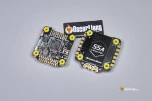  
Speedybee F405 V4 наразі є одним з найкращих за вартістю стеків польотних контролерів, що пропонує прийнятну якість та продуктивність. Він включає майже всі сучасні функції, які ви хотіли б у польотному контролері. Він підтримує аналогову FPV систему з вбудованим чіпом Betaflight OSD і є сумісним з цифровими FPV системами "plug-and-play". Дивіться мій повний огляд тут:

 [https://oscarliang.com/speedybee-f405-v4/](https://oscarliang.com/speedybee-f405-v4/).

Я майже завжди використовував цю збірку для моїх 5 ″ та 7 ″ збірок впродовж минулого року, бо вона доступна та підходить для вільного стилю, гонок, дальнього радіусу та кінематографічного польоту. Хоча на ринку є інші бюджетні стеки польотного контролера, вони зазвичай використовують чіп F722, який має лише половину пам'яті F405 в Speedybee. Менше пам'яті обмежує кількість функцій, які ви можете використовувати в Betaflight, і робить систему менш стійкою до майбутніх змін.

**Купити стек Speedybee F405 V4:**  
Speedybee: [https://oscarliang.com/product-wncw](https://oscarliang.com/product-wncw)  
RDQ: [https://oscarliang.com/product-6ro8](https://oscarliang.com/product-6ro8)  
NBD: [https://oscarliang.com/product-tscf](https://oscarliang.com/product-tscf)  
AliExpress: [https://s.click.aliexpress.com/e/\_DFU9NkF](https://s.click.aliexpress.com/e/_DFU9NkF)  
Amazon: [https://amzn.to/46EzYZi](https://amzn.to/46EzYZi)

### **Speedybee F405 Mini** {#speedybee-f405-mini}

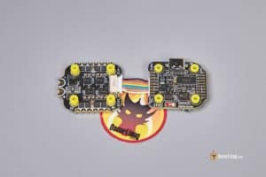

Якщо вам треба стек 20x20 мм, –це чудовий вибір для будь-яких ультралегких 5", 4" для далеких польотів, 3" cinewhoops або менших збірок. Рейтинг 35A достатній навіть для більшості збірок 5", якщо ви не збираєтесь використовувати великі, потужні мотори; a якщо збираєтесь, мабуть слід розглянути 30x30 мм.  
З ціною менше $60 за міні-стек Speedybee F405, –цей продукт пропонує відмінне співвідношення ціни та якості. Якщо ви шукаєте польотний контролер та регулятор обертів, що мають багато функцій, за помірну ціну, то варто розглянути SpeedyBee F4 Mini Stack. Дивіться мій огляд для більш детальної інформації:  
[https://oscarliang.com/speedybee-f405-mini-fc-stack/](https://oscarliang.com/speedybee-f405-mini-fc-stack/)

**Купити SpeedyBee F405 Mini Stack:**

AliExpress: [https://s.click.aliexpress.com/e/\_DnStZiP](https://s.click.aliexpress.com/e/_DnStZiP)  
SpeedyBee: [https://oscarliang.com/product-fne8](https://oscarliang.com/product-fne8)  
Amazon: [https://amzn.to/4aY6Ezd](https://amzn.to/4aY6Ezd)  
GetFPV: [https://oscarliang.com/product-ya4n](https://oscarliang.com/product-ya4n)  
RDQ: [https://oscarliang.com/product-v0bw](https://oscarliang.com/product-v0bw)

### **iFlight Beast F7 AIO 55A** {#iflight-beast-f7-aio-55a}

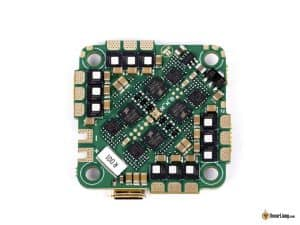

Для легких збірок з низьким профілем, таких як ультралегкі дрони 5″, 4″ та 3.5″, iFlight Beast з кріпленням 25.5×25.5 мм є відмінним вибором. Він особливо підходить для гонок через свій легкий і компактний дизайн. Хоча рейтинг ESC 55A може здатися «неперевершеним», важливо пам'ятати, що це все ще плата AIO (все в одному), і не така надійна, як ESC на окремій платі. Однак він більш ніж достатній для будь-якого дрона менше 5″. Цей польотний контролер пропонує всі з'єднання та функціональність, яку ви могли би захотіти в польотному контролері Betaflight.  
Купити польотний контролер iFlight Beast 55A можна тут:

AliExpress: [https://s.click.aliexpress.com/e/\_DlhSn6R](https://s.click.aliexpress.com/e/_DlhSn6R)  
GetFPV: [https://oscarliang.com/product-e7xk](https://oscarliang.com/product-e7xk)  
RDQ: [https://oscarliang.com/product-pdc0](https://oscarliang.com/product-pdc0)

### **Flywoo GOKU GN745 AIO V3** {#flywoo-goku-gn745-aio-v3}

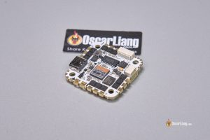  
GOKU GN745 \- це чудова альтернатива iFlight Beast. Він також має форм-фактор 25,5x25,5 мм, що робить його ідеальним для легких збірок “зубочисток” 3", 4" та 5" та cinewhoop. Оснащений процесором F7 та регулятором обертів BLHeli32, він підтримує двонаправлений DSHOT та фільтрацію обертів/хв прямо з коробки, разом з іншими просунутими функціями BLHeli32.  
Можна сказати, що це один з найбільш функціональних польотних контролерів стилю whoop/toothpick.  Хоча на краю плати розташовано багато паяльних майданчиків, вони досить маленькі і можуть бути складними для паяння. Однак плата пропонує 7 повних UART, і її набір функцій неперевершений. Він включає барометр і навіть може похвалитися 8 МБ пам'яті чорної скриньки на платі\! Перегляньте мій огляд для більш детальної інформації:  
[https://oscarliang.com/flywoo-goku-gn745-aio-v3-fc/](https://oscarliang.com/flywoo-goku-gn745-aio-v3-fc/)

**Де придбати:**

Flywoo: [https://oscarliang.com/product-yf44](https://oscarliang.com/product-yf44)  
AliExpress: [https://s.click.aliexpress.com/e/\_DEqAWcX](https://s.click.aliexpress.com/e/_DEqAWcX)

### **HappyModel X12 AIO** {#happymodel-x12-aio}

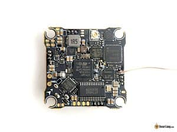  
Для ультралегких збірок, від 1S до 2S 2″ та 3″ зубочистки *\[toothpicks\]*, HappyModel X12AIO \- чудовий вибір. Він має вбудований приймач ExpressLRS та 400mW VTX.  
Де придбати:

AliExpress: [https://s.click.aliexpress.com/e/\_DDujH0F](https://s.click.aliexpress.com/e/_DDujH0F)  
Amazon: [https://amzn.to/4a2iSFI](https://amzn.to/4a2iSFI)  
GetFPV: [https://oscarliang.com/product-16z7](https://oscarliang.com/product-16z7)  
RDQ: [https://oscarliang.com/product-t5ry](https://oscarliang.com/product-t5ry)

### **Flywoo GOKU F405 HD 1-2S 12A AIO V2 FC** {#flywoo-goku-f405-hd-1-2s-12a-aio-v2-fc}

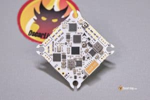  
Якщо ви збираєте ультралегкий мікро квадрокоптер з цифровими FPV системами, такими як Walksnail, DJI O3, або HDZero, вам слід серйозно розглянути польотний контролер Flywoo GOKU F405 12A AIO V2. Це один з найпотужніших польотних контролерів в цьому класі. Він підтримує як 1S, так і 2S, що робить його універсальним вибором для мікро збірок. Однак, зверніть увагу, що він не призначений для аналогових FPV систем через відсутність OSD чіпа. Для отримання додаткової інформації дивіться мій огляд:  
[https://oscarliang.com/flywoo-goku-f405-2s-aio-fc-v2-3inch-toothpick-build/](https://oscarliang.com/flywoo-goku-f405-2s-aio-fc-v2-3inch-toothpick-build/)

**Де придбати:**

Flywoo: [https://oscarliang.com/product-cbch](https://oscarliang.com/product-cbch)  
AliExpress: [https://s.click.aliexpress.com/e/\_DkJRC2R](https://s.click.aliexpress.com/e/_DkJRC2R)

## **Як вибрати?** {#як-вибрати?}

Цi питання, які я ставлю перед собою, шукаючи польотний контролер:

1. **Місце на рамі та варіанти монтажу:** виберіть між 30×30, 25×25 або 20×20, залежно від вашої рами. 

2. **Можливість встановлення GPS та компаса:** Якщо потрібен GPS, переконайтеся, що достатньо UART. Зазвичай вам знадобиться три для цифрової збірки \- один для VTX, один для RX та один для GPS. Якщо потрібен компас, переконайтеся, що доступні майданчики I2C (SDA та SCL). 

3. **LED та зумер:** Якщо вам потрібні ці функції, перевірте, чи має польотний контролер майданчики для LED-стрічки та зумера(пікалки)." 

4. **Питання щодо наявності барометра:** Деякі польотні контролери мають вбудований барометр. Зовнішні барометри важко знайти і їх не часто використовують, тому краще вибрати польотний контролер з інтегрованим барометром, якщо це важливо для вашої збірки. 

5. **Підключення Bluetooth:** Чи потрібен мені Bluetooth? Ця функція дозволяє вам налаштовувати польотний контролер бездротово на вашому телефоні за допомогою додатку Speedybee. 

6. **Сумісність з батареєю:** Який розмір батареї та кількість елементів? Переконайтеся, що польотний контролер підтримує напругу батареї, яку ви плануєте використовувати. 

7. **Розмір паяльних майданчиків:**Переконайтеся, що їхні розміри підходять для вашого рівня навичок паяння. 

8. **Цифровий VTX чи аналоговий VTX:** Чи буду я використовувати цифровий VTX, наприклад DJI, чи аналогову систему? Для аналогового, переконайтеся, що польотний контролер підтримує аналоговий OSD (він повинен мати мікросхему AT7456E). Для цифрового– переконайтеся, що є вільний UART для VTX. 

9. **Тип USB:** Польотний контролер має порт USB-C чи Micro USB? USB-C віддається перевага, оскільки він більш сучасний та надійний. 

Не знаєте, що означають деякі терміни? Решта цього посібника пояснить їх. 

## **Польотний контролер: що він таке і як він працює** {#польотний-контролер:-що-він-таке-і-як-він-працює}

# 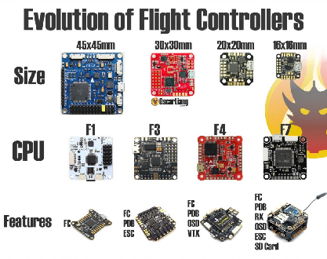

# Польотний контролер, або «польотнік», схожий на мозок FPV-дрона. Це друкована плата, оснащена датчиками, які визначають рухи дрона та команди користувача. Маючи цю інформацію, польотнік регулює швидкість двигунів, аби рухати дрон у потрібному напрямку.

# Усі польотні контролери мають базові датчики, як-от гіроскопи і акселерометри, тоді як інші можуть містити інші датчики, наприклад: датчики барометричного тиску (барометр) і компаси (магнітометр).

# Польотнік також може служити концентратором для інших периферійних пристроїв дрона, таких як електронний контролер швидкості (ЕКШ), GPS, підсвітка LED, сервоприводи, радіоприймач FPV-камери та відеопередавач.

# Із розвитком технологій польотні контролери стають меншими, наповненими функціями, використовують кращі процесори та апаратну обв’язку.

## **Типи польотних контролерів FC** {#типи-польотних-контролерів-fc}

# Існує два основних типи польотних контролерів: один більше орієнтований на літаки, а інший \- на багатороторні дрони. Це не означає, що ви не можете використовувати контролер для літака на багатороторному дроні або навпаки, але ви, швидше за все, зіткнетеся з більшими складнощами. Краще вибрати відповідний тип польотного контролера.

| FC орієнтований на літак/крило  | Стек FC/ESC орієнтований на багатороторні системи.  |
| :---: | :---: |
| 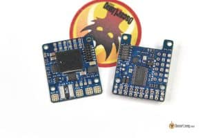 | 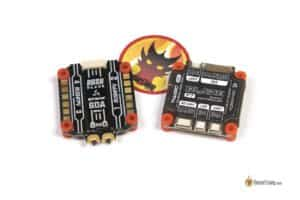 |

# Серед багатороторних польотних контролерів ви знайдете стандартний контролер і AIO *(все в одному: all-in-one)*. AIO контролер інтегрує регулятор обертів на ту ж саму плату, що робить збірку компактною. Однак вони не такі надійні, як регулятори обертів на окремих платах, які знаходяться в стандартних стеках FC/ESC (дві окремі плати), оскільки вони мають використовувати менші FET *(польові транзистори)* та мають менше розсіювання тепла через обмеження простору. Дізнайтеся більше про регулятор обертів у цьому посібнику: https://oscarliang.com/esc/ Вибір залежить від ваших вимог \- якщо пріоритетними є компактність і менша вага, ви, напевно, захочете вибрати AIO контролер. В іншому випадку, зазвичай надають перевагу стандартному стеку FC/ESC через його надійність.

| Стандартний стек FC/ESC (2 плати) | AIO FC(1 плата)  |
| :---: | :---: |
| 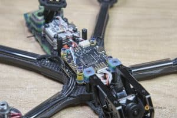 | 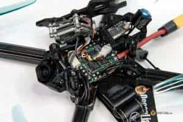 |

## **Під’єднання польотніка** {#під’єднання-польотніка}

# Ось приклад схеми підключення компонентів FPV-дрона до польотного контролера.

# Кожен FC має свою електричну схему через варіації в розташуванні паяльних майданчиків, але концепція залишається тією ж \- вам просто потрібно визначити відповідні майданчики на вашому FC. 

# 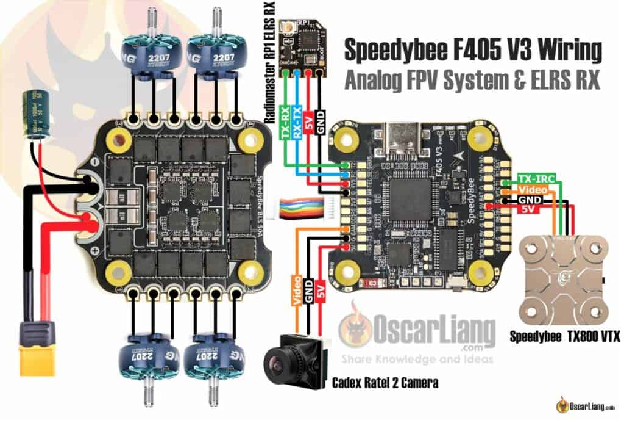

## **Прошивка польотного контролера** {#прошивка-польотного-контролера}

# 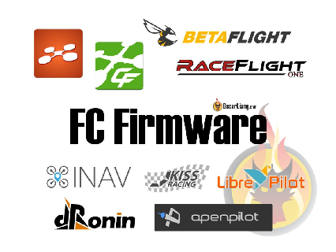

# Стосовно польотних контролерів, у вас є вибір не лише апаратного забезпечення, але й мікропрограми. Різні варіанти вбудованого програмного забезпечення пропонують різні функції та спеціалізації для різних програм. Наприклад, iNav розроблено з урахуванням використання GPS, тоді як Betaflight більше зосереджений на польотних характеристиках.

# Ось [список популярних прошивок польотніків](https://oscarliang.com/fc-firmware/) для різних варіантів FPV дронів:

* # Betaflight: це прошивка з відкритим вихідним кодом має найбільшу базу користувачів, що дозволяє легко отримати допомогу, якщо у вас виникнуть проблеми. Вона також має найширший асортимент доступних польотних контролерів.

* # KISS: Це прошивка із закритим кодом, де апаратне та програмне забезпечення контролює приватна компанія. Це означає, що ви обмежені використанням їхніх власних польотних контролерів.

* # iNav: якщо ви більше зацікавлені в автоматизованому польоті та виконання місії по маршрутних точках GPS, iNav — це ваш шлях.

# Якщо ви новачок у FPV, я б порекомендував Betaflight, оскільки це одна з найбільш універсальних і популярних прошивок. Я маю [інструкцію](https://bit.ly/LiangBetaflightSetup) *\[прим. пер.: текст доступний українською мовою\],* яка пояснює, як налаштувати Betaflight з нуля для вашого першого польоту. 

# Вибравши прошивку, ви можете шукати сумісну плату польотного контролера.

### **Конфігурація та налаштування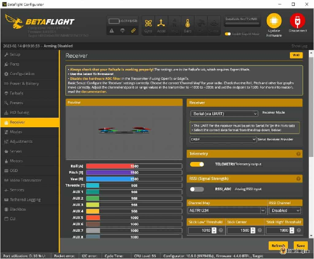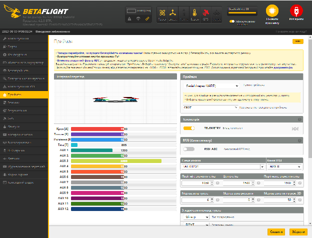 {#конфігурація-та-налаштуванняbetaflight-configurator-10.9.0-receiver-serial-crsf-telemetry}

# Прошивку польотного контролера можна налаштувати за допомогою комп’ютера, смартфона або радіоконтролера. Кожна прошивка має власний інтерфейс користувача (UI) і параметри, які можна змінювати. Однак навіть схожі на вигляд інтерфейси можуть відповідати за різні характеристики польоту залежно від прошивки, тому потрібен час, щоб освоїти та адаптуватися до нової. 

# «**Тюнінг**» — це термін, який ми використовуємо у FPV-хобі, аби описати процес виконаних тонких налаштувань, таких як PID-регулятор, швидкості польотніка, тощо, для досягнення бажаних характеристик польоту. Це важливий крок для оптимізації продуктивності вашого FPV-дрона і отримання максимальної віддачі від польотного контролера.Ось [інструкція](https://bit.ly/Betaflight10Steps) *\[прим. пер.: текст доступний українською мовою\]* про налаштування дрона під управлінням Betaflight за 10 простих кроків.

## **Процесор** {#процесор}

# 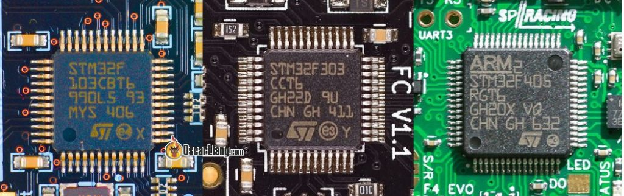*Процесори «польотників» — ліворуч і далі: STM32 F1, F3, F4*

# Польотний контролер використовує блоки мікроконтролера (MCU) для зберігання кодів програмного забезпечення та виконання складних обчислень. Наразі, STM32 МК, такі як F4, F7, та H7, підтримуються Betaflight, в той час як F1 та F3 більше не підтримуються через недостатню пам'ять для збільшених вимог до прошивки. Тому важливо звертати увагу на доступну пам'ять різних процесорів \- вона є такою ж важливою, як швидкість, якщо не більш важливою. Наприклад, хоча останній Betaflight дозволяє вам вибирати, які функції використовувати та зменшувати розмір коду для процесорів з меншою пам'яттю, в довгостроковій перспективі повільніший F405 може насправді мати перевагу над швидшим F722 через його більший обсяг пам'яті. 

|   | F1 | F3 | F4 | F7 | H7 |
| :---: | :---: | :---: | :---: | :---: | :---: |
| **швидкість** | 72 МГц | 72 МГц | 168 МГц | 216 МГц | 480 МГц |
| **пам'ять** | 128 Кб | 256 Кб | 512 КБ - 1 МБ | 512 КБ - 1 МБ | 1МБ-2 МБ |

# [Ця стаття містить більш детальне пояснення відмінностей між усіма MCU для кращого розуміння процесорів польотніка](https://oscarliang.com/f1-f3-f4-flight-controller/). [https://oscarliang.com/f1-f3-f4-flight-controller/](https://oscarliang.com/f1-f3-f4-flight-controller/)

# [В минулому, мікросхеми STM32 домінували на ринку польотних контролерів дронів FPV. Проте, у останні роки, AT32 швидко стає реальною альтернативою мікросхемам STM32 через свою доступність. Дізнайтеся більше тут: https://oscarliang.com/at32-flight-controllers/](https://oscarliang.com/at32-flight-controllers/)

## **Гіроскоп** {#гіроскоп}

# Робота датчика ІВП полягає у вимірюванні руху та орієнтації квадрокоптера. Датчик ІВП містить як акселерометр (ACC), так і гіроскоп.

# Польотний контролер (польотнік) на дроні використовує низку датчиків для визначення руху та орієнтації. Основний датчик, який використовується для цієї мети, називається **інерційним вимірювальним пристроєм** (ІВП). ІВП містить як акселерометр, так і гіроскоп.

# Гіроскоп використовується для вимірювання кутової швидкості, тоді як акселерометр вимірює лінійне прискорення. Найпопулярніший [режим польоту в Betaflight](https://oscarliang.com/betaflight-modes/) — акрорежим використовує лише гіроскоп, тоді як для багатьох інших режимів польоту, таких як кутовий режим, режим горизонту та режим порятунку, для роботи потрібні як гіроскоп, так і акселерометр.

### 

### **Огляд типів ІВП** {#огляд-типів-івп}

# Найпопулярніші типи гіроскопів для польотних контролерів FPV дронів виробляють два виробники: InvenSense (тепер частина TDK) і Bosch Sensortec. Ось список поширених моделей гіроскопів разом із протоколами зв’язку, які вони підтримують, і максимальною ефективною частотою дискретизації:

| ІВП | Можливий протокол зв'язку (BUS) | Макс. Ефективна частота дискретизації гіроскопа |
| :---- | :---- | :---- |
| MPU6000 | SPI, i2c | 8 кГц |
| MPU6050 | i2c | 4 кГц |
| MPU6500 | SPI, i2c | 32 кГц |
| MPU9150\* | i2c | 4 кГц |
| MPU9250\* | SPI, i2c | 32 кГц |
| ICM20602 | SPI, i2c | 32 кГц |
| ICM20608 | SPI, i2c | 32 кГц |
| ICM20689 | SPI, i2c | 32 кГц |
| ICM42688P | SPI, i2c | 32 кГц |
| BMI270 | SPI, i2c | 6.4 кГц |

# \* MPU9150 \- це по суті MPU6050 з інтегрованим магнітометром AK8975, в той час як MPU9250 \- це MPU6500 з тим самим магнітометром.  Існує два типи комунікації між гіроскопом та процесором: SPI та i2c. SPI є кращим протоколом комунікації між IMU та процесором, оскільки він дозволяє значно вищу частоту оновлення гіроскопа, ніж I2C (який має ліміт 4KHz). Майже всі сучасні польотні контролери сьогодні використовують SPI з'єднання для гіроскопа. Ми хочемо уникнути MPU6050 та 9150, оскільки вони підтримують лише i2c, а не SPI.

## **Як з'ясувати, який гіроскоп використовує FC** {#як-з'ясувати,-який-гіроскоп-використовує-fc}

# Щоб дізнатися, який гіроскоп має ваш польотнік, ви можете знайти номер моделі ІВП, надрукований на чіпі, наприклад, це популярний Invensense MPU-6000.

# 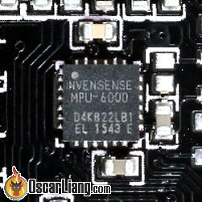

# *Гіроскоп і акселерометр на польотніку*

# Або ви можете ввести команду «status» в інтерфейсі командного рядка (CLI) Betaflight Configurator та шукати назву ІВП у Gyro/ACC. Деякі польотники можуть мати більше одного гіроскопа на борту, і ви можете вибрати, який з них використовувати в інтерфейсі командного рядка за допомогою команди «set gyro\_to\_use=0 або 1».

# 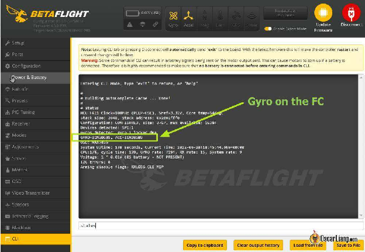

# 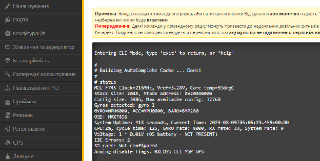

### **Як вибрати гіроскоп** {#як-вибрати-гіроскоп}

# Польотні контролери не пропонують варіантів вибору гіроскопів, але, як правило, якщо ви обираєте надійний бренд, який включає гіроскоп, який добре себе зарекомендував, це не повинно створювати ніяких проблем. Ось коротка історія гіроскопів, що використовуються в польотних контролерах. 

# Вибір гіроскопа залежить від його максимальної частоти дискретизації та чутливості до електричних і механічних перешкод. До 2022 року найпоширенішим гіроскопом був MPU6000 через його стійкість до шуму.

# Існує загальний консенсус уникати **MPU6500** і **MPU9250** незважаючи на їхню вищу швидкість дискретизації.

# **ICM20689** також є гідним гіроскопом з точки зору продуктивності, але нібито має вищий відсоток відмов. **ICM20602** є ще одним популярним вибором, однак він більш сприйнятливий до шуму та його важче налаштувати. Починаючи з Betaflight 4.1 (жовтень 2019 р.), частоту дискретизації гіроскопа 32 КГц було вилучено з Betaflight, тому немає переваг у використанні гіроскопа з частотою дискретизації 32 КГц.

# Однак з 2022 року більше виробників польотних контролерів перейшли на BMI270 через глобальний дефіцит кремнію. Хоча його максимальна частота дискретизації становить 6,4 кГц, Betaflight змушує його перейти в режим OSR4 (з граничною частотою 300 Гц), що призводить до ще нижчої частоти дискретизації 3,2 кГц. Це звучить неоптимально, але, як я перевірив це особисто, фактична продуктивність BMI270 порівняно з MPU6000 (у Betaflight 4.3/4.4). Головним недоліком є, ймовірно, додаткова фільтрація, яка іноді потрібна, оскільки частота зрізу вища у вбудованому фільтрі низьких частот з гіроскопом BMI270.

# У 2023 році все більше виробників знову переходять від BMI270 до ICM42688P через доступність і вартість. Гіроскоп ICM-42688P став предметом обговорення через скарги на шум і проблеми з налаштуванням. Однак, розслідування показують, що проблема не в самому гіроскопі, а в дизайні польотних контролерів, в які він інтегрований. Конкретно, для оптимальної роботи гіроскоп потребує стабільного живлення, що було недоліком деяких ранніми версій FC у 2022 та на початку 2023 року, що призвело до поганої продуктивності. Для користувачів, які хочуть придбати польотного контролера з цим гіроскопом, треба уважно продивитись відгуки про продукт, зосереджуючись на шумових характеристиках. 

# Існують польотники з гіроскопом, «м’яко встановленим» на шматку піни для зменшення вібрації, що передається на гіроскоп. Це не дуже популярний спосіб, оскільки було доведено, що він непотрібний, якщо сам польотний контролер має відповідну м’яку підкладку. Ось кілька порад щодо [м'якого монтажу](https://bit.ly/LiangSoftMountingFC) і [фільтрувальні конденсатори](http://bit.ly/WhyCapacitorsAreImportant) *\[прим. пер.: для обох посилань доступні українські переклади текстів\]* для зменшення шуму.

## **Компонування** {#компонування}

# Компонування польотніка стосується розташування контактів і паяльних контактів на платі польотного контролера, що може значною мірою вплинути на те, наскільки легко підключити різні компоненти.

# Багато людей дбають лише про можливості польотного контролера, і можуть не помічати важливості компонування.

# Наприклад, порівнюючи наступні два польотні контролери, ви можете побачити, що перший має краще компонування з усіма майданчиками, згрупованими за функціями та розташованими по всіх краях. Маленькі деталі дизайну, як наявність сигналу камери спереду плати та сигналу VTX ззаду, означає, що немає проводів, що висять над платою (коли ви монтуєте VTX ззаду рами). 

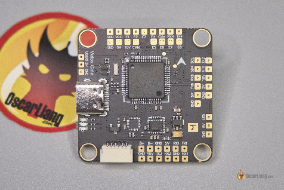

# 

# 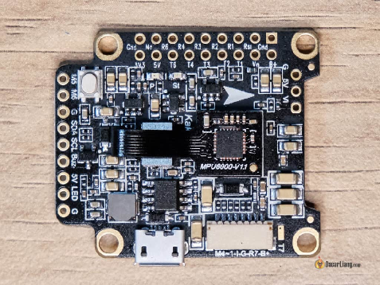

## **Сумісність з електронним контролером швидкості (ЕКШ)** {#сумісність-з-електронним-контролером-швидкості-(екш)}

# 4-в-1 “регулі” (ЕКШ) сьогодні часто продаються разом із польотними контролерами як стек, і вони спроектовані як plug and play.

# 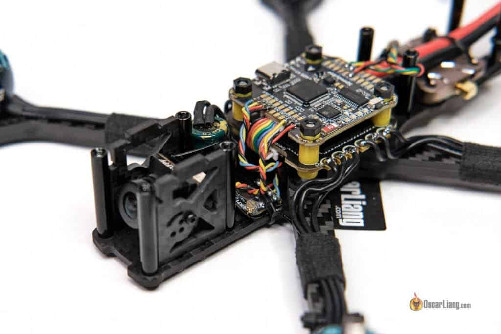

# Однак штекери та з’єднання для «регуля» (ЕКШ) і «польотніка» (FC[^2]) від різних брендів між цими платами можуть бути несумісними,--розташування контактів може бути різним, що вимагає перестановки проводів в жгуті, що може бути великою проблемою. Якщо це те, що ви хочете зробити, обов'язково перевірте розташування контактів перед підключенням польотного контролера та регулятора обертів разом, неправильне підключення може спалити ваш польотний контролер при включенні живлення. 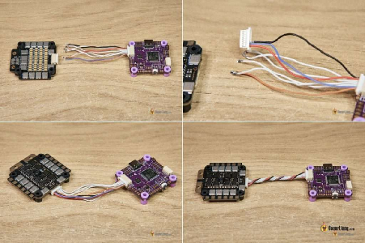

## **Пояснення паяльних майданчиків** {#пояснення-паяльних-майданчиків}

Тут я перелічу деякі важливі паяльні майданчики, які часто потрібні на польотному контролері, та поясню, що вони означають. 

### **Паяльні майданчики живлення** {#паяльні-майданчики-живлення}

**VBAT, 3.3V, 5V, 9V**

# Ці майданчики використовуються для живлення зовнішніх пристроїв. VBAT \- це пряме живлення від батареї LiPo, тоді як всі інші відомі як BEC (Battery Eliminating Circuit \- Блок регулювання напруги). Майже всі польотні контролери мають майданчики VBAT, 3.3V та 5V; деякі більші польотні контролери пропонують інші напруги, такі як 9V та 12V, для живлення відеопередавачів. Зверніть увагу, що всі BEC *\[*б*лок регулювання напруги\]* мають обмеження по струму, тому уникайте їх перевантаження, щоб не пошкодити. 

### **Що таке UART у польотного контролера?** {#що-таке-uart-у-польотного-контролера?}

# UART, або **Універсальний асинхронний приймач/передавач**, це апаратний послідовний інтерфейс, який дозволяє підключати зовнішні пристрої до польотного контролера. Приклади включають послідовні радіоприймачі, телеметрію, гоночні транспондери та керування відеопередавачем.

# Кожен UART має два контакти, один для передачі даних (TX[^3]) і один для отримання даних (RX[^4]). Важливо пам’ятати, що TX на периферійному пристрої підключається до RX на польотніку, і навпаки.

# У наведеному нижче прикладі UART3 (контакти R3 і T3) і UART6 (контакти R6 і T6) на польотному контролері можуть бути призначені для різних завдань на вкладці портів конфігуратора Betaflight.

# 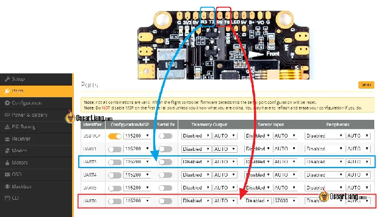

# 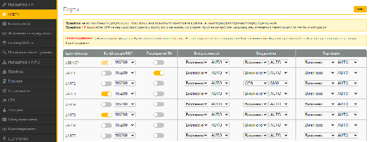

# Польотні контролери мають обмежену кількість UART; деякі мають до 6, тоді як менші FC можуть мати лише 2\. Все залежить від процесора та доступного місця. Перед покупкою переконайтеся, що UART вистачає для пристроїв, які ви плануєте використовувати. Якщо вам потрібно більше портів UART, Betaflight має функцію, яка називається SoftSerial, яка перетворює певні паяльні майданчики в "цифрові послідовні порти". Вони схожі на UART, але мають набагато повільнішу швидкість оновлення, через що вони непридатні для вимогливих до швидкості передачі даних застосувань, таких як приймачі та GPS. Вони можуть використовуватися для управління аналоговим VTX, але також збільшують навантаження на процесор, тому їх не рекомендується використовувати для повільних процесорів, або вам, можливо, доведеться знизити частоту циклу PID. 

### **Паяльний майданчик камери**  {#паяльний-майданчик-камери}

# **Vin або Cam**

# Якщо ви використовуєте аналогову FPV систему, то саме тут ви підключаєте FPV камеру. Польотний контролер потім накладе OSD на відеопотік перед тим, як він виведе його на VTX. 

### **Паяльний майданчик VTX**  {#паяльний-майданчик-vtx}

# **Vout або VTX**

# Це місце, де ви підключаєте VTX, якщо ви використовуєте аналогову FPV систему. 

### **Паяльнi майданчики i2C**  {#паяльнi-майданчики-i2c}

# **SDA i SCL**

# Для підключення пристроїв, таких як GPS-компас та барометр. 

### **Паяльнi майданчики зумера (пікалки)** {#паяльнi-майданчики-зумера-(пікалки)}

# **BZ+ i BZ-.**

Пристрій для звукового сигналу (пікалки)

### **Паяльний майданчик LED**  {#паяльний-майданчик-led}

# підключення RGB LED стрічок. 

## **Схема кріплень** {#схема-кріплень}

# Схема кріплень означає відстань між сусідніми монтажними отворами на польотному контролері. Загальні шаблони включають 30,5×30,5 мм, 25,5×25,5 мм, 20×20 мм і 16×16 мм. 

# Схема здебільшого визначається розмірами плати та дрона, для якого вона призначена.  Більші FPV дрони, як-от 5″ та 7″, часто використовують схему монтажу 30.5×30.5mm, тоді як менші дрони зазвичай використовують 25.5×25.5mm або 20×20mm. 

# 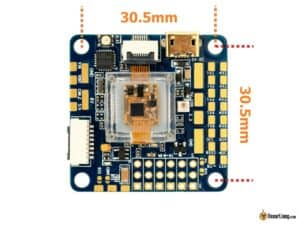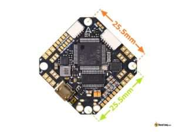

# 

## **Інші особливості** {#інші-особливості}

# Польотні контролери мають низку функцій, які можуть покращити ваші враження від польоту. Давайте розглянемо деякі з них.

### **Функція “чорна скринька”** {#функція-“чорна-скринька”}

# “Чорна скринька” або Blackbox корисна для налаштування та усунення несправностей. Ви можете записувати дані про свій політ двома способами – за допомогою вбудованої флеш-пам’яті або зберігати їх на SD-карті, якщо є вбудований реєстратор на SD-карту.

# У мене є [інструкція](https://bit.ly/LiangBlackbox) *\[прим. пер.: текст доступний українською мовою\],* яка пояснює, як користуватися функцією “чорна скринька”.

# Флеш-пам'ять дешевша, але має обмежену ємність зберігання, зазвичай 16 МБ, що дозволяє зберігати від 5 до 10 хвилин даних про польот. Завантаження даних з карти також може бути повільним. Використовуючи пристрій для зчитування карток SD на польотному контролері, ви можете вести запис цілий рік, не звільняючи сховище, і це надає вам миттєвий доступ до журналів, вставивши карту SD у пристрій для зчитування карток.

# Журнали Blackbox вкрай необхідні досвідченим пілотам. Це дає вам можливість вичавити кожну частинку продуктивності з дрона та детально діагностувати проблеми. У мене є посібник, який пояснює, як налаштувати ваш дрон FPV:  [https://bit.ly/LiangPIDFiltersTuningBlackbox](https://bit.ly/LiangPIDFiltersTuningBlackbox)   

# Якщо ваш польотний контролер не має слота для SD-карти або флеш-пам’яті, ви також можете підключити зовнішній зчитувач SD-карт до польотніка через UART.

### **Типи конекторів** {#типи-конекторів}

# 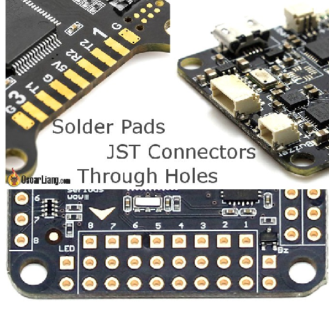

# Три основні типи роз’ємів на польотному контролері 

* # Пластикові конектори JST;

* # Паяльні колодки;

* # Наскрізні отвори.

# Пластикові з’єднувачі менш довговічні, але зручні у використанні, тоді як паяльні колодки більш міцні, але потребують пайки. Наскрізні отвори дають можливість прямого паяння або використання штифтів.

* # Професійна порада: [Як зняти шпильки контактів на польотніку](https://oscarliang.com/how-to-remove-header-pins/).

* # Професійна порада: чи знаєте ви, що з паяльними контактними площадками можна [Виправити їх, якщо вони відшаровуються](https://oscarliang.com/repair-ripped-off-solder-pads/)?

### **BEC** {#bec}

# BEC (блок регулювання напруги) — це саме те, що ми називаємо регуляторами напруги на польотному контролері.

# Майже всі польотні контролери мають 5В BEC[^5] для живлення радіоприймача, GPS тощо, тоді як деякі також пропонують 9 або 12 вольтові BEC, призначені для живлення відеопередавача. Хоча ви можете живити обладнання FPV-дрона безпосередньо від акумулятора LiPo, живлення від регульованого джерела живлення може дати кращі результати.

# Дізнатися про те [як підключити аналоговий відеопередавач FPV-дрона для найкращого результату](https://oscarliang.com/connect-vtx-fpv-camera/).

# Важливо вибрати правильне джерело напруги залежно від пристрою, який ви живите. Деякі пристрої можуть живитися безпосередньо від акумулятора LiPo, наприклад — відеопередавач. Однак джерело живлення від LiPo має тенденцію бути «шумним», стрибки напруги можуть навіть пошкодити ваші пристрої, якщо немає достатньої фільтрації. BEC діє як фільтр і зазвичай є кращим джерелом живлення, але вам потрібно перевірити, чи відповідає він вимогам до напруги та сили струму вашого пристрою.

### **Барометр** {#барометр}

# Наявність барометра, вбудованого в польотний контролер, може зробити політ із підтримкою GPS більш точним (наприклад [Режим порятунку по GPS](https://bit.ly/LiangGPSRescueSetup) *\[прим. пер.: доступний переклад тексту українською мовою\]),* але це не обов’язково.

### **Чіп OSD** {#чіп-osd}

# Для аналогової системи FPV-дрона переконайтеся, що ваш польотний контролер має мікросхему OSD *\[наекранного меню \]* AT7456E, інакше OSD Betaflight не працюватиме. Однак це не обов’язково для цифрових систем FPV-дронів, таких як DJI, HDZero та Avatar, все, що їм потрібно для роботи екранного меню — це лише запасний UART.

## **М’який монтаж** {#м’який-монтаж}

# М'який монтаж польотного контролера є важливим для оптимальної роботи, він зменшує шум/вібрацію від рами, яка потрапляє до гіроскопа. Зараз майже всі FC мають отвори M4, які дозволяють вставляти гумові прокладки (громети), щоб ви могли використовувати обладнання M3 для закріплення плати в рамі. 

# 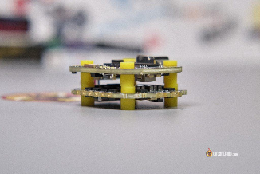

# Існують польотники з гіроскопом, «м’яко встановленим» на шматку піни для зменшення вібрації, що передається на гіроскоп. Це не дуже популярний спосіб, оскільки було доведено, що він непотрібний, якщо сам польотний контролер має відповідну м’яку підкладку. Ось кілька порад щодо [м'якого монтажу](https://bit.ly/LiangSoftMountingFC) і [фільтрувальні конденсатори](http://bit.ly/WhyCapacitorsAreImportant) *\[прим. пер.: для обох посилань доступні українські переклади текстів\]* для зменшення шуму.

# 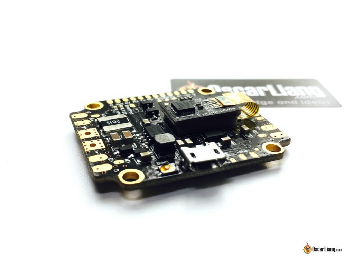

# *Soft mounted Gyro – Kakute F4*

## **Трохи історії** {#трохи-історії}

# Історія польотного контролера FPV-дрона починається з 2009 року, коли виробники використовували аксесуар Wii Motion Plus із платою Arduino для керування дроном. Це призвело до розвитку проекту **Multiwii**, який зрештою створив власну плату польотного контролера. Вона працювала на 8-розрядному процесорі Atmel.

# У 2013 році інший розробник під назвою «timecop» створив плату польотного контролера з 32-розрядним процесором ARM, **Naze32**, і переніс на нього вихідний код Multiwii під назвою «Baseflight». Ця плата має форм-фактор 35x35 мм (із кріпленням 30x30 мм) і актуальна досі.

# У 2014 році «Hydra» модифікувала Baseflight і створила **Cleanflight**, що призвело до вибуху на ринку 32-розрядних польотних контролерів, коли виробники розробляли власні варіанти польотніків.

# Betaflight був створений у 2015 році користувачем «[BorisB](https://www.youtube.com/channel/UCZnl1xWumH3q8iRnzAV_Ldw)». Він використав вихідний код Cleanflight і вніс в нього значні зміни. Коли Betaflight було вперше випущено, він головним чином був зосереджений на покращенні продуктивності Cleanflight, а також додаванні нових функцій і можливостей. Із часом Betaflight став суттєво відрізнятись від Cleanflight і тепер вважається окремою прошивкою. Betaflight наразі є найпопулярнішою прошивкою польотного контролера для FPV-дронів, і її все ще часто оновлюють.

#### **Історія редагування** {#історія-редагування}

* # Грудень 2014 — статтю створено.

* # Листопад 2016 — додано вибір прошивки польотного контролера, оновлено функції польотніка.

* # Лютий 2017 — оновлені типи процесора та гіроскопа.

* # Квітень 2017 — додано інфографіку «Еволюція польотніка, оновлено типи MPU.

* # Травень 2018 — Оновлена ​​інформація про інтеграцію польотніка.

* # Жовтень 2018 — додано інформацію про шаблони кріплення.

* # лютий 2020 — URL-адресу змінено. Оновлено: прошивка польотніка, інформація про гіроскоп; Додано: схема підключення/приклад, пояснення AIO польотнік і інтеграції функцій, макет, керування камерою.

* # Серпень 2022 — додано інформацію про гіроскоп BMI270.

* # Лютий 2023 — інструкцію переглянуто.

* # Червень 2024 –  рекомендації переглянуто.

* # 

* 

[^1]:  Розм. “польотнік”

[^2]:  Від англ. Flight Controller

[^3]:  Від англ. “transmission”

[^4]:  Від англ. “reception”

[^5]:  5-ти вольтовий блок виключення батареї

[image1]: 

[image2]: 

[image3]: 

[image4]: 

[image5]: 

[image6]: 

[image7]: 

[image8]: 

[image9]: 

[image10]: 

[image11]: 

[image12]: 

[image13]: 

[image14]: 

[image15]: 

[image16]: 

[image17]: 

[image18]: 

[image19]: 

[image20]: 

[image21]: 

[image22]: 

[image23]: 

[image24]: 

[image25]: 

[image26]: 

[image27]: 

[image28]: 

[image29]: 

[image30]: 

[image31]: 