Оригінал: [https://oscarliang.com/motors](https://oscarliang.com/motors/)    
Стисле посилання на цей переклад: [bit.ly/LiangFPVMotors-uk-UA](https://bit.ly/LiangFPVMotors-uk-UA)

| 🫂 | Нижче вичитаний людьми машинний український переклад оригіналу. Для [VictoryDrones](https://www.victory-drones.com/) переклад вичитали: Sergii, Marta, Anastasiia, Block(chain). Хочете покращити переклад чи знайшли помилку? — Лишіть коментар (Ctrl+Alt+M або «Меню» \> «Вставка» \> «Коментар»). Ми теж живі люди (як і ви) і робим помилки. Роботи їх, до речі, також роблять 😉 |
| :---: | :---- |

# Як вибрати мотори FPV-дронів

17 травня 2024 року 

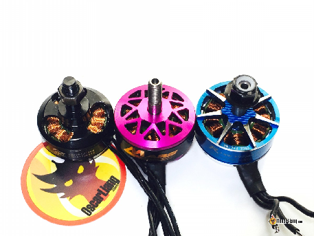

Давайте поринемо у захоплюючий світ двигунів FPV-дронів\! У цьому посібнику ми дослідимо тонкощі конструкції двигуна, конструктивні особливості та фактори, які можуть впливати на потужність і ефективність двигуна. Чітке розуміння тієї чи іншої конструкції надасть вам знання для вибору ідеального двигуна для вашого наступного дрона.  
Якщо ви все ще не впевнені, який двигун вибрати, не хвилюйтеся\! Ось мої рекомендації щодо двигунів для дрона FPV: [https://oscarliang.com/top-5-best-motors-mini-quad/](https://oscarliang.com/top-5-best-motors-mini-quad/)

Зміст

[Рекомендації](#рекомендації)

[Мотори для 5-дюймових дронiв](#мотори-для-5-дюймових-дронiв)

[T-Motor Velox Veloce V2207.5 V2 (бюджетний двигун високої якості)](#t-motor-velox-veloce-v2207.5-v2-\(бюджетний-двигун-високої-якості\))

[RCinPower Wasp Major (найкраща продуктивність)](#rcinpower-wasp-major-\(найкраща-продуктивність\))

[EMAX ECO II 2207 (найдешевше, що варте уваги)](#emax-eco-ii-2207-\(найдешевше,-що-варте-уваги\))

[iFlight Xing2 2207 (перевірено)](#iflight-xing2-2207-\(перевірено\))

[Мотори для 7-дюймових дронiв](#мотори-для-7-дюймових-дронiв)

[EMAX ECO II 2807 1300KV (Важкий мотор, який забезпечує видатну продуктивність)](#emax-eco-ii-2807-1300kv-\(важкий-мотор,-який-забезпечує-видатну-продуктивність\))

[T-Motor F90 2806.5 1300KV (Легкий та ефективний мотор)](#t-motor-f90-2806.5-1300kv-\(легкий-та-ефективний-мотор\))

[Мотори для 3-дюймових дронiв](#мотори-для-3-дюймових-дронiв)

[iFlight XING 1504 3900KV (Потужний та чутливий)](#iflight-xing-1504-3900kv-\(потужний-та-чутливий\))

[T-Motor F1404 3800KV (Збалансована продуктивність з високою ефективністю)](#t-motor-f1404-3800kv-\(збалансована-продуктивність-з-високою-ефективністю\))

[Мотори для 4-дюймових та ультралегких 5-дюймових (менше 250 грамів) дронів](#мотори-для-4-дюймових-та-ультралегких-5-дюймових-\(менше-250-грамів\)-дронів)

[Emax ECO II 2004 (Найкраща вартість в своєму класі)](#emax-eco-ii-2004-\(найкраща-вартість-в-своєму-класі\))

[T-Motor F2004 1700KV/3000KV (Преміум-клас та універсальність)](#t-motor-f2004-1700kv/3000kv-\(преміум-клас-та-універсальність\))

[З чого почати?](#з-чого-почати?)

[Безколекторні проти колекторних двигунів](#безколекторні-проти-колекторних-двигунів)

[Оцінка ваги та розміру рами дрона](#оцінка-ваги-та-розміру-рами-дрона)

[Визначення вимог до тяги](#визначення-вимог-до-тяги)

[Підключення безколекторного двигуна](#підключення-безколекторного-двигуна)

[Пояснення розміру двигуна](#пояснення-розміру-двигуна)

[Порівняння вищих і ширших статорів](#порівняння-вищих-і-ширших-статорів)

[Крутний момент двигуна](#крутний-момент-двигуна)

[Стабілізація по швидкості (KV, constant velocity)](#стабілізація-по-швидкості-\(kv,-constant-velocity\))

[KV проти постійного крутного моменту](#kv-проти-постійного-крутного-моменту)

[Кріплення двигуна](#кріплення-двигуна)

[Полюси і магніти](#полюси-і-магніти)

[Багатожильні та одножильні обмотки](#багатожильні-та-одножильні-обмотки)

[Підшипники](#підшипники)

[Вибір правильного розміру двигуна для дрона](#вибір-правильного-розміру-двигуна-для-дрона)

[Врахування напруги та струму](#врахування-напруги-та-струму)

[Як оцінити продуктивність двигуна](#як-оцінити-продуктивність-двигуна)

[Тяга](#тяга)

[Вага двигуна](#вага-двигуна)

[Ефективність та споживаний струм](#ефективність-та-споживаний-струм)

[Параметри продуктивності вдосконалених двигунів](#параметри-продуктивності-вдосконалених-двигунів)

[Крутний момент двигуна](#крутний-момент-двигуна-1)

[Час відгуку](#час-відгуку)

[Температура](#температура)

[Рівень вібрації](#рівень-вібрації)

[Основні характеристики двигунів для FPV-дронів](#основні-характеристики-двигунів-для-fpv-дронів)

[Вал двигуна](#вал-двигуна)

[Типи магнітів](#типи-магнітів)

[Дугові магніти](#дугові-магніти)

[Повітряний зазор](#повітряний-зазор)

[Ламінація статора](#ламінація-статора)

[Стопорне кільце / гвинт](#стопорне-кільце-/-гвинт)

[Алюмінієвий сплав](#алюмінієвий-сплав)

[Конструкція днища типу «Unibell»](#конструкція-днища-типу-«unibell»)

[Конструкція кільця магнітного потоку](#конструкція-кільця-магнітного-потоку)

[Технологія PoPo](#технологія-popo)

[Інші функції](#інші-функції)

[Двигуни CW і CCW](#двигуни-cw-і-ccw)

[Історія редагування](#історія-редагування)

## 

## **Рекомендації** {#рекомендації}

Твердження про «найкращий двигун для FPV-дрона » є суб’єктивним, оскільки кожен двигун працює по-різному. Зрештою, ваш вибір залежатиме від вашого стилю польоту, вимог і бюджету. Особисто я використовую свої дрони для польотів у вільному стилі (фрістайлу), кінематографічному, а іноді й гоночному та агресивному польоті. Тому я віддаю перевагу адаптивним і «універсальним» двигунам.

При виборі параметрів стабілізації двигуна за швидкістю *\[KV — constant velocity, вимірюється у кількості обертів на хвилину на 1 вольт — rpm per Volt\],* 1600-2000KV призначений для 6S, тоді як 2300-2800KV підходить для 4S. Варіанти з вищим KV, як правило, більш агресивні та енергоємні, тоді як варіанти з нижчим KV є консервативними та ефективними. Ваш вибір залежатиме від вашого стилю польоту та застосування. Перейдіть за цим посиланням до таблиці з рекомендованими комбінаціями розміру рами, розміру лопать, розміру двигуна та KV двигуна: [https://oscarliang.com/table-prop-motor-lipo-weight/](https://oscarliang.com/table-prop-motor-lipo-weight/)

У 2023 році нижче наведено 5-дюймові FPV-двигуни для дронів, які, на мою думку, вам варто розглянути.

## **Мотори для 5-дюймових дронiв**  {#мотори-для-5-дюймових-дронiв}

При виборі KV мотора, 1600-2100KV призначені для 6S, тоді як 2300-2800KV призначені для 4S. Варіанти з вищим KV, як правило, більш агресивні та споживають більше енергії, тоді як варіанти з нижчим KV є консервативними та ефективними. 

#### **T-Motor Velox Veloce V2207.5 V2 (бюджетний двигун високої якості)** {#t-motor-velox-veloce-v2207.5-v2-(бюджетний-двигун-високої-якості)}

#### 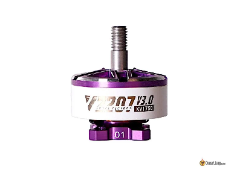

За ціною $14.9 за штуку, Velox V2207 V2/V3, можливо, є найбільш дешевими моторами, вартими уваги, які ви можете купити сьогодні. Це бюджетна пропозиція від T-Motor з сучасним дизайном та особливостями: магніти N52, титановий вал і виробництво відомої компанії T-Motor. Вони пропонують різні варіанти KV, для кінематографічних та витривалих типів польотів, я думаю, що 1750KV є чудовим на 6S. Для гонок або більш агресивного фрістайл польоту виберіть 1950KV-2050KV. Для 4S батареї, виберіть 2550KV.

**Придбати T-Motor Velox можна тут:**:  
RDQ: [https://oscarliang.com/product-ahy5](https://oscarliang.com/product-ahy5)  
GetFPV: [https://oscarliang.com/product-gch4](https://oscarliang.com/product-gch4)  
AliExpress: [https://s.click.aliexpress.com/e/\_DDjg899](https://s.click.aliexpress.com/e/_DDjg899)  
Amazon: [https://amzn.to/3Qp4W1Z](https://amzn.to/3Qp4W1Z)

#### **RCinPower Wasp Major (найкраща продуктивність)** {#rcinpower-wasp-major-(найкраща-продуктивність)}

Один із найкращих універсальних 5-дюймових двигунів, доступних на сьогодні, із надзвичайною продуктивністю як у потужності, так і в ефективності. Це ідеальний вибір як для фрістайлу, так і для гонок.

**Придбати RCinPower Wasp Major 22.6-6.5 1860KV можна тут:**

**AliExpress: [https://s.click.aliexpress.com/e/\_Dd3sjt3](https://s.click.aliexpress.com/e/_Dd3sjt3)**

**GetFPV: [https://oscarliang.com/product-f8kc](https://oscarliang.com/product-f8kc)**

**RDQ: [https://oscarliang.com/product-ocry](https://oscarliang.com/product-ocry)**

#### **EMAX ECO II 2207 (найдешевше, що варте уваги)** {#emax-eco-ii-2207-(найдешевше,-що-варте-уваги)}

- [ ] 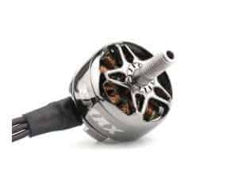

Ці двигуни мають потужні магніти N52 і надійну якість збірки за привабливою ціною. Хоча ви можете знайти двигуни за менші гроші, такі не варто купувати.

За чутками, Emax продає двигуни ECO II собі у збиток, просто намагаючись зрівнятись у ціні з найдешевшими двигунами на ринку. Мені це видається правдоподібним, тому що цей двигун коштує всього 16 доларів\! У нас немає способу довести ці чутки, але Emax ECO II показав себе на практиці як один із найкращих бюджетних двигунів FPV протягом багатьох років.

Можливо, це не найкращий двигун щодо продуктивності, але ви не можете вимагати більше, оскільки вони, мабуть, найдешевші двигуни, які зараз доступні. Вони чудові, якщо ви тільки починаєте або хочете створити башер *\[дрон, який не боїться падіння/ударів або який легко полагодити після інциденту (від англ. bash \- удар, бах, розбити\].* Це також надзвичайно ефективний двигун, якщо для вас важлива тривалість польоту.

Вони пропонують 1700KV і 1900KV для 6S, 2400KV для 4S. Вони також роблять двигун розміром 2306, але особисто я віддаю перевагу більшому розміру статора 2207, він потужніший і чутливіший до команд за ту ж ціну.

**Придбайте EMAX ECO II 2207 у:**  
AliExpress:[https://s.click.aliexpress.com/e/\_DBfROTx](https://s.click.aliexpress.com/e/_DBfROTx)  
RDQ:[https://oscarliang.com/product-6vdt](https://oscarliang.com/product-6vdt)  
GetFPV:[https://oscarliang.com/product-8mns](https://oscarliang.com/product-8mns)  
NBD: [https://oscarliang.com/product-vc8d](https://oscarliang.com/product-vc8d)  
Amazon: [https://amzn.to/3wQE9Ey](https://amzn.to/3wQE9Ey)

#### 

#### **iFlight Xing2 2207 (перевірено)** {#iflight-xing2-2207-(перевірено)}

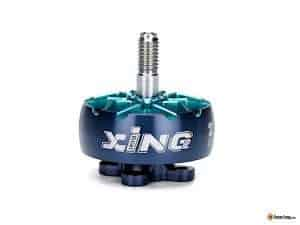

Сучасні двигуни FPV прямо зараз. Конструкція Unibel (єдиного корпусу), титановий вал, дугові магніти з прорізами для швидкої реакції, сильні магніти N52 і захисне ущільнювальне кільце, щоб підшипники довше працювали.

Серія Xing від iFlight має бути одним із найкращих FPV двигунів для дронів, вироблених у 2019 році, і тепер у них є нова серія у 2022 році – Xing2, яка ще краща. Окрім характерного та унікального вигнутого цільного корпусу двигуна, який робить його надзвичайно міцним, двигуни Xing2 2306 та 2207 також мають багато чудових функцій. Наприклад, цільний вал двигуна з титанового сплаву, надійні підшипники 9x4x4, одножильна обмотку та демпферне кільце між корпусом і підшипником, що підвищує довговічність.

Xing2 — це потужний двигун із високим крутним моментом, який забезпечує чуйність і швидкість у польоті. За 21 долар за двигун ви отримуєте двигун найвищої продуктивності, який зазвичай продається в діапазоні цін близько 30 доларів, що робить його надзвичайно вигідним. Я літав на Xing2 [моя нова збірка Source One V5](https://oscarliang.com/how-to-build-fpv-drone/), і це один із найплавніших у моїй колекції.

Лінійка двигунів iFlight Xing2 пропонує багато різних KV залежно від напруги LiPo, яку ви плануєте використовувати (4S або 6S), лопатів і стилю польоту. Для 2207 є 1855KV (6S) і 2755KV (4S), для 2306 є 1755KV (6S) і 2555KV (4S).

**Придбайте iFlight Xing2 2207 тут:**

**AliExpress:[https://s.click.aliexpress.com/e/\_DefjM73](https://s.click.aliexpress.com/e/_DefjM73)**  
**RDQ:[https://oscarliang.com/product-2bz1](https://oscarliang.com/product-2bz1)**  
**GetFPV:[https://oscarliang.com/product-hzvo](https://oscarliang.com/product-hzvo)**  
**Banggood:[https://oscarliang.com/product-ag8w](https://oscarliang.com/product-ag8w)**  
**Amazon:[https://amzn.to/3OJa4v3](https://amzn.to/3OJa4v3)**

---

## Мотори для 7-дюймових дронiв {#мотори-для-7-дюймових-дронiв}

Ось мої рекомендації щодо моторів для 7-дюймових FPV дронів. Наш акцент зроблено на ефективність при основній швидкості для тривалого часу польоту та плавність для мінімізації вібрації та нагрівання. Ці фактори важливі, оскільки 7-дюймові дрони зазвичай використовуються для дальнього польоту. Для 6S конфігурацій ідеально підходять мотори 1300KV, а для 4S ви, можливо, захочете вибрати 1500KV або вище. 

#### **EMAX ECO II 2807 1300KV (Важкий мотор, який забезпечує видатну продуктивність)** {#emax-eco-ii-2807-1300kv-(важкий-мотор,-який-забезпечує-видатну-продуктивність)}

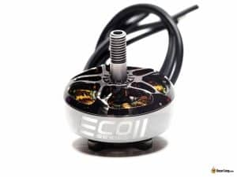  
Мотор EMAX ECO II 2807 є важкваговик  в категорії 7-дюймових квадрокоптерів. З вагою близько 54 грами з 7-дюймовими проводами, цей мотор вирізняється своїм більшим розміром статора. Він має багатожильнi обмотки, двохчастинний дизайн корпусyі гвинт вала M2.  
З точки зору продуктивності, EMAX ECO II 2807 пропонує надійне поєднання тяги, крутного моменту і ефективності. Його високий крутний момент забезпечує чутливий до команд і стабільний політ, що є важливим для зйомки плавних відео. Хоча додаткова вага може бути недоліком для тих, хто звертає увагу на загальну вагу свого дрона, EMAX ECO II 2807 має відмінну потужність і стабільність, що робить його хорошим вибором для пілотів, які намагаються досягти потужності і стабільності у своїй 7-дюймовій конфігурації квадрокоптера.  
**Придбайте EMAX ECO II 2807** **тут**:   
AliExpress: [https://s.click.aliexpress.com/e/\_DC1zRl3](https://s.click.aliexpress.com/e/_DC1zRl3)  
RDQ: [https://oscarliang.com/product-i258](https://oscarliang.com/product-i258)  
GetFPV: [https://oscarliang.com/product-yn40](https://oscarliang.com/product-yn40)  
Amazon: [https://amzn.to/3RLyvLL](https://amzn.to/3RLyvLL)

#### **T-Motor F90 2806.5 1300KV (Легкий та ефективний мотор)** {#t-motor-f90-2806.5-1300kv-(легкий-та-ефективний-мотор)}

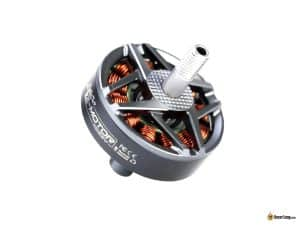

T-Motor F90 2806.5 1300KV \- це один з найефективніших моторів для 7-дюймових дронів, що пропонує збалансовані характеристики. Його чутливість досить невисока, що робить його більш підходящим для збірок дальніх польотів, ніж для фристайлу.  
Якщо ви надаєте перевагу ефективності та тривалості польоту, цей мотор варто розглянути. Для тих, хто шукає легкі мотори, але з більшою чутливістю для фрістайлу, Flyfish Flash 2806.5 може бути хорошою альтернативою.  
**Придбати T-Motor F90 тут:**   
AliExpress: [https://s.click.aliexpress.com/e/\_Del6L3f](https://s.click.aliexpress.com/e/_Del6L3f)  
RDQ: [https://oscarliang.com/product-fq2e](https://oscarliang.com/product-fq2e)  
GetFPV: [https://oscarliang.com/product-t3k7](https://oscarliang.com/product-t3k7)  
Amazon: [https://amzn.to/47P8Q9y](https://amzn.to/47P8Q9y)

## **Мотори для 3-дюймових дронiв** {#мотори-для-3-дюймових-дронiв}

#### **iFlight XING 1504 3900KV (Потужний та чутливий)** {#iflight-xing-1504-3900kv-(потужний-та-чутливий)}

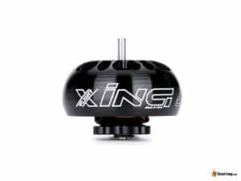  
Мотор iFlight XING 1504 3900KV неймовірно потужний та чутливий, що робить його ідеальним для високопродуктивних збірок. Хоча він є досить важким, він компенсує це вражаючою ефективністю. Цей мотор ідеально підходить для трохи важчих збірок, де вага не є основною проблемою.  
**Придбайте XING 1504 тут:**  
AliExpress: [https://s.click.aliexpress.com/e/\_DlWxUvd](https://s.click.aliexpress.com/e/_DlWxUvd)  
GetFPV: [https://oscarliang.com/product-efs7](https://oscarliang.com/product-efs7)  
Amazon: [https://amzn.to/44P1RxD](https://amzn.to/44P1RxD)

#### 

#### **T-Motor F1404 3800KV (Збалансована продуктивність з високою ефективністю)**  {#t-motor-f1404-3800kv-(збалансована-продуктивність-з-високою-ефективністю)}

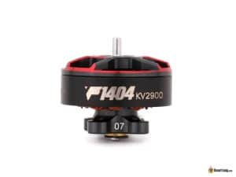

Мотор T-Motor F1404 3800KV пропонує збалансовану продуктивність та має невелику вагу. Він вирізняється своєю чутливістю та ефективністю, що робить його відмінним вибором для ультралегких збірок та тривалих польотів.  
**Придбати T-Motor F1404 можна тут:**  
AliExpress: [https://s.click.aliexpress.com/e/\_DmnbMv5](https://s.click.aliexpress.com/e/_DmnbMv5)  
RDQ: [https://oscarliang.com/product-uynr](https://oscarliang.com/product-uynr)  
GetFPV: [https://oscarliang.com/product-cab6](https://oscarliang.com/product-cab6)  
Amazon: [https://amzn.to/3V10o41](https://amzn.to/3V10o41)

### 

## **Мотори для 4-дюймових та ультралегких 5-дюймових (менше 250 грамів) дронів** {#мотори-для-4-дюймових-та-ультралегких-5-дюймових-(менше-250-грамів)-дронів}

Збірки 4" та 5" дронів вагою менше 250 грамів стають все більш популярними через останні регулятивні акти щодо дронів. Ось декілька найкращих варіантів у цій категорії.

#### **Emax ECO II 2004 (**Найкраща вартість в своєму класі) {#emax-eco-ii-2004-(найкраща-вартість-в-своєму-класі)}

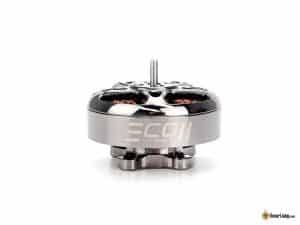  
Мотор Emax ECO II 2004 \- виділяється як бюджетний варіант у своєму класі. Він забезпечує надійну роботу без значних витрат, що робить його відмінним вибором для економних збірок. Придбайте 3000KV для 4-дюймового на 4S, 2000KV для 5-дюймового на 6S.  
Придбайте EMAX ECOII 2004 тут:   
AliExpress: [https://s.click.aliexpress.com/e/\_DmBpqF1](https://s.click.aliexpress.com/e/_DmBpqF1)  
RDQ: [https://oscarliang.com/product-05va](https://oscarliang.com/product-05va)

#### 

#### **T-Motor F2004 1700KV/3000KV (Преміум-клас та універсальність)** {#t-motor-f2004-1700kv/3000kv-(преміум-клас-та-універсальність)}

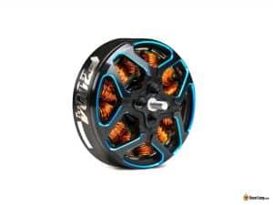  
T-Motor F2004 пропонується у двох варіантах: 1700KV та 3000KV. Версія 1700KV ідеально підходить для 6S ультралегких 5-дюймових збірок, забезпечуючи найкращу продуктивність. З іншого боку, варіант 3000KV краще підходить для 4-дюймових збірок, які працюють на 4S, пропонуючи універсальність та високу продуктивність.  
**Придбайте T-Motor F2004 тут:**   
AliExpress: [https://s.click.aliexpress.com/e/\_DluJdP9](https://s.click.aliexpress.com/e/_DluJdP9)  
RDQ: [https://oscarliang.com/product-l278](https://oscarliang.com/product-l278)  
GetFPV: [https://oscarliang.com/product-za44](https://oscarliang.com/product-za44)  
Amazon: [https://amzn.to/3yhwBuX](https://amzn.to/3yhwBuX)

## 

## **З чого почати?** {#з-чого-почати?}

Якщо ви новачок на сцені FPV, я настійно рекомендую спершу ознайомитися з нашим посібником для початківців щодо FPV-дронів , щоб дізнатися про основи: [https://oscarliang.com/fpv-drone-guide/](https://oscarliang.com/fpv-drone-guide/)  
Перш ніж вибрати двигун, важливо мати принаймні приблизне уявлення про розмір і вагу дрона, який ви плануєте створити. Я проведу вас через процес визначення розміру двигуна на основі дрона, який ви намагаєтеся створити, але якщо ви зосереджуєтеся на створенні 5-дюймового FPV-дрона, сміливо переходьте до розділу «Розмір двигуна».  
Деякі з найважливіших факторів, про які слід пам’ятати, включають:

* Вага двигуна  
* Потужність (тяга)  
* Ефективність (грами на Ват)  
* Крутний момент і реакція (динаміка обертів, вимірюється у обертах на хвилину або RPM)

### **Безколекторні проти колекторних двигунів** {#безколекторні-проти-колекторних-двигунів}

У світі радіокерованих моделей існує два основних типи двигунів: безколекторні [і колекторні](https://oscarliang.com/brushed-vs-brushless-motor/). Зазвичай ми використовуємо безколекторні двигуни, оскільки вони довговічніші та потужніші, тоді як [колекторні](https://oscarliang.com/brushed-vs-brushless-motor/) двигуни часто використовуються в іграшкових дронах, оскільки вони дешевші у виготовленні. У цьому посібнику ми зосередимося виключно на безколекторних двигунах, які є основним вибором для більшості FPV-дронів.

### **Оцінка ваги та розміру рами дрона** {#оцінка-ваги-та-розміру-рами-дрона}

Розглядаючи загальну вагу вашого FPV-дрона, обов’язково врахуйте всі компоненти: раму, політний контролер (FC), електронний регулятор швидкості (ESC), двигуни, пропелери, приймач сигналу керування (RX), відеопередавач (VTX), антену, акумулятор LiPo, додаткову екшн-камеру (типу GoPro), тощо. Хоча ці виміри не обов’язково мають бути 100% точними, близьке до точності оцінювання є важливим. Краще переоцінити вагу і мати додаткову потужність, ніж занизити потужність і мати клопіт під час зльоту.  
Визначивши розмір рами, ви зможете встановити максимально допустимий розмір пропелера. Щоб дізнатися більше про вибір пропелера, ознайомтеся з нашим посібником щодо вибору пропеллера для дрона FPV: [https://oscarliang.com/propellers/](https://oscarliang.com/propellers/)

### **Визначення вимог до тяги** {#визначення-вимог-до-тяги}

Щоб розрахувати мінімальну тягу, необхідну для комбінації двигуна та пропелера, вам знадобиться знати приблизну загальну вагу вашого дрона. Загальне емпіричне правило полягає в тому, що максимальна тяга, створювана всіма двигунами, повинна принаймні подвоювати загальну вагу дрона. Недостатня тяга може призвести до поганої реакції на керування та труднощів під час підйому.  
Наприклад, якщо у вас є дрон вагою 1 кг, загальна тяга, створювана всіма двигунами при 100% газу, має становити принаймні 2 кг. Це тяга 500 г, яку створює кожен двигун дрона. Звичайно, наявність більшої тяги, ніж потрібно, завжди є бонусом.  
Для гоночних дронів відношення тяги до ваги (або відношення потужності до ваги) має бути значно вищим, ніж у прикладі вище. Співвідношення 10:1 або навіть 14:1 не є рідкістю. Для акробатики та фрістайлу я рекомендую мати співвідношення принаймні 5:1.  
Більше співвідношення тяги до ваги надає дрону більшу маневреність і прискорення, але може ускладнити керування, особливо новачкам. Навіть найменший дотик газу може «вивести дрон на орбіту, як ракету». Пілотування та досвід відіграють значну роль в управлінні цією силою.  
Навіть якщо ви плануєте керувати лише повільним і стабільним обладнанням для аерофотозйомки, прагніть до співвідношення вище 3:1 або навіть 4:1. Це не тільки забезпечує кращий контроль, але й залишає простір для додаткового корисного навантаження.  
---

## **Підключення безколекторного двигуна** {#підключення-безколекторного-двигуна}

Щоб керувати безколекторним двигуном, вам знадобиться ESC (електронний регулятор швидкості). На відміну від [колекторн](https://oscarliang.com/brushed-vs-brushless-motor/)их двигунів, які мають лише два дроти, безколекторні двигуни мають три дроти. Ви можете підключити ці дроти до ESC у будь-якому порядку. Щоб змінити напрямок обертання, просто поміняйте місцями два з трьох проводів. Крім того, можна змінити напрямок двигуна за допомогою налаштувань програмного забезпечення: [https://oscarliang.com/change-motor-spin-direction-quadcopter/](https://oscarliang.com/change-motor-spin-direction-quadcopter/)  
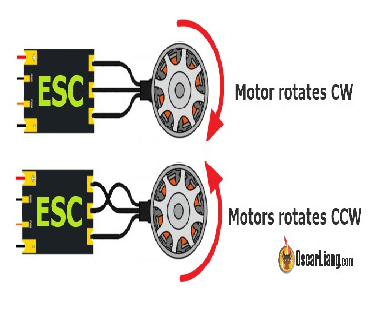  
---

## **Пояснення розміру двигуна** {#пояснення-розміру-двигуна}

Розмір безколекторного двигуна у радіокерованих моделей зазвичай позначається чотиризначним числом – AABB:

* «AA» означає ширину статора (або діаметр статора) в міліметрах  
* «BB» означає висоту статора в міліметрах

Статор — це нерухома частина двигуна, що складається з «полюсів», обмотаних мідними дротами (обмотками). Ці полюси складаються з кількох шарів тонких металевих пластин, ламінованих разом, із надтонким шаром ізоляції між ними.

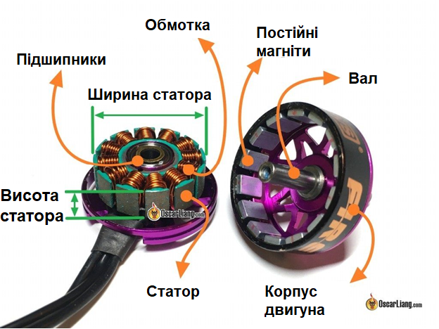

Давайте розберемо основні компоненти двигуна:

* Статор двигуна — нерухома частина двигуна складається з кількох металевих котушок. Дріт котушки покритий емаллю для запобігання короткому замиканню, оскільки він намотаний у кілька петель. Коли електричний струм проходить через котушки статора, він створює магнітне поле, яке взаємодіє з постійними магнітами на роторі, створюючи обертання.  
* Магніти — постійні магніти, що створюють фіксоване магнітне поле. У двигунах FPV вони кріпляться до внутрішньої сторони корпуса двигуна за допомогою епоксидної смоли.  
* Корпус двигуна *\[motor bell\]* — служить захисним кожухом двигуна для магнітів і обмоток. Як правило, виготовляють його із легких металів, таких як алюміній. Деякі корпуси сконструйовані як мініатюрні вентилятори, щоб направити більший потік повітря на обмотки двигуна для додаткового охолодження двигуна під час обертання.  
* Вал двигуна *\[motor shaft\]* — з’єднаний із корпусом двигуна, вал є робочим компонентом, який передає крутний момент, створюваний двигуном, на пропелер.

Збільшення ширини або висоти статора збільшує об’єм статора, розмір постійних магнітів, а також електромагнітних котушок статора. У результаті загальний крутний момент двигуна збільшується, що дозволяє йому швидше обертати важчий гвинт і виробляти більшу тягу (за рахунок споживання більшого струму). Однак недоліком більшого статора є те, що він важчий і менш чутливий.

### **Порівняння вищих і ширших статорів** {#порівняння-вищих-і-ширших-статорів}

Ширші двигуни мають більшу інерцію під час обертання, оскільки маса двигуна знаходиться далі від осі обертання, що вимагає більше енергії для зміни обертів. Отже, ширші та коротші двигуни зазвичай менш чутливі, ніж вужчі та вищі двигуни, навіть якщо вони мають однаковий об’єм статора та генерують однаковий крутний момент. Ширші та коротші двигуни також мають менші магніти на корпусі двигуна, що може зменшити потужність двигуна.  
Проте ширші двигуни уможливлюють краще охолодження завдяки більшій площі поверхні зверху та знизу. Температура має вирішальне значення для роботи двигуна. Коли двигун нагрівається, його здатність генерувати магнітний потік зменшується, що впливає на ефективність і крутний момент.  
По суті, ширина та висота статора двигуна представляють баланс між чутливістю та охолодженням. Конкретне рішення залежить від вашого стилю польоту. Наприклад, для повільних кінематографічних прольотів із важкою камерою GoPro *\[прим. пер.: і для важких скидів\]* вам можуть знадобитися двигуни з ширшим статором для кращого охолодження. Для швидких і чутливих гоночних або фрістайл-дронів краще використовувати вищі статори.  
Ширші статори також дозволяють використовувати більші підшипники, що покращує ефективність, плавність роботи та довговічність.  
Більші статори не завжди кращі. Наприклад, двигуни 2207 можуть працювати з типовими 5-дюймовими пропелерами, але використання набагато важчих двигунів 2506 з тим самим [KV](#стабілізація-по-швидкості-\(kv,-constant-velocity\)) може не дати помітних переваг, оскільки вони створюватимуть ту саму тягу, використовуючи ті самі пропелери, або навіть забезпечуватимуть гіршу чутливість через вагу.  
Щоб покращити продуктивність без збільшення ваги, розгляньте двигуни з вищим KV. Однак двигун 2506 у цьому прикладі, швидше за все, працюватиме краще для 6-дюймових пропелерів, ніж 2207 через підвищені вимоги до крутного моменту.

## **Крутний момент двигуна** {#крутний-момент-двигуна}

Двигуни з високим крутним моментом забезпечують швидку зміну частоти обертання та швидший час відгуку, що призводить до меншої турбулентності та швидшої реакції.  
Крутний момент двигуна залежить від кількох факторів, зокрема:

* Розмір статора (об'єм);  
* Матеріали: тип магнітів і якість мідних обмоток;  
* Конструкція двигуна: повітряний зазор, кількість полюсів тощо.

Оскільки останніми роками двигуни FPV мають подібні характеристики та конструкції, розмір статора є найпростішим способом кількісної оцінки крутного моменту.  
Розмір статора можна розрахувати за формулою об’єму циліндра:  
об’єм \= пі \* радіус^2 \* висота  
Наприклад, об’єм статора двигуна 2207 становить:  
пі х (22/2)^2 х 7 \= 2660,93  
Чим більший об’єм статора, тим більший крутний момент може створити двигун. Порівнюючи двигун 2306 з об'ємом 2492,85, двигун 2207 має більший крутний момент.

При виборі двигуна порівняйте об’єм і вагу статора двигуна. Більш легкий двигун з таким самим об’ємом є кращим за інших однакових факторів. Отже, чому б не вибрати найбільший доступний двигун? Відповідь криється у вазі. Двигуни з більшим об’ємом статора важчі, тому питання їх вибору дійсно залежить від напрямків майбутнього застосування.  
Наприклад, легким дронам не потрібно багато тяги, щоб залишатися в повітрі, залишаючи доступним більше крутного моменту. У поєднанні із пропелерами з меншим кроком, двигуни можуть обертати їх із меншим крутним моментом. У цьому випадку вимоги до крутного моменту двигуна є низькими, що дозволяє використовувати менші, легші двигуни, які зменшують загальну вагу.  
Єдиний випадок, коли менш потужний двигун (з меншим крутним моментом) є перевагою, коли плавність має пріоритет над чутливістю.  
Двигуни з високим крутним моментом можуть змінювати частоту обертання так швидко, що політ на них може відчуватися різким та менш плавним. Вони також можуть створювати більше стрибків напруги та електричного шуму в системі живлення, потенційно впливаючи на продуктивність гіроскопа та загальну ефективність польоту, якщо фільтрація шуму не є оптимальною і призведе до коливань.

## **Стабілізація по швидкості (KV, constant velocity)**  {#стабілізація-по-швидкості-(kv,-constant-velocity)}

«KV» вказує на кількість обертів за хвилину *\[RPM, revolutions-per-minute, об/хв\]*, які робить двигун, коли 1 В (один вольт) подано без будь-якого навантаження (наприклад, пропелера), прикріпленого до двигуна. Наприклад, двигун потужністю 2300 KV, що живиться від акумулятора 3S LiPo (12,6 В), обертатиметься зі швидкістю приблизно 28 980 об/хв без встановлених пропелерів (2300 x 12,6).  
KV зазвичай є приблизною оцінкою, яку вказує виробник двигуна.  
Коли пропелер встановлений на двигуні, оберти різко зменшуються через опір повітря. Двигуни з вищим KV намагатимуться обертати пропелер швидше, генеруючи більше тяги та потужності (і споживаючи для цього більше струму). Більші пропелери зазвичай поєднуються із двигунами з низьким KV, тоді як менші, легші пропелери краще працюють з двигунами з високим KV.  
*KV двигуна визначається кількістю обмоток мідного дроту в статорі. Загалом, більша кількість витків обмотки зменшує KV двигуна, тоді як менша кількість витків збільшує його. Магнітна сила магнітів також може впливати на значення KV, оскільки сильніші магніти збільшують KV.*  
Якщо двигун із високим KV поєднується із надто великим пропелером, двигун намагатиметься обертатися швидко, як це було б із меншим гвинтом, вимагаючи більшого крутного моменту. Ця потреба у збільшенні крутного моменту призведе до більшого споживання струму та виділення тепла. Перегрів може призвести до перегорання двигуна, оскільки покриття котушки може розплавитися та спричинити коротке замикання всередині двигуна. Ось чому двигун з вищим KV, швидше за все, грітиметься сильніше, ніж двигун з нижчим KV того самого розміру.  
KV також впливає на обмеження струму та напруги двигуна. Двигуни з вищим KV мають коротші обмотки та нижчий опір, що знижує максимальну номінальну напругу та збільшує споживання струму двигуном і пропелером. Однак на сторінці продукту двигуна буде вказано допустиму напругу та максимальний струм.  
Обмеження «Потужності двигуна» в [Betaflight](https://betaflight.com/docs/wiki) дозволяє вам [зменшити сигнал двигуна та використовувати батареї з вищою напругою](https://oscarliang.com/4s-6s-lipo-same-motors/) (наприклад, аеро двигуни 4S на батареї 6S). Однак, хоча цей обхідний шлях може спрацювати, він потенційно може вивести із ладу ваш ESC через двигуни з високим KV.  
Обмежуючи потужність двигуна, ви встановлюєте обмеження на те, як довго MOSFET *\[ключ перемикання струму на ESC, дослівно: [МДН-транзистор](https://uk.wikipedia.org/wiki/%D0%A2%D1%80%D0%B0%D0%BD%D0%B7%D0%B8%D1%81%D1%82%D0%BE%D1%80_%D0%BC%D0%B5%D1%82%D0%B0%D0%BB-%D0%B4%D1%96%D0%B5%D0%BB%D0%B5%D0%BA%D1%82%D1%80%D0%B8%D0%BA-%D0%BD%D0%B0%D0%BF%D1%96%D0%B2%D0%BF%D1%80%D0%BE%D0%B2%D1%96%D0%B4%D0%BD%D0%B8%D0%BA)\]* залишається ввімкненим, але ви все одно піддаєте двигун вищій напрузі. Це з більшою ймовірністю спричинить проблеми, ніж використання двигуна з нижчим KV, розрахованим на вищу напругу. Рекомендується правильно вибирати KV двигуна відповідно до напруги батареї, яку ви плануєте використовувати.  
Не знаєте, як вибрати двигун KV? Перевірте цю таблицю: [https://oscarliang.com/table-prop-motor-lipo-weight/](https://oscarliang.com/table-prop-motor-lipo-weight/)

### **KV проти постійного крутного моменту** {#kv-проти-постійного-крутного-моменту}

KV двигуна безпосередньо не впливає на крутний момент, але впливає на константу крутного моменту. Константа крутного моменту двигуна визначає, скільки струму потрібно для створення певного крутного моменту. KV не впливає на фактичний генерований крутний момент. На це впливають такі фактори, як сила магніту, повітряний зазор і опір котушки.  
Двигуни з вищим KV мають вищу константу крутного моменту, тобто їм потрібен більший струм для створення того самого крутного моменту порівняно із двигуном з нижчим KV. Щоб створити такий самий крутний момент, двигун з вищим KV потребує більше струму, що призводить до додаткових втрат у ESC, акумуляторі та проводах. Крім того, більше тепла накопичується в двигуні через вищий струм, створюється менший магнітний потік. Загалом, двигун з вищим KV менш ефективний, якщо ви летите з тією ж швидкістю на двигуні із нижчим KV.  
Тому краще не перестаратися з KV, намагайтеся бути поміркованими. Це особливо важливо при створенні платформи для дальніх польотів, це пріоритетом є ефективність та тривалість польоту.

## **Кріплення двигуна** {#кріплення-двигуна}

Загальні схеми кріплення (відстань між отворами) для двигунів 22xx, 23xx, 24xx — 16x19 мм і 16x16 мм. Сучасні 5-дюймові рами FPV-дронів повинні підтримувати обидва варіанти. Монтажні отвори цих двигунів використовують гвинти M3. Використовуйте гвинти із довжиною різьби на 2 мм більше товщини променю; наприклад, для променів товщиною 5 мм використовуйте гвинти 7 мм, а для променів 6 мм використовуйте гвинти 8 мм.  
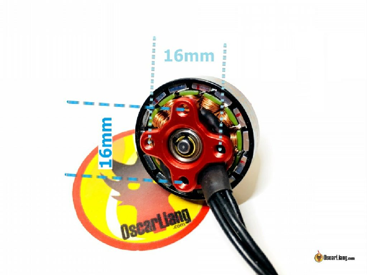

## **Полюси і магніти** {#полюси-і-магніти}

Переглядаючи двигуни для свого FPV-дрона , ви можете натрапити на такі характеристики, як «12N14P», надруковані на коробці. Ось що означають ці цифри: число перед літерою «N» вказує на кількість електромагнітів (полюсів) у статорі, а число перед «P» означає кількість постійних магнітів у корпусі.

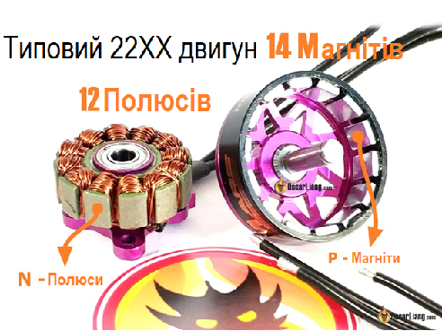

*Полюси та магніти в двигуні FPV-дрона*

Двигуни різних розмірів мають різну кількість полюсів; наприклад, двигуни 22XX і 23XX зазвичай мають 12 полюсів і 14 магнітів. Кількість полюсів безпосередньо впливає на продуктивність двигуна. Якщо полюсів менше, то в статорі можна вмістити більше заліза, що призведе до більшої вихідної потужності. Однак більша кількість полюсів призводить до більш рівномірного поширення магнітного поля. Це, у свою чергу, забезпечує більш плавну роботу двигуна з точнішим контролем обертання корпуса.

Якщо стисло:

* Більше полюсів \= більш плавна робота.  
* Менше полюсів \= збільшена потужність.

Оскільки двигуни FPV-дронів зазвичай трифазні, конфігурація полюсів має бути кратною 3 (тобто 9, 12, 15, 18 тощо). Це пов’язано із наявністю трьох проводів, що підключаються до двигуна. Отже, число полюсів не змінюється і не є критичним фактором при виборі двигунів, особливо для FPV-дронів . Але ви повинні звернути увагу на номер полюса, оскільки ви повинні ввести це число в Betaflight, при [увімкненні фільтра RPM](https://oscarliang.com/rpm-filter/). Якщо ви не можете знайти це число, ви можете просто порахувати, скільки магнітів у корпусі.

**Обмотки двигуна**  
Кількість мідних обмоток або «витків» на полюсі статора визначає максимальний струм, який буде споживати двигун. Водночас товщина дроту впливає на здатність двигуна витримувати струм до досягнення точки перегріву.  
Простіше кажучи, менша кількість обертів означає менший опір, що призводить до більш високого KV. Однак це також призводить до зменшення електромагнітного поля на статорі і, як наслідок, до зниження крутного моменту.  
З іншого боку, коли в котушці більше витків, збільшення кількості міді створює більше магнітне поле на полюсі статора, створюючи більший крутний момент. Але є нюанс: довші дроти та вищий опір спричиняють зниження KV двигуна.  
Отже, як виробники вирішують ці проблеми, підвищуючи потужність двигунів FPV-дронів? Відповідь полягає в збільшенні кількості обмоток при використанні більш товстих мідних проводів. Цей геніальний підхід ефективно зменшує опір обмотки, тим самим покращуючи потужність без шкоди для ефективності та крутного моменту. Крім того, двигун з більшим діаметром дроту може витримувати великий струм без перегорання.  
Однак важливо зазначити, що використання товстіших проводів і додаткових обмоток призводить до більшої ваги двигуна. Крім того, обмотка займає більше фізичного простору, що вимагає більшого статора. Ось чому ми є свідками появи на ринку більших і важчих двигунів, що також пояснює їхню підвищену потужність.

### **Багатожильні та одножильні обмотки** {#багатожильні-та-одножильні-обмотки}

Що стосується обмоток двигуна, існує два основних варіанти: одножильна та багатожильна. Кожна з них має свої переваги та недоліки, що робить їх придатними для різних застосувань.  
В одножильних обмотках використовують товстіші дроти, які ефективніше відводять тепло, що робить їх ідеальними для двигунів з високою напругою, таких як 6S. Однак товстіші дроти призводять до збільшення проміжків між ними, що обмежує кількість обмоток, які можна намотати на статор.  
З іншого боку, в багатожильних обмотках один товстий дріт замінюють трьома меншими. Ці тонші дроти не так ефективно проводять тепло і частіше рвуться.  
Незважаючи на ці обмеження, багатожильні обмотки, як правило, мають кращі характеристики, ніж одножильні. Більш тонкі дроти забезпечують більш щільну упаковку навколо статора, з меншими проміжками між дротами, що призводить до утворення сильнішого магнітного поля. Як наслідок, підвищується потужність та ефективність.  
Важливо відзначити, що акуратність обмоток також відіграє важливу роль, як з естетичної, так і з практичної точки зору. Неохайні обмотки з численними перехрещеннями дротів призводять до менш ефективних магнітних полів, оскільки дроти перетинають статор не перпендикулярно. Тому, при обмотці електродвигунів, дбайте про акуратне намотування та правильно організовуйте укладку.

## **Підшипники** {#підшипники}

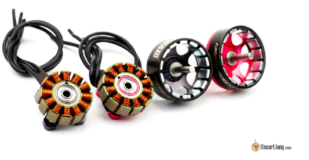Можливо, в Інтернеті не так вже й багато інформації про підшипники двигуна, але вони відіграють вирішальну роль у продуктивності вашого FPV-дрона. Давайте докладніше розглянемо основи роботи підшипників двигуна.  
Розмір підшипника визначається різницею між його зовнішнім і внутрішнім діаметрами, а не самими діаметрами. Ширші підшипники можуть вмістити більші кульки (або тіла кочення). У той час як більші кульки забезпечують більшу довговічність і стійкість до ударів, менші кульки забезпечують більшу стабільність і плавність роботи на високих швидкостях і обертах.  
Також, на ринку існують двигуни з «керамічними підшипниками», в яких використовуються керамічні кульки замість сталевих. Ці підшипники дійсно працюють плавніше, але вони також частіше виходять з ладу.  
Внутрішній діаметр підшипника також визначає розмір вала, який можна використовувати. Підшипник розміром 9 мм x 4 мм забезпечує хороший баланс між довговічністю та плавністю ходу.  
Найпопулярнішими є підшипники японських брендів NSK, NMB і EZO. Хоча підшипники EZO часто називають найкращими, важко оцінити їхню перевагу над іншими брендами. Крім того, важливо враховувати, що деякі виробники FPV-дронів використовують піратські підробки замість оригінальних виробів.

## **Вибір правильного розміру двигуна для дрона** {#вибір-правильного-розміру-двигуна-для-дрона}

Щоб визначити ідеальний розмір двигуна для дрона, дотримуйтесь такої послідовності: розмір рами \=\> розмір пропелера \=\> розмір двигуна.  
Визначивши розмір рами, ви можете підібрати відповідний розмір двигуна. Розмір рами обмежує розмір пропелера, а пропелери різного розміру потребують різних обертів двигуна для ефективного створення тяги — ось тут і вступає в дію KV двигуна (кількість обертів двигуна на один вольт).  
Крім того, переконайтеся, що двигуни створюють достатній крутний момент для обраного вами пропелера. Важливу роль тут відіграє розмір статора. Загалом, більший розмір статора та більша стабілізація по швидкості призводять до збільшення споживаного струму.  
У таблиці нижче наведено загальні рекомендації. Це не жорстке правило, можна використовувати двигуни трохи більшої або меншої потужності, ніж вказано у  таблиці. Однак таблиця слугує хорошою відправною точкою. Ця таблиця передбачає, що живлення дрону відбувається від 4S LiPo акумуляторів, а розмір рами — це відстань між діагонально розташованими двигунами.  
Більш детальну таблицю з різними розмірами пропелерів таі напругою LiPo-акумуляторів можна знайти на моєму сайті  [https://oscarliang.com/table-prop-motor-lipo-weight/](https://oscarliang.com/table-prop-motor-lipo-weight/)

| Розмір рами | Розмір пропелера | Розмір двигуна | KV |
| :---- | :---- | :---- | :---- |
| 150 мм або менше | 3″ або менше | 1105 \-1306 або менше | 3000 KV і вище |
| 180 мм | 4″ | 1806, 2204 | 2600 KV – 3000 KV |
| 210 мм | 5″ | 2205-2208, 2305-2306 | 2300KV-2600KV |
| 250 мм | 6″ | 2206-2208, 2306 | 2000KV-2300KV |
| 350 мм | 7″ | 2506-2508 | 1200KV-1600KV |
| 450 мм | 8″, 9″, 10″ або більше | 26XX і більше | 1200KV і нижче |

### 

### **Врахування напруги та струму** {#врахування-напруги-та-струму}

Розуміння ролі напруги у виборі двигуна має вирішальне значення. При використанні вищої напруги двигун намагатиметься обертатися швидше, що призведе до збільшення споживаного струму. Пам’ятайте про силу тяги, яку створюють двигуни, і силу струму, яку вони потребують.  
Маючи чітке розуміння яку силу струму споживає двигун і пропелер, можна впевнено вибрати правильний електронний контролер швидкості для дрона. Майте на увазі, що електронний контроллер швидкості має витримувати максимальну силу струму, яку споживає двигун, не перевищуючи його межі, щоб забезпечити безпечну та надійну роботу. Дізнайтеся, як вибрати електронний контроллер швидкості тут: [https://oscarliang.com/esc/](https://oscarliang.com/esc/)

## 

## **Як оцінити продуктивність двигуна** {#як-оцінити-продуктивність-двигуна}

Після того, як визначилися з типорозміром двигуна, у вас все ще буде декілька опцій до вибору. Щоб визначити найкращий двигун для ваших конкретних потреб, візьміть до уваги наступні фактори:

* Тяга;  
* Ефективність та споживаний струм;  
* Вага.

Зрештою, вибір двигуна залежатиме від передбачуваного застосування, стилю польоту та бажаних експлуатаційних характеристик.

### **Тяга** {#тяга}

Коли мова йде про вибір двигуна для вашого FPV-дрона, тяга часто приходить на думку першою. Адже це сила, яка приводить ваш дрон у рух у повітрі та дозволяє йому виконувати вражаючі маневри.  
Хоча більша тяга означає швидше прискорення, вкрай важливо не забувати про інші фактори, такі як споживаний струм та ефективність. Вибір комбінації двигуна та пропелера, яка потребує надмірної сили струму, може створити надмірне навантаження на акумулятори, що потенційно може скоротити термін їх служби.  
Якщо дрон споживає значну кількість струму на високій швидкості, важливо переконатися, що [максимальна швидкість розряду акумулятора](https://oscarliang.com/lipo-battery-guide/#C-Rating) буде достатньою.  
Хоча тяга, безсумнівно, є важливим аспектом при виборі двигуна для FPV-дрона, слід зважити й на інші фактори, які зазначені нижче.

### **Вага двигуна** {#вага-двигуна}

Вага двигуна — це фактор, який часто ігнорується при виборі двигуна для FPV-дрона. Проте він відіграє вирішальну роль, особливо для високопродуктивних дронів, таких як дрони для перегонів та фристайл-дрони.  
Двигуни встановлюються по чотирьох кутах рами, а це означає, що вони мають значний вплив на керування дроном. Важчі двигуни збільшують кутовий момент інерції, що вимагає більшого крутного моменту (а не лише тяги) для зміни положення дрона.  
У реальних польотних сценаріях, коли дрон виконує перевороти та нахили, потрібен час, щоб набрати кутове прискорення, досягти потрібного положення, а потім зупинитися. Важчим двигунам потрібно більше часу, щоб досягти необхідної кутової швидкості та сповільнитися, через що погіршується керування дроном. Це особливо важливо, якщо ваш стиль польоту передбачає швидку зміну напрямку, наприклад, фристайл або перегони. Для тих, хто в основному літає по прямій, наприклад, у кінематографії, вага двигуна може бути не такою критичною.

### **Ефективність та споживаний струм**  {#ефективність-та-споживаний-струм}

Вибираючи двигун для FPV-дрона, важливо враховувати ефективність двигуна, яка зазвичай розраховується шляхом ділення тяги на потужність при 100% швидкості та вимірюється у грамах на ват (г/в). Чим більше число — тим більша ефективність двигуна.  
Однак не аналізуйте ефективність лише на верхній межі. Проаналізуйте ефективність у всьому діапазоні зміни тяги, особливо в тому діапазоні, на якому будете переважно летіти. Деякі двигуни можуть бути ефективними на нижчих рівнях тяги, але втрачають ефективність при споживанні більшої сили струму, наближаючись до своїх граничних значень.  
Ще однією корисною метрикою для вимірювання ефективності є «грами на ампер» (тяга/струм). Як правило, зі збільшенням тяги зростає і сила струму, необхідна для її створення. Тому кращими є двигуни з високою тягою і низьким споживанням струму. Неефективні двигуни можуть створювати недостатню тягу або споживати надмірний струм.  
Кожен двигун по-різному реагує на різні пропелери. Вибір правильного пропелера має вирішальне значення для збалансування тяги та ефективності.  
Майте на увазі, що ефективність і споживаний струм також впливають на вибір акумулятора. Ефективний двигун із високим споживанням струму може швидко розряджати акумулятор і спричиняти падіння напруги, тому для оптимізації роботи дрона важливо знайти правильний баланс.

## **Параметри продуктивності вдосконалених двигунів** {#параметри-продуктивності-вдосконалених-двигунів}

Не усі характеристики двигунів дронів вказуються виробниками, і їх можна виявити лише шляхом більш глибокого технічного тестування. Ось кілька додаткових факторів, які слід враховувати при виборі двигуна:

* Крутний момент;  
* Час реакції;  
* Робоча температура;  
* Рівень вібрації. 

### **Крутний момент двигуна** {#крутний-момент-двигуна-1}

Крутний момент — це сила, що відповідає за обертання гвинта, визначаючи, як швидко двигун може збільшувати та зменшувати кількість обертів. Іншими словами, він показує, наскільки легко двигун може рухати масу ротора, пропелера і, що найважливіше, повітря.  
Крутний момент двигуна суттєво впливає на продуктивність дрона, зокрема на його точність і відгук під час польоту. Двигун із високим крутним моментом забезпечує швидшу реакцію завдяки швидшій зміні обертів.  Зі збільшенням крутного моменту зменшується стирання гвинта.  
Крім того, високий крутний момент дозволяє використовувати важчі пропелери (хоча і за рахунок більшого споживання струму). Якщо на двигун з низьким крутним моментом встановити занадто важкий пропелер (спричинити перевантаження), двигуну буде важко генерувати достатньо сили для досягнення потрібних обертів, що призведе до низької ефективності та перегріву.  
Однак двигуни з високим крутним моментом мають один потенційний недолік: коливання/вібрації. Через швидку зміну частоти обертання можуть виникати [помилки в ПІД (пропорційно-інтегрально-диференціальному) контролері польоту](http://bit.ly/LiangPIDExplained) *\[статтю перекладено українською\]*, що призводить до коливань, які важко усунути навіть за допомогою налаштування ПІД і фільтра.  
На крутний момент безпосередньо впливає розмір статора, як правило, чим більший статор, тим більший крутний момент. Інші фактори, які можуть збільшити крутний момент:

* Сильніші магніти.  
* Мінімізація повітряного зазору між постійними магнітами та статором, наприклад, за рахунок використання дугових магнітів.  
* Більш тонкі пластини статора.

Ще однією перевагою двигунів з високим крутним моментом є їх підвищена стійкість до більшого кроку та розміру пропелера, що дозволяє їм краще працювати з ширшим діапазоном пропелерів. Однак використання легших пропелерів також може бути корисним, оскільки зміна обертів відбувається швидше.

### **Час відгуку** {#час-відгуку}

Час відгуку двигуна тісно пов’язаний із крутним моментом, причому двигуни з високим крутним моментом зазвичай мають швидший час відгуку. Простий спосіб виміряти час відгуку — це оцінити, скільки часу потрібно двигуну, щоб досягти максимальних обертів від нуля.  
На час відгуку значною мірою впливає вага та крок вибраного пропелера. Майте на увазі, що атмосферні умови також можуть відігравати певну роль. Наприклад, на менших висотах повітря щільніше, а це означає, що пропелеру потрібно зрушити більше молекул повітря, щоб створити тягу. На більших висотах пропелери обертатимуться швидше та швидше реагуватимуть на зміни швидкості, але загальна тяга буде меншою через меншу кількість молекул повітря, з якими пропелер може взаємодіяти.

### **Температура** {#температура}

Температура відіграє важливу роль у продуктивності та довговічності безколекторних двигунів. Магніти, які використовуються в цих двигунах, швидко розмагнічуються при високих температурах, що знижує термін служби двигуна.  
Перевищення потужності двигунів або надмірне використання максимальної швидкості може призвести до перегріву двигунів. Це, у свою чергу, може з часом погіршити продуктивність двигуна та магнітів. Тому, конструкції двигунів, які забезпечують охолодження, гарантують більший термін експлуатації.

### **Рівень вібрації** {#рівень-вібрації}

Вібрація двигунів може призвести до кількох небажаних наслідків роботи дрона.  
Двигун із поганим балансуванням або низькою якістю збірки може генерувати вібрацію, яка може вплинути на ваш ПІД-регулятор. Налаштування дрона може ускладнюватись, оскільки частота вібрації залежить від швидкості.  
Двигун із поганим балансуванням виробляє більше електричного шуму, ніж двигун, що працює безперебійно. Цей електричний шум може впливати на роботу гіроскопа, погіршуючи ефективність польоту чи якість відео, якщо система FPV живиться безпосередньо від акумулятора дрона.  
Для зменшення вібрації більшість польотних контролерів постачаються з м’яким кріпленням, наприклад, гумовими прокладками, які забезпечують значні покращення. Однак важливо пам’ятати, що пошкоджені, зігнуті або незбалансовані пропелери також можуть спричиняти проблемні вібрації. Переконайтеся, що ви  регулярно перевіряєте пропелери та замінюєте їх за необхідності для підтримки оптимальної продуктивності.

## **Основні характеристики двигунів для FPV-дронів**  {#основні-характеристики-двигунів-для-fpv-дронів}

Продуктивність двигуна — складна і, часом, суперечлива тема, оскільки на неї може впливати багато факторів. Навіть при використанні однакових пропелерів, двигунів із однаковим розміром статора та стабілізацією по швидкості (KV) можуть демонструвати різну тягу, споживаний струм та час відгуку. Вибір конструкції та матеріалів може суттєво вплинути на продуктивність.  
У цьому розділі ми розглянемо різні особливості конструкції двигуна, які сприяють підвищенню продуктивності та можуть впливати на характеристики двигуна.

### **Вал двигуна** {#вал-двигуна}

Вал двигуна є невід’ємною частиною безколекторного двигуна, оскільки він відповідає за надійне кріплення пропелера. Більшість безколекторних двигунів, призначених для 3″, 4″, 5″ і 6″ пропелерів, мають вали M5 діаметром 5 мм.  
Конструкція валу двигуна із часом еволюціонувала, щоб забезпечити кращу продуктивність і довговічність:

1. **Суцільні алюмінієві вали**: Раніше вали двигунів виготовлялися із суцільних алюмінієвих стрижнів. Ці вали були менш жорсткими та більш схильними до згинання, проте легкими.  
2. **Порожнисті титанові вали**: Щоб вирішити проблеми суцільних алюмінієвих валів, виробники почали використовувати порожнисті титанові вали. Ці вали забезпечували аналогічну економію ваги, але були значно жорсткішими та стійкішими до вигинів. Однак свердління отвору в центрі титанового валу збільшило витрати на виробництво.  
3. **Гібридні вали**: Нещодавно деякі виробники двигунів розробили гібридну конструкцію валу, вставивши сталевий стрижень у порожнистий титановий вал. Ця інноваційна конструкція поєднує жорсткість і міцність сталі з легкістю титану, забезпечуючи чудову продуктивність і довговічність.

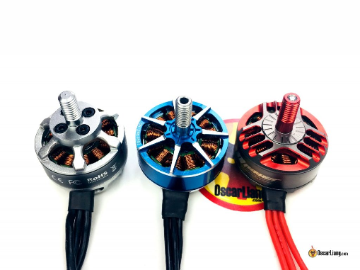

### **Типи магнітів** {#типи-магнітів}

Магніти, що використовуються в безколекторних двигунах, класифікуються за силою магнітного поля, наприклад N50, N52, N54, де більші числа вказують на сильніше магнітне поле. Наприклад, двигун з магнітами N52SH буде працювати  краще, ніж з магнітами N50SH.  
Сильніше магнітне поле теоретично дозволяє двигуну генерувати тягу більш ефективно, що призводить до більшого крутного моменту та швидшого часу відгуку. Однак двигун із сильнішим магнітним полем, як правило, має помітний опір (клацання) при обертанні руками. Це вказує на менш рівномірне магнітне поле та може призвести до менш плавної роботи двигуна, що погано. При обертанні руками деяких двигунів можна відчути «клацання», що є відображенням наскільки сильними є магніти. У двигунах із сильнішими магнітами «клацання» більш відчутне.   
Також важливо зазначити, що магніти можуть втратити свою магнітну силу при високих температурах, що може вплинути на роботу двигуна. Щоб вирішити цю проблему, виробники двигунів часто використовують магніти N52H, які витримують високі температури. Деякі двигуни навіть використовують магніти N52SH, які, як вважається, здатні витримувати вищі температури.  
Нарешті, нерідко магніти розхитуються від падінь або через вібрацію. Щоб вирішити цю проблему, достатньо приклеїти магніти на місце у корпусі двигуна, використовуючи клей [Loctite 438](https://www.henkel-adhesives.com/us/en/product/instant-adhesives/loctite_4380.html).

### **Дугові магніти** {#дугові-магніти}

Використовуючи дугові магніти, можна наблизити магніти до статора, створюючи менший і стабільніший повітряний зазор. Це, у свою чергу, забезпечує кращу продуктивність двигунів.  
На відміну від стандартних магнітів, у дугових магнітів найсильніша магнітна точка кожного полюса не знаходиться на поверхні магніту. Епіцентр поля полюса на зовнішній стороні кривої буде знаходитись під поверхнею магніту, а епіцентр полюса на внутрішній кривій фактично буде над поверхнею, що ще більше зближує магнітні поля постійних і електромагнітів.  
Під час  тестування міні-дронів з різною товщиною магнітів, виробники виявили, що менша товщина магніту (і, відповідно, слабше магнітне поле), а не тільки його форма, може дати помітну різницю в продуктивності.

### **Повітряний зазор** {#повітряний-зазор}

«Повітряний зазор» у двигуні  — це відстань між постійними магнітами та статором. Магнітна сила нелінійно зменшується з відстанню, тому зменшення зазору між ними значно підвищує потужність двигуна. Менший повітряний зазор не тільки робить двигун більш потужнішим, але й покращує крутний момент і відгук.  
Недоліком збільшення повітряного зазору є збільшення споживаного струму та зниження ефективності. Крім того, є вплив на довговічність: якщо корпус двигуна зазнає будь-якого удару і зміститься, магніт може зіткнутися зі статором і в кінцевому підсумку зламатися.

### **Ламінація статора** {#ламінація-статора}

Ламінація — це товщина окремих листів металу, вкладених у статор двигуна. Більш тонка ламінація дозволяє укладати більше шарів статорних пластин на ту саму висоту статора двигуна.  
Загалом, більш тонкі пластини статора краще впливають на продуктивність двигуна. Вони допомагають зменшити явище, відоме як вихровий струм *\[[Eddy](https://en.wikipedia.org/wiki/Eddy_current) current\]*, який генерує тепло у змінному магнітному середовищі. Більш тонкі шари означають, що менше енергії витрачається на генерацію вихрових струмів, що призводить до більш ефективної і потужної роботи двигунів.

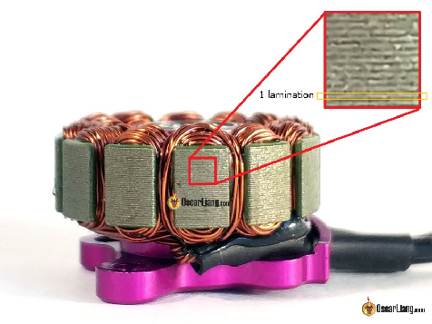  
*Ламінація статора двигуна*

### **Стопорне кільце / гвинт**  {#стопорне-кільце-/-гвинт}

Для закріплення валу двигуна FPV-дронів використовують один із трьох методів: стопорні кільця осьового монтажу, стопорні кільця радіального монтажу, або стопорні гвинти. Кожен метод має свій набір переваг і недоліків, тому важко визначити, який із них є найкращим.

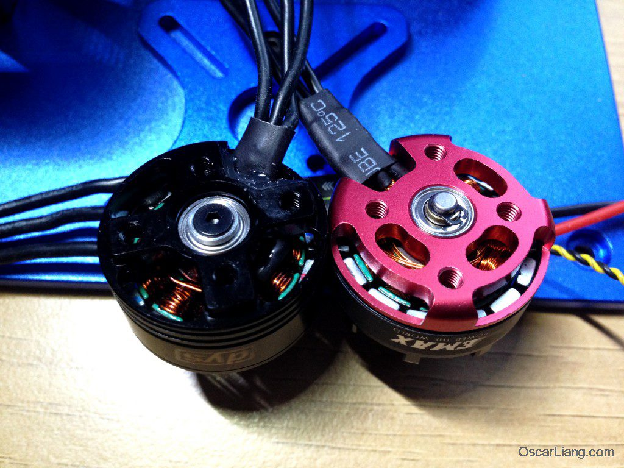*Стопорне кільце та гвинт на нижній частині вала двигуна*

Загалом, гвинти легше знімати і вони зручніші у обслуговуванні, ніж стопорні кільця. Однак гвинти можна надмірно затягнути, що призведе до блокування валу і ускладнення обертання двигуна.  
З іншого боку, стопорні кільця можуть вилітати під час польоту, що призведе до відриву корпуса двигуна і падіння. Гвинти теж не убезпечують від цієї проблеми, хоч і здаються більш надійним варіантом.

### **Алюмінієвий сплав** {#алюмінієвий-сплав}

Метал, з якого виготовлений корпус і основа двигуна, визначає довговічність двигуна. Існує два найпоширеніших типи алюмінієвих сплавів, що використовуються в двигунах FPV-дронів: 7075 і 6082\. Цифри позначають різні серії марок і хімічний склад алюмінієвих сплавів.  
Якщо коротко, то 6082 має більшу пластичність і краще піддається формуванню, тоді як 7075 є більш жорстким і краще витримує удари. 6082 використовувався ще до 2016/2017 років, але 7075 є найпоширенішим у сучасних двигунах і вважається більш стійким до ударів.

### 

### **Конструкція днища типу «Unibell»** {#конструкція-днища-типу-«unibell»}

Існує дві конструкції основи двигуна: більш традиційна «закритий низ» і більш сучасна «відкритий низ». В обох конструкціях є плюси і мінуси.

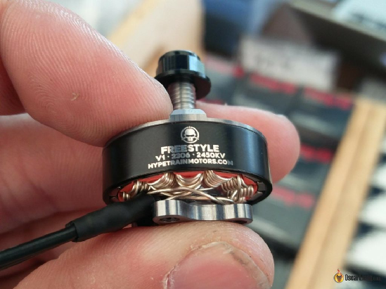

*Двигун з оголеним дном (відкрита основа двигуна)*

*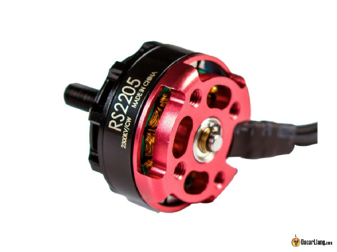*  
*Мотор із закритим низом*

Конструкція «закритий низ» має міцнішу основу, однак «відкритий низ» має тенденцію бути легшим завдяки видаленню надлишку матеріалу, економія ваги становить приблизно 2 грами.  
У двигунів із закритим низом менша ймовірність потрапляння бруду всередину корпусу. Але у двигунів з відкритим низом бруд легше вичищається.  
У двигуні із відкритим низом можна чітко побачити, наскільки глибоко вкручені гвинти, і зменшується ймовірність [замикання обмотки двигуна, якщо гвинти занадто довгі](https://oscarliang.com/check-motor-screws-touching-winding/). (Це часто трапляється з початківцями, які використовують двигуни із закритим низом.)

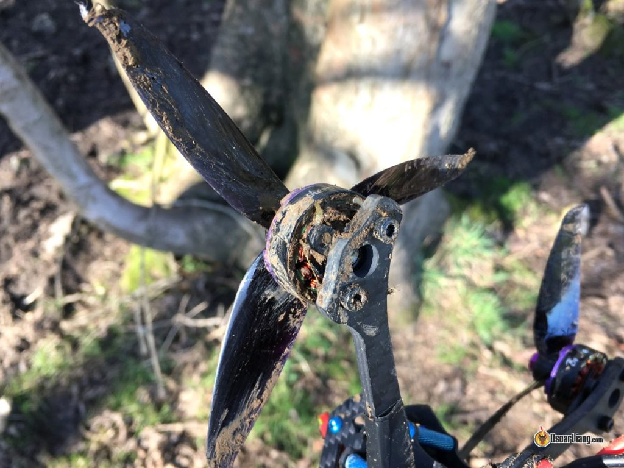*У двигуни з відкритим низом легко потрапляє бруд, але його також легше чистити*

Однак закритий низ забезпечує кращий доступ для ремонту дротів у разі падіння дрона та розтягування дротів.

### **Конструкція кільця магнітного потоку** {#конструкція-кільця-магнітного-потоку}

Кільце магнітного потоку — це кругле сталеве кільце всередині корпуса, яке містить магніти. Корпус зазвичай виготовляється з алюмінію, а кільце магнітного потоку — зі сталі, оскільки воно має реагувати на лінії магнітного поля.  
Найновіша конструкція кільця магнітного потоку має нестандартну, не круглу форму, що допомагає спрямувати назад у двигун більше магнітних силових ліній і підвищити крутний момент.

### **Технологія PoPo** {#технологія-popo}

Система «Pop on / Pop off» — це вал двигуна із підпружиненим підшипником для швидкого встановлення та зняття пропелерів. Ось [більш детальний огляд та перелік продуктів, що підтримують цю технологію](https://oscarliang.com/popo-motors-propellers/).

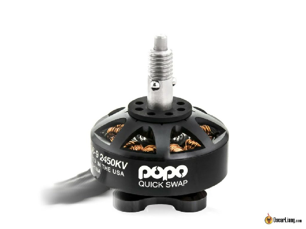

### **Інші функції** {#інші-функції}

* Контактні майданчики для пайки.  
* Інтеграція електронного контроллеру швидкості.   
* Конструкція із охолодженням.

Виробники двигунів постійно експериментують з різними конструкціями та рівнями інтеграції обладнання, що призвело до прогресу в охолодженні та навіть інтеграції електронного контроллеру швидкості всередину двигуна. Особисто я думаю, що контактні пластини для пайки на двигуні можуть бути корисними, вони дозволяють використовувати дріт меншого діаметру там, де не потрібна висока потужність, а отже, заощадять вагу. Крім того, їх можна буде легко відремонтувати, якщо дроти відірвуться, що неможливо зробити у двигуні типової конструкції.

## **Двигуни CW і CCW** {#двигуни-cw-і-ccw}

Ви рідко побачите безколекторні двигуни, позначені як CW (за годинниковою стрілкою) і CCW (проти годинникової стрілки).  
Це не вказання напрямку обертання двигуна. Безколекторні двигуни можуть обертатися в будь-якому напрямку. Ця позначка визначає напрямок різьблення болта двигуна. Це зроблено для того, щоб під час обертання двигуна крутний момент від пропелера штовхав гайку двигуна до затягування, а не до ослаблення. Це запобігає розхитуванню і відпаданню опор під час польоту. Це означає, що вам знадобиться по дві гайки для 4-х двигунів при стандартній схемі обертання Betaflight.

* Передній лівий: CW  
* Передній правий: CCW  
* Задній лівий: CCW  
* Задній правий: CW

*Щоб перевірити, чи встановлену двигун із правильною різьбою, потрібно просто тримати опорну гайку на валу, та почати рукою повертати двигун у напрямку, у якому він має обертатися. Якщо гайка затягується, то все правильно :)*  
Я вважаю за краще мати однакову різьбу на всіх двигунах, щоб не плутатись в різних гайках. Якщо потрібно замінити опорну гайку, знайти гайку з протилежною різьбою (або гайку з лівою різьбою) у будівельному магазині може стати справжнім головним болем.  В наш час використовуються контргайки (з гумовим покриттям всередині), вони відносно добре тримаються, коли їх затягують, і їх важко відкрутити.

#### **Історія редагування** {#історія-редагування}

* Жовтень 2013 — стаття створена.  
* Листопад 2016 — оновлено новими фактами.  
* Травень 2017 — додано «Характеристики двигуна».  
* Січень 2018 — виправлено деякі граматичні помилки.  
* Березень 2018 — додано інформацію про «обмотки», «полюси», «підшипники» і «крутний момент».  
* Жовтень 2018 — додано інформацію про схему кріплення, технологію PoPo.  
* Жовтень 2019 — Оновлено розділ про підключення до ESC.  
* Квітень 2022 — додано інформацію про Unibell.  
* Березень 2023 — статтю переглянуто, оновлено посилання на продукти.  
* May 2024 – Updated product links.  
  

[image1]: 

[image2]: 

[image3]: 

[image4]: 

[image5]: 

[image6]: 

[image7]: 

[image8]: 

[image9]: 

[image10]: 

[image11]: 

[image12]: 

[image13]: 

[image14]: 

[image15]: 

[image16]: 

[image17]: 

[image18]: 

[image19]: 

[image20]: 

[image21]: 

[image22]: 