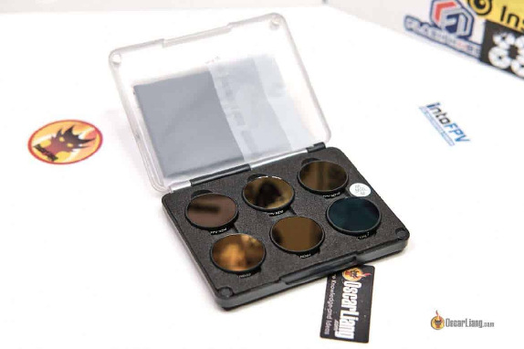
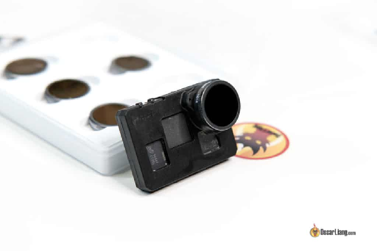
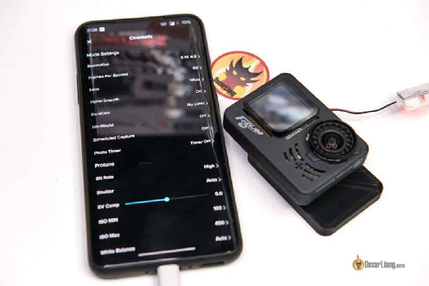
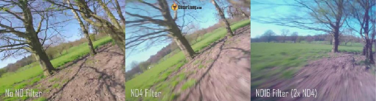
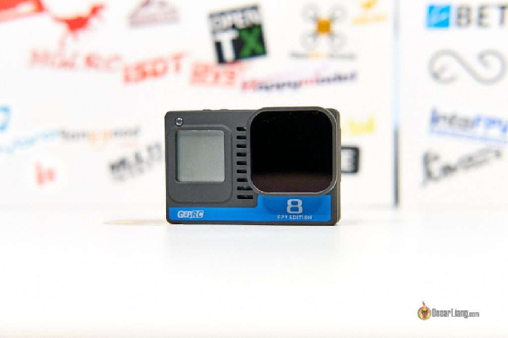
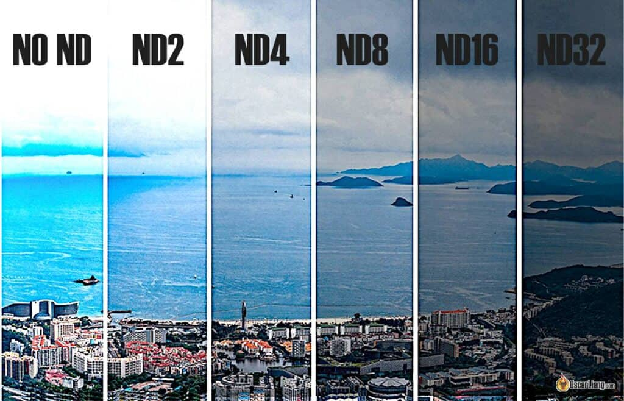

Стисле посилання на цей переклад: [https://bit.ly/LiangND-filterFPV](https://bit.ly/LiangND-filterFPV)   

|  | Нижче вичитаний людьми машинний український переклад оригіналу. Для [VictoryDrones](https://www.victory-drones.com/) переклад вичитали: Faina, Samsonovych. Хочете покращити переклад чи знайшли помилку? — Лишіть коментар (Ctrl+Alt+M або «Меню» \> «Вставка» \> «Коментар»). Ми теж живі люди (як і ви) і робимо помилки. Роботи їх, до речі, також роблять 😉 |
| :---: | :---- |

# Використання затемнюючих світлофільтрів для дронів FPV: як зробити відео більш кінематографічним

8 грудня 2022 р

Правильне використання затемнюючих світлофільтрів нейтральної щільності *\[ND\]* на камерах GoPro або інших [екшн камер](https://oscarliang.com/action-camera/)ах може значно покращити ваші FPV-відео, зробивши їх більш професійними та кінематографічними завдяки оптимальному рівню розмиття руху. У цьому посібнику я поясню, що таке світлофільтри нейтральної щільності *\[Neutral Density\]* і як їх ефективно використовувати, щоб підняти якість зображення на новий рівень.

*Деякі посилання на цій сторінці є партнерськими. Я отримую комісію (без додаткових витрат для вас), якщо ви робите покупку після натискання одного з цих партнерських посилань. Це допомагає підтримувати безкоштовний вміст для спільноти на цьому веб\-сайті. Будь ласка, прочитайте нашу [Політику партнерських посилань](https://oscarliang.com/affiliate-program-policy/) для отримання додаткової інформації.*

Зміст

[Рекомендації щодо фільтра ND](#рекомендації-щодо-фільтра-nd)

[Що таке фільтри ND?](#що-таке-фільтри-nd?)

[Витримка та розмиття руху](#витримка-та-розмиття-руху)

[Правило 180 градусів](#правило-180-градусів)

[Навіщо використовувати фільтр ND?](#навіщо-використовувати-фільтр-nd?)

[Як використовувати фільтр ND?](#як-використовувати-фільтр-nd?)

[Чи можуть фільтри ND видалити “желе”?](#чи-можуть-фільтри-nd-видалити-“желе”?)

[Історія редагування](#історія-редагування)

## 

## **Рекомендації щодо фільтра ND** {#рекомендації-щодо-фільтра-nd}

Придбайте фільтри ND для GoPro тут. Набір ND32, ND16 і ND8 забезпечить вам майже все:

* **Hero 11 і 11 міні:[https://amzn.to/3VkEsiF](https://amzn.to/3VkEsiF)**

* **Hero 9, 10, 11 і 11 міні:[https://oscarliang.com/product-gm8h](https://oscarliang.com/product-gm8h)**

* **GoPro 8 –[https://amzn.to/2MiJzxq](https://amzn.to/2MiJzxq)**

* **GoPro 6 і 7 –[https://amzn.to/2TUAKxU](https://amzn.to/2TUAKxU)**

## **Що таке фільтри ND?** {#що-таке-фільтри-nd?}

ND *\[Neutral Density\]* означає «нейтральна щільність»*\[прим. пер.: є ще градієнтні фільтри, у них є зона більшого затемнення, меншого затемнення і перехід між ними. Нейтральна щільність просто рівномірно затемнює весь кадр\]*. ND-фільтр зменшує експозицію зображення, не змінюючи колір зображення.

Для кінематографічних знімків FPV ми зазвичай прагнемо встановити швидкість затвора на фіксоване значення відносно частоти кадрів, яку ми використовуємо, дотримуючись так званого «правила 180 градусів» (яке я поясню незабаром). Ця техніка створює реалістичне розмиття руху, завдяки чому відео виглядає «кінематографічнішим». Однак, коли ми це робимо, зображення може неминуче бути перетриманим, коли багато світла, тоді в дію вступають фільтри ND (для зменшення експозиції).

[Ось відео](https://youtu.be/2yFTVmWiCR0), у якому порівнюється висока швидкість затвора без фільтра ND із низькою (фіксованою) швидкістю затвора з фільтром ND. Останній має більше розмиття руху, що надає відео інше відчуття.

[З/без фільтра ND відмінності Порівняння розмиття руху (Naked GoPro6)](https://youtu.be/2yFTVmWiCR0)

## **Витримка та розмиття руху** {#витримка-та-розмиття-руху}

Перш ніж зануритися в конкретні налаштування для використання на GoPro, корисно зрозуміти основи фотографії, якщо ви новачок у цій темі.

Три фактори контролюють експозицію зображення:

1. **Діафрагма**

2. **ISO**

3. **Швидкість затвора**

**Діафрагма** визначає, скільки світла досягає датчика зображення. Коли ви зменшуєте діафрагму, всередину потрапляє більше світла, і зображення стає яскравішим.

**ISO** – це цифрове підсилення, застосоване до яскравості зображення. Але це налаштування треба міняти в саму останню чергу, бо збільшення ISO також робить зображення шумнішим.

**Швидкість затвора** вказує, як довго затвор камери залишається відкритим, щоб пропускати світло. Цифрові камери, як-от GoPro, не мають механічних затворів, тому цей термін стосується тривалості, протягом якої датчик зображення знімає кадр.

Витримка впливає на розмиття під час руху в наших FPV відео. Коли ви зменшуєте витримку, затвор залишається відкритим довше, через що рухи в цьому кадрі розмиваються разом, створюючи розмиття руху.

Ось приклад: зліва направо швидкість затвора поступово зменшується при використанні вищого ND-фільтра, щоб підтримувати той самий рівень експозиції. Праворуч більше розмиття.

Майте на увазі, що занадто сильне розмиття руху не завжди є гарною ідеєю, оскільки це може призвести до того, що ваше відео буде не в фокусі. Ось чому вкрай важливо знати оптимальну кількість необхідного розмиття руху. Найкраще дотримуватися правила 180 градусів, яке я поясню нижче.

## **Правило 180 градусів** {#правило-180-градусів}

Правило 180 градусів просте: встановити витримку в два рази більше частоти кадрів. Наприклад, для відео з якістю 30 кадрів в секунду встановіть витримку 1/60, а для 60 кадрів в секунду встановіть швидкість затвора 1/120. Це називається кутом затвора 180 градусів, але в цій статті я не буду пояснювати як саме це працює.

Дотримання цього правила має забезпечити відповідну кількість розмиття руху. Якщо ви бажаєте отримати ще більше розмиття руху, можете спробувати кут затвора 360 градусів (максимальне обмеження), що означає встановлення швидкості затвора, що дорівнює частоті кадрів. Наприклад, для 30 кадрів/с встановіть витримку 1/30. Але це може стати занадто сильним розмиттям. Ви також можете поекспериментувати з кутами затвора від 180 до 360 градусів, але більшості з вас сподобається результат правилa 180 градусів.

Той самий принцип застосовується до знімків із високою частотою кадрів або уповільненої зйомки. Наприклад, для 240 кадрів/с вам потрібно збільшити витримку, щоб досягти такої ж кількості розмиття руху, наприклад, до 1/480.

Правило затвора на 180 градусів найкраще працює зі стабілізацією, наприклад із передбачуваними рухами камери на повзунку або підвісі. Однак у динамічних, хитких ситуаціях, як-от зйомка дроном FPV або екшн-камерою, це може призвести до надмірного розмиття. Натомість, вищі швидкості затвора (правило 90° або навіть 45°) можуть працювати краще, зменшуючи розмитість руху та сприяючи кращим результатам після стабілізації, оскільки надто розмиті кадри можуть погано працювати зі стабілізацією цифрового зображення. За правилом 90°– встановіть швидкість затвора на 1/120 для 30 кадрів в секунду або встановіть її на 1/240 для 60 кадрів в секунду (один на чотири кадри в секунду). За правилом 45°– встановіть швидкість затвора на 1/240 для 30 кадрів в секунду або встановіть її на 1/480 для 60 кадрів в секунду (у 8 разів більше кадрів в секунду).

Підсумовуючи, 180° добре підходить для повільних, розслаблених круїзних шоу. 90° краще для більш швидких і хитких знімків. Експериментуйте та подивіться, що вам найкраще підходить.

## **Навіщо використовувати фільтр ND?** {#навіщо-використовувати-фільтр-nd?}

З фіксованою швидкістю затвора ви можете використовувати лише діафрагму та ISO для зміни експозиції зображення. Але камери GoPro не мають налаштування діафрагми, тому нам залишається ISO – можна збільшити час експозиції за рахунок зменшення ISO.

Під час зйомки GoPro надворі ви можете виявити, що навіть якщо для ISO встановлено найнижче значення (100), зображення все одно буде надто яскравим і перетриманим. Саме тоді стане в нагоді фільтр ND, оскільки він зменшує кількість світла, що потрапляє в камеру.

## **Як використовувати фільтр ND?** {#як-використовувати-фільтр-nd?}

Я настійно рекомендую використовувати фільтри ND на вашій GoPro. Вони не лише покращують якість відео, забезпечуючи потрібну кількість розмиття під час руху, але й діють як захист об’єктива у разі аварії.

Фільтри ND бувають різної потужності: ND2, ND4, ND8, ND16, ND32, ND64 або навіть вище. Число вказує на ступінь зменшення світла, причому більше число означає більшу ступінь зменшення світла.

 

Ваш вибір нейтрального фільтра значною мірою залежить від середовища та умов освітлення. Ось мої особисті рекомендації:

* ND32: Сніжний день

* ND16: Сонячний день

* ND8: Хмарний день або рано вранці та пізно вдень за сонячних умов

* ND2 і ND4: використовуються рідко

* Без ND: відразу після заходу сонця

Важливо перевірити експозицію зображення (preview) перед зйомкою, щоб уникнути сюрпризів.

[Ось мої повні налаштування GoPro для оптимальних результатів](https://oscarliang.com/gopro-settings-fpv/).

Придбайте фільтри ND для GoPro тут. Набір ND32, ND16 і ND8 забезпечить вам майже все:

* **Hero 11 і 11 міні:[https://amzn.to/3VkEsiF](https://amzn.to/3VkEsiF)**

* **Hero 9, 10, 11 і 11 міні:[https://oscarliang.com/product-gm8h](https://oscarliang.com/product-gm8h)**

* **GoPro 8 –[https://amzn.to/2MiJzxq](https://amzn.to/2MiJzxq)**

* **GoPro 6 і 7 –[https://amzn.to/2TUAKxU](https://amzn.to/2TUAKxU)**

Деякі ND-фільтри можна накладати один на одного, щоб посилити ступінь зменшення світла. Хоча воно не завжди можливо, це корисно знати. Наприклад:

* ND2 \+ ND4 \= ND8

* ND4 \+ ND4 \= ND16

* ND4 \+ ND8 \= ND32

## **Чи можуть фільтри ND видалити “желе”?** {#чи-можуть-фільтри-nd-видалити-“желе”?}

«Желе» — це явище, яке з’являється, коли камера вібрує. “Желе” у відео FPV може бути викликане різними факторами, такими як погане налаштування PID, пошкоджені рами або пропелери та несправні вальниці *\[підшипники\]* двигуна.

З мого досвіду, фільтри ND можуть певною мірою зменшити “желе”. Однак, якщо ваш дрон відчуває значні вібрації, замість відображення рухів вгору-вниз або ліворуч-праворуч фільтр ND розмиває рухи разом, роблячи все розпливчастим і розфокусованим. Ця властивість може бути корисною для FPV-відео в деяких ситуаціях, але я б не покладався на ND-фільтр виключно з метою зменшення “желе”. Дуже важливо вирішити проблеми з вібрацією дрона, коли ви відчуваєте “желе”, а не просто «заклеїти пластиром велику проблему».

### **Історія редагування** {#історія-редагування}

* Квітень 2018 – допис створено

* Грудень 2022 – оновлено

**6 КОМЕНТАРІВ**

**maxo**

9 грудня 2022 р. \- 21:16

якщо ви використовуєте ND із HyperSmooth і Reelssteady, ви отримуєте жахливе відео, навіть якщо ви використовуєте правило 180 градусів

[ВІДПОВІДЬ](https://oscarliang.com/nd-filter-fpv/#comment-158470)

**ОСКАР**

9 грудня 2022 р. \- 22:50

Я постійно використовую Reelsteady, без проблем із фільтрами ND.

[ВІДПОВІДЬ](https://oscarliang.com/nd-filter-fpv/#comment-158476)

**Lee**

28 травня 2018 р. \- 18:37

Неприємний відблиск — це світло, що йде від країв скла. Якась матова чорна фарба для нігтів вирішила б це.

[image1]: 

[image2]: 

[image3]: 

[image4]: 

[image5]: 

[image6]: 

[image7]: 