Стисле посилання на цей переклад: [https://bit.ly/LiPo-Batteries-forFPV-Drones](https://bit.ly/LiPo-Batteries-forFPV-Drones)    

| 🫂 | Нижче вичитаний людьми машинний український переклад оригіналу. Для [VictoryDrones](https://www.victory-drones.com/) переклад вичитали: Kristina, Max Well, Faina. Хочете покращити переклад чи знайшли помилку? – Лишіть коментар (Ctrl+Alt+M або «Меню» \> «Вставка» \> «Коментар»). Ми теж живі люди (як і ви) і робимо помилки. Роботи їх, до речі, також роблять 😉 |
| :---- | :---- |

# Використання LiPo акумуляторів для FPV-дронів: посібник для початківців з рекомендаціями щодо найкращих технологій

28 січня 2023 року

Літій-полімерні (LiPo) акумулятори є неймовірним джерелом енергії для FPV дронів, зберігають значний обсяг енергії та мають велику продуктивність. Однак, якщо їх не використовувати правильно, вони можуть становити загрозу безпеці. Цей посібник охоплює основи використання LiPo акумуляторів для FPV дронів, включаючи безпечні методи зарядки та належні техніки зберігання.

*Деякі посилання на цій сторінці є партнерськими. Я отримую комісію (без додаткових витрат для вас), якщо ви робите покупку після натискання одного з цих партнерських посилань. Це допомагає підтримувати безкоштовний вміст для спільноти на цьому веб\-сайті. Будь ласка, прочитайте нашу [Політику партнерських посилань](https://oscarliang.com/affiliate-program-policy/) для отримання додаткової інформації.*

Відмова від відповідальності: інформація на цій сторінці призначена для загального ознайомлення. Безпека використання акумуляторa є вашою відповідальністю, і ви маєте використовувати надану інформацію на свій власний ризик.

Зміст

[Рекомендації щодо акумуляторів](#рекомендації-щодо-акумуляторів)

[GNB – бюджетний варіант №1](#gnb-–-бюджетний-варіант-№1)

[Dogcom – бюджетний варіант №2](#dogcom-–-бюджетний-варіант-№2)

[Серія RDQ – відмінна продуктивність для пілотів США](#серія-rdq-–-відмінна-продуктивність-для-пілотів-сша)

[Tattu R-Line – Топ лінійки](#tattu-r-line-–-топ-лінійки)

[Чи безпечні LiPo-акумулятори?](#чи-безпечні-lipo-акумулятори?)

[Розуміння основ роботи LiPo акумулятора](#розуміння-основ-роботи-lipo-акумулятора)

[Напруга LiPo акумулятора](#напруга-lipo-акумулятора)

[Кількість елементів](#кількість-елементів)

[Ємність](#ємність)

[Cтрумовіддача](#cтрумовіддача)

[Внутрішній опір](#внутрішній-опір)

[Роз'єм](#роз'єм)

[Роз'єм балансувального кабелю](#роз'єм-балансувального-кабелю)

[Балансування акумулятора](#балансування-акумулятора)

[Типи акумуляторів](#типи-акумуляторів)

[LiPo](#lipo)

[LiHV](#lihv)

[Li-Ion](#li-ion)

[Вибір правильного LiPo акумулятора](#вибір-правильного-lipo-акумулятора)

[Bага](#bага)

[Визначення споживання струму дроном](#визначення-споживання-струму-дроном)

[Вибір оптимальної ємності акумулятора](#вибір-оптимальної-ємності-акумулятора)

[Як заряджати LiPo](#як-заряджати-lipo)

[Вибір зарядного пристрою LiPo](#вибір-зарядного-пристрою-lipo)

[Підключення LiPo до зарядного пристрою](#підключення-lipo-до-зарядного-пристрою)

[Режими зарядки](#режими-зарядки)

[Важливість збалансованої зарядки](#важливість-збалансованої-зарядки)

[Швидкість заряджання: яка потрібна швидкість заряджання?](#швидкість-заряджання:-яка-потрібна-швидкість-заряджання?)

[Виберіть безпечне місце для зарядки](#виберіть-безпечне-місце-для-зарядки)

[Ніколи не залишайте LiPo акумулятори без нагляду](#ніколи-не-залишайте-lipo-акумулятори-без-нагляду)

[Інші правила техніки безпеки](#інші-правила-техніки-безпеки)

[Паралельна зарядка](#паралельна-зарядка)

[Зарядка LiPo акумуляторів 1S](#зарядка-lipo-акумуляторів-1s)

[Як безпечно використовувати LiPo акумулятори](#як-безпечно-використовувати-lipo-акумулятори)

[Не залишайте їх повністю зарядженими або порожніми протягом тривалого часу](#не-залишайте-їх-повністю-зарядженими-або-порожніми-протягом-тривалого-часу)

[Робоча температура](#робоча-температура)

[Коли приземлятися](#коли-приземлятися)

[Як зберігати LiPo акумулятори](#як-зберігати-lipo-акумулятори)

[LiPo безпечні сумки](#lipo-безпечні-сумки)

[Ящик для патронів](#ящик-для-патронів)

[Коробка для LiPo Bat-Safe Bat Safe Lipo Battery Charging Box](#коробка-для-lipo-bat-safe-bat-safe-lipo-battery-charging-box)

[Що робити з надмірно розрядженим LiPo](#що-робити-з-надмірно-розрядженим-lipo)

[Як перевозити LiPo акумулятори](#як-перевозити-lipo-акумулятори)

[Що робити, якщо загорівся LiPo акумулятор](#що-робити,-якщо-загорівся-lipo-акумулятор)

[Утилізація LiPo](#утилізація-lipo)

[Коли пора міняти LiPo акумулятор](#коли-пора-міняти-lipo-акумулятор)

[Як утилізувати LiPo акумулятори](#як-утилізувати-lipo-акумулятори)

[FAQ](#faq)

[Технічні умови](#технічні-умови)

[Висновок](#висновок)

[Історія редагування](#історія-редагування)

## **Рекомендації щодо акумуляторів** {#рекомендації-щодо-акумуляторів}

Вибираючи LiPo *\[літій-полімерний\]* акумулятор, завжди віддавайте перевагу відомим брендам, щоб забезпечити ефективність і продуктивність. Найпоширеніші LiPo акумулятори, які використовуються на 5-дюймових FPV-дронах – це 4S і 6S. Щоб зрозуміти відмінності між ними, подивіться: [https://oscarliang.com/6s-mini-quad-racing-drone/](https://oscarliang.com/6s-mini-quad-racing-drone/). Типова ємність акумулятора коливається між 1300-1600 мАг для 4S і 1000-1300 мАг для 6S.

Про менші акумулятори для мікро-дронів (Tiny whoops-малі вупи, 2″, 3″, 3,5″), читайте в цій публікації: [https://oscarliang.com/whoop-toothpick-lipo-battery/](https://oscarliang.com/whoop-toothpick-lipo-battery/)

#### **GNB – бюджетний варіант №1** {#gnb-–-бюджетний-варіант-№1}

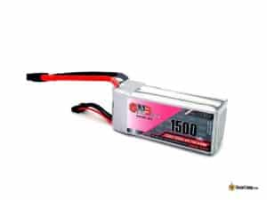

Початківцям не обов'язково інвестувати в акумулятори найвищого рівня, бо вам не знадобиться вся ця потужність, a в разі аварії ймовірність пошкодження можe збільшитись. На етапі навчання вибір економічно вигідного варіанту є розумнішим.

GNB довгий час був надійним бюджетним варіантом у світі FPV-дронів. Багато акумуляторiв, доступних на ринку, фактично є ребрендингом GNB, що демонструє довіру галузі до їхньої продукції.

**Сторінка виробу**

**4S 1500mAh: [https://s.click.aliexpress.com/e/\_DDR5SFB](https://s.click.aliexpress.com/e/_DDR5SFB)**  
**6S 1100mAh: [https://s.click.aliexpress.com/e/\_DB0ypHX](https://s.click.aliexpress.com/e/_DB0ypHX)**  
**Інша напруга/ємність: [https://oscarliang.com/product-mzqb](https://oscarliang.com/product-mzqb)**

#### 

#### **Dogcom – бюджетний варіант №2** {#dogcom-–-бюджетний-варіант-№2}

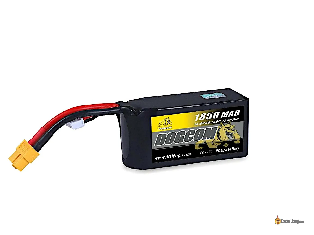

Окрім GNB, CNHL (China Hobby Line) є чудовим бюджетним акумулятором, доступним в усьому світі. Але за відмінні характеристики елементів доводиться платити тим, що вони трохи більші та важчі, ніж інші бренди цього класу, але воно того варте, якщо вам потрібна додаткова потужність.

**Сторінка виробу**

**RDQ: [https://oscarliang.com/product-c8tk](https://oscarliang.com/product-c8tk)**  
**AliExpress: [https://s.click.aliexpress.com/e/\_DlbzRMD](https://s.click.aliexpress.com/e/_DlbzRMD)**

#### 

#### **Серія RDQ – відмінна продуктивність для пілотів США** {#серія-rdq-–-відмінна-продуктивність-для-пілотів-сша}

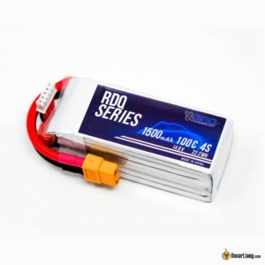

Один із найкращих акумуляторів за свою ціну. Продається ексклюзивно через RDQ, тому це чудовий варіант для північноамериканських пілотів.

**Сторінка виробу**

**4S 1300mAh: [https://oscarliang.com/product-h2dh](https://oscarliang.com/product-h2dh)**  
**4S 1500mAh: [https://oscarliang.com/product-dk0h](https://oscarliang.com/product-dk0h)**  
**6S 1000mAh: [https://oscarliang.com/product-trm1](https://oscarliang.com/product-trm1)**  
**Інша напруга/ємність: [https://oscarliang.com/product-gjgw](https://oscarliang.com/product-gjgw)**

#### 

#### **Tattu R-Line – Топ лінійки** {#tattu-r-line-–-топ-лінійки}

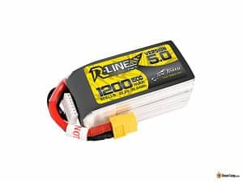

Tattu R-Line віддають перевагу багато провідних FPV-пілотів, що говорить про якість і продуктивність акумулятора. R-Line може бути найдорожчим варіантом у списку, деякі користувачі повідомляють про швидше зниження продуктивності порівняно з іншими акумуляторами. Однак, якщо ви шукаєте першокласну продуктивність і готові заплатити за неї, Tattu R-Line варто розглянути.

**6S 1200mAh:**  
**RDQ: [https://oscarliang.com/product-f80m](https://oscarliang.com/product-f80m)**  
**GetFPV: [https://oscarliang.com/product-38v6](https://oscarliang.com/product-38v6)**  
**AliExpress: [https://s.click.aliexpress.com/e/\_DmJXvoD](https://s.click.aliexpress.com/e/_DmJXvoD)**

**4S 1300mAh:**

**AliExpress: [https://s.click.aliexpress.com/e/\_DnS3Yi1](https://s.click.aliexpress.com/e/_DnS3Yi1)**  
**GetFPV: [https://oscarliang.com/product-iev3](https://oscarliang.com/product-iev3)**  
**RDQ: [https://oscarliang.com/product-e216](https://oscarliang.com/product-e216)**

## 

## **Чи безпечні LiPo-акумулятори?** {#чи-безпечні-lipo-акумулятори?}

За правильного поводження LiPo акумулятори абсолютно безпечні. Проте, [LiPo можуть спалахнути через неправильне поводження або фізичні пошкодження](http://intofpv.com/t-what-can-cause-lipo-battery-fire). Безпечне використання передбачає дбайливе ставлення та пильність у поводженні з акумуляторами.

## **Розуміння основ роботи LiPo акумулятора** {#розуміння-основ-роботи-lipo-акумулятора}

Літій-полімерні або LiPo акумулятори мають виняткове співвідношення потужності до ваги, що робить їх ідеальним вибором для дронів FPV.

Щоб обрати відповідний LiPo акумулятор, важливо навчитися розуміти його характеристики та ознайомитися з основною термінологією, яка буде пояснена в наступних розділах.

### **Напруга LiPo акумулятора**  {#напруга-lipo-акумулятора}

LiPo акумулятори складаються з окремих елементів, кожен з яких має номінальну напругу 3,7 В, що зазначена на етикетці акумулятора.

LiPo акумулятор призначений для безпечної роботи в певному діапазоні напруги \- як правило, від 3,0 В до 4,2 В. Надмірна зарядка LiPo акумулятора понад 4,2 В є небезпечною та може призвести до пожежі. Розряджання нижче 3 В може призвести до незворотного погіршення продуктивності або пошкодження акумулятора. Ця мінімальна напруга також називається *порогова напруга відключення*. Зазвичай рекомендується припинити розряджання, коли напруга на кожному елементі досягає 3,5 В, щоб подовжити термін служби акумулятора.

### **Кількість елементів** {#кількість-елементів}

Літій-полімерні акумулятори можуть мати кілька елементів. Позначення «S» на акумуляторі вказує на кількість елементів. Так, акумулятор 6S має шість елементів, а акумулятор 4S \- чотири. Оскільки кожен елемент має номінальну напругу 3,7 В, то акумулятор 4S має номінальну напругу 4 \* 3,7 В \= 14,8 В, тоді як акумулятор 6S має номінальну напругу 6 \* 3,7 В \= 22,2 В. 

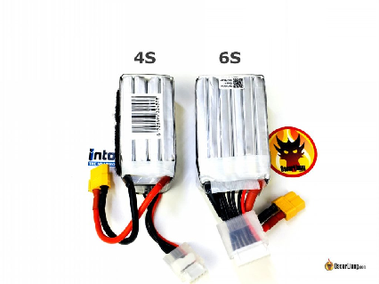

Напруга акумулятора безпосередньо впливає на швидкість мотора, тому використання акумулятора з більшою кількістю елементів може збільшити потужність вашого дрона (за умови, що електроніка дрона підтримує вищу напругу). Однак додавання більшої кількості елементів також робить акумулятор важчим.

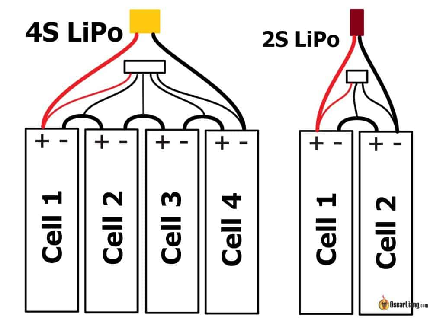

На аматорському рівні ми зазвичай називаємо акумулятори за кількістю елементів або позначенням «S»:

* 1S \= 1 елемент \= 3,7 В

* 2S \= 2 елементи \= 7,4 В

* 3S \= 3 елементи \= 11,1 В

* 4S \= 4 елементи \= 14,8 В

* 5S \= 5 елементів \= 18,5 В

* 6S \= 6 елементів \= 22,2 В

Наприклад, ми називаємо акумулятор на 14,8 В «4-елементним» або просто «4S».

Цікаві факти:

* Послідовне з’єднання двох однакових акумуляторів подвоює напругу, але не змінює ємність (наприклад, два акумулятора 2S 1000 мАг стають акумулятором 4S 1000 мАг). Паралельне підключення подвоює ємність, зберігаючи ту саму напругу (наприклад, 2S 2000 мАг).

* LiPo також може використовувати позначку «P» для позначення напруги, де «P» вказує на кількість паралельно з'єднаних елементів. 2S1P означає «2 елементи послідовно й 1 елемент паралельно». Якщо на акумуляторі немає літери «P», вважається, що це «1P», тому 2S1P і 2S – це одне і те саме.

* 3S2P означає «3 елементи послідовно та 2 елементи паралельно». Цей акумулятор має загалом 6 елементів із 2 паралельними групами елементів, кожна з яких містить 3 послідовно з'єднані елементи.

### **Ємність** {#ємність}

Ємність LiPo акумулятора, що вимірюється в мАг (міліампер-година), показує, який струм ви можете споживати від акумулятора безперервно протягом години, поки він не розрядиться. Зверніть увагу, що 1000mAh дорівнює 1Ah.

Наприклад, LiPo ємністю 1300 мАг (або 1,3 Аг) повністю розряджається за годину, якщо ви споживаєте від нього постійний струм 1,3 А. Якщо подвоїти струм до 2,6 А, то час розрядки скоротиться вдвічі (1,3/2,6=0,5). Якщо ви будете безперервно споживати струм 39 А, то пакету вистачить лише на 2 хвилини (1,3/39=1/30 години).

Збільшення ємності акумулятора може забезпечити довший час польоту, але компромісом є важчий і більший акумулятор. Вага суттєво впливає на тривалість польоту, тому для максимальної ефективності важливо обрати акумулятор з оптимальним співвідношенням між ємністю та вагою.

Як пояснюється в наступному розділі, акумулятори більшої ємності також можуть забезпечувати більший струм розряду.

### **Cтрумовіддача** {#cтрумовіддача}

Струмовіддача *\[C Rating\]*– це показник максимального струму, який ви можете безпечно споживати від LiPo акумулятора, не завдаючи йому шкоди. Теоретично це можна розрахувати за формулою:

**Максимальний споживаний струм** \= **Ємність** × **Cтрумовіддача**

Споживання струму, більшого, ніж зазначено у струмовіддачі, не рекомендується, оскільки це може призвести до перегріву акумулятора, [збільшення внутрішнього опору з часом](https://docs.google.com/document/d/1z81MG_lfPweYWR3DJJwnwD3a8T3FUnQbFnd-9InaC58/edit), скорочення терміну служби акумулятора, а в екстремальних випадках – навіть до перегрівання (загоряння).

Акумулятори з вищими показниками струмовіддачі, як правило, важчі та більші навіть за тієї самої ємності. Наприклад, ці два акумулятори 4S ємністю 650 мАг, показані на зображенні, мають різну вагу та розміри через різну струмовіддачу.

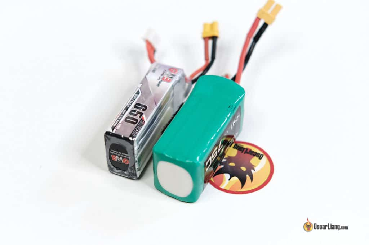  

Акумулятор із вищою струмовіддачею забезпечує кращу продуктивність, особливо для дронів, які споживають багато енергії, але це не завжди найкращий вибір. На малопотужному дроні додаткова потужність акумулятора з вищим класом струмовіддачі може бути не потрібна, а додаткова вага може бути непродуктивною та призвести до скорочення часу польоту. Вся справа у використанні правильного інструменту для роботи.

Хоча струмовіддача може бути корисним інструментом, останніми роками вона стала здебільшого маркетинговим інструментом, тому сприймайте її трохи скептично. Бренди можуть завищувати показники струмовіддачі, що робить безглуздим порівняння між брендами. Однак це може бути корисним для вибору батареї одного бренду, за умови, що вони відповідають одному стандарту. Якщо ви обираєте акумулятори за нашими рекомендаціями, не звертайте багато уваги на струмовіддачу.

### **Внутрішній опір** {#внутрішній-опір}

Всі електричні компоненти, включаючи батареї, мають опір. Опір всередині акумулятора називається внутрішнім опором*\[IR\]*, який показує, який струм витримує акумулятор. Внутрішній опір можна використовувати для вимірювання продуктивності LiPo акумулятора. Нижчий внутрішній опір означає, що акумулятор може ефективніше забезпечувати живленням ваш FPV-дрон.

Контроль внутрішнього опору з плином часу також корисний для визначення часу виходу з експлуатації LiPo акумулятора. Внутрішній опір елементів LiPo поступово зростає з часом і використанням, що є неминучим і незворотнім процесом. Такі дії можуть прискорити старіння акумулятора:

* Надмірна розрядка та надмірна зарядка

* Занадто сильне навантаження на акумулятор шляхом розряду протягом тривалого періоду з вищим струмом, ніж це передбачено

* Перегрів

Найбільшим фактором, що впливає на максимальну швидкість розряду акумулятора, є його внутрішній опір. Високий ВО призводить до більш помітного падіння напруги, коли ви збільшуєте тягy, явище, відоме як «просадка напруги». Коли напруга знижується, двигуни втрачають оберти/хв, і дрон стає менш потужним і чуйним.

Деякі батареї призначені для застосування з низьким струмом (наприклад, з номінальною струмовіддачею 8C або 10C для живлення радіосистеми), які за своєю суттю мають вищий внутрішній опір. Літій-іонні батареї 18650 також мають вищий внутрішній опір, ніж звичайні LiPo акумулятори, що є нормальним.

Для отримання додаткової інформації про те, коли міняти акумулятор і як виміряти внутрішній опір, перегляньте нашу статтю на цю тему: [https://oscarliang.com/when-retire-lipo-battery/](https://docs.google.com/document/d/1z81MG_lfPweYWR3DJJwnwD3a8T3FUnQbFnd-9InaC58/edit) (українською)

### **Роз'єм** {#роз'єм}

Усі LiPo акумулятори постачаються з двома наборами проводів/роз'ємів: розрядний роз’єм (основний кабель) і балансувальний роз’єм (балансувальний кабель). Однак батареї 1S мають лише розрядний роз'єм, оскільки для 1 елемента балансування не потрібно.

Розрядний кабель зазвичай складається з двох товстих червоного та чорного проводів, які використовуються для живлення дрона FPV.

Інший набір менших проводів підключається до білого роз'єму; це балансувальний кабель. Кількість проводів залежить від кількості елементів акумулятора.

Найпоширенішим розрядним роз'ємом є XT60, який в основному використовується в 5-дюймових FPV-дронах або більше. Для менших дронів часто використовується XT30, менша версія XT60. Вони мають схожу форму, але відрізняються за розмірами та потужністю струму.

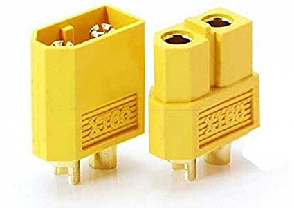

Інші роз'єми батареї, які зазвичай використовуються в безпілотниках FPV та обладнанні, включають:

| Назва | Зображення | Напруга | Калібр проводу |
| ----- | ----- | ----- | ----- |
| PH2.0 і BT2.0 |  | 1S | 22-28AWG |
| GNB27 |  | 1S, 2S | 20-28AWG |
| XT30 | 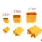 | 2S, 3S, 4S | 20-26AWG |
| XT60 | 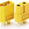 |  3S, 4S, 5S, 6S | 12-18AWG |

Для отримання додаткової інформації про електричні кабелі та роз'єми зверніться до нашої докладної статті на цю тему: [https://oscarliang.com/wires-connectors/](https://docs.google.com/document/d/1o70C2QdMVJLQxNZIyVU7-LoGDIpUwKuDZjBKaQCUxSE/edit)

### **Роз'єм балансувального кабелю** {#роз'єм-балансувального-кабелю}

LiPo акумулятори з кількома елементами завжди матимуть балансувальний кабель, призначений для контролю та балансування напруги елементів. Офіційна назва роз'єму балансувального кабелю – JST-XH.

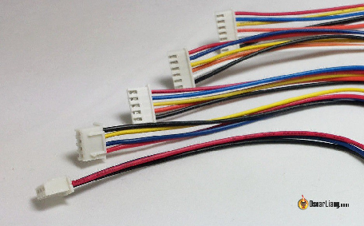

Під час заряджання балансувальний кабель потрібно під'єднати до зарядного пристрою. Це дозволяє зарядному пристрою перевіряти та балансувати напругу кожного елемента під час заряджання. Важливо: завжди підключайте балансувальний кабель перед заряджанням\!

Кількість проводів у балансировочному кабелі починається з 3 для 2S LiPo, і це число збільшується на 1 з кожним збільшенням кількості елементів:

* 2S – 3 проводи

* 3S – 4 проводи

* 4S – 5 проводів

* 5S – 6 проводів

* 6S – 7 проводів

Нерідкі випадки, коли пропелери, що обертаються під час польоту, пошкоджують балансувальний кабель. Щоб дізнатися, як відремонтувати балансувальний кабель, зверніться до нашого докладного посібника: [https://oscarliang.com/fix-balance-plug-lipo-replace/](https://oscarliang.com/fix-balance-plug-lipo-replace/)

### **Балансування акумулятора** {#балансування-акумулятора}

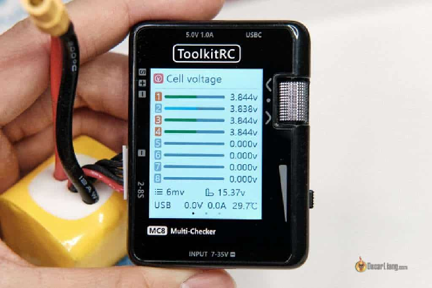

Перед використанням важливо переконатися, що елементи в акумуляторі перебувають на однаковому рівні заряду, інакше є ризик надмірного розряджання елементів із низькою напругою. Крім того, якщо акумуляторна батарея постійно незбалансованa, елементи, ймовірно, мають різний внутрішній опір, і їх слід перевіряти ретельніше.

Просто підключіть балансувальний кабель до пристрою перевірки напруги, і він покаже напругу всіх елементів. Про перевірку напруги тут: [https://oscarliang.com/fpv-tools/\#LiPo-Voltage-Checker](https://docs.google.com/document/d/169v_6P9B-bfCBDVsBNlSNOGG2uyx0vyTRtJ4EFGfI74/edit) (Українською)

## **Типи акумуляторів** {#типи-акумуляторів}

### **LiPo** {#lipo}

LiPo означає літій-полімер, це стандартна хімічна батарея, яка використовується для гоночних і фрістайл-дронів FPV. LiPo має вольтаж повного заряду 4,2 В і вольтаж елементу у режимі «зберігання» 3,85 В.

### **LiHV** {#lihv}

LiHV – це особливий тип LiPo акумулятора, де HV означає «висока напруга». Вони є більш енергоємними, ніж традиційні LiPo акумулятори, і їх можна заряджати до 4,35 В на елемент (на відміну від стандартних 4,20 В). Однак існують неоднозначні відгуки щодо довговічності акумуляторів LiHV, оскільки вони можуть мати зниження продуктивності раніше, ніж звичайні LiPo. [У нашій публікації ми порівнювали LiHV батарею з LiPo з точки зору продуктивності](https://oscarliang.com/lihv-lipo-drone-battery-hvli/). Незважаючи на ці мінуси, [Акумулятори LiHV стали популярним вибором для 1S Tiny Whoops](https://docs.google.com/document/d/1ngEiojqBdi4zSps7nWCmysh8VqM02WEw0fXrJzm4nNc/edit) оскільки вплив високої напруги є значним.

### **Li-Ion** {#li-ion}

Li-Ion розшифровується як літій-іонний, зазвичай має набагато вищу ємність порівняно з LiPo тієї ж ваги. Завдяки більшій ємності на вагу літій-іонні батареї чудово підходять для польотів на великі відстані. Однак він має набагато нижчу продуктивність розряджання, що робить його непридатним для агресивних польотів. Дізнайтеся більше про Li-Ion акумулятори та рекомендації тут: [https://oscarliang.com/li-ion-battery-long-range/](https://docs.google.com/document/d/1x5lKHJagW-M0YtYIYvgUmoX3pO_T1eNk2RYpU9y4ywQ/edit) (Українською)

## **Вибір правильного LiPo акумулятора** {#вибір-правильного-lipo-акумулятора}

Якщо ви дотримуєтеся моїх рекомендацій щодо LiPo акумулятора, можете не турбуватися про розрахунки, які я покажу вам нижче. Також уникайте невідомих виробників акумуляторів і дотримуйтеся авторитетних брендів, таких як:

* GNB (Gaoneng)

* CNHL (China Hobby Line)

* Lumenier (GetFPV)

* RDQ

* Rebel Batteries  
* Tattu R-Line

Ось я покажу вам, як вибрати ідеальний акумулятор для вашого дрона.

### **Bага** {#bага}

Як правило, акумулятор має важити приблизно 1/2 ваги дрона для фрістайлу/гонок. І вам можна майже ні на що інше не зважати, якщо ви дотримуєтесь моїх рекомендацій щодо батареї, бо продуктивність має бути достатньо хорошою. Якщо у вас є дрон іншого розміру або вагової категорії, ви можете дотримуватися наведених нижче додаткових правил.

### **Визначення споживання струму дроном** {#визначення-споживання-струму-дроном}

Визначившись із розмірами мотора та пропелера, ви зможете знайти дані про тягу вашого мотора, а також споживання струму для сумісних розмірів пропелера. Наприклад, з мотором з таблиці нижче і 5040 × 3 пропелерами він споживає до 36,74 А при 100% значення стіка «тяга» *\[throttle\].*

Загальне максимальне споживання струму для квадрокоптера з чотирма двигунами становитиме 36,74 x 4 \= 146,96 A при 100% тяги. Якщо ви хочете перестрахуватися, ви можете використовувати це число, щоб знайти аккумулятор з досить високою струмовіддачею. Однак я зазвичай зменшую його на 30-40% з двох причин: по-перше, ми рідко літаємо на 100% тяги довше кількох секунд (я особисто переважно літаю на 40-60% тяги); і по-друге, двигуни споживають значно менше амперів у реальному житті, ніж під час статичних стендових випробувань.

Незважаючи на те, що інші компоненти також споживають струм, їх вплив незначний порівняно з двигунами, тому їх зазвичай можна не враховувати.

### **Вибір оптимальної ємності акумулятора** {#вибір-оптимальної-ємності-акумулятора}

Тепер вам потрібно визначити відповідну ємність акумулятора, яка залежить від розміру вашого квадрокоптера та необхідної струмовіддачі. Ось загальна вказівка, якої я особисто дотримуюся:

Для 4S LiPo:

6 дюймів: 1500 мАг \- 2200 мАг 5 дюймів: 1300 мАг \- 1800 мАг 4 дюйми: 850 мАг \- 1300ммАг 3 дюйми: 650 мАг \-1000 мАг

Для 6S LiPo:

6 дюймів: 1200 мАг \- 1500 мАг 5 дюймів: 900 мАг \- 1300 мАг 4 дюйми: 550 мАг \- 900ммАг 3 дюйми: 400 мАг \- 650 мАг

Звідси ми можемо розрахувати необхідну **струмовіддачу** за цією формулою:

струмовіддачa \= споживання струму / потужність

## **Як заряджати LiPo** {#як-заряджати-lipo}

### **Вибір зарядного пристрою LiPo** {#вибір-зарядного-пристрою-lipo}

Щоб заряджати LiPo акумулятори, вам знадобиться зарядний пристрій, спеціально розроблений для них, бо LiPo акумулятори мають суворі вимоги до зарядки. Ви можете дізнатися, як вибрати якісний зарядний пристрій LiPo у цьому довіднику: [https://oscarliang.com/choose-lipo-battery-charger-power-supply/](https://docs.google.com/document/d/1egsNC9JuxWnnwkkW3wixO5ENOZ3jMYiwQw1Mor-qvgQ/edit) (Українською)

Якщо ви обираєте зарядний пристрій із моїх рекомендацій, то ось інформація.

### **Підключення LiPo до зарядного пристрою** {#підключення-lipo-до-зарядного-пристрою}

Зарядити LiPo акумулятори за допомогою більшості сучасних зарядних пристроїв досить просто. Як правило, вам просто потрібно підключити XT60 і збалансувати роз’єми, встановити кілька параметрів, і все готово.

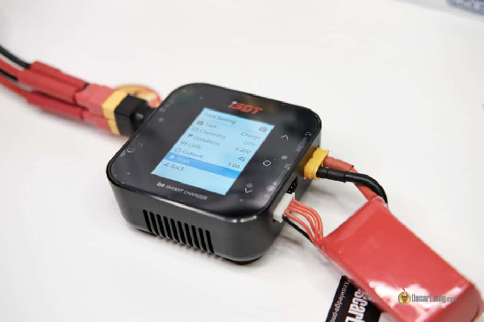

### **Режими зарядки** {#режими-зарядки}

* Балансовий заряд: під час заряджання батареї зарядний пристрій контролює напругу кожного елемента та підтримує їх баланс. Це найбезпечніший і найбільш рекомендований спосіб зарядки LiPo акумулятора.

* Заряджання у режимі «зберігання»: зарядний пристрій забезпечує кожний елемент напругою режимy «зберігання» (яка становить від 3,80 В до 3,85 В, залежно від зарядного пристрою).

* Розрядка: зарядний пристрій намагається розрядити LiPo акумулятор (цей процес може бути дуже повільним, залежно від потужності розряду зарядного пристрою).

### **Важливість збалансованої зарядки**  {#важливість-збалансованої-зарядки}

Завжди підключайте балансувальний кабель перед заряджанням.

Кожен елемент батареї має невеликі відмінності, і після польоту ви можете виявити, що напруги елементів відрізняються. Заряджання батареї з незбалансованою напругою елемента без використання балансувального кабелю може призвести до того, що напруга деяких елементів впаде нижче 4,2 В, а інших перевищує 4,2 В, що є небезпечним.

Більшість сучасних зарядних пристроїв LiPo мають збалансовану зарядку як єдиний режим зарядки. Якщо у вас є дешевий або старий зарядний пристрій, який дозволяє заряджати без балансувального кабелю, негайно викиньте його та придбайте відповідний зарядний пристрій. Заряджати без балансувального кабелю небезпечно\!

### **Швидкість заряджання: яка потрібна швидкість заряджання?** {#швидкість-заряджання:-яка-потрібна-швидкість-заряджання?}

Рекомендується заряджати LiPo акумулятори при 1C або нижче, оскільки це найменше навантажує батарею. Це означає, встановити зарядний струм пропорційно ємності акумулятора 1:1. Наприклад, для LiPo ємністю 1500 мАг зарядка на 1C означає встановлення струму заряду 1,5A (1C x 1500mA), а для батареї 900mAh це 0,9A і так далі.

Цікавий факт: зарядка на 1C триватиме приблизно одну годину, щоб повністю зарядити розряджений акумулятор.

Зараз багато акумуляторів підтримують швидшу зарядку, наприклад при 3C або навіть 5C. Перш ніж заряджати з високою швидкістю, переконайтеся, що ви розумієте характеристики свого LiPo. Якщо ви сумніваєтеся, просто заряджайте на 1C, оскільки зарядка акумулятора на вищих рівнях C збільшує ризик перегріву LiPo або пожежі.

### **Виберіть безпечне місце для зарядки** {#виберіть-безпечне-місце-для-зарядки}

Дуже важливо заряджати акумулятори в місці, де немає легкозаймистих предметів і матеріалів. Якщо ви заряджаєтеся в приміщенні, намагайтеся робити це біля вікна чи дверей, щоб у разі пожежі можна було швидко викинути батарею.

Я особисто зберігаю та заряджаю свої батареї в ящику для патронів ([доступний на Amazon](https://amzn.to/2Yi1Q1O)). Не покладайтеся виключно на «сумки LiPo»; вони можуть уповільнити пожежу LiPo, але не зможуть повністю її стримати. Завжди тримайте вогнегасник поблизу, коли заряджаєте акумулятори.

### **Ніколи не залишайте LiPo акумулятори без нагляду** {#ніколи-не-залишайте-lipo-акумулятори-без-нагляду}

Не виходьте з кімнати під час зарядки акумуляторів. Багато пожеж, пов'язаних із LiPo, виникають через те, що люди залишають акумулятор в процесі заряджання без нагляду. Завжди пильнуйте LiPo акумулятори під час заряджання. Регулярно перевіряйте їх температуру; вони повинні залишатися прохолодними. Якщо батарея нагріється або почне набрякати, припиніть зарядку та перевірте. Це може бути несправний LiPo, який потрібно вивести з експлуатації, проблема перезарядки або просто надто швидка зарядка.

### **Інші правила техніки безпеки** {#інші-правила-техніки-безпеки}

Неправильне поводження з LiPo акумуляторами може призвести до пожежі. Будь ласка, ознайомтеся з цими правилами безпеки, перш ніж працювати з акумуляторами або заряджати їх:

* Беріть LiPo акумулятори за корпус, а не за дроти, які можна відірвати від крихких паяних з’єднань.

* Після польоту дайте акумуляторам повністю охолонути, перш ніж заряджати.

* Ніколи не використовуйте та не заряджайте пошкоджений або набряклий акумулятор.

* Перед заряджанням переконайтеся, що на зарядному пристрої правильно встановлено кількість елементів і тип батареї.

* Уникайте перезарядки. Хоча розумні зарядні пристрої зазвичай можуть подбати про це за вас, доцільно регулярно перевіряти напругу в елементі.

* Тримайте акумулятори подалі від прямих сонячних променів.

* Завжди виймайте акумулятори з пристрою, який він живить, і розміщуйте в безпечному місці перед заряджанням.

* Ніколи не коротіть виходи акумулятора.

### **Паралельна зарядка** {#паралельна-зарядка}

Паралельна зарядка не дуже безпечний метод заряджання LiPo акумуляторів, але вона пропонує швидкий спосіб заряджати декілька батарей одночасно. У мене є вичерпний посібник, який пояснює, як безпечно виконувати паралельну зарядку: [https://oscarliang.com/parallel-charging-multiple-lipo/](https://oscarliang.com/parallel-charging-multiple-lipo/)

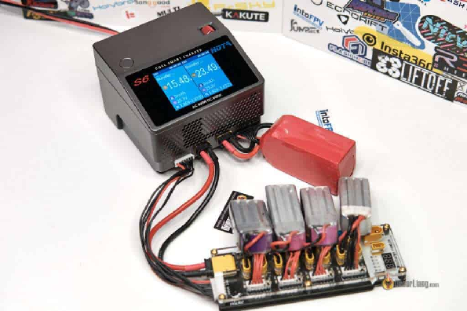

### **Зарядка LiPo акумуляторів 1S**  {#зарядка-lipo-акумуляторів-1s}

Заряджання маленьких акумуляторів 1S може дещо відрізнятися від заряджання великих пакетів. Одним із варіантів є зарядка кількох батарей 1S за допомогою паралельної плати, яка по суті об'єднує їх як одну велику батарею 1S. Однак найефективнішим способом заряджання акумуляторів 1S є використання спеціального зарядного пристрою для акумуляторів 1S або плати послідовного заряджання. Перегляньте мої рекомендації щодо зарядних пристроїв 1S тут: [https://oscarliang.com/best-tiny-whoop/\#Best-Tiny-Whoop-Chargers](https://docs.google.com/document/d/1ngEiojqBdi4zSps7nWCmysh8VqM02WEw0fXrJzm4nNc/edit) (Українською)

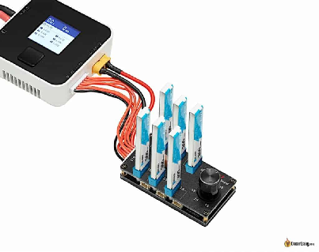

## **Як безпечно використовувати LiPo акумулятори**  {#як-безпечно-використовувати-lipo-акумулятори}

### **Не залишайте їх повністю зарядженими або порожніми протягом тривалого часу** {#не-залишайте-їх-повністю-зарядженими-або-порожніми-протягом-тривалого-часу}

Найкраще використовувати повністю заряджені LiPo акумулятори якнайшвидше та повернути їх до напруги у режимі «зберігання» після завершення. Aкумулятори, які не відповідають напрузі у режимі «зберігання», з часом розряджаються швидше. Як правило, більшість людей вважають прийнятним залишати батареї повністю зарядженими або розрядженими на кілька днів. Однак, якщо ви не плануєте літати довше ніж пару тижнів, найкраще поставити акумулятори на напругy у режимі «зберігання». Більшість сучасних зарядних пристроїв можуть це зробити легко, але розрядка може заняти багато часу. Mожeте придбати спеціального розрядника, якщо ви робите це часто: [https://oscarliang.com/discharge-lipo-batteries/](https://oscarliang.com/discharge-lipo-batteries/)

### **Робоча температура** {#робоча-температура}

LiPo aкумулятори для дронів FPV оптимально працюють при температурі від 30°C до 60°C. [Холодна погода негативно впливає на продуктивність акумулятора LiPo](http://intofpv.com/t-temperature-affects-battery-s-power-and-max-discharge-rate), що призводить до швидшого падіння напруги та скорочення часу польоту. Тримайте aкумулятори в теплі перед польотом (наприклад, поклавши їх у кишеню). Ось кілька додаткових порад щодо того, як керувати FPV у холодну погоду: [https://oscarliang.com/fly-fpv-winter/](https://docs.google.com/document/d/1W0c7oGdNTWmEf_DZC5MNeDNn1LipWsPmnFRCFrjOw84/edit) (Українською)

LiPo aкумулятори також страждають від високих температур, оскільки вони можуть набрякнути або навіть загорітися. Влітку не залишайте їх під прямими сонячними променями\!

### **Коли приземлятися** {#коли-приземлятися}

Вам слід посадити дрон, коли напруга акумулятора досягне 3,5–3,6 В.

Хоча ви можете продовжувати політ із меншою напругою, це створює додаткове навантаження на акумулятор і може скоротити термін його служби. Усі елементи батареї різні, і під час піків тяги батарея просідає, причому одні елементи просідають більше, ніж інші. Це може призвести до того, що елементи розрядяться нижче безпечної межі та спричинять пошкодження. Посадка на рівні близько 3,5 В зменшує ризик цього.

Ще одна причина приземлитися раніше — напруга значно швидше падає після зниження до 3,5 В. Продовження польоту може призвести до надмірного розряду акумулятора, перш ніж ви зможете безпечно приземлитися. Надмірне розрядження може спричинити непоправне пошкодження та скоротити термін служби акумулятора.

**Зміна напруги із зміною потужності (суто концептуально)**

### **Як зберігати LiPo акумулятори** {#як-зберігати-lipo-акумулятори}

Як згадувалося раніше, якщо ви не плануєте використовувати LiPo акумулятор протягом тривалого періоду (наприклад, довше кількох тижнів), вам слід:

1. У режимі «зберігання» зарядіть до 3,8-3,85 В

2. Зберігайте його у вогнетривкому місці (у пакетах LiPo, ящику для боєприпасів тощо).

3. Зберігайте його при кімнатній температурі – надмірно холодні або гарячі умови можуть вплинути на термін служби та безпеку акумулятора

Коли LiPo-елемент має напругу приблизно 3,8-3,85 В, він має приблизно 40-50% заряду. Це найбільш стабільний стан LiPo акумулятора, тому нові акумулятори з магазинів зазвичай надходять наполовину зарядженими.

### **LiPo безпечні сумки** {#lipo-безпечні-сумки}

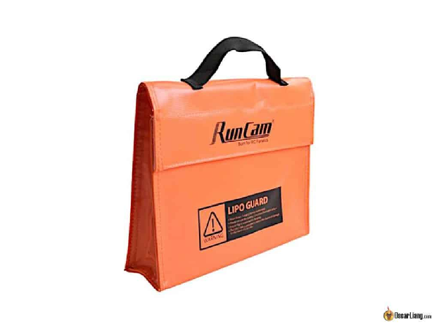

Сумки LiPo виготовлені з тканини, часто з металевою сумішшю, вплетеною в них, і зазвичай мають блискавку або застібку-липучку. Це легке та недороге сховище для транспортування акумулятора. Хоча пакети LiPo можуть уповільнити займання батареї, вони неефективні для його зупинки або локалізації. Для тривалого зберігання рекомендується металевий ящик для патронів. Проте пакети LiPo є відносно доступними і все одно краще, ніж нічого.

Отримайте сумки LiPo від:

* Banggood: [https://goo.gl/vbnErt](https://goo.gl/vbnErt)

* Amazon: [https://amzn.to/40c7qDN](https://amzn.to/40c7qDN)

* GetFPV: [https://oscarliang.com/product-czrh](https://oscarliang.com/product-czrh)

* RDQ: [https://oscarliang.com/product-eie5](https://oscarliang.com/product-eie5)

* AliExpress: [https://s.click.aliexpress.com/e/\_DePGYer](https://s.click.aliexpress.com/e/_DePGYer)

### **Ящик для патронів** {#ящик-для-патронів}

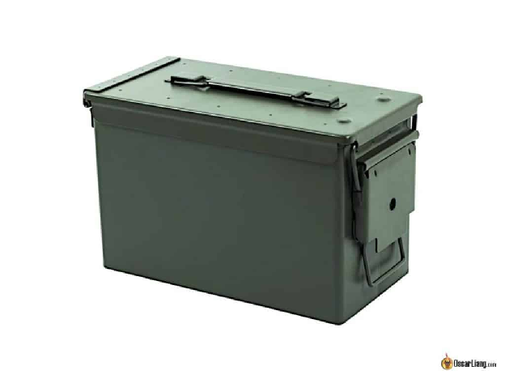

Перш ніж використовувати коробку для боєприпасів для зберігання LiPo акумуляторів, зніміть гумовий ущільнювач на кришці (просто від’єднайте його викруткою). Якщо можливо, просвердліть пару невеликих отворів, щоб повітря вийшло в разі пожежі (або переконайтеся, що коробка не закрита щільно), щоб запобігти підвищенню тиску всередині герметичної металевої ємності.

Де купить:

* Amazon: [https://amzn.to/3RcTbKI](https://amzn.to/3RcTbKI)

* AliExpress: [https://s.click.aliexpress.com/e/\_DdQY4wP](https://s.click.aliexpress.com/e/_DdQY4wP)

### **Коробка для LiPo Bat-Safe 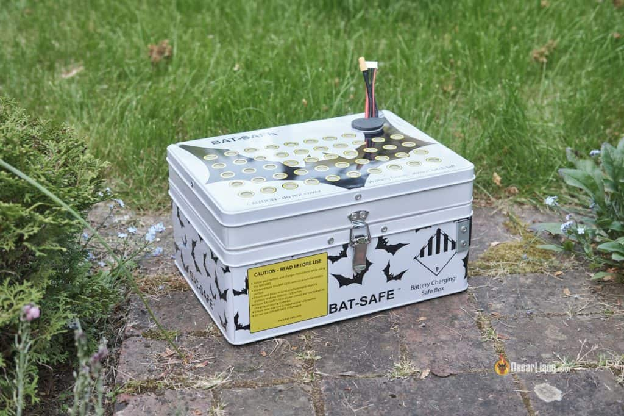 {#коробка-для-lipo-bat-safe-bat-safe-lipo-battery-charging-box}

Коробка Bat-Safe надійно запобігає пожежі акумулятора, випускає гарячі гази, фільтрує полум'я та сажу, забезпечуючи при цьому легке заряджання акумулятора та транспортування. Це як оновлена ​​версія коробки Ammo. Перегляньте мій повний огляд тут: [https://oscarliang.com/bat-safe-lipo-battery-charging-box/](https://oscarliang.com/bat-safe-lipo-battery-charging-box/)

Ви можете знайти Bat-Safe Box тут:

* AliExpress: [https://s.click.aliexpress.com/e/\_DcRNzFJ](https://s.click.aliexpress.com/e/_DcRNzFJ)

* Amazon: [https://amzn.to/43nl1sA](https://amzn.to/43nl1sA)

* GetFPV: [https://oscarliang.com/product-5njc](https://oscarliang.com/product-5njc)

### **Що робити з надмірно розрядженим LiPo** {#що-робити-з-надмірно-розрядженим-lipo}

Повна розрядка LiPo акумулятора може з часом призвести до окислення елементів, спричиняючи постійне зниження продуктивності. Однак, якщо виявити це досить швидко, зазвичай можна зберегти батарею без суттєвої шкоди для її роботи.

Зарядні пристрої можуть не розпізнати надмірно розряджений акумулятор через низьку напругу елемента. У таких випадках батарею бажано викинути. [Є способи врятувати надмірно розряджений LiPo](https://oscarliang.com/discharged-lipo-battery-little-incidence/), але це ризиковано.

### **Як перевозити LiPo акумулятори**  {#як-перевозити-lipo-акумулятори}

Багато авіакомпаній і аеропортів дозволяють перевозити LiPo акумулятори в ручній поклажі пасажирів. Майте на увазі наступне:

1. Завжди уточнюйте у вашій авіакомпанії правила перевезення LiPo акумуляторів 

2. Не перевозіть LiPo акумулятори у багажному відділенні

3. Помістіть ваші акумулятори у режим «зберігання»

4. Заклейте або закрийте роз'єми та зберігайте їх у безпечному пакеті LiPo

5. Ніколи не подорожуйте з пошкодженими акумуляторaми

Щоб дізнатися більше, перегляньте мій посібник “Як подорожувати з міні-дронами та LiPo акумуляторами”: [https://oscarliang.com/travel-fpv-drone-lipo-plane/](https://oscarliang.com/travel-fpv-drone-lipo-plane/)

### **Що робити, якщо загорівся LiPo акумулятор** {#що-робити,-якщо-загорівся-lipo-акумулятор}

1. Не панікуйте; якщо можливо, спочатку від'єднайте всі з'єднання

2. Використовуйте вогнегасник

3. Якшо нема вогнегасника, пісок може ефективно загасити пожежу LiPo; засипте палаючий LiPo піском

4. Уникайте вдихання диму і дочекайтеся, поки вогонь згасне і акумулятор охолоне

5. НЕ використовуйте воду

## **Утилізація LiPo** {#утилізація-lipo}

### **Коли пора міняти LiPo акумулятор**  {#коли-пора-міняти-lipo-акумулятор}

 LiPo акумулятори мають обмежений термін служби, коли кожне заряджання та розрядження вважається одним циклом. LiPo акумулятор, що добре обслуговується, для моделей RC потенційно може працювати понад 300 циклів. Однак для багатьох користувачів фізичне пошкодження акумуляторa до досягнення 300 циклів є звичайним явищем.

Немає чіткого правила щодо того, коли потрібно утилізувати акумулятор, але LiPo акумулятори можуть втратити свою потужність і ємність, оскільки з часом накопичується внутрішній опір. Внутрішній опір є хорошим показником справності акумулятора. Ви обов’язково повинні утилізувати акумулятор, якщо він пом'явся внаслідок аварії або роздувся, як повітряна кулька.

Дізнайтеся більше про те, коли виводити з експлуатації або утилізувати LiPo акумулятор, у цій статті: [https://oscarliang.com/when-retire-lipo-battery/](https://oscarliang.com/when-retire-lipo-battery/)

### **Як утилізувати LiPo акумулятори** {#як-утилізувати-lipo-акумулятори}

Старі та пошкоджені LiPo акумулятори слід утилізувати належним чином. Дізнайтеся про різні способи утилізації LiPo акумуляторів з цієї статті: [https://oscarliang.com/dispose-lipo-battery-safely/](https://docs.google.com/document/d/1z81MG_lfPweYWR3DJJwnwD3a8T3FUnQbFnd-9InaC58/edit) (Українською). Ніколи не проколюйте LiPo акумулятори, оскільки це може спричинити пожежу.

## **FAQ** {#faq}

Ось кілька типових запитань.

– Чи небезпечні набряклі LiPo?  
– Так, набряклі LiPo акумулятори небезпечні для використання або зберігання.

– Що спричиняє набрякання LiPo акумуляторa?   
– LiPo акумулятори набрякають, коли газ потрапляє всередину елементів. Це може статися природним шляхом, але фізичний вплив (наприклад, пошкодження, перегрів або надмірнa розрядкa) може спричинити збільшення кількості газу в акумуляторі.

– Чи можу я полагодити набряклий LiPo акумулятор?   
– Ні, не можете. Як тільки LiPo акумулятор набрякає, це вже не виправити. Утилізуйте його належним чином якомога швидше.

– Як уникнути набрякання акумуляторa?  
– Щоб уникнути набрякання акумуляторa:

* Ніколи не робіть надмірну розрядку – використовуйте сигналізацію напруги або систему контролю

* Не перегрівайте – не залишайте акумулятор на сонці або поблизу джерел тепла, не перевантажуйте акумулятори

* Ніколи не робіть надмірну зарядку – правильно налаштуйте зарядний пристрій і стежте за ним під час заряджання

* Зберігайте LiPo акумулятори належним чином, як згадувалося раніше в цій статті

– Чи потрібно “обкатувати” нові акумулятори?   
– Процедури “обкатки” нових акумуляторiв є суперечливою темою в спільноті FPV. Деякі вважають, що нові акумулятори повинні пройти через серію повільних циклів заряджання та розряджання, перш ніж використовуватися повністю. Інші, як і я, пробували цей метод і не виявили помітної різниці. Для додаткового обговорення теми, [перегляньте цю тему форуму](http://intofpv.com/t-new-lipo-do-you-repeat-charge-discharge-a-few-times-before-use).

### **Технічні умови** {#технічні-умови}

* Напруга відключення – напруга, при якій акумулятор вважається повністю розрядженим; Для LiPo це 3,0 В

* 1 цикл – це одна зарядка та розрядка батареї. Тривалість експлуатації – це загальна кількість циклів, протягом яких вистачить акумулятора

* Стан заряду – рівень заряду акумулятора від 0% до 100%.

* Mаксимальна короткочасна струмовіддача – максимальна швидкість розряду за короткий проміжок часу (зазвичай протягом 10 секунд)

## **Висновок** {#висновок}

Вітаємо, ви зробили це\!

Сподіваємось, ви щось дізналися про LiPo акумулятори та про те, як ними безпечно користуватися. Однак цей посібник не охоплює всього, що вам потрібно знати. Якщо ви в чомусь не впевнені, продовжуйте досліджувати, щоб переконатися, що поводитеся з LiPo акумуляторами якомога безпечніше. Щасливого польоту.

#### **Історія редагування** {#історія-редагування}

* Лютий 2017 – Стаття створена

* Серпень 2017 р. – додано «як вибрати lipo»

* Вересень 2018 р. – додано «чи безпечний LiPo?»

* Травень 2019 р. – Оновлене Пояснення щодо підрахунку клітинок та ІЧ, оновлений розділ «як заряджати»

* Квітень 2023 р. – Оновлений посібник

**33 КОМЕНТАРІ**

**HIDE**

12 лютого 2023 р. \- 12:30 год

Ви зазначили в «Коли приземлятися. Ви повинні приземлитися, коли напруга батареї досягне 3,5-3,6 В». Ви маєте на увазі залишкову напругу на елемент чи загальну напругу? Наперед дякую за вашу допомогу.

[ВІДПОВІДЬ](https://oscarliang.com/lipo-battery-guide/#comment-161855)

ОСКАР

12 лютого 2023 р. \- 00:46

3,5 В на елемент.

[ВІДПОВІДЬ](https://oscarliang.com/lipo-battery-guide/#comment-161856)

KAI PEPIN

26 серпня 2022 \- 00:16

Привіт Оскар,

Дякуємо, що поділилися своєю інформацією, просто цікаво, усі завжди кажуть, що ніколи не зберігайте повністю заряджену LiPo протягом тривалого періоду часу, а як щодо навпаки, наприклад, зберігання LiPo, який був розряджений до 3,5 В/елемент. Скажімо, я літаю ввечері, і я розряджаю всі свої батареї, і у мене немає часу перед сном, щоб зарядити їх, чи можна залишати батарею на 3,5 В/елемент на ніч або навіть довше?

[ВІДПОВІДЬ](https://oscarliang.com/lipo-battery-guide/#comment-151924)

ОСКАР

26 серпня 2022 р. \- 8:55 ранку

Я думаю, що на кілька днів чи тиждень це цілком нормально.  
Але LiPo може повільно саморозряджатися з часом, i щоб уникнути надто низького падіння напруги, краще поставити їх на заряд зберігання, якщо ви не використовуєте їх протягом кількох тижнів або довше.

[ВІДПОВІДЬ](https://oscarliang.com/lipo-battery-guide/#comment-151940)

**DARIK BOUTSABOUALOY**

14 травня 2021 р. \- 19:18

Привіт, Оскар, твоя робота чудова. У мене є питання, пов'язане з цією статтею. У розділі «Дізнайтеся, скільки струму може споживати ваш дрон» є фотографія таблиці, яка показує силу струму або струм, споживаний двигуном. Як це можна розрахувати? Я шукаю всюди, і відповідь важко знайти. Ви також не згадали, як саме це визначається. Я збираюся побудувати дрон, який зможе підняти корисний вантаж, і цей розрахунок дуже важливий для мене при виборі двигуна.

[ВІДПОВІДЬ](https://oscarliang.com/lipo-battery-guide/#comment-70084)

ОСКАР

14 травня 2021 р. \- 20:43

Таблиця зазвичай надається виробником двигуна. Ймовірно, ви також можете знайти цю інформацію від тих хто тестує, загугливши той двигун.  
Значення не розраховані, це реальні вимірювання.

[ВІДПОВІДЬ](https://oscarliang.com/lipo-battery-guide/#comment-70103)

**EMRE**

6 квітня 2021 р. \- 22:26

Привіт Оскар, у мене є зарядний пристрій imax b6ac і lipo 4s. Після кількох успішних зарядок мій зарядний пристрій перестає правильно зчитувати баланс. Я виміряв мультиметром, що між кожними контактами балансувального роз’єму приблизно 3,71 В. Однак зарядні пристрої показують 1:3,71 2:4,2 3:0,0 4:0,0  
У вас є ідея, чому це може бути так? Мій зарядний пристрій чи акумулятор несправні?

[ВІДПОВІДЬ](https://oscarliang.com/lipo-battery-guide/#comment-62569)

ОСКАР

7 квітня 2021 р. \- 01:19

Якщо припустити, що ваш мультиметр точний, можливо, ваш зарядний пристрій несправний. imax b6 досить старий зарядний пристрій, настав час для нового розумного зарядного пристрою [isdt Q8](https://oscarliang.com/isdt-q8/) :)

[ВІДПОВІДЬ](https://oscarliang.com/lipo-battery-guide/#comment-62581)

**GEORGE**

22 грудня 2020 р. \- 23:17

Гарна стаття.  
Зауважте, що хоча сказати, що «Кількість елементів» – «S», це начебто правильно, але S означає «Serial». Звичайно, є також P (паралельний), тому кількість елементів і система підключення важливі для розрахунку напруги.

[ВІДПОВІДЬ](https://oscarliang.com/lipo-battery-guide/#comment-46735)

**JACK**

15 липня 2019 р. \- 13:37

@Arnold, я не думаю, що автор сказав, що вони не використовуються, він просто сказав, що вони викликають суперечки щодо їх довговічності. У мене є кілька, які я використовую на своїх малих вупах, і я точно помічаю трохи додаткової потужності та приблизно 45 секунд-1 хвилину. додатковий час польоту. В мене була парочка шо здихали раніше, ніж звичайні 3,7 1s. Але зараз порівняно з тим, коли була написана вище стаття, LiHV батарея впала в ціні і не надто дорога, тож це все, що я купую зараз.

Що стосується зарядного пристрою, у мене є хороший зарядний пристрій 1s, з мультиплатою, за допомогою якого я можу заряджати 6 батарей одночасно. Це розумний зарядний пристрій ISDT, у вас є 3 варіанти заряджання…..Заряджання, розряджання та зберігання. Ви також можете підключити до нього звичайну плату для різдвяної ялинки xt60 і заряджати 2s-6s, але це маленький зарядний пристрій і живиться від lipo, я зазвичай використовую один із своїх старих акумуляторів 5s 3000 мАг, якими я більше не користуюсь для польотів. У мене є зарядний пристрій Viper Dual із акумуляторним відсіком, яким я заряджаю всі свої акумулятори 2s-6s. Отже, ISDT призначений виключно для моїх батарей 1s. Схоже, вони перестали робити цю модель, ось модель, якою вони її замінили, вона майже ідентична, і у них також є купа інших моделей. Ось посилання на нього....

amazon.com/ISDT-Battery-Charger-Discharger-Balance/dp/B078RF1SD5

[ВІДПОВІДЬ](https://oscarliang.com/lipo-battery-guide/#comment-21280)

**PARTHIBAN**

14 червня 2019 р. \- 11:52 год

Мені потрібно знати про батарею Lipo, згадавши HW651723P 20C 3,7 В 150 мАг.

З повагою,

[ВІДПОВІДЬ](https://oscarliang.com/lipo-battery-guide/#comment-21137)

**ARNOLD**

25 січня 2019 р. \- 05:51

2019: тут завжди хороша інформація, але її потрібно оновити.  
Сьогодні більше одноелементних батарей LiHV використовуються в мікродронах, таких як (тепер популярний) Tiny Hawk, який використовує 1s cel LiHV. До речі, вони використовують безщіточні двигуни, і я припускаю, що ці жахливі речі, що працюють від щіткових двигунів, залишилися в минулому :) . Але ще не знайдено хорошого зарядного пристрою, який також розряджатиме ці окремі елементи в накопичувачі, як з цим бути? Напруга заряджання досягає 4,35 В, а вольтаж елемента у режимі «зберігання» має становити 3,5-3,8 В. і 0,2 А здається розумним струмом зарядки.  
Ви можете використовувати «led драйвер/зарядний пристрій», але це працюватиме лише на використаних батареях і 1 елементу за раз, і оскільки більшість із нас носить принаймні від 10 до 30 батарей на перегонах, це займе вічність\! Дехто з нас заряджає батареї, а потім зависає дроном на півхвилини (знову для кожного елемента\!\!) Я сподіваюся, що галузь скоро займеться цим, інакше нам потрібно буде зробити плату, на якій ви якось підробите налаштування 6S, поставивши 6 окремих елементів в серії. можливо, я мав це запатентувати…

[ВІДПОВІДЬ](https://oscarliang.com/lipo-battery-guide/#comment-20059)

**SJAAK**

7 серпня 2018 р. \- 2:33 ранку

Чудова стаття\!  
Дуже корисно та пізнавально\!

Залишається невелике запитання щодо необхідності посадки при напрузі 3,5 В \~ 3,6 В на елемент.  
Це буде напруга, зчитана під час польоту (тобто під навантаженням), чи рівень напруги після приземлення (тобто «охолощення»)?  
І якщо його зчитувати під час польоту, скільки це буде, якщо виміряти на землі / врахувати просадку напруги?

Вітання від новачка,  
\~SJAAK

[ВІДПОВІДЬ](https://oscarliang.com/lipo-battery-guide/#comment-18483)

ОСКАР

11 серпня 2018 року \- 16:15

Це було б у повітрі. Падіння напруги насправді залежить від потужності вашого дрона.  
Якщо ви приземлитеся, коли напруга в повітрі впаде до 3,5 В, вона відновиться вище 3,5 В, і ви можете бути впевнені, що це не пошкодить акумулятор.

[ВІДПОВІДЬ](https://oscarliang.com/lipo-battery-guide/#comment-18526)

DAVID C LOCKWOOD

22 червня 2018 р. \- 10:04 год

Вибачте за дурні запитання, але це детально. По-перше, ви згадуєте про перевірку тяги двигунів. Як це робиться? По-друге, на діаграмі, яку ви використовували для визначення ампер, зазначено 16 В. З якої причини це вибрано понад 14 чи 15? Нарешті, до цієї статті я чув лише про рами, виражені в мм. Ви просто використовували дюйми, тому що це те, що використовуємо ми, чи прийнято знати обидва. Один використовується частіше, ніж інший?

[ВІДПОВІДЬ](https://oscarliang.com/lipo-battery-guide/#comment-18059)

ОСКАР

30 червня 2018 р. \- 14:12

Дані про споживання ампер двигуна зазвичай надають виробники, перевірте сторінки продукту.  
Потужність двигуна вища, коли напруга вища, тому ми, як правило, використовуємо вищу напругу для тестування двигунів. Для 4S lipo для тестування двигунів зазвичай використовується 16-16,8 В.  
Pами, виражені в мм, є розміром політної основи. Коли це в дюймах, це зазвичай стосується максимального розміру пропелерів, які можуть використовуватись на цій рамі. Перегляньте мій підручник про [рами для міні-квадрокоптерів](https://oscarliang.com/mini-quad-frame-basics/). Обидві одиниці виміру широко використовуються.

[ВІДПОВІДЬ](https://oscarliang.com/lipo-battery-guide/#comment-18124)

MATT

5 червня 2018 р. \- 17:42

У мене маленький дрон HS200. У мене є батареї від попереднього дрона, які підходять, але вони набагато більшої ємності. дрон HS200 використовує батарею 3,7 В 650 мАг, а я маю 5 акумуляторів 3,7 В 1200 мАг. Чи можу я без проблем використовувати ці батареї в дроні? 

[ВІДПОВІДЬ](https://oscarliang.com/lipo-battery-guide/#comment-17894)

ОСКАР

5 червня 2018 р. \- 20:46

Можна використовувати, напруга така ж. Єдиною проблемою буде вага, 1200mAh може бути трохи важким :), але спробуйте :)

[ВІДПОВІДЬ](https://oscarliang.com/lipo-battery-guide/#comment-17897)

[ВІДПОВІДЬ](https://oscarliang.com/lipo-battery-guide/#comment-17693)

ДЖО FPV

13 травня 2018 р. \- 13:17

Чи можу я поєднати свій 2s 1300mAh з 2s 1500mAh \= це буде 4s у послідовному режимі, але як щодо того, чи може він стати небезпечним??

[ВІДПОВІДЬ](https://oscarliang.com/lipo-battery-guide/#comment-17645)

ОСКАР

14 травня 2018 р. \- 17:08

Якщо ви використовуєте батареї послідовно, вони повинні бути однієї моделі (однакової марки та однакової ємності) для максимальної безпеки та продуктивності.

[ВІДПОВІДЬ](https://oscarliang.com/lipo-battery-guide/#comment-17662)

[ВІДПОВІДЬ](https://oscarliang.com/lipo-battery-guide/#comment-15776)

БОБ СМІТ

20 жовтня 2017 року \- 21:48

Гарне пояснення і дуже ретельне. Насправді це не вирішує мою проблему щодо того, який акумулятор купити. Я знаю, що мені потрібен акумулятор ємністю 10000 мАг x 6S, і 20C цілком підійде.  
Тепер, що я куплю? Чому одні акумулятори з однаковими поверхневими характеристиками коштують 89 доларів, а інші 300 доларів?  
Я знаю, що ми можемо використовувати такі терміни, як «якість», але чи є кількісна різниця? Чи довше служать дорогі? Чи зберігають вони заряд, коли не використовуються інакше?  
Чого мені не вистачає? Це питання про 200 доларів за акумулятор.

[ВІДПОВІДЬ](https://oscarliang.com/lipo-battery-guide/#comment-15720)

ОСКАР

24 жовтня 2017 р. \- 14:32

Як і все інше, «дорожче» не означає «краще».

Але якість насправді є одним із головних факторів, коли мова йде про ціну акумуляторa, скільки вони інвестують у матеріал, контроль якості, маркетинг тощо…

Важко зрозуміти, наскільки хороший акумулятор, не використавши його. Занадто багато виробників просто надають занадто мало інформації або навіть неправдиву інформацію на коробці. Добре те, що в Інтернеті є багато тестів і оглядів акумуляторів, які можна перевірити.

Загальне емпіричне правило полягає в тому, що завжди купуйте у відомих брендів у галузі, зазвичай ви не помилитеся. Принаймні, якщо щось піде не так, у вас все одно є оперативна та надійна служба підтримки клієнтів. Якщо ви не впевнені, що бренд має репутацію, просто запитайте на нашому форумі (intofpv.com)\!

[ВІДПОВІДЬ](https://oscarliang.com/lipo-battery-guide/#comment-15752)

ЕНДІ

4 квітня 2023 р. \- 15:33

Дякую за чудову статтю\! Коли приземлятися з 1s HV LIPo?

[ВІДПОВІДЬ](https://oscarliang.com/lipo-battery-guide/#comment-163750)

ОСКАР

4 квітня 2023 р. \- 15:54

Те саме, що i звичайні LiPo.

[ВІДПОВІДЬ](https://oscarliang.com/lipo-battery-guide/#comment-163752)

ТОМ

7 жовтня 2017 р. \- 13:24

Привіт  
Мені дуже подобається ваш сайт :)  
Я ніде не можу знайти відповіді на своє запитання.  
оскільки всі мої компоненти можуть підтримувати 2S-4S  
У мене 218-міліметрова рама з двигунами 2205 2300KV, іноді мені хочеться поставити на неї свій GoPro і довго літати  
Скажімо, у мене 6 батарейок (я все вигадав, їх, напевно, не існує)

2s 2000mAh (150 грам)  
2s 3500mAh (200 грам)

3s 1500mAh (150 грам)  
3s 3000mAh (200 грам)

4s 1200mAh (150 грам)  
4s 2300mAh (200 грам)

яка з них дасть мені більше часу польоту?  
Думаю, це допоможе мені зрозуміти :)

[ВІДПОВІДЬ](https://oscarliang.com/lipo-battery-guide/#comment-15611)

ОСКАР

9 жовтня 2017 р. \- 14:25

Тут: [http://intofpv.com/t-long-fly-time?pid=30361\#pid30361](http://intofpv.com/t-long-fly-time?pid=30361#pid30361)

[image1]: 

[image2]: 

[image3]: 

[image4]: 

[image5]: 

[image6]: 

[image7]: 

[image8]: 

[image9]: 

[image10]: 

[image11]: 

[image12]: 

[image13]: 

[image14]: 

[image15]: 

[image16]: 

[image17]: 

[image18]: 

[image19]: 

[image20]: 