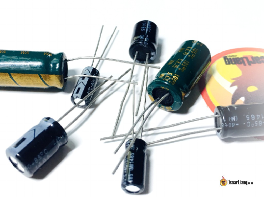
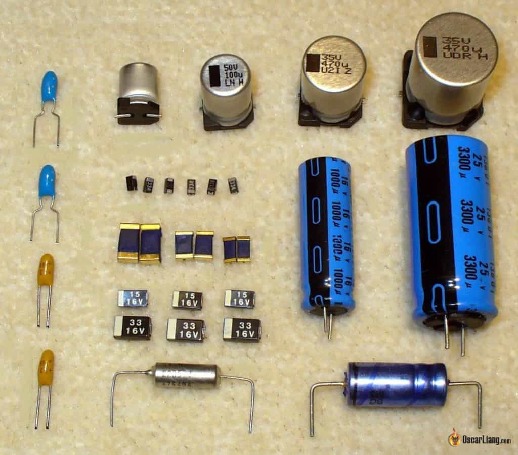
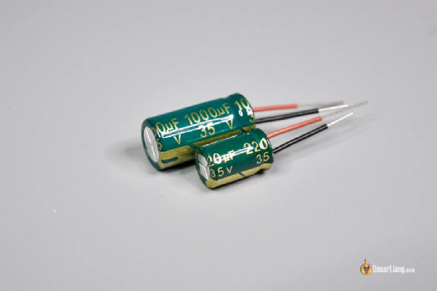
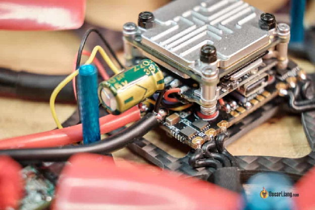
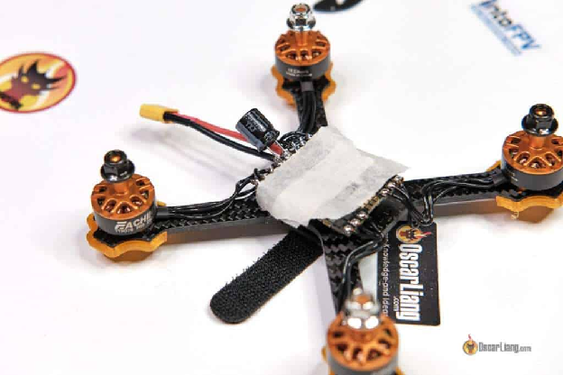
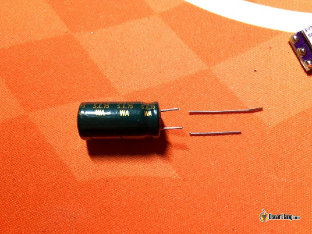
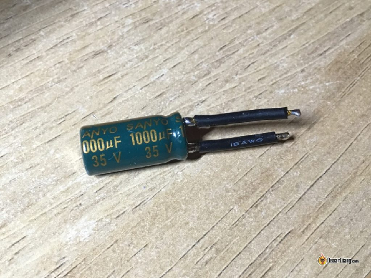

Оригінал: [https://oscarliang.com/capacitors-mini-quad/](https://oscarliang.com/capacitors-mini-quad/)   
Стисле посилання на цей переклад: [http://bit.ly/WhyCapacitorsAreImportant](http://bit.ly/WhyCapacitorsAreImportant) 

| 🫂 | Нижче вичитаний людьми машинний український переклад оригіналу. Для [VictoryDrones](https://www.victory-drones.com/) переклад вичитали: Oleg, Block(chain). Хочете покращити переклад чи знайшли помилку? — Лишіть коментар (Ctrl+Alt+M або «Меню» \> «Вставка» \> «Коментар»). Ми теж живі люди (як і ви) і робим помилки. Роботи їх, до речі, також роблять 😉 |
| :---: | :---- |

# Чому конденсатори важливі для FPV-дронів

18 лютого 2023

Конденсатори є важливим компонентом для FPV-дронів, оскільки вони допомагають зменшити стрибки напруги та електричні шуми в системі живлення. Ці стрибки напруги та електричні шуми можуть пошкодити електронні компоненти, особливо контролер польоту *\[FC, «польотнік»\]* та електронний контроллер швидкості *\[ESC, «регуль»\]*. Додавання конденсаторів до FPV-дрона може захистити ці компоненти та покращити його загальну продуктивність.

Зміст

[Де купити?](#де-купити?)

[Що таке конденсатор?](#що-таке-конденсатор?)

[Переваги додаткових конденсаторів у дронах FPV](#переваги-додаткових-конденсаторів-у-дронах-fpv)

[Вам потрібно додати конденсатор?](#вам-потрібно-додати-конденсатор?)

[Який тип конденсатора слід використовувати?](#який-тип-конденсатора-слід-використовувати?)

[Де встановити конденсатор?](#де-встановити-конденсатор?)

[Очищення живлення гіроскопа від шумів](#очищення-живлення-гіроскопа-від-шумів)

[Додавання конденсатора на 3,3 В](#додавання-конденсатора-на-3,3-в)

[Додавання конденсатора на шину 5В](#додавання-конденсатора-на-шину-5в)

[Конденсатор нагрівається після польоту](#конденсатор-нагрівається-після-польоту)

[Чи погано додавати забагато конденсаторів?](#чи-погано-додавати-забагато-конденсаторів?)

[Чи зношуються конденсатори?](#чи-зношуються-конденсатори?)

[LC-фільтр чи конденсатор?](#lc-фільтр-чи-конденсатор?)

[Результати дослідження еквівалентного послідовного опору (ESR)](#результати-дослідження-еквівалентного-послідовного-опору-\(esr\))

[Коментарі](#коментарі)

*Деякі посилання на цій сторінці є партнерськими. Я \[автор англомовної версії Оскар Ланг\] отримую комісію (без додаткових витрат для вас), якщо ви робите покупку після натискання одного із цих партнерських посилань. Це допомагає підтримувати безкоштовний контент для спільноти на цьому веб\-сайті. Будь ласка, прочитайте нашу [Політику партнерських посилань](https://oscarliang.com/affiliate-program-policy/) для отримання додаткової інформації.*

[Конденсатор може допомогти очистити відеопотік міні FPV-дронів \- збірка Martian II і RacerStar](https://www.youtube.com/watch?v=XJl1zHpItds)

## 

## **Де купити?** {#де-купити?}

Наступні пропозиції припускають, що ви припаюєте конденсатор до основного живлення електронного контролеру швидкості (ESC) 4-в-1. Якщо ви використовуєте поодинокі електронні контролери швидкості *\[на кожен із чотирьох моторів\] —* ви можете використовувати менші конденсатори для кожного електронного контроллера швидкості, наприклад, 220 мкФ або 330 мкФ на кожен електронний контроллер швидкості.

Серії Panasonic FM/FS і Rubycon ZLJ/ZLH чудові, оскільки мають один із найнижчих показників ESR (еквівалентного послідовного опору). Для збірок 3S (16 В або вище, також працює для 2S):

* 470 мкФ (3″, 4″): [Amazon](https://amzn.to/3Elq16O) | [AliExpress](https://s.click.aliexpress.com/e/_DD0Iy25)  
* 330 мкФ (2″, 3″): [Amazon](https://amzn.to/40Ze94a) | [AliExpress](https://s.click.aliexpress.com/e/_Dc7D5cN)  
* 220 мкФ (2 дюйми): [Amazon](https://amzn.to/3k9vPtj) | [AliExpress](https://s.click.aliexpress.com/e/_Dk4IWGp)

Для збірок 4S (25-35 В, працює також для 3S):

* 1000 мкФ (5″, 6″, 7″): [Amazon](https://amzn.to/3xzZ8Zc) | [AliExpress](https://s.click.aliexpress.com/e/_DmanlYV) | [RDQ](https://oscarliang.com/product-2554)  
* 680 мкФ (4″, 5″): [Amazon](https://amzn.to/3I8K0qF) | [AliExpress](https://s.click.aliexpress.com/e/_DlWhyJr)  
* 470 мкФ (3″, 4″): [Amazon](https://amzn.to/3xzhadX) | [AliExpress](https://s.click.aliexpress.com/e/_DDSgaq5) | [RDQ](https://oscarliang.com/product-gjpt)  
* 330 мкФ (2″, 3″): [Amazon](https://amzn.to/3IxQwbS) | [AliExpress](https://s.click.aliexpress.com/e/_DmDqkxJ) | [RDQ](https://oscarliang.com/product-fp7j)  
* 220 мкФ (2 дюйми): [Amazon](https://amzn.to/3IxQwbS) | [AliExpress](https://s.click.aliexpress.com/e/_DFgq81j)

Для збірок 6S (35V-50V, також працює для 4S):

* 1000 мкФ (5″, 6″, 7″): [Amazon](https://amzn.to/3k6IVYp) | [AliExpress](https://s.click.aliexpress.com/e/_Dnk8R6D) | [GetFPV](https://oscarliang.com/product-nsp2) | [RDQ](https://oscarliang.com/product-8kjy)  
* 680 мкФ (4″, 5″): [Amazon](https://amzn.to/3IzSokg) | [AliExpress](https://s.click.aliexpress.com/e/_DBEmMVL) | [GetFPV](https://oscarliang.com/product-hd7m)  
* 470 мкФ (3″, 4″): [Amazon](https://amzn.to/3YJnRpZ) | [AliExpress](https://s.click.aliexpress.com/e/_Dl5ZzR3) | [GetFPV](https://oscarliang.com/product-cde8) | [RDQ](https://oscarliang.com/product-him4)  
* 330 мкФ (2″, 3″): [Amazon](https://amzn.to/3I8JDwh) | [AliExpress](https://s.click.aliexpress.com/e/_DeclEFB) | [RDQ](https://oscarliang.com/product-826n)  
* 220 мкФ (2 дюйми): [Amazon](https://amzn.to/3ElhGjD) | [AliExpress](https://s.click.aliexpress.com/e/_DBO1m3B)

## **Що таке конденсатор?** {#що-таке-конденсатор?}

  
Конденсатор є одним з найпоширеніших електронних компонентів.

Конденсатори накопичують електричний заряд в електричному полі між двома провідними пластинами та можуть швидко накопичувати та віддавати електричну енергію, як крихітна батарея. Конденсатор поглинає скачки напруги та вивільняє накопичену енергію, коли відбувається падіння напруги, чим згладжує стрибки напруги та запобігає пошкодженню інших компонентів.

## **Переваги додаткових конденсаторів у дронах FPV** {#переваги-додаткових-конденсаторів-у-дронах-fpv}

Польові транзистори *\[FET\]* у нашому електронному контролері швидкості фактично є перемикачами. Вони швидко вмикаються та вимикаються десятки тисяч разів на секунду, щоб привести в дію двигуни. Це може генерувати багато стрибків напруги і, відповідно, шуму. По мірі розвитку технологій, що дозволяє створювати потужніші [двигуни](https://oscarliang.com/motors/), [електронні контролери швидкості](https://oscarliang.com/esc/), та акумулятори вищої напруги, ця проблема стає ще більш помітною. Проблема електронних шумів і наводок є надзвичайно важливою, через електронні шуми ваш фантастичний FPV-дрон може стати чимось, на чому зовсім неможливо літати.

Конденсатори можуть допомогти зменшити електричний шум і стрибки напруги, які можуть виникати, коли двигуни розкручуються або коли дрон виконує маневри на високій швидкості. Крім того, конденсатори можуть допомогти зменшити кількість наводок — перешкод, які створює система живлення, що може покращити якість аналогового відеоканалу з камери дрона.

Електронний контролер швидкості і польотний контролер мають конденсатори поверхневого монтажу (на друкованій платі) для фільтрації, але через брак фізичного простору їх ємності, як правило, недостатньо. [Як зазначено в моєму посібнику зі створення FPV-дронів](https://oscarliang.com/how-to-build-fpv-drone/) , припаювання додаткових конденсаторів до FPV-дрона забезпечує оптимальну продуктивність.

Підводячи підсумок, додавання додаткових конденсаторів до нашого дрона FPV може забезпечити наступні переваги:

* Фільтрація електричного шуму, створюваного електронний контроллером швидкості і двигунами, зменшення інтерференції — наводок від ESC, радіо/відеосигналів  
* Поліпшення польотних характеристик шляхом «прибирання» шуму в сигналі гіроскопа.  
* Захист електроніки від шкідливих стрибків напруги. Конденсатори діють як буфер, поглинаючи будь-яку надлишкову енергію, перш ніж вона досягне делікатних компонентів.  
* Якщо ви літаєте в аналоговому режимі, наявність відповідних конденсаторів на вході від джерела живлення може допомогти зменшити шум у відеоканалі FPV-дрона.

Ось приклад, який показує, наскільки покращився мій канал відео FPV після встановлення конденсатора на вході живлення XT60.  
[Capacitor can help clean up mini quad FPV video feed - Martian II & RacerStar build](https://youtu.be/XJl1zHpItds) 

Якщо ви не використовуєте додаткові конденсатори у своєму FPV-дроні, у вас можуть виникнути такі проблеми:

* Відеошум і зайві білі лінії на вашому відео — вони можуть ускладнити політ.  
* Субоптимальні льотні характеристики та [ви не можете налаштувати PID-регулятор і польотні фільтри](https://oscarliang.com/pid/) настільки тонко, наскільки могли б це зробити у випадку з конденсатором.  
* Компоненти більш вразливі до стрибків напруги, якщо живити їх безпосередньо від акумулятора.

## **Вам потрібно додати конденсатор?** {#вам-потрібно-додати-конденсатор?}

Вам не обов’язково використовувати конденсатори, але ми рекомендуємо це зробити. Як каже мама:  
*“Якщо шумно — не шкодуй заварки, припаяй конденсатора”*

Якщо у вас шумний квадрокоптер (багато коливань, і це важко налаштувати [PID-регулятором і фільтрами](https://oscarliang.com/pid-filter-tuning-blackbox/)) або шумне відео, додавання конденсаторів, ймовірно, буде першим, що вам слід спробувати.

Ось як ви можете вирішити, чи ваш FPV-дрон занадто шумний і чи потрібен конденсатор.

* Послухайте двигуни та подивіться, чи є коливання (осциляція), які ви не можете налаштувати за допомогою PID.  
* Перевірте наявність гарячих двигунів.  
* Шум у вашому відеоканалі є ще однією ознакою електромагнітного шуму у системі живлення.  
* У надзвичайних випадках ви можете отримати десинхронізацію електронного контроллера швидкості і двигуна та «кульбіт смерті» через те, що сигнали електронного контроллера швидкості були настільки спотворені електромагнітним шумом.

Навіть якщо у ваші батареї в порядку, доцільно додавати конденсатори. Краще перестрахуватися, ніж шкодувати, вірно? :) Зігнуті та деформовані пропелери можуть створити шум у вашій системі живлення. Додавання конденсаторів може допомогти і з цим.

## **Який тип конденсатора слід використовувати?** {#який-тип-конденсатора-слід-використовувати?}

Існує три типи конденсаторів, які зазвичай використовуються в дронах FPV:

* Керамічні.  
* Електролітичні.  
* Танталові.

Керамічні конденсатори є найпопулярнішим видом, який використовується для поверхневого монтажу через їх невеликий розмір, низьку вартість і високі значення ємності. Електролітичні конденсатори більші та дорожчі, але можуть забезпечити вищі значення ємності. Танталові конденсатори подібні до електролітичних конденсаторів, але більш надійні та мають довший термін служби.

Найпоширенішим типом конденсатора, який ми самостійно встановлюємо на FPV-дрон, є електролітичний конденсатор. Це невеликий циліндр з металевим корпусом (зазвичай алюмінієвим) і двома ніжками: одна позитивна, інша негативна.

  
Вибираючи конденсатори для свого FPV-дрона, слід звернути увагу на такі номінали конденсаторів:

* Ємність: вказує, скільки заряду може зберігати конденсатор. Для дрона FPV зазвичай потрібні конденсатори ємністю від 100 мкФ до 1000 мкФ. Вищі значення ємності можуть забезпечити кращу фільтрацію, але вони фізично більші та важчі  
* Номінальна напруга: це максимальна напруга, яку може витримати конденсатор до виходу з ладу. Вона має бути вищою за стрибки напруги, які може створити електроніка дрона. Наприклад, якщо дрон живиться від батареї 4S (14,8 В), вам слід вибрати конденсатори з напругою не менше 25 В, а для 6S — 35 В або вище. Немає шкоди у виборі конденсатора з вищою напругою, але вони, як правило, більшого розміру  
* ESR (еквівалентний послідовний опір) — це опір, який конденсатор чинить потоку струму, і нижчі значення еквівалентного послідовного опору, як правило, кращі для фільтрації шуму, як показано у [цьому відео](http://intofpv.com/t-filtering-out-esc-noise-in-power-for-fpv-capacitor-choice).

Виберіть номінальну напругу на основі кількості елементів LiPo, стрибки напруги можуть бути вищими, ніж напруга батареї, тому безпечніше вибрати конденсатор з вищою номінальною напругою, ніж напруга збірки LiPo:

* 3S: 16 В або вище.  
* 4S: 25 В або вище.  
* 5S: 35 В або вище.  
* 6S: 35 В або вище (наприклад, 50 В, якщо ви хочете бути спокійними).  
* 8S: 63 В або вище.  
* 12S: 80 В або вище.

Ви можете використовувати конденсатор з нижчою напругою, але ви ризикуєте зменшити термін служби та продуктивність дрона. Обов’язково придбайте конденсатор із низьким еквівалентним послідовним опором (про виробник зазнаяає позначкою «low ESR» *\[англ.: низьке значення ESR\]* на сторінці продукту).

## **Де встановити конденсатор?** {#де-встановити-конденсатор?}

У FPV-дронах конденсатори зазвичай встановлюють до системи живлення: або на шляху дротів живлення, або безпосередньо на блоки живлення електронних контролерів швидкості. Загальна ідея полягає у тому, щоб підключити конденсатор якомога ближче до польового транзистора в електронному контролері швидкості, щоб максимізувати ефективність конденсатора. Для електронного контроллеру швидкості 4-в-1 це зазвичай означає — під’єднати конденсатор на контакти для пайки регулятора.

 

  
Якщо у вас не вистачає місця — ви можете вкоротити ніжки конденсатора, потім припаяти декілька гнучких силіконових дротів для подовження та помістити конденсатор у інше місце всередині рами. Але подбайте про те, щоб дроти були якомога коротшими, щоб мінімізувати опір, і використовуйте товщі дроти — наприклад, для батареї 6S 5″ хорошим вибором буде 20AWG (0.5 мм2) чи навіть 18AWG (0.82 мм2).

Надзвичайно важливо розуміти полярність конденсатора. Довша ніжка є позитивною (+), а коротша ніжка — негативною (-). Маркування на корпусі (біла наклейка) також вказує, яка клема є мінусовою. Якщо ви зробите помилку, конденсатор не працюватиме. Він навіть може вибухнути, будьте обережні\!

Припаяйте конденсатор до блоку живлення електронного контролеру швидкості або XT60. Мінус до мінусу, плюс до плюса.

## **Очищення живлення гіроскопа від шумів** {#очищення-живлення-гіроскопа-від-шумів}

Якщо ваш міні-дрон має електричні шуми, такі як вібрації та перегрівання моторів, а просте додавання великого конденсатора на роз’єм живлення XT60 або на електронний контроллер швидкості не вирішує проблему, тоді додайте маленький конденсатор безпосередньо до джерела живлення гіроскопа. Це може ефективніше подолати шум, присутній у живленні гіроскопа.

Рекомендую це рішення лише досвідченим користувачам. Знайти, куди припаяти конденсатор, нелегко, і це також вимагає хороших навичок паяння. Вам не потрібно турбуватися про це, якщо у вас немає проблем. Спробуйте спочатку інші простіші методи, а це – крайній засіб.

### **Додавання конденсатора на 3,3 В** {#додавання-конденсатора-на-3,3-в}

Гіроскоп на наших контролерах польоту живиться від стабілізатора з низьким падінням напруги (LDO-стабілізатор) 3,3 В, тому вам потрібно просто припаяти конденсатор до контакту 3,3 В гіроскопа або виходу 3,3 В LDO-стабілізатора. Інший контакт конденсатора припаяти до нейтралі.

Популярними варіантами є танталові конденсатори 4В 220 мкФ, 330 мкФ або 470 мкФ: [https://amzn.to/3XN4Hhn](https://amzn.to/3XN4Hhn) Для найкращого результату шину 3В слід фільтрувати якомога ближче до гіроскопа.

Дуже небагато польотників мають ту саму шину 3,3 В, що й мікроконтролери і приймачі, тому ви можете отримати доступ до шини 3,3 В на зовнішній паяльній панелі. На мою думку, це невдалий дизайн польотника, оскільки у ньому відсутній спеціальний регулятор низького рівня шуму лише для гіроскопа, але це полегшує вам припаювання конденсатора, якщо буде потрібно.

### **Додавання конденсатора на шину 5В** {#додавання-конденсатора-на-шину-5в}

Стабілізатор із низьким падінням напруги (LDO-стабілізатор) на 3,3 В для гіроскопа отримує живлення від шини 5В, тому ви також можете відфільтрувати шину 5В, що також зменшить шум для гіроскопа. Це може бути не таким ефективним, як фільтрація на шині 3,3В, але варто спробувати, якщо це більш доступно. Популярні варіанти: танталовий конденсатор 6В 220 мкФ, 330 мкФ або 470 мкФ: [https://amzn.to/41blcqv](https://amzn.to/41blcqv)

## **Конденсатор нагрівається після польоту** {#конденсатор-нагрівається-після-польоту}

Потенційні причини того, що конденсатор нагрівається після польоту (або він вибухнув):

* Замала ємність. Наприклад, якщо ви використовуєте 680 мкФ, вам слід спробувати 1000 мкФ.  
* Це може бути ознакою того, що стрибки напруги занадто високі, вам слід придбати конденсатор з вищою номінальною напругою. Наприклад, якщо ви використовуєте конденсатор на 35В для акумуляторної збірки 6S, ви можете придбати конденсатор на 50В.

## **Чи погано додавати забагато конденсаторів?** {#чи-погано-додавати-забагато-конденсаторів?}

Стисла відповідь — ні. Якщо ви фільтруєте сигнал певного частотного діапазону, то вам слід точно контролювати ємність і індуктивність у вашій схемі. Але ми маємо справу лише з постійною напругою та фільтром низьких частот, ви не зможете занадто «перефільтрувати» напругу постійного струму, тому ви можете використовувати скільки завгодно ємності, і це не буде проблемою.

Фактично, чим більше конденсаторів ви використовуєте у своєму дроні, тим сильніше працює фільтр низьких частот. Отже, використовуйте скільки завгодно конденсаторів, якщо у вас є простір для їх встановлення.

## **Чи зношуються конденсатори?** {#чи-зношуються-конденсатори?}

Стисла відповідь — так. Електролітичні конденсатори, які використовуються у FPV-дронах, мають обмежений термін служби і можуть з часом зношуватися через такі фактори, як висока температура та напруга.

Коли електролітичний конденсатор зношується, він може потекти або вибухнути, і його ємність може зменшитися. Це може призвести до нестабільної роботи та шуму у системі живлення, що у свою чергу може вплинути на роботу електроніки. Варто періодично перевіряти та замінювати конденсатори у вашому дроні, навіть якщо вони виглядають «добре». Можливо, варто їх регулярно міняти.

## **LC-фільтр чи конденсатор?** {#lc-фільтр-чи-конденсатор?}

[LC фільтри](https://oscarliang.com/lc-filter-fpv/) часто використовуються в [FPV-системах](https://oscarliang.com/fpv-system/) також для боротьби із шумом на відео, але він захищає систему лише після того, як шум вже з’явився. З іншого боку, додавання конденсатора до джерела живлення захищає всю систему, запобігаючи створенню шуму.

## **Результати дослідження еквівалентного послідовного опору (ESR)** {#результати-дослідження-еквівалентного-послідовного-опору-(esr)}

### **330 мкФ**

#### **25В**

| Бренд | Серія | Розмір (Діаметр X довжина) | Опір (Ω/100 кГц) |
| :---- | :---- | :---- | :---- |
| Panasonic | FM | 10×12.5 | 0.038 |
| Elna | RJF | 10×12.5 | 0.039 |
| Vishay | 160 RLA | 12.5×25 | 0.04 |
| Panasonic | FM | 8×15 | 0.041 |
| Samwha | ML | 10×12.5 | 0.053 |
| Nippon | KZE | 10×12.5 | 0.053 |
| Panasonic | FR | 8×11.5 | 0.056 |
| United Chemi-Con (UCC) | KZH | 8×11.5 | 0.062 |
| Nippon | KZH | 8×11.5 | 0.062 |
| Samwha | MZ | 10×12.5 | 0.08 |
| Panasonic | FC | 8×15 | 0.085 |
| Panasonic | FC | 10×12.5 | 0.09 |
| Nichicon | PW | 10×12.5 | 0.09 |
| Samwha | MK | 10×12.5 | 0.098 |
| Panasonic | TP | 10×16 | 0.13 |
| Elna | RJ4 | 10×12.5 | 0.81 |

#### **35В**

| Бренд | Серія | Розмір (Діаметр X довжина) | Опір (Ω/100 кГц) |
| :---- | :---- | :---- | :---- |
| Panasonic | FM | 10×16 | 0.026 |
| Elna | RJF | 10×16 | 0.028 |
| Panasonic | FM | 8×20 | 0.03 |
| Samwha | MZ | 10×16 | 0.038 |
| Nippon | KZE | 10×16 | 0.038 |
| Vishay | 160 RLA | 12.5×25 | 0.04 |
| Panasonic | FR | 10×12.5 | 0.043 |
| United Chemi-Con (UCC) | KZH | 10×12.5 | 0.045 |
| Nippon | KZH | 10×12.5 | 0.045 |
| Panasonic | TP | 10×20 | 0.052 |
| Samwha | ML | 10×12.5 | 0.053 |
| Panasonic | FC | 8×20 | 0.065 |
| Samwha | MK | 10×16 | 0.065 |
| Panasonic | FC | 10×16 | 0.068 |
| Nichicon | PW | 10×16 | 0.068 |
| Elna | RJ4 | 10×12.5 | 0.7 |

### **470мкФ**

#### **25В**

| Бренд | Серія | Розмір (Діаметр X довжина) | Опір (Ω/100 кГц) |
| :---- | :---- | :---- | :---- |
| Panasonic | FM | 10×16 | 0.026 |
| Elna | RJF | 10×16 | 0.028 |
| Vishay | 160 RLA | 16×25 | 0.029 |
| Panasonic | FR | 8×20 | 0.03 |
| Samwha | MZ | 10×16 | 0.038 |
| Panasonic | FR | 8×15 | 0.041 |
| Nippon | KZE | 8×20 | 0.041 |
| Panasonic | FR | 10×12.5 | 0.043 |
| United Chemi-Con (UCC) | KZH | 10×12.5 | 0.045 |
| Nippon | KZH | 10×12.5 | 0.045 |
| Samwha | ML | 10×12.5 | 0.055 |
| Samwha | MK | 10×20 | 0.06 |
| Samwha | MK | 10×16 | 0.065 |
| Panasonic | TP | 8×20 | 0.067 |
| Panasonic | FC | 10×16 | 0.068 |
| Nichicon | PW | 10×16 | 0.068 |
| Panasonic | TP | 10×17 | 0.13 |
| Elna | RJ4 | 10×12.5 | 0.57 |

#### **35В**

| Бренд | Серія | Розмір (Діаметр X довжина) | Опір (Ω/100 кГц) |
| :---- | :---- | :---- | :---- |
| Panasonic | FM | 10×20 | 0.019 |
| Elna | RJF | 10×20 | 0.02 |
| Nippon | KZE | 10×20 | 0.023 |
| Samwha | MZ | 10×20 | 0.027 |
| Panasonic | FR | 10×20 | 0.028 |
| Panasonic | FR | 10×16 | 0.028 |
| Panasonic | FR | 8×20 | 0.03 |
| Nichicon | UHW | 10×16 | 0.03 |
| Nippon | KZH | 10×16 | 0.032 |
| United Chemi-Con (UCC) | KZH | 10×16 | 0.032 |
| Vishay | 160 RLA | 18×20 | 0.035 |
| Panasonic | TP | 12.5×20 | 0.038 |
| Samwha | ML | 8×20 | 0.038 |
| Samwha | ML | 10×16 | 0.041 |
| Samwha | MK | 10×20 | 0.05 |
| Panasonic | FC | 10×20 | 0.052 |
| Nichicon | PW | 10×20 | 0.052 |
| Samwha | MK | 8×20 | 0.088 |
| Elna | RJ4 | 10×16 | 0.5 |

### **1000мкФ**

#### **25В**

| Бренд | Серія | Розмір (Діаметр X довжина) | Опір (Ω/100 кГц) |
| :---- | :---- | :---- | :---- |
| Elna | RJF | 12.5×20 | 0.017 |
| Panasonic | FR | 10×25 | 0.018 |
| United Chemi-Con (UCC) | KZH | 10×25 | 0.018 |
| Nippon | KZH | 10×25 | 0.018 |
| Panasonic | FR | 10×20 | 0.02 |
| Nichicon | UHW | 10×20 | 0.02 |
| Nippon | KZE | 12.5×20 | 0.021 |
| Samwha | MZ | 12.5×21 | 0.025 |
| Vishay | 160 RLA | 16×31 | 0.027 |
| Samwha | ML | 10×20 | 0.033 |
| Vishay | 136 RVI | 12.5×25 | 0.034 |
| Panasonic | FC | 10×30 | 0.035 |
| Panasonic | FC | 12.5×20 | 0.038 |
| Nichicon | PW | 12.5×20 | 0.038 |
| Panasonic | FC | 16×15 | 0.043 |
| Samwha | MK | 10×25 | 0.045 |
| Samwha | MK | 10×20 | 0.05 |
| Elna | RJ4 | 10×20 | 0.27 |

#### 

#### 

#### **35В**

| Бренд | Серія | Розмір (Діаметр X довжина) | Опір (Ω/100 кГц) |
| :---- | :---- | :---- | :---- |
| Panasonic | FM | 12×25 | 0.015 |
| Elna | RJF | 12.5×25 | 0.015 |
| Nichicon | UHW | 12.5×20 | 0.017 |
| United Chemi-Con (UCC) | KZH | 12.5×20 | 0.017 |
| Nippon | KZH | 12.5×20 | 0.017 |
| Panasonic | FM | 12.5×20 | 0.018 |
| Nippon | KZE | 12.5×25 | 0.018 |
| Samwha | MZ | 12.5×25 | 0.022 |
| Vishay | 160 RLA | 18×35 | 0.024 |
| Samwha | ML | 12.5×20 | 0.026 |
| Panasonic | FC | 16×20 | 0.029 |
| Samwha | MK | 12.5×25 | 0.029 |
| Panasonic | FC | 12.5×25 | 0.03 |
| Nichicon | PW | 12.5×25 | 0.03 |
| Samwha | MK | 12.5×20 | 0.043 |
| Elna | RJ4 | 12.5×20 | 0.23 |

* Panasonic EB, EE, HD, NHG,GA, M, SU, KA та KS серії не є моделями з низьким еквівалентним послідовним опором (ESR).  
* Samwha SD, BH and RD серії не є моделями з низьким ESR, а також мають WL ти WF посередньої якості.  
* United Chemi-Con (UCC) з KZM серії можна порівняти з KZH.  
* Є дуже багато конденсаторів з низким ESR від Vishay, але вони завеликі.  
* Конденсатори від Rubycon з низьким еквівалентним послідовним опором доходять тільки до 220мкФ – тому ми про них тут не пишемо.  
* Elna RJ3 та RJ4 подібні.

## 

## **Коментарі** {#коментарі}

1) Чи можу я підключити декілька конденсаторів щоб отримати потрібну ємність? Як це зробити \- послідовно чи паралельно?  
   **Відповідь:** підключайте паралельно.  Якщо підключите послідовно конденсатори один до одного, це зменшить ємність.  
2) Кілька слів хотілося б сказати про конденсатори для фільтрації перешкод. Я збираюся додати керамічний конденсатор 100 нФ паралельно. Великий конденсатор, такий як 1000 мкФ, діє як «резервуар» для накопичення енергії з виходу Li-Po. Коли споживаються значні піки струму, конденсатор, що подає енергію стрибків, допомагає акумулятору не втрачати потужність. Невеликий конденсатор (100 нФ), неполяризований, як правило, сьогодні це багатошаровий керамічний конденсатор з низьким ESR і низькою індуктивністю, що дає йому відмінну високочастотну характеристику і можливості фільтрації шуму. Поляризовані конденсатори високого значення зазвичай не мають ідеальних характеристик на високих частотах, тому досить часто паралельно додають конденсатор малої вартості в ситуаціях, коли потрібно турбуватися про стабільність на високих частотах.

[image1]: 

[image2]: 

[image3]: 

[image4]: 

[image5]: 

[image6]: 

[image7]: 

[image8]: 