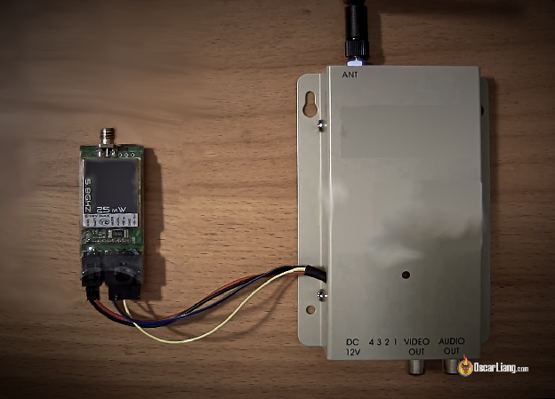
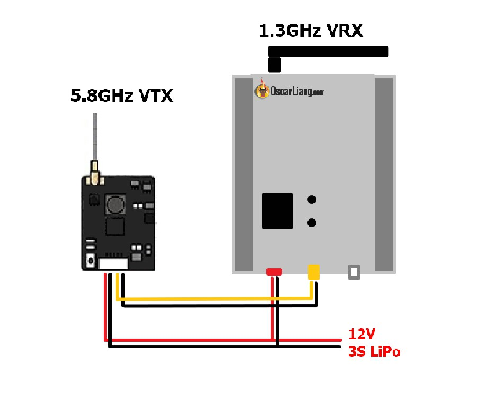

  
Стисле посилання на цей переклад: [https://bit.ly/LiangWirelessRelay](https://bit.ly/LiangWirelessRelay)   

| 🫂 | Нижче вичитаний людьми машинний український переклад оригіналу. Для [VictoryDrones](https://www.victory-drones.com/) переклад вичитали: Max Well\!. Хочете покращити переклад чи знайшли помилку? — Лишіть коментар (Ctrl+Alt+M або «Меню» \> «Вставка» \> «Коментар»). Ми теж живі люди (як і ви) і робимо помилки. Роботи їх, до речі, також роблять 😉 |
| :---: | :---- |

# Бездротовий ретранслятор з 1,2 ГГц-1,3 ГГц на 5,8 ГГц 

15 січня 2019 р

У цій статті я покажу вам, як створити бездротовий ретранслятор з діапазону 1,2 ГГц/1,3 ГГц на діапазон 5,8 ГГц. Це не нова ідея, але це дуже корисна саморобка, яка може надати чимало переваг вашому FPV, якщо ви є користувачем 1,3 ГГц.

*Деякі посилання на цій сторінці є партнерськими. Я \[автор англомовної версії Оскар Ланг\] отримую комісію (без додаткових витрат для вас), якщо ви робите покупку після натискання одного із цих партнерських посилань. Це допомагає підтримувати безкоштовний контент для спільноти на цьому веб\-сайті. Будь ласка, прочитайте нашу [Політику партнерських посилань](https://oscarliang.com/affiliate-program-policy/) для отримання додаткової інформації.*

Як він працює? Принцип дії полягає в тому що він приймає та транслює відеосигнал в такій послідовності:

відеопередавач VTX 1,3 ГГц \=\> відеоприймач VRX 1,3 ГГц \=\> відеопередавач 5,8 ГГц \=\> відеоприймач 5,8 ГГц \=\> польотні окуляри/дисплей.

Якщо ви вперше використовуєте 1,3 ГГц для FPV, подивіться спочатку [мій посібник для початківців](https://oscarliang.com/1-2ghz-fpv-guide/). *\[перекладено українською: [https://bit.ly/LiangGuide1-2ghzFPVvideoSystem](https://bit.ly/LiangGuide1-2ghzFPVvideoSystem)\]*

# **Переваги ретранслятора з 1,3 ГГц на 5,8 ГГц**

Перш за все, це дозволяє розмежувати сигнал радіопередавача пілота і відеоприймача 1,3 ГГц. Таке розділення мінімізує перешкоди і не треба буде морочитись з кабелями\!  *\[прим.пер.: мабуть найголовніша перевага це збільшення відстані на якій можна безперешкодно приймати відео-сигнал від вашого дрона, особливо якщо ви розмістите ваш ретранслятор якомога вище, наприклад на щоглу, дерево чи дах будинку, або іще один дрон яким ви піднімете ретранслятор на висоту\]*

Якщо ви також керуєте міні-дронами, можливо, у вас вже є пара [Окуляр в стилі Fatshark](https://oscarliang.com/fatshark-hdo-hd3/) плюс улюблений приймач 5,8 ГГц. Ретранслятор 1,3 / 5,8 ГГц дозволяє використовувати наявне спорядження без покупки додаткового обладнання.

# **Що потрібно?**

У найпростішому вигляді все, що вам потрібно

* Відеоприймач 1,3 ГГц: [http://bit.ly/2KTPEPb](http://bit.ly/2KTPEPb)  
* Будь-який дешевий, малопотужний відеопередавач VTX 5,8 ГГц, як цей: [http://bit.ly/2QPHkl0](http://bit.ly/2QPHkl0)

Ви можете додати інші компоненти, щоб «поліпшити» налаштування пізніше, як-от регулятор напруги, фільтри та інші корисні речі, на ваш розсуд.

# **Створення ретранслятора з 1,2 ГГц на 5,8 ГГц**

По суті, ви будете повторно передавати відеосигнал від 1,3 ГГц відеоприймача VRX за допомогою 5,8 ГГц відеопередавача VTX на окуляри FPV бездротовим способом.

Просто підключіть вихід відеоприймача VRX до входу відеопередавача VTX так:

І це все.

3[атримка VTX і VRX](https://oscarliang.com/vtx-vrx-latency-analog/) вимірюється лише від 1 до 2 мілісекунд, що завдає значного впливу.

# **Що слід враховувати**

* Не забудьте дізнатися, чи дозволена [Частота FPV](https://oscarliang.com/fpv-frequency/) 1,2 ГГц у вашій країні.  
* Цей метод створюєте більше ймовірностей неполадок, тож майте це на увазі. Ретельно перевіряйте конструкцію перед кожним польотом.

* Вибираючи відеопередавач VTX, візьміть варіант з дуже низькою потужністю. Загалом, 25 мВт або навіть 10 МВт більш ніж достатньо. Все, що перевищує 25 мВт, справді перебір, якщо тільки ви не плануєте стояти за сотні метрів від приймача 1,3 ГГц

* Майте на увазі, що ви можете створити завади відео-сигналам  інших пілотів, якщо вони також використовують частоту 5,8 ГГц (можливо й навпаки). Тому важливо використовувати відеопередавач  VTX з меншою потужністю, якщо ви літаєте у групі.

* Я рекомендую розмістити радіатор на задній панелі відеопередавача VTX, для охолодження: [http://bit.ly/2QLQ0sI](http://bit.ly/2QLQ0sI)

* Оскільки більшість приймачів VRX 1,2 ГГц розраховані на 12 В, ви можете придбати передавач VTX, який також може живитися від 12 В. Більшість сучасних 5,8 ГГц VTX сьогодні мають широку вхідну напругу, від 2S до 4S або навіть 6S, тому це не повинно бути проблемою.

* Можливо, краще не використовувати стабілізатор напруги 12 В, використовуйте батарею 3S LiPo, якщо можете. По-перше, стабілізатор напруги \- це додаткова можливість для виникнення апаратної проблеми. По-друге, деякі регулятори напруги можуть створювати радіочастотний шум, який впливає на ваш відеоприймач.

* Оскільки ви вже подаєте відеосигнал від приймача VRX на передавач VTX, не варто роозгалужувати цей сигнал на кілька пристроїв. Це може працювати, але може i вплинути на якість відео. Якщо дуже треба, тo можете придбати правильний відеорозгалужувач *\[сплітер\]*, який підсилює  відеосигнал : [https://amzn.to/2RHTMYD](https://amzn.to/2RHTMYD)

**ВИБРАНІ КОМЕНТАРІ**

**VENOM**

7 січня 2020 р. \- 01:23

дуже хороший підручник, одне запитання, якщо відео- та аудіо-виходи підключені до монітора, як мені все одно передавати відео на мої окуляри за допомогою цього хака?  
[ВІДПОВІДЬ](https://oscarliang.com/1-3ghz-5-8ghz-relay/#comment-22628)  
**OSCAR**

13 січня 2020 р. \- 15:51його до дисплея :)  
В іншому випадку ви можете спробувати розгалужувач \- відеосплітер.

[image1]: 

[image2]: 