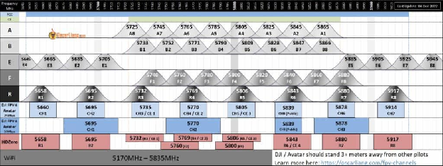

Оригінал: [https://oscarliang.com/fpv-channels/](https://oscarliang.com/fpv-channels/)     
Стисле посилання на цей переклад: [https://bit.ly/LiangChannelsFreqs-uk-UA](https://bit.ly/LiangChannelsFreqs-uk-UA)    

| 🫂 | Нижче вичитаний людьми машнний український переклад оригіналу. Для [VictoryDrones](https://www.victory-drones.com/) переклад вичитали: Natalya M. Хочете покращити переклад чи знайшли помилку? Попросіть права редагування. Знайшли помилку — лишіть коментар (Ctrl+Alt+M або «Меню» \> «Вставка» \> «Коментар»). Ми теж живі люди (як і ви) і робим помилки. Роботи їх, до речі, також роблять 😉  |
| :---: | :---- |

# **FPV канали на 5,8 гГц та діаграма частот** **(аналоговий та цифровий режими)** {#fpv-канали-на-5,8-ггц-та-діаграма-частот-(аналоговий-та-цифровий-режими)}

16 травня 2021 р

Існує понад 100 каналів у частотному спектрі 5,8 ГГц серед аналогових і цифрових режимів FPV *\[First Person View: режим "від першої особи"\]* (DJI *\[Da-Jiang Innovations (大疆创新\]* FPV і Shark Byte). Я склав таблицю i схему, щоб ви могли легко вибирати найкращі канали для FPV.

*Деякі посилання на цій сторінці є партнерськими. Я \[автор англомовної версії Оскар Ланг\] отримую комісію (без додаткових витрат для вас), якщо ви робите покупку після натискання одного із цих партнерських посилань. Це допомагає підтримувати безкоштовний контент для спільноти на цьому веб\-сайті. Будь ласка, прочитайте нашу [Політику партнерських посилань](https://oscarliang.com/affiliate-program-policy/) для отримання додаткової інформації.*

Зміст

[FPV канали на 5,8 гГц та діаграма частот](#fpv-канали-на-5,8-ггц-та-діаграма-частот-\(аналоговий-та-цифровий-режими\))  
[(аналоговий та цифровий режими)](#fpv-канали-на-5,8-ггц-та-діаграма-частот-\(аналоговий-та-цифровий-режими\))

[Схема FPV-каналів в частотному спектрі 5,8 ГГц](#схема-fpv-каналів-в-частотному-спектрі-5,8-ггц)

[Усі канали FPV у таблиці](#усі-канали-fpv-у-таблиці)

[Аналоговий режим FPV](#аналоговий-режим-fpv)

[Цифровий режим FPV](#цифровий-режим-fpv)

[Вибір каналу в аналоговому режимі](#вибір-каналу-в-аналоговому-режимі)

[Найкращий канал відеопередавачa \[VTX\] для самостійних польотів](#нsайкращий-канал-відеопередавачa-[vtx]-для-самостійних-польотів)

[Найкращий FPV-канал для групових польотів](#найкращий-fpv-канал-для-групових-польотів)

[Керування каналом FPV](#керування-каналом-fpv)

[Що таке частота IMD](#що-таке-частота-imd)

[Поради для аналогових режимів](#поради-для-аналогових-режимів)

[Налаштування відеoприймача і відеопередавача на однаковий канал](#налаштування-відеoприймача-і-відеопередавача-на-однаковий-канал)

[Антена та її розміщення](#антена-та-її-розміщення)

[Не знижуйте потужність відеопередавачa VTX](#не-знижуйте-потужність-відеопередавачa-vtx)

[Вирішення проблем поганого відео](#вирішення-проблем-поганого-відео)

[Як літати, коли в одного пілота аналогоий режим, а в іншого DJI/Avatar](#як-літати,-коли-в-одного-пілота-аналогоий-режим,-а-в-іншого-dji/avatar)

[Дотримання дистанції](#дотримання-дистанції)

[Вибір каналів](#вибір-каналів)

[DJI/Avatar Pilots: уникайте 50 Мбіт/с](#dji/avatar-pilots:-уникайте-50-мбіт/с)

[Пілоти з аналоговими режимами: уникайте R6](#пілоти-з-аналоговими-режимами:-уникайте-r6)

[Низька вихідна потужність](#низька-вихідна-потужність)

[Конфлікти з WiFi](#конфлікти-з-wifi)

[Не всі канали 5,8 ГГц легальні\!](#не-всі-канали-5,8-ггц-легальні!)

[Історія редагування](#історія-редагування)

## 

## **Схема FPV-каналів в частотному спектрі 5,8 ГГц** {#схема-fpv-каналів-в-частотному-спектрі-5,8-ггц}

Якщо знати, де розташовані канали в частотному спектрі 5,8 ГГц, пропускнy здатність каналу та рознос між каналами, то ви зможете уникнути відео-перешкод.

Пропускна здатність каналу:

* Аналоговий 5,8 ГГц – 30 МГц  
* DJI/Avatar 25 Мбіт/с – 20 МГц  
* DJI/Avatar 50 Мбіт/с – 40 МГц  
* HDZero \- 27 МГц

## **Усі канали FPV у таблиці** {#усі-канали-fpv-у-таблиці}

Зазвичай використовуються аналогові діапазони 5,8 ГГц: A, B, E, F і R. Інші діапазони використовуються рідко, але вони існують. Кожен діапазон має унікальний набір частот, хоча деякі частоти можуть повторюватися на інших діапазонах.

### **Аналоговий режим FPV** {#аналоговий-режим-fpv}

| Діапазон | CH 1 | CH 2 | CH 3 | CH 4 | CH 5 | CH 6 | CH 7 | CH 8 |
| :---: | :---: | :---: | :---: | :---: | :---: | :---: | :---: | :---: |
| А | 5865 | 5845 | 5825 | 5805 | 5785 | 5765 | 5745 | 5725 |
| B | 5733 | 5752 | 5771 | 5790 | 5809 | 5828 | 5847 | 5866 |
| E | 5705 | 5685 | 5665 | 5645 | 5885 | 5905 | 5925 | 5945 |
| F | 5740 | 5760 | 5780 | 5800 | 5820 | 5840 | 5860 | 5880 |
| R | 5658 | 5695 | 5732 | 5769 | 5806 | 5843 | 5880 | 5917 |
| D | 5362 | 5399 | 5436 | 5473 | 5510 | 5547 | 5584 | 5621 |
| U | 5325 | 5348 | 5366 | 5384 | 5402 | 5420 | 5438 | 5456 |
| О | 5474 | 5492 | 5510 | 5528 | 5546 | 5564 | 5582 | 5600 |
| L | 5333 | 5373 | 5413 | 5453 | 5493 | 5533 | 5573 | 5613 |
| H | 5653 | 5693 | 5733 | 5773 | 5813 | 5853 | 5893 | 5933 |

Раніше більшість відеопередавачів підтримували лише 8 каналів (один діапазон), і різні виробники використовували різні діапазони на своїх відеопередавачax VTX  *\[Video Transmitter: відеопередавач, (на дроні)\]*. Однак сучасні відеопередавачi VTX   тепер сумісні з кількома діапазонами, тому можна не хвилюватись.

*  Діапазон A: Team BlackSheep (TBS), RangeVideo, SpyHawk, FlyCamOne USA  
*  Діапазон B: FlyCamOne Europe  
*  Діапазон R: Raceband  
*  Діапазон E: HobbyKing, Foxtech  
*  Діапазон F: ImmersionRC, Iftron  
*  Діапазон D: Diatone

### **Цифровий режим FPV** {#цифровий-режим-fpv}

| Діапазон | CH 1 | CH 2 | CH 3 | CH 4 | CH 5 | CH 6 | CH 7 | CH 8 |
| :---- | :---: | :---: | :---: | :---: | :---: | :---: | :---: | :---: |
| DJI/Avatar 25 Мбіт/с (FCC) | 5660 | 5695 | 5735 | 5770 | 5805 | 5878 | 5914 | 5839 |
| DJI/Avatar 25 Мбіт/с (CE) | 5735 | 5770 | 5805 | \- | \- | \- | \- | 5839 |
| DJI/Avatar 50 Мбіт/с | 5695 | 5770 | 5878 | \- | \- | \- | \- | 5839 |
| HDZero (FCC) | 5658 | 5695 | 5732 | 5769 | 5806 | 5843 | 5880 | 5917 |
| HDZero (CE) | 5732 | 5769 | 5806 | 5843 | \- | \- | \- | \- |

Для отримання додаткової інформації: [Система DJI FPV](https://oscarliang.com/dji-digital-fpv-system/),[Аватар Walksnail](https://oscarliang.com/walksnail-avatar-digital-fpv-system/) і[HDzero](https://oscarliang.com/hdzero-digital-fpv-system/).

## **Вибір каналу в аналоговому режимі**  {#вибір-каналу-в-аналоговому-режимі}

### **Нsайкращий канал відеопередавачa \[VTX\] для самостійних польотів** {#нsайкращий-канал-відеопередавачa-[vtx]-для-самостійних-польотів}

Якщо ви літаєте самостійно, можна використовувати будь-який канал. Однак у виборі найкращого каналу все ж є деякі нюанси.

У деяких VTX  *\[Video Transmitter: відеопередавач, (на дроні)\]* одні канали видають більше потужності ніж інші. Це можна вимірювати за допомогою тестового обладнання, наприклад [Вимірювач радіочастотної потужності ImmersionRC](https://oscarliang.com/immersionrc-rf-powermeter-v2/). Я завжди тестую вихідну потужність [коли складаю відгуки VTX](https://oscarliang.com/?s=vtx), тож ви можете знайти там відповіді. Минулe тестування показало, що нижчі частоти каналів часто видають більшу потужність з певних причин. Наприклад, Raceband, R1 зазвичай має вищу вихідну потужність, ніж R8.

Ще одна річ, яку слід взяти до уваги, \- це налаштування антен (на відеопередавач VTX *\[video-transmitter\]* і відеоприймач VRX *\[video-receiver\]*). Якщо припустити, що вони обидва налаштовані на 5800 МГц, то продуктивність буде найкращою на каналі F4 (Fatshark 4\) або R5 (Raceband 5). Якщо вони налаштовані на 5700 МГц, то найкращими будуть канали E1 або R2. Важко визначити точне налаштування антени, якщо у вас немає обладнання для її тестування, тому я б не надто про це турбувався. Якщо у вас є час, перегляньте всі канали i знайдіть який вам найкраще підходить. В іншому випадку просто виберіть перший канал у діапазоні, наприклад R1 або F1, до якого легко отримати доступ і запам’ятати :)

Якщо ви літаєте вдома (наприклад, Tiny Woop *\[Малий Вуп\]*), у вас, ймовірно, є Wi-Fi-роутер *\[маршрутизатор\]* 5,8 ГГц, i у цьому випадку найкраще користуватись каналом подалі від частоти WiFi (5170 МГц – 5835 МГц). Наприклад, для Raceband хорошим вибором буде R8. Пізніше я торкнуся цього трохи докладніше.

### **Найкращий FPV-канал для групових польотів** {#найкращий-fpv-канал-для-групових-польотів}

Хоча канали в діапазоні зазвичай досить добре віддалені один від одного, сусідні канали все одно можуть накладатися один на інший та створювати перешкоди.

Raceband має найбільшу віддаленість між каналами на частоті 37 МГц i канали не накладаються один на інший, але це не означає, що Raceband може підтримувати всі 8 пілотів, які літають одночасно. Нам треба брати до уваги частоти, сигнали на яких виникають через взаємну модуляцію IMD *\[Inter-modulation Distortion: взаємна модуляція, сигнали від декількох передавачів додаються і створюють сигнали на частотах, на яких жоден з передавачів не передає \- фактично, шум або перешкоди\]».*

Загалом, якщо ви хочете, щоб кілька людей літали одночасно, не можна покладатися лише на вибір діапазону. *\[Не можна сказати групі пілотів Альфа: ви працюєте на діапазоні А, Браво \- ви працюєте на діапазоні Б, беріть будь-який канал. Треба вибрати для них найкращі канали і найкращі діапазони, щоб взаємодія сигналів не створювала перешкоди для них. Бо фактично 8 канал діапазону А \- це сусідній з 1 каналом діапазону B\].* Тому вам слід розумно вибрати з усіх доступних каналів усіх доступних діапазонів, щоб досягти найкращого результату.

Ви може будете змушені швидко міняти один канал на інший, щоб не заважати одне одному. Будьте чемними, і перед тим як вмикати свій FPV, дізнайтесь якими каналами відеопередавачів *\[VTX\]* користуються інші пілоти. На вас будуть гніватись, якщо хтось втратить свій дрон через те що ви залізли на його відеоканал.

Ось одні з найкращих FPV-каналів для групових польотів з урахуванням розносy частот та частот, які виникають від взаємної модуляці IMD *\[Inter-modulation Distortion\]*), вони дозволяють літати до 6 пілотів одночасно:

| 2 пілота: R1 R8 | 3 пілоти: R1 R4 R8 | 4 пілоти: R1 R3 R6 R8 | 5 пілотів: R1 R2 F2 F4 E5 | 6 пілотів: 5645 (E4) 5685 (E2) 5760 (F2) 5805 (A4) 5905 (E6) 5945 (E8) | або: R1 R2 F2 F4 R7/R8 R8 |
| :---- | :---- | :---- | :---- | :---- | :---- |

Майте на увазі, що деякі з цих частот можуть бути незаконними в певних країнах. Перед тим як користуватись, перевірте правила.

Для країн, що мають обмеження по частотам від 5725 МГц до 5866 МГц, можете використовувати такі канали (однак через менший діапазон частот, одночасно можуть літати лише 4 пілоти):

1. 5732 (R3)  
2. 5769 (R4)  
3. 5828 (B6)  
4. 5865 (A1)

Вибір цих частот ґрунтується на припущенні, що всі використовують пристойний VTX *\[відеопередавач\]* і не потрапляють на інші канали.

A для пілотів DJI та Avatar цілком можливо, що всі 8 пілотів можуть літати одночасно, хоча це не завжди надійно, тому в багатьох гонках зазвичай беруть участь лише 4-6 пілотів за раз. Однак якщо у вас є 8 пілотів DJI/Avatar, нехай пілот, який використовує канал 8 (CHP), підключається останнім, бо це загальнодоступний канал, через який всі заходять, коли вмикаються.

### **Керування каналом FPV** {#керування-каналом-fpv}

Коли ви літаєте групою, перше, що ви повинні зробити перед початком \- це запитати, яку частоту хто використовує, щоб дізнатись, які канали ще вільні. Аби мінімізувати перешкоди, виберіть канал якнайдалі від зайнятих каналів, дотримуючись наведених вище правил.

Також переконайтеся, що всі встановлюють вихідну потужність 200 мВт або менше. Якщо ви літаєте в приміщенні, це має бути 25 мВт або менше.

Було б добре, якби один пілот користувався антеною правої кругової поляризації RHCP *\[Right-Handed Circular Polarization \]*, а пілот сусіднього каналу \- антеною лівої кругової поляризації LHCP *\[Left-Handed Circular Polarization\]*, бo протилежна поляризація призводить до зниження сигналу на 20 дБ, зменшуючи інтерференцію що виникає між цими пілотами. *\[Умовно, у вас 2 дрона, передавачі випромінюють однакову потужність. Якщо антени будуть з різною поляризацією RHCP і LHCP \- ви будете отримувати сигнал від дрона сусіда з набагато меншою інтенсивністю\]*  Ми обговорювали [як розрахувати діапазон із дБ у цій публікації](https://oscarliang.com/calculate-fpv-range/).

Вибираючи FPV-антени, зверніть увагу на [коефіціент еліптичності](https://oscarliang.com/best-fpv-antenna/#performance). Цей показник показує наскільки гарно антена приймача може відкидати сигнал протилежної поляризації. Ця властивість важлива не лише для польотів групами, вона також корисна для усунення багатопроменевих перешкод *\[коли сигнал від вашого передавача відбивається і приходить на приймач з деякою затримкою, спотворюючи основний сигнал\]*, бo відбитий від перешкоди сигнал має зворотну полярність.

У нас є стаття [як керувати каналами та](https://oscarliang.com/manage-video-frequency-in-a-fpv-race-8-channels-5-8ghz/) відеопередавачaми [VTX під час групового польоту](https://oscarliang.com/manage-video-frequency-in-a-fpv-race-8-channels-5-8ghz/). Це трохи застаріло, але деякі поради все ще актуальні.

### **Що таке частота IMD** {#що-таке-частота-imd}

IMD *\[inter-modulation distortion\]*  означає “взаємна модуляція”, це в основному означає, що сигнали різної частоти можуть взаємодіяти, утворюючи нові сигнали з використанням частот гармонічних коливань.

Наприклад, один пілот використовує F2 (5760 МГц), другий пілот використовує F4 (5800 МГц), і третій пілот використовує F6 (5840 МГц). Xоча ці частоти мають достатньо хороший рознос на 40 МГц, третій пілот все одно може мати перешкоди через частоту взаємну модуляцію IMD. F2 і F4 разом можуть створити гармонійний сигнал, який з’являється на F6. Хоча цей гармонійний сигнал слабший, його може бути достатньо, щоб викликати перешкоди для третього пілота, який використовує F6.

Ви можете розрахувати частоту нелінійного спотворення IMD за цим рівнянням:   
F1 x 2 – F2 (5760×2-5800=5720)  
І ви отримаєте друге значення, помінявши місцями F1 і F2:   
F2 x 2 – F1 (5800×2-5760=5840)  
А 5840 \- це саме F6.

## **Поради для аналогових режимів** {#поради-для-аналогових-режимів}

### **Налаштування відеoприймача і відеопередавача на однаковий канал** {#налаштування-відеoприймача-і-відеопередавача-на-однаковий-канал}

Вам треба переконатися, що [Відеопередавач 5,8 ГГц](https://oscarliang.com/video-transmitter/) (VTX) і відеоприймач налаштовано на один і той самий канал, щоб встановити надійний відеозв’язок. Деякі канали різних діапазонів розташовані дуже близько один до одного,– достатньо, щоб отримати зображення. Aле це не означає, що ви на правильному каналі.

Може здатися безглуздим, але навіть найдосвідченіші пілоти іноді помиляються, коли покладаються лише на функцію «автоматичний пошук» на своїх польотних окулярах. Приймач знайде «достатньо близький» канал, але не завжди правильний канал. Тому краще налаштовувати канал вручну.

### **Антена та її розміщення** {#антена-та-її-розміщення}

Н[адійн](https://oscarliang.com/video-transmitter/)ий [відеопередавач VTX](https://oscarliang.com/video-transmitter/) важливий, але антена та її розміщення можуть бути не менш важливими, коли йдеться про якість відеосигналу. Ось мій довідник [вибір найкращої FPV-антени](https://oscarliang.com/best-fpv-antenna/).

Рекомендується тестувати налаштування FPV перед встановленням, – не лише для того, щоб переконатися, що все працює, але й тому, що може бути важко дістати до кнопок на відеопередавачi VTX, коли все вже у зборці. Однак ми дуже рекомендуємо складати вашу конструкцію таким чином, щоб ви все-таки МОГЛИ дістати до кнопки та міняти налаштування відеопередавачa VTX. Хоча це може бути не настільки важливим, якщо ви користуєтесь Smart Audio або TRAMP – спосіб міняти налаштування відеопередавачa VTX через екранне меню Betaflight. Дізнайтеся більше про [Smart VTX Control тут](https://oscarliang.com/vtx-control/).

### **Не знижуйте потужність відеопередавачa VTX** {#не-знижуйте-потужність-відеопередавачa-vtx}

Майте на увазі, що відеопередавачi VTX мають різні робочі напруги, наприклад, невеликий відеопередавач VTX для TinyWhoop, ймовірно, матиме від 3 В до 5 В, де деякі мають ширшу робочу напругу в діапазоні від 7 В до 24 В. Можливо, ви i зможете живити відеопередавач на 7 B за допомогою 5 В, але це може значно вплинути на продуктивність (діапазон).

### **Вирішення проблем поганого відео** {#вирішення-проблем-поганого-відео}

Нечасто, але іноді ви можете відчувати атмосферні перешкоди, i щоб боротися з ними, спробуйте використовувати віддалені канали, такі як E4 і E8, або іншу комбінацію, яка забезпечує великий розрив між частотами. Деякі перешкоди можуть бути пов’язані з живленням, див. тут більш детальнo [виправлення проблем із відео FPV](https://oscarliang.com/connect-vtx-fpv-camera/)

## **Як літати, коли в одного пілота аналогоий режим, а в іншого DJI/Avatar** {#як-літати,-коли-в-одного-пілота-аналогоий-режим,-а-в-іншого-dji/avatar}

### **Дотримання дистанції** {#дотримання-дистанції}

Окуляри DJI і Avatar FPV можуть приймати і передавати сигнал одночасно, тому це може спричинити відеоперешкоди для до пілотів з аналоговим режимом, коли вони стоять надто близько.

Пілотам DJI/Avatar слід триматися на відстані 3-5 метрів від пілотів з аналоговим режимом.

### **Вибір каналів** {#вибір-каналів}

Розмістіть аналогові канали та канали DJI/Avatar якомога далі один від одного, щоб мінімізувати перешкоди. Як правило, добре працює аналоговий сигнал на R1 і R2, а DJI/Avatar на CH6 і CH7.

### **DJI/Avatar Pilots: уникайте 50 Мбіт/с** {#dji/avatar-pilots:-уникайте-50-мбіт/с}

Під час групових польотів (не важливо, y цифровому чи аналоговому режимi) в окулярах DJI/Avatar найкраще встановити бітрейт відео на 25 Мбіт/с.

50 Мбіт/с має діапазон вдвічі більший, отже, може спричинить перешкоди для до пілотів з аналоговим режимом. Дотримуючись 25 Мбіт/с, ви матимете ширший рознос між каналами, а також матимете більший вибір каналів (7 проти 3).

Не літайте на каналі 8, i перейдіть інший вільний канал як тільки увімкнетесь, бo інші пілоти DJI/Avatar також будуть заходити через канал 8, що є спільним для всіх.

.

### **Пілоти з аналоговими режимами: уникайте R6** {#пілоти-з-аналоговими-режимами:-уникайте-r6}

Системи DJI та Avatar FPV стартують на загальному каналі (D8) кожного разу, коли квадрокоптер підключається. Тому, літаючи з DJI, пілот з аналоговом режимом має уникати R6 (канал Raceband 6), бо він перекриває загальний канал DJI (D8).

### **Низька вихідна потужність** {#низька-вихідна-потужність}

І DJI/Avatar, і Analogue повинні бути встановлені на 200 мВт або навіть краще, на 25 мВт під час групового польоту, щоб мінімізувати перешкоди.

Коли у групі лише пілоти DJI/Avatar, ви всі зможете без проблем літати на 200-700 мВт. Уникайте 1200 мВт.

## **Конфлікти з WiFi** {#конфлікти-з-wifi}

Сигнал WiFi 5,8 ГГц використовує частоту від 5170 МГц до 5835 МГц, i це може заважати нашому сигналу FPV. Ви можете чути шум або втрату сигналу під час польоту поблизу населених житлових і бізнес-районів, де є сигнал WiFi.

Найкраще використовувати канал якомога далі від цього діапазону, наприклад, Raceband 8 (5917 МГц) буде хорошим варіантом.

Фактично, відеопередавач VTX також може впливати на сигнал WiFi, а 1Вт відеопередавачi VTX можуть діяти як перешкоди WiFi :) Якщо ваш домашній Wi-Fi переривається під час роботи на коптері, це, ймовірно, спричинено відеопередавачем VTX. Якщо це станеться, просто перемістіть свій канал на вищу частоту.

## **Не всі канали 5,8 ГГц легальні\!** {#не-всі-канали-5,8-ггц-легальні!}

Незважаючи на те, що зараз на відеопередавачax VTX доступно багато каналів і рівнів потужності, завжди перевіряйте, що дозволено у вашій країні. Багато країн обмежують вихідну потужність 5,8 ГГц до 25 мВт без ліцензії.

Використання діапазонів 5,8 ГГц FPV, такі як «L», «U» і «O», протизаконно у США та Європі (і, можливо, також у багатьох інших країнах). Ось чому ви не побачите відеопередавач VTX із цими каналами, коли купуєте пульт дистанційного керування в легальних магазинах.

Не кажучи вже про те, що ці діапазони набагато нижчі за стандартні діапазони 5,8 ГГц, і ваші антени, ймовірно, не точно налаштовані на ці низькі частоти, порада: тримайтеся подалі від відеопередавачів VTX, які пропонують такі заборонені частоти. Bідеопередавачі VTX з 40 або 48 каналами більш ніж достатньо.

### **Історія редагування** {#історія-редагування}

* Січень 2015 – Стаття створена  
* Грудень 2019 р. – оновлено, додано «найкращу практику»  
* Березень 2021 р. – Оновлено інформацію, створено діаграму каналів, змінено URL-адресу  
* Травень 2021 р. – додано більше інформації про DJI FPV, об’єднано зі статтею «Найкращий канал 5,8 ГГц», оскільки багато інформації збігається

# Обрані коментарі відвідувачів сайту

(станом на 15 червня 2023\)

ДЖІМІ

2 квітня 2021 р. \- 20:37

привіт Оскар,

зіставлення каналів для sharkbyte не є правильним для каналів 6, 7 і 8, як написано в посібнику. B посібнику:

ch6: 5839  
ch7: 5878  
ch8: 5914

Я сам літаю на Shark Byte і можу сказати, що частота в посібнику відповідає дійсності.

посібник з посилання:[s3.amazonaws.com/helpscout.net/docs/assets/52a0a907e4b010488044ba40/attachments/5fe28c1940f24b1b2aaf3be5/Shark-Byte-User-Manual-12122020.pdf](http://s3.amazonaws.com/helpscout.net/docs/assets/52a0a907e4b010488044ba40/attachments/5fe28c1940f24b1b2aaf3be5/Shark-Byte-User-Manual-12122020.pdf)   
[ВІДПОВІДЬ](https://oscarliang.com/fpv-channels/#comment-62044)  
ОСКАР

2 квітня 2021 р. \- 23:44

Так, я дивився посібник, датований жовтнем 2020 року, очевидно, вони змінили його в грудні 2020 року :) Я незабаром його оновлю. Дякую за виправлення.

UBANOV

31 березня 2021 р. \- 11:02 год

Дуже дякую\!\!\! Мені подобається візуальна діаграма, яку ви додали, ідея фантастична...

Щоб було менше рядків, ви можете згрупувати DJI FCC і Byteshark (зрештою, обидва мають однакові частоти та канали). Інша річ, яку я запропоную, це залишити DJI CE у кінці таблиці… Я з Іспанії (зона CE), і мало людей тут використовують частоти та потужність DJI CE… тоді я думаю, що це важливіше DJI 50 Мбіт/с , ніж ці частоти CE.

Я додам ярлик до цієї сторінки в моєму мобільному телефоні, щоб мати її як посилання, коли буду літати\!\!\!

Як я кажу: велике спасибі.  
[ВІДПОВІДЬ](https://oscarliang.com/fpv-channels/#comment-61640)  
ОСКАР

31 березня 2021 \- 13:53

Канали Sharkbyte і DJI мають різну пропускну здатність, тому їх не можна згрупувати (канали sharkbyte ширші). Дякую за пропозиції, які я розгляну в наступному оновленні\!

ДЖЕЙМС ВУД

17 липня 2017 р. \- 4:07 ранку

Я хотів мати можливість краще візуалізувати, як усі ці канали знаходяться в спектрі, тому я написав невелику річ тут: j-w.co/hardware/Australian-FPV-Channels/

Перегляд усіх каналів у графіку дійсно допоміг мені, і це може допомогти іншим. Дякую за інформацію про частоту\!

[ВІДПОВІДЬ](https://oscarliang.com/fpv-channels/#comment-15055)  
ОСКАР

24 липня 2017 року \- 15:30 год

дякую, Джеймсе, це чудова ідея\!

[ВІДПОВІДЬ](https://oscarliang.com/fpv-channels/#comment-15104)  
КРОТУВ

6 січня 2018 р. \- 02:01

Джеймсе, зараз я намагаюся відтворити ваш графік частоти FPV для пілотів FPV у Латвії. Виникли труднощі з відображенням безперервної смужки дозволеного діапазону частот. Діаграми в Excel, LibreOffice та Google Docs не підтримують це. Як ти це зробив?

[image1]: 

[image2]: 