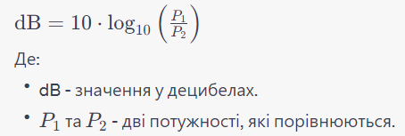

Стисле посилання на цей переклад: [https://bit.ly/AntennaGainExplained](https://bit.ly/AntennaGainExplained)

|  | Нижче вичитаний людьми машинний український переклад оригіналу. Для [VictoryDrones](https://www.victory-drones.com/) переклад вичитали: Faina, Samsonovych. Хочете покращити переклад чи знайшли помилку? — Лишіть коментар (Ctrl+Alt+M або «Меню» \> «Вставка» \> «Коментар»). Ми теж живі люди (як і ви) і робимо помилки. Роботи їх, до речі, також роблять 😉 |
| :---: | :---- |

# Що таке коефіцієнт підсилення антени?

**Зміст**

[**Симетрія	2**](#симетрія)

[**підсилення та спрямованість	2**](#підсилення-та-спрямованість)

[**Примітка про децибели	4**](#примітка-про-децибели)

[**Ваша відповідь	7**](#heading=h.d1wn2ene4h61)

*Коефіцієнт підсилення* як загальний термін – це вимір інтенсивності чогось (напруга, радіохвиля, звукова хвиля, тощо) відносно базового значення вимірюваної категорії. *Коефіцієнт підсилення* – це співвідношення: якщо пристрій приймає напругу на одному кінці і робить її в 20 разів більшою, він має коефіцієнт підсилення 20\. На практиці вони представлені за допомогою *децибел* – вимірювальна одиниця, якa дозволяє легко працювати з дуже великими або дуже малими співвідношеннями. Перегляньте примітку в кінці цієї статті, щоб дізнатися більше.

Отже, **коефіцієнт підсилення** антени – це **співвідношення** *між потужністю радіохвиль, які генерує антена, порівняно з потужністю, які генерує стандартна «еталонна антена», коли подається той самий сигнал*. Вважається, що ця еталонна антена, яка використовується як базова точка відліку, має коефіцієнт підсилення 0 дБ або 1:1 (дорівнює самій собі).

Еталонна антена зазвичай буває одного з двох типів: *ідеальна ізотропна* антена, яка випромінює однаково в усіх напрямках з нульовими втратами, або *дипольна* антена. Щоб показати, яка з них використовується як базова, у кінці додається літера:   
дБ**i** – підсилення відносно *ізотропної* антени і дБ**д** – підсилення відносно *дипольної антени*.

Сам диполь має коефіцієнт підсилення 2,15 дБ**i** (і 0 дБ**д**). Таким чином, щоб перетворити коефіцієнт підсилення в дБ**i** в коефіцієнт підсилення дБ**д**, відніміть 2,15 або додаєте 2,15, щоб конвертувати назад.

## Симетрія {#симетрія}

*Кожна антена приймає в той самий спосіб щo і передає*, тому коефіцієнт підсилення прийому антени (потужність електричного сигналу, створеному у ній радіохвилею, відносно потужності електричного сигналу вибраної еталонної антени) завжди такий самий, як коефіцієнт підсилення передачі.

Антена з підсиленням 3 дБ (3дБ \- це підсилення приблизно у 2 рази) в певному напрямку передаватиме 2 рази більші за еталонну потужність, але також радіохвилі, що надходять *від* цього напрямку створять у 2 рази потужніші сигнали для виявлення підключеним приймачем. *\[прим. пер.: якщо антена підсилює на передачу, то вона підсилює також і на прийом\]*

Якщо підсилення антени становить 13 дБд (співвідношення 20:1), її сигнал буде в 20 разів сильнішим, ніж у диполя (і її прийом також буде в 20 разів сильнішим)\! Чудово, правда?

Але є застереження щодо високого підсилення, і воно в основному таке: “*Безкоштовного обіду не буває”*.

## Підсилення та спрямованість {#підсилення-та-спрямованість}

*Справжні ізотропні антени не існують у реальному світі*, тобто жодна справжня антена не випромінює однаково сильно в усіх напрямках. Є напрямки, в яких вoнa випромінює найсильніше, а в інших – не випромінює взагалі. Тож, підсилення справжньої антени також не однакове в усіх напрямках: в деяких воно сильніше, в деяких слабше. Найпростіший спосіб показати це – графікoм коефіцієнтів підсилення антени в усіх напрямках навколо антени. Цей графік називається *діаграма спрямованості* і виглядає так:

Жирна лінія позначає коефіцієнт підсилення: чим далі від центру, тим більше коефіцієнт підсилення. Вище наведено діаграму випромінювання в *спрямованiй* антенi: підсилення в одному напрямку набагато більше, ніж в інших напрямках.

**Отже, коли ми говоримо про коефіцієнт підсилення антени, ми насправді маємо на увазі її коефіцієнт підсилення *в певному напрямку***. І цей напрямок зазвичай є тим, у якому коефіцієнт підсилення антени є найсильнішим.

Крім того, **антена не може видавати більше ніж ви подаєте на неї**. Сума всієї вихідної потужності в усіх напрямках, завжди дорівнює потужності, яку подали на антену (мінус невеликий відсоток втрат). Антени створюють підсилення, випромінюючи цю потужність так, що створені хвилі складаються в бажаному напрямку та гасяться в інших напрямках.

Отже, якщо антена має вищий за базовий (позитивний) коефіцієнт підсилення в якомусь напрямку, ви платите за це, маючи негативний коефіцієнт підсилення в інших напрямках. **Підсилення лише фокусує потужність, а не створює її.**

Для нашої уявної антени 13 дБ**д** це означає, що лише невеликий сектор отримує такий значний коефіцієт підсилення, а всі інші напрямки матимуть майже нульову випромінювану потужність, щоб компенсувати це.

Таким чином, підсилення – це не тільки вимірювання того, наскільки добре антена приймає чи передає, це також вимірювання *спрямованості* антени. Якщо антена зосереджує всю свою потужність у тісному конусі, вона матиме величезний коефіцієнт підсилення в цьому конусі та величезний коефіцієнт підсилення на коробці... Але її підсилення за межами цього конуса майже не існуватиме. Отже, коли ви вибираєте спрямовану антену, коефіцієнт підсилення також є показником *наскільки вона спрямована*, ось в чому справа. [Патч-антени](https://uk.wikipedia.org/wiki/%D0%9F%D0%B0%D1%82%D1%87-%D0%B0%D0%BD%D1%82%D0%B5%D0%BD%D0%B0) *\["патчі"\]* з низьким коефіцієнтом підсилення створять широкий конус, але з низьким коефіцієнтом підсилення, тоді як спрямовані антени з високим коефіцієнтом підсилення матимуть дуже вузьку зону, у якій вони можуть взагалі передавати чи приймати, але в ній вони будуть надпотужними.

Всеспрямовані антени (які, як ви тепер знаєте, ніколи не бувають *по-справжньому* всeспрямованими) мають діаграму спрямованості, яка більш-менш має форму пончика:

Вони мають однакове (і позитивне) підсилення в будь-якому напрямку перпендикулярному до антени, яке стає нижчим, коли напрямок наближається до осі антени. Ці антени *також* мають власний вид спрямованості: якщо ви встановлюєте антену вертикально, в «горизонтальний» площині коефіцієнт підсилення буде однаковим у будь-якому напрямку, але він може бути вищим або нижчим відносно «більш вертикальних» напрямків, роблячи бублик пласкішим. Іншими словами, антена може надавати перевагу горизонтальному підсиленню порівняно з вертикальним.

---

## Примітка про децибели {#примітка-про-децибели}

У багатьох галузях техніки коефіцієнти можуть легко стати надзвичайно великими або надзвичайно мізерними та мають тенденцію до значного збільшення. Радіо є одним з таких випадків. На вході приймача сигнали часто менше однієї десяти мільярдної частки вата. Коли вони виходять із передавача, їх часто вимірюють у кіловатах\! Антени, розповсюдження та електронні схеми змінюють силу сигналу на багато порядків величини *\[прим. пер.: на багато порядків \- це в мільйони, мільярди разів, багато нулів\]*.

Щоб впоратися з цією величезною різницею у значеннях, інженери вимірюють співвідношення у *децибелах*, або дБ. Це вимірювання співвідношення двох величин виражене десятичним логарифмом. Формула обчислення децибел така:

*\[прим. пер.:* log10  *числа **х** \-- це "скільки разів треба помножити 10 саме на себе, щоб отримать число **х**". Якщо **x**\=1000 (співвідношення потужностей \- 1000 разів), то*  log10*1000 \= **3**, бо 10 треба помножити саме на себе 3 рази: 10\*10\*10 \= 1000\. І щоб отримати децибели,* дБ \= 10×log10*, помножимо 3* × *10 \= 30 дБ\].*

Децибел –це *логарифмічнa* одиниця, що означає коли два співвідношення множаться, їхнi репрезентації в дБ просто додаються:   
10 децибел представляють співвідношення 10:1;   
20 дБ –це **10x***10, відповідає співвідношенню 100:1,*   
*а 30 дБ – це **10x***10x10, відповідає співвідношенню 1000:1 

Позитивні значення дБ означають, що співвідношення більше 1, а негативні значення дБ вказують на співвідношення менше 1: \-10 дБ представляє співвідношення 1/10, а 40 дБ — 1/10000.

Ось коротка шпаргалка дБ до фактичного співвідношення для чисел, менших за 10:

* 1 дБ відповідає приблизно 1,25:1  
* **3 дБ майже точно 2:1** (це найважливіше пам'ятати) *\[прим. пер.: xто забуде, то в інтернеті є [калькулятор](https://daycounter.com/Calculators/Decibels-Calculator.phtml)\]*  
* 7 дБ \~= 5:1  
* **10 дБ це 10:1** (точно)  
  Для всього іншого ви просто складаєте числа, які вам відомі:  
* 6 дБ (=3 дБ \+ 3 дБ) це \~ 4 (= 2 \* 2): 1, а 9 дБ це \~ 8: 1  
* 13 дБ дорівнює 10 дБ \+ 3 дБ, тому 10\*2=20:1.  
* 46 дБ дорівнює 40 дБ \+ 6 дБ \= 10^4 \* 4 \= 40000:1  
* 15 дБ \- це 10 дБ \+ 5 дБ; а 5 дБ – це десь між 3 дБ і 6 дБ (2 і 4), тому, ймовірно, це щось на три точки. Таким чином, ми припускаємо, що 15 дБ знаходиться десь у діапазоні 30-35 до 1\.5

\_\_\_\_\_\_\_\_\_\_\_\_\_\_\_\_\_\_\_\_\_\_\_\_\_\_\_\_\_\_\_\_\_\_\_  
Коефіцієнт підсилення нижче 1 означає, що продуктивність гірша, ніж еталонний рівень, але це може мати переваги, наприклад антена менша (що в контексті дронів означає, що вона важить менше та коротша, тому її легше розташувати та тримати пропелери подалі від неї\!

\_\_\_\_\_\_\_\_\_\_\_\_\_\_\_\_\_\_\_\_\_\_\_\_\_\_\_\_\_\_\_\_\_\_

Аналогія з ліхтариком – лампочка всеспрямована, але вам потрібне світло, щоб йти вперед, тому у вас є блискучий відбивач за лампочкою, щоб забезпечити максимальну яскравість («підсилення») в одному напрямку. 

[image1]: 

[image2]: 