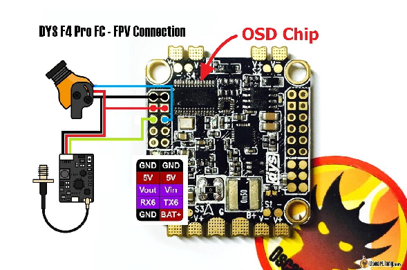
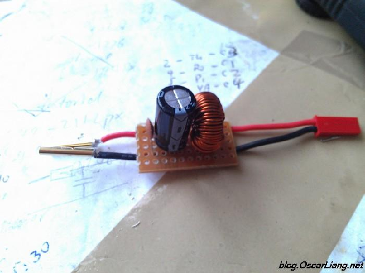
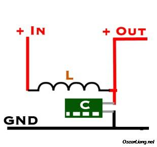

Стисле посилання на цей переклад: [https://bit.ly/LiangFixingVideoFPV](https://bit.ly/LiangFixingVideoFPV)

| 🫂 | Нижче вичитаний людьми машинний український переклад оригіналу. Для [VictoryDrones](https://www.victory-drones.com/) переклад вичитали: Kotan, Block. Хочете покращити переклад чи знайшли помилку? — Лишіть коментар (Ctrl+Alt+M або «Меню» \> «Вставка» \> «Коментар»). Ми теж живі люди (як і ви) і робимо помилки. Роботи їх, до речі, також роблять 😉 |
| :---: | :---- |

# Виправлення проблем із відео – шум, підключення VTX, фільтрація живлення

27 грудня 2019 р

У цій статті я поділюся кількома порадами щодо вирішення проблем і найкращими рішеннями, яких слід дотримуватися, щоб уникнути проблем із відеопередачею. Перешкоди та шум у вашому FPV відеоканалі можуть бути серйозною проблемою, а в деяких випадках навіть завдати шкоди оточуючим. 

*Деякі посилання на цій сторінці є партнерськими. Я \[автор англомовної версії Оскар Ланг\] отримую комісію (без додаткових витрат для вас), якщо ви робите покупку після переходу по посиланню. Це допомагає підтримувати безкоштовний контент для спільноти на цьому веб\-сайті. Будь ласка, прочитайте нашу [Політику партнерських посилань](https://oscarliang.com/affiliate-program-policy/) для отримання додаткової інформації.*

# Зміст

[Підключення VTX і камери](#найкращий-спосіб-з’єднання-vtx-і-камери)

Шуми від LiPo акумулятора

[Куди додати конденсатори](#куди-додати-конденсатори)

[Скручування проводів сигналу та заземлення](#скручування-дротів)

[Тримайте ESC подалі від FC BEC](#тримайте-esc-подалі-від-fc-bec)

[Кожен штифт заземлення відрізняється](#чим-відрізняється-заземлення)

[Заземлення сигналу важливе](#заземлення-—-це-важливо)

[«Білі лінії» у відео?](#«білі-смуги»-у-відео?)

[«Чорні лінії» у відео?](#«чорні-смуги»-у-відео?)

[Пряме підключення камери FPV до VTX](#пряме-підключення-камери-до-vtx)

[Майже останній засіб](#майже-останній-засіб)

[LC фільтр](#lc-фільтр)

[Перевірте антени](#перевірте-антени)

[Літаєте з іншими?](#літаєте-з-іншими?)

[Jello на Well-Tuned Quad](#«желе»-на-налаштованому-кваді)

|  | Збірка FPV камер [у цій електронній таблиці](https://docs.google.com/spreadsheets/d/1SFix5Wn8JDl5O6t0xeb-IngUiH41K2OIkpptk8hzAm4/edit?usp=sharing). |
| :---: | :---: |

|  | Збірка VTX 5,8 ГГц [у цій електронній таблиці](https://docs.google.com/spreadsheets/d/1YD3765S2pcZbyNis_38R2RCZ7TEfM1q-hvfXmU3pX2E/edit?usp=sharing). |
| :---: | :---: |

# **Найкращий спосіб з’єднання VTX і камери** {#найкращий-спосіб-з’єднання-vtx-і-камери}

Перш за все, ви повинні визначити, яка напруга необхідна для вашої камери. Більшість камер сьогодні можуть живитися від 5В до 30В або навіть вище.

Найбезпечніший спосіб підключити вашу [FPV камер](https://oscarliang.com/fpv-camera/)у напряму \- це від відеопередавача ([VTX)](https://oscarliang.com/video-transmitter/). На даний час, багато відеопередавачів мають вихід на 5В, призначений для живлення FPV-камер. Навіть якщо ви вже використовуєте джерело живлення для свого VTX, ми все одно рекомендуємо використовувати фільтрований вихід від VTX для камери, бо будь-яке додаткове фільтрування точно не завадить

Якщо з будь-якої причини ви не можете підключити камеру безпосередньо від відеопередавача (VTX), наступним найкращим рішенням буде підключення і VTX, і камери від одного регульованого джерела живлення із фільтром.

Більшість проблем, пов’язаних із шумом/перешкодами, спричинені живленням камери, або VTX, або обох, безпосередньо від LiPo батареї.

# **Шуми від LiPo**

Як згадувалося раніше, більшість камер і відеопередавачів (VTX)  тепер можуть живитися безпосередньо від акумулятора LiPo 4S-6S. Однак це не означає, що так треба робити. 

Будь-якому відеопристрою потрібне стабільне джерело живлення, щоб він міг передавати «чисте» зображення. Постійні коливання, які викликані ESC та двигунами, додають шумів від напруги LiPo акумулятора. Цей шум може проходити через PDB (плата розподілу живлення) або польотний контролер до вашого відеопередавача (VTX) і камери, згодом проявляючись як перешкоди у ваших окулярах.

Більшість відеопередавачів (VTX) сьогодні мають фільтр живлення не лише для вводу, але й додатково для вихідної напруги 5В. FPV-камери зазвичай практично не мають вбудованої фільтрації. Щоб усунути шум у відеопередачі, вам потрібне максимально стабільне живлення для вашої камери та відеопередавача (VTX), а саме тут і вступають у гру конденсатори.

# **Куди додати конденсатори** {#куди-додати-конденсатори}

Додаткові конденсатори *\[прим. пер.: або «кондéри», див. наш переклад [статті](http://bit.ly/WhyCapacitorsAreImportant) Оскара про важливість конденсаторів\]* часто використовуються на вході живлення до пристрою для очищення електричних перешкод. Теоретично кондер, розміщений найближче до джерела шуму, є найефективнішим, тому пілоти додають кондери до ESC на променях (якщо стоять окремі контролери)  своїх квадрокоптерів.

Те, як ви подаєте струм до свого відеопередавача (VTX), визначить найкраще місце для встановлення конденсатора. Якщо він отримує живлення від 5В, то вам слід поставити кондер на шину 5В, якщо це 12В, тоді помістіть кондер на шину 12В. Якщо він живиться безпосередньо від LiPo, тоді припаяйте кондер до роз’єму XT60.

Я бачу, що багато людей додають конденсатори на колодки XT60 незалежно від того, як живиться VTX. Це може допомогти зменшити рівень шуму у вашій системі загалом, але може бути не найефективнішим рішенням для вашого відео.

# **Скручування дротів**  {#скручування-дротів}

Рекомендується скручувати дроти по яким йде відеосигнал та заземлення разом, це діє як екран від від індукторів ESC та BEC \[блок регулювання напруги\]. Також тримайте сигнальні дроти відеопередавача (VTX) і живлення подалі від будь-яких індукторів блоків регулювання напруги.

# **Тримайте ESC подалі від FC BEC** {#тримайте-esc-подалі-від-fc-bec}

MOSFET, це такі маленькі мікросхеми на вашому ESC можуть створювати перешкоди, які впливають на польотнік, і якщо ваша камера та VTX підключені до нього, ви можете отримати спотворене відео.

# **Чим відрізняється заземлення** {#чим-відрізняється-заземлення}

В ідеалі всі контакти які йдуть на заземлення мають бути однакові, але насправді це не завжди так.

Зазвичай заземлення підключаються за допомогою дроту або майданчика на платі. Будь-який дріт або майданчик має опір, ємність та індуктивність.

Через це виникає різниця напруг між двома контактами заземлення на платі, якщо через них протікає струм. Можна сприймати це як надзвичайно маленький резистор.

Ось чому найкраще підключати заземлення камери та VTX до одного контакту або до двох контактів заземлення якомога ближче один до одного.

# 

# **Заземлення — це важливо** {#заземлення-—-це-важливо}

Через сигнальні дроти та дроти живлення проходить струм, і зрештою він має повернутися до свого джерела через заземлення. Це повний цикл, тому його називають «ланцюгом».

Якщо заземлення сигналу не під’єднано, сигнал може повернутися через заземлення живлення. Тому сигнал буде «більш вразливим» до шуму. Маючи окреме заземлення сигналу, ви можете краще «ізолювати» сигнал від живлення.

Це особливо важливо, коли ви живите свої модулі безпосередньо від LiPo батареї.

# **«Білі смуги» у відео?** {#«білі-смуги»-у-відео?}

«Білі смуги» зазвичай є ознакою надмірного шуму в живленні камери, VTX або обох. [Додавання конденсатора](https://oscarliang.com/capacitors-mini-quad/) з низьким ESR до живлення ESC, або напряму до XT60 зазвичай це виправляють.

**Подальше читання: [навіщо і куди додати конденсатор у міні-квадрокоптер?](https://oscarliang.com/capacitors-mini-quad/)** *\[цей текст [доступний](http://bit.ly/WhyCapacitorsAreImportant) у перекладі\]*

Коли ви отримуєте рядки у відео, спробуйте спочатку виправити це, увімкнувши камеру від відеопередавача (VTX). Якщо це не спрацює, спробуйте додати конденсатор.

# **«Чорні смуги» у відео?** {#«чорні-смуги»-у-відео?}

«Чорні смуги» зазвичай пов’язані з низьким енергоспоживанням, яке зазвичай спричинено енергоємним відеопередатчиком (VTX). Деякі VTX погано справляються зі зниженням напруги і їм може бути важко забезпечити бажану вихідну потужність.

Якщо ви отримуєте чорні смуги у відеопотоці, проблема може погіршуватися при вищій вихідній потужності, наприклад 800 мВт, ніж при меншій потужності, наприклад 25 мВт. Якщо це дійсно так, то це точно пов’язано із недостатньою потужністю або напругою для VTX.

Ви можете спробувати живити свій відеопередавач (VTX) безпосередньо від акумулятора. Якщо це не вирішить проблему, можливо, у вас несправний VTX або камера.

# **Пряме підключення камери до VTX** {#пряме-підключення-камери-до-vtx}

Не підключайте речі, якими ви не користуєтеся, наприклад керування камерою або OSD. Непотрібна проводка може створювати шум у системі FPV. Якщо ви не використовуєте екранне меню, просто підключить відеовихід вашої камери безпосередньо до вашого відеопередавача (VTX) замість під’єднання до польотнику (FC).

# **Майже останній засіб** {#майже-останній-засіб}

Якщо ви отримуєте кілька смуг у своєму відео, але нічого з перерахованого вище не допомогло, можливо, VTX або дроти камери вловлюють шум від інших компонентів. Це може бути, якщо ви прокладете сильно довгі сигнальні дроти від камери та відепередавача (VTX).

Рішення полягає у використанні «екранованого дроту» (міні-коаксіального дроту) замість звичайного силіконового дроту:[https://amzn.to/2OjPaFo](https://amzn.to/2OjPaFo)

# 

# 

# 

# 

# 

# 

# 

# 

# 

# 

# 

# 

# **LC фільтр** {#lc-фільтр}

Іншим рішенням для очищення відеоканалу є використання [LC фільтр](https://oscarliang.com/lc-filter-fpv/)а між живленням і модулями системи. Їх можна купити в готовому вигляді, а можна [Зробити власний фільтр живлення](https://oscarliang.com/power-filter-video-transmitter-fpv-camera/).

Це добре для визначенного шуму потужності, що надходить до вашої системи, але це не зменшує рівень шуму, як це робить конденсатор з низьким ESR.

# **Перевірте антени** {#перевірте-антени}

Можливо, ваша проблема із шумом зовсім не пов’язана з живленням, багато проблем із відео стаються через антени. Переконайтеся, що обидві антени VTX і VRX правильно встановлені та мають правильний тип роз’єму, тобто RP[\-SМА / SМА](https://oscarliang.com/fpv-antenna-connectors/), і що у них правильна поляризація [RHCP / LHCP](https://oscarliang.com/best-fpv-antenna/#rhcp-lhcp). Інша річ, яку ви можете спробувати — змінити канал, можливо, ви вловлюєте перешкоди від зовнішнього джерела.

# **Літаєте з іншими?** {#літаєте-з-іншими?}

Якщо ви летите з іншими і є перешкоди, дивись [цей посібник про те, як вибрати найкращі канали.](https://bit.ly/BardwellFPVTools)

# **«Желе» на налаштованому кваді** {#«желе»-на-налаштованому-кваді}

Більшість камер сьогодні мають матрицю CMOS, що означає, що вони більш схильні до «желе», ніж камери CCD. В ідеалі ви не повинні мати желе у своєму відео, якщо ваш квадрокоптер добре налаштований і працює належним чином. Якщо ви не чуєте помітних коливань квадрокоптера, але є желе, перевірте наступне:

* гвинти кріплення камери;

* об’єктив камери — чи не зламана стопорна гайка об’єктива;

* Матрицю на платі камери.

Якщо жодна з цих порад не допомогла, спробуйте використовувати кріплення TPU для камери. Гнучкий і м'який матеріал поглинає деякі вібрації.

**Історія редагування**

* Березень 2018 — статтю створено.

* Квітень 2019 — оновлено.

* Липень 2019 — додано «куди додати кришку» та «скручування проводів сигналу/землі».

* Вересень 2019 — додано інформацію про «екранування ESC» і відповідні антени.

* Грудень 2019 — переглянуто.

[image1]: 

[image2]: 

[image3]: 

[image4]: 

[image5]: 