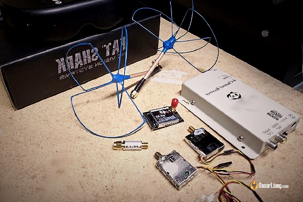
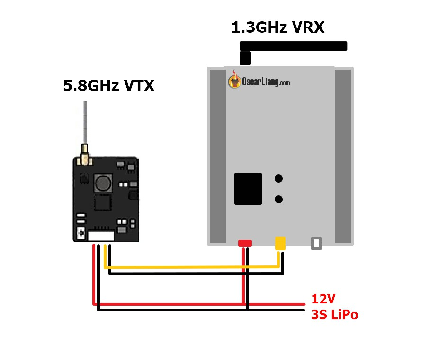

Стисле посилання на цей переклад: [https://bit.ly/LiangGuide1-2ghzFPVvideoSystem](https://bit.ly/LiangGuide1-2ghzFPVvideoSystem)   

| 🫂 | Нижче вичитаний людьми український переклад оригіналу. Для [VictoryDrones](https://www.victory-drones.com/) переклад вичитали Switch, Block та Nomad..  Хочете покращити переклад чи знайшли помилку? — Лишіть коментар (Ctrl+Alt+M або «Меню» \> «Вставка» \> «Коментар»). Ми теж живі люди (як і ви) і робим помилки. 😉 |
| :---: | :---- |

# **Інструкція: FPV-відеосистема на 1,2 ГГц \-1,3 ГГц**

Не достатня дальність польоту FPV на частоті 5,8 ГГц? У цій інструкції буде пояснено багато аспектів використання відеопередавачів (VTX) та приймачів (VRX) з частотою 1,2 ГГц – 1,3 ГГц для збільшення дальності. З її допомогою ви зможете розібратися у «що куди тиснути» та отримати кілька порад щодо оптимальної продуктивності.

*Деякі посилання на цій сторінці є партнерськими. Я \[автор англомовної версії Оскар Ланг\] отримую комісію (без додаткових витрат для вас), якщо ви купуєте після натискання одного із цих партнерських посилань. Це допомагає підтримувати безкоштовний контент для спільноти на цьому веб\-сайті. Будь ласка, прочитайте нашу [Політику партнерських посилань](https://oscarliang.com/affiliate-program-policy/) для отримання додаткової інформації.*

Зміст

[Порівняння 1,2 ГГц та 1,3 ГГц](#порівняння-1,2-ггц-та-1,3-ггц)

[Порівняння](#порівняння-1,2-ггц-та-1,3-ггц) [1,2 ГГц та 5,8 ГГц для FPV](#порівняння-1,2-ггц-та-5,8-ггц-для-fpv)

[Типові налаштування FPV на 1,2 ГГц](#типові-налаштування-fpv-на-1,2-ггц)

[Канали на частоті 1,2 ГГц](#канали-на-1,2-ггц)

[Перш ніж купувати, запитайте себе…](#перш-ніж-купувати,-запитайте-себе…)

[Який рівень потужності відеопередавача?](#який-рівень-потужності-відеопередавача?)

[Перешкоди від частоти](#перешкоди,-залежні-від-частоти-радіоуправління) радіоуправління

[Зменш](#зменшення-потужності-передавача)ення потужності передавача

Рознесення

[Фільтри](#фільтри)

[Зняття кришки](#зняття-кришки-відеоприймача) відеоприймача

Відеопередавач на [1,3 ГГц може впливати на GPS](#відеопередавач-на-1,3-ггц-може-впливати-на-gps)

[Використовуйте штатив](#використовуйте-штатив)

[Більше порад?](#більше-порад?)

* 

## **Порівняння 1,2 ГГц та 1,3 ГГц** {#порівняння-1,2-ггц-та-1,3-ггц}

Ви чуєте, як люди говорять про 1,2 ГГц, іноді про 1,3 ГГц, то в чому ж різниця?

Це одне й те саме\!

Канали, доступні на передавачах і приймачах на 1,2-1,3 ГГц, можуть варіюватися від 1080 МГц до 1360 МГц (1,08ГГц і 1,36ГГц), причому 1256 МГц і 1280 МГц, ймовірно, є найпопулярнішими каналами. Це тому, що це єдині дозволені *\[прим. пер.: у цьому частотному діапазоні\]* радіоканали в США, і багато антен налаштовані на ці частоти.

1,2 ГГц легко запам'ятати, оскільки це половина 2,4 ГГц — популярної частоти для радіоуправління. Але 1280 МГц насправді ближче до 1,3 ГГц, тому зрозуміло, чому деякі люди використовують таку назву.

## **Порівняння 1,2 ГГц та 5,8 ГГц для FPV** {#порівняння-1,2-ггц-та-5,8-ггц-для-fpv}

1,2 ГГц має багато переваг порівняно з 5,8 ГГц:

* 1,2 ГГц забезпечує набагато більший діапазон.  
* Надійність: відео із частотою 1,2 ГГц поступово стає все більш зернистим, поки вам не доводиться розвернутися, тоді як відео з частотою 5,8 ГГц має тенденцію миттєво переходити від чіткого до статичного чи зіпсованого шумами, і є дуже чутливим до перешкод між вами та літальним пристроєм.  
* Вимоги системи у 1,2 ГГц до антен не такі суворі, як у 5,8 ГГц, тому коли ви рухаєтеся на велику відстань, будь-які базові стрижневі антени будуть добре працювати.

Однак можна рідко побачити людей, які б використовували 1,2 ГГц на міні-квадрокоптерах. Як правило, ця частота застосовується на літаках і крилах великої дальності. І ось чому:

* 1,2 ГГц потребує величезних антен, які виглядали б смішно на квадрику.  
* Кількість доступних варіантів *\[апаратного забезпечення\]* обмежена, коли мова йде про відеопередавачі і відеоприймачі, оскільки ця технологія досить застаріла і малофункціональна порівняно з 5,8 ГГц.

* Існують досить суворі правила: у США необхідно мати ліцензію *\[на цей діапазон частот\]* незалежно від рівня потужності передавача, у той час як у багатьох інших країнах *\[цивільне\]* використання цього діапазону взагалі заборонене.

* Може перешкоджати роботі передавачів у популярних радіочастотних діапазонах, таких як 2,4 ГГц.

* Нижча якість відео порівняно із 5,8 ГГц, оскільки обладнання, що працює у нижчому діапазоні, дає змогу передавати меншу кількість даних *\[при тій же потужності передавача\].*

* Дуже обмежена кількість доступних каналів.

Але для тих, хто все ж таки використовує 1,3 ГГц, існує лише два фактори: дальність і надійність\! Нижча частота забезпечує набагато краще проникнення сигналу через перешкоди.

## **Типові налаштування FPV на 1,2 ГГц** {#типові-налаштування-fpv-на-1,2-ггц}

Думаю, що цей відеопередавач і приймач потужністю 400 мВт від ReadyMadeRC, ймовірно, є однією з найкращих на ринку конфігурацій для FPV з частотою 1,3 ГГц.

* Відеопередавач на 1,2 ГГц:  
  * AliExpress: [https://s.click.aliexpress.com/e/\_Dm1J6u1](https://s.click.aliexpress.com/e/_Dm1J6u1)  
  * Amazon: [https://amzn.to/41mumk5](https://amzn.to/41mumk5)  
* Відеоприймач на 1,2 ГГц:

  * AliExpress: [https://s.click.aliexpress.com/e/\_DmrowaN](https://s.click.aliexpress.com/e/_DmrowaN)

Однак це недешево, і якщо ви живете за межами США — готуйтеся платити більше, зважаючи на податок на імпорт. Якщо у вас обмежений бюджет, ознайомтеся з цією пропозицією на Banggood. Його функціонал такий самий, за винятком декількох каналів.

* Banggood Комбінація відеопередавача та приймача на 1,2 ГГц: [http://bit.ly/2s2wkXz](http://bit.ly/2s2wkXz)

Що стосується антен, то дипольні зразки, з якими вони зазвичай постачаються, здебільшого нормальні. Якщо вам потрібні додаткова дальність та надійність, ознайомтеся з цими популярними антенами зі вторинного ринку.

* Антена для відеоприймача/передавача: [https://s.click.aliexpress.com/e/\_Dm0VyCv](https://s.click.aliexpress.com/e/_Dm0VyCv)  
* Патч-антена (для відеоприймача): [https://s.click.aliexpress.com/e/\_DE0gUYh](https://s.click.aliexpress.com/e/_DE0gUYh)

## **Канали на 1,2 ГГц** {#канали-на-1,2-ггц}

Ось декілька поширених каналів на передачах 1,2/1,3 ГГц для FPV, але зауважте, що не всі ці канали можуть бути доступні:

* 1010 МГц  
* 1040 МГц  
* 1080 МГц  
* 1120 МГц  
* 1160 МГц  
* 1200 МГц  
* 1240 МГц  
* 1280 МГц (США)  
* 1320 МГц  
* 1360 МГц  
* 1258 МГц (США)  
* 1100 МГц  
* 1140 МГц

## **Перш ніж купувати, запитайте себе…** {#перш-ніж-купувати,-запитайте-себе…}

Чи використовуєте ви зараз налаштування на 5,8 ГГц? Якщо так, чи використали ви вже максимально можливості налаштування на 5,8 ГГц? Я веду до того, що варто уникати імпульсивних покупок нового пристрою, якщо у вас ще є можливість наростити ефективність при поточних налаштуваннях.

Відеопередавач потужністю 600 мВт на частоті 5,8 ГГц із хорошою спрямованою антеною на приймачі легко дасть вам додаткові декілька миль дальності\! (Багато хто вже досяг 10+ км, дивіться на Youtube). У моєму випадку, найкращий результат — це політ з відеопередавачем потужністю 25 мВт на відстань 1 км, тому потенціал 5,8 ГГц очевидний для досягнення середньої або навіть великої дальності у відкритому полі :)

Ось декілька ідей [щодо антен для налаштувань на 5,8 ГГц.](http://bit.ly/LiangBestFPVAnt)

Ключ до досягнення достатньої дальності на частоті 5,8 ГГц — це підтримання прямої видимості між антенами передавача та приймача. Сигнал значно погіршується через перешкоди: одне маленьке дерево — це все, що потрібно, щоб заблокувати ваш сигнал, і саме тут стає в нагоді 1,3 ГГц.

## **Який рівень потужності відеопередавача?** {#який-рівень-потужності-відеопередавача?}

Відеопередавач 1,3 ГГц все ще досить примітивний порівняно з відеопередавачем на частоті 5,8 ГГц, оскільки ця технологія та продукти на її основі не змінювалися протягом багатьох років. Зазвичай, вони оснащені величезним радіатором із фіксованою вихідною потужністю, яку неможливо змінити, на відміну від найновішого відеопередавача на 5,8 ГГц.

Коли ви тільки переходите на частоту 1,3 ГГц, немає необхідності обирати високу потужність відеопередавача. Потужності від 200 мВт до 400 мВт достатньо для початку. Згідно з коментарями нашої спільноти, відеопередавач потужністю 400 мВт здатний подолати 15 миль *\[24 км\]* та більше.

Якщо ви підвищуєте потужність відеопередавача, але не розумієте до кінця навіщо, це може принести більше шкоди, ніж користі. Відеопередавач високої потужності може зашкодити роботі радіоприймача, спричинивши проблеми з дальністю ще задовго до того, як ваше відео вийде з ладу. Він може навіть перешкоджати роботі інших компонентів на вашому літальному пристрої, таких як цифрові сервомеханізми та GPS.

Успішний політ з системою FPV на 1,2 ГГц — це комбінація правильних налаштувань, середовища польоту та антен.

## **Перешкоди, залежні від частоти радіоуправління** {#перешкоди,-залежні-від-частоти-радіоуправління}

Як уже згадувалося, обладнання яке працює у радіоканалі на 2,4 ГГц може перешкоджати відео на 1,2 ГГц, тому натомість зазвичай використовується 433 МГц або 900 МГц (868 МГц — 915 МГц), як, наприклад, у моделях [Crossfire](https://bit.ly/LiangTBSCrossfireSetup). Намагайтеся триматися подалі від людей, які літають на частоті 2,4 ГГц.  
При 1,3 ГГц можна також певною мірою отримати перешкоди від 900 МГц. Ситуація погіршується, коли ви передаєте велику потужність на модуль передавача (наприклад, 1 Вт або вище). Нижче наведено кілька порад, які допоможуть мінімізувати перешкоди.

### **Зменшення потужності передавача** {#зменшення-потужності-передавача}

Перш за все, не перемикайтеся на максимальну потужність, якщо вам це не конче потрібно. Я знаю, що цей варіант доступний, і є спокуса його використати, але іноді він може принести більше шкоди, ніж користі.

200-250 мВт на вашому Crossfire/R9M теоретично достатньо на милі, та, ймовірно, з цією потужністю можна навіть перевищити максимальну відстань, яку дозволяє потужність батареї вашого квадрокоптера. *\[Прим. пер.: мається на увазі, що батарея все одно розрядиться раніше, ніж дрон вилетить із зони покриття сигналу управління\].*

### **Рознесення**

Переконайтеся, що між радіо та відеоприймачем на землі достатнє рознесення. Неможливо точно сказати, яким воно має бути, можливо, 20 футів *\[6 метрів\]* або навіть 50 футів *\[15 метрів\].* Це, насправді, залежить від фактичних налаштувань та навколишнього середовища.

Не менш важливим є достатнє рознесення між відеопередавачем та радіоприймачем на літальному пристрої.

Ознайомтеся з матеріалом «[Зроби сам: перемикач між 1.2ГГц та 5.8ГГц](https://oscarliang.com/1-3ghz-5-8ghz-relay/)». Це простий спосіб збільшити рознесення без дротів. Цей трюк також дозволяє використовувати окуляри FPV з вбудованим відеоприймачем на 5,8 ГГц разом із системою FPV або іншими частотами.  

### **Фільтри** {#фільтри}

Ви можете придбати для вашого відеопередавача або приймача фільтри, призначені для відсіювання сигналів на небажаних частотах. Це може допомогти зменшити перешкоди, коли рознесення антен неможливе/недостатнє. Однак вдавайтеся до такого кроку за крайньої необхідності, оскільки ці фільтри також можуть призвести до втрати потужності сигналу.

* [Цей режекторний фільтр](https://s.click.aliexpress.com/e/_DmMRUKl) *\[notch filter\]* допомагає зменшити перешкоди від радіо 868 МГц і 915 МГц (режекторний фільтр TBS).  
*  [Цей фільтр нижніх частот](https://s.click.aliexpress.com/e/_DC313lr) *\[lowpass filter\]* може допомогти зменшити перешкоди від радіо на 2,4 ГГц (фільтр нижніх частот). Він дозволяє використовувати радіоуправління на 2,4 ГГц і літати з людьми з частотою 2,4 ГГц.

Для подальшого ознайомлення: [Що таке режекторний фільтр і фільтр низьких частот?](https://oscarliang.com/filter-betaflight/) (інший сценарій, але принцип той самий)

### **Зняття кришки відеоприймача** {#зняття-кришки-відеоприймача}

Хитрість полягає в тому, щоб зняти кришку відеоприймача на 1,3 ГГц, що нібито допомагає зменшити перешкоди.

Це може звучати трохи дивно, але було багато разів доведено, що це до певної міри працює. Це нічого вам не коштуватиме, тому варто спробувати, якщо інші варіанти не спрацювали.

## **Відеопередавач на 1,3 ГГц може впливати на GPS** {#відеопередавач-на-1,3-ггц-може-впливати-на-gps}

Інший фактор, який слід враховувати, полягає в тому, що передача сигналу на частоті 1,3 ГГц може вплинути на модуль GPS на вашому FPV-дроні. Тримайте антени відеопередавача якомога далі від GPS-модуля.

## **Використовуйте штатив** {#використовуйте-штатив}

Оскільки ви, ймовірно, збираєтеся літати на великі відстані завдяки передачачу на частоті 1,2 ГГц, вам може знадобитися штатив або просто довгий стовп для встановлення відеоприймача та антени. Що вище ви зможете встановити антену відеоприймача від землі — то надійніший сигнал ви отримаєте.

## **Більше порад?** {#більше-порад?}

Якщо у вас є ще якісь поради, про які я не згадав у статті, не соромтеся поділитися із нами в коментарях :)

**КОМЕНТАРІ** 

SILBERNERSURFER

Чи можете ви порекомендувати найкращий тип антен для наземної станції FPV на частоті 5,8 ГГЦ, будь ласка? Дякую\!

OSCAR

перегляньте [цей допис](https://oscarliang.com/best-fpv-antenna/).

[image1]: 

[image2]: 