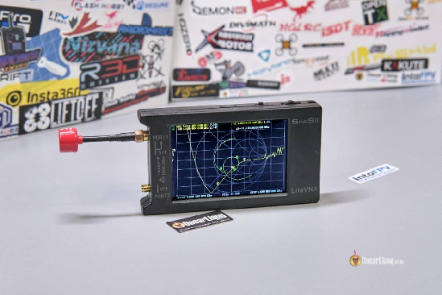
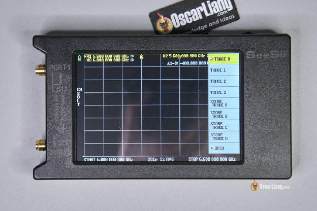
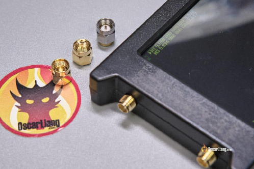
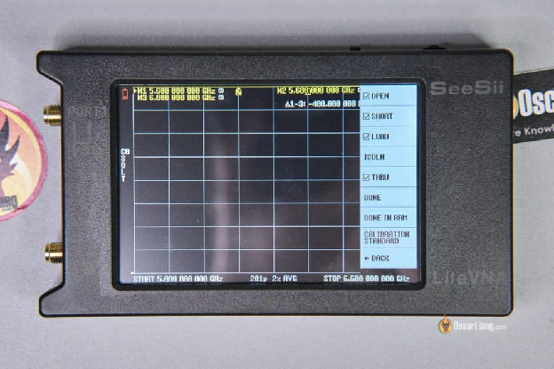
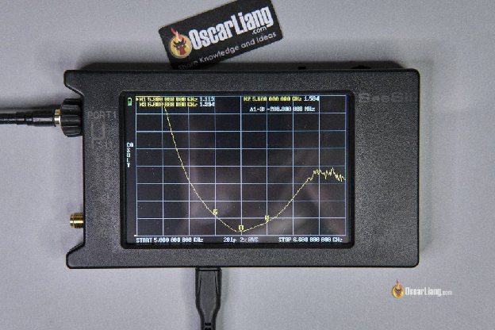

Стисле посилання на цей переклад:  [https://bit.ly/MeasureAntennaSWR](https://bit.ly/MeasureAntennaSWR)

|  | Нижче вичитаний людьми машинний український переклад оригіналу. Для [VictoryDrones](https://www.victory-drones.com/) переклад вичитали: Faina, Max Well\!. Хочете покращити переклад чи знайшли помилку? — Лишіть коментар (Ctrl+Alt+M або «Меню» \> «Вставка» \> «Коментар»). Ми теж живі люди (як і ви) і робим помилки. Роботи їх, до речі, також роблять 😉 |
| :---: | :---- |

# **Як виміряти КСX антени за допомогою LiteVNA: Повна інструкція** 

Дізнайтесь як використовувати LiteVNA для точного вимірювання КСХ *\[коефіцієнт стоячої хвилі\]*  – важливого аспекту продуктивності антени, що вказує на відбиття потужності. Цей посібник охоплює все – від початкової настройки, калібрування, до проведення точних вимірювань КСХ, забезпечуючи оптимальну продуктивність антени для ваших FPV-дронів. 

*Деякі посилання на цій сторінці є партнерськими. Я \[автор англомовної версії Оскар Ланг\] отримую комісію (без додаткових витрат для вас), якщо ви робите покупку після натискання одного із цих партнерських посилань. Це допомагає підтримувати безкоштовний контент для спільноти на цьому веб\-сайті. Будь ласка, прочитайте нашу [Політику партнерських посилань](https://oscarliang.com/affiliate-program-policy/) для отримання додаткової інформації.*

**Я перевірив КСХ різних антен та опублікував їх графіки тут:**  **[https://oscarliang.com/fpv-antenna-swr/](https://oscarliang.com/fpv-antenna-swr/)**

Перегляньте інструменти, які я рекомендую для збірки FPV дронів: [https://bit.ly/LiangFPVToolsMaterials](https://bit.ly/LiangFPVToolsMaterials)  

Зміст 

[Що таке LiteVNA?	2](#що-таке-litevna?)

[Що таке КСХ?	3](#що-таке-ксх?)

[Як користуватися LiteVNA	5](#як-користуватися-litevna)

[Відображення трасировки	5](#відображення-трасировки)

[Sweep Range \[Діапазон розгортання\]	7](#sweep-range-[діапазон-розгортання])

[Калібрування	7](#калібрування)

[Bикористання адаптера або кабелю	11](#bикористання-адаптера-або-кабелю)

[Як виміряти КСХ антени	11](#як-виміряти-ксх-антени)

[Висновок	12](#висновок)

## 

## **Що таке LiteVNA?**  {#що-таке-litevna?}

LiteVNA означає Легкий Векторний Аналізатор Мережі.

Векторний аналізатор \- це прилад, який може вимірювати різні властивості антени, такі як їх налаштована частота і як добре вони налаштовані на цю частоту.

Раніше векторні аналізатори були дуже дорогими, коштуючи тисячі доларів, їх могли дозволити лише наукові лабораторії. Однак LiteVNA \- це малий і доступний векторний аналізатор мережі, який ламає цей бар'єр ціни, і його можна придбати за близько 130 доларів. Остання модель LiteVNA64 може вимірювати до 6,3 ГГц, охоплюючи діапазон 5,8 ГГц, який часто використовується для FPV дронів. Наприклад, він може відображати графіки Сміта та КСХ від 5,6 ГГц до 6,0 ГГц, а також працює з нижніми частотами, такими як 433 МГц (радіо-зв'язок), 868/915 МГц (радіо-зв'язок), 1,3 ГГц (FPV-зв'язок), 2,4 ГГц (FPV-зв'язок та стандартний RC-зв'язок) і т. д. 

LiteVNA можна використовувати для вимірювання КСХ антен та аналізу конструкції антен (якщо ви їх виготовляєте), оцінки фільтрів і виявлення несправностей у коаксіальних кабелях. Хоча LiteVNA не такі точні, як їх лабораторні аналоги, вони достатньо точні для аматорського середовища. Існують більш дешеві вимірювачі КСХ, доступні для використання в FPV, наприклад, КСХ-метр [OwlRC SWR](https://oscarliang.com/owlrc-swr-meter/), але вони не мають надійності та розширених функцій LiteVNA. 

**LiteVNA можна придбати у цих продавців (ВАЖЛИВО: переконайтеся, що він підтримує до 6,3 ГГц\!):** 

* **AliExpress: [https://s.click.aliexpress.com/e/\_Dej0jPx](https://s.click.aliexpress.com/e/_Dej0jPx)**

* **Amazon: [https://amzn.to/4cGjGCE](https://amzn.to/4cGjGCE)**

## **Що таке КСХ?**  {#що-таке-ксх?}

**КСХ** *\[SWR\]*, або **КСХ(Н)** *\[VSWR\]* , є важливим фактором у продуктивності антени, що означає **Коефіцієнт Стоячої Хвилі (за напруженістю)**.  
Цей показник вказує на кількість потужності, яка відбивається назад до джерела. В ідеалі–вся потужність від передавача мала б іти до антени та випромінюватися у вигляді радіохвиль. Однак насправді кожна антена має особливості конструкції, тому деяка енергія буде відбита назад. Коли антена використовується для передавання, високий КСХ може спричинити перегрів передавача, навіть потенційно пошкодити радіосистему. I навпаки, якщо антена призначена для отримання сигналу, високий КСХ не зашкодить приймачу, але може погіршити якість прийому сигналу.

Дізнайтеся більше про [КСХ антени у інструкції по антенам](https://drive.google.com/file/d/13ytwiuHZ9DEcv1IHZMO8-Q5EomyfTl37/edit).

Хоча деякі виробники антен показують значення КСХ на своїх сторінках товарів, ці цифри не завжди є точними і можуть не вказувати на частоту, на якій вони виміряні. З часом, пошкодження антени можуть змінити її значення КСХ. Iнструмент для вимірювання може допомогти вам оцінити стан і продуктивність антени та вирішити, на якому каналі найкраще використовувати її. 

Наприклад, розгляньте діаграму КСХ антени RushFPV Cherry. Між 5600МГц (Маркер 2\) та 6000МГц (Маркер 3), найнижче значення КСХ становить 1,113 при рівно 5,8ГГц, що є  дуже добрим. Навіть при 5600МГц та 6000МГц, КСХ становить лише близько 1,4 та 1,6 відповідно, що робить цю антену ідеальною для використання в FPV. *\[прим. пер.: пілоти не дуже згодні з Лянгом, і критикують антени Rush Cherry за нестабільні характеристики\]* 

Які втрати сигналу та скорочення дальності для КСХ 1.1? Давайте подивимося у цій таблиці, яку я склав. Це приблизно 0.2% втрат сигналу та 0.1% скорочення дальності, що в принципі ніщо. Для КСХ 1.4 і 1.6 скорочення дальності становить відповідно 1.4% та 2.7%. 

Додаткові матеріали::

* **Я тестував КСХ різних антен та опублікував їх графіки тут: [https://oscarliang.com/fpv-antenna-swr/](https://oscarliang.com/fpv-antenna-swr/)**

* Дізнайтеся більше про те, як розрахувати дальність FPV у цьому посібнику:   
  [https://bit.ly/LiangMaximizingFPVrange](https://bit.ly/LiangMaximizingFPVrange) 

* Я створив калькулятор дальності FPV, який дозволяє ввести всі числа для оцінки максимальної дальності: [https://oscarliang.com/js/fpvrange.html](https://oscarliang.com/js/fpvrange.html)

---

## **Як користуватися LiteVNA**  {#як-користуватися-litevna}

### **Відображення трасировки**  {#відображення-трасировки}

Заводські налаштування LiteVNA показують всі 4 трасировки ***\[Trace\]***, що може бути незручно. Оскільки нас головним чином цікавить ***SWR** \[КСХ\]*, можна видалити інші 3 трасировки:

1. Перейдіть до **Display** "Відображення" та скасуйте вибір всіх трасировoк, крім **Trace 0\.**  
2. У розділі **Format S11** "Формат S11" змініть на КСХ *\[**SWR\]***.  
3. У розділі **Scale/DIV**, встановіть його на 0,5 та увімкніть **Show grid values** *\[Показати значення сітки\].* 

### **Sweep Range *\[Діапазон розгортання\]***  {#sweep-range-[діапазон-розгортання]}

Ось як ви встановите діапазон частот, який вам треба проаналізувати:

1. Перейдіть до **Stimulus** "Стимул", виберіть **Start** "Початок" і введіть найнижчу частоту, яку ви хочете відстежити.  
2. Виберіть **Stop** "Стоп" і введіть найвищу частоту, яку ви хочете відстежити.  
3. Зазвичай, для FPV я встановлюю діапазон від 5,6 ГГц до 6,0 ГГц.

Пам'ятайте, рекомендується перекалібрувати ваш VNA кожного разу, коли ви налаштовуєте діапазон сканування. 

### **Калібрування**  {#калібрування}

Важливо калібрувати ваш LiteVNA перед виконанням будь-яких вимірювань.

Використання некаліброваного VNA робить результати ненадійними, по суті роблячи їх безглуздими та вводячи в оману. LiteVNA постачається з набором калібрувальних насадок (розірваний роз’єм, короткозамкнутий роз'єм та роз'єм з узгодженим навантаженням\*) *\[open, short, and load connectors\]*, які є необхідними для процесу калібрування.   
\_\_  
\*(*прим. пер.:* У контексті калібрування векторного аналізатора мереж (VNA) "конектор з узгодженим навантаженням" означає роз'єм, який використовується для завершення лінії передачі зі специфічним імпедансом. Зазвичай він складається з точного резистора всередині корпусу конектора, який відповідає характеристичному імпедансу лінії передачі або пристрою, що тестується.

Конектор з узгодженим навантаженням використовується під час процесу калібрування для забезпечення відомого та стабільного опорного імпедансу в кінці лінії передачі. Це дозволяє VNA точно вимірювати та характеризувати властивості лінії передачі та підключених пристроїв, порівнюючи сигнали, відбиті від конектора навантаження, з сигналами від інших калібрувальних стандартів, таких як конектор з розірваною лінією та короткозамкнутий конектор.)

Перейдіть до меню калібрування, і підключіть розірваний роз’єм (який не має середньої контактної вставки) до першого порту. Виберіть **Open** "Розірваний" у меню. 

Повторіть процес для роз'ємів **Short** "Короткозамкнутий" і **Load** "Узгоджене навантаження". Зверніть увагу, що обидва цих роз'єми мають центральний контакт, однак "короткозамкнутий роз'єм" коротший, тоді як y "узгодженому навантаженні" він довший. Переконайтеся, що роз’єм добре закручений, щоб забезпечити хороше з'єднання. 

Якщо ви тестуєте фільтри, вам також потрібно калібрувати **Thru** *\[ Прим. пер.: "**Thru**" вказує на функцію або режим, призначений для вимірювання характеристик з'єднання прямого проходу, такого як кабель чи лінія передачі \- може бути радіолінія\]* шляхом підключення Port 1 до Port 2 за допомогою наданого кабелю. Однак, якщо ви виключно тестуєте коефіцієнт стоячої хвилі антени, як показано тут, це можна пропустити. 

Після завершення натисніть **Done** "Готово". У вас є можливість зберегти цe калібрування в пам'яті, яке автоматично завантажиться при наступному запуску пристрою, включаючи всі налаштування та діапазон частотного сканування. Ця функція дозволяє зберігати кілька калібрувань з різними налаштуваннями та перемикатися між цими профілями в меню **Recall** "Відновлення", що дуже зручно.

Крім того, ви можете перевірити своє калібрування за допомогою діаграми Сміта. Точка короткозамкнутого роз'ємa повинна бути в центрі лівої частини кола, точка роз'ємa узгодженого навантаження безпосередньо в центрі, а точка розірваного роз'ємa \- в центрі правої частини кола. Пам'ятайте, що рекомендується повторно калібрувати ваш VNA кожного разу, коли ви змінюєте діапазон сканування. 

### **Bикористання адаптера або кабелю**  {#bикористання-адаптера-або-кабелю}

Якщо ви плануєте використовувати будь-який адаптер або кабель під час тестування, важливо провести повторне калібрування з підключеним адаптером. Цей крок допомагає уникнути потенційного впливу вашого тестового кабелю або адаптера на результати.

Якщо у вас нема калібрувального набору з відповідним роз'ємом, ви можете вносити корективи за допомогою **Electrical Delay (E. Delay)** "Електричної Затримки". Спочатку калібруйте VNA без адаптера, а потім підключіть адаптер. Ви помітите, що точка відкритого роз'ємy зсунулася на діаграмі Сміта. Це можна виправити, перейшовши до **Scale** "Масштабу", а потім **Electrical Delay (E. Delay)** "Електрична Затримка". Введіть значення, поки точка відкритого роз'ємy не вирівняється у правильному положенні. Зазвичай це коливається між 50-150 пікосекунд для адаптерів SMA (або більша затримка для кабелів). 

### **Як виміряти КСХ антени**  {#як-виміряти-ксх-антени}

Для тестування антени за допомогою LiteVNA спочатку підключіть антену до першого порту. Переконайтеся, що вона добре закріплена, щоб забезпечити надійне з'єднання. Розмістіть антену подалі від будь-яких металевих або провідних матеріалів. Потім VNA відобразить графік, який покаже КСХ в межах вашого вказаного діапазону частот.

Важливо:

* Переконайтеся, що навколишній простір чистий та вільний від перешкод під час тестування. Зокрема, тримайте прилад і антени подалі від металу або будь-якого магнітного матеріалу.  
* Крім того, перевірте роз'єм SMA, щоб переконатися, що він чистий. 

Більшість антен мають впадину у графіку, що вказує на частоту, до якої вони найкраще налаштовані. Хоча деякі антени можуть не показувати виразної впадини, відносно низьке значення КСХ у потрібному діапазоні частот, як правило, є прийнятним. 

При КСХ рівному 2, лише близько 10% потужності відбивається назад в передавач, що вважається дуже хорошим. При КСХ нижче 2 різниця в реальній продуктивності практично непомітна, але, звичайно, чим нижче, тим краще. 

Визначте частоту з найнижчим КСХ, щоб вибрати [найкращий канал FPV для використання](https://docs.google.com/document/d/17l5TuoQHlCX9c0geljh3U6uSJ2oOYT6c7pZEaTihsg4/edit). Рекомендується вибрати антену для приймача, яка відповідає налаштованій частоті для оптимальної продуктивності. 

## **Висновок**  {#висновок}

Використання LiteVNA надає докладнy інформацію про КСХ вашої антени, допомагаючи вибрати найкращу частоту для хорошої продуктивності. Його також можна використовувати для перевірки, чи відповідає ваша антена вимогам для FPV. LiteVNA відомий як доступний та практичний інструмент, який забезпечує надійність та широкий спектр функцій для ефективного налаштування та оцінки ваших антен. 

[image1]: 

[image2]: 

[image3]: 

[image4]: 

[image5]: 

[image6]: 

[image7]: 