Стисле посилання на цей переклад: [bit.ly/HowtoPositionAntenna](https://bit.ly/HowtoPositionAntenna)  

| 🫂 | Нижче вичитаний людьми машнний український переклад оригіналу. Для [VictoryDrones](https://www.victory-drones.com/) переклад вичитали: Oleg, Block. Хочете покращити переклад чи знайшли помилку? — Лишіть коментар (Ctrl+Alt+M або «Меню» \> «Вставка» \> «Коментар»). Ми теж живі люди (як і ви) і робим помилки. Роботи їх, до речі, також роблять 😉 |
| :---: | :---- |

# Як встановити/орієнтувати антени передавача та приймача на FPV-дроні

25 січня 2023 року

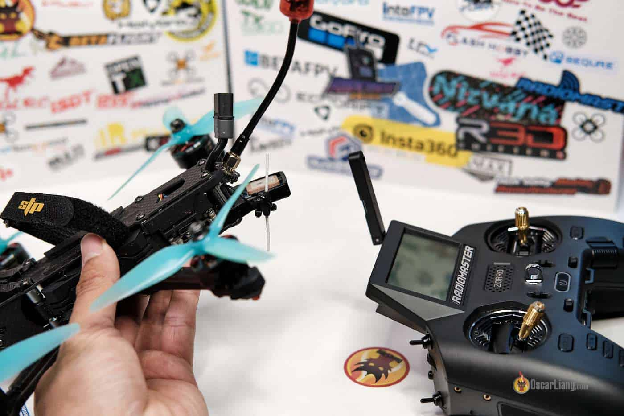

Правильно встановивши та орієнтувавши антени радіопередавача та приймача, можна оптимізувати якість сигналу та радіус дії. У цій публікації я покажу вам найкращі способи орієнтування антен у різних системах віддаленого контролю *\[RC\],* включаючи Crossfire, ExpressLRS і Frsky.

*Деякі посилання на цій сторінці є партнерськими. Я \[автор англомовної версії Оскар Ланг\] отримую комісію (без додаткових витрат для вас), якщо ви робите покупку після натискання одного із цих партнерських посилань. Це допомагає підтримувати безкоштовний контент для спільноти на цьому веб\-сайті. Будь ласка, прочитайте нашу [Політику партнерських посилань](https://oscarliang.com/affiliate-program-policy/) для отримання додаткової інформації.*

Зміст

[Пояснення щодо антени приймача](#пояснення-щодо-антени-приймача)

[Діаграма спрямованості антени](#діаграма-спрямованості-антени)

[Як позиціонування антени впливає на дальність дії](#як-позиціонування-антени-впливає-на-дальність-дії)

[Як закріпити антену приймача](#як-закріпити-антену-приймача)

[«Лінивий» спосіб](#«лінивий»-спосіб)

[Найкращий спосіб](#найкращий-спосіб)

[Найкращий спосіб направити антену передавача](#найкращий-спосіб-спрямувати-антену-передавача)

[Монопольна антена](#монопольна-антена)

[Як встановлювати у випадку приймачів із рознесеними антенами](#як-встановлювати-у-випадку-приймачів-із-рознесеними-антенами)

[Історія редагування](#історія-редагування)

## **Пояснення щодо антени приймача** {#пояснення-щодо-антени-приймача}

Більшість сучасних радіоприймачів, таких як ExpressLRS і Crossfire, використовують дипольні антени. Дипольні антени мають два кінці: один кінець є антенним елементом, а інший йде на масу. Обидва кінці однаково важливі, якщо будь-який з кінців пошкоджено або зігнуто, це матиме певний вплив на продуктивність.

Розмір антени залежить від радіочастоти; нижча частота, наприклад 900 МГц, зазвичай вимагає більшу антену, ніж 2,4 ГГц.

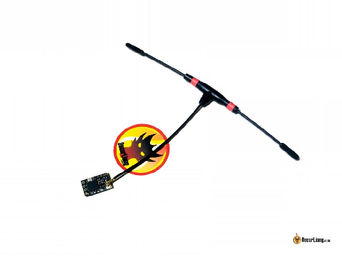  
*Антена приймача Crossfire*

*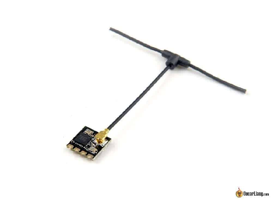*  
*Приймальна антена ExpressLRS*

## **Діаграма спрямованості антени** {#діаграма-спрямованості-антени}

Діаграма спрямованості дипольної антени має форму бублика, вона має найсильніший сигнал збоку та найгірший сигнал біля обох кінців антени *\[зони, що відмічені зеленим на зображенні ничже\].*  
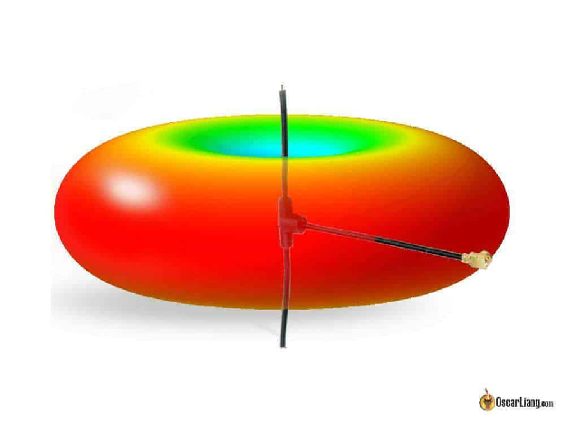

## **Як позиціонування антени впливає на дальність дії** {#як-позиціонування-антени-впливає-на-дальність-дії}

Взаємне розташування антен передавача та приймача надзвичайно впливає на радіус дії. У прикладі №1 на наступному графіку показано оптимальну орієнтацію обох антен для максимальної дальності, коли антени розташовані паралельно.

А тепер уявіть, що ваш квадрокоптер просто повертається на 90 градусів, і ми опиняємось в ситуації, як показано у прикладі №2, де кінчик антени приймача стає спрямованим на антену передавача, і ваш радіус дії зменшиться. Найгіршим сценарієм буде приклад №3, коли кінчики обох антен спрямовані одна на одну.

# Як закріпити антену приймача {#як-закріпити-антену-приймача}

## **«Лінивий» спосіб** {#«лінивий»-спосіб}

Якщо ви не літаєте на далекі відстані, досить часто можна просто прив’язати антену до одного із променів за допомогою стяжок. Це, мабуть, найпростіший спосіб встановлення антени приймача.

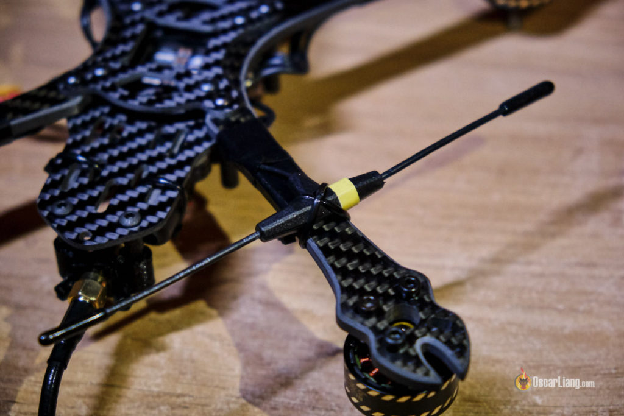  
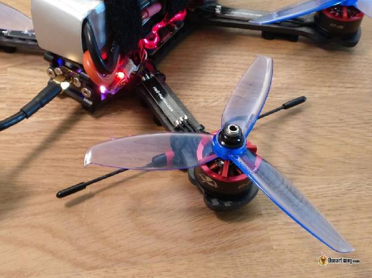  
Для «незв’язаних» дипольних антен можна використати дві стяжки, обмотані навколо променя у протилежному напрямку, і прикріпити дроти антени до стяжки за допомогою термозбіжних трубок (термоусадки). *\[Примітка перекладача: це дуже поганий спосіб, бо параметри антени (відстань між елементами діполя) залежатимуть від ширини луча. Для наших FPV-дронів так краще не робити.\]*  
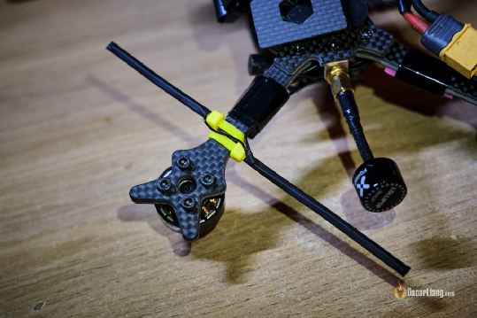  
Іншим поширеним рішенням є використання надрукованого на 3D принтері кріплення, яке робить конструкцію більш акуратною.  
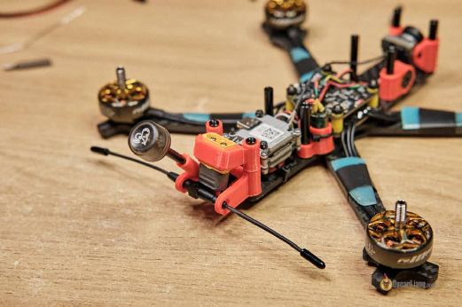  
Ось поганий приклад, як бачите, обидва кінці антени торкаються вуглецевого волокна. Важливо тримати активний елемент антени якомога далі від вуглецевого волокна, якщо ви хочете отримати найкращий радіус дії. Вуглецеве волокно є провідним і може блокувати/послаблювати радіосигнал *\[ прим. перекладача: я б ще подалі від моторів тримав\].*

### **Найкращий спосіб** {#найкращий-спосіб}

Для зручності та довговічності більшість людей просто встановлюють антену RX горизонтально, але найкращий спосіб — встановити антену вертикально, щоб антена приймача завжди була паралельно з антеною передавача.  
Вам може бути цікаво, чому антена нахилена під кутом? Ну, ми повинні компенсувати висоту дрона, коли він летить вперед.

## 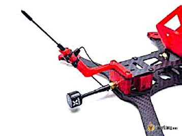 

## **Найкращий спосіб спрямувати антену передавача** {#найкращий-спосіб-спрямувати-антену-передавача}

Я зазвичай направляю антену передавача вгору, щоб вона була паралельна антені приймача, яку я також зазвичай встановлюю вертикально. Це пов’язано із діаграмою спрямованості, як я показав вам раніше, сигнал виходить збоку від антени, а не в напрямку від кінчика антени. Це мінімізує ймовірність того, що кінчики антен передавача і приймача будуть направлені одна на одну, і це призведе до найгіршого сигналу.  

Якщо у вас антена на приймачі — прямокутник Моксона, застосовується той самий принцип.  
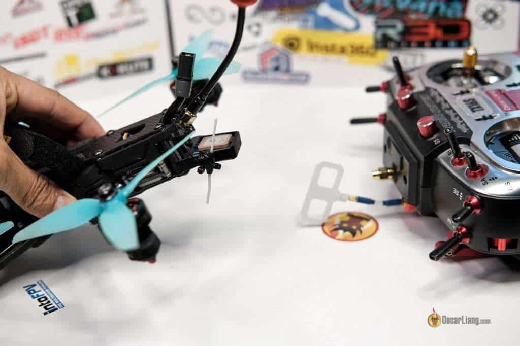  
Однак, якщо ваша приймальна антена встановлена ​​горизонтально, а передаюча — вертикально, це насправді не така гарна ідея, оскільки ви отримаєте так звану «перехресну поляризацію», коли сигнали будуть розташовані під кутом 90 градусів один до одного, і це може призвести до досить великої втрати сигналу. Якщо ви просто літаєте навколо себе на близькій відстані, це зазвичай добре, але це не добре для великої відстані. Важливо, щоб обидві антени були паралельні одна одній, щоб отримати найбільш стійкий сигнал.

Щоб вирішити цю проблему, ви можете направити свою передавальну антену горизонтально, щоб вона відповідала антені приймача, але вам доведеться стежити, щоб ви не летіли вбік і щоб дрон завжди залишавася перед вами.

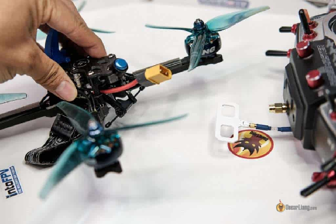  
Це тому, що сигнал найслабший, коли кінчики антен спрямовані одна на одну. Наприклад, ось так як видно на зображенні нижче — погано.

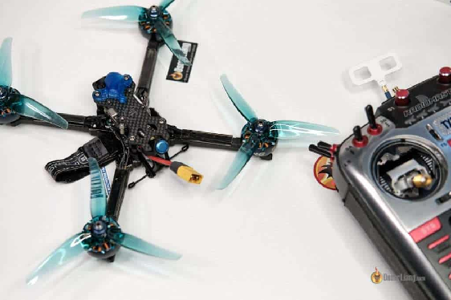

Можливо, вам доведеться змінити орієнтацією ваших антен залежно від ситуації. Скажімо, якщо ви збираєтеся виконати піке у будівлю *\[або в танк 😉\],* і ви летите прямо над собою (а не десь збоку), тоді спрямування антени горизонтально буде корисним у такому сценарії.

Але якщо ви просто літаєте навколо себе, знаходитесь трохи обабіч від дрона, то, ймовірно, краще направити антену вгору, і це зазвичай стосується більшості випадків.

Якщо ви використовуєте інші типи антен на своєму передавачі, а не звичайну дипольну антену, ви можете перевірити її діаграму спрямованості та визначити, як її орієнтувати для найкращого сигналу відповідно до вашого стилю польоту.

## **Монопольна антена** {#монопольна-антена}

Монопольні антени — це в основному лише шматок дроту (іноді із заземленим екраном), де оголений дріт є активним елементом. Має найпростішу конструкцію антени.  
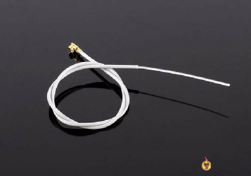

Більшість сучасних приймачів перейшли на дипольні антени, але старі приймачі (такі як Frsky R-XSR), як правило, використовують монопольні антени. Іноді монопольні антени також використовується у критичних до ваги дронах, таких як Малі Вупи, де кожен грам важливий (зрештою, це просто звичайний мідний дріт).  
Монопольні антени мають діаграму спрямованості, подібну до дипольних, вони мають найсильніший сигнал збоку та найслабший сигнал на кінці.

## **Як встановлювати у випадку приймачів із рознесеними антенами** {#як-встановлювати-у-випадку-приймачів-із-рознесеними-антенами}

Приймачі з однією антеною цілком підходять, але якщо вам потрібен більш стійкий і надійний радіосигнал, я вважаю, що приймачі з рознесенням — безперечно найкращий варіант. [Ознайомтеся з найновішими параметрами рознесеного приймача для ExpressLRS](https://docs.google.com/document/d/1DXFLlEEPLcV_21q9vkafZl1CsKPzXim6EpTENWk9044/edit). Обов’язково придбайте приймачі з температурно-компенсованими генераторами (TCXO), які мають точнішу частоту.

Приймачі з рознесеними антенами мають дві антени, спосіб їх встановлення залежить від застосування і того, як ви літаєте.

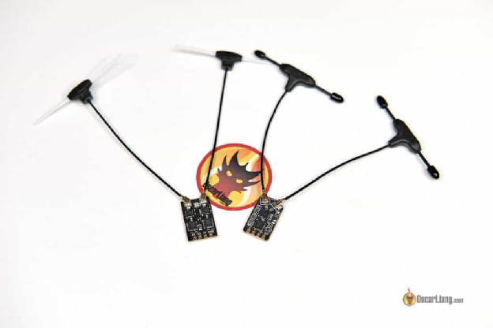

Зазвичай вам буде потрібно, щоб антени були встановлені перпендикулярно одна до одної (під кутом 90 градусів одна від одної), щоб завжди принаймні одна з двох антен була в ідеальному положенні відносно антени пульта.

Але якщо ви здебільшого просто літаєте (без фрістайлу та акробатики), я виявив під час свого тестування, що встановлення обох антен вертикально догори насправді дає кращий RSSI (індикатор рівня потужності отриманого сигналу) та стабільнішу якість каналу (LQ). Але для фрістайлу та акробатики, ймовірно, безпечніше мати одну антену, спрямовану вгору, а іншу — горизонтально, що, здається, працює краще, ніж обидві під кутом 45 градусів до горизонту (90 градусів одна від одної).

 Для рознесеного приймача з монопольними антенами просто встановіть дві антени під кутом 90 градусів одна від одної, в ідеалі спрямовуючи їх угору з причин, наведених вище.  
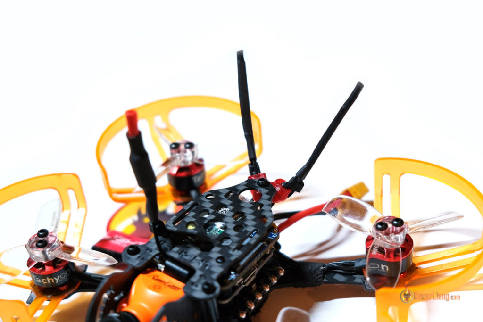  
Також досить поширеним є закріплення стяжок на двох променях горизонтально з фіксацію антен на термоусадку до стяжок. Це легко і зазвичай добре працює для польотів на близькій відстані. Мета тут полягає в тому, щоб принаймні одна з двох антен залишалася в зоні прямої видимості антени передавач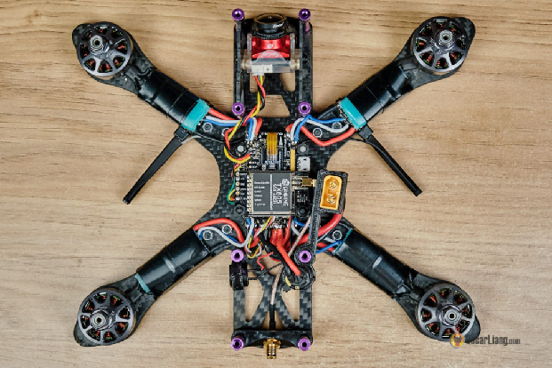   
На цьому все. Щасливого польоту\!

### **Історія редагування** {#історія-редагування}

* Жовтень 2018 — підручник створено.  
* Травень 2022 — змінено URL-адресу, оновлено публікацію, щоб включити приймачі ExpressLRS, додано рознесене кріплення антени приймача, додано кілька зображень для демонстрації.  
* Січень 2023 — додано дані тестування монтажу рознесеної антени.

[image1]: 

[image2]: 

[image3]: 

[image4]: 

[image5]: 

[image6]: 

[image7]: 

[image8]: 

[image9]: 

[image10]: 

[image11]: 

[image12]: 

[image13]: 

[image14]: 

[image15]: 

[image16]: 

[image17]: 