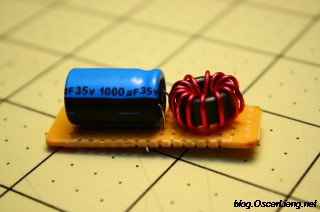
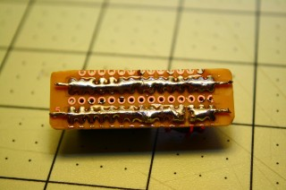
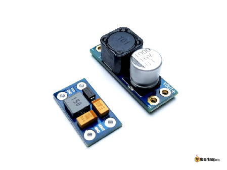
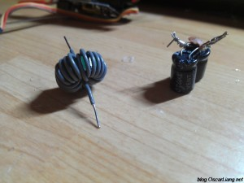
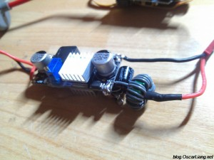
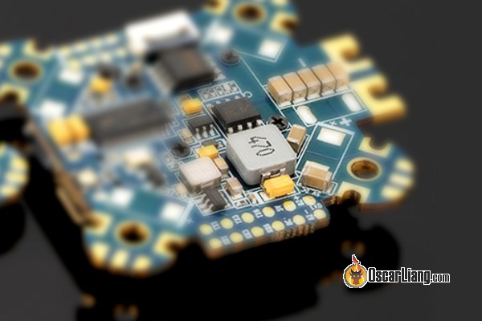
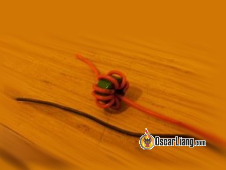
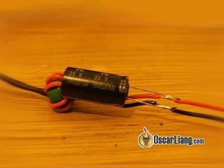

Стисле посилання на цей переклад: [https://bit.ly/LiangLCFilterFPV](https://bit.ly/LiangLCFilterFPV)   

| 🫂 | Нижче вичитаний людьми машнний український переклад оригіналу. Для [VictoryDrones](https://www.victory-drones.com/) переклад вичитали: Natasha M, Oleg. Хочете покращити переклад чи знайшли помилку? — Лишіть коментар (Ctrl+Alt+M або «Меню» \> «Вставка» \> «Коментар»). Ми теж живі люди (як і ви) і робим помилки. Роботи їх, до речі, також роблять 😉 |
| :---: | :---- |

# LC-фільтр і FPV

# 26 червня 2018 р

# 

# LC-фільтр є одним із найпростіших фільтрів в електронних пристроях, i складається лише з однієї котушки індуктивності та одного конденсатора в найпростішій формі. Ця схема широко використовується любителями FPV для придушення шумів в живленні, що створюється ESC *\[electronic speed controller: електронний контроллер швидкості «регуль»\]* і двигунами.  *Деякі посилання на цій сторінці є партнерськими. Я \[автор англомовної версії Оскар Ланг\] отримую комісію (без додаткових витрат для вас), якщо ви робите покупку після натискання одного із цих партнерських посилань. Це допомагає підтримувати безкоштовний контент для спільноти на цьому веб\-сайті. Будь ласка, прочитайте нашу [Політику партнерських посилань](https://oscarliang.com/affiliate-program-policy/) для отримання додаткової інформації.*

# **Що таке LC-фільтр?**

# LC-фільтр складається з котушки індуктивності (L) і конденсатора (C). Це просто.

# Котушка індуктивності пручається змінам струму, що протікає через неї, тоді як конденсатор чинить спротив змінам напруги на ньому. Або перегляньте більш складну публікацію: [фільтр живлення](https://oscarliang.com/power-filter-video-transmitter-fpv-camera/).

# По суті, це фільтр низьких частот, який дозволяє пропускати нижчі частоти, одночасно послаблюючи вищі частоти.

# 

# 

# **Де купити фільтри LC**

# Хочете придбати фільтри LC? Ось кілька варіантів, які я знайшов, які підходять для радіокерованих пристроїв.

* # 16 В / 1 А:[http://bit.ly/2tH1DaP](http://bit.ly/2tH1DaP) |[https://amzn.to/2lFhnYp](https://amzn.to/2lFhnYp)

* # 16 В/2 А:[https://amzn.to/2KkreNM](https://amzn.to/2KkreNM) |[http://bit.ly/2Mqc36x](http://bit.ly/2Mqc36x)

* # 24 В/1,5 А:[http://bit.ly/2txsWox](http://bit.ly/2txsWox)

# Переконайтеся, що LC-фільтри, які ви купуєте, відповідають номінальним значенням напруги та струму для застосування.

# 

# **Як LC-фільтр покращує роботу FPV**

# У квадрокоптері мотори та ESC  *\[electronic speed controller: електронний контроллер швидкості «регуль»\]* можуть створювати шум, що впливає на якість відео FPV.

# Під час польоту швидкість двигуна постійно змінюється, щоб залишатися в повітрі. Зміна швидкості двигуна означає зміну струму, який споживають двигуни, створюючі пульсації напруги (коливання рівня напруги), які по суті є шумом.

# Найпоширенішими ознаками шуму є мерехтіння у вигляді ліній, що з’являються на екрані, коли ми літаємо.

# LC-фільтр може зменшити шум в ланцюгу живлення, що надходить до вашої установки FPV (наприклад, до VTX *\[відеопередавача\]* і камери FPV). Вам може знадобитися або не знадобитися LC-фільтр. Деякі стабілізатори напруги мають певну здатність фільтрувати пульсації живлення, але фільтр LC може покращити фільтрацію.

# 

# 

# **LC-фільтр проти конденсатора з низьким ESR**

# Мене часто запитують, яким методом слід користуватись для боротьби з шумом у міні-квадрокоптері, за допомогою LC-фільтра чи конденсатора з низьким ESR *\[Equivalent Series Resistance: еквівалентний послідовний опір\]*. Але я маю сказати, що вони служать дуже різним цілям і мають різну мету застосування.

# LC-фільтр в основному використовується щоб шум не потрапляв в систему FPV*\[там де польотник, відеопередавач, приймач\]*, він не зменшує кількість шуму y живленні силової частини \- регуляторів (і моторів). З іншого боку, встановивши конденсатори з низьким ESR \[*еквівалентний послідовний опір\]* ближче до джерела живлення, ви маєте помітити зниження рівня шуму.

# Перегляньте мій [посібник про конденсатори з низьким ESR і як їх використовувати в міні-квадрокоптері](http://bit.ly/WhyCapacitorsAreImportant).

# LC-фільтр має обмеження струму через ліміт котушки індуктивності, тому він в основному використовується в слабкострумових компонентах. LС-фільтри часто зустрічаються в 5V і 12V-схемах на польотному контроллері («польотніку») або на платі розподілу живлення *\[*PDB \- *Power Distribution Board\]* для живлення зборки FPV. Вони, як правило, є більш ефективними, ніж використання лише конденсатора.

# З іншого боку, використовуючи лише конденсатори з низьким ESR, вам потрібно лише переконатися, що номінальна напруга достатньо висока.

# 

# **Побудова LC-фільтра**

# Значення ємності конденсатора та параметри котушки індуктивності змінюють резонансну частоту. Це дає змогу ефективніше пригнічувати шум, якщо знати частоту шуму. Однак ви все одно отримаєте певний ефект фільтрації за допомогою будь якиx конденсаторів і котушок індуктивності, тому не хвилюйтеся :)

# Якщо ви знаєте, як розрахувати точну ємність та індуктивність, необхідні для вашого застосування–добре\! Але якщо ви цього не зробите, нічого страшного, ми не будуємо ракету, і вонo буде працювати чудово :)

# Ось як ви з'єднуєте конденсатор і котушку індуктивності.

# 

# Вибираючи конденсатор, переконайтеся, що номінальна напруга відповідає вашим вимогам. Aбо, наприклад, якщо ви підключаєте LC-фільтр безпосередньо до вашої LiPo батареї, він повинен підтримувати напругу вашої LiPo батареї. Що стосується ємності – чим більше, тим краще, я думаю, що від 100 мкФ до 2000 мкФ це хороший діапазон.

# Ви можете купити котушки індуктивності або зробити їх самостійно за допомогою  [феритового кільця](https://oscarliang.com/ring-esc-ferrite-ring/) і дротiв. Ретельно вибирайте довжину і діаметр проводів. В ідеалі ви повинні мати можливість обернути феритове кільце принаймні 6 разів. А діаметр дроту має бути достатньо великим, щоб витримувати струм *\[і мати менший опір\]*.

# Якщо ви робите свій власну котушку індуктивності, я вважаю, що вона працює краще лише з плюсовим дротом, намотаним на тороїд *\[тут незрозуміло що пан Оскар хотів сказати, може він хотів сказати щоб ви не тулили індуктивність в частину ланцюга яка йде на мінусовий контакт батареї \- ну бо це очевидно, що фільтрація нам потрібна там де подається живлення\]*. Намотуючи кабель навколо феритового кільця, НЕ завершуйте там, де починали. Kабель має вийти з протилежної сторони.

# 

# Що стосується конденсатора, підійде будь-який електролітичний. Вони широко доступні, наприклад, зі старих радіоприймачів або частин ПК. Або просто купіть на eBay, вони дуже дешеві. Найкраще  для фільтрації шумів використовувати конденсатори з низьким ESR.

# Обов’язково розташуйте конденсатор на виході, перед відеопередавачем і камерою.

# 

# **Висновок**

# Фільтри LC чудові, тому що їх дуже просто і дешево виготовити або купити. Вони можуть допомогти послабити або навіть повністю усунути «шум», якщо у вас є шуми в вигляді ліній у відео. Якщо самі конденсатори не вирішують проблему, ви можете розглянути можливість додавання LC-фільтра для вашої системи FPV :)

### **Історія редагування**

* # Лютий 2014 – Стаття створена

* # Червень 2018 р. – статтю оновлено за допомогою параметрів фільтра LC

##### 

##### 

### ЗАЛИШИТИ КОМЕНТАР

#  Підпишіть мене на розсилку\!

# Використовуючи цю форму, ви погоджуєтеся на зберігання та обробку ваших даних на цьому веб\-сайті. Зауважте, що всі коментарі проходять модерацію перед тим, як з’являться.

# **39 КОМЕНТАРІВ**

# БЕН

# 21 серпня 2022 р. \- 15:55

# Привіт, Оскар, дякую за цю статтю. Я знайшов її, коли шукав фільтри шумів для резервної камери, яку додав до своєї вантажівки. У будь-якому разі я хотів вас запитати. Якщо я додам діод і другий конденсатор між котушкою та позитивним виходом, чи дозволить це камері (залежно від розміру конденсатора) залишатися увімкненою протягом секунди або двох, коли припиняється подача живлення? Я знаю, що мені потрібен діод, щоб не було зворотного живлення.

# Дякую\!\!\!

# [ВІДПОВІДЬ](https://oscarliang.com/lc-filter-fpv/#comment-151464)

# ГАБРІЕЛЬ ШТАЙНЕР

# 23 вересня 2019 р. \- 2:03 ранку

# Гей, як називається ця сіра частина з номером 470? Мені потрібно купити заміну, але я не знаю, як вона називається, і де її знайти.

# [ВІДПОВІДЬ](https://oscarliang.com/lc-filter-fpv/#comment-21796)

# ОСКАР

# 26 вересня 2019 р. \- 15:16

# дросель

# [ВІДПОВІДЬ](https://oscarliang.com/lc-filter-fpv/#comment-21847)

# 17 січня 2019 р. \- 4:37 ранку

# Привіт, Оскар... це дуже хороший підручник... (\*\*\*\*\*). Будь ласка, порадьте… У мене був matek mini pdb, кожний 1000tvl, і ts 5823\. Я хочу мати супер-дупер чисту систему fpv у своєму дроні 250\.

# Струм споживання (vtx \+ камера \= ± 1A) Як підключити їх до LC?

# Опції: 1\. Без використання LC. Оскільки цей вихід від matek в бік камери і vtx є регульованим. 2\. Використання 12 В, що регулюється від matek \> lc filter \> камера \+ відеопередавач разом. Вони обидва підключені до LC-фільтра.

# 3\. Якщо використовується екранне меню, чи можу я також зібрати?

# 4\. Стокова антена ts5823 дуже малого радіусу дії. Як замінити їх на грибоподібну антену fatshark? Чи допоможе це розширити діапазон?

# Що ти рекомендуєш, брате? Будь ласка, допоможіть.

# [ВІДПОВІДЬ](https://oscarliang.com/lc-filter-fpv/#comment-19980)

# ОСКАР

# 22 січня 2019 року \- 16:10 год

# Ви відчуваєте багато шуму? Спробуйте спочатку без LC-фільтра, можливо, він вам не знадобиться. Щоб використовувати LC-фільтр, просто встановіть його між VTX/камерою та джерелом живлення. Так, антени з круговою поляризацією мають забезпечити кращий радіус дії, ніж стандартні антени VTX. Будь-які додаткові запитання, будь ласка, публікуйте на нашому форумі: IntoFPV.com Радий допомогти :)

# 

# 

# ВИСОКА

# 27 червня 2018 р. \- 14:02

# Було б непогано включити приклади використання LC-фільтра: як було до і стало після або згадати, що погано паяні з’єднання можуть бути основною причиною.

# [ВІДПОВІДЬ](https://oscarliang.com/lc-filter-fpv/#comment-18095)

# MATHIJS GROOTHOUSE

# 14 травня 2017 р. \- 15:28

# пристойний фільтр відфільтрує \_будь-які\_ спотворення чи просто зменшить спотворення? Я використовую конденсатор із низьким значенням ESC 16 вольт проти спотворень (поки що нічого іншого) на основі цього відео: youtube.com/watch?v=ZhvuQJPGHzU

# Але коли я даю прискорення, моє екранне меню зникає на наносекунду, а потім повертається знову зa кожного прискорення. Отже, екранне меню не перезавантажується, але я відчуваю мерехтіння, яке чітко корелює з величиною газу.

# Це нормально чи я можу щось зробити, щоб зменшити це ще більше?

# [ВІДПОВІДЬ](https://oscarliang.com/lc-filter-fpv/#comment-14461)

# ОСКАР

# 15 травня 2017 р. \- 14:51

# Схоже, вам потрібний належний фільтр LC для налаштування FPV. переконайтеся, що екранне меню, камера та vTX також мають спільну масу.

# [ВІДПОВІДЬ](https://oscarliang.com/lc-filter-fpv/#comment-14488)

# ШАБРОЛЬСОН

# 20 травня 2018 року \- 22:47

# Привіт, народ. Я згоден з Оскаром. Зазвичай, коли наекранне меню мерехтить, вам потрібно щоб VTX, камера і fc мали спільну масу. LC-фільтр справді допомагає отримати дійсно хорошу якість, але якщо ваша маса розділена(нема спільного дрота схеми), він не працює краще.

# [ВІДПОВІДЬ](https://oscarliang.com/lc-filter-fpv/#comment-17721)

# ЗЛАКОВІ\_ВБИВЦЯ

# 15 серпня 2016 року \- 12:55 год

# Привіт, Оскар, я щойно замінив Afros на маленьку “бджілку”, і мерехтіння у відео тепер ЖАХЛИВE\! Я використовував маленький LC, який я побудував, як описано тут (феритове кільце своїми руками з конденсатором). Насправді у мене був поганий один із тих самих синіх регуляторів 1×2″, які ви показали вище (великий чорний польовий транзистор на ньому перегорів, але вихідний конденсатор і 330 мкГн індуктивності були хорошими, тому я фізично розрізав плату та використав її як LC-фільтр) . Це працює досить добре і справді має велике значення, але я все ще отримую деякі надокучливі лініі у відео (я можу жити з ними, але я вже витратив на це час, тож чому б не зробити це ідеальним \[якщо можливо\], знаєте)

# Я працюю на моєму vtx від прямої напруги батареї 4S, як ви думаєте, моїм наступним кроком має стати індуктивність або конденсатор іншого значення (зараз це 330мкГн / 220мкФ) або запустити vtx від UBCC на 12v?

[image1]: 

[image2]: 

[image3]: 

[image4]: 

[image5]: 

[image6]: 

[image7]: 

[image8]: 

[image9]: 