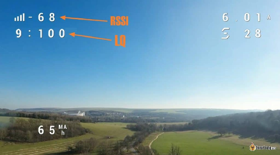
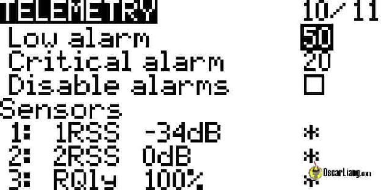

Стисле посилання на цей переклад: [https://bit.ly/LiangAboutLQ-RSSI](https://bit.ly/LiangAboutLQ-RSSI)    

| 🫂 | Нижче вичитаний людьми машинний український переклад оригіналу. Для [VictoryDrones](https://www.victory-drones.com/) переклад вичитали: Tailor, Samsonovych. Хочете покращити переклад чи знайшли помилку? — Лишіть коментар (Ctrl+Alt+M або «Меню» \> «Вставка» \> «Коментар»). Ми теж живі люди (як і ви) і робим помилки. Роботи їх, до речі, також роблять 😉 |
| :---: | :---- |

# **Пояснення показників LQ і RSSI для ExpressLRS і Crossfire**

2 березня 2023 року

LQ і RSSI — два важливі показники для забезпечення надійного радіозв’язку в FPV-дронах, які використовують ExpressLRS або Crossfire. Хоча обидва надають цінну інформацію, вони вимірюють різні аспекти зв’язку. Розуміння відмінностей між LQ і RSSI може допомогти пілотам контролювати якість сигналу під час польотів, визначати максимальну дальність польоту і вносити корективи в своє обладнання або стиль польоту за потреби.

*Деякі посилання на цій сторінці є партнерськими. Я \[автор англомовної версії Оскар Ланг\] отримую комісію (без додаткових витрат для вас), якщо ви робите покупку після натискання одного із цих партнерських посилань. Це допомагає підтримувати безкоштовний контент для спільноти на цьому веб\-сайті. Будь ласка, прочитайте нашу [Політику партнерських посилань](https://oscarliang.com/affiliate-program-policy/) для отримання додаткової інформації.*

* # Зміст

[Що таке RSSI?](#що-таке-rssi?)

[Що таке LQ?](#що-таке-lq?)

[LQ і RSSI, що важливіше?](#lq-і-rssi,-що-важливіше?)

[Найнижчий LQ](#найнижчий-lq)

[Найнижчий RSSI](#найнижчий-rssi)

[Відображення LQ в Betaflight OSD](#відображення-lq-в-betaflight-osd)

[Lq Rssi Fpv Drone Expresslrs Crossfire Link Quality Signal Strength](#lq-rssi-fpv-drone-expresslrs-crossfire-link-quality-signal-strength)

[Аварійний сигнал RSSI в наекранному меню](#аварійний-сигнал-rssi-в-наекранному-меню)

[Налаштування попередження про низький рівень LQ в EdgeTX](#налаштування-попередження-про-низький-рівень-lq-в-edgetx)

[Історія редагування](#історія-редагування)

* 

## **Що таке RSSI?** {#що-таке-rssi?}

RSSI *\[Received Signal Strength Indicator \- індикатор рівня потужності отриманого сигналу\]* вимірює силу отриманого сигналу та має вирішальне значення для визначення того, на яку відстань ви можете віддалитись під час польоту. RSSI вимірюється в дБм (децибел-міліватах), логарифмічна шкала, на відміну від мВт (міліват), яка є лінійною шкалою.

RSSI починається з 0 як найвищого значення та знижується, коли сигнал зменшується. Показник \-130 дБм є жорстким обмеженням, однак насправді найнижчий RSSI зазвичай не настільки низький, оскільки він залежить від частоти оновлення *\[частоти передачі пакетів\]* та частоти радіосигналу.

Використання дБм краще, ніж мВт, оскільки приймачі можуть виявляти неймовірно слабкі сигнали, які важко виразити в мВт. Наприклад, ми можемо виразити 0,000000000001 мВт як \-120 дБм. Набагато простіше використовувати дБ, коли в мВт так багато нулів. Ви можете побачити переведення між дБм і мВт в цій таблиці, вона чудово демонструє переваги використання дБ над мВт.

| Потужність (дБм) | Потужність (мВт) |
| :---- | :---- |
| \-130 дБм | 0,0000000000001мВт |
| \-110 дБм | 0,0000000001 мВт |
| \-90 дБм | 0,000000001 мВт |
| \-70 дБм | 0,0000001 мВт |
| \-50 дБм | 0,00001 мВт |
| \-30 дБм | 0,001 мВт |
| \-10 дБм | 0,1 мВт |
| 0 дБм | 1 мВт |
| 10 дБм | 10 мВт |
| 20 дБм | 100 мВт |
| 100 дБм | 10000000000мВт |

В Betaflight OSD *\[on-screen display \- наекранне меню\]* є дві різні опції RSSI: значення RSSI у відсотках і значення RSSI у дБм. RSSI у дБм є рекомендованим варіантом, оскільки він забезпечує справжнє вимірювання потужності сигналу. У Betaflight OSD сучасні радіопротоколи, такі як ExpressLRS, Crossfire і Tracer, підтримують RSSI у дБм, але старіші системи, такі як Frsky і Spektrum, підтримують лише RSSI у відсотках.

## **Що таке LQ?** {#що-таке-lq?}

LQ *\[Link Quality \- якість радіоканалу\]* вимірює відсоток неушкоджених даних, які проходять через приймач. LQ відображається у форматі 9:100, де перше число означає «RFMD» (або RF режим), а друге число представляє фактичне значення якості радіоканалу (у відсотках від 0 до 100).

Для ExpressLRS ви можете переглянути RFMD і відповідні режими та частоту пакетів у наступній таблиці. Для LQ 9:100 частота пакетів становить 500 Гц.

| RFMD | Режими | Частота пакетів | Межа чутливості |
| :---- | :---- | :---- | :---- |
| 13 | F1000 | 1000 Гц | \-104 дБм |
| 12 | F500 | 500 Гц | \-104 дБм |
| 11 | D500 | 500 Гц | \-104 дБм |
| 10 | D250 | 250 Гц | \-104 дБм |
| 9 | 500 Гц | 500 Гц | \-105 дБм |
| 8 | 333 Гц Full | 333 Гц | \-105 дБм |
| 7 | 250 Гц | 250 Гц | \-108 дБм |
| 6 | 200 Гц | 200 Гц | \-112 дБм |
| 5 | 150 Гц | 150 Гц | \-112 дБм |
| 4 | 100 Гц Full | 100 Гц | \-112 дБм |
| 3 | 100 Гц | 100 Гц | \-117 дБм |
| 2 | 50 Гц | 50 Гц | \-120 дБм (900 МГц) \-115 дБм (2,4 ГГц) |
| 1 | 25 Гц | 25 Гц | \-123 дБм |

Для Crossfire RFMD досягає лише 3, при цьому найшвидша частота пакетів становить 150 Гц. При значенні RFMD 2 частота пакетів становить 150 Гц; при значенні RFMD 1 частота пакетів становить 50 Гц; а при значенні RFMD 0 частота пакетів становить 4 Гц. Crossfire може динамічно регулювати частоту передачі пакетів для підтримки стабільного каналу керування *\[прим. пер.: але краще зафіксувати частоту, н-д 50Гц, і завантажити попередні налаштування(RC\_Link Preset) для 50Гц в Бетафлай, таким чином Бетафлай встановить правильне згладжування команд пульта, правильне упередження для 50Гц і т.д. \- дуже корисно\]*. [Проте Betaflight радить не використовувати динамічну частоту пакетів, оскільки це може заважати згладжуванню пульта, як пояснюється тут](https://oscarliang.com/crossfire-betaflight/#RF-Profile). [\[*перекладено українською:*](https://oscarliang.com/crossfire-betaflight/#RF-Profile) *[https://bit.ly/LiangTBSCrossfireSetup](https://bit.ly/LiangTBSCrossfireSetup)*  [*В роботі*\]](https://oscarliang.com/crossfire-betaflight/#RF-Profile) 

## 

## **LQ і RSSI, що важливіше?** {#lq-і-rssi,-що-важливіше?}

LQ і RSSI — обидва показники корисні для визначення вашої дальності польоту та якості вашого радіозв’язку, **найкраще мати їх обидва**.

Якщо вам доводиться обирати між LQ і RSSI, LQ може бути дещо важливішим, оскільки це більш абсолютний індикатор надійності радіозв’язку. Однак, виключно на основі LQ не дізнаєтеся, скільки відстані залишилося у вашого каналу радіозв’язку, для цього вам також знадобиться RSSI.

Щоб визначити ліміт відстані на основі RSSI, вам також потрібно врахувати рівень шуму. Високий рівень шуму все одно може зіпсувати зв'язок з пультом, незалежно від того, наскільки сильним може бути сигнал. Рівень шуму залежить від багатьох факторів, включаючи навколишнє середовище та компоненти вашого дрона.

Хороша аналогія: уявіть приймач людиною, з якою ви намагаєтеся поговорити в шумному ресторані, а ви — передавач. Під час розмови гучність вашого голосу — RSSI, співрозмовник чує вас і розуміє все, що ви говорите, у цьому випадку LQ буде 100%. Тут справді важливо не те, наскільки голосно ви говорите, а те, скільки слів інша людина може почути та зрозуміти. Якщо в ресторані занадто шумно, ваш голос може бути чутно, але не зрозуміло жодного слова, то в цьому випадку у вас високий RSSI, але 0% LQ.

LQ має тенденцію раптово падати в кінці радіусу дії, тоді як RSSI має тенденцію до поступового зниження більш передбачуваним способом. Найкраще використовувати як LQ, так і RSSI, щоб зрозуміти стан радіозв’язку.

* **Високий LQ, високий RSSI \= справний радіозв'язок.**  
* **Низький LQ, високий RSSI \= шумне радіочастотне середовище.**  
* **Високий LQ, низький RSSI \= якщо ви дуже далеко, потрібна обережність, оскільки ви наближаєтеся до кінця радіусу дії. Якщо приймач знаходиться дуже близько до передавача, це може свідчити про проблему з антеною.**  
* **Низький LQ, низький RSSI \= кінець радіусу дії, вам слід повернути назад, оскільки, ймовірно, спрацює безаварійний режим.**

## 

## **Найнижчий LQ** {#найнижчий-lq}

В ідеалі LQ має становити 100%, але нормально, якщо він буде нижче цього значення. Наприклад, LQ 50% означає, що проходить лише половина пакетів. Незважаючи на це, ви, ймовірно, все ще можете літати. Наприклад, на частоті пакетів 500 Гц все ще проходить 250 команд на секунду, що набагато швидше, ніж у старішому протоколі, як-от SBUS із частотою оновлення 50 Гц.

Найнижчий LQ, на який ви повинні реагувати, є суб’єктивним і залежить від того, наскільки ви готові ризикувати. Ви точно не захочете чекати, поки він опуститься занадто низько, і дрон стане некерованим. Але в наведеному вище прикладі 50% на частоті пакетів 500 Гц може бути прийнятним. Справа в тому, що коли ваш LQ падає, це є ознакою попередження: можуть бути перешкоди, які пошкоджують радіодані, або ви наближаєтеся до кінця радіусу дії, або якісь інші проблеми.

Якщо ваш LQ падає приблизно до 50-70%, вам слід звернути увагу на RSSI. Якщо RSSI також низький (у межах 10 дБ до межі чутливості частоти пакетів *\[прим. пер.: а для цього треба пам’ятати, який показник є граничним для вашої зафіксованої частоти пакетів\]*), було б гарною ідеєю повернутися назад. Якщо RSSI залишається високим, продовжуйте контролювати LQ і подивіться, чи покращиться цей показник. Якщо LQ не покращується, вам слід повернутися, оскільки можуть виникнути перешкоди, і, якщо ви продовжите летіти, ситуація може погіршитися. Обов’язково повертайтеся, коли LQ опускається нижче 20%, оскільки збільшення затримки при передачі команд ускладнить контроль.

## **Найнижчий RSSI** {#найнижчий-rssi}

Найнижчий дозволений RSSI залежить від частоти передачі пакетів і частоти сигналу. Нижча частота передачі пакетів і нижчі частоти мають більш чутливий сигнал. Наприклад, найнижче теоретичне значення RSSI для 2,4 ГГц 500 Гц становить \-105 дБм, але для 915 МГц 25 Гц це \-123 дБм, що краще для польотів на далекі відстані.

Важливо не недооцінювати різницю в кілька дБм, оскільки кожні 6 дБм подвоюють радіус дії. Наприклад, у ExpressLRS зниження частоти пакетів з 500 Гц (-105 дБм) до 150 Гц (-112 дБм) фактично збільшує радіус дії вдвічі і більше.[У мене є підручник, який пояснює, як використовувати дБ для оцінки діапазону в FPV.](https://oscarliang.com/calculate-fpv-range/) *\[перекладено українською: [https://bit.ly/LiangMaximizingFPVrange](https://bit.ly/LiangMaximizingFPVrange) \]*

Ось таблиця найнижчих значень RSSI (межи чутливості) для кожного RF режиму (частоти пакетів) із ExpressLRS WiKi. Якщо RSSI вийде нижче цих меж, спрацює режим безаварійності.

| Режими *\[частоти пакетів\]* | Межа чутливості |
| :---- | :---- |
| D250/D500/F500/F1000 | \-104 дБм |
| 500 Гц/333 Гц Full | \-105 дБм |
| 250 Гц | \-108 дБм |
| 150 Гц/200 Гц/100 Гц Full | \-112 дБм |
| 100 Гц | \-117 дБм |
| 50 Гц | \-117 дБм |
| 25 Гц | \-123 дБм |

Ви також можете дізнатися межу чутливості в сценарії LUA під час вибору частоти пакетів:

Отже, якого найнижчого показника RSSI ми можемо досягти, щоб уникнути режиму безаварійності?

**Ваш RSSI має бути на 10 дБм вищим за межу чутливості**. Наприклад, якщо ви літаєте на ExpressLRS 2,4 ГГц 500 Гц, вам слід повернутися, якщо RSSI опускається нижче \-95 дБм. Деякі досвідчені пілоти можуть проігнорувати цю рекомендацію і використовувати 6 дБм як запас, але якщо ви хочете перестрахуватися, використовуйте запас 10 дБм.

Однак **RSSI в дБм не враховує навколишній шум**, тому важливо також перевіряти LQ. Якщо RSSI високий, а LQ низький, причиною може бути шум/перешкоди. Деякі радіочастотні системи, наприклад Crossfire, повідомляють SNR *\[прим.пер.: signal to noise ratio, також RSNR* — *співвідношення сигнал/шум, також ССШ або ВСШ\]*, але ExpressLRS поки що цього не робить.

## **Відображення LQ в Betaflight OSD** {#відображення-lq-в-betaflight-osd}

На вкладці OSD у Betaflight ви можете ввімкнути елементи OSD: «Link Quality», «RSSI in dBm» і «RSSI».

Елемент «Link Quality» надає вам значення RFMD (0-13) , а потім значення LQ (0-100). RFMD вказує, які частоти пакетів ви використовуєте, як зазначено в таблиці RFMD в попередньому розділі.

Я рекомендую мати в наекранному меню як Link Quality, так і RSSI в дБм.

##  {#lq-rssi-fpv-drone-expresslrs-crossfire-link-quality-signal-strength}

## 

## **Аварійний сигнал RSSI в наекранному меню** {#аварійний-сигнал-rssi-в-наекранному-меню}

Betaflight OSD може попередити вас, якщо RSSI в дБм падає нижче певного значення.

У CLI *\[command line interface \- інтерфейс командного рядка\]* введіть команду:

set osd\_rssi\_dbm\_alarm \= \-95  
save

Дозволений діапазон від \-130 до 20, значення за замовчуванням дорівнює \-60

## 

## 

## 

## **Налаштування попередження про низький рівень LQ в EdgeTX** {#налаштування-попередження-про-низький-рівень-lq-в-edgetx}

У своєму пульті перейдіть до налаштування моделі, натисніть кнопку «PAGE» *\[Сторінка\]*, щоб перейти до сторінки телеметрії. Встановіть «Low alarm» *\[Сповіщення про низький рівень\]* на 50, а «Critical alarm» *\[Сповіщення про критичний рівень\]* на 20\. Переконайтеся, що прапорець «Disable alarms» *\[Вимкнути сповіщення\]* знято.

Налаштування здійснено.

Ви повинні отримати голосове попередження, коли LQ падає нижче цих значень.

# **Історія редагування** {#історія-редагування}

* Квітень 2018 – стаття створена.  
* Січень 2020 р. — додано вступ, додано інструкції щодо відображення LQ для Betaflight 4.1.  
* Січень 2021 р. — оновлено для BF 4.2 — змінено спосіб відображення LQ в наекранному меню.  
* Березень 2022 р. — оновлена ​​URL-адреса, переписано для ExpressLRS.  
* Березень 2023 р. — оновлений RFMD для ExpressLRS 3.0.

**Прочитайте також:**

* **Вперше в ELRS? Перегляньте мій посібник [як налаштувати ExpressLRS вперше](https://oscarliang.com/setup-expresslrs-2-4ghz/).** *\[перекладено українською:* [https://bit.ly/Flashing-and-SettingUp-ExpressLRS](https://bit.ly/Flashing-and-SettingUp-ExpressLRS) *\]*  
* **Вперше в Crossfire? Перевірте мій [посібник із налаштування TBS Crossfire з Betaflight](https://oscarliang.com/crossfire-betaflight/).** *\[перекладено українською:* [https://bit.ly/LiangTBSCrossfireSetup](https://bit.ly/LiangTBSCrossfireSetup) *\]*

**ВИБРАНІ КОМЕНТАРІ**

**VOLODYMYR**

10 квітня 2022 р. \- 8:29 ранку

Мені не вдалося змусити RSSI працювати автоматично на 4 квадрокоптерах. Мені довелося оновити вихід до RSSI/LQ (не лише RSSI) у налаштуваннях nano XF, а потім використовувати AUX4 як RSSI-канал у приймачі. BF4.3, BF 4.2.11 — тільки так він працює.  
[ВІДПОВІДЬ](https://oscarliang.com/lq-rssi/#comment-131609)

**REY REYNA**

20 липня 2021 р. \- 10:35 год

У мене тут нова збірка, і я не можу змусити LQ відображатися в OSD. Я знаю, що в мене є LQ, оскільки я встановив екран телеметрії на своєму Тaranis x9 light, і він показує повні поділки. RSSI також працює в моєму OSD. я налаштував Betaflight для aux 8, а для приймача налаштував RSSI/LQ на каналі 12, також змінив його на лише LQ. Hе знаю, що ще перевірити чи зробити. Чи можете ви направити мене в правильному напрямку?  
[ВІДПОВІДЬ](https://oscarliang.com/lq-rssi/#comment-85329)  
**OSCAR**

20 липня 2021 р. \- 11:36 год

Чи оновлено Betaflight до версії 4.2? Тільки тоді він буде працювати належним чином.  
Вам більше не потрібно передавати LQ і RSSI через канал, остання версія Betaflight просто підбере ці дані з приймача.  
[ВІДПОВІДЬ](https://oscarliang.com/lq-rssi/#comment-85336)  
**KROTOW**

22 листопада 2021 \- 15:36

Можу це підтвердити. Тепер LQ і RSSI в Betaflight OSD відображаються правильно без надсилання з пульта по окремому каналу. Працює навіть як Betaflight RSSI в польотних окулярах DJI. Протестовано в Betaflight 4.2.9+ і Betaflight 4.3.  
[ВІДПОВІДЬ](https://oscarliang.com/lq-rssi/#comment-116439)

**MARK TURKEL**

21 червня 2021 р. \- 21:56

Привіт і дякую за ваші чудові блоги\! Я щойно отримав останній стартовий набір TBS Micro… Мені здається, я правильно виконав усі ваші вказівки, але чомусь на моєму RadioMaster TX16s відображається RFMD \= 1, а не 2\. Я не можу зрозуміти, що я я роблю неправильно. Буду вдячний за будь-яку допомогу\!  
[ВІДПОВІДЬ](https://oscarliang.com/lq-rssi/#comment-82682)  
**OSCAR**

22 червня 2021 \- 23:16

На своєму пульті перейдіть до «System settings» *\[Налаштування системи\]*, «Tools» *\[Інструменти\]*, «Crossfire Configuration» *\[Конфігурація Crossfire\]*, «Crossfire RX» *\[Приймач Crossfire\]* і перевірте, чи для RF режиму встановлено значення «Динамічний» або «150 Гц»? Можливо, він налаштований на 50 Гц.  
[ВІДПОВІДЬ](https://oscarliang.com/lq-rssi/#comment-82773)

**JUNNI**

8 лютого 2021 р. \- 4:32 ранку

Досить ймовірно, що він не перейде в режим 0 або режим 4 Гц, якщо ви не встановили режим примусової телеметрії. Ось як це пояснюється в посібнику. Режим 0 не запускається для нормального польоту навіть у кінці радіусу дії. Це для пілотів на Ardupilot *\[система керування безпілотними апаратами з відкритим кодом\]*, він виділяє більше сигналу для телеметрії. Я припускаю, що він використовує нижчу швидкість передачі даних від приймача до передавача, щоб збільшити діапазон телеметрії. Нормальний режим: 150 Гц, потім 50 Гц, після чого сигнал втрачається. Примусовий режим телеметрії становить 50 Гц, потім 4 Гц, після чого сигнал втрачається.  
[ВІДПОВІДЬ](https://oscarliang.com/lq-rssi/#comment-53002)

**DOMINIK**

26 серпня 2020 р. \- 16:24

Привіт, Оскар.  
Це нормально?  
[https://youtu.be/8rzm6xe4sZ4](https://youtu.be/8rzm6xe4sZ4)  
Поганий RSSI і середній LQ.  
Я міняю антену (у мене оригінальна та подібна підробка),  
Літаю по Європі (868 МГц).  
Дякую за допомогу.  
[ВІДПОВІДЬ](https://oscarliang.com/lq-rssi/#comment-33377)  
**OSCAR**

4 вересня 2020 р. \- 15:59

Просто зосередьтеся на LQ, допоки він вище 70, у вас все гаразд.  
Низький RSSI може свідчити про те, що у вас проблемні антени.  
[ВІДПОВІДЬ](https://oscarliang.com/lq-rssi/#comment-34050)

**JEREMY HOLT**

30 липня 2020 р. \- 20:27

Привіт. Я спробував виконати ці кроки, і RSSI відображається на екрані, але показник LQ має лише одну цифру 9 і він ніколи не змінюється, навіть якщо RSSI падає, як очікувалося. Я використовую BF 4.0.4  
[ВІДПОВІДЬ](https://oscarliang.com/lq-rssi/#comment-31373)  
**OSCAR**

31 липня 2020 р. \- 15:53

Оновіть BF до останньої версії.  
[ВІДПОВІДЬ](https://oscarliang.com/lq-rssi/#comment-31442)

**GENIVOS**

17 червня 2020 р. \- 18:53

Коли я зробив налаштування для використання з системою DJI FPV, воно працює, але показує лише вибраний RSSI у Betaflight OSD. Я знаю, що це так, тому що польотні окуляри ще не показують LQ. Але .. значення RSSI 60-70 в польоті. Я також читав, що це нормально, і можна відрегулювати його (налаштування rssi\_scale). Але тут виникає моє запитання: що найкраще налаштувати у випадку використання цифрової системи, як-от DJI FPV? Не можу знайти нічого про те, як це налаштувати.

Я використовую Betaflight 4.1.7 і 4.2, тому я б краще використав новий спосіб налаштування, щоб звільнити канал :)  
[ВІДПОВІДЬ](https://oscarliang.com/lq-rssi/#comment-28599)  
**OSCAR**

22 червня 2020 р. \- 13:13 год

Чесно кажучи, для Crossfire RSSI не такий корисний, як LQ. Можливо, налаштувати звукове попередження на пульті? [У мене тут є посібник](https://oscarliang.com/lq-rssi-tbs-crossfire/). *\[прим.пер.: посилання на цю ж статтю, до якої коментар\]* Але насправді діапазон радіозв’язку майже завжди виходить за межі діапазону вашого відеозв’язку, оскільки частота набагато нижча.  
[ВІДПОВІДЬ](https://oscarliang.com/lq-rssi/#comment-28901)

**CIPRIAN SILVASAN**

31 березня 2020 р. \- 6:54 ранку

Отримав відповідь на своє запитання.  
Тож у польотних окулярах ви побачите LQ на трьох етапах. 2=150 Гц, 1=50 Гц і 0=4 Гц від 0 до 300%. На Taranis ви отримаєте від телеметрії 100% весь час на етапах 1 і 2\. Якщо LQ перейде на етап 0, він покаже LQ від 0% до 100%  
[ВІДПОВІДЬ](https://oscarliang.com/lq-rssi/#comment-23156)

**BOBII**

28 січня 2020 р. \- 10:46 год

Привіт і дякую за підручник  
Я щойно придбав Crossfire і дотримувався вашого підручника з BF 4.1, але проблема в тому, що у мене LQ 300%, але дуже низький RSSI: на відстані 3 метри від квадрокоптера у мене лише 80, тоді як у FRSKY RXSR у мене 99\.  
У сусідній кімнаті я доходжу до 70\.  
А в коридорі 50 RSSI із завжди хорошим LQ.  
Чи є у мого Crossfire проблеми?  
Мої два дрони мають ідентичні значення.  
RSSI був набагато вищим із Frsky RXSR, я не розумію.  
[ВІДПОВІДЬ](https://oscarliang.com/lq-rssi/#comment-22796)  
**OSCAR**

2 лютого 2020 року \- 16:00 год

Використовуйте LQ як індикатор сигналу, він дасть набагато точніше уявлення про якість вашого сигналу.  
[ВІДПОВІДЬ](https://oscarliang.com/lq-rssi/#comment-22832)

**DIKTO VALLY**

24 лютого 2019 р. \- 01:28

Привіт, Оскар. Дякую за підручник, він справді допоміг мені з моїм Сrossfire. Чи можна налаштувати режим безаварійності у спеціальній функції, коли L03 активний? І як це налаштувати? Дякую за відповідь.  
[ВІДПОВІДЬ](https://oscarliang.com/lq-rssi/#comment-20293)  
**OSCAR**

25 лютого 2019 року \- 17:16

Ймовірно, ви можете активувати режим безаварійності у Betaflight за допомогою каналу AUX.  
Ви можете зробити цей канал AUX з L03 у Taranis? (сторінка Mixer)  
[ВІДПОВІДЬ](https://oscarliang.com/lq-rssi/#comment-20339)

**TIM ECKEL**

22 січня 2019 року \- 18:58

Із розмови з інженером TBS Crossfire, ви повинні використовувати датчик RSNR для RSSI, а не як описано на цій сторінці.

Формула має бути такою: RSSI \= (max(RSNR, 40\) \+ 4\) \* 2,25

Шкала буде від 0 до 99 із попередженням при RSNR 0 дБ (або 9 за наведеною вище формулою RSSI).  
[ВІДПОВІДЬ](https://oscarliang.com/lq-rssi/#comment-20043)  
**CAPTAINPILOU**

28 січня 2019 року \- 19:21

Привіт Тім,  
Я застосував цю формулу до даних, зібраних зі своїх журналів, і трохи заплутався. Мої значення RSNR коливаються від 0 до 60\. Наприклад, коли RSNR=50, згідно з формулою, мій RSSI буде (60+4)\*2,25=144, що виходить за межі діапазону 0-99. Я неправильно зрозумів формулу? Дякую  
[ВІДПОВІДЬ](https://oscarliang.com/lq-rssi/#comment-20078)  
**CAPTAINPILOU**

4 лютого 2019 р. \- 16:02

Схоже, формула повинна використовувати MIN. Як наслідок, здається набагато доцільнішим мати RSSI=(MIN(RSNR,40)+4)\*2,25. @Tim Eckel, не могли б ви підтвердити це в інженера Crossfire, з яким ви спілкувалися? Дуже дякую  
[ВІДПОВІДЬ](https://oscarliang.com/lq-rssi/#comment-20142)  
**OSCAR**

10 лютого 2019 р. \- 18:36

Чи можете ви попросити свого інженера TBS Crossfire зробити публічне оголошення та прояснити ситуацію?  
[ВІДПОВІДЬ](https://oscarliang.com/lq-rssi/#comment-20190)  

[image1]: 

[image2]: 

[image3]: 

[image4]: 