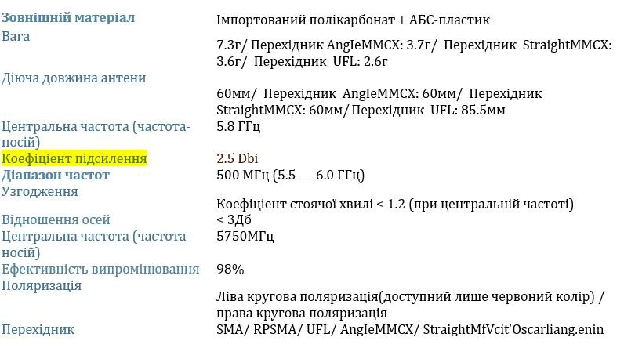
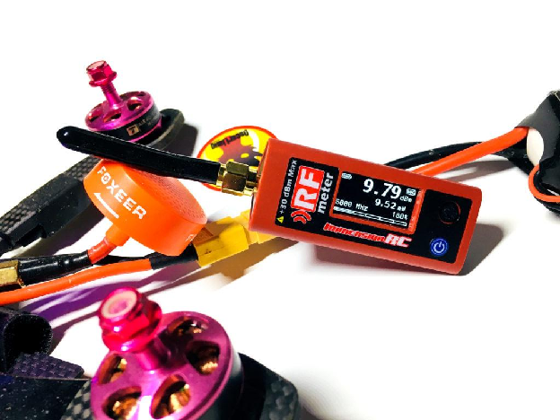

Стисле посилання на цей переклад: [https://bit.ly/LiangMaximizingFPVrange](https://bit.ly/LiangMaximizingFPVrange)   

| 🫂 | Нижче виконаний та вичитаний людьми український переклад оригіналу. Для [VictoryDrones](https://www.victory-drones.com/) переклад виконала: Lada. Хочете покращити переклад чи знайшли помилку? — Лишіть коментар (Ctrl+Alt+M або «Меню» \> «Вставка» \> «Коментар»). Ми теж живі люди (як і ви) і робим помилки. 😉 |
| :---: | :---- |

**Максимізація дальності FPV: розуміння децибел (дБ),  оптимізація налаштувань та ефективності вашого безпілотника**

Ця інструкція про те, як приблизно розрахувати максимальну дальність вашого безпілотника FPV, використовуючи значення децибел (дБ) вашого обладнанням FPV. Розуміння цих значень є вирішальним, оскільки дозволяє оцінити можливості налаштувань, ефективність та обмеження вашого безпілотника FPV. 

Ключовий принцип FPV полягає в тому, що, збільшивши вихідну потужність в чотири рази (або на 6 дБ), ви можете, фактично, подвоїти максимальну дальність. Але чому це так? Ця інструкція має на меті надати чітке пояснення цього принципу та наукові способи збільшення дальності.

8 квітня 2023 року

Деякі посилання на цій сторінці є партнерськими. Я \[автор англомовної версії Оскар Ланг\] отримую комісію (без додаткових витрат для вас), якщо ви робите покупку після натискання одного із цих партнерських посилань. Це допомагає підтримувати безкоштовний контент для спільноти на цьому веб\-сайті. Будь ласка, прочитайте нашу Політику партнерських посилань для отримання додаткової інформації.

Зміст

[Що таке дБ?](#heading=)

[дБ та максимальна дальність](#heading=)

[Підсилення антени в дБ](#heading=)

[Потужність відеопередавача в дБ](#потужність-відеопередавача-в-дб)

[Чутливість приймача в дБ](#чутливість-приймача-в-дб)

[Як розрахувати дальність FPV за допомогою дБ?](#як-розрахувати-дальність-fpv-за-допомогою-дб?)

[Приклад з реального життя – Корисність дБ\!](#heading=)

[Інші причини втрати сигналу](#heading=)

[Висновки](#висновки)

## **Що таке дБ?**

У FPV-дронах децибели (дБ) можуть використовуватися для вимірювання потужності сигналу, коефіцієнта підсилення антени, а також вихідної потужності VTX (відеопередавача). Децибели функціонують за нелінійною, логарифмічною шкалою. Наприклад, додавання 3 дБ подвоює потужність сигналу, але аби подвоїти дальність необхідно додати 6 дБ.

Отже, навіщо використовувати дБ? У деяких випадках робота із дБ набагато простіша через простішу математику. Вам потрібно лише додати або відняти числа, без необхідності множення або ділення. Я поясню більш детально далі.

## **дБ та максимальна дальність** 

Загальне значення дБ в системі FPV, відоме як енергетичний бюджет радіолінії, визначається:

* Підсиленням антени

* Потужністю передавача

* Чутливістю приймача

Коли сигнал FPV проходить через повітря, він послаблюється, тобто дБ отриманого сигналу зменшуються щодалі ви летите, подібно до того, як звук стає тихішим зі збільшенням відстані.

Знаючи бюджет радіолінії та врахувавши втрату сигналу під час руху в повітрі (також відому як згасання у вільному просторі), ви можете приблизно розрахувати дальність. Дальність максимальна, коли дБ досягає 0, тому що більший бюджет радіолінії, то більша дальність.

Не зважаючи на можливість оцінити дальність FPV за допомогою дБ, у реальних умовах на сигнал можуть впливати численні змінні, такі як фоновий шум, радіоперешкоди, вологість тощо. Через це майже неможливо дізнатися, на скільки точно метрів чи футів рнпошириться сигнал.

Тим не менш, дБ залишаються цінним інструментом, який допомагає нам зрозуміти як покращити ефективність дрона, використовуючи різні фактори, такі як збільшення вихідної потужності VTX або використання антен з різними коефіцієнтами підсилення.

## **Підсилення антени в дБ**

Як ви, можливо, вже знаєте, [антени FPV](https://bit.ly/LiangBestFPVAnt) мають різні [коефіцієнти підсилення ](https://oscarliang.com/how-antenna-gain-affects-range/), що вимірюються у дБі (децибел ізотропний). Цей технічний параметр зазвичай вказаний на сторінці товару.

## **Потужність відеопередавача в дБ** {#потужність-відеопередавача-в-дб}

Використовуючи вимірювач потужності [ImmersionRC,](https://oscarliang.com/immersionrc-rf-powermeter-v2/) ви помітите, що він відображає як мВт, так і дБм. Вихідна потужність VTX (відеопередавача) зазвичай вимірюється у мВт (міліватах). Для перетворення між дБм і мВт можна використовувати такі прості рівняння:

дБм \= 10\*lg(мВт), мВт \= 10^(дБм/10)

Нічого не петраєте в математиці? Не біда\! Існує безліч онлайн-калькуляторів, які допоможуть вам перетворити значення мВт і дБ. Також є таблиця зі списком значень потужності у ваттах, що [використовуються у відеопередавачах FPV-дронів,](http://bit.ly/LiangBestVTX4FPV-uk-UA) та відповідними значеннями дБм:

| мВт | дБм |
| :---: | :---: |
| 1 | 0 |
| 10 | 10 |
| 25 | 13.98 |
| 50 | 16.99 |
| 100 | 20 |
| 200 | 23.01 |
| 300 | 24.77 |
| 400 | 26.02 |
| 500 | 26.99 |
| 600 | 27.78 |
| 800 | 29.03 |
| 1000 (1 Вт) | 30 |
| 1500 (1.5 Вт) | 31.76 |
| 2000 (2 Вт) | 33.01 |

Пам'ятайте, що збільшення на 3 дБ подвоює потужність сигналу, але аби подвоїти дальність необхідне збільшення на 6 дБ. Таким чином, переведення VTX з 200 мВт до 400 мВт не подвоїть вашу дальність, а збільшить її на 50%. Важливо зазначити, що просто збільшення вихідної потужності не є чарівною паличкою: в якийсь момент вигоди від збільшення потужності не покриватимуть витрати на досягнення цього збільшення. Тому при намаганні розширити дальність польоту, збільшення вихідної потужності буде ефективним лише до певного моменту.

## **Чутливість приймача в дБ** {#чутливість-приймача-в-дб}

дБ \- неймовірно зручний спосіб вимірювання дуже малої потужності сигналу. Наприклад, приймач може виявити слабкий сигнал потужністю 0,0000000001 мВт, але це вже досить багато\! Набагато простіше виразити це в дБ, тобто \-100 дБ. Якщо ж сигнал у 10 разів сильніший, то 0,000000001 мВт дорівнюватиме \-90 дБ. Так набагато зрозуміліше і простіше.

* Позитивне значення дБ \= вище 1 мВт

* Від'ємне значення дБ \= менше 1 мВт

* 0 дБ \= 1 мВт

| дБ | мВт |
| :---- | :---- |
| 100 дБ | 10000000000мВт |
| 10 дБ | 10 мВт |
| 1 дБ | 1.26мВт |
| 0 дБ | 1 мВт |
| \-1 дБ | 0.79мВт |
| \-2 дБ | 0.63мВт |
| \-10 дБ | 0.1 мВт |
| \-100 дБ | 0.0000000001 мВт |

Чутливість приймача визначає мінімальну радіочастотну потужність, яку він може виявити. Що чутливіший приймач, то слабший сигнал він може детектувати і то від'ємнішим буде значення дБ. Хоча спочатку це може здатися нелогічним, більш від'ємне число вказує на більший діапазон чутливості приймача.

Виробники відеоприймачів часто не розкривають цей параметр, проте коли й роблять це, то його точність може ставитися під сумнів, оскільки вони, як правило, оптимістично подають характеристики своїх продуктів.

Якщо ви ніде не можете знайти це число, \-85 дБ \- це скромна оцінка для аналогових відеоприймачів (подана у [цьому дописі на ресурсі FPV Lab](https://fpvlab.com/forums/showthread.php?25174-Link-Margin-Transmitter-Power-Theoretical-Range-and-Antenna-Gain&p=424870&viewfull=1#post424870)).  
За даними Foxtech, модуль приймача RX5808 має типову чутливість \-90 дБ. Виробник FuriousFPV відповів на запитання про чутливість модуля приймача True-D, надавши параметр \-93 дБм \+/-5 дБм.

Якщо вам відома чутливість вашого приймача, будь ласка, поділіться цим параметром у коментарях. Ця інформація може допомогти комусь у майбутньому.

## **Як розрахувати дальність FPV за допомогою дБ?** {#як-розрахувати-дальність-fpv-за-допомогою-дб?}

Просто введіть значення в цей [**калькулятор дальності, який я зробив**](https://oscarliang.com/js/fpvrange.html), і він поверне відстань у кілометрах.  
Для тих, хто цікавиться технічними деталями, ось вони:

Як згадувалося раніше, абсолютну максимальну дальність можна визначити, коли сила сигналу падає до 0\. Однак, коли сигнал слабшає, відео буде статичним і може стати «нелітабельним»(непридатним до польотів). Щоб забезпечити надійне з'єднання, зазвичай роблять припущення про мінімальний рівень сили сигналу, який ми повинні підтримувати, тобто енергетичний [**запас**](https://en.wikipedia.org/wiki/Link_margin) [**радіолінії**](https://en.wikipedia.org/wiki/Link_margin)**.** Наприклад, ви хочете зберігати значення понад 10 дБ або 12 дБ, або навіть вище для певності.  
Використовуючи рівняння згасання у вільному просторі (FSPL) ([калькулятор](https://www.electronics-notes.com/articles/antennas-propagation/propagation-overview/free-space-path-loss.php),  [довідка](https://uk.wikipedia.org/wiki/%D0%97%D0%B3%D0%B0%D1%81%D0%B0%D0%BD%D0%BD%D1%8F_%D1%83_%D0%B2%D1%96%D0%BB%D1%8C%D0%BD%D0%BE%D0%BC%D1%83_%D0%BF%D1%80%D0%BE%D1%81%D1%82%D0%BE%D1%80%D1%96)), ми можемо змінити його на:  
Відстань \= 10^((FSPL-LM-32.44)-20\*lg(f))/20)

Де

* FSPL (згасання у вільному просторі) \= підсилення антени передавача \+ підсилення антени приймача \+ потужність передавача – чутливість приймача

* LM \= енергетичний запас радіолінії

* f \= частота в МГц

## **Приклад з реального життя – Корисність дБ\!**

Давайте використаємо такі налаштування як приклад:

* 25 мВт відеопередавач (**14дБм**)  
* Антена відеопередавача: [Антена Lollipop (назва \- Xilo AXII)](https://bit.ly/LiangBestFPVAnt) (**2,5дБі**)  
* Відеоприймач: Типовий приймач RX (**\-90дБм**)  
* Антена відеоприймача: антена Lollipop V2 (**2,5дБі**)  
* Припускаючи, що енергетичний запас радіолінії становить **10 дБ**

Введіть ці значення [в калькулятор дальності](https://oscarliang.com/js/fpvrange.html), і він покаже, що приблизна дальність становить близько **0,37 км.**  
Тепер, щоб подвоїти дальність, нам потрібно додати 6 дБ до нашого бюджету радіолінії. Ось кілька варіантів:

* Збільшити вихідну потужність VTX до **100 мВт** (до 20 дБм, в 4 рази більше потужності)  
* Або використати антену з вищим коефіцієнтом підсилення на приймачі з коефіцієнтом підсилення 8,5 дБ або більше. Лише спрямовані антени забезпечують такий високий коефіцієнт підсилення. Наприклад, патч-антена [Menace Pico має](https://oscarliang.com/best-fpv-antenna/#Directional-Antennas-Cheap-Worth-Having) коефіцієнт підсилення **9,4** **дБі**

Одна з цих опцій теоретично подвоїть дальність до понад **0,74 км.** Якщо ви застосуєте обидва варіанти, дальність збільшиться в чотири рази і становитиме майже **1,5 км**\!  
Якщо вам все ще потрібна більша дальність, ви можете використати меншу частоту, якщо інші змінні залишаються такими ж. Наприклад, перемикання з 5,8 ГГц на 1,3 ГГц може розширити радіус до понад **6 км** у цьому прикладі \.  
Майте на увазі, що ці розрахунки передбачають ідеальні умови польоту. Насправді ж фактична дальність, ймовірно, буде коротшою через різні фактори.

## **Інші причини втрати сигналу**

Реальна дальність може бути меншою, ніж розрахована, через такі фактори:

* Радіоперешкоди та шум у довкіллі *\[прим. пер.: РЕБ, активні перешкоди\]* або від інших пілотів

* Потужність відеопередавача падає, коли він перегрівається 

* Орієнтація антени (вирівнювання антени на передачу та антени на прийом, [див. цей допис з порадами щодо кріплення антени](https://bit.ly/HowtoPositionAntenna))  
  * При 45 градусах: \-3 дБ

  * При 90 градусах: \-20 дБ

  * Дві лінійні антени, спрямовані одна на одну \= \-30 дБ

* Невідповідність поляризації антени, [дізнайтеся більше про ці теми тут](https://bit.ly/LiangBestFPVAnt):  
  * Лінійна та кругова: \-3 дБ

  * Права та ліва кругова поляризація: \-20 дБ

* Втрати коаксіального кабеля та адаптерів типу SMA, MMCX, UFL (зазвичай не великі, наприклад, 0,1-0,3 дБ), [див. цей допис для отримання додаткової інформації про перехідники для антен](https://oscarliang.com/fpv-antenna-connectors/)  
* Діаграма спрямованості антени – Неспрямовані антени мають слабкий сигнал безпосередньо над ними, а спрямовані антени набагато менш ефективні за межами ширини пелюстки. [Дізнайтеся більше про діаграму спрямованості антени тут](http://bit.ly/LiangBestFPVAnt).

\* Показники втрати сигналу взяті з цього [джерела](http://www.astronwireless.com/topic-archives-antennas-polarization.asp)

## 

## **Висновки** {#висновки}

Збільшення вихідної потужності дійсно може покращити дальність FPV, але важливо дотримуватися перевірених методів, таких як правильне настроювання антени. Пам'ятайте, що знання є ключовими, коли йдеться про оптимізацію дальності вашого FPV, а поради та хитрощі, описані тут, допоможуть досягти бажаної ефективності дрона. Вдалих польотів\!

**КОМЕНТАРІ**

MARTIN

Гарна стаття, але в багатьох місцях використовуються дБ замість дБм, що було б доречніше.

Також це речення здається не зовсім правильним:  
  як згадувалося раніше, абсолютну максимальну дальність можна визначити, коли сила сигналу падає до 0 дБ.  
  Можливо, ви хотіли сказати "падає до 0 мВт"? Бо у разі використання значення дБм, 0 дБ \- це найсильніший сигнал, а не найслабший, чи не так?

 

TITAS SAHA

Абсолютно чудово описано. Так просто, але дуже детально. Ви дуже хороший викладач, розвіяли всі мої сумніви щодо дб і мв. Насправді пілоти fpv-дронів більше стурбовані якістю відеосигналу, а не дальністю. Тому я прошу вас, якщо можливо, описати, як отримати якісне відео з максимально низьким рівнем шуму при обмеженій дальності (скажімо, 0,5 км). Дякую.

 

CHRIS

Велике спасибі за цю інформацію і ваш сайт в цілому. Супер деталізовано, що мені дуже подобається. До того ж, ви надаєте рекомендації, які полегшують заняття хобі.

 

ALEX

Я поділяю почуття Hugo Chamberland. 2,5 дБі \- це максимум.  
  Що дійсно потрібно, так це графік випромінювання, який показує коефіцієнт посилення в залежності від градусів. Графік випромінювання може мати значні нулі, що призведе до від'ємного запасу радіолінії, але вводячи дБі в калькуляторі, доки у вас не буде нульового запасу, ви побачите доступність радіолінії відносно кутів на вашій антені.  
  ТАКОЖ, чого не вистачає калькулятору, то це порогу запасу для демодуляції даних. Питання полягає в тому, яку модуляцію використовують R/C-передавачі/приймачі та який поріг. Наприклад, для двійкової фазової маніпуляції (BPSK) потрібно щонайменше 11 дБ запасу, для квадратурної фазової маніпуляції (QPSK) 5,5 дБ тощо.

 

HUGO CHAMBERLAND

Ви повинні виправити, що коефіцієнт підсилення антени типу lollipop зовсім не 2,5 дБі. Він у середньому 1,5 дБі. Я кажу, в середньому, тому що він дико коливається по вертикалі (від \-3 до 2,5 Дбі). Тому насправді лише \-3 дБі підходить для використання, оскільки діапазони 2.5Dbi просто занадто малі. На жаль, дані виробників про дБі приблизно так само неточні, як і дані виробників про струмовіддачу на літій-полімерних акумуляторах, виробники часто завищують показники.

 

ALAN MCCLUSKEY

лол просто читаю тут деякі відповіді хе-хе,,  
  дуже корисна інформація, легко забути, як трактувати dbi з точки зору відстані, тому таблиця мВТ/dbi дуже практична дякую... у мене немає надзвичайно складних запитань з цієї теми хе-хе

VINCE

Просто вибух мозку

 

CHRISTIAN COLEMAN

Яка чутливість модулю Laforge v4 з відеоприймачем diversity?

ROM

У калькуляторі частота повинна бути для приймача сигналу або відеопередавача?

OSCAR  
Просто залиште його на рівні 5800 для частоти 5,8 ГГц. Змініть його, лише якщо ви використовуєте інші частоти, як-от 1,3Г, 2,4Г тощо...

ALEKSANDR

Додайте Іншу втрату сили сигналу – Втрата сили сигналу через близькість антени до тіла пілота (3 – 5 дБ) \+ повільне згасання (3 дБ) \+ швидке згасання (3 дБ)

 

DAVE

Чим відрізняються дБм і дБі??  
 У вашій формулі для розрахунку FSPL:FSPL  
  \= 2,5 \+ 2,5 – 93 \!\!\!?  
 Здається, це неправильно.

 

OSCAR  
У калькуляторі вони не мають значення, просто вкажіть числа. Чутливість приймача сигналу —  
  це від 'ємне число, тому мінус від'ємне число дає позитивне.

 

[image1]: 

[image2]: 

[image3]: 