Стисле посилання на цей переклад: [https://bit.ly/SWRplots](https://bit.ly/SWRplots)

|  | Нижче вичитаний людьми машинний український переклад оригіналу. Для [VictoryDrones](https://www.victory-drones.com/) переклад вичитали: Faina, Max Well\!, Block. Хочете покращити переклад чи знайшли помилку? — Лишіть коментар (Ctrl+Alt+M або «Меню» \> «Вставка» \> «Коментар»). Ми теж живі люди (як і ви) і робим помилки. Роботи їх, до речі, також роблять 😉 |
| :---: | :---- |

# **Графіки КСХ для різних антен — дізнайся який канал/частота є найкращими**

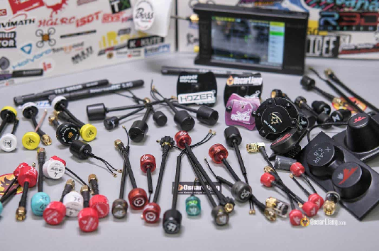

Оптимізація кожного аспекту налаштування вашого FPV дрона є ключовим для досягнення найкращої якості відео і дальності польоту. Розуміння **коефіцієнта стоячої хвилі** (КСХ) антени 5,8 ГГц може допомогти визначити, яку частоту або канал слід використовувати для оптимальної продуктивності. Не у всіх є інструменти для вимірювання КСХ, тому я провів широкомасштабні тести на антенах, які у мене є, щоб поділитися з вами їхніми графіками КСХ. 

*Деякі посилання на цій сторінці є партнерськими. Я \[автор англомовної версії Оскар Ланг\] отримую комісію (без додаткових витрат для вас), якщо ви робите покупку після натискання одного із цих партнерських посилань. Це допомагає підтримувати безкоштовний контент для спільноти на цьому веб\-сайті. Будь ласка, прочитайте нашу [Політику партнерських посилань](https://oscarliang.com/affiliate-program-policy/) для отримання додаткової інформації.*

Зміст

[Графіки КСХ для різних антен – дізнайся який канал є найкращим](#heading=h.obnfk0q1d5l4)

[Пояснення графіків КСХ](#пояснення-графіків-ксх)

[Поради для покращення відеозв'язку на FPV](#поради-для-покращення-відеозв’язку-на-fpv)

[Антена відеопередавача VTX DarwinFPV Darwin129](#антена-відеопередавача-vtx-darwinfpv-darwin129)

[Антена DJI FPV Air Unit SMA Part 05](#антена-dji-fpv-air-unit-sma-part-05)

[Антена окулярів DJI FPV Goggles V1](#антена-окулярів-dji-fpv-goggles-v1)

[Двохдіапазоннa aнтена DJI O3 Air Unit Dual-band](#двохдіапазоннa-aнтена-dji-o3-air-unit-dual-band)

[Діпольна aнтена Fatshark Rubber Duck Dipole](#діпольна-aнтена-fatshark-rubber-duck-dipole)

[FlyfishRC Osprey 140mm](#flyfishrc-osprey-140mm)

[FlyfishRC Osprey 40mm](#flyfishrc-osprey-40mm)

[Двоxдіапазонна антена FlyfishRC Osprey Dual-band 140mm](#двоxдіапазонна-антена-flyfishrc-osprey-dual-band-140mm)

[Двоxдіапазонна антена FlyfishRC Osprey Dual-band 70mm](#двоxдіапазонна-антена-flyfishrc-osprey-dual-band-70mm)

[Flywoo Atomic](#flywoo-atomic)

[Антена Flywoo O3 Lite](#антена-flywoo-o3-lite)

[Foxeer Lollipop 4 Stubby](#foxeer-lollipop-4-stubby)

[Foxeer Lollipop 4](#foxeer-lollipop-4)

[Foxeer Lollipop 4+ SMA](#foxeer-lollipop-4+-sma)

[Foxeer Lollipop 4+ UFL](#foxeer-lollipop-4+-ufl)

[Foxeer Lollipop V1](#foxeer-lollipop-v1)

[Foxeer Lollipop V2](#foxeer-lollipop-v2)

[Foxeer Micro Lollipop](#foxeer-micro-lollipop)

[Frsky Rondo](#frsky-rondo)

[HGLRC Hammer](#hglrc-hammer)

[iFlight Albatross](#iflight-albatross)

[Діпольна aнтена ImmersionRC Rubber Duck Dipole](#діпольна-aнтена-immersionrc-rubber-duck-dipole)

[Maple Leaf Patch 8.5dBi](#maple-leaf-patch-8.5dbi)

[Maple Leaf Lollipop 2dBi](#maple-leaf-lollipop-2dbi)

[Menace Invader](#menace-invader)

[Menace PicoPatch](#menace-picopatch)

[Антена Runcam Link Air Unit](#антена-runcam-link-air-unit)

[RushFPV Cherry 2 SMA](#rushfpv-cherry-2-sma)

[RushFPV Cherry 2 UFL](#rushfpv-cherry-2-ufl)

[RushFPV Cherry V1 SMA](#rushfpv-cherry-v1-sma)

[RushFPV Cherry V1 UFL](#rushfpv-cherry-v1-ufl)

[Speedybee LHCP SMA](#speedybee-lhcp-sma)

[Speedybee RHCP SMA](#speedybee-rhcp-sma)

[Speedybee RHCP UFL](#speedybee-rhcp-ufl)

[TrueRC Singularity Long 120mm](#truerc-singularity-long-120mm)

[TrueRC Singularity Regular 62mm](#truerc-singularity-regular-62mm)

[TrueRC Singularity Short 40mm](#truerc-singularity-short-40mm)

[TrueRC Singularity Stubby LHCP](#truerc-singularity-stubby-lhcp)

[TrueRC Singularity Stubby RHCP](#truerc-singularity-stubby-rhcp)

[TrueRC Sniper II](#truerc-sniper-ii)

[TrueRC X-Air MKII](#truerc-x-air-mkii)

[TrueRC X-Air MKII DJI FPV](#truerc-x-air-mkii-dji-fpv)

[Walksnail Mini 1S Lite](#walksnail-mini-1s-lite)

[Walksnail VTX V2](#walksnail-vtx-v2)

[Walksnail Redbird](#walksnail-redbird)

[Walksnail Redbird V2](#walksnail-redbird-v2)

[Висновок](#висновок)

# **Пояснення графіків КСХ** {#пояснення-графіків-ксх}

Що таке КСХ антени: [bit.ly/LiangBestFPVAnt](https://bit.ly/LiangBestFPVAnt). Хочете виміряти КСХ антени? Перегляньте мій поглиблений посібник: [https://bit.ly/MeasureAntennaSWR](https://bit.ly/MeasureAntennaSWR)  
Антени у цьому огляді розташовані в алфавітному порядку. Маркери графіка розміщені наступним чином: 

| Маркер 2 (M2) – на частоті 5.6 ГГц,  Маркер 3 (M3) – на 5.8 ГГц (центр графіка),  Маркер 4 (M4) – на 6.0 ГГц,  Маркер 1 (M1) показує місце з найнижчим КСХ в діапазоні вимірювання від 5.4 ГГц до 6.2 ГГц.  *\[збільшене зображення кожного графіку є в [оригінальному тексті](https://oscarliang.com/fpv-antenna-swr/) [https://oscarliang.com/fpv-antenna-swr](https://oscarliang.com/fpv-antenna-swr)\]* |
| :---- |

# **Поради для покращення відеозв’язку на FPV**  {#поради-для-покращення-відеозв’язку-на-fpv}

* **Вибір правильної антени:** розгляньте антени, де КСХ є постійно низьким на всіх каналах, які ви часто використовуєте.  
* **Оптимізація каналу:** використовуйте графіки КСХ, щоб визначити, які канали найкраще підходять для вашої обраної антени.  
* **Відповідність антен приймача:**  для найкращих результатів переконайтеся, що антени для приймача мають відповідну резонансну частоту. 

## **Антена відеопередавача VTX DarwinFPV Darwin129**  {#антена-відеопередавача-vtx-darwinfpv-darwin129}

Цe антена для дронy Darwin129 7″:   
[https://oscarliang.com/darwin129/](https://oscarliang.com/darwin129/)  
  
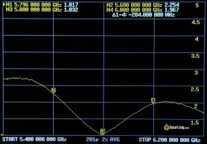

## **Антена DJI FPV Air Unit SMA Part 05** {#антена-dji-fpv-air-unit-sma-part-05}

Сторінка виробу: [https://amzn.to/3Uc2mhq](https://amzn.to/3Uc2mhq)  
  
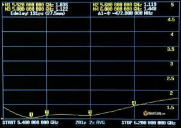

## **Антена окулярів DJI FPV Goggles V1**  {#антена-окулярів-dji-fpv-goggles-v1}

Антени окулярів DJI FPV Goggles V1: [https://bit.ly/LiangDJI-FPV](https://bit.ly/LiangDJI-FPV)    
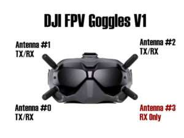  
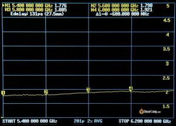  
Друга антена.  
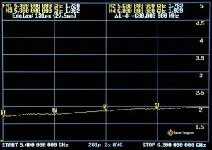

##  **Двохдіапазоннa aнтена DJI O3 Air Unit Dual-band**  {#двохдіапазоннa-aнтена-dji-o3-air-unit-dual-band}

Стандартна антена в модулі DJI O3 Air підтримує двохдіапазонну роботу — як 5,8 ГГц, так і 2,4 ГГц, тому ось графіки для обох частот. Вимірювання були проведені для обох роз'ємів.   
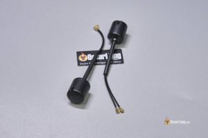  
Антена 1, роз'єм 1\.  
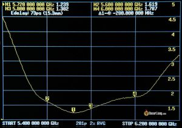 [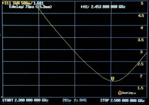](https://oscarliang.com/wp-content/uploads/2024/04/DJI-O3-Air-Unit-Dual-band-antenna-swr-1-5.8ghz-connector-1.jpg)  
Антена 1, роз'єм 2\.  
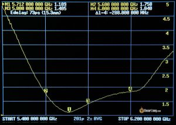 [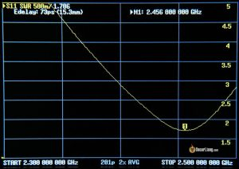](https://oscarliang.com/wp-content/uploads/2024/04/DJI-O3-Air-Unit-Dual-band-antenna-swr-1-5.8ghz-connector-2.jpg)  
Антена 2, роз'єм 1\.  
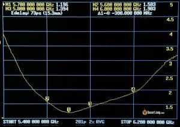 [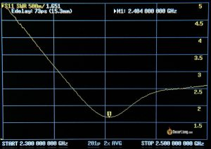](https://oscarliang.com/wp-content/uploads/2024/04/DJI-O3-Air-Unit-Dual-band-antenna-swr-2-5.8ghz-connector-1.jpg)  
Антена 2, роз'єм 2\.  
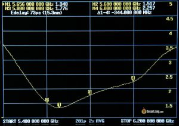 [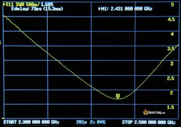](https://oscarliang.com/wp-content/uploads/2024/04/DJI-O3-Air-Unit-Dual-band-antenna-swr-2-5.8ghz-connector-2.jpg)

## **Діпольна aнтена Fatshark Rubber Duck Dipole**  {#діпольна-aнтена-fatshark-rubber-duck-dipole}

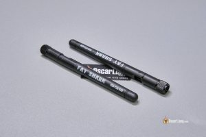  
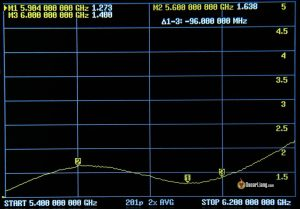  
Друга антена.  
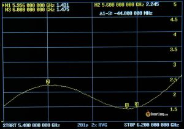

## **FlyfishRC Osprey 140mm** {#flyfishrc-osprey-140mm}

Сторінка виробу:

* AliExpress: [https://s.click.aliexpress.com/e/\_De4RCCt](https://s.click.aliexpress.com/e/_De4RCCt)  
* Amazon: [https://amzn.to/3U8l2Pk](https://amzn.to/3U8l2Pk)

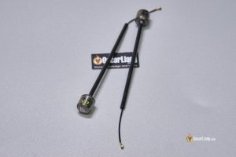  
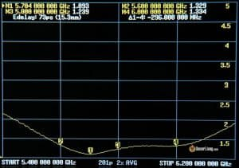  
Друга антена.  
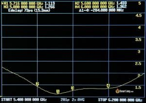

## **FlyfishRC Osprey 40mm** {#flyfishrc-osprey-40mm}

Сторінка виробу:

* AliExpress: [https://s.click.aliexpress.com/e/\_De4RCCt](https://s.click.aliexpress.com/e/_De4RCCt)  
* Amazon: [https://amzn.to/3U8l2Pk](https://amzn.to/3U8l2Pk)  
* RDQ: [https://oscarliang.com/product-d023](https://oscarliang.com/product-d023)

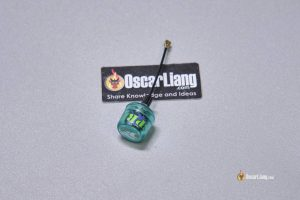  
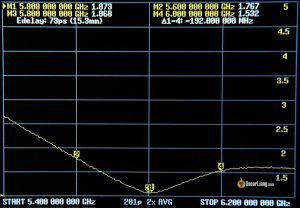

## **Двоxдіапазонна антена FlyfishRC Osprey Dual-band 140mm** {#двоxдіапазонна-антена-flyfishrc-osprey-dual-band-140mm}

Призначенo для роботи на діапазонах 2,4 ГГц та 5,8 ГГц.   
Сторінка виробу:

* AliExpress: [https://s.click.aliexpress.com/e/\_DB82r7x](https://s.click.aliexpress.com/e/_DB82r7x)  
* RDQ: [https://oscarliang.com/product-fl8d](https://oscarliang.com/product-fl8d)

  
роз'єм 1\.  
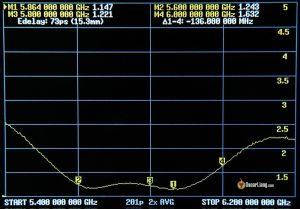 [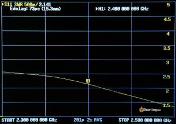](https://oscarliang.com/wp-content/uploads/2024/04/FlyfishRC-Osprey-Dual-band-antenna-140mm-swr-1-5.8ghz-connector-1.jpg)  
роз'єм 2\.  
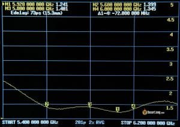 [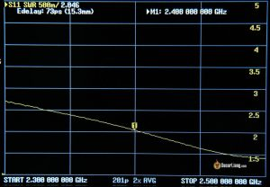](https://oscarliang.com/wp-content/uploads/2024/04/FlyfishRC-Osprey-Dual-band-antenna-140mm-swr-1-5.8ghz-connector-2.jpg)

## **Двоxдіапазонна антена FlyfishRC Osprey Dual-band 70mm** {#двоxдіапазонна-антена-flyfishrc-osprey-dual-band-70mm}

Призначенo для роботи на діапазонах 2,4 ГГц та 5,8 ГГц.   
Сторінка виробу:

* AliExpress: [https://s.click.aliexpress.com/e/\_DB82r7x](https://s.click.aliexpress.com/e/_DB82r7x)  
* RDQ: [https://oscarliang.com/product-fl8d](https://oscarliang.com/product-fl8d)

  
роз'єм 1\.  
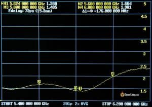 [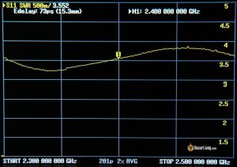](https://oscarliang.com/wp-content/uploads/2024/04/FlyfishRC-Osprey-Dual-band-antenna-70mm-swr-1-5.8ghz-connector-1.jpg)  
роз'єм 2\.  
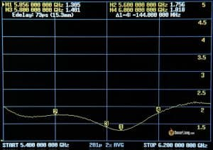 [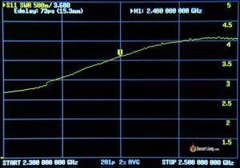](https://oscarliang.com/wp-content/uploads/2024/04/FlyfishRC-Osprey-Dual-band-antenna-70mm-swr-1-5.8ghz-connector-2.jpg)

## **Flywoo Atomic** {#flywoo-atomic}

Сторінка виробу: [https://oscarliang.com/product-wk1k](https://oscarliang.com/product-wk1k)  
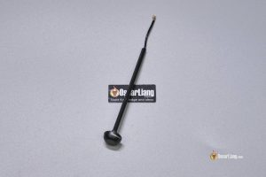  
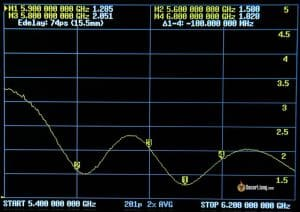

## **Антена Flywoo O3 Lite**  {#антена-flywoo-o3-lite}

Антени Flywoo Naked O3 Lite/Ultra kit: [https://oscarliang.com/flywoo-naked-o3-lite-ultra-kit/](https://oscarliang.com/flywoo-naked-o3-lite-ultra-kit/)  
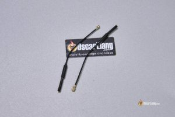  
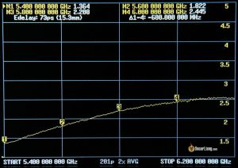  
Друга антена.  
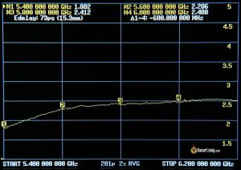

## **Foxeer Lollipop 4 Stubby** {#foxeer-lollipop-4-stubby}

Сторінка виробу:

* AliExpress: [https://s.click.aliexpress.com/e/\_DdQYU2V](https://s.click.aliexpress.com/e/_DdQYU2V)  
* Amazon: [https://amzn.to/3Uc9dGP](https://amzn.to/3Uc9dGP)  
* RDQ: [https://oscarliang.com/product-g4ht](https://oscarliang.com/product-g4ht)

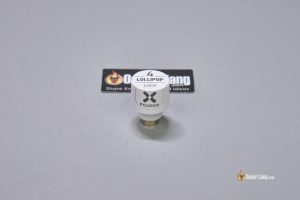  
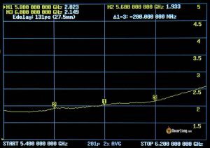  
Друга антена.  
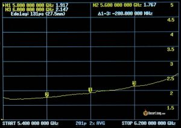

## **Foxeer Lollipop 4** {#foxeer-lollipop-4}

Сторінка виробу:

* AliExpress: [https://s.click.aliexpress.com/e/\_DCYJRHJ](https://s.click.aliexpress.com/e/_DCYJRHJ)  
* Amazon: [https://amzn.to/43UdDX8](https://amzn.to/43UdDX8)  
* RDQ: [https://oscarliang.com/product-qqzo](https://oscarliang.com/product-qqzo)

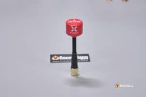  
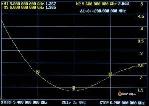  
Друга антена.  
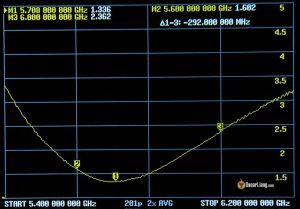

## **Foxeer Lollipop 4+ SMA** {#foxeer-lollipop-4+-sma}

Сторінка виробу:

* AliExpress: [https://s.click.aliexpress.com/e/\_DdUHwh3](https://s.click.aliexpress.com/e/_DdUHwh3)  
* Amazon: [https://amzn.to/3Ucpn4a](https://amzn.to/3Ucpn4a)  
* RDQ: [https://oscarliang.com/product-xz3d](https://oscarliang.com/product-xz3d)

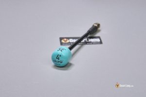  
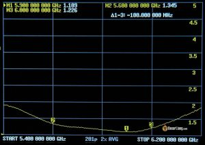

## **Foxeer Lollipop 4+ UFL** {#foxeer-lollipop-4+-ufl}

Сторінка виробу:

* AliExpress: [https://s.click.aliexpress.com/e/\_DdUHwh3](https://s.click.aliexpress.com/e/_DdUHwh3)  
* Amazon: [https://amzn.to/3Ucpn4a](https://amzn.to/3Ucpn4a)  
* RDQ: [https://oscarliang.com/product-kd3b](https://oscarliang.com/product-kd3b)

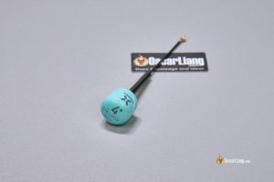  
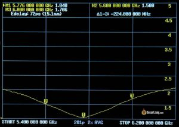

## **Foxeer Lollipop V1** {#foxeer-lollipop-v1}

Більше не виробляються.  
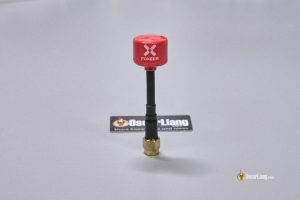  
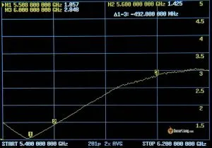

## **Foxeer Lollipop V2** {#foxeer-lollipop-v2}

Більше не виробляються.  
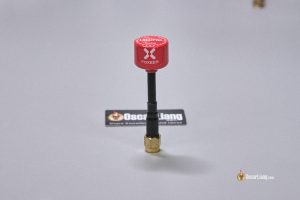  
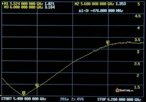

## **Foxeer Micro Lollipop** {#foxeer-micro-lollipop}

Сторінка виробу:

* AliExpress: [https://s.click.aliexpress.com/e/\_DkY1mvj](https://s.click.aliexpress.com/e/_DkY1mvj)  
* Amazon: [https://amzn.to/4d42cjZ](https://amzn.to/4d42cjZ)  
* RDQ: [https://oscarliang.com/product-4ef0](https://oscarliang.com/product-4ef0)

  
  
Друга антена.  

## **Frsky Rondo** {#frsky-rondo}

Сторінка виробу: [https://s.click.aliexpress.com/e/\_DCbl49j](https://s.click.aliexpress.com/e/_DCbl49j)  
  

## **HGLRC Hammer** {#hglrc-hammer}

Сторінка виробу: [https://s.click.aliexpress.com/e/\_Dknx8al](https://s.click.aliexpress.com/e/_Dknx8al)  
  

## **iFlight Albatross** {#iflight-albatross}

Антена застосована в багатьох моделях iFlight BNF, таких як Evoque i Nazgul.  
Сторінка виробу:

* AliExpress: [https://s.click.aliexpress.com/e/\_DBi3iZj](https://s.click.aliexpress.com/e/_DBi3iZj)  
* Amazon: [https://amzn.to/3vJPbuY](https://amzn.to/3vJPbuY)  
* RDQ: [https://oscarliang.com/product-0hbc](https://oscarliang.com/product-0hbc)

  
  
Друга антена.  

## **Діпольна aнтена ImmersionRC Rubber Duck Dipole**  {#діпольна-aнтена-immersionrc-rubber-duck-dipole}

  

## **Maple Leaf Patch 8.5dBi** {#maple-leaf-patch-8.5dbi}

Сторінка виробу: [https://s.click.aliexpress.com/e/\_DDU7A25](https://s.click.aliexpress.com/e/_DDU7A25)  
  

## **Maple Leaf Lollipop 2dBi** {#maple-leaf-lollipop-2dbi}

Сторінка виробу: [https://s.click.aliexpress.com/e/\_DERjADj](https://s.click.aliexpress.com/e/_DERjADj)  
  

## **Menace Invader** {#menace-invader}

Сторінка виробу: [https://oscarliang.com/product-b07k](https://oscarliang.com/product-b07k)  
  
  
Друга антена.  

## **Menace PicoPatch** {#menace-picopatch}

Сторінка виробу:

* GetFPV: [https://oscarliang.com/product-k6jp](https://oscarliang.com/product-k6jp)  
* RDQ: [https://oscarliang.com/product-9imj](https://oscarliang.com/product-9imj)

  

## **Антена Runcam Link Air Unit**  {#антена-runcam-link-air-unit}

Стандартна антена йде в комплекті з Runcam Link Air Unit (Caddx Vista).  
  

## **RushFPV Cherry 2 SMA** {#rushfpv-cherry-2-sma}

Сторінка виробу:

* AliExpress: [https://s.click.aliexpress.com/e/\_DmaS67R](https://s.click.aliexpress.com/e/_DmaS67R)  
* Amazon: [https://amzn.to/4aNWksO](https://amzn.to/4aNWksO)

  
  
Друга антена.  

## **RushFPV Cherry 2 UFL** {#rushfpv-cherry-2-ufl}

Сторінка виробу: [https://s.click.aliexpress.com/e/\_DmaS67R](https://s.click.aliexpress.com/e/_DmaS67R)  
  

## **RushFPV Cherry V1 SMA** {#rushfpv-cherry-v1-sma}

Сторінка виробу:

* RDQ: [https://oscarliang.com/product-m4qr](https://oscarliang.com/product-m4qr)  
* AliExpress: [https://s.click.aliexpress.com/e/\_DFpVse5](https://s.click.aliexpress.com/e/_DFpVse5)

  
  
Друга антена.  

## **RushFPV Cherry V1 UFL** {#rushfpv-cherry-v1-ufl}

Більше не виробляються.  
  

## **Speedybee LHCP SMA** {#speedybee-lhcp-sma}

Сторінка виробу:

* AliExpress: [https://s.click.aliexpress.com/e/\_DeEAFR3](https://s.click.aliexpress.com/e/_DeEAFR3)  
* Speedybee: [https://oscarliang.com/product-unay](https://oscarliang.com/product-unay)

  
  
Друга антена.  

## **Speedybee RHCP SMA** {#speedybee-rhcp-sma}

Сторінка виробу:

* AliExpress: [https://s.click.aliexpress.com/e/\_DeEAFR3](https://s.click.aliexpress.com/e/_DeEAFR3)  
* Speedybee: [https://oscarliang.com/product-unay](https://oscarliang.com/product-unay)

  
  
Друга антена.  

## **Speedybee RHCP UFL** {#speedybee-rhcp-ufl}

Сторінка виробу:

* AliExpress: [https://s.click.aliexpress.com/e/\_DeEAFR3](https://s.click.aliexpress.com/e/_DeEAFR3)  
* Speedybee: [https://oscarliang.com/product-unay](https://oscarliang.com/product-unay)

  

## **TrueRC Singularity Long 120mm** {#truerc-singularity-long-120mm}

Сторінка виробу:

* GetFPV: [https://oscarliang.com/product-2q8f](https://oscarliang.com/product-2q8f)  
* Amazon: [https://amzn.to/4cOH018](https://amzn.to/4cOH018)

  

## **TrueRC Singularity Regular 62mm** {#truerc-singularity-regular-62mm}

Сторінка виробу:

* GetFPV: [https://oscarliang.com/product-sscm](https://oscarliang.com/product-sscm)  
* Amazon: [https://amzn.to/4cOH018](https://amzn.to/4cOH018)

  

## **TrueRC Singularity Short 40mm** {#truerc-singularity-short-40mm}

Сторінка виробу:

* RDQ: [https://oscarliang.com/product-npd0](https://oscarliang.com/product-npd0)  
* Amazon: [https://amzn.to/4cOH018](https://amzn.to/4cOH018)

  
  
Друга антена.  

## **TrueRC Singularity Stubby LHCP** {#truerc-singularity-stubby-lhcp}

Сторінка виробу:

* RDQ: [https://oscarliang.com/product-9n6w](https://oscarliang.com/product-9n6w)  
* GetFPV: [https://oscarliang.com/product-rh9l](https://oscarliang.com/product-rh9l)  
* Amazon: [https://amzn.to/4cOH018](https://amzn.to/4cOH018)

  

## **TrueRC Singularity Stubby RHCP** {#truerc-singularity-stubby-rhcp}

Сторінка виробу:

* RDQ: [https://oscarliang.com/product-90d9](https://oscarliang.com/product-90d9)  
* GetFPV: [https://oscarliang.com/product-husz](https://oscarliang.com/product-husz)  
* Amazon: [https://amzn.to/4cOH018](https://amzn.to/4cOH018)

  
  
Друга антена  

## **TrueRC Sniper II** {#truerc-sniper-ii}

Сторінка виробу:

* GetFPV: [https://oscarliang.com/product-oo57](https://oscarliang.com/product-oo57)  
* Amazon: [https://amzn.to/4aEAWq6](https://amzn.to/4aEAWq6)

  

## **TrueRC X-Air MKII** {#truerc-x-air-mkii}

Сторінка виробу:

* GetFPV: [https://oscarliang.com/product-khsf](https://oscarliang.com/product-khsf)  
* Amazon: [https://amzn.to/4arnfLz](https://amzn.to/4arnfLz)  
* RDQ: [https://oscarliang.com/product-qsct](https://oscarliang.com/product-qsct)

  

## **TrueRC X-Air MKII DJI FPV** {#truerc-x-air-mkii-dji-fpv}

Сторінка виробу:

* GetFPV: [https://oscarliang.com/product-d9e0](https://oscarliang.com/product-d9e0)  
* Amazon: [https://amzn.to/3vTsGDJ](https://amzn.to/3vTsGDJ)  
* RDQ: [https://oscarliang.com/product-c724](https://oscarliang.com/product-c724)

  
роз'єм на кабелі   
  
роз'єм на корпусі  

## **Walksnail Mini 1S Lite** {#walksnail-mini-1s-lite}

Сторінка виробу: [https://oscarliang.com/product-s6ns](https://oscarliang.com/product-s6ns)  
  

## **Walksnail VTX V2** {#walksnail-vtx-v2}

Сторінка виробу: [https://oscarliang.com/product-vgtf](https://oscarliang.com/product-vgtf)  
  
  
Друга антена.  

## **Walksnail Redbird** {#walksnail-redbird}

Сторінка виробу: [https://oscarliang.com/product-n73v](https://oscarliang.com/product-n73v)  
  
  
Друга антена.  

## **Walksnail Redbird V2** {#walksnail-redbird-v2}

Сторінка виробу:

* AliExpress: [https://s.click.aliexpress.com/e/\_DePvymV](https://s.click.aliexpress.com/e/_DePvymV)  
* GetFPV: [https://oscarliang.com/product-9nf0](https://oscarliang.com/product-9nf0)  
* RDQ: [https://oscarliang.com/product-3d2g](https://oscarliang.com/product-3d2g)  
* Caddx: [https://oscarliang.com/product-024k](https://oscarliang.com/product-024k)

  
  
Друга антена.  

# **Висновок**  {#висновок}

Коефіцієнт стоячої хвилі (КСХ) відіграє ключову роль у досягненні надійного відеозв'язку FPV. Розуміючи КСХ антени, пілоти можуть приймати обґрунтовані рішення, вибираючи найбільш підходящі антени та частоти/канали для своїх польотів. Я планую продовжувати тестування різних антен та буду регулярно оновлювати цей пост. Якщо у вас є конкретна антена, яку ви хочете, щоб я протестував, повідомте мені у коментарях. Приємних польотів\! 

[image1]: 

[image2]: 

[image3]: 

[image4]: 

[image5]: 

[image6]: 

[image7]: 

[image8]: 

[image9]: 

[image10]: 

[image11]: 

[image12]: 

[image13]: 

[image14]: 

[image15]: 

[image16]: 

[image17]: 

[image18]: 

[image19]: 

[image20]: 

[image21]: 

[image22]: 

[image23]: 

[image24]: 

[image25]: 

[image26]: 

[image27]: 

[image28]: 

[image29]: 

[image30]: 

[image31]: 

[image32]: 

[image33]: 

[image34]: 

[image35]: 

[image36]: 

[image37]: 

[image38]: 

[image39]: 

[image40]: 

[image41]: 

[image42]: 

[image43]: 

[image44]: 

[image45]: 

[image46]: 

[image47]: 

[image48]: 

[image49]: 

[image50]: 

[image51]: 

[image52]: 

[image53]: 

[image54]: 

[image55]: 

[image56]: 

[image57]: 

[image58]: 

[image59]: 

[image60]: 

[image61]: 

[image62]: 

[image63]: 

[image64]: 

[image65]: 

[image66]: 

[image67]: 

[image68]: 

[image69]: 

[image70]: 

[image71]: 

[image72]: 

[image73]: 

[image74]: 

[image75]: 

[image76]: 

[image77]: 

[image78]: 

[image79]: 

[image80]: 

[image81]: 

[image82]: 

[image83]: 

[image84]: 

[image85]: 

[image86]: 

[image87]: 

[image88]: 

[image89]: 

[image90]: 

[image91]: 

[image92]: 

[image93]: 

[image94]: 

[image95]: 

[image96]: 

[image97]: 

[image98]: 

[image99]: 

[image100]: 

[image101]: 

[image102]: 

[image103]: 

[image104]: 

[image105]: 

[image106]: 

[image107]: 

[image108]: 

[image109]: 

[image110]: 

[image111]: 

[image112]: 

[image113]: 

[image114]: 

[image115]: 

[image116]: 

[image117]: 

[image118]: 

[image119]: 

[image120]: 

[image121]: 

[image122]: 

[image123]: 

[image124]: 

[image125]: 

[image126]: 