  
Стисле посилання на цей переклад: [https://bit.ly/LiangFPVToolsMaterials](https://bit.ly/LiangFPVToolsMaterials)   

|  | Нижче вичитаний людьми машнний український переклад оригіналу. Для [VictoryDrones](https://www.victory-drones.com/) переклад вичитали: MO+VPS+Faina. Хочете покращити переклад чи знайшли помилку? — Лишіть коментар (Ctrl+Alt+M або «Меню» \> «Вставка» \> «Коментар»). Ми теж живі люди (як і ви) і робим помилки. Роботи їх, до речі, також роблять 😉і |
| :---: | :---- |

# **Інструменти та матеріали для створення FPV-дронів і літальних апаратів із нерухомим крилом**

21 лютого 2023 року

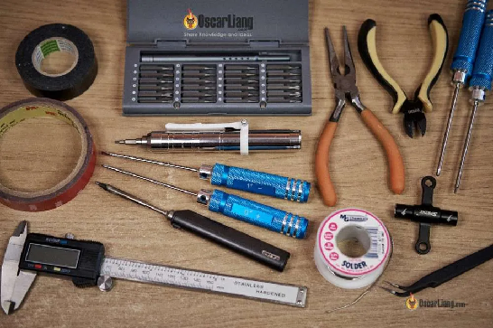

Ось список основних інструментів, стрічок, клею та матеріалів для створення i ремонту FPV\-дронів і літальних апаратів із нерухомим крилом. Я дам рекомендації, що необхідно придбати, що стане в нагоді для створення, ремонту та усунення несправностей.

«**Основнi інструменти»,** згадані у цій публікації, — це те чого має бути достатньо для створення чи полагодження FPV-дронів чи літальних апаратів із нерухомим крилом. «**Корисні Інструменти**» зі списку можуть зробити ваші збірки більш професійними та допомогти відремонтувати/усунути несправності дрона, але в жодному разі не є обов’язковими.

Усі посилання на цій сторінці є партнерськими. Це не коштує вам ні цента більше, але воно надсилає мені кілька центів щоразу, коли робиться покупка, щоб підтримувати цей блог. Дякую\!

*Деякі посилання на цій сторінці є партнерськими. Я \[автор англомовної версії Оскар Ланг\] отримую комісію (без додаткових витрат для вас), якщо ви робите покупку після натискання одного із цих партнерських посилань. Це допомагає підтримувати безкоштовний контент для спільноти на цьому веб\-сайті. Будь ласка, прочитайте нашу [Політику партнерських посилань](https://oscarliang.com/affiliate-program-policy/) для отримання додаткової інформації.*

# Зміст

[Набори інструментів для FPV-дронів](#набори-інструментів-для-fpv-дронів)

[Основні інструменти](#основні-інструменти)

[Інструменти для паяння](#інструменти-для-паяння)

[Набір шестигранних викруток](#набір-шестигранних-викруток)

[Набір різних викруток](#набір-різних-викруток)

[Інструменти для пропелерних гайок](#інструменти-для-пропелерних-гайок)

[Ножиці](#ножиці)

[Кусачки для дроту \[бокоріз\]](#кусачки-для-дроту-[бокоріз])

[Плoскогубці](#плoскогубці)

[Мультиметр](#мультиметр)

[Запобіжник](#запобіжник)

[Тестер напруги LiPo](#тестер-напруги-lipo)

[ToolkitRC MC8](#toolkitrc-mc8)

[Безпечні сумки для LiPo](#безпечні-сумки-для-lipo)

[Ящик для патронів](#ящик-для-патронів)

[Коробка LiPo Bat-Safe](#коробка-lipo-bat-safe)

[Корисні інструменти](#корисні-інструменти)

[Електрична викрутка](#електрична-викрутка)

[Сумки для інструментів](#сумки-для-інструментів)

[Настільний блок живлення](#настільний-блок-живлення)

[3D принтер](#3d-принтер)

[Пінцет](#пінцет)

[Кліщі для обтиску і зачистки проводів \[стрипер\]](#кліщі-для-обтиску-і-зачистки-проводів-[стрипер])

[Термофен](#термофен)

[Інструмент для свердління](#інструмент-для-свердління)

[Набір надфілів](#набір-надфілів)

[Цифровий штангенциркуль](#цифровий-штангенциркуль)

[Цифрові ваги](#цифрові-ваги)

[Вимірювальні кліщі](#вимірювальні-кліщі)

[Ватт-метр](#ватт-метр)

[Витяжка диму](#витяжка-диму)

[Настільний вентилятор](#настільний-вентилятор)

[Вимірювач потужності радіосигналу](#вимірювач-потужності-радіосигналу)

[Адаптер FTDI](#адаптер-ftdi)

[FPV-Рюкзак](#fpv-рюкзак)

[Тканина з мікрофібри](#тканина-з-мікрофібри)

[Інструменти для FPV літаків](#інструменти-для-fpv-літаків)

[Різак / універсальний ніж](#різак-/-універсальний-ніж)

[Булавки з круглою головкою](#булавки-з-круглою-головкою)

[Наждачний папір](#наждачний-папір)

[Сервотестер](#сервотестер)

[Вага для балансування центру ваги](#вага-для-балансування-центру-ваги)

[Інструмент для обтискання кабелю сервоприводу (кремпер)](#інструмент-для-обтискання-кабелю-сервоприводу-\(кремпер\))

[Пакувальна стрічка Scotch Heavy Duty](#пакувальна-стрічка-scotch-heavy-duty)

[Кольорова пакувальна стрічка](#кольорова-пакувальна-стрічка)

[Волокниста стрічка](#волокниста-стрічка)

[Cтійка до погодних умов вінілова стрічка](#cтійка-до-погодних-умов-вінілова-стрічка)

[Армована клейка стрічка](#армована-клейка-стрічка)

[Стрічки](#стрічки)

[Ізолента](#ізолента)

[Двосторонній скотч](#двосторонній-скотч)

[Каптонова стрічка (термостійкий скотч)](#каптонова-стрічка-\(термостійкий-скотч\))

[Малярний скотч](#малярний-скотч)

[Стрічка на тканинній основі](#стрічка-на-тканинній-основі)

[Клей](#клей)

[Гарячий клей](#гарячий-клей)

[Клей Е6000](#клей-е6000)

[UHU POR клей](#uhu-por-клей)

[Прозорий клей Gorilla](#прозорий-клей-gorilla)

[Матеріали](#матеріали)

[Стяжки](#стяжки)

[Електричні дроти в силіконовій ізоляції](#електричні-дроти-в-силіконовій-ізоляції)

[Термозбіжні трубки](#термозбіжні-трубки)

[Батарейні подушки](#батарейні-подушки)

[Ремені батарей](#ремені-батарей)

[Фіксатор різьблення (локтайт)](#фіксатор-різьблення-\(локтайт\))

[Метвироби](#метвироби)

[Силіконове конформне захисне покриття](#силіконове-конформне-захисне-покриття)

[Ізопропіловий спирт](#ізопропіловий-спирт)

[Історія редагування](#історія-редагування)

[КОМЕНТАРІ](#коментарі)

##  **Набори інструментів для FPV-дронів** {#набори-інструментів-для-fpv-дронів}

Якщо ви придбаєте один із цих наборів, то можна не читати розділ «**Основні інструменти**», бо ці набори вже і так містять більшість інструментів, необхідних для створення FPV-дрона. Ці універсальні набори розроблені спеціально для FPV, вони доступні за ціною та мають інструменти гідної якості. Це дуже зручно, тому що не треба шукати кожен інструмент окремо.

Усі вони також мають футляр на блискавці, щоб зберігати все разом. Правильний інструмент може мати велике значення для роботи з дроном і для ефективності ремонту, тому вибір підходящого набору все одно є дуже важливим.

| Newbeedrone Kit V1.5 | RDQ Drone Tool Kit V2 | Набір інструментів Flywoo |
| ----- | ----- | ----- |
| 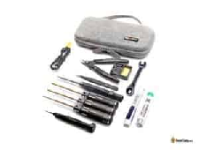 | 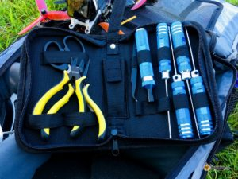 | 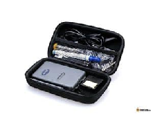 |
| Додаткові паяльні інструменти. Відмінна якість інструменту. Чудовий ключ для пропелерів. | Чудова ціна за 20 доларів США. Інструменти гідної якості. | Широкий вибір інструментів. Мультиметр в комплекті. Трохи дорожче. |
| Знайдіть цей продукт тут: [**NBD**](https://oscarliang.com/product-90hb)**[GetFPV](https://oscarliang.com/product-b0z3)** | Знайдіть цей продукт тут: [**RDQ**](https://oscarliang.com/product-ijh5) | Знайдіть цей продукт тут: [**Flywoo**](https://oscarliang.com/product-1v9k) |

Для більшості пілотів буде важко знайти щось краще за RaceDayQuads y співвідношенні ціна-якість. Це найдешевший і дуже універсальний набір з великим вибором інструментів.

   
З іншого боку, NewBeeDrone пропонує набір із повним комплектом для паяння, i можна буде полагодити дрон прямо y полі. Ці два набори, безумовно, найбільше пристосовані до потреб серйозного FPV-гонщика або пілота фрістайлу, і я б дуже рекомендував саме ці. Цього разу важко визначитись з найкращим варіантом, бо це залежить від того, скільки ви хочете витратити та які можливості вам потрібні.

---

## 

## **Основні інструменти** {#основні-інструменти}

Це рекомендовані та обов’язкові інструменти для створення та ремонту FPV-дрона.

### **Інструменти для паяння** {#інструменти-для-паяння}

Для створення FPV-дрона, а також для можливого ремонту вам знадобиться паяльник. [Як вибрати хороший паяльник і паяти дроти, я розповів в цьому пості](https://oscarliang.com/soldering-iron-buyers-guide/), але якщо ви не хочете читати весь текст, ось мої рекомендації щодо інструментів.

| Паяльник (Sequre SI012) | Припій | Флюс  |
| ----- | ----- | ----- |
| 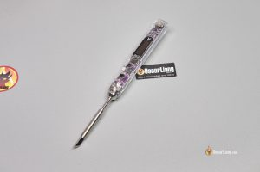 | 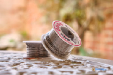 | 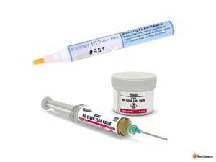 |
| Компактний і портативний. Живлення від 12-25 В або USB PD3.0 Дивіться [мій огляд](https://oscarliang.com/hglrc-rc2-soldering-iron-sequre-si012/) | Це один з найкращих припоїв, які я коли-небудь використовував. | Полегшує паяння. Покращує якість пайки. |
| Знайдіть цей продукт тут:  [https://s.click.aliexpress.com/e/\_DEMdEs1](https://s.click.aliexpress.com/e/_DEMdEs1)[https://amzn.to/3WW9yya](https://amzn.to/3WW9yya) | Знайдіть цей продукт тут:   **[Kester 63/37](https://amzn.to/3Y9QxrO)[MG Chemical 63/37](https://amzn.to/3h2x5XR)** | Знайдіть цей продукт тут: [**Kester Flux Pen**](https://amzn.to/2tLWZbT)**[Шприц MG Chemical Flux](https://amzn.to/2zo0WVC)** |

Це корисне доповнення для паяння.

| Тримач “третя рука” | Очисник жала паяльника | Клейка маса для фіксації  |
| :---: | :---: | :---: |
| 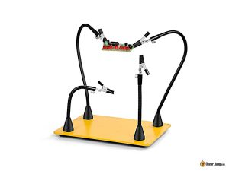 | 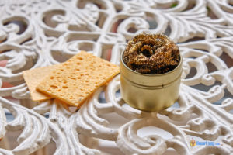 | 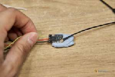 |
| Для утримання компонентів на місці під час пайки. | Очисник жала паяльника діє ефективніше, ніж вологі губки. | Маса для фіксації, якa також називається Blu Tack[^1], можна використовувати для швидкої фіксації невеликих проводів і компонентів. |
| Знайдіть цей продукт тут: [**Amazon**](https://amzn.to/3XIgwFM)**[AliExpress](https://s.click.aliexpress.com/e/_DDyb4jJ)[Найдешевше, що варто мати (Amz)](https://amzn.to/3vkw3Ol)** | Знайдіть цей продукт тут: [**Amazon**](https://amzn.to/3IdQdld)**[AliExpress](https://s.click.aliexpress.com/e/_DBputF7)** | Знайдіть цей продукт тут: [**Amazon**](https://amzn.to/3xexEqJ) |

### **Набір шестигранних викруток** {#набір-шестигранних-викруток}

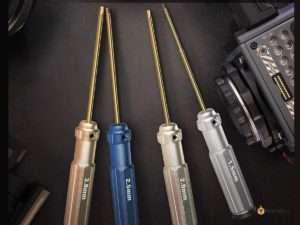

Для побудови FPV-дрона зазвичай використовуються шестигранні гвинти, тому надзвичайно важливо придбати набір шестигранних викруток. Найважливіші розміри, які треба мати:

* 1,5 мм

* 2,0 мм

* 2,5 мм

Або шукайте метричні набори розмірів 1,3–3 мм.

Ось кілька хороших варіантів:

* **AliExpress (доступно): [https://s.click.aliexpress.com/e/\_DFZWg9T](https://s.click.aliexpress.com/e/_DFZWg9T)**

* **Neewer Titanium (досить хороша якість) – [http://amzn.to/2yE1l6c](http://amzn.to/2yE1l6c)**

* **Wiha Hex Driver Set (хороша якість) – [http://amzn.to/2rKsYdo](http://amzn.to/2rKsYdo)**

### **Набір різних викруток** {#набір-різних-викруток}

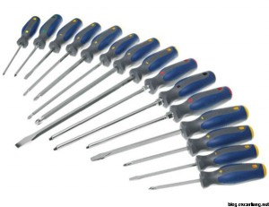

Для гвинтів, які зазвичай зустрічаються на радіокерованих літаках і дронах, можуть знадобитись плоскі і хрестоподібні викрутки. Деякі з цих наборів на AliExpress мають ще й шестиграннi викрутки і можна заощадить гроші.

* **AliExpress (Доступно): [https://s.click.aliexpress.com/e/\_DnSRCq9](https://s.click.aliexpress.com/e/_DnSRCq9)**

* **StarTech 7 штук (хороша якість): [http://amzn.to/2xCpGuw](http://amzn.to/2xCpGuw)**

### **Інструменти для пропелерних гайок** {#інструменти-для-пропелерних-гайок}

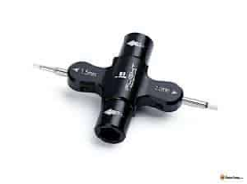

Для зняття та закріплення гайок пропелера потрібен спеціальний «ключ для пропелерів». Ви можете придбати звичайний шестигранний торцевий ключ на 8 мм, але я б рекомендував придбати інструмент, розроблений спеціально для FPV, яким простіше користуватися. Є багато варіантів:

* Деякі мають однонаправлені вальниці *\[кальк. рос.: «підшипники»\]*, які дозволяють йому обертатися в одному напрямку – один бік для зняття гайок, а інший – для кріплення. Це дозволяє закручувати/відкручувати гайку, не знімаючи інструмент з неї, що є більш ефективним.

* Деякі інструменти також мають шестигранні насадки *\[біти\]* на 1,5 мм, 2,0 мм або 2,5 мм, що теж корисно мати

Купити ці продукти тут:

* **RDQ Варіант №1:[https://oscarliang.com/product-ctsv](https://oscarliang.com/product-ctsv)**

* **RDQ Варіант №2:[https://oscarliang.com/product-5gtt](https://oscarliang.com/product-5gtt)**

* **RDQ Варіант №3:[https://oscarliang.com/product-vqag](https://oscarliang.com/product-vqag)**

* **GetFPV Варіант №1:[https://oscarliang.com/product-h799](https://oscarliang.com/product-h799)**

* **GetFPV Варіант №2:[https://oscarliang.com/product-8d2a](https://oscarliang.com/product-8d2a)**

* **GetFPV Варіант №3:[https://oscarliang.com/product-nl8c](https://oscarliang.com/product-nl8c)**

* **AliExpress:[https://s.click.aliexpress.com/e/\_DEhcJ3T](https://s.click.aliexpress.com/e/_DEhcJ3T)**

* **Amazon:[https://amzn.to/3XQz9Y6](https://amzn.to/3XQz9Y6)**

### 

### **Ножиці** {#ножиці}

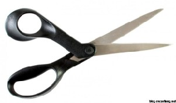

Для різання стрічок і невеликих проводів. Коли я лінуюсь, то використовую їх також і для зачистки проводів перед паянням. Можливо, це не дуже добра звичка, але воно працює.

* **AliExpress:[https://s.click.aliexpress.com/e/\_DB4kugD](https://s.click.aliexpress.com/e/_DB4kugD)**

* **Amazon:[https://amzn.to/3E5DSOP](https://amzn.to/3E5DSOP)**

### **Кусачки для дроту *\[бокоріз\]*** {#кусачки-для-дроту-[бокоріз]}

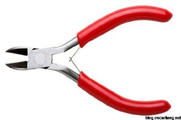

Я користуюсь кусачками для розрізання пластикових стяжок, електричних дротів, з’єднувальних стержнів  тощо, в основному для речей, які занадто жорсткі для ножиць.

* **AliExpress:[https://s.click.aliexpress.com/e/\_DE7vUml](https://s.click.aliexpress.com/e/_DE7vUml)**

* **Amazon:[http://amzn.to/2stQt6Q](http://amzn.to/2stQt6Q)**

### **Плoскогубці** {#плoскогубці}

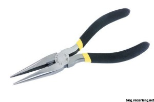

Щоб дістати до важкодоступних місць або для фіксації компонентів під час роботи. Hаприклад, дроти до XT60 або до ЕКШ *\[електронний контролер швидкості\]* під час паяння можуть стати занадто гарячими, щоб утримати їх руками. Плоскогубці також можна використовувати як гайковий ключ.

В основному вам будуть потрібні довгогубці, але різноманітність тут не завадить.

* **AliExpress:[https://s.click.aliexpress.com/e/\_DkkEQid](https://s.click.aliexpress.com/e/_DkkEQid)**

* **Amazon:[http://amzn.to/2rZdzpv](http://amzn.to/2rZdzpv)**

### **Мультиметр** {#мультиметр}

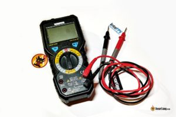

Цифровий мультиметр використовується для полагодження електроніки FPV-дрона, вимірювання напруги, струму, опору та перевірки на коротке замикання. У мене є [ціла інструкція, що пояснює, як використовувати цифровий мультиметр на](https://oscarliang.com/multimeter-fpv/) FPV-дроні.

Мультиметр — це невелика інвестиція для перевірки схем перед підключенням, яка потенційно може заощадити сотні доларів на пошкоджених електронних компонентах. Дешевий мультиметр підійде для тестування на короткі замикання, пошуку обірваних проводів і перевірки напруги батареї.

Деякі хороші варіанти цифрових мультиметрів:

* **BSIDE ADM08A (рекомендований, багатофункціональний і чудовий):**

  * **AliExpress:[https://s.click.aliexpress.com/e/\_DdghQPD](https://s.click.aliexpress.com/e/_DdghQPD)**

  * **Banggood:[http://bit.ly/2rDzPRL](https://bit.ly/2rDzPRL)** 

* **INNOVA 3320 (дешевий і базовий):[https://amzn.to/2QkwGss](https://amzn.to/2QkwGss)** 

### **Запобіжник** {#запобіжник}

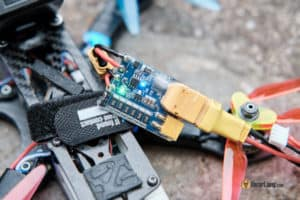

Електронний запобіжник — це тестовий пристрій, який ви під’єднуєте між FPV-дроном і LiPo батареєю. Коли вперше підключаєте батарею, перевірте ним, чи немає в дроні короткого замикання, яке потенційно може пошкодити компоненти.

Я рекомендую  [**Vifly ShortSafer V2 (огляд)**](https://oscarliang.com/vifly-short-saver-2/), це добре працює, і ви можете купити його з полиці:

* **RDQ –[https://oscarliang.com/product-kb4z](https://oscarliang.com/product-kb4z)**

* **AliExpress –[https://s.click.aliexpress.com/e/\_DCMQSwV](https://s.click.aliexpress.com/e/_DCMQSwV)**

* **GetFPV –[https://oscarliang.com/product-58bj](https://oscarliang.com/product-58bj)**

* **Amazon –[https://amzn.to/3em3itG](https://amzn.to/3em3itG)**

### 

### **Тестер напруги LiPo** {#тестер-напруги-lipo}

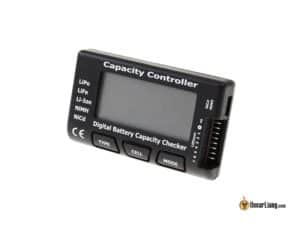

Просто підключивши балансировочний роз’єм батареї LiPo до цифрового тестера, ви дізнаєтесь напругу всієї  батареї, а також напругу кожної комірки батареї. Це важливий інструмент для перевірки батарей LiPo на ходу.

* **AliExpress:[https://s.click.aliexpress.com/e/\_DFDd8MZ](https://s.click.aliexpress.com/e/_DFDd8MZ)**

* **GetFPV:[https://oscarliang.com/product-kejx](https://oscarliang.com/product-kejx)**

* **RDQ:[https://oscarliang.com/product-ky5p](https://oscarliang.com/product-ky5p)**

* **Amazon:[https://amzn.to/3aC3Avn](https://amzn.to/3aC3Avn)**

### **ToolkitRC MC8** {#toolkitrc-mc8}

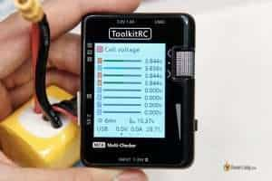

Це не просто тестер батареї, це також тестер сервоприводу та ЕКШ *\[електронний контролер швидкості\]* і може зчитувати різні сигнали пульта керування. Тут в мене більше інформації про ToolkitRC MC8: [https://oscarliang.com/toolkitrc-mc8/](https://oscarliang.com/toolkitrc-mc8/)

* **AliExpress:[https://s.click.aliexpress.com/e/\_DeM8LWH](https://s.click.aliexpress.com/e/_DeM8LWH)**

* **Banggood:[https://oscarliang.com/product-xvyw](https://oscarliang.com/product-xvyw)**

* **RDQ:[https://oscarliang.com/product-u0aj](https://oscarliang.com/product-u0aj)**

* **Amazon:[https://amzn.to/3ya60Mi](https://amzn.to/3ya60Mi)**

* **GetFPV:[https://oscarliang.com/product-qsxn](https://oscarliang.com/product-qsxn)**

### 

### **Безпечні сумки для LiPo**  {#безпечні-сумки-для-lipo}

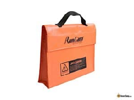

Хоча сумки або пакети для LiPo може і не зупинять займання батареї, вони корисні для тимчасового зберігання батарей і для транспортування

Купити сумки для LiPo акумуляторів:

* Banggood:[https://goo.gl/vbnErt](https://goo.gl/vbnErt)

* Amazon:[https://amzn.to/40c7qDN](https://amzn.to/40c7qDN)

* GetFPV:[https://oscarliang.com/product-czrh](https://oscarliang.com/product-czrh)

* RDQ:[https://oscarliang.com/product-eie5](https://oscarliang.com/product-eie5)

* AliExpress:[https://s.click.aliexpress.com/e/\_DePGYer](https://s.click.aliexpress.com/e/_DePGYer)

### **Ящик для патронів** {#ящик-для-патронів}

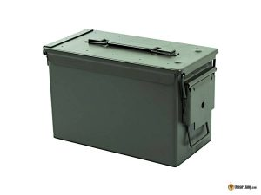

Металеві ящики для боєприпасів чудово підходять для зберігання батарей LiPo під час або після заряджання, бо вони можуть запобігати поширенню вогню ефективніше, ніж звичайні пакети для LiPo акумуляторів.

Купіть металевий ящик для боєприпасів:

* Amazon:[https://amzn.to/3RcTbKI](https://amzn.to/3RcTbKI)

* AliExpress:[https://s.click.aliexpress.com/e/\_DdQY4wP](https://s.click.aliexpress.com/e/_DdQY4wP)

### **Коробка LiPo Bat-Safe** {#коробка-lipo-bat-safe}

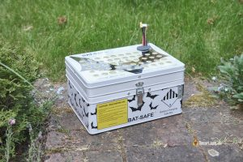

Коробка Bat-Safe забезпечує зручне заряджання батарей та транспортування і водночас надійно запобігає займанню батареї, випускає гарячі гази, фільтрує полум’я та сажу. Це як оновлена ​​версія ящика для боєприпасів. Тут в мене більше інформації про LiPo Bat-Safe: [oscarliang.com/bat-safe-lipo-battery-charging-box/](https://oscarliang.com/bat-safe-lipo-battery-charging-box/)

Ви можете купити Bat-Safe тут:

* AliExpress:[https://s.click.aliexpress.com/e/\_DcRNzFJ](https://s.click.aliexpress.com/e/_DcRNzFJ)

* Amazon:[https://amzn.to/43nl1sA](https://amzn.to/43nl1sA)

* GetFPV:[https://oscarliang.com/product-5njc](https://oscarliang.com/product-5njc)

---

## 

## **Корисні інструменти** {#корисні-інструменти}

Ваші колеги по FPV напевно будуть вражені цими інструментами :)

### **Електрична викрутка** {#електрична-викрутка}

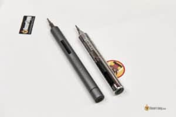

Не обов’язково мати, але дуже кориснo, якщо вам часто доводиться закручувати гвинти довжиною 20 мм, 30 мм. Просто натисніть кнопку, і викрутка зробить все за вас. Вони також продаються з широким вибором насадок і їх не треба буде купувати окремо.

[Я рекомендую ES126](https://oscarliang.com/sequre-es126-screwdriver/), яка досить потужна і якісна. Одного заряду може вистачити на тижні.

### **Сумки для інструментів** {#сумки-для-інструментів}

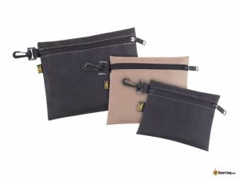

Набагато краще, ніж використання пакетів Ziploc. Може містити дрібні інструменти та компоненти під час транспортування обладнання в полі.

* **Amazon:[https://amzn.to/3SbYHxH](https://amzn.to/3SbYHxH)**

* **AliExpress:[https://s.click.aliexpress.com/e/\_Dm73EPX](https://s.click.aliexpress.com/e/_Dm73EPX)**

### **Настільний блок живлення** {#настільний-блок-живлення}

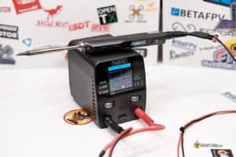

Настільний блок живлення (БЖ) має змінну вихідну напругу, яка може живити багато приладів, включаючи паяльник, може тестувати ваш FPV-дрон, компоненти, зарядний пристрій LiPo тощо.

Мій улюблений на даний момент [ToolkitRC P200](https://oscarliang.com/toolkitrc-p200/). Він універсальний і компактний.

* **AliExpress:[https://s.click.aliexpress.com/e/\_DC5Eobf](https://s.click.aliexpress.com/e/_DC5Eobf)**

* **Amazon:[https://amzn.to/3IjcGgH](https://amzn.to/3IjcGgH)**

* **RDQ:[https://oscarliang.com/product-m72g](https://oscarliang.com/product-m72g)**

* **GetFPV:[https://oscarliang.com/product-ue4m](https://oscarliang.com/product-ue4m)**

### **3D принтер** {#3d-принтер}

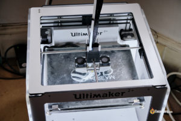

Однією з найбільших переваг 3D-друку для ентузіастів FPV-дронів є можливість швидко та легко замінити зламані деталі або внести зміни в існуючі конструкції.

У мене є інструкція, яка допоможе вам почати роботу з 3D-друком: [https://oscarliang.com/3d-printer/](https://oscarliang.com/3d-printer/)

### **Пінцет** {#пінцет}

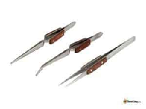

Пінцет використовується щоб тримати і ставити на місце дрібні деталі і проводa. Шукайте довший пінцет, щоб щоб зручніше брати дрібні деталі. Пінцет із хрестоподібним замком (або пінцет зі зворотним ходом) є кращим, тому що він затискається, коли його відпускаєш i тримає деталі, навіть якщо ви випустите пінцет.

* **Amazon:[https://amzn.to/3sMLlK7](https://amzn.to/3sMLlK7)**  
* **AliExpress:[https://s.click.aliexpress.com/e/\_DDnVXSZ](https://s.click.aliexpress.com/e/_DDnVXSZ)**

### 

### **Кліщі для обтиску і зачистки проводів \[стрипер\]** {#кліщі-для-обтиску-і-зачистки-проводів-[стрипер]}

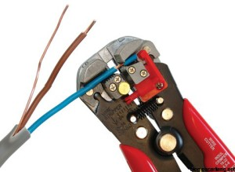

У мене є такi, але я рідко ними користуюся (здебільшого через лінь), здебільшого просто ножицями зачищаю дроти. Але спеціальні інструменти для зняття ізоляції забезпечують стабільніші та точніші результати, якщо ви перфекціоніст. Зазвичай вони охоплюють лише певний діапазон товщини дроту, переконайтеся, що параметри стриперy за товщиною дротів відповідають вашим вимогам.

* **Amazon:[https://amzn.to/3etRuFS](https://amzn.to/3etRuFS)**

* **AliExpress:[https://s.click.aliexpress.com/e/\_DDflBU9](https://s.click.aliexpress.com/e/_DDflBU9)**

### **Термофен** {#термофен}

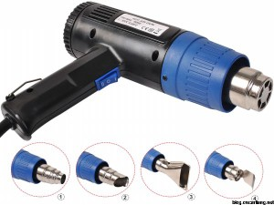

Термофен, в основному використовується для термоусаджувальної трубки. Більшість людей просто використали б простіший варіант \[*прим. пер.: сірники або запальничку* \], і фен, можливо, перебір, але він забезпечує стабільніший нагрів і не залишає слідів від опіків.

* **AliExpress: [https://s.click.aliexpress.com/e/\_DDDaXK1](https://s.click.aliexpress.com/e/_DDDaXK1)**

* **RDQ: [https://oscarliang.com/product-ppzs](https://oscarliang.com/product-ppzs)**

* **Banggood: [https://oscarliang.com/product-boft](https://oscarliang.com/product-boft)**

* **Amazon: [https://amzn.to/3sGDXzK](https://amzn.to/3sGDXzK)**

### **Інструмент для свердління** {#інструмент-для-свердління}

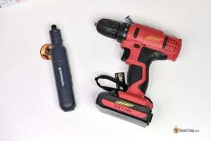

Дрелі можна використовувати для модифікації навіть найтвердіших матеріалів. Їх можна використовувати для формування каркаса або компонентів, а також для створення нових отворів для гвинтів чи інших механізмів.

Більшість рам і компонентів, придбаних у авторитетних дилерів, повинні правильно підходити з самого початку. Але інколи може знадобитися внести невеликі зміни, щоб усе ідеально підійшло. Для роботи з матеріалами, які важко модифікувати, як-от вуглецеве волокно та алюміній, добре мати міні-дрель або дрeль.

Набір міні-дрелів Dremel — це високоякісні фірмові інструменти, які працюють від акумулятора.

* **Amazon:[https://amzn.to/3If4cHd](https://amzn.to/3If4cHd)**

* **AliExpress:[https://s.click.aliexpress.com/e/\_DcJgU9b](https://s.click.aliexpress.com/e/_DcJgU9b)**

### **Набір надфілів** {#набір-надфілів}

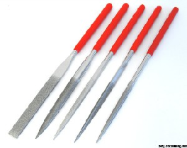

Вам знадобляться надфілі, щоб запилювати чи підчищати, наприклад, [деталі рами з вуглецевого волокна](https://oscarliang.com/prepare-carbon-fibre-frames/), i щоб полірувати.

* **Amazon –[https://amzn.to/3vlJZaV](https://amzn.to/3vlJZaV)**

* **AliExpress –[https://s.click.aliexpress.com/e/\_DC3VA7R](https://s.click.aliexpress.com/e/_DC3VA7R)**

### **Цифровий штангенциркуль** {#цифровий-штангенциркуль}

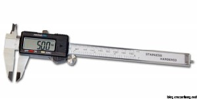

Корисно для точних вимірювань до 0,1 мм.

* **AliExpress:[https://s.click.aliexpress.com/e/\_DmfP31X](https://s.click.aliexpress.com/e/_DmfP31X)**

  * **Banggood:[https://oscarliang.com/product-qeqb](https://oscarliang.com/product-qeqb)**

  * **Amazon:[https://amzn.to/3njPOCW](https://amzn.to/3njPOCW)**

### **Цифрові ваги** {#цифрові-ваги}

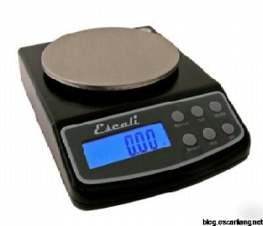

Кожен грам має значення для радіокерованих моделей, тому важливо мати точний інструмент для зважування FPV-дрона та його компонентів. Загалом точність 1 г є достатньою, але 0,1 г ще краще. Переконайтеся, що максимальна допустима вага перевищує 1 кг. Якщо ви плануєте створювати більші моделі, можливо ви захочете вибрати модель з навіть більшим лімітом ваги.

* **AliExpress:[https://s.click.aliexpress.com/e/\_Dn0o6kv](https://s.click.aliexpress.com/e/_Dn0o6kv)**

* **Amazon:[https://amzn.to/32HZbmj](https://amzn.to/32HZbmj)**

### **Вимірювальні кліщі** {#вимірювальні-кліщі}

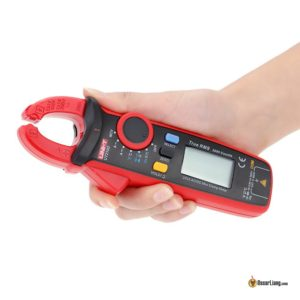

Струмовимірювальні кліщі дозволяють миттєво вимірювати силу струму, затиснувши дрот, без необхідності розбирати ланцюг для проведення вимірювань. Вони здатні вимірювати більший струм, ніж мультиметр, але точність може бути нижчою, і вони досить дорогі.

* **AliExpress:[https://s.click.aliexpress.com/e/\_DBbn3RT](https://s.click.aliexpress.com/e/_DBbn3RT)**

* **Banggood:[https://oscarliang.com/product-tsjy](https://oscarliang.com/product-tsjy)**

* **Amazon:[https://amzn.to/3xlzBBB](https://amzn.to/3xlzBBB)**

### **Ватт-метр** {#ватт-метр}

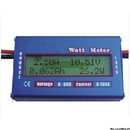

Ваттметр (або вимірювач потужності) може вимірювати споживаний струм і енергоспоживання. Це корисно для перевірки двигуна або навіть для вимірювання потужності цілого FPV-дрона. Важливо придбати один з роз’ємами XT60 або відкритими проводами, щоб ви могли спаяти свій власний. Номінальна напруга до 60 В і 200 А була б бажаною для використання FPV-дронів.

* **AliExpress:[https://s.click.aliexpress.com/e/\_DmpskRH](https://s.click.aliexpress.com/e/_DmpskRH)**

* **Amazon:[https://amzn.to/3hruqg7](https://amzn.to/3hruqg7)**

### **Витяжка диму** {#витяжка-диму}

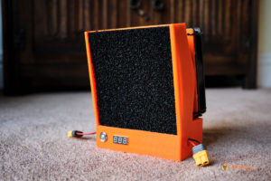

Пари припою дуже шкідливі для легенів. У деяких людей може статися надмірна чутливість до парів флюсу, особливо від старого флюсу каніфолі, який використовується в порошковому припої, і можуть виникнути проблеми з диханням.

* **Banggood:[http://bit.ly/2UnhQOo](http://bit.ly/2UnhQOo)**

* **AliExpress:[https://s.click.aliexpress.com/e/\_DliNOc1](https://s.click.aliexpress.com/e/_DliNOc1)**

* **Amazon:[https://amzn.to/2SNgZFi](https://amzn.to/2SNgZFi)**

### **Настільний вентилятор** {#настільний-вентилятор}

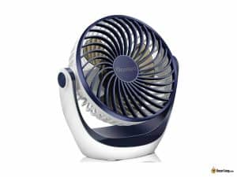

Чудово підходить для охолодження, коли ви під’єднуєте відеопередавач (VTX) на столі, також може одночасно використовуватися як витяжка диму від пайки (відсмоктує дим).

* **AliExpress:[https://s.click.aliexpress.com/e/\_DdE7TDB](https://s.click.aliexpress.com/e/_DdE7TDB)**

* **Amazon:[https://amzn.to/3xAWZfJ](https://amzn.to/3xAWZfJ)**

### 

### **Вимірювач потужності радіосигналу** {#вимірювач-потужності-радіосигналу}

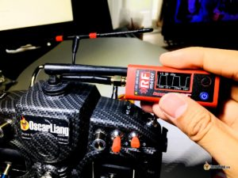

Для тестування та вимірювання вихідної потужності радіо/відео передавача. [Вимірювач потужності ImmersionRC V2](https://oscarliang.com/immersionrc-rf-powermeter-v2/) це компактний і доступний варіант, хоча точність не є гарантією, це краще, ніж нічого.

* **GetFPV:[https://oscarliang.com/product-fk5d](https://oscarliang.com/product-fk5d)**

* **AliExpress:[https://s.click.aliexpress.com/e/\_DdfsEBP](https://s.click.aliexpress.com/e/_DdfsEBP)**

### **Адаптер FTDI** {#адаптер-ftdi}

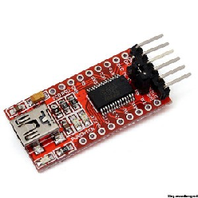

Адаптер FTDI, він же послідовний перетворювач, може бути корисним для [програмування ЕКШ](https://oscarliang.com/blheli-blue-series-esc-oneshot125-damping-light/), наекранного меню, пульта керування *\[«польотнік»\]*, [налаштування GPS](https://oscarliang.com/gps-settings-u-center/) тощо. [У разі пошкодження порту USB на ПК](https://oscarliang.com/connect-fc-broken-usb/) , можна використовувати Адаптер FTDI для підключення пульта керування до комп’ютера через один із UART.

* **AliExpress:[https://s.click.aliexpress.com/e/\_Dl7MLeF](https://s.click.aliexpress.com/e/_Dl7MLeF)**

* **Amazon:[https://amzn.to/3XJjRVk](https://amzn.to/3XJjRVk)**

### **FPV-Рюкзак**  {#fpv-рюкзак}

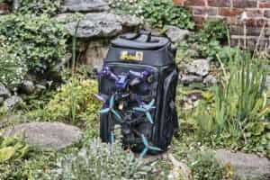

FPV-рюкзаки надзвичайно корисні, оскільки вони розроблені спеціально для зберігання типового FPV-спорядження. Звичайно, ви можете використовувати будь-який звичайний рюкзак, але він не буде настільки ефективним і зручним у використанні для FPV-дронів. І зазвичай у них немає необхідної підкладки ззовні, щоб захистити ваше спорядження, якщо воно впаде.

* **GetFPV:[https://oscarliang.com/product-k3oa](https://oscarliang.com/product-k3oa)**

* **AliExpress:[https://s.click.aliexpress.com/e/\_DB6BRJn](https://s.click.aliexpress.com/e/_DB6BRJn)**

* **Amazon:[https://amzn.to/2YACEc8](https://amzn.to/2YACEc8)**

* **RDQ:[https://oscarliang.com/product-88xf](https://oscarliang.com/product-88xf)**

### **Тканина з мікрофібри** {#тканина-з-мікрофібри}

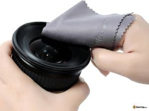

Щоб не подряпати скло, очищайте об’єктиви камери та екрани окулярів спеціальною серветкою з мікрофібри\!

* Amazon:[https://amzn.to/3mXeHs4](https://amzn.to/3mXeHs4)

* AliExpress:[https://s.click.aliexpress.com/e/\_DnlN1zT](https://s.click.aliexpress.com/e/_DnlN1zT)

---

## **Інструменти для FPV літаків** {#інструменти-для-fpv-літаків}

### **Різак / універсальний ніж** {#різак-/-універсальний-ніж}

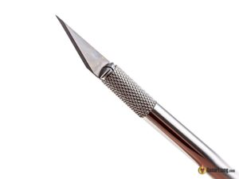

Різак відмінно підходить для різання та видалення піни, скотчу та термоусадки. Канцелярські ножі теж підійдуть, але вони, як правило, менш точні та менш гострі.

* **Ніж для хобі:[Amazon](https://amzn.to/2zPkWlW) |[AliExpress](https://s.click.aliexpress.com/e/_DEDtZvf)**

* **Різак коробок:[Amazon](https://amzn.to/3RGUn9y) |[AliExpress](https://s.click.aliexpress.com/e/_DcuTqYv)**

### **Булавки з круглою головкою** {#булавки-з-круглою-головкою}

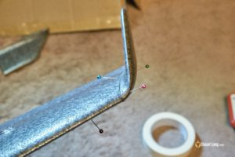

Щоб зафіксувати разом пінопластові/вуглецевi деталi, якщо ви використовуєте клей, який довго висихає.

* **AliExpress:[https://s.click.aliexpress.com/e/\_DmkTcTr](https://s.click.aliexpress.com/e/_DmkTcTr)**

* **Amazon 250 штук:[https://amzn.to/2QKMlPC](https://amzn.to/2QKMlPC)**

### 

### **Наждачний папір** {#наждачний-папір}

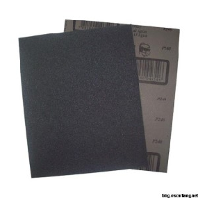

Вам треба буде прошкурити пластикові поверхні та лонжерони з вуглецевого волокна перед нанесенням на них клею, це покращить прилипання.

Я б рекомендував зернистість від 40 до 240\. Насправді, це залежить від ваших уподобань, але глядіть, щоб не кришився пінопласт. Я особисто використовую зернистість від 80 до 120, бо як на мене, все що менше –розкришить пінопласт, а все що більше 120–вимагає забагато часу, щоб досягти бажаного результату.

* **AliExpress:[https://s.click.aliexpress.com/e/\_DdRZhtf](https://s.click.aliexpress.com/e/_DdRZhtf)**

* **Amazon 120 грит:[https://amzn.to/2L7ho2S](https://amzn.to/2L7ho2S)**

* **Banggood 240 грит:[https://oscarliang.com/product-gmrr](https://oscarliang.com/product-gmrr)**

### **Сервотестер** {#сервотестер}

Kорисно для тестування сервоприводів і їх центрування під час налаштування елевонів. Також корисно для усунення несправностей і перевірки ЕКШ і напрямку обертання мотору. Також можна користуватись для перевірки тяги мотору.

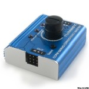

* **Amazon:[https://amzn.to/3HE4Fmb](https://amzn.to/3HE4Fmb)**

* **AliExpress:[https://s.click.aliexpress.com/e/\_DCQGVRj](https://s.click.aliexpress.com/e/_DCQGVRj)**

* **Banggood:[https://oscarliang.com/product-xz4q](https://oscarliang.com/product-xz4q)**

### 

### **Вага для балансування центру ваги** {#вага-для-балансування-центру-ваги}

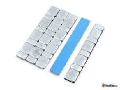

Це вагові блоки, які ви можете розмістити на своєму літаку, щоб збалансувати центр ваги. Це непогана ідея, якщо ви хочете щось акуратне, але зазвичай я використовую лише монети. Насправді монети виходять дешевше.

* **Amazon:[https://amzn.to/3GDHCYd](https://amzn.to/3GDHCYd)**

* AliExpress:[https://s.click.aliexpress.com/e/\_DcAYTcV](https://s.click.aliexpress.com/e/_DcAYTcV)

### **Інструмент для обтискання кабелю сервоприводу (кремпер)** {#інструмент-для-обтискання-кабелю-сервоприводу-(кремпер)}

Це використовується для обтискання проводів на наконечниках *\[клемах\]*. Вам не потрібно купувати його відразу, якщо ви тільки починаєте займатися цим хобі, але з часом настане день, коли він вам знадобиться і стане в нагоді.

Роз’єми для сервоприводу мають діаметр Dupont 2,54 мм, балансні кабелі – JST-XH 2,54 мм.

* **Amazon:[https://amzn.to/3IfYYuX](https://amzn.to/3IfYYuX)**

* **AliExpress:[https://s.click.aliexpress.com/e/\_DDLM5cl](https://s.click.aliexpress.com/e/_DDLM5cl)**

### **Пакувальна стрічка Scotch Heavy Duty** {#пакувальна-стрічка-scotch-heavy-duty}

Обов’язкова стрічка для загальних цілей – покриття, зміцнення петель, ламінування… Звичайний скотч підійде, але я вважаю, що пакувальні стрічки хорошої якості зазвичай товщі та міцніші.

* **AliExpress:[https://s.click.aliexpress.com/e/\_DcuetYV](https://s.click.aliexpress.com/e/_DcuetYV)**

* **Amazon:[https://amzn.to/2PqIiDy](https://amzn.to/2PqIiDy)**

### **Кольорова пакувальна стрічка** {#кольорова-пакувальна-стрічка}

Кольорові пакувальні стрічки, які іноді називають стрічками для крил, чудово підходять для прикраси ваших крил і додавання їм кольорів. Часто використовується для покриття та ламінування.

Ті, які я використовую, тонші, ніж міцна пакувальна стрічка, і не такі міцні. Але це не додає помітної ваги літаку, що мені подобається\!

* **AliExpress:[https://s.click.aliexpress.com/e/\_DFmdbLL](https://s.click.aliexpress.com/e/_DFmdbLL)**

* **Amazon:[https://amzn.to/2zOKlw2](https://amzn.to/2zOKlw2)**

* **Banggood:[https://oscarliang.com/product-xcar](https://oscarliang.com/product-xcar)**

### 

### **Волокниста стрічка** {#волокниста-стрічка}

Зміцнена пакувальна стрічка – надзвичайно міцна та липка\! Часто використовується для захисту передніх країв і зміцнення слабких пінопластових частин і з'єднань. Її також можна використовувати для закриття ваших сервоприводів у крилі.

* **AliExpress:[https://s.click.aliexpress.com/e/\_DduyszT](https://s.click.aliexpress.com/e/_DduyszT)**

* **Amazon:[https://amzn.to/40t9iYO](https://amzn.to/40t9iYO)**

* **Banggood:[https://oscarliang.com/product-w9px](https://oscarliang.com/product-w9px)**

### 

### **Cтійка до погодних умов вінілова стрічка** {#cтійка-до-погодних-умов-вінілова-стрічка}

Схожа на ізоляційну стрічку, але вона менш еластична, має блискуче покриття та тримається набагато надійніше. Вона також удвічі товща за пакувальний скотч. Вона добре прилягає до нерівностей, чудово підходить для нанесення на контрольні поверхні, наприклад, на сервоприводи, це надає покриттю гладкості. 

### **Армована клейка стрічка** {#армована-клейка-стрічка}

Міцніша за пакувальну і набагато краще працює на нерівних поверхнях, але вона також набагато важча; її легше знімати і замінювати. Іншим її недоліком є ​​те, що вона, як правило, зморщується під сонцем. 3азвичай це вибір між цією або зовнішньою вініловою стрічкою

---

## **Стрічки** {#стрічки}

Ймовірно, ви можете виконати 90% робіт, використовуючи 2-3 типи клейких стрічок, але корисно мати різноманітні для різних застосувань.

### **Ізолента** {#ізолента}

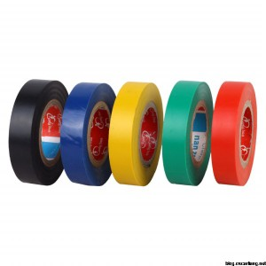

Ізолента є обов’язковою при роботі з електроприладами. Вона чудово підходить для ізоляції та приєднання деталей у FPV-дроні. Я також використовую її для маскування деталей, коли я паяю.

Я використовую лише 3M Super 35, це еластичний вініл і досить гнучкий, чудово підходить для обмотування проводів мотору або ЕКШ на дроні.

* **Amazon:[https://amzn.to/3ngQNn5](https://amzn.to/3ngQNn5)**

* **AliExpress:[https://s.click.aliexpress.com/e/\_DkKp4v3](https://s.click.aliexpress.com/e/_DkKp4v3)**

### 

### **Двосторонній скотч** {#двосторонній-скотч}

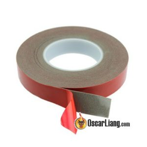

Двосторонній скотч призначений для приклеювання компонентів усередині конструкції. Якщо вам потрібні справді клейкий та міцний, придбайте марку 3M Scotch, “це вогінь\!” :) Чудово підходить для того, щоб склеїти дві окремі деталі разом, наприклад, приймач до рами. Затвердіння займає кілька годин, i після того, як воно з’єднано надійно, його важко роз’єднати.

* **Тонкий, менш міцний двосторонній скотч, який легко знімається:[https://amzn.to/3sH4QDP](https://amzn.to/3sH4QDP)**

* **Міцний двосторонній поролоновий скотч, надзвичайно липкий і його важко видалити:[https://amzn.to/3wY5QIb](https://amzn.to/3wY5QIb)**

* **AliExpress:[https://s.click.aliexpress.com/e/\_Dl66rwp](https://s.click.aliexpress.com/e/_Dl66rwp)**

### 

### **Каптонова стрічка (термостійкий скотч)** {#каптонова-стрічка-(термостійкий-скотч)}

Каптонова стрічка \- це в основному нерозтяжна напівпрозора ізоляційна термостійка стрічка. Вона може витримувати високу температуру та не плавиться, тому чудово підходить для покриття електронної плати під час пайки та обгортання компонентів, якщо у вас немає прозорої термоусадки потрібного розміру.

* **Amazon:[https://amzn.to/3sGtu7u](https://amzn.to/3sGtu7u)**

* **AliExpress:[https://s.click.aliexpress.com/e/\_DBJKq5L](https://s.click.aliexpress.com/e/_DBJKq5L)**

### **Малярний скотч** {#малярний-скотч}

По суті, це просто липкий папір :) Ви можете відірвати його від котушки пальцями, це дуже зручно, якщо ви просто хочете тимчасово утримати щось на місці під час монтажу. Його можна легко зняти, не залишаючи безладу. На хьому можна писати, бо це просто папір.

* **AliExpress:[https://s.click.aliexpress.com/e/\_DFg0fUH](https://s.click.aliexpress.com/e/_DFg0fUH)**

* **Amazon:[https://amzn.to/3Y5InRn](https://amzn.to/3Y5InRn)**

### **Стрічка на тканинній основі** {#стрічка-на-тканинній-основі}

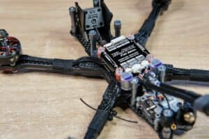

Вона також відома як текстильний скотч або Гаффер тейп, є гнучкою, як тканина, чудово підходить для обмотування речей. Вона липка, але її також легко відклеювати. Я використовую її для обмотування проводів двигуна навколо променів, також для певного захисту проводів від ударів.

* **Amazon:[https://amzn.to/3DgTb70](https://amzn.to/3DgTb70)**

* **AliExpress:[https://s.click.aliexpress.com/e/\_DDCrdzB](https://s.click.aliexpress.com/e/_DDCrdzB)**

---

## **Клей** {#клей}

Підійдуть будь-які клеї, які не руйнують пінопласт\!

### **Гарячий клей** {#гарячий-клей}

Гарячий клей –мабуть, найпопулярніший варіант для виготовлення/ремонту пінопластових деталей, бо він розплавляється у рідину, як хімічний клей, але водночас створює надзвичайно міцний фізичний зв’язок.

Міцність також є його мінусом. З’єднання настільки міцне, що його практично неможливо відірвати, не зруйнувавши пінопласт. Може краще коли модель просто розпадається в результаті аварії, а не знищується? Це особистий вибір кожного.

Інша властивість полягає в тому, що він дуже швидко схоплюється, коли охолоджується. Але це також недолік, бо у вас є лише короткий час, щоб правильно прикласти деталі. Це погіршується в холодну погоду.

* **AliExpress:[https://s.click.aliexpress.com/e/\_Dl5EPWv](https://s.click.aliexpress.com/e/_Dl5EPWv)**

* **Amazon:[https://amzn.to/3JF7dmv](https://amzn.to/3JF7dmv)**

### 

### **Клей Е6000** {#клей-е6000}

Наразі мій улюблений клей, я використовую його як заміну гарячого клею та циноакрилатного клею для створення/фіксації крил. У мене є ціла стаття [чому він мені так подобається](https://oscarliang.com/e6000-glue/).

* **AliExpress:[https://s.click.aliexpress.com/e/\_DFZjrEZ](https://s.click.aliexpress.com/e/_DFZjrEZ)**

* **Amazon:[https://amzn.to/2E9UJlm](https://amzn.to/2E9UJlm)**

### 

### **UHU POR клей** {#uhu-por-клей}

Клей UHU POR ідеально підходить для склеювання твердого пінопласту, такого як пінополістирол. Він гнучкий, стійкий до старіння і водонепроникний. Схоплюється за 10-20 хв, після висихання стає прозорим.

* **Amazon:[https://amzn.to/2PseNRR](https://amzn.to/2PseNRR)**

### **Прозорий клей Gorilla** {#прозорий-клей-gorilla}

Дуже популярний варіант для будівництва радіокерованих моделей. Міцний матеріал для широкого діапазону матеріалів, але особисто я не великий прихильник клею Gorilla, тому що попадання його вам на руки може бути гірше, ніж епоксидна смола\!

* **Amazon:[https://amzn.to/3YpVVH3](https://amzn.to/3YpVVH3)**

---

## **Матеріали** {#матеріали}

### **Стяжки** {#стяжки}

Корисні розміри (ширина): 2 мм і 3 мм

* **AliExpress:[https://s.click.aliexpress.com/e/\_DmuLEfJ](https://s.click.aliexpress.com/e/_DmuLEfJ)**

* **Amazon:[https://amzn.to/3EjycRa](https://amzn.to/3EjycRa)**

### 

### **Електричні дроти в силіконовій ізоляції** {#електричні-дроти-в-силіконовій-ізоляції}

Придбайте електричні дроти різного калібру. Зазвичай використовуються розміри для 5-ти дюймових FPV-дронів: 12AWG, 14AWG для живлення, 20AWG для двигунів і 28AWG для сигналів. Вимоги до розміру залежать від сили струму, що проходить через дріт, перевірте в [довіднику про електричні дроти та з’єднувачі](https://oscarliang.com/wires-connectors/) для більш детальної інформації.

* Провід 12AWG:[https://amzn.to/3xonqUS](https://amzn.to/3xonqUS)

* Провід 14AWG:[https://amzn.to/3gwMbrO](https://amzn.to/3gwMbrO)

* Провід 20AWG:[https://amzn.to/3sN3mYL](https://amzn.to/3sN3mYL)

* Провід 28AWG:[https://amzn.to/3tHXFfP](https://amzn.to/3tHXFfP)

* AliExpress:[https://s.click.aliexpress.com/e/\_DdhWWvT](https://s.click.aliexpress.com/e/_DdhWWvT)

### **Термозбіжні трубки** {#термозбіжні-трубки}

Візьміть різні розміри для різних застосувань, напр. 2 мм, 3 мм для проводів двигуна та піґтейл XT60, 20 мм, 25 мм для ЕКШ/ приймачатощо.

| Для проводів – червоно-чорний асортимент 198 шт | Для ЕКШ/приймача – Прозорі 25mm коефіцієнт усадки 2:1 |
| :---: | :---: |
|  |  |
| [http://amzn.to/2iYZVQN](http://amzn.to/2iYZVQN) | [http://amzn.to/2ADcPbw](http://amzn.to/2ADcPbw) |

### 

### **Батарейні подушки** {#батарейні-подушки}

Хороша батарейна подушка запобігає ковзанню батареї та запобігає її пошкодженню головками гвинтів на рамі. Ось кілька чудових липких подушечок:

* **AliExpress:[https://s.click.aliexpress.com/e/\_DEPcbXP](https://s.click.aliexpress.com/e/_DEPcbXP)**

* **Flywoo:[https://oscarliang.com/product-pryp](https://oscarliang.com/product-pryp)**

**Подушка Ummagrip товщиною 3 мм**

* **Amazon –[https://amzn.to/2QwfxvH](https://amzn.to/2QwfxvH)**

* **RDQ –[http://bit.ly/2Uxli9i](http://bit.ly/2Uxli9i)**

* **GetFPV –[http://bit.ly/2zRLodV](http://bit.ly/2zRLodV)**

**Подушка Ummagrip товщиною 1,5 мм**

* **GetFPV:[https://oscarliang.com/product-uvtw](https://oscarliang.com/product-uvtw)**

* **RDQ:[https://oscarliang.com/product-edj3](https://oscarliang.com/product-edj3)**

### **Ремені батарей** {#ремені-батарей}

Для 5-дюймових або більших дронів хорошим вибором стануть ремені на липучці шириною 20 мм. Зазвичай довжина 200-220 мм для 4S і 240-260 мм для 6S, але в основному це залежить від вашого вибору рами.

* **AliExpress:[https://s.click.aliexpress.com/e/\_DkuWzUh](https://s.click.aliexpress.com/e/_DkuWzUh)**

* **Amazon:[https://amzn.to/3LkgfEW](https://amzn.to/3LkgfEW)**

* **GetFPV:[https://oscarliang.com/product-vnr9](https://oscarliang.com/product-vnr9)**

* **RDQ:[https://oscarliang.com/product-ztse](https://oscarliang.com/product-ztse)**

### 

### **Фіксатор різьблення (локтайт)** {#фіксатор-різьблення-(локтайт)}

[Інформація про фіксатор різьби](https://oscarliang.com/loctite-glue-quadcopter-motor-screws/), в основному це запобігає ослабленню гвинтів через вібрацію.

* **Amazon:[https://amzn.to/2Qrl5aV](https://amzn.to/2Qrl5aV)**

* **AliExpress:[https://s.click.aliexpress.com/e/\_DktkkUh](https://s.click.aliexpress.com/e/_DktkkUh)**

### **Метвироби** {#метвироби}

Вибираючи металеві гвинти та болти, зверніть увагу на те, з якого матеріалу вони виготовлені. Я віддаю перевагу **10–9** або **12–9** коли можливо. Ці цифри стосуються сплаву сталі, яка використовується в гвинтах. Це хороші штуки, в них не так легко зривається різьба і дуже міцні.

Асортимент гвинтів з нержавіючої сталі M3:[https://amzn.to/3tOpPpA](https://amzn.to/3tOpPpA)

Комплект нейлонових метвиробів M3:

AliExpress –[https://s.click.aliexpress.com/e/\_DEvf1gl](https://s.click.aliexpress.com/e/_DEvf1gl)  
Amazon –[https://amzn.to/3xlFMph](https://amzn.to/3xlFMph)

### **Силіконове конформне захисне покриття** {#силіконове-конформне-захисне-покриття}

Завдяки нанесенню цього покриття на вашу електроніку, вона стає водонепроникною\! [Ви можете дізнатися більше в моєму посібнику](https://oscarliang.com/waterproofing-drone-electronics/).

* **Amazon:[https://amzn.to/3IENse8](https://amzn.to/3IENse8)**

### **Ізопропіловий спирт** {#ізопропіловий-спирт}

Ізопропіловий спирт можна використовувати як знежирювач, розчинник і засіб для чищення. Ним можна почистити залишки пригорілого флюсу припою, а також просто для загального очищення вашої електроніки. Ще ним можна видалять деякі типи клею, а також силіконового конформного покриття.

* **Amazon: [https://amzn.to/419vSG3](https://amzn.to/419vSG3)**

---

#### **Історія редагування** {#історія-редагування}

* Квітень 2015 р. – допис створено

* Жовтень 2015 р. – оновлено зображеннями

* Травень 2017 р. – додано ще 10 елементів

* Квітень 2021 р. – скорочено URL-адресу сторінки, переглянуто та реорганізовано елементи, оновлено посилання на продукти

* Червень 2022 р. – додано трохи більше деталей про RDQ набір інструментів для дронів, додано деякі параметри інструментів

* Лютий 2023 р. – оновлено список, посилання на продукти та поєднано з інструментами для FPV літаків

# КОМЕНТАРІ {#коментарі}

**DANIEL**

5 жовтня 2017 року \- 8:30 год

A щодо моторного масла? Чи корисно це для збільшення терміну служби двигунів?

[ВІДПОВІДЬ](https://oscarliang.com/fpv-tools/#comment-15567)

ОСКАР

5 жовтня 2017 р. \- 15:13

Hе змащуйтe безщіточні мотори. Bальниця *\[підшипник\]* фактично загерметизований ззовні, тому масло лише збиратиме пил і погіршить ситуацію в довгостроковій перспективі.

**DAVE PIERCE**

30 квітня 2017 року \- 00:53 год

/…/  
Моя єдина проблема полягає в тому, що ви вибрали бокоріз для різання електричної проводки. Після 40+ років розробки, впровадження та виробничого монтажу я можу з упевненістю сказати, що бокоріз не є інструментом для різання дроту.  
Бокоріз створює затиснутий кінець дроту, що може спричинити додаткові проблеми, коли справа доходить до закріплення та лудіння припоєм.  
Кожна виробнича лінія, з якою я коли-небудь стикався, вважала цю практику відьмівською та неприйнятною.  
Cлід використовувати тип секаторa (подібний до дії ножиць), як т-подібний стриппер.  
Я щиро сподіваюся, що це допоможе вам і вашим вірним підписникам, таким як я.

[ВІДПОВІДЬ](https://oscarliang.com/fpv-tools/#comment-14337)

ОСКАР

1 травня 2017 р. \- 16:31

Привіт, Дейв, дякую за коментар :)  
можливо, це не найпрофесійніший вибір для різання дротів, але, безсумнівно, він практичний і швидкий.  
Я роблю це роками як хобі, і це не було для мене проблемою… але ваш коментар цінний для тих, хто шукає альтернативні рішення\!

[ВІДПОВІДЬ](https://oscarliang.com/fpv-tools/#comment-14361)

**ADIUM**

21 серпня 2017 року \- 12:42 год

Я підтримую думку щодо цих стрипперів. Kраще тi, у яких уже вирізані отвори розміром 20-30. Дешевше, простіше і швидше.

І якщо у вас є гроші, щоб витратити, придбайте HOTWEEZERS®. Ці речі фантастичні\!

[ВІДПОВІДЬ](https://oscarliang.com/fpv-tools/#comment-15286)

**Darkhawk**

25 січня 2016 року \- 3:55 ранку

Моя рекомендація: скейтінструмент *\[ключ для скейтборду\]* для пропелерних гайок\! ви будете їх часто закручувати та відкручувати, а інструмент зробить заміну пропелерів набагато легшою та швидшою.

[ВІДПОВІДЬ](https://oscarliang.com/fpv-tools/#comment-9210)

ОСКАР

25 січня 2016 року \- 20:41

велике спасибі за підказку Darkhawk\! дуже подобається ця ідея :)

Нарешті, я був би дуже вдячний, якщо б ви приєдналися до форуму:[http://intoFPV.com](http://intofpv.com/) … Я не хочу пропустити ваш коментар, тому що я переглядаю коментарі у своєму блозі лише раз на тиждень, але відвідую форум щодня\!

[ВІДПОВІДЬ](https://oscarliang.com/fpv-tools/#comment-9248)

**LES E**

26 жовтня 2015 року \- 18:06

Привіт Оскар,

Також спробуйте набір зубних щипців. Дешево на ebay. Вони підходять, наприклад, для того, щоб протягнути останню стяжку під верхньою частиною рами через щуряче гніздо дротів або кінець ремінця на липучці через отвори, які інакше важко протягнути назад через раму.

[ВІДПОВІДЬ](https://oscarliang.com/fpv-tools/#comment-7517)

**SHAY**

25 жовтня 2015 року \- 9:13 ранку

Привіт Оскар, дякую за цю статтю.  
Я б настійно рекомендував мати балансир lipo, наприклад SkyRC lipo pal. Для зарядки і особливо для підготовки їх до зберігання я зазвичай використовую цей засіб для балансування елементів. Це запобігає виходу елементів з рівноваги з часом.

[ВІДПОВІДЬ](https://oscarliang.com/fpv-tools/#comment-7480)

**BILL**

23 квітня 2015 року \- 18:47

Я не бачив жодних обтискних пристроїв для виготовлення сервопроводів нестандартної довжини. Щипці, які рекомендує Lutro0, є найкращими з тих, які я знайшов.

mainframecustom.com/shop/cable-sleeving/lc-ratchet-crimper/

**MARTIN**

23 квітня 2015 року \- 16:39

До теми кусачок. Після того, як я побачив відео збірки V3 від Девіда Віндестеля, мені захотілося мати такі самі чарівні стриппери. Амазон, швидше за все, буде (knipex 12 40 200).

Я відчув себе Гаррі Поттером у магазині чарівних паличок після того, як вперше потримав їх в руках. Це геніально, і я дуже рекомендую їх. Це просто вставити дріт(и\!\! Усі 3, у випадку проводів сервоприводу) і розрізати\! Готово.

(amazon.co.uk/Knipex-12-40-200-Stripping/dp/B0001P0BYY/ref=pd\_sxp\_f\_pt)

[^1]:  Прим перекладача: Барвдел [рекомендує](https://docs.google.com/document/u/0/d/1nbvkYLD-smNyEPKiUSq8TiXsrAdJU_RsiXZCtMSpPp8/edit) використовувати Fun Tac від відомого бренду Loctite, але, очевидно, такий варіант дорожчий.

[image1]: 

[image2]: 

[image3]: 

[image4]: 

[image5]: 

[image6]: 

[image7]: 

[image8]: 

[image9]: 

[image10]: 

[image11]: 

[image12]: 

[image13]: 

[image14]: 

[image15]: 

[image16]: 

[image17]: 

[image18]: 

[image19]: 

[image20]: 

[image21]: 

[image22]: 

[image23]: 

[image24]: 

[image25]: 

[image26]: 

[image27]: 

[image28]: 

[image29]: 

[image30]: 

[image31]: 

[image32]: 

[image33]: 

[image34]: 

[image35]: 

[image36]: 

[image37]: 

[image38]: 

[image39]: 

[image40]: 

[image41]: 

[image42]: 

[image43]: 

[image44]: 

[image45]: 

[image46]: 

[image47]: 

[image48]: 

[image49]: 

[image50]: 

[image51]: 

[image52]: 

[image53]: 

[image54]: 

[image55]: 

[image56]: 

[image57]: 

[image58]: 

[image59]: 

[image60]: 

[image61]: 

[image62]: 