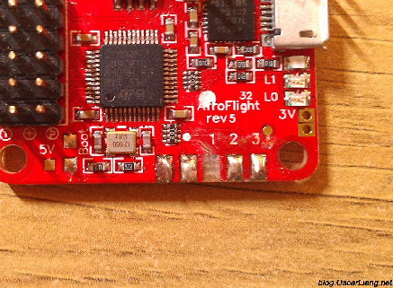
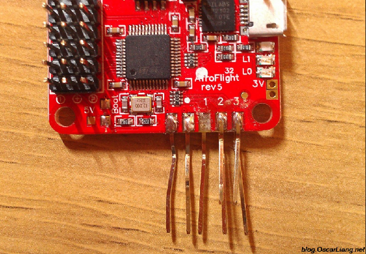
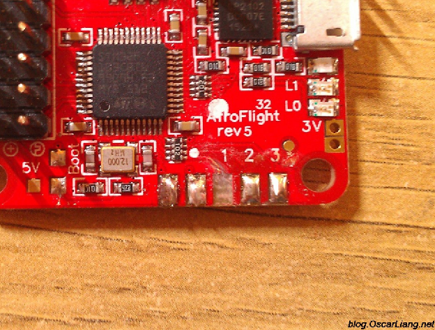
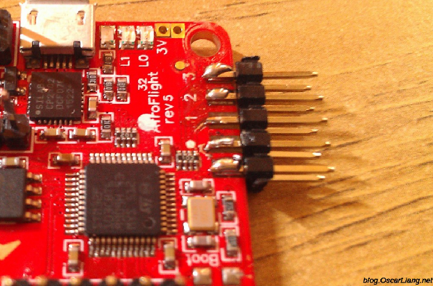

Стисле посилання на цей переклад: [https://bit.ly/LiangRepairSolderPadsFC](https://bit.ly/LiangRepairSolderPadsFC)   

|  | Нижче вичитаний людьми машинний український переклад оригіналу. Для [VictoryDrones](https://www.victory-drones.com/) переклад вичитали: Faina, Max Well. Хочете покращити переклад чи знайшли помилку? — Лишіть коментар (Ctrl+Alt+M або «Меню» \> «Вставка» \> «Коментар»). Ми теж живі люди (як і ви) і робимо помилки. Роботи їх, до речі, також роблять 😉 |
| :---: | :---- |

# Як відремонтувати зірвані контактні майданчики на польотному контролері

23 вересня 2015 року

Хіба це не дратує, коли ви ненароком зриваєте контактний майданчик/мідь з [польотного контролеру](https://oscarliang.com/flight-controller-explained/) (або друкованої плати)? Не бійтеся, можливо, ви зможете це відремонтувати\!

*Деякі посилання на цій сторінці є партнерськими. Я \[автор англомовної версії Оскар Ланг\] отримую комісію (без додаткових витрат для вас), якщо ви робите покупку після натискання одного із цих партнерських посилань. Це допомагає підтримувати безкоштовний контент для спільноти на цьому веб\-сайті. Будь ласка, прочитайте нашу [Політику партнерських посилань](https://oscarliang.com/affiliate-program-policy/) для отримання додаткової інформації.*

Я зірвав контактні майданчики RC1 і Radio 5V з плати свого новенького [Naze32](https://oscarliang.com/naze32-flight-controller-review-should-i-get-it/) коли видаляв [попередньо припаяний](https://oscarliang.com/how-to-remove-header-pins/) штирьовий роз’єм. Через те що я в основному використовую протокол [PPM](https://oscarliang.com/rc-protocols/) *\[фазово-імпульсна модуляція\]*, – a PPM неможливо використовувати без контакту RC1 (наскільки я знаю), – це майже означає, що мені б довелося запустити протокол PWM *\[широтно-імпульсна модуляція (ШІМ)\]* або викинути плату та купити нову. (Бо я використовую UART2 *\[універсальний асинхронний приймач/передавач\]* на контактах RC3 і RC4)

Насправді всі контакти RC дуже важливі для плати Naze, усі вони мають свої функції та на даний момент не є взаємозамінними:

* RC1 – PPM  
* RC3/4 – UART2 (TX/RX)  
* RC5 – світлодіод  
* RC5/6 – SoftSerial 1  
* RC7/8 – SoftSerial 2

# **Як уникнути відривання контактних майданчикiв друкованих плат**

Не нагрівайте контактні майданчики надто сильно і ЗОВСІМ не прикладайте до них сили під час паяння/відпаювання./

# **Відремонтуйте зірвані мідні контактні майданчики**

На щастя, я зміг відремонтувати свій\! Хоча я не знаю, наскільки це буде надійно, принаймні здається, що зараз все працює.

1. Це можна відремонтувати: пошкребіть ножем, доки не побачите доріжку, яка веде до цього контактного майданчика  
2. нанесіть флюс для припою на доріжку та залудіть. Очистіть і видаліть надлишок флюсу  
3. нарешті припаяйте крихітний шматочок лудженого маленького дроту (30 awg або 28 awg), щоб під’єднати лінію відірваного контакта до контакту роз’єму або щось подібне. Я навіть не використовував дріт, я просто просунув контакт гребінки прямо всередину, якомога ближче до залудженої частини доріжки, і спаяв їх разом. (Див. контакти RC1 і 5 В)

**КОМЕНТАРІ**

**TOM W,**

29 вересня 2015 р. \- 12:59 год

Привіт, Оскар  
В мене було відео: контактний майданчик відірвався від модуля наекранного меню, коли я намагався припаяти контакт до нього. 

Можна купити  електропровідний клей, щоб відремонтувати контактний майданчик, за умови, що ви можете визначити, де провід контактував із  
майданчикoм. Дві унції за $1,50 на E-bay.  
[ВІДПОВІДЬ](https://oscarliang.com/repair-ripped-off-solder-pads/#comment-6880)  
**KEN**

12 жовтня 2015 р. \- 4:49 ранку

Дякую, обидва рішення працюють добре.  
[ВІДПОВІДЬ](https://oscarliang.com/repair-ripped-off-solder-pads/#comment-7149)

[image1]: 

[image2]: 

[image3]: 

[image4]: 

[image5]: 