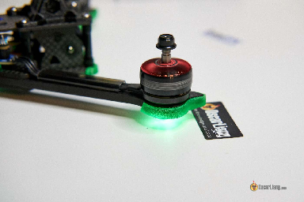
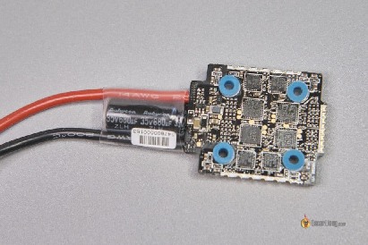

Стисле посилання на цей переклад:  [bit.ly/best-am32-settings](http://bit.ly/best-am32-settings)

|  | Нижче вичитаний людьми машинний український переклад оригіналу. Для [VictoryDrones](https://www.victory-drones.com/) переклад вичитали: Faina. Хочете покращити переклад чи знайшли помилку? — Лишіть коментар (Ctrl+Alt+M або «Меню» \> «Вставка» \> «Коментар»). Ми теж живі люди (як і ви) і робим помилки. Роботи їх, до речі, також роблять 😉 |
| :---: | :---- |

# **Як виправити розсинхронізацію регуляторів обертів (ESC) в FPV дронах: поради.** 

23rd February 2024

Коли один з моторів на вашому FPV дроні неочікувано зупиняється, що призводить до його падіння – це може бути спричинено розсинхронізацією регуляторів обертів. У цій статті обговорюються причини і поради щодо виправлення розсинхронізації регуляторів обертів ESC за допомогою налаштувань BLHeli і Betaflight.

*Деякі посилання на цій сторінці є партнерськими. Я \[автор англомовної версії Оскар Ланг\] отримую комісію (без додаткових витрат для вас), якщо ви робите покупку після натискання одного із цих партнерських посилань. Це допомагає підтримувати безкоштовний контент для спільноти на цьому веб\-сайті. Будь ласка, прочитайте нашу [Політику партнерських посилань](https://oscarliang.com/affiliate-program-policy/) для отримання додаткової інформації.*

**ЗМІСТ**

[**Що таке розсинхронізація регулятора обертів (ESC)?	2**](#що-таке-розсинхронізація-регулятора-обертів-\(esc\)?)

[**Причини розсинхронізації регуляторів обертів (ESC)	3**](#причини-розсинхронізації-регуляторів-обертів-\(esc\))

[**Усунення розсинхронізації ESC	4**](#як-виправити-розсинхронізацію-esc)

[**Висновок**	5](#висновок)

## **Що таке розсинхронізація регулятора обертів (ESC)?**  {#що-таке-розсинхронізація-регулятора-обертів-(esc)?}

Не кожен випадок "падіння дрона з неба" є наслідком розсинхронізації регулятора обертів ESC. Наприклад, якщо ваш квадрокоптер падає на землю без обертання, це може бути просто через активацію безаварійнoстi або через втратy живлення. Зазвичай, під час десинхронізації ESC дрон почне обертатися чи крутитися швидко і неконтрольовано.

Найкращий спосіб виявити десинхронізацію ESC \- це аналізувати журнали Чорної скриньки. Розсинхронізація ESC виникає, коли один з моторів зупиняється (перестає обертатися і, отже, перестає створювати тягу), що змушує дрон вимагати від цього мотора працювати сильніше, що призводить до досягнення максимального значення сигналу мотора \- 100%.  
Ви не знаєте про журналювання у Чорній скриньці? Не хвилюйтесь, у мене є [повний навчальний посібник тут, щоб вам почати](https://docs.google.com/document/d/17YnvQ9XRt6lzvUcxnHXph-_BiaPBsKdllZjMfksiO0k/edit?fbclid=IwAR3v_1yAayKJlXBInc4MOaM49xc0hjUYm58TWH0Bqoi9tjnl9xDZWSXAIX0). [bit.ly/LiangBlackbox](https://bit.ly/LiangBlackbox) 

Без використання Чорної скриньки, дослідження відеозапису DVR кадр за кадром іноді може надати підказки про напрямок обертання і про те, який мотор став жертвою розсинхронізації регулятора обертів (ESC) – той мотор, що перший відключається. 

## **Причини розсинхронізації регуляторів обертів (ESC)**  {#причини-розсинхронізації-регуляторів-обертів-(esc)}

Розповсюджені причини розсинхронізації регуляторів обертів включають:

* Надмірно високі оберти (мотори працюють швидше, ніж регулятор може обробити).  
* Занадто багато електромагнітного шуму.

Коли оберти мотора занадто високі, регулятор обертів може пропустити "перетин нуля" мотора (комутацію), а електричний шум може погіршити ситуацію. Якщо регулятор обертів не може точно виявити "перетин нуля", він не буде знати, коли випустити наступний імпульс (для створення необхідного магнітного поля для приведення в рух мотора), що в результаті призведе до зупинки мотора через надмірне навантаження. 

## **Як виправити розсинхронізацію ESC** {#як-виправити-розсинхронізацію-esc}

Щоб виправити проблему розсинхронізації регуляторa обертів (ESC) або зменшити ймовірність її виникнення, ви можете спробувати змінити деякі налаштування в BLHeli і Betaflight. Не всі поради можуть бути корисними одночасно, але одна або декілька з них можуть виправити вашу проблему.

Проте, передусім, дуже важливо мати конденсатор з низьким ESR *\[еквівалентний послідовний опір\]* припаяний до входу живлення вашого вашого регулятора обертів; це може допомогти зменшити частину електричного шуму \- часто це корінь проблеми. У мене [є посібник](https://docs.google.com/document/d/1WqUJpFs8B8e2kKxk2i44gHb4YmBv7xc3Bbn4bZO3JXk/edit) щодо типу конденсатора, який вам слід вибрати, і де його припаяти [http://bit.ly/WhyCapacitorsAreImportant](http://bit.ly/WhyCapacitorsAreImportant).  

Налаштування BLHeli:

* **Стартова потужність** *\[Rampup Power / Startup Power\]*: Використовуйте менше значення, наприклад, 0,125 у BLHeli\_S або 12% у BLHeli\_32. Якщо пропелери вагаються крутитися, коли ви взводите квадрокоптер, вам може знадобитися трохи збільшити стартову потужність, поки ви не знайдете оптимальне значення, при якому мотори починають крутитися плавно при взведенні квадрокоптера, не спричиняючи розсинхронізації регуляторів обертів.

* **Компенсація розмагнічування** *\[Demag Compensation\]***:** Встановіть на високе значення, оскільки це допомагає квадрокоптеру відновлюватися після розсинхронізації, замість просто падати на землю, хоча це може призвести до певного зниження продуктивності.

Виправляйте ці налаштування лише у разі виникнення розсинхронізації квадрокоптера. Для отримання більш детальної інформації про те, що роблять ці налаштування, [дивіться цей посібник](https://docs.google.com/document/d/1FfpLObANMtmJGwFSezi8fv910YDsc8jkL3w1HgfRqoo/edit): [https://bit.ly/LiangBLHeli32Settings](https://bit.ly/LiangBLHeli32Settings).

* **Використовуйте протокол DShot**, якщо ви його ще не використовуєте.  
* **Значення холостої тяги двигуна:** За замовчуванням це 5.5%, що є досить обережни для менших квадрокоптерів. Спробуйте трохи вище значення, наприклад, 6.5 або 7\.

## **Висновок** {#висновок}

Сподіваємось, що ці поради допоможуть вирішити проблеми з розсинхронізацією регуляторів обертів, і тепер вам треба розглянути налаштування свого квадрокоптера, [дотримуючись цих 10 простих кроків](https://docs.google.com/document/d/1pEmsBLZ7yVKe_tOEoUZRgG-X52mnLwjaOH3ExoYpuiw/edit) :) [https://bit.ly/Betaflight10Steps](https://bit.ly/Betaflight10Steps)    

[Щасливих польотів\!](https://oscarliang.com/tag/motor/)

[**Історія редагування**](https://oscarliang.com/tag/motor/)

[\- Липень 2021 \- Стаття створена.](https://oscarliang.com/tag/motor/)  
[\- Лютий 2024 \- Оновлено.](https://oscarliang.com/tag/motor/)

**КОМЕНТАРІ**

ROMAN

8th February 2022 \- 1:46 pm

 Привіт, Оскаре\!  
Дякую за всі безцінні ресурси на вашому веб\-сайті\!  
Я хотів би додати про проблему розсинхронізації, з якою я зіткнувся з моїм процесором f722 і ESC blheli\_32. Я використовував всі рекомендації з тієї сторінки, але без успіху, і після багатьох аварій, до вчора я спробував отримати навантаження на процесор за допомогою команди «tasks» в CLI Betaflight (4.2). З використанням DShot600, двостороннього зв'язку і PID-циклу 8 кГц, я мав понад 100% навантаження на максимальне навантаження і понад 70% на середнє навантаження. Перехід на DShot300 і 4 кГц остаточно вирішив мою проблему з розсинхронізацією з навантаженням не більше 50% на максимальне навантаження і приблизно 40% на середнє навантаження. 

Також, перш ніж я вніс зміни, я бачив звіти про помилки обертів (на кілька відсотків) на вкладці двигуна, які повністю зникли зараз. Можливо, ви могли б додати рядок (зниження частоти ПІД-циклу та Dshot) або попередження на сторінці протоколу ESC або/і на цій сторінці про розсинхронізацію, оскільки я прочитав багато випадків, коли люди копирсалися і пробували все налаштування Betaflight/ESC без успіху? Варто зазначити перевантаження ЦП як потенційне, непряме джерело розсинхронізації (деякі завдання в Betaflight не можуть завершити через перевантаження ЦП). 

[REPLY](https://oscarliang.com/fix-esc-desync/#comment-126942)

GREG

3rd December 2023 \- 6:53 am

У мене була така сама проблема, і я зробив те ж саме, щоб виправити. Знизив цикл PID до 8k/4k і перейшов з dshot600 на dshot300, і відтоді у мене не було проблеми.

[REPLY](https://oscarliang.com/fix-esc-desync/#comment-176164)

MIKE M

25th July 2021 \- 8:55 pm

Дякую, Оскар, і цікавлюся, чи у вас є думки щодо мотора FPVCycle 5 "та рекомендації Кебоба збільшити силy наростання, щоб запобігти розсинхронізації? У мене є / мені подобаються ці мотори і я використовую налаштування Кебоба без проблем, але це, здається, протирічить інтуїції. Можливо, через те, що вони більші, ніж звичайні 5 "мотори? fpvcycle.com/collections/motors/products/fpvcycle-5-motor-choose-options?variant=32281593741423 

[REPLY](https://oscarliang.com/fix-esc-desync/#comment-85837)

OSCAR

26th July 2021 \- 12:01 am

Я не знаю, за яких умов рекомендується збільшувати силy наростання для запобігання розсинхронізації, оскільки це збільшує піки напруги/шум на сигнал регулятора обертів. Це може бути помилка, можливо, ви хочете перевірити. Ось трохи інформації про те, що робить  силa наростання : https://oscarliang.com/best-blheli-32-settings/\#rampup-power  
Я не пробував цей мотор, тому не можу коментувати. 

[image1]: 

[image2]: 

[image3]: 