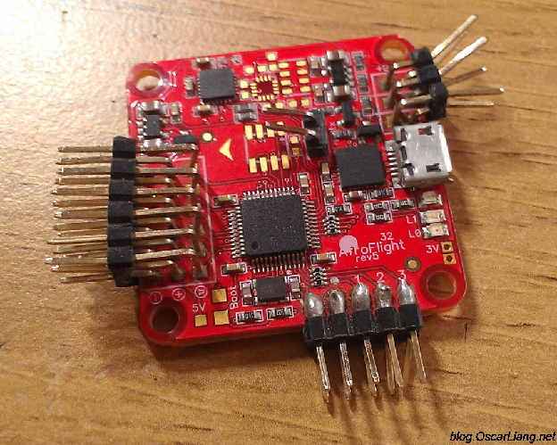
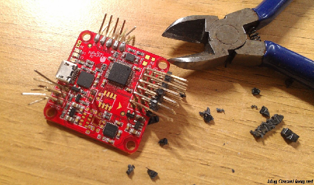
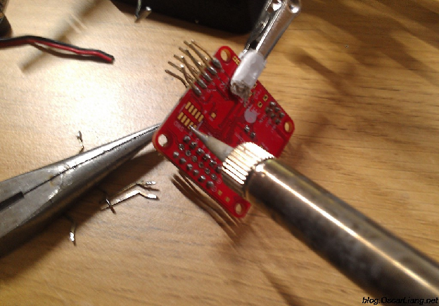
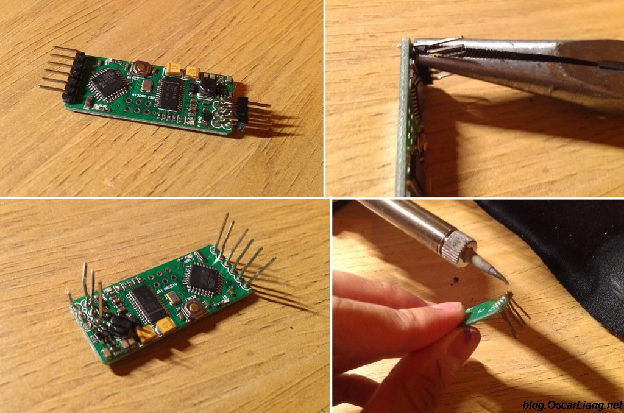
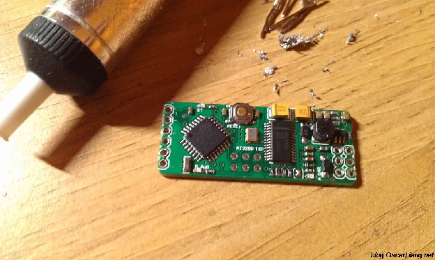

  
Стисле посилання на цей переклад: [https://bit.ly/LiangHowRemoveHeaderPins](https://bit.ly/LiangHowRemoveHeaderPins)   

| 🫂 | Нижче виконаний та вичитаний людьми український переклад оригіналу. Для [VictoryDrones](https://www.victory-drones.com/) переклад виконала: Lada. Хочете покращити переклад чи знайшли помилку? — Лишіть коментар (Ctrl+Alt+M або «Меню» \> «Вставка» \> «Коментар»). Ми теж живі люди (як і ви) і робим помилки. 😉 |
| :---: | :---- |

**Як випаяти штирьові роз’єми на польотних контролерах**

 

Якщо штирьові роз’єми на [польотному контролері](https://docs.google.com/document/d/1s7mb_jh_BhAakZc2hOWfAFwnawWiF6Ri-H8KcVhk81Q/edit?usp=sharing) чи друкованій платі загалом знято неправильно, це може призвести до пошкоджень апаратного забезпечення. У цій інструкції я покажу пару прикладів, як це можна зробити безпечно та легко.

*Деякі посилання на цій сторінці є партнерськими. Я \[автор англомовної версії Оскар Ланг\] отримую комісію (без додаткових витрат для вас), якщо ви робите покупку після натискання одного із цих партнерських посилань. Це допомагає підтримувати безкоштовний контент для спільноти на цьому веб\-сайті. Будь ласка, прочитайте нашу [Політику партнерських посилань](https://oscarliang.com/affiliate-program-policy/) для отримання додаткової інформації.*

**Неправильно:** багато хто пробує від’єднати припій спочатку використовуючи пристрій для видалення припою чи мідну стрічку для зняття припою, а потім витягуючи всі штирьові роз’єми водночас. Перш за все, не так легко повністю зняти припій, тому, можливо, доведеться повторювати процес кілька разів. А через дію надмірного тепла на контактні майданчики та з’єднання, можна вирвати провідну мідну поверхню чи зіпсувати плату.

Тож розкажу про спосіб, який я вважаю **правильним**. Ось як я безпечно витягую штирьові роз’єми на друкованій платі. Майте на увазі, що у процесі витягування наявні штирьові роз'єми зламаються, тому вам потрібні будуть нові, якщо ви захочете поставити знову штирьові роз’єми.  
 

* Зніміть пластикову частину, яка тримає штирі в купі та випрямте всі зігнуті штирі.  
*  Вийміть роз'єми один за одним, підігріваючи припій, та дуже обережно потягніть штир плоскогубцями. Не докладайте силу\!  
* Очистіть майданчик та зніміть додатковий припій спеціальним пристроєм чи мідною стрічкою. Знову ж таки, не залишайте паяльник на майданчиках надовго, аби уникнути пошкодження *\[і перегріву сусідніх елементів\]*.

# **Приклад 1 – Зняття штирьових роз'ємів з польотного контролера**

  

# **Приклад 2 – Зняття штирьових роз'ємів з модуля MinimOSD**

  

# **Коментарі**

VINCENT TASSONE21st May 2020 \- 6:56 pm

ПРИВІТ, ОСКАРЕ. Я намагаюся підійти до цього з протилежного боку. Чи знаєте ви когось, хто продає попередньо спаяні плати FC? У мене був інсульт рік тому, тому з дрібною моторикою моїх рук я не спаяю FC. Було б добре мати штирьові роз'єми вже на платі.  
 Дякую

OSCAR3rd June 2020 \- 12:47 am

Ніхто не продає попередньо спаяні плати

 

CHASE6th July 2017 \- 3:16 am

Одна проблема, з якою я стикнувся, коли намагався зняти штирьові роз'єми, полягає в тому, що наявний припій іноді важко розплавити. У когось ще була така проблема?

Якщо так, то я знайшов рішення, яке не потребує підвищення температури паяльника або різкого збільшення часу контакту паяльника з польотним контролером. Все, що вам потрібно зробити, це додати трохи більше припою. Здається, що новий припій краще передає тепло між паяльником та вже наявним припоєм і дуже швидко розплавляє вже наявний припій. Тоді надлишки припою можна легко видалити.

 

ERMANNO LUCIANI21st May 2017 \- 4:07 pm

Вибачте, але навіщо знімати штирьові роз'єми з плати?

 

OSCAR28th May 2017 \- 4:21 pm

Може вам потрібен інший кут? Чи може вам потрібно припаяти напряму?

AFR018th November 2015 \- 4:41 pm

Я нагріваю флюс паяльником і «захлопую» порожній простір, щоб штир досить легко вийшов з отвору

 

 

DAVE6th August 2015 \- 4:19 am

 

Привіт, Оскаре,

Нещодавно я зіпсував плату контролера naze32, на якій намагався полагодити один зі штирів. Я підняв один з майданчиків.

Є якісь рекомендації щодо того, як це виправити (я новачок) і чи варто заморочуватися?

 

OSCAR10th August 2015 \- 12:43 pm

Не думаю, що існує легке рішення… можливо, тобі треба буде купити нову плату.

Але якщо це просто штир від мотора, можеш використати запасний, змінивши модуль CMiX.

 

EASYFLARE28th July 2015 \- 6:13 am

Привіт, Оскаре,

Ізолюйте точку контакту плоскогубців фанерою або подібним матеріалом. Це допоможе запобігти втраті тепла через плоскогубці та зробить процес ще швидшим.

 

OSCAR28th July 2015 \- 5:46 pm

Ага, добра порада\! Або можна використати палички для їжі, якщо хтось з Азії :D

 

FL0PPSY28th July 2015 \- 5:32 am

Привіт, Оскаре,

Мені цікаво, як краще видалити компонент, який був припаяний безпосередньо до штирьових роз'ємів? Візьмемо для прикладу плату розподілу живлення Nucleus (та інші варіанти). MinimOSD можна припаяти безпосередньо до штирьових роз'ємів на платі розподілу живлення, щоб він знаходився під контролером польоту. Нещодавно я думав, що одного разу мені доведеться знову зняти MinimOSD з плати розподілу живлення, і, скидається на те, що це буде болісно.

Хтось може порадити, як краще з цим впоратися?

 

OSCAR28th July 2015 \- 5:44 pm

хороше запитання.

Важкувато вийняти штирьові роз'єми, не зіпсувавши їх…

Я подумаю над цим та оновлю допис… якщо зможу…

 

#  

 

[image1]: 

[image2]: 

[image3]: 

[image4]: 

[image5]: 