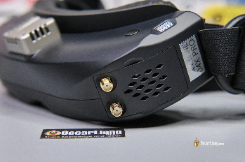

Стисле посилання на цей переклад: [https://bit.ly/corruptVideoFix](https://bit.ly/corruptVideoFix)

|  | Нижче вичитаний людьми машинний український переклад оригіналу. Для [VictoryDrones](https://www.victory-drones.com/) переклад вичитали: Faina, Max Well. Хочете покращити переклад чи знайшли помилку? — Лишіть коментар (Ctrl+Alt+M або «Меню» \> «Вставка» \> «Коментар»). Ми теж живі люди (як і ви) і робим помилки. Роботи їх, до речі, також роблять 😉 |
| :---- | :---- |

# **Як відновити пошкоджені відеофайли DVR в окулярах Skyzone**  {#як-відновити-пошкоджені-відеофайли-dvr-в-окулярах-skyzone}

1st August 2024

Якщо вас бісить пошкоджений файл відеореєстратора (DVR) в окулярах  [Skyzone SKY04X Pro goggles](https://oscarliang.com/skyzone-sky04x-pro/)  після польоту, – тo ви не один такий. Незалежно від того, чи ваші FPV окуляри вимкнулися несподівано, чи ви забули зупинити запис перед відключенням батареї, пошкоджені відеофайли можуть бути проблемою. На щастя, FPV окуляри Skyzone мають вбудовану функцію, яка дозволяє легко відновити ці пошкоджені файли DVR. У цьому посібнику я проведу вас через процес відновлення FPV-відеоматеріалу. 

*Деякі посилання на цій сторінці є партнерськими. Я \[автор англомовної версії Оскар Ланг\] отримую комісію (без додаткових витрат для вас), якщо ви робите покупку після натискання одного із цих партнерських посилань. Це допомагає підтримувати безкоштовний контент для спільноти на цьому веб\-сайті. Будь ласка, прочитайте нашу [Політику партнерських посилань](https://oscarliang.com/affiliate-program-policy/) для отримання додаткової інформації.*

**Зміст**

[**Як відновити пошкоджені відеофайли DVR в окулярах Skyzone	1**](#як-відновити-пошкоджені-відеофайли-dvr-в-окулярах-skyzone)

[Розуміння пошкоджених записів DVR	2](#розуміння-пошкоджених-записів-dvr)

[Покрокова інструкція з відновлення пошкоджених відео з DVR	2](#покрокова-інструкція-з-відновлення-пошкоджених-відео-з-dvr)

[Крок 1: Увійдіть у режим програвання \[Playback Mode\] на окулярах Skyzone.	2](#крок-1:-увійдіть-у-режим-програвання-[playback-mode]-на-окулярах-skyzone.)

[Крок 2: Відновлення першого пошкодженого файлу	2](#крок-2:-відновлення-першого-пошкодженого-файлу)

[Висновок	3](#висновок)

## **Розуміння пошкоджених записів DVR**  {#розуміння-пошкоджених-записів-dvr}

Пошкодження відеофайлів зазвичай трапляється, коли сесія запису переривається несподівано, наприклад, коли окуляри втрачають живлення до того, як запис правильно зупинено. У більшості випадків пошкоджений файл DVR стає непридатним для програвання і не може бути прочитаний програмним забезпеченням для редагування відео.  
Гарна новина полягає в тому, що окуляри Skyzone мають вбудовану функцію для відновлення цих файлів без потреби у сторонньому програмному забезпеченні або складних інструментах для відновлення.

## **Покрокова інструкція з відновлення пошкоджених відео з DVR**  {#покрокова-інструкція-з-відновлення-пошкоджених-відео-з-dvr}

### **Крок 1: Увійдіть у режим програвання *\[Playback Mode\]* на окулярах Skyzone.**  {#крок-1:-увійдіть-у-режим-програвання-[playback-mode]-на-окулярах-skyzone.}

Вставте карту пам'яті назад у окуляри Skyzone. Увімкніть окуляри і увійдіть у режим програвання DVR *\[Playback Mode\]*. 

### **Крок 2: Відновлення першого пошкодженого файлу**  {#крок-2:-відновлення-першого-пошкодженого-файлу}

Оберіть пошкоджений файл у режимі програвання *\[Playback Mode\]*. Може показатись, що окуляри “зависли”, і натискання будь-яких кнопок не призведе до жодних дій. Це нормально, оскільки окуляри намагаються відтворити файл, що може зайняти певний час залежно від його розміру. 

Не натискайте жодних кнопок і не переривайте процес. Просто зачекайте, і окуляри автоматично розпочнуть відновлення. Після завершення процесу у вас буде змога грати відео, щоб підтвердити, що воно було відновлено. 

## **Висновок**  {#висновок}

Пошкоджені відеофайли можуть стати неприємним явищем, але з FPV-окулярами [Skyzone SKY04X Pro FPV goggles](https://oscarliang.com/skyzone-sky04x-pro/) у вас є просте рішення прямо під рукою. Дотримуючись цих кроків, ви зможете відновити більшість, якщо не всі, своїх записів. Ця вбудована функція відновлення демонструє продуманий дизайн окулярів Skyzone, роблячи їх ще більш цінним інструментом для будь-якого ентузіаста FPV.

# 

[image1]: 

[image2]: 