Стисле посилання на цей переклад: [https://bit.ly/LiangDJI-FPV](https://bit.ly/LiangDJI-FPV)  

| 🫂 | Нижче вичитаний людьми машинний український переклад оригіналу. Для [VictoryDrones](https://www.victory-drones.com/) переклад вичитали: Kristina, Block. Хочете покращити переклад чи знайшли помилку? – Лишіть коментар (Ctrl+Alt+M або «Меню» \> «Вставка» \> «Коментар»). Ми теж живі люди (як і ви) і робимо помилки. Роботи їх, до речі, також роблять 😉 |
| :---: | :---- |

# Як налаштувати FPV-систему DJI (Air Unit, Goggles, Remote і Betaflight)

30 червня 2020 р

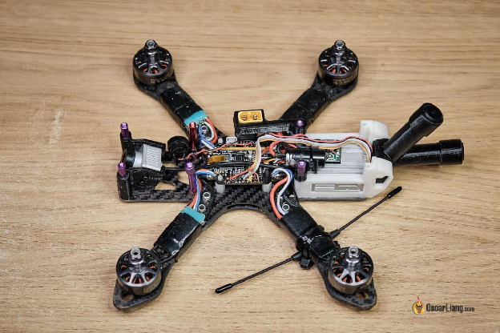

Я покажу вам, як налаштувати і використовувати FPV-систему DJI із [Betaflight](https://betaflight.com/). У цьому посібнику ми розглянемо активацію, підключення та встановлення в дроні, а також парування між FPV-окулярами, чипом Air Unit і пультом дистанційного керування, і, нарешті, основні операції.

Зміст

[Увімкнення FPV-окулярів](#увімкнення-fpv-окулярів)

[Активація](#активація)

[Установка чипа Air Unit в дрон](#установка-чипа-air-unit-в-дрон)

[Підключення Air Unit до польотного контролера](#підключення-air-unit-до-польотного-контролера)

[Повнорозмірний Air Unit](#повнорозмірний-air-unit)

[Caddx Vista](#caddx-vista)

[Вимоги BEC](#вимоги-bec)

[Перед увімкненням](#перед-увімкненням)

[Парування окулярів FPV та Air Unit](#парування-окулярів-fpv-та-air-unit)

[Використання пульта дистанційного керування DJI](#використання-пульта-дистанційного-керування-dji)

[Парування пульту дистанційного керування з Air Unit](#парування-пульту-дистанційного-керування-з-air-unit)

[Налаштування пульту](#налаштування-пульту)

[Регулювання «жорсткості» реакції пульта](#регулювання-«жорсткості»-реакції-пульта)

[Режим блокування](#режим-блокування)

[Дистанційне розміщення антен](#дистанційне-розміщення-антен)

[Виймання акумулятора](#виймання-акумулятора)

[Пояснення щодо індикатора стану пульта дистанційного керування / звукового сигналу](#пояснення-щодо-індикатора-стану-пульта-дистанційного-керування-/-звукового-сигналу)

[Налаштування екранного меню Betaflight](#налаштування-екранного-меню-betaflight)

[Якість відеопотоку](#якість-відеопотоку)

[Найкращі налаштування якості зображення](#найкращі-налаштування-якості-зображення)

[Налаштування найнижчої затримки](#налаштування-найнижчої-затримки)

[Як записати відео?](#як-записати-відео?)

[Завантаження FPV-відео на Youtube](#завантаження-fpv-відео-на-youtube)

[Інші посібники з системи DJI FPV](#інші-посібники-з-системи-dji-fpv)

[Офіційні посібники](#офіційні-посібники)

[Історія редагування](#історія-редагування)

[Коментарі](#коментарі)

*Деякі посилання на цій сторінці є партнерськими. Я \[автор англомовної версії Оскар Ланг\] отримую комісію (без додаткових витрат для вас), якщо ви робите покупку після натискання одного із цих партнерських посилань. Це допомагає підтримувати безкоштовний контент для спільноти на цьому веб\-сайті. Будь ласка, прочитайте нашу [Політику партнерських посилань](https://oscarliang.com/affiliate-program-policy/) для отримання додаткової інформації.*

## 

## **Увімкнення FPV-окулярів**  {#увімкнення-fpv-окулярів}

* Встановіть чотири шлейфові антени, переконайтеся, що вони добре затягнуті.

* Увімкніть окуляри від [акумулятора](https://bit.ly/LiPo-Batteries-forFPV-Drones) 3S або 4S LiPo за допомогою кабелю з комплекту (я використовую акумулятор 4S 1500mAh LiPo для свого дрона).

* Одягніть окуляри та відрегулюйте повзунки IPD *\[англ.: inter-pupillary distance — міжзінична відстань\]* внизу, щоб забезпечити чіткий огляд.

* Якщо ви хочете записати відео в окулярах, вам потрібно вставити картку Micro SD ([яка SD-карта мені потрібна?](https://oscarliang.com/sd-cards-fpv/#dji-fpv))

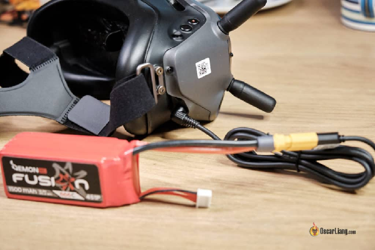

## **Активація** {#активація}

Зайдіть на [https://www.dji.com/uk/fpv](https://www.dji.com/uk/fpv), натисніть *Завантаження*, розділ *Програмне забезпечення,* завантажте останню версію *DJI Assistant 2*. Встановіть програму на комп'ютер. Переконайтеся, що ви завантажили FPV-версію DJI Assistant\! Неправильна версія не виявить ваші FPV-окуляри та Air Unit.

Увімкніть окуляри DJI FPV Goggles, перш ніж підключати їх до комп’ютера за допомогою кабелю USB-C.

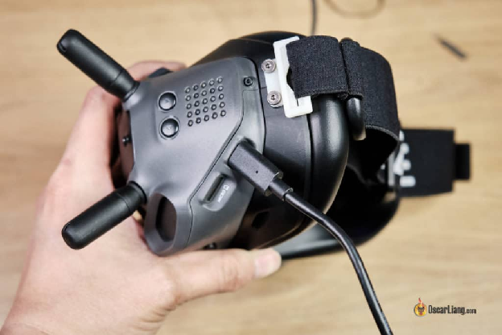

Запустіть **DJI Assistant 2** й увійдіть за допомогою свого облікового запису DJI (зареєструйтеся, якщо ви цього ще не зробили).

Ви маєте побачити піктограму «DJI FPV GOGGLES» (див. малюнок). Якщо ви її не бачите, повторно під’єднайте кабель USB. Зауважте, що під час першого підключення пристрою вашому комп’ютеру може знадобитися хвилина або дві, аби встановити драйвер.

Натисніть на піктограму, і вам буде запропоновано активувати ваш пристрій. Переконайтеся, що у вас є підключення до Інтернету\!

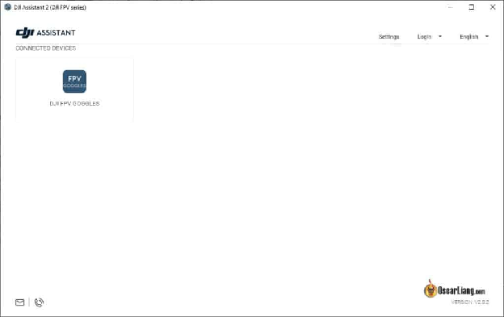

Вам доведеться активувати кожен компонент окремо, але кроки однакові. Повторіть ці дії дляе ти Air Unit (і пульта дистанційного керування).

## **Установка чипа Air Unit в дрон** {#установка-чипа-air-unit-в-дрон}

Якщо ви створюєте дрон з нуля за допомогою системи DJI FPV, найкраще придбати раму, призначену для [DJI Air Unit](https://www.dji.com/o3-air-unit). Зазвичай вона постачається з надрукованими на 3D-принтері деталями для встановлення чипу Air Unit та антени.

Ось [перелік рам, зроблених для DJI Air Unit](https://oscarliang.com/frames-dji-air-unit/).

Якщо ви модернізуєте свій існуючий дрон FPV і не хочете інвестувати в нову раму, зайдіть на «[thingiverse.com](https://www.thingiverse.com/)» і перевірте, чи там є спеціальні конструкції для вашої рами, які можна надрукувати на 3D-принтері. Я досі використовую раму Martian II з 2015 року, але зараз уже є кілька дійсно гарних варіантів.

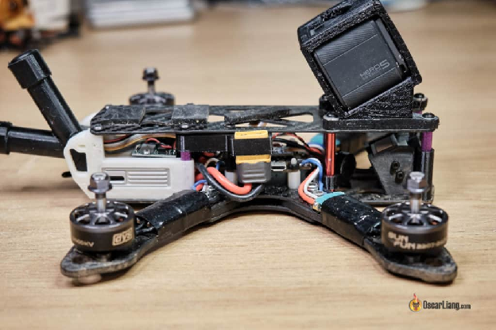

## **Підключення Air Unit до польотного контролера** {#підключення-air-unit-до-польотного-контролера}

### **Повнорозмірний Air Unit** {#повнорозмірний-air-unit}

Якщо у вас є [польотний контролер, розроблений для DJI Air Unit](https://oscarliang.com/dji-fpv-betaflight-fc/), ви можете просто з’єднати їх стрічковим кабелем і забути про всі заплутані схеми з’єднання :) Але якщо ви не хочете витрачатися на новий польотник, я покажу вам, як підключити Air Unit до вашого польотного контролера.

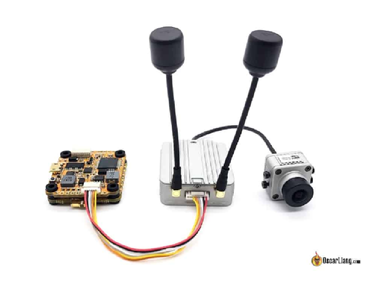

DJI Air Unit приймає напругу від 7,4 В до 17,6 В, ви можете живити його безпосередньо від 3S або 4S [LiPo акумулятора](https://bit.ly/LiPo-Batteries-forFPV-Drones).

Проте я би рекомендував живити його від **зовнішнього стабілізатора напруги** або **BEC на польотному контролері**. Це пов'язано з тим, що стрибки напруги від моторів і ESC можуть пошкодити Air Unit (так само він може пошкодити ваш аналоговий VTX). [Встановлення додаткового конденсатора може пом’якшити цю проблему](http://bit.ly/WhyCapacitorsAreImportant).

### **Caddx Vista** {#caddx-vista}

[Caddx Vista Air Unit](https://oscarliang.com/caddx-vista-vtx/) навіть підтримує більш високу напругу до 6S, і тому ви можете живити Air Unit безпосередньо від 4S LiPo батареї. Але якщо ви хочете перестрахуватися, використовуйте стабілізатор напруги або BEC на польотніку.

У Vista, однак, немає роз'єму JST, тому вам доведеться припаювати власні дроти до колодок.

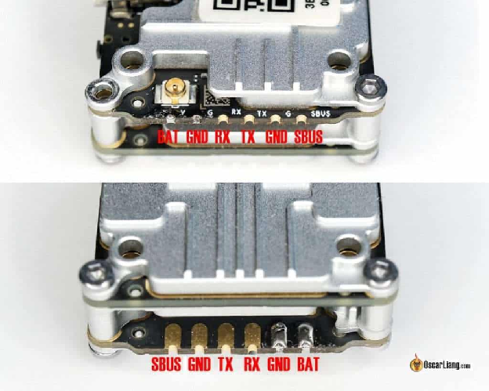 

**\* Підключення SBUS до контролера польоту не є обов'язковим**

### **Вимоги BEC** {#вимоги-bec}

Якщо ви використовуєте BEC (блок регулювання напруги) чи стабілізатор напруги для живлення Air Unit, переконайтеся, що він може подавати достатній струм. Максимальна споживана потужність Air Unit становить 8 Вт, потреба в струмі змінюється залежно від вхідної напруги:

* 9 В \=\> 0,9 А

* 12 В \=\> 0,7 А

* 16 В \=\> 0,5 А

Якщо BEC на вашому польотніку не відповідає вимогам щодо напруги чи струму, ви можете використати зовнішній стабілізатор напруги. Я використав [цей маленький регульований стабілізатор напруги](https://oscarliang.com/3a-voltage-regulator/) з хорошим результатом.

### **Перед увімкненням** {#перед-увімкненням}

Перш ніж увімкнути Air Unit, переконайтеся, що антени приєднані та підключення до польотніку правильне, інакше це може призвести до незворотних пошкоджень.

З Caddx Vista не забудьте правильно встановити тримач роз’єму антени\!

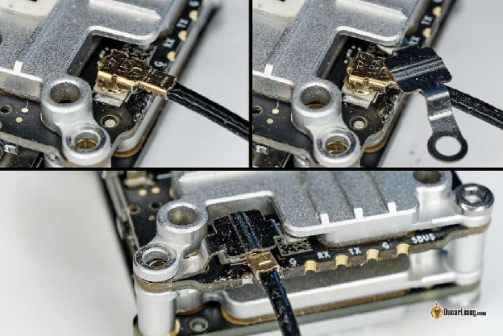

## **Парування окулярів FPV та Air Unit** {#парування-окулярів-fpv-та-air-unit}

Щоб отримати зображення з камери на ваші окуляри, вам треба спочатку зпарувати та з’єднати свої окуляри DJI FPV із чипом Air Unit.

Увімкніть FPV-окуляри та Air Unit.

За допомогою маленької шпильки або голки натисніть ***кнопку з’єднання*** на окулярах, яка знаходиться поруч із роз’ємом живлення. Після цього ви почуєте  безперервний звуковий сигнал, який 

означає, що окуляри готові до з’єднання.

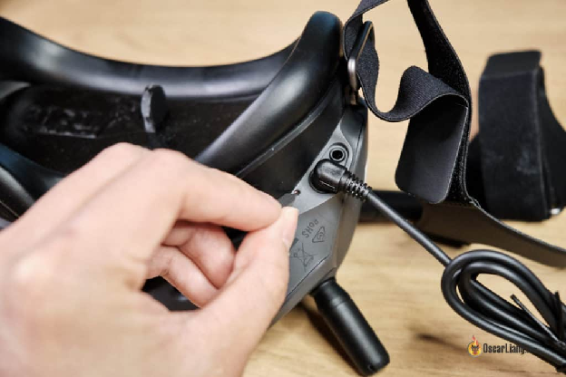

Зачекайте, поки світлодіодний індикатор на Air Unit загориться зеленим кольором, а потім натисніть кнопку підключення на чіпі Air Unit. Ця кнопка розташована під гніздом для SD-карти.

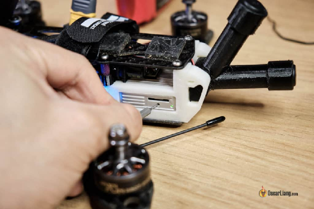

Кнопка підключення на Caddx Vista розташована біля порту USB (це кнопка, що натискається).

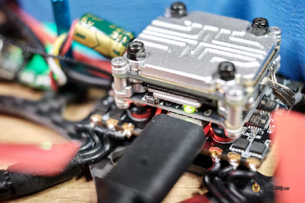

Сполучення має завершитися протягом кількох секунд. Після того, як їх об’єднано, звуковий сигнал припиниться, і ви побачите в окулярах зображення з камери.

## **Використання пульта дистанційного керування DJI** {#використання-пульта-дистанційного-керування-dji}

Використання пульту дистанційного керування DJI НЕ є обов’язковим для керування вашим дроном, ви можете використовувати будь-який пульт дистанційного керування, який вам подобається – наприклад, Frsky або Crossfire. Але в DJI Air Unit вже вбудований приймач, тому ви можете заощадити на додатковому приймачі :) Вирішувати вам\!

[Ось мій огляд пульта DJI](https://oscarliang.com/dji-fpv-remote/).

Щоб увімкнути або вимкнути пульт, просто натисніть кнопку живлення один раз, а потім утримуйте її протягом 2 секунд.

### **Парування пульту дистанційного керування з Air Unit** {#парування-пульту-дистанційного-керування-з-air-unit}

Якщо ви використовуєте пульт дистанційного керування, його потрібно *\[бездротово\]* з’єднати із чипом Air Unit.

Примітка: перш ніж біндувати пульт дистанційного керування, вам слід забіндувати окуляри FPV до Air Unit. Інакше ви можете втратити бінд до окулярів, і вам доведеться робити це знову. Це дивна помилка.

По-перше, спочатку з’єднайте Air Unit із FPV-окулярами, а потім із пультом, інакше вам доведеться повторити цей процес.

Увімкніть Air Unit і пульт дистанційного керування, але вимкніть окуляри FPV.

Зачекайте, доки світлодіодний індикатор на Air Unit загориться зеленим, а потім натисніть кнопку зв’язку на Air Unit.

Одночасно натисніть кнопку запису, кнопку «C» і [праву шестерню](https://store.hp-drones.com/en/dji-spare-parts/1292-RDJIMAVICPART114-5060243901234.html). Тепер пульт має безперервно подавати звуковий сигнал.

Підключення триватиме кілька секунд, після створення пари звуковий сигнал припиниться, а світлодіодний індикатор стану на обох пристроях стане зеленим.

*Примітка для японських користувачів: якщо ви прив’яжете окуляри до Air Unit, а потім прив’яжете контролер, ваші окуляри можуть перестати працювати, а на екрані з’явиться повідомлення «Передачу зображення зупинено». Це може бути пов’язано з обмеженнями прошивки Японії. Мені сказали, що можна спробувати, щоб вирішити цю проблему,* [виконати FCC-хак на Air Unit](https://oscarliang.com/dji-fpv-system-fcc-700mw/) *після того, як ви прив’яжете його до окулярів, а потім від’єднати все та прив’язати пульт.*

### **Налаштування пульту** {#налаштування-пульту}

Ви можете налаштувати параметри пульту через екранне меню в окулярах: «Налаштування» \=\> «Пульт дистанційного керування».

Тут у вас є налаштування сервоприводу, функціональний режим, режим стіків (режим 1 і режим 2\) і калібрування.

Перше, що вам слід зробити, це відкалібрувати стіки в меню «Калібрування».

Потім перейдіть до «Налаштувань сервоприводу», щоб переконатися, що всі ваші канали надсилають 1000 — 2000, коли ви переміщуєте стіки в максимальне положення. Це називається «Кінцеві точки». Це нормально, якщо ваші кінцеві точки трохи виходять за межі діапазону 1000 — 2000\. Наприклад, ваша найнижча кінцева точка може бути в діапазоні від 995 до 1000, а найвища кінцева точка може бути в діапазоні від 2000 до 2005\.

Перемикачі на пульті налаштовані попередньо та займають канали із 5 по 8:

* CH5 \= SA

* CH6 \= SB

* CH7 \= SC

* CH8 \= SD

Тепер перейдіть на вкладку «Порти» у Betaflight, увімкніть «Serial RX» для UART, до якого ви підключили дріт SBUS на своєму польотному контролері.

У розділі «Приймач» на вкладці «Конфігурація» у «Провайдері послідовного приймача» оберіть SBUS.

Перейдіть на вкладку «Приймач» і перевірте, чи «смужки» реагують на рух вашого стіка. Якщо виходи каналів реагують на неправильний стік, [ось як виправити карту каналів](https://oscarliang.com/channel-map/).

Якщо все виглядає правильно, ви готові використовувати свій пульт для керування дроном. Не забудьте [спочатку налаштувати перемикачі для взведення мотора](https://oscarliang.com/betaflight-modes/#arm) :)

### **Регулювання «жорсткості» реакції пульта** {#регулювання-«жорсткості»-реакції-пульта}

Вважаєте, що стіки реагують занадто вільно або занадто туго? Ви можете відрегулювати «жорсткість» рамок стіків, повертаючи гвинти на задній панелі пульту.

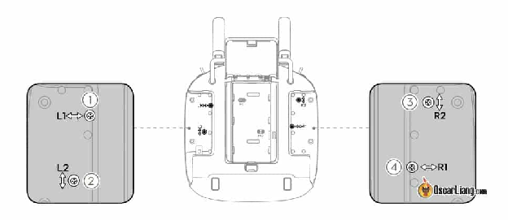

Ви можете отримати доступ до цих гвинтів, відтягнувши гумові пластини.

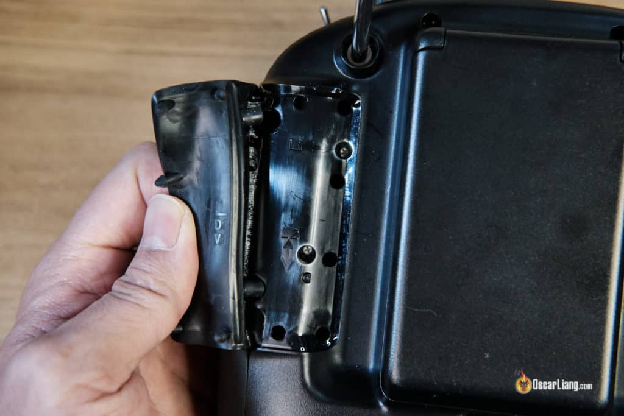

Наконечники стіків мають різьблення M3 (на випадок, якщо ви захочете отримати якісь особливі наконечники *\[прим. пер.: це суто декративна функція, але наприклад Radiomaster TX16 у [кастомних кольорах](https://www.radiomasterrc.com/products/tx16s-mark-ii-max-pro-radio-controller-mck-edition-elrs-m2) може коштувати на $100 дорожче звичайного\!\]).*

### **Режим блокування** {#режим-блокування}

На цьому пульті є лише дві кнопки: кнопка живлення та кнопка «C». Кнопка живлення говорить сама за себе, а кнопка «C» призначена для «блокування» всіх стіків і перемикачів, щоб не надсилався сигнал з пульту дистанційного керування. Це функція безпеки, щоб уникнути випадкового взведення мотора дрона.

Просто утримуйте кнопку «C», і світлодіодний індикатор стану почне блимати фіолетовим, вказуючи, що пристрій у режимі блокування.

### **Дистанційне розміщення антен** {#дистанційне-розміщення-антен}

Для максимальної ефективності під час передачі антени мають бути спрямовані вгору.

### **Виймання акумулятора** {#виймання-акумулятора}

Якщо вам знадобиться вийняти акумулятор, відкрийте кришку, утримуйте кнопку вивільнення акумулятора та підштовхніть акумулятор вниз.

### **Пояснення щодо індикатора стану пульта дистанційного керування / звукового сигналу** {#пояснення-щодо-індикатора-стану-пульта-дистанційного-керування-/-звукового-сигналу}

* Світиться ЧЕРВОНИМ — увімкнено, але не підключено до приймача.

* Світиться зеленим — працює, підключено до приймача.

* Блимає синім і подає звуковий сигнал із середньою швидкістю — триває біндування.

* Миготливий фіолетовий — режим блокування (утримуйте кнопку «C», щоб заблокувати/розблокувати стіки та перемикачі).

* Поперемінні звукові сигнали та вібрація — потрібне калібрування (зробіть це в окулярах FPV).

* Звуковий сигнал і вібрація — низький заряд акумулятора, \<10%.

* Повільний звуковий сигнал — ручка тяги не в найнижчому положенні.

## **Налаштування екранного меню Betaflight** {#налаштування-екранного-меню-betaflight}

Для того, щоб екранне меню працювало, вам треба підключити контакти передачі (TX) та отримання (RX) на чіпі Air Unit до запасного універсального асинхронного приймача/передавача (UART) на польотному контролері, як показано на схемах підключення вище.

Залежно від того, до якого UART ви підключили DJI Air Unit, увімкніть «Конфігурація/MSP» на вкладці «Порти» у Конфігураторі Betaflight для цього UART (і залиште всі інші опції вимкненими).

На вкладці «Конфігурація» в розділі «Інші функції» **увімкніть наекранне меню (OSD) і Телеметрію.**

Нарешті, у ваших FPV-окулярах DJI увімкніть «Змінене наекранне меню» в розділі «Налаштування», «Екран».

Тепер ви можете обрати елементи, які хочете відобразити на вкладці Betaflight OSD. Поки що підтримуються не всі елементи, але DJI робить певні кроки для підтримки повного екранного меню Betaflight.

Станом на березень 2021 року підтримуються такі елементи.

Ви можете перетягувати елементи на екрані попереднього перегляду, щоб змінити їх розташування, як і у звичайному екранному меню Betaflight, яке буде оновлюватися в режимі реального часу у ваших окулярах DJI.[Ви також можете встановити і зберегти положення елементів за допомогою CLI](https://oscarliang.com/cli-osd-position/).

## **Якість відеопотоку** {#якість-відеопотоку}

Ви можете налаштувати якість відео в розділі «Налаштування», «Передача» в наекранному меню.

### **Найкращі налаштування якості зображення** {#найкращі-налаштування-якості-зображення}

* Перевага: висока якість

* Режим фокусування: Авто (або ВИМК.)

* Бітрейт: 50 Мбіт/с

Якщо у вас немає опції Бітрейт, [вам слід оновити прошивку DJI до останньої версії](https://oscarliang.com/dji-fpv-system-update-firmware/). Якщо ця опція неактивна, це означає, що ви працюєте в режимі CE, тоді як 50 Мбіт/с доступні лише в режимі FCC. [Як перейти в режим FCC](https://oscarliang.com/dji-fpv-system-fcc-700mw/).

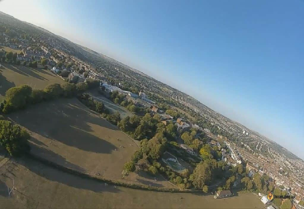

### **Налаштування найнижчої затримки** {#налаштування-найнижчої-затримки}

* Перевага: низька затримка

* Режим фокусування: Авто

* Бітрейт: 50 Мбіт/с

Використання бітрейту 50 Мбіт/с, здається, не впливає на затримку (аналогічно затримці 25 Мбіт/с), але у вас буде лише три доступні канали замість 8\.

Якщо ввімкнено режим фокусування, ви постійно отримуватимете розмиті краї, щоб зменшити обсяг даних, коли сигнал слабшає, це може дуже відволікати. Якщо встановити для нього значення «авто», це мінімізує розмитість країв.

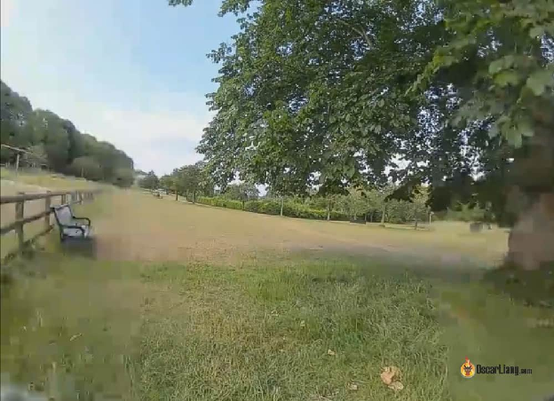  
*Приклад режиму фокусування (розмиті краї)*

* Режим фокусування — оптимізує центр зображення, робить його більш плавним і чітким, коли сигнал стає слабким. Рекомендую залишити цей параметр на AUTO.

* Світлодіодний режим (LED) збільшує насиченість кольорів на світлодіодній гоночній трасі в умовах низької освітленості, що полегшує пілоту політ у будь-якому напрямку.

* Режим «Перегони» підвищує контрастність дисплея, що робить перешкоди більш помітними при денному світлі.

* Стандартний режим підходить для більшості середовищ — використовуйте його, якщо ви не впевнені, який режим є найкращим.

## **Як записати відео?** {#як-записати-відео?}

Вставте карту пам'яті micro SD в FPV-окуляри і Air Unit (за винятком Vista, який не має слота для SD-карти). Тут [мої рекомендації щодо SD-карти](https://oscarliang.com/sd-cards-fpv/#dji-fpv).

Відформатуйте SD-карту в окулярах за допомогою меню, це дозволить уникнути багатьох проблем згодом.

Установіть параметри запису в налаштуваннях FPV-окулярів. Ви можете змінити роздільну здатність, якщо ви записуєте в повнорозмірному Air Unit, між 720p 60fps та 1080p 30fps. Однак ви не можете змінити роздільну здатність для запису в FPV-окулярах (DVR), оскільки вона зафіксована на 720p 60fps.

За замовчуванням запис починається, коли ви взводите мотор дрона, і він автоматично зупиняється та зберігає відео, коли ви заглушите мотор. Ви також можете почати запис, натиснувши кнопку, змінивши налаштування в окулярах.

Дані екранного меню зберігаються у файлі «.srt» (формат субтитрів). Це звичайні тексти, які можна накласти на відео під час відтворення або редагувати.

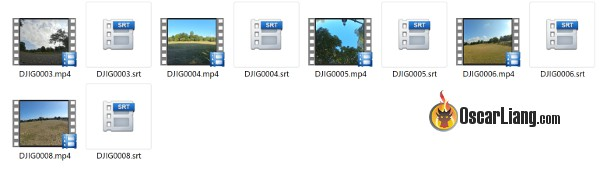

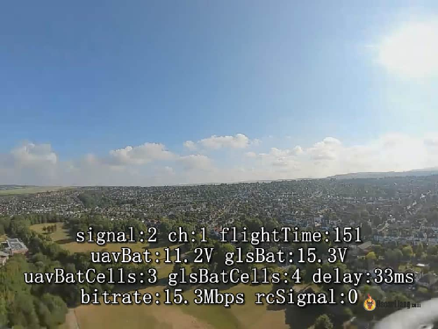

За замовчуванням файл SRT досить безладний із, можливо, великою кількістю небажаних даних. [Ви можете очистити це за допомогою розробленого мною інструменту](https://oscarliang.com/edit-dji-osd-subtitle-files-srt/).

## **Завантаження FPV-відео на Youtube** {#завантаження-fpv-відео-на-youtube}

Я виявив, що найкращий спосіб завантажити відеоматеріал із DJI FPV на YouTube — це «підвищити» його роздільну здатність до 2K або навіть до 4K. Це пов'язано із тим, що Youtube зберігає вищий бітрейт при відтворенні відео з високою роздільною здатністю.

## **Інші посібники з системи DJI FPV** {#інші-посібники-з-системи-dji-fpv}

* [Часті запитання та поради](https://oscarliang.com/dji-fpv-system-faq/)

* [Як оновити мікропрограму окулярів DJI FPV, Air Unit і пульта дистанційного керування](https://oscarliang.com/dji-fpv-system-update-firmware/)

* [Перейдіть у режим FCC](https://oscarliang.com/dji-fpv-system-fcc-700mw/)

* [Вихідна потужність 1200 мВт](https://oscarliang.com/dji-fpv-system-1200mw-output/)

* [Увімкнути бітрейт 50 Мбіт/с](https://oscarliang.com/50mbps-bitrate-dji-fpv/)

* [Необхідно мати системні аксесуари/запчастини для оновлення DJI FPV](https://oscarliang.com/dji-fpv-system-upgrade-accessory/)

## **Офіційні посібники** {#офіційні-посібники}

* DJI FPV Goggles: [https://dl.djicdn.com/downloads/DJI+Goggles/20181230/DJI\_Goggles\_User\_Manual\_EN.pdf](https://dl.djicdn.com/downloads/DJI+Goggles/20181230/DJI_Goggles_User_Manual_EN.pdf)

* Caddx Vista Air Unit: [https://cdn.shopify.com/s/files/1/0036/3921/4169/files/Usermanual.pdf](https://cdn.shopify.com/s/files/1/0036/3921/4169/files/Usermanual.pdf)

* Основні операції їхньої системи FPV: [https://dl.djicdn.com/downloads/DJI\_Digital\_FPV\_System/20191101/DJI\_Digital\_FPV\_System\_User\_Manual\_EN.pdf](https://dl.djicdn.com/downloads/DJI_Digital_FPV_System/20191101/DJI_Digital_FPV_System_User_Manual_EN.pdf)

### **Історія редагування** {#історія-редагування}

* Березень 2020 — посібник створено.

* Травень 2020 — оновлені налаштування екранного меню.

* Червень 2020 — оновлені інструкції для пульта DJI Remote.

* Липень 2020 — додано «Якість каналу відео» та «Як записувати відео».

* Серпень 2020 — додано посилання на «увімкнути 50 Мбіт/с» і «як завантажити на Youtube».

### **Коментарі** {#коментарі}

1. 21 квітня 2022 р. \- 9:30 год

Оскаре, мені сказали, що нові FPV-окуляри DJI V2 добре працюватимуть із DJI Air Unit. Поки що я не можу зв’язати FPV-окуляри DJI V2 зі своїм DJI Air Unit. Проте мій Air Unit добре з’єднується з контролером DJI.

У мене також є новий дрон DJI FPV, і окуляри чудово працюють із новим дроном.

1\. Я ввімкнув окуляри DJI V2.  
2\. Потім я увімкнув DJI Air Unit.  
3\. Я перевів окуляри DJI V2 у режим прив’язки. Окуляри почали пищати.  
4\. Потім я натиснув кнопку підключення на DJI Air Unit, зелений індикатор загорівся червоним, але два пристрої так і не зв’язались.

Маєш якісь пропозиції щодо того, що я роблю не так?

Крім того, для нових FPV-окулярів DJI V2 правильним програмним забезпеченням від DJI є DJI Assistant 2 (DJI FPV). Яке правильне програмне забезпечення для DJI Air Unit? 

Наперед дякую за твою допомогу.

[ВІДПОВІДЬ](https://oscarliang.com/dji-fpv-system-setup/#comment-132593)

21 жовтня 2022 \- 19:40

Вам потрібно змінити стан окулярів у режимі налаштувань на готові до підключення до системи dji fpv. Знайдіть цю опцію в налаштуваннях окулярів — «Налаштувати» або щось подібне.

2. 3 лютого 2022 р. \- 23:19  
   Привіт Оскар\!  
   Дякую за таку чудову роботу\! Я вже отримав багато корисної інформації з вашого блогу, і я вже будую свій перший fpv дрон. Я буду використовувати польотний контролер Mamba F772 разом із модулем DJI FPV. Але з іншим пультом дистанційного керування та приймачем (насправді це буде Zorro від Ratiomaster). Чи можна буде підключити DJI FPV Air Unit до якихось інших окулярів, від іншого розробника?

   [ВІДПОВІДЬ](https://oscarliang.com/dji-fpv-system-setup/#comment-126582)

   ОСКАР

   4 лютого 2022 р. \- 17:13

   Дякую :)  
   На ваше запитання: ні, DJI FPV Air Unit працює лише з окулярами DJI FPV.

   

3. 30 липня 2021 р. \- 3:35 ранку  
   привіт оскар  
   отримав BNF KOPIS Cinewhoop DJI версії 2.5, на якому я літав 3 місяці, у мене виникла проблема з комплексом рішень ESC, який я змінив на той самий комплекс, і проблема виникла, коли він підключився до betaflight, я не можу підключитися до свого приймача, який є контролером DJI... мій контролер не працює на betaflight... є пропозиції? Зробив усе, що зміг знайти на форумах, здається, я не самотній у цій проблемі… їхнє рішення полягає в тому, щоб купити інший пристрій, чого я не можу зробити… контролер DJI не підключається до Betaflight… я використовую UART 3… є думки?

   [ВІДПОВІДЬ](https://oscarliang.com/dji-fpv-system-setup/#comment-86498)

   ОСКАР

   30 липня 2021 р. \- 19:45

   Ви маєте на увазі, що стік не рухається? Чи можете ви також перевірити, чи працює екранне меню Betaflight?  
   Можливо, що діод між сигналом SBUS і польотним контролером у Air Unit був пошкоджений, ви можете перевірити ці інструкції тут:[https://oscarliang.com/dji-fpv-system-faq/\#vista-osd-stops-working](https://oscarliang.com/dji-fpv-system-faq/#vista-osd-stops-working)

   

4. 20 червня 2021 р. \- 19:01  
   Вітаю, Оскар, чи можеш ти підтвердити, що права антена ззаду Air Unit використовує лише пульт дистанційного керування TX – DJI?  
   Тому що у відео з прийомами Johny FPV ми побачили, що він використовував лише одну антену: youtu.be/zVB7yFvCDyQ?t=33

   [ВІДПОВІДЬ](https://oscarliang.com/dji-fpv-system-setup/#comment-82588)

   ОСКАР

   20 червня 2021 р. \- 20:26

   Ні, він використовує обидві антени, увімкніть паузу та подивіться ближче, одна антена спрямована вгору, а інша прикріплена до руки.

   [ВІДПОВІДЬ](https://oscarliang.com/dji-fpv-system-setup/#comment-82594)

   ДЕ

   19 липня 2021 р. \- 14:37

   Так, правильно\!  
   Але я не зрозумів, що одна з антен Air Unit використовується для пульта дистанційного керування DJI.  
   Не могли б ви підтвердити цю інформацію?

   [ВІДПОВІДЬ](https://oscarliang.com/dji-fpv-system-setup/#comment-85266)

   ОСКАР

   20 липня 2021 р. \- 11:24 год

   Ні, це рознесені антени.  
   Якщо для пульта дистанційного керування DJI потрібна спеціальна антена, тоді ви припускаєте, що Vista не підтримуватиме пульт, правда? Але Vista також працює з Remote, оскільки має лише одну антену :)

   

5. 7 червня 2021 р. \- 17:58  
   Я досі не можу отримати BF OSD у своїх окулярах за допомогою CaddxFPV vista. Я зробив усе, що тут сказано, і те, що пропонують інші, без успіху. Я в FCC… 50 Мбіт/с…. 1200 миль/год… все в BF налаштовано… увімкнено… або вимкнено rssi adds чи що там… так і застряг лише з екранним меню за замовчуванням….ДОПОМОЖІТЬ, БУДЬ ЛАСКА… це може бути щось у кліпі?….

   [ВІДПОВІДЬ](https://oscarliang.com/dji-fpv-system-setup/#comment-80498)

   ОСКАР

   7 червня 2021 р. \- 18:40

   Існує ймовірність того, що один із діодів у вашій Vista зіпсувався, це поширена проблема, через яку екранне меню не з’являється.  
   Перегляньте цю тему, вони покажуть вам, де цей діод, і ви можете спробувати обійти:[https://intofpv.com/t-caddx-vista-bad](https://intofpv.com/t-caddx-vista-bad)

   

6. 14 квітня 2021 р. \- 5:53  
   Оскар, у мене є система DJI FPV II. У мене також є EMAX BabyHawk HD. Є шанс, що мої окуляри DJI синхронізуються з BabyHawk?

   Дякую

   [ВІДПОВІДЬ](https://oscarliang.com/dji-fpv-system-setup/#comment-63768)

   ОСКАР

   14 квітня 2021 р. \- 12:19 

   Ви маєте на увазі, що у вас є DJI FPV Goggles V2? У цьому випадку вони повинні добре працювати з DJI Air Unit та Caddx Vista.

   

7. 31 березня 2021 р. \- 14:55  
   Привіт Оскар,

   Неймовірний посібник\! Дуже дякую. Нещодавно я придбав контролер DJI FPV 2 версії. Він дуже відрізняється від того, що показано в цій статті. Ви знаєте, чи варто мені очікувати подібного процесу синхронізації та налаштувати найновіший пульт дистанційного керування?

   Дякую\!

   [ВІДПОВІДЬ](https://oscarliang.com/dji-fpv-system-setup/#comment-61668)

   ОСКАР

   31 березня 2021 р. \- 16:38

   FPV Controller V2 сумісний лише з дроном DJI FPV. Ви не можете використовувати його з дронами FPV, виготовленими на замовлення.

   

8. 24 березня 2021 р. \- 20:03  
   Вибачте за питання новачка. якщо я використовую 1200MW hack на пульті dji. Чи означає це, що він матиме кращий радіус дії, ніж мій Tango 2?  
   Я переглянув кілька відео і подумав, що головна причина Tango 2 — кращий діапазон? Tango 2 не має максимум 500 МВт?

   [ВІДПОВІДЬ](https://oscarliang.com/dji-fpv-system-setup/#comment-60094)

   ОСКАР

   24 березня 2021 \- 22:14

   Не надто вдаючись у техніку, ваш Tango 2 на 500 мВт все одно буде набагато перевершувати пульт DJI на 1200 мВт.

   

9. 8 березня 2021 р. \- 22:12  
   Привіт, мій друже. Гарний пост\!

   У мене є така рамка. У вас є 3D-дизайн частини для розміщення Air Unit та камери?

   [ВІДПОВІДЬ](https://oscarliang.com/dji-fpv-system-setup/#comment-57319)

   ОСКАР

   9 березня 2021 р. \- 14:45

   Вони є на Thingiverse, не моя розробка. Просто знайдіть «DJI Martian frame»

   

   30 грудня 2020 р. \- 14:10 год

   Мені стало цікаво, чи можете ви мені допомогти? У мене працює BetaFPV 95x V2 – польотний контролер F405 і ESC 16A BLHeli\_32. Я використовую TBS, і він має Caddex Vista DJI. Я намагався протягом тижня зробити так, щоб інформація Betaflight OSD відображалася в окулярах DJI, але я бачу лише стандартну інформацію DJI OSD. Я ввімкнув спеціальний дисплей в окулярах DJI. І пішов за відео JB про те, як увімкнути все, але безуспішно. Я також перевірив усі форуми DJI, але, здається, не можу знайти жодної інформації або чогось, що спрацює. Буду дуже вдячний за будь-яку допомогу\!

   [ВІДПОВІДЬ](https://oscarliang.com/dji-fpv-system-setup/#comment-47387)

   ОСКАР

   11 січня 2021 р. \- 15:43

   Переконайтеся, що ви також оновили окуляри DJI та Air Unit до останньої версії мікропрограми.  
   І оновіть Betaflight до останньої версії.

10. 5 жовтня 2020 р. \- 10:41   
    Привіт Оскар,

    у мене питання:  
    Де чи як я можу взяти кріплення для Air Unit та антен, які ви використовували на цій марсіанській рамці?

    Дякую заздалегідь,  
    з повагою

    [ВІДПОВІДЬ](https://oscarliang.com/dji-fpv-system-setup/#comment-37205)

    ОСКАР

    8 січня 2021 р. \- 19:54

    Це надрукована на 3D-принтері деталь, файл дизайну можна знайти на thingiverse (пошуковий термін кріплення DJI для марсіанської рамки)

    

11. 28 серпня 2020 р. \- 7:29   
    Привіт Оскар, чи можете ви порекомендувати підвищувальний перетворювач 9 В для Vista? Я хочу використовувати Caddx Vista на своєму Tinyhawk 2 Freestyle, як у цьому відео [youtube.com/watch?v=suwdTj06pXo](http://youtube.com/watch?v=suwdTj06pXo). А Vista підтримує лише напругу вище 7,4 В.

    [ВІДПОВІДЬ](https://oscarliang.com/dji-fpv-system-setup/#comment-33508)

    ОСКАР

    4 вересня 2020 р. \- 16:06

    [Я використовую цей](https://oscarliang.com/3a-voltage-regulator/), працює як модуль CHARM.

    

12. 24 серпня 2020 р. \- 12:47  
    Дорогий Оскар,

    Чи можна було б використовувати іншу камеру з Air Unit? Наприклад, комерційно доступна камера з виходом HDMI або з виходом, який може бути сумісним із Air Unit.

    Заздалегідь спасибі,

    [ВІДПОВІДЬ](https://oscarliang.com/dji-fpv-system-setup/#comment-33236)

    ОСКАР

    4 вересня 2020 р. \- 15:50

    Ні.  
    На даний момент з DJI Air Unit можна використовувати тільки [The Nebula](https://oscarliang.com/caddx-nebula-micro-eachine/).

    

13. 20 серпня 2020 р. \- 17:11  
    Чи можна записувати відео лише за допомогою dji Air Unit?  
    Іншими словами, використовувати dji Air Unit на професійному рівні.  
    Я хочу купити дрон із Dji Air Unit, але використовувати аналогові окуляри та пульт Tango 2….  
    Дякую.

    [ВІДПОВІДЬ](https://oscarliang.com/dji-fpv-system-setup/#comment-32994)

    ОСКАР

    4 вересня 2020 р. \- 15:20

    ні, Air Unit має бути з’єднаний з окулярами, і вони мають бути ввімкнені одночасно, щоб працювати.

    

14. 10 серпня 2020 р. \- 13:54  
    Вітаю, Оскар, який код thingiverse для режиму рамки Dji, який ви використовуєте на першому зображенні?

    [ВІДПОВІДЬ](https://oscarliang.com/dji-fpv-system-setup/#comment-32255)

    ОСКАР

    17 серпня 2020 р. \- 19:01

    4169691

    

15. 23 липня 2020 р. \- 22:57  
    Дякуємо за всю інформацію, яку ви публікуєте\! Я використовував пульт дистанційного керування frsky x-lite із приймачем rxsr, але щойно придбав пульт дистанційного керування dji fpv і хотів його використовувати. Я поєднав його з пристроєм Vista на одному моєму дроні та Air Unit на іншому, і він показує, що вони обидва прив’язані до пульта дистанційного керування dji, але коли я рухаю перемикачі чи стіки, в betaflight не зчитуються вхідні дані. Тож я відпаяв приймач rxsr на моєму дроні з Vista, а потім отримав вхідні дані для стіка та перемикача в betaflight і зміг налаштувати його та полетіти. Чи можна не підключати приймач frsky та Air Unit до польотного контролера на одному дроні, навіть якщо у вас увімкнено лише один із передавачів. Скажімо, я хочу іноді використовувати пульт дистанційного керування x-lite, а інколи — пульт дистанційного керування dji?

    [ВІДПОВІДЬ](https://oscarliang.com/dji-fpv-system-setup/#comment-31010)

    ОСКАР

    31 липня 2020 р. \- 15:31

    Я не рекомендую цього робити. Хіба що у вас є можливість вимкнути живлення невикористаного RX, інакше, коли обидва RX увімкнені, вони надсилатимуть сигнал на польотний контролер одночасно і можуть заплутати його.

    

16. 3 липня 2020 р. \- 01:33  
    Отримав свою систему приблизно три тижні тому, і вона мені подобається. Ніколи не бачив нічого подібного, вона має аналоговий біт. Наразі моя єдина скарга на те, що штекер живлення в окулярах може дуже легко випасти, і тоді ви втрачаєте все своє відео, а я не чув, щоб хтось про це говорив \- що я можу зробити, щоб він тримався міцніше, дякую

    [ВІДПОВІДЬ](https://oscarliang.com/dji-fpv-system-setup/#comment-29775)

    ОСКАР

    4 липня 2020 р. \- 15:54

    Ви можете зробити 3D-друкований тримач для кабелю живлення :)  
    Чудово працює\! прокрутіть цю статтю вниз:[https://oscarliang.com/dji-fpv-system-upgrade-accessory/](https://oscarliang.com/dji-fpv-system-upgrade-accessory/)

    

17. 2 липня 2020 р. \- 15:41  
    Оскар, чи можна підключити відеомагнітофон до пристрою Caddx, щоб отримати запис, як це робить повний пристрій DJI?  
    Чи буде якась затримка чи щось подібне?

    [ВІДПОВІДЬ](https://oscarliang.com/dji-fpv-system-setup/#comment-29752)

    ОСКАР

    4 липня 2020 р. \- 15:52

    Я не думаю, що ви можете підключити відеомагнітофон до системи DJI.

    

18. 16 червня 2020 р. \- 13:27  
    Привіт, у мене виникла проблема, коли я прив’язую передавач, окуляри кажуть: «Передача відео зупинена», я знизив і оновив мікропрограми на всіх компонентах, нічого не працює….

    [ВІДПОВІДЬ](https://oscarliang.com/dji-fpv-system-setup/#comment-28463)

    ОСКАР

    22 червня 2020 р. \- 13:03 год

    (Намагався допомогти електронною поштою, він відправляє свій комплект назад до DJI для ремонту)

    

19. 3 червня 2020 р. \- 21:27  
    Привіт,  
    Щойно закінчив сеанс «чату допомоги» на DJI.com. Щойно придбавши Mavic Air 2, я зацікавився новими окулярами fpv і хотів переконатися, що вони працюватимуть з Air 2\.

    На диво, технік «Verge» сказав мені, що окуляри fpv не працюють з дронами DJI. Будь ласка, скажіть мені, що це можливо, і вони працюють з Air 2?

    Буду дуже вдячний за будь-яку допомогу.

    [ВІДПОВІДЬ](https://oscarliang.com/dji-fpv-system-setup/#comment-27461)

    ОСКАР

    6 червня 2020 р. \- 01:05

    Ні, окуляри DJI FPV Goggles не працюють з Air 2 або будь-якими дронами DJI. Це лише для FPV Air Unit, які ви встановлюєте на гоночні дрони.

    

20. 16 травня 2020 р. \- 21:06  
    Чи є спосіб передати сигнал Air Unit на польотний контролер, а потім передати його через аналоговий VTX?  
    Мені хотілося б отримати найкраще з обох сторін, маючи цифровий сигнал для малої відстані та частоту 2,4 ГГц під час подорожі на велику відстань з однаковою рамкою. Незалежно від можливого ризику втручання.

    [ВІДПОВІДЬ](https://oscarliang.com/dji-fpv-system-setup/#comment-24278)

    ОСКАР

    3 червня 2020 р. \- 12:40 год

    ні.

[image1]: 

[image2]: 

[image3]: 

[image4]: 

[image5]: 

[image6]: 

[image7]: 

[image8]: 

[image9]: 

[image10]: 

[image11]: 

[image12]: 

[image13]: 

[image14]: 

[image15]: 

[image16]: 

[image17]: 

[image18]: 