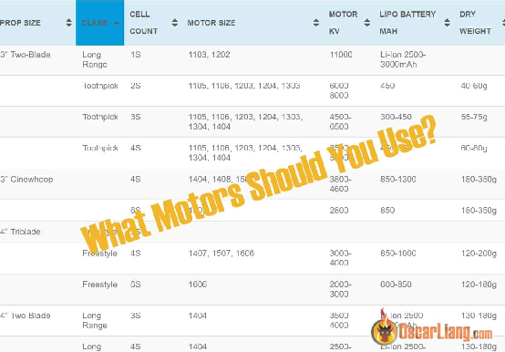
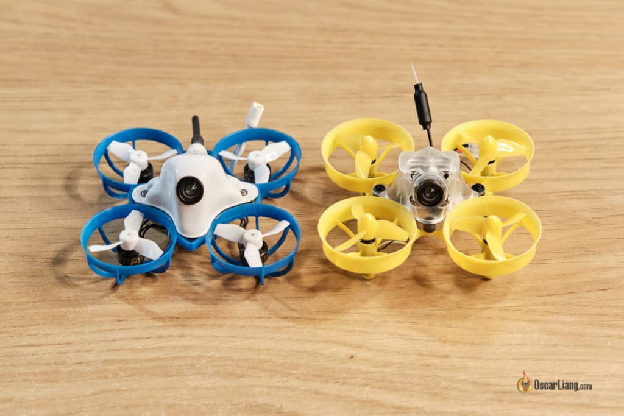
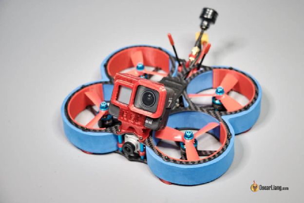
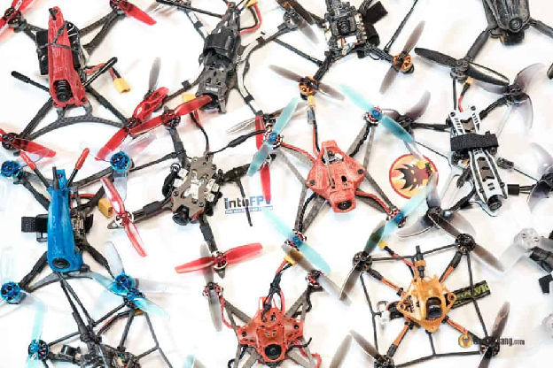
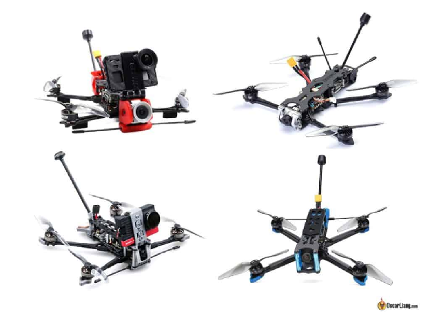
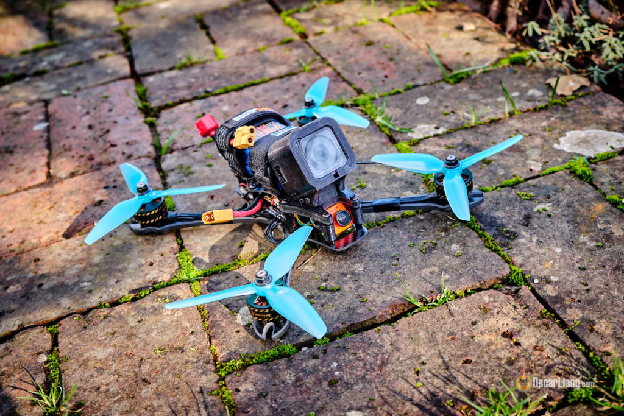

Оригінал: [https://oscarliang.com/table-prop-motor-lipo-weight](https://oscarliang.com/table-prop-motor-lipo-weight)      
Стисле посилання на цей переклад: [https://bit.ly/LiangFPVLookupTable](https://bit.ly/LiangFPVLookupTable) 

| 🫂 | Нижче вичитаний людьми машнний український переклад оригіналу. Для [VictoryDrones](https://www.victory-drones.com/) переклад вичитали: Ви\!. Хочете покращити переклад чи знайшли помилку? — Лишіть коментар (Ctrl+Alt+M або «Меню» \> «Вставка» \> «Коментар»). Ми теж живі люди (як і ви) і робим помилки. Роботи їх, до речі, також роблять 😉 |
| :---: | :---- |

# Корисна табличенька комбінацій для збірок FPV-дронів: розміри двигуна i рами, KV двигунa, кількість елементів LiPo батареї i вага.

# 

17 березня 2021 року

Вибір правильного розміру двигуна, та такого параметру як KV двигуна, для FPV-дрона може бути складним завданням, особливо якщо треба, також, обрати розмір пропелера та вольтаж LiPo-батареї. Хоча однозначної відповіді i немає, цей посібник пропонує низку варіантів на основі мого багаторічного досвіду створення різних збірок.

*Деякі посилання на цій сторінці є партнерськими. Я отримую комісію (без додаткових витрат для вас), якщо ви робите покупку після натискання одного з цих партнерських посилань. Це допомагає підтримувати безкоштовний вміст для спільноти на цьому веб\-сайті. Будь ласка, прочитайте наш [Політика партнерських посилань](https://oscarliang.com/affiliate-program-policy/) для отримання додаткової інформації.*

Хочете дізнатися, як створити безпілотник FPV з нуля? Перегляньте мій вичерпний підручник тут:[https://oscarliang.com/how-to-build-fpv-drone/](https://oscarliang.com/how-to-build-fpv-drone/)

Зміст

[Таблиця компонентів FPV-дронa](#таблиця-компонентів-fpv-дронa)

[Що таке Вyп \[ Whoop \] ?](#що-таке-вyп-[-whoop-]-?)

[Що таке Сіневуп \[ Cinewhoop \] ?](#що-таке-сіневуп-[-cinewhoop-]-?)

[Що таке Надлегкий \[ Ultralight \] FPV-дрон?](#що-таке-надлегкий-[-ultralight-]-fpv-дрон?)

[Що таке FPV-дрон великого радіусу дії \[ LR \- long range \] ?](#що-таке-fpv-дрон-великого-радіусу-дії-[-lr---long-range-]-?)

[Що таке Фрістайл \[ Freestyle \] FPV-дрон?](#що-таке-фрістайл-[-freestyle-]-fpv-дрон?)

[Заключна частина](#заключна-частина)

[Історія редагування](#історія-редагування)

## **Таблиця компонентів FPV-дронa** {#таблиця-компонентів-fpv-дронa}

Ця довідкова таблиця розроблена, щоб допомогти тим, хто збирає новий FPV-дрон i шукає найкращу комбінацію двигуна та пропелера. Важливо зазначити, що це не вичерпний список, а скоріше збірка поширених і успішних прикладів для різних розмірів пропелера і кількості елементів LiPo батареї.

Я намагався включити якомога більше прикладів, але якщо вам є що додати, поділіться своєю думкою в коментарях нижче. Ваші відгуки є безцінними i роблять цей ресурс для любителів FPV-дронів ще кращим.

**Довідкова таблиця:**

| Розмір пропелера | Клас | Кількість елементів батареї  | Розмір двигуна | Коефіцієнт (KV) | Ємність батареї LiPo, мАг(міліампер /годину) | “Суха” вага |
| ----- | ----- | ----- | ----- | ----- | ----- | ----- |
| 31мм  | Вуп | 1S | 0603, 0802 | 18000-25000 | 300-450 | 20-30г |
|  |  | 2S | 0802 | 12000 | 300 | 20-30г |
| 40мм  | Вуп | 1S | 0802, 1102 | 15000-18000 | 450 | 25-35г |
|  |  | 2S | 0802, 0806, 1103 | 10000-16000 | 300-450 | 30-60г |
|  |  | 3S | 1102, 1103 | 8000-11000 | 300-450 | 40-70г |
| 2" 3-лопатевий |  | 2S | 1103, 1105, 1106 | 6000-11000 | 300-450 | 60-80г |
|  |  | 3S | 1104, 1105, 1106 | 5500-7500 | 300-450 | 60-100г |
|  |  | 4S | 1105, 1106 | 5000-6000 | 450-650 | 70-130г |
| 2,5" 3-лопатевий |  | 2S | 1104 | 5000-6000 | 300 | 55-70г |
|  |  | 3S | 1106 | 4500 | 650 | 120-140г |
|  |  | 4S | 1304, 1404 | 4500-5000 | 450-850 | 140-180г |
| 2,5 дюйма 2-лопатевий (65 мм) | Надлегкий | 1S | 1102 | 13500 | 300 | 25-35г |
|  | Надлегкий | 2S | 1103, 1104 | 7000-10000 | 450-520 | 40-60г |
|  | Надлегкий | 3S | 1104, 1105, 1106, 1203, 1204 | 6000-8000 | 300-650 | 45-65г |
|  | Надлегкий | 4S | 1104, 1105, 1106, 1203, 1204 | 4000-4500 | 450 | 55-90г |
| 3" 3-лопатевий | Фрістайл | 2S | 1404 | 4500-5000 |  |  |
|  | Фрістайл | 3S | 1407, 1408, 1507 | 3500-4500 | 550-850 | 120-200г |
|  | Фрістайл | 4S | 1306, 1407, 1408, 1507, 1606 | 3000-4200 | 450-1000 | 140-260г |
|  | Фрістайл | 6S | 1408, 1507, 1606 | 2800-3000 | 550-650 | 140-260г |
| 3" 2-лопатевий | Далекобійність | 1S | 1103, 1202 | 11000 | Li-Ion 2500-3000mAh |  |
|  | Надлегкий | 1S | 1103, 1202, 1202.5 | 11000-14000 | 450 |  |
|  | Надлегкий | 2S | 1105, 1106, 1203, 1204, 1303 | 6000-8000 | 450 | 40-60г |
|  | Надлегкий | 3S | 1105, 1106, 1108, 1203, 1204, 1207, 1303, 1304, 1404 | 4500-6500 | 300-450 | 55-75г |
|  | Надлегкий | 4S | 1105, 1106, 1108, 1203, 1204, 1207, 1303, 1304, 1404 | 3500-5000 | 450-550 | 60-80г |
| 3"  | Сіневуп | 4S | 1404, 1408, 1507, 2203, 2204 | 3800-4600 | 850-1300 | 180-350г |
|  |  | 6S | 1507, 2203, 2204 | 2800 | 850 | 180-350г |
| 4" 3-лопатевий | Фрістайл | 3S |  |  |  |  |
|  | Фрістайл | 4S | 1407, 1507, 1606 | 3000-4000 | 850-1000 | 120-200г |
|  | Фрістайл | 6S | 1606  | 2000-3000 | 600-850 | 120-180г |
| 4 дюйми з 2-лопатевий | Надлегкий | 3S | 1306, 1404, 1406, 1408, 1504, 1505 | 3500-4500 | 650-850 | 110-130г |
|  | Надлегкий | 4S | 1306, 1404, 1406, 1408, 1504, 1505 | 2500-3000 | 450-650 | 110-130г |
|  | Далекобійність | 3S | 1404 | 3500-4000 | Li-Ion 2500-3000mAh | 130-180г |
|  | Далекобійність | 4S | 1404 | 2500-3000 | Li-Ion 2500-3000mAh | 130-180г |
| 5" 3-лопатевий | Фрістайл | 4S | 2306, 2207, 2306,5, 2207,5 | 2300 \- 2700 | 1300-1500 | 250-450г |
|  | Фрістайл | 6S | 2207, 2207,5, 2208, 2308 | 1700 \- 1950  | 1000-1300 | 250-450г |
| 5" 2-лопатевий | Надлегкий | 4S | 1606, 1806, 2004, 2204, 2205 | 2300-3000 | 750-1000 | 150-250г |
|  | Надлегкий | 6S | 1606, 1806, 2004, 2204, 2205 | 1600-2300 | 450-700 | 150-250г |
| 6" | Фрістайл | 4S | 2207, 2207,5, 2208, 2405, 2407, 2408 | 2100 \- 2500 | 1300-1800 | 250-450г |
|  | Фрістайл | 6S | 2207, 2207,5, 2208, 2405, 2407, 2408 | 1500-1800 | 1000-1500 | 250-450г |
| 7" | Фрістайл | 6S | 2510, 2806, 2806,5, 2808, 3106,5 | 980-1450 | 2200 | 350-500г |
|  | Далекобійність | 4S | 2408, 2507, 2508, 2806, 2806,5 | 1700-1900  | Li-ion 2500-3000mAh | 350-500г |
|  | Далекобійність | 6S | 2408, 2507, 2508, 2806, 2806,5 | 980-1450 | Li-ion 2500-3000mAh | 350-500г |

“Суха” вага стосується загальної ваги дрона без акумулятора. 

Ось визначення термінів, які використовуються в таблиці:

## **Що таке Вyп \[ Whoop \] ?** {#що-таке-вyп-[-whoop-]-?}

[Вуп \[ Whoop \] або Малий Вyп \[ Tiny Whoop \]](https://oscarliang.com/best-tiny-whoop/)  це невеликі квадрокоптери із захисними рамками (кожухами) навколо пропелерів. [Малi Вyп](https://oscarliang.com/best-tiny-whoop/)и зазвичай мають пропелери 31 або 40 мм. Існують також i більші [Вyп](https://oscarliang.com/best-tiny-whoop/)и, які використовують пропелери 2″ або навіть 2,5″.

## **Що таке Сіневуп \[ Cinewhoop \] ?** {#що-таке-сіневуп-[-cinewhoop-]-?}

[Сіневуп \[ Cinewhoop \]](https://oscarliang.com/cinewhoop/) – це квадрокоптер із захисними кожухами, як правило, з 3-дюймовими пропелерaми та здатний переносити GoPro для зйомки кінематографічного матеріалу.

## **Що таке Надлегкий \[ Ultralight \] FPV-дрон?** {#що-таке-надлегкий-[-ultralight-]-fpv-дрон?}

Надлегкі \[ Ultralight \] FPV-дрони, також відомі як “[Зубочистки](https://oscarliang.com/ultralight-micro-quad-toothpick/)” \[ Toothpicks \] у хобі – це надлегкі квадрокоптери з тонкими рамами та малими двигунами. Основна увага приділяється зменшенню ваги та покращенню продуктивності, а не довговічності.

## **Що таке FPV-дрон великого радіусу дії \[ LR \- long range \] ?** {#що-таке-fpv-дрон-великого-радіусу-дії-[-lr---long-range-]-?}

Основна властивість FPV-дронy великого радіусу дії \-- ефективність і [далекобійність](https://oscarliang.com/long-range-fpv-flying-mini-quad/), довготривалість польоту.  Вони зазвичай використовують комбінації менш агресивного двигуна і пропелера і працюють від [літій-іонних батарей](https://oscarliang.com/li-ion-battery-long-range/), досягаючи 15-ти,  30-ти хвилин або навіть довшого часу польоту.

## **Що таке Фрістайл \[ Freestyle \] FPV-дрон?** {#що-таке-фрістайл-[-freestyle-]-fpv-дрон?}

Фрістайл \[ Freestyle \] FPV призначений для загальних потреб, які не підпадають під жодну зі згаданих вище категорій. Він пропонує гарний баланс між продуктивністю, довговічністю та можливістю перенесення [екшн-камер](https://oscarliang.com/action-camera/)и для запису HD відео. По суті, це потужний квадрокоптер, яким ви можете насолоджуватися та з легкістю маневрувати.

## **Заключна частина** {#заключна-частина}

Я сподіваюся, що ця таблиця надала вам цінні вказівки щодо вибору відповідного розміру двигуна, розміру пропелера, KV і кількості елементів LiPo для збірки дрона. Пам’ятайте, що це лише поради, і завжди є місце для експериментів, щоб знайти ідеальне поєднання для конкретних завдань і стилю польоту. 

Вдалого конструювання та щасливого польоту\!

#### **Історія редагування** {#історія-редагування}

* Березень 2021 р. – таблицю створено  
* Квітень 2023 р. – Перегляд статті

[image1]: 

[image2]: 

[image3]: 

[image4]: 

[image5]: 

[image6]: 