Стисле посилання на цей переклад: [https://bit.ly/BardwellFPVTools](https://bit.ly/BardwellFPVTools)  

| 🫂 | Нижче вичитаний людьми машинний український переклад оригіналу. Для [VictoryDrones](https://www.victory-drones.com/) переклад вичитали: VPS, Block. Хочете покращити переклад чи знайшли помилку? — Лишіть коментар (Ctrl+Alt+M або «Меню» \> «Вставка» \> «Коментар»). Ми теж живі люди (як і ви) і робим помилки. Роботи їх, до речі, також роблять 😉 |
| :---: | :---- |

# ​​Інструменти для FPV-дронів, які краще завжди мати під рукою 

# 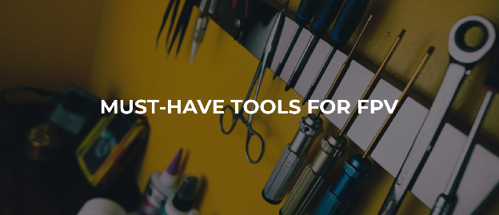Зміст

[Набори інструментів від NewBeeDrone та Flywoo](#набори-інструментів-від-newbeedrone-та-flywoo)d

[Паяльники](#паяльники)

Витяжка диму

Мультиметри та аналізатори

Гостробуці / [Кусачки](#гострогубці-[кусачки])

Зачистка дротів

Допоміжні інструменти

Тримач [PRO'SKIT 900-015](#тримач-pro’s-kit-900-015-—-найдешевший)

Монтажна шпаклівка

«Третя рука» [OMNIFIXO OF-M4.2](#«третя-рука»-omnifixo-of-m4.2-—-кращий-із-кращих-інструмент)

Магнітний лоток

Викрутки та ключі

[Щипці](#щипці)

[Запобіжник](#запобіжник)

[Пінцет](#пінцет)

[Ваги](#ваги)

[Фени](#фен)

Клейовий пістолет

Набір надфилів

Цифровий штангенциркуль

В основному всі посилання на цій сторінці є партнерськими. Я *\[автор оригінального тексту Джошуа Бардвел\]* отримую комісію (без додаткових витрат для вас), якщо ви робите покупку після натискання одного з партнерських посилань нижче. Читайте мою [Політику партнерських посилань](https://www.fpvknowitall.com/affiliate-link-policy/) для отримання додаткової інформації. Якщо це буде вперше, коли ви замовляєте на [Banggood](https://www.fpvknowitall.com/banggood/), то варто спершу дізнатися кілька речей.

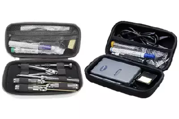

### **НАБОРИ ІНСТРУМЕНТІВ ВІД NewBeeDrone ТА Flywoo** {#набори-інструментів-від-newbeedrone-та-flywoo}

Перш ніж ви перейдете нижче, я хочу познайомити вас з набором інструментів Newbeedrone Tool Kit і Flywoo Tool Kit. У них є майже всі інструменти та матеріали, які вам знадобляться для створення квадрокоптера. Все в одному комплекті за дуже прийнятною ціною. Іншим наборам інструментів, як правило, завжди бракує якогось важливого інструменту або вони навпаки містять щось непотрібне. Ці ж настільки близькі до ідеальних, які я тільки бачив *\[прим. пер.: звучить як маркетинг, але ok\].*

Набір інструментів NewBeeDrone має дещо кращу якість інструментів, особливо [ключ для пропелерів](https://docs.google.com/spreadsheets/d/19LVBAK-7Hr11sl06hOlt_Ib6RLhJ8HAjS0fPe6Encqc/edit?pli=1#gid=0&range=A276) *\[prop wrench\].* Набір інструментів Flywoo містить більшу кількість інструментів, включаючи мій улюблений портативний мультиметр. Flywoo також трохи дорожчий.

[**Купити в NewBeeDrone**](https://newbeedrone.com/products/newbeedrone-tool-kit?aff=10) | [**Купити на GetFPV**](https://www.getfpv.com/flywoo-fpv-quad-tool-kit-w-multimeter-and-soldering-iron.html?cmid=eHZ3Y2tBWGYrQWM9&afid=bXNoK0JSMUViaGc9&ats=ZFNOTFdoUEM1V2s9) | [**Купити в Flywoo**](https://flywoo.net/collections/tools-building-supplies-hardware/products/flywoo-fpv-quad-tool-kit-multimeter-solder-iron-w-tool-bag?sca_ref=521696.bxtbSC8VXY)

## **ПАЯЛЬНИКИ** {#паяльники}

Без паяльника дрон не побудуєш. Ну... ви можете, але це буде безлад. Найважливіша характеристика вашого паяльника — *контроль температури.* Паяльник з регульованою температурою швидко досягає точної регульованої температури. Він може однаково добре працювати на крихітних [контактних майданчиках](https://docs.google.com/spreadsheets/d/19LVBAK-7Hr11sl06hOlt_Ib6RLhJ8HAjS0fPe6Encqc/edit?pli=1#gid=0&range=A202) і гігантських роз’ємах XT60. Він не зіпсується через перегрів, якщо залишити його на деякий час.

### **SEQURE SQ-D60B — найдешевший вартий уваги № 1**

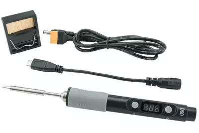  
Sequre SQ-D608B є, мабуть, найкращим паяльником у світі за співвідношенням ціни та якості. Він заснований на дизайні дивовижного TS100, ціну було знижено завдяки видаленню фантастичного РК-екрану та інших зручних функцій. Але продуктивність паяння сердечників така ж, якою славиться TS100\! І він може використовувати такі ж високоякісні жала, як і TS100\!

Якщо ви тільки починаєте роботу і хочете придбати паяльник з обмеженим бюджетом, це саме те\! Ви можете використовувати його у майстерні, щоб зробити свій дрон, а потім взяти його в поле, щоб відремонтувати дрон після того, як ви його розбили. Основна причина, щоб вибрати щось інше, але дорожче — це простота використання та ергономіка. Лабораторний паяльник матиме більшу та зручнішу ручку (і її можна підключити в розетку замість використання батареї).

Знайти цей продукт можна у наступних постачальників:  
[**Купити на GetFPV**](https://www.getfpv.com/sequre-sq-d60b-mini-soldering-iron-w-ts-d24-tip.html?cmid=eHZ3Y2tBWGYrQWM9&afid=bXNoK0JSMUViaGc9&ats=ZFNOTFdoUEM1V2s9) | [**Купити на RaceDayQuads**](https://www.racedayquads.com/products/sequre-sq-d60b-mini-soldering-iron-w-ts-b2-tip?aff=2) | [**Купити в Banggood**](https://usa.banggood.com/SQ-D60-60W-Digital-Soldering-Iron-Station-DC12-24V-Type-C-Interface-100-400-Adjustable-Temperature-p-1653661.html?utm_campaign=1211488_february&utm_content=2635&p=UG06171211488201502B&ID=514802&cur_warehouse=CN)

### **Паяльна станція AOYUE 469 — найдешевша варта уваги №2**

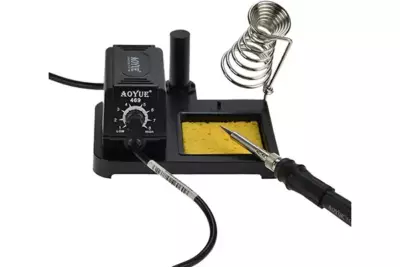

Я вперше дізнався про паяльні станції Aoyue у своєму [інтерв'ю з Ренді Рубінштейном](https://www.youtube.com/watch?v=KPbozW0Y3p4) від SRA Solder. Окрім надійності та функціональноті, паяльник  Aoyue виділяється широким асортиментом аксесуарів і запасних частин. Це не заміна паяльника, коли інший зламається. Насправді, якщо ви перебуваєте в США, ви можете замовити запасні частини [безпосередньо від SRA](http://www.sra-solder.com/).

Порівняно з Yihua, мені більше подобається основа на Aoyue для використання за столом. Yihua може бути кращим в дорозі. Відверто кажучи, я також вважаю Aoyue якіснішим і надійнішим. Але деяким міжнародним покупцям легше придбати Yihua.

Знайти цей продукт можна у наступних постачальників:  
[**Купити на Amazon**](http://amzn.to/2CEK2nG) | [**Купити в SRA-Solder**](https://www.sra-solder.com/aoyue-469-60-watt-soldering-station?mw_aref=fdc233e49cd0724ff8580732d8b8bd86)

### 

### **TS100 — портативна рок-зірка**

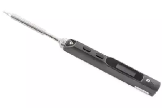

Якби цей паяльник було б хоч трохи легше тримати, це був би мій вибір №1. Але якби його було легше тримати, він був би більшим, і тоді він не був би таким неймовірно портативним. Кращого для польового ремонту просто немає.

Якщо ви хочете запустити його від LiPo, вам знадобиться кабель 2,5 мм до XT60. Ви можете зробити свій власний або [придбати його на GetFPV](https://www.getfpv.com/2-5mm-barrel-connector-to-xt60-2-feet.html?cmid=eHZ3Y2tBWGYrQWM9&afid=bXNoK0JSMUViaGc9&ats=ZFNOTFdoUEM1V2s9).

[Перегляньте мій повний відеоогляд TS100.](https://www.youtube.com/watch?v=t621xQc-xEQ)

Знайти цей продукт можна у наступних постачальників:  
[**Купити на RaceDayQuads**](https://www.racedayquads.com/products/ts100-portable-soldering-iron-programmable-smart-iron?aff=2) | [**Купити на GetFPV**](http://www.getfpv.com/ts100-digital-oled-programmable-interface-mini-soldering-iron.html?cmid=eHZ3Y2tBWGYrQWM9&afid=bXNoK0JSMUViaGc9&ats=ZFNOTFdoUEM1V2s9) | [**Купити в Rotor Riot**](https://store.rotorriot.com/ts100-soldering-iron-with-b2-tip/?aff=3)  
[**Купити в ReadyMadeRC**](https://www.readymaderc.com/products/details/ts-100-b2-soldering-iron-xt60-cable?referral_code=1B907B90) | [**Купити на Amazon**](http://amzn.to/2soFStD)

### **HAKKO FX-888D — найкращий із найкращих**

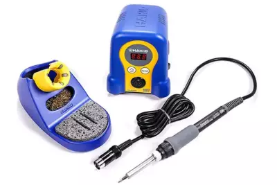

Вважається, що це найкращий паяльник, який може вибрати любитель. 888D має цифрове кнопкове керування температурою з п’ятьма попередніми налаштуваннями, щоб швидко вибрати будь-яку температуру, яка потрібна для роботи. Поставляється із міцною основою та тримачем для губки.

Знайти цей продукт можна у наступних постачальників: [**Купити на Amazon**](http://amzn.to/2uAuPm7)

## ВИТЯЖКА ДИМУ

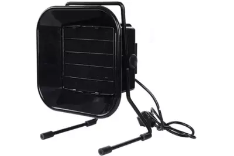

Чи отруїтесь ви свинцем, вдихаючи пари припою? Насправді ні. Пайка недостатньо гаряча, щоб випаровувати свинець. Тоді що то за дим? Це згоряє флюс у вашому припої. Повірте мені: вам не варто ним дихати.

Витяжка відводить дим пайки від вас у вугільний фільтр, де він надійно поглинається. Ви можете купити один із таких… або ви можете зробити так, як я робив багато років: просто затримуйте дихання щоразу, коли торкаєтеся паяльником з’єднання.

Знайти цей продукт можна у наступних постачальників:  
[**Купити в SRA**](https://www.sra-solder.com/aoyue-486-fume-extractor-and-smoke-absorber-fan/?mw_aref=fdc233e49cd0724ff8580732d8b8bd86) | [**Купити в Amazon**](https://amzn.to/2ZuQ70T)

## **МУЛЬТИМЕТРИ ТА АНАЛІЗАТОРИ**

У столяра є молоток, у м’ясника є ніж, а у любителя електроніки *повинен* бути мультиметр. Без нього ви не можете знати, що робить електрика на вашому дроні. Наприклад, [ось відео, яке я зробив](https://www.youtube.com/watch?v=Cgtsorabhsg) показує, як перевірити полярність і напругу за допомогою мультиметра.

### **INNOVA 3320 — дешево та ефективно**

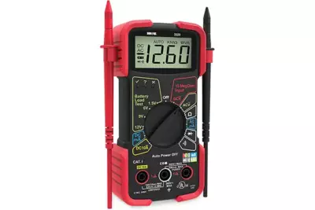

Це мій улюблений мультиметр протягом усього часу, коли займаюся цим хобі. Одного разу я купив «кращий» і ненавидів його. Цей мультиметр містить увесь функціонал, який я фактично використовую, прямо на головному циферблаті. Він досить компактний, щоб легко помістити його в сумку для польотів. Дорожчі мультиметри мають додаткову точність, надійність і функції, але я б краще витратив 20 доларів на цей.

Знайти цей продукт можна у наступних постачальників: [**Купити на Amazon**](http://amzn.to/2o8LdTO)

### **VICTOR / ZOYI VC921 — найкращий портативний мультиметр**

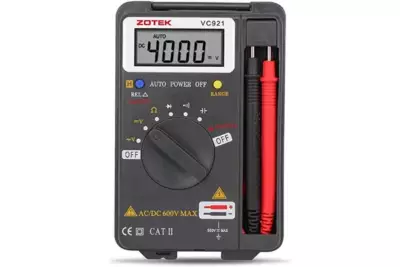  
Я знайшов VC921, коли шукав тонкий і маленький мультиметр для свого портативного набору інструментів. Я хотів, щоб він був автономним, щоб дроти не «мотилялися» по всьому рюкзаку. І я хотів, щоб він мав усі основні функції, необхідні для FPV, включно з [вимірюванням ємності](https://docs.google.com/spreadsheets/d/19LVBAK-7Hr11sl06hOlt_Ib6RLhJ8HAjS0fPe6Encqc/edit?pli=1#gid=0&range=A34) (це добре, щоб знати, чи розрядилися фільтруючі конденсатори чи ні). VC921 відповідає всім цим вимогам\!

Маючи такий дешевий продукт, цілком природно запиати себе, чи надійний він. Тому я використовував його кілька місяців, перш ніж додати його до списку. А відгуки в Інтернеті загалом здаються позитивними (хоча й не на 100%).

Основна функція, якої не вистачає в цьому мультиметрі, це вимірювання сили струму. Його взагалі немає. Але, чесно кажучи, коли я хочу виміряти силу струму, я обираю [вимірювальні кліщі](https://docs.google.com/spreadsheets/d/19LVBAK-7Hr11sl06hOlt_Ib6RLhJ8HAjS0fPe6Encqc/edit?pli=1#gid=0&range=A277). Тому я готовий відмовитися від цього, щоб отримати потужний, компактний і маленький мультиметр, такий як VC921.

Знайти цей продукт можна у наступних постачальників:  
[**Купити на Amazon**](https://amzn.to/3aMWl2F) | [**Купити в Banggood**](https://usa.banggood.com/ZOYI-VC921-Mini-Multimeter-Pocket-Tester-Portable-Digital-Autoranging-4000-Counts-AC-DC-Voltmeter-Ohm-Capacitance-Meter-Mini-p-1604685.html?utm_campaign=1211488_february&utm_content=2635&p=UG06171211488201502B)

### 

### 

### 

### 

### 

### 

### 

### **FLUKE 115 — кращий із кращих**

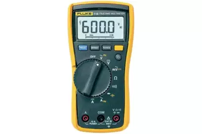

Fluke виробляє високоякісне комерційне випробувальне обладнання для професіоналів. Для любителів електроніки це, мабуть, останній мультиметр, який вам коли-небудь знадобиться купити. Він має функції, яких немає в Innova, наприклад вимірювання ємності та частоти. Але справжня причина, чому ви заплатите 150 доларів за цей мультиметр, полягає у заслуженій репутації Fluke щодо точності та куленепробивної надійності.

Знайти цей продукт можна у наступних постачальників: [**Купити на Amazon**](http://amzn.to/2tOUgfz)

### **ANENG AN8008 — викоскоточний мультиметр**

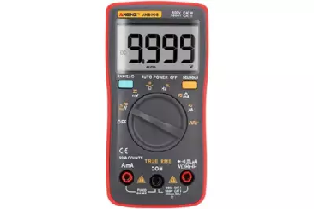

Дешеві мультиметри можуть бути такими ж точними, як і дорогі\! Фактично, роздільна здатність в 9999 розрядів *\[прим. пер. кількість цифр, які відображає мультиметр\]* AN8008 — це *винищівна поразка* роздільної здатності у 600 розрядів у моделі Fluke 115 та інших вищих за класом. Але виявилося, що точно виміряти напругу та струм не так уже й важко. Якщо ви мені не вірите, перегляньте EEVBlog із [оглядом цього мультиметра](https://www.youtube.com/watch?v=xdGQEVdxmQQ).

Тож чим ви жертвуєте у дешевшому мультиметрі, такому як AN8008? Довговічність? Звичайно. І безпека. Двічі подумайте, перш ніж використовувати цей вимірювальний прилад для вимірювання ланцюга мережі 240 вольт *\[прим. пер.: в країнах Північної Америки 240 вольт відповідає 3-фазній мережі\]\!* Але для любителя, який працює із низькою напругою і не калатає мультиметр у кузові пікапа цілий день, такий мультиметр, як AN8008, з лишком виконає роботу.

9999 розрядів цього мультиметра роблять його ідеальним для вимірювань, де потрібна висока точність, наприклад калібрування зарядного пристрою LiPo.

Знайти цей продукт можна у наступних постачальників:  
[**Купити в Banggood**](https://www.banggood.com/ANENG-AN8008-True-RMS-Digital-Multimeter-AC-DC-Current-Voltage-Resistance-Frequency-Capacitance-Test-p-1157985.html?utm_campaign=1211488_february&utm_content=2635&p=UG06171211488201502B) | [**Купити на Amazon**](http://amzn.to/2kBphAK)

### 

### **UNI-T UT210E — вимірювальні кліщі для постійного струму**

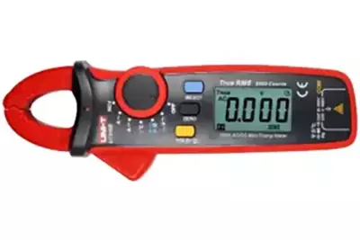

Прекрасна особливість струмовимірювальних кліщів полягає у тому, що вони можуть вимірювати силу струму, просто затиснувши кліщі навколо дроту. Ви не зрозумієте, наскільки це полегшує роботу, поки деякий час не спробуєте повимірювати струм за допомогою звичайного мультиметра. Раніше було так, що лише дорогі кліщі могли вимірювати постійний струм саме такої  сили струму, яку ми використовуємо в дронах. Але цей дешевий і функціональний.

У вас може виникнути спокуса купити *тільки* цей мультиметр, але я не рекомендую цього робити. Доступ до загальних функцій вимагає надокучливих натискань кнопок. Якщо нарешті настане день, коли ви вирішите витратити 35 доларів, щоб полегшити вимірювання сили струму, ви купите саме цей мультиметр. А доти користуйтеся іншими.

Знайти цей продукт можна у наступних постачальників: [**Купити на Amazon**](https://amzn.to/2JbJFaN)

### **N1201SA SWR METER — аналізатор антен до 2,7 ГГЦ**

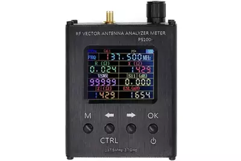

Ось брудний секрет індустрії радіостанцій: у більшості випадків насправді ніхто не перевіряє якість антен, які вам продають. Зазвичай антени сконструйовані правильно. Потім вони йдуть на виробництво, і… всі сподіваються, що їх виготовили правильно. Якщо вони працюють погано, виробник сподівається, що ви цього не помітите.

Щоб перевірити продуктивність антени, вам потрібен такий інструмент, як вимірювач КСХ N1201SA *\[прим.пер. «КСХ» — коефіцієнт стоячої хвилі від англ. «SWR» — standing wave ratio російською «КСВ»\]*. Ціна у майже 200 доларів набагато менша за тисячі доларів, які зазвичай коштують ці пристрої. Тоді у чому підступ? Одним з обмежень N1201SA є те, що він вимірює лише частоти до 2,7 ГГц. Тож він чудово підійде для тестування антен приймача 2,4 ГГц, антен Crossfire 900 МГц або R9 або будь-яких інших нижчих частот. Єдине місце, де він не працюватиме, — це FPV-антени 5,8 ГГц. А сам там, на жаль, він може бути найбільш корисним.

Якщо ви коли-небудь чули історії про те, що антени приймача FrSky мають неправильну довжину, що призводить до зменшення радіусу дії та захисту від збоїв, це інструмент, який ви використаєте, щоб виявити та вирішити цю проблему.

Знайти цей продукт можна у наступних постачальників: [**Купити на Amazon**](https://amzn.to/3IoYKTn)

### **OWLRC SWR METER — аналізатор антен до 5 ГГЦ**

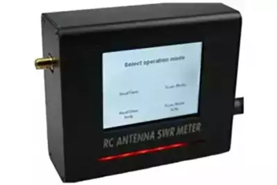

Якщо ви самі будуєте антени, то ви вже знаєте, навіщо вам потрібен вимірювач КСХ. Навіщо пересічній людині цей інструмент? Вимірювач КСХ визначає частоту, на якій антена найбільш чутлива. Його також можна використовувати, щоб визначити, чи антена несправна чи пошкоджена.

Аналізатор КСХ зазвичай коштує тисячі доларів. Вимірювач КСХ OwLRC використовує більш простий метод для вимірювання КСХ. Він доступніший, але не такий точний. Але він все ще достатньо точний, щоб бути корисним для деяких людей, які працюють з антенами 5 ГГц, і тому він у цьому списку.

Знайти цей продукт можна у наступних постачальників: [**Купити в Banggood**](https://www.banggood.com/OWLRC-Upgraded-5_8GHz-RC-Antenna-SWR-Meter-V2-With-TFT-2_8-Inch-Touch-Screen-Built-in-200mw-Transmitter-p-1525239.html?utm_campaign=1211488_february&utm_content=2635&p=UG06171211488201502B)

### 

### **IMMERSIONRC POWER METER V2 — перевірте вихідну потужність VTX**

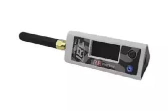

Прилади для вимірювння потужності радіосигналу зазвичай коштують тисячі доларів. Але вам не потрібна точність лабораторного рівня... Ви просто хочете знати, чи працює ваш відеопередавач\! Ось для цього підходить вимірювач потужності радіосигналу ImmersionRC. Цей виробник вручну калібрує кожен вимірювач потужності радіосигналу за приладом лабораторного рівня вартістю 30 000 доларів США. Тоді вони відправляють його вам\!

Вимірювач потужності радіосигналу ImmersionRC є ідеальним інструментом для порівняння двох відеопередавачів *\[прим. пер.: надалі — «VTX», див. також [https://bit.ly/LiangBestVTX4FPV-uk-UA](https://bit.ly/LiangBestVTX4FPV-uk-UA)\]*, щоб визначити, який із них сильніший; для перевірки того, чи передає ваш VTX більше потужності по одному каналу, ніж по іншому; щоб перевірити, чи ваш VTX зменшує вихідну потужність, коли нагрівається; або просто для перевірки, чи ваш VTX взагалі передає\! Якщо ви організатор перегонів, вимірювач потужності допоможе вам швидко знайти дрони, вихідна потужність яких перевищує дозволену.

*Це неймовірно корисний інструмент, але використовувати його потрібно відповідально. НЕ РОБІТЬ ПОМИЛКИ, ЯКУ КОЛИСЬ ЗРОБИВ Я. Вимірювач потужності недостатньо точний, щоб надійно визначити, чи забезпечує VTX номінальну вихідну потужність. Це здебільшого корисно для порівняння двох пристроїв. Якщо вимірювач потужності показує, що ваш VTX потужністю 800 мВт видає лише 600 мВт, не телефонуйте виробнику та не вимагайте повернення грошей.*

Знайти цей продукт можна у наступних постачальників:  
[**Купити на GetFPV**](https://www.getfpv.com/immersionrc-rf-power-meter-v2-irc.html?cmid=eHZ3Y2tBWGYrQWM9&afid=bXNoK0JSMUViaGc9&ats=ZFNOTFdoUEM1V2s9) | [**Купити в NewBeeDrone**](https://newbeedrone.com/collections/all/products/immersionrc-rf-power-meter-v2?aff=10) | [**Купити в ReadyMadeRC**](https://www.readymaderc.com/products/details/immersionrc-irc-rf-power-meter-v2?referral_code=1B907B90)

## 

## **Гострогубці \[Кусачки\]** {#гострогубці-[кусачки]}

### **HAKKO CHP-170**

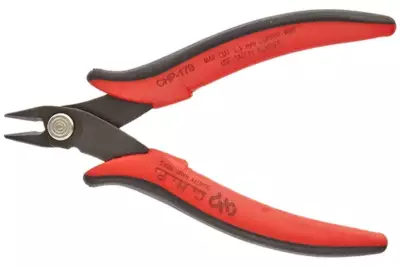

Діагональні кусачки *\[прим.пер.: також можна в мережі використовуються: кусачки прецизійні, бокорізи, кінцеві гострогубці/кусачки\]* для малої електроніки призначені для обрізання дроту врівень з платою. Вони не залишають виступаючих кінців, що можуть призвести для короткого замикання. Хороша новина щодо цього продукту полягає у тому, що вам не потрібно витрачати багато, щоб отримати такий першокласний бренд, як Hakko.

Знайти цей продукт можна у наступних постачальників: [**Купити на Amazon**](http://amzn.to/2tIeE1X)

## **КЛІЩІ ДЛЯ ЗНЯТТЯ ІЗОЛЯЦІЇ**

### **CAPRI TOOLS 20011**

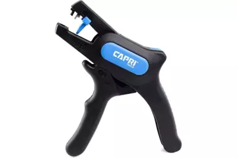

Цей інструмент не є абсолютно необхідним, тому що ви *можете* зачистити дріт діагональними кусачками, канцелярським ножем або навіть просто нігтями. Але вам буде набагато легше і ви отримаєте стабільніші результати, використовуючи автоматичний пристрій для зачистки дротів. Якщо у вас є можливість витратити ще декілька доларів — киньте цей інструмент для зачистки у кошик для покупок і ніколи не озирайтесь назад.

Знайти цей продукт можна у наступних постачальників: [**купити на Amazon**](http://amzn.to/2trsHNU)

## **ДОПОМІЖНІ ІНСТРУМЕНТИ**

Пайка, за своєю природою, вимагає принаймні чотирьох рук: одна для паяльника, одна для припою та одна для кожної з двох (або більше) частин, які ви спаюєте. Інструмент «Третя рука» утримує деталі, які ви спаюєте, поки ви маніпулюєте паяльником та припоєм. Якщо у вас *дуууже* чіпкі пальці, ви можете пропустити цей розділ.

### **Тримач PRO’S KIT 900-015 — найдешевший** {#тримач-pro’s-kit-900-015-—-найдешевший}

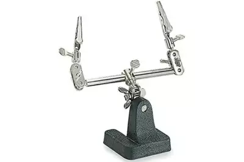  
Найпростіша і класична версія цього інструменту трохи дратує у використанні. Ви повинні вручну розташувати та загвинтити «руки» перед кожним рухом. Але ціна підходяща.

Знайти цей продукт можна у наступних постачальників: [**Купити на Amazon**](http://amzn.to/2tgSsfQ)

### **МОНТАЖНА ШПАКЛІВКА — дешевше ніж очікуєш, можливо, найкращий варіант**

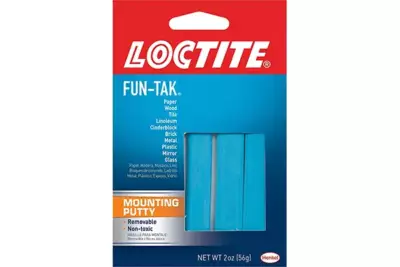  
Покладіть шматок цього матеріалу на робочу поверхню, потім приклейте до нього дріт. Зробіть те ж саме для іншого дроту. Лютуйте\! *\[прим. пер.: це автентичніша назва дієслова-кальки із російської «пайяте»\]* Монтажна шпаклівка — це секрет пайщика-хоббіста. Це швидко, універсально та дешево. Якщо ви трохи креативні, майже немає такого з’єднання, яке ви не могли б спаяти цим матеріалом.

Знайти цей продукт можна у наступних постачальників: [**купити на Amazon**](http://amzn.to/2gM7kAV)

### **«Третя рука» OMNIFIXO OF-M4.2 — кращий із кращих інструмент** {#«третя-рука»-omnifixo-of-m4.2-—-кращий-із-кращих-інструмент}

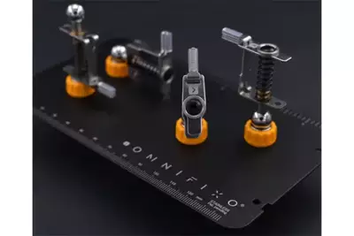  
Це найкращий інструмент «третя рука», яким я коли-небудь користувався. Магнітні основи дозволяють розташувати «руки» саме там, де вам потрібно. Руки створені з достатнім тертям, щоб залишатися на місці під час роботи, але вони плавно регулюються, щоб утримувати деталі саме так, як ви хочете. Ви навіть можете використовувати затискачі для живлення компонентів, якщо хочете\! Я користуюся цією системою місяцями, і мені вона просто подобається.

Є лише два недоліки цієї системи. По-перше, її часто немає в наявності. По-друге, вона досить дорога у порівнянні з іншими інструментами «третя рука». Попри це — відверто раджу цю річ.

[Перегляньте відео JB про третю руку Omnifixo OF-M4.2 Makers\!](https://www.youtube.com/watch?v=ujYq5HQ6kJQ)

Знайти цей продукт можна у наступних постачальників: [**купити в Omnifixo**](https://omnifixo.com/)

### **МАГНІТНИЙ ЛОТОК**

Цей магнітний лоток утримує гвинти, щоб ви їх не втратили. Магнітна основа підносу означає, що ви можете прикріпити його де завгодно. [Stingersswarm](https://www.youtube.com/user/stingersswarm) ставить один на дверцятах свого хетчбека, щоб він міг примагнічувати туди речі, коли виконується польовий ремонт.

Знайти цей продукт можна у наступних постачальників:  
[**Купити на Amazon**](https://amzn.to/3Xy96VF) | [**Купити в Banggood**](https://usa.banggood.com/Effetool-3-Inch-Magnetic-Parts-Tray-Portable-Magnetic-Nut-Bolt-Tray-Magnetic-Orgnization-Tool-p-1331016.html?p=UG06171211488201502B&utm_campaign=1211488_february&utm_content=2635)

## **ВИКРУТКИ ТА КЛЮЧІ**

Це можуть бути найважливіші інструменти, якими ви будете користуватися. Може виникнути спокуса заощадити гроші, придбавши модульний інструмент зі змінними насадками. Не робіть цього. Необхідність міняти біти місцями туди-сюди посеред збірки — це надзвичайно, надзвичайно дратує. Я покажу вам відповідні набори інструментів із спеціальним інструментом для кожної мети за ціною, яку ви зможете собі дозволити.

### **NEEWER TITANIUM — шестигранні викрутки**

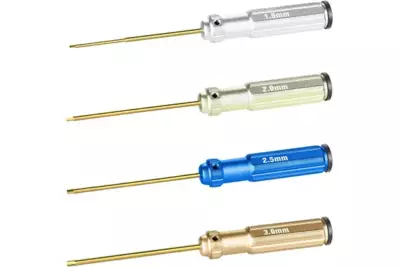

Якщо ви новачок у світі мультироторів, ви можете подумати, що вам підійде [шестигранний ключ](https://docs.google.com/spreadsheets/d/19LVBAK-7Hr11sl06hOlt_Ib6RLhJ8HAjS0fPe6Encqc/edit?pli=1#gid=0&range=A279) Ikea, який у вас залишився після збірки меблів. Не підійде. [Гвинти із метричною головкою](https://docs.google.com/spreadsheets/d/19LVBAK-7Hr11sl06hOlt_Ib6RLhJ8HAjS0fPe6Encqc/edit?pli=1#gid=0&range=A278), які використовуються на дронах, зазвичай мають шестигранні головки, а належна викрутка — це подарунок для ваших зап’ясть. Вони неймовірно хороші за свою ціну. Єдина заковика полягає в тому, що вам потрібно нанести трохи синього [Loctite](https://www.hisco.com/loctite-cyanoacrylate-adhesive) на гвинт, який тримає насадку в ручці, інакше вона розкрутиться.

Знайти цей продукт можна у наступних постачальників: [**купити на Amazon**](http://amzn.to/2nbfQYE)

### **PRO’S KIT 1PK-9402 — набір гайкокруток**

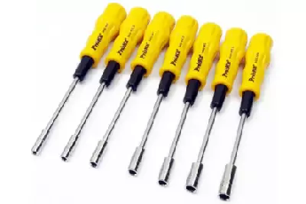

Чесно кажучи, ви будете використовувати лише дві викрутки з набору на своєму дроні: 8 мм і 5,5 мм. Викрутка на 8 мм призначена для [пропелерних гайок](https://docs.google.com/spreadsheets/d/19LVBAK-7Hr11sl06hOlt_Ib6RLhJ8HAjS0fPe6Encqc/edit?pli=1#gid=0&range=A280), де вам, ймовірно, знадобиться щось із більшою силою закручування, а викрутка на 5,5 мм призначена для гайок M3, які використовуються на стеках керування польотом.

Ви знаєте, якщо подумати, я не впевнений, що цей набір того вартий. Звичайно, я радий мати 5,5-мм [гайкокрут](https://docs.google.com/spreadsheets/d/19LVBAK-7Hr11sl06hOlt_Ib6RLhJ8HAjS0fPe6Encqc/edit?pli=1#gid=0&range=A281), коли я встановлюю нейлонові гайки M3. І я щойно зрозумів, що набір інструментів Rotor Riot Kwad має три шестигранні викрутки та гайкокрут 5,5 мм за таку саму ціну, як і цей набір. Так отож. Купіть його замість цього.

Знайти цей продукт можна у наступних постачальників: [**купити на Amazon**](https://amzn.to/2O94nMn)

### **STARTECH 7PC — набір викруток**

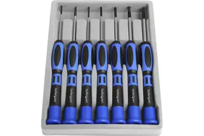

У цьому списку є кілька наборів: вам потрібен набір із 7 предметів. Ви можете відмовитися від двох викруток Torx, оскільки вони зазвичай не використовуються на дронах. Інші хрестові та плоскі викрутки – саме те, що вам потрібно.

Знайти цей продукт можна у наступних постачальників: [**Купити на Amazon**](http://amzn.to/2nbm5LQ)

### 

### **Набір шестигранних КЛЮЧІВ ІЗ КУЛЬКОВОЮ ГОЛОВКОЮ фірми “MIP”** *\[ЕмАйПі\]*

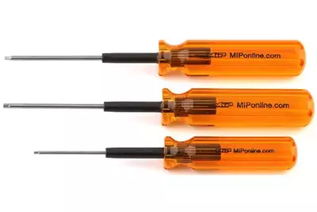

M2, M2.5 і M3

КОЛИ ГРОШІ — НЕ ПИТАННЯ.

Знайти цей продукт можна у наступних постачальників:  
[**Купити на Amazon**](https://amzn.to/37oZyb4)

### **GEARWRENCH 9108 — гайковий ключ із тріскачкою**

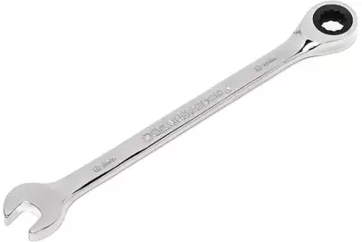

На мою думку, ця маленька красуня є єдиним найкращим способом встановлення та зняття аксесуарів на вашому дроні. Торець гайкового ключа має тріскачки, тож ви отримуєте швидке вкручування та викручування без необхідності використовувати [торцеву головку](https://docs.google.com/spreadsheets/d/19LVBAK-7Hr11sl06hOlt_Ib6RLhJ8HAjS0fPe6Encqc/edit#gid=0&range=A284). Вона також займає менше місця у сумці для інструментів, ніж аналог із торцевою головкою.

Спочатку може бути важко визначити, у якому напрямку рухатиметься тріскачка. Ось порада: головка із відкритим кінцем «дивиться» в тому напрямку, куди гайковий ключ обертатиме гайку.

Знайти цей продукт можна у наступних постачальників: [**купити на Amazon**](http://amzn.to/2gRYh1m)

### 

### **ІНСТРУМЕНТИ ROTOR RIOT KWAD — найдешевше варте уваги**

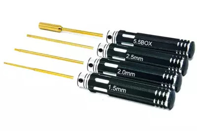

У цьому наборі інструментів ви отримаєте найпоширеніші шестигранні викрутки та гайкокрут на 5,5 мм. Це трохи дешевше, ніж якщо купувати наведені вище набори окремо. Це особливо економно, тому що наведений вище набір гайкокруток змушує вас платити за п’ять гайкокруток, коли насправді вам потрібно лише дві. Головне, чого не вистачає в цьому наборі — гайкокрут на 8 мм для пропелерних гайок, але я в будь-якому випадку віддаю перевагу гайковому ключу з тріскачкою.

Знайти цей продукт можна у наступних постачальників: [**купити в Rotor Riot**](https://store.rotorriot.com/rotor-riot-kwad-toolset/?aff=3)

### **КЛЮЧ SPEDIX QUAD ІЗ ОДНОНАПРАВЛЕНИМИСТОРОННІМИ ВАЛЬНИЦЯМИ** \[кальк. рос.: «підшипниками»\]

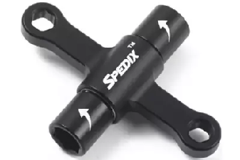

Чотиристоронній Гайковий ключ «для коптера» Spedix може просто скинути з трону гайковий ключ із тріскачкою (вище) як мій улюблений спосіб встановлення та зняття пропелерів *\[прим. пер.: трохи «маркетинговий» винахід. Цей «ключ для коптера» від фірми Spedix, насправді просто інструмент для звичайної гайки діаметром M5 (5 мм), але конструкцію його покращено за рахунок однонаправлених вальниць, аби пілоту було легше «докручувати» та «зривати» гайку коли відбувається заміна пропелера (аналогічно гайкам на кріпленнях диску авто при шиномонтажі). Це робиться просто затискаючи «крильця» долонями, без додаткових важелів та ключів-тріскачок — тому це дійсно зручіше у похідних умовах. На той випадок якщо знадобиться надзусилля — виробник все ж додав отвори куди пілот за бажанням може вставити стандартний важіль, отвір для якого також має діаметр М5. За потреби цей ж отвір служитиме у якості накидного ключа для гайки M5\].*

Проблема із гайкокрутами полягає в тому, що вам не вистачає [крутного моменту](https://docs.google.com/spreadsheets/d/19LVBAK-7Hr11sl06hOlt_Ib6RLhJ8HAjS0fPe6Encqc/edit?pli=1#gid=0&range=A233), і вони не тріскаються, тому їх використання займає більше часу. Ключ Spedix Quad вирішує ці проблеми. Він має внутрішні одностороннього руху вальниці, що дозволяє закручувати або знімати гайку. Один кінець гайкового ключа повертає гайку; інший кінець відвертає гайку. Рукоятка забезпечує більший крутний момент, ніж звичайний гайкокрут, але займає менше місця у сумці для інструментів. Велика перевага гайкового ключа Spedix Quad Wrench порівняно із торцевим гайковим ключем із тріскачкою полягає в тому, що він підходить, коли у вас високі лопаті, через які плоский ключ буде важко поставити на гайку. Spedix Quad підходить для будь-якого пропелера та тримає ваші пальці подалі від гострого краю лопаті.

Знайти цей продукт можна у наступних постачальників:  
[**Купити на RaceDayQuads**](https://www.racedayquads.com/products/spedix-quad-wrench-with-one-way-bearings?aff=2) | [**Купити на GetFPV**](https://www.getfpv.com/spedix-quad-wrench-w-one-way-bearings.html?cmid=eHZ3Y2tBWGYrQWM9&afid=bXNoK0JSMUViaGc9&ats=ZFNOTFdoUEM1V2s9) | [**Купити на Amazon**](https://amzn.to/2CAUFtB)

## **ЩИПЦІ** {#щипці}

### **BRIGGS PRECISION — [ЩИПЦІ КЕЛЛІ](https://docs.google.com/spreadsheets/d/19LVBAK-7Hr11sl06hOlt_Ib6RLhJ8HAjS0fPe6Encqc/edit#gid=0&range=A289)** \[також відомі як «*затискач кровоспинний»*\]

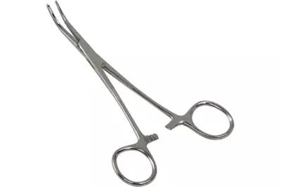

Коли я дізнався, наскільки дивовижні ці щипці, я був злий на медичних працівників за те, що вони не сказали мені цього раніше. Це може бути єдиним найбільш універсальним інструментом, яким ви коли-небудь володіли. Довгий вигнутий ніс дає змогу потрапити у вузькі місця, які часто зустрічаються на міні-дронах. Ручка ножиць забезпечує більшу міцність і точність, ніж пінцет. І вона замикається, щоб ви могли поставити затискач та робити щось інше звільненою від нього рукою, якщо буде потрібно. Як тільки у вас з’являться щипці, ви захочете мати ще кілька у своєму домі. ЯКЩО У ВАС ВИСТАЧАЄ КОШТІВ ЛИШЕ НА ЯКИЙСЬ ЄДИНИЙ ІНСТРУМЕНТ НА ЦІЙ СТОРІНЦІ, купіть собі затискач Келлі.

Знайти цей продукт можна у наступних постачальників: [**купити на Amazon**](http://amzn.to/2uJ91Vw)

## **ЗАПОБІЖНИК** {#запобіжник}

### **VIFLY SHORTSAVER 2**

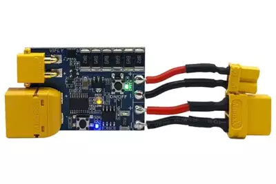

Лише секунда потрібна, щоб помилка при спаюванні перетворилася на спалений польотний контролер або ЕКШ. Запобіжник захищає вашу електроніку від деяких із цих ситуацій. Коли починає протікати небезпечна кількість струму, запобіжник спрацьовує за мілісекунди, розриваючи ланцюг, так само як плавкий запобіжник.

Vifly ShortSaver є моїм улюбленим, тому що він містить електронний запобіжник, який спеціально розроблений для пайки. Він спрацьовує за мілісекунди та може багаторазово перезавантажуватися без втрати продуктивності чи збою. Він також має зручний перемикач увімкнення/вимкнення, який дозволяє вам увімкнути живлення дрона, не від’єднуючи батарею — це чудово підходить для підключення приймачів FrSky.

Знайти цей продукт можна у наступних постачальників:  
[**Купити в NewBeeDrone**](https://newbeedrone.com/products/vifly-finder-2-compatible-with-racing-drone-airplane?aff=10) | [**Купити на RaceDayQuads**](https://www.racedayquads.com/products/vifly-short-saver-2-smoke-stopper-xt30-xt60?aff=2) | [**Купити на GetFPV**](https://www.getfpv.com/vifly-shortsaver-2-smart-smoke-stopper-xt60-xt30.html?cmid=eHZ3Y2tBWGYrQWM9&afid=bXNoK0JSMUViaGc9&ats=ZFNOTFdoUEM1V2s9) |  
[**Купити на Amazon**](https://amzn.to/30XtMv5)

## **ПІНЦЕТ** {#пінцет}

### **НАБІР ПІНЦЕТІВ CROSS LOCK — ПРЯМИЙ, 45°, 90°**

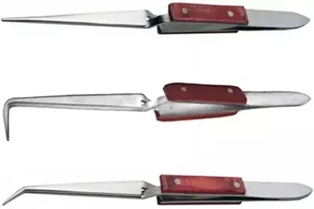

[Пінцети з хрестоподібним замком](https://docs.google.com/spreadsheets/d/19LVBAK-7Hr11sl06hOlt_Ib6RLhJ8HAjS0fPe6Encqc/edit?pli=1#gid=0&range=A292) краще звичайних [пінцетів](https://docs.google.com/spreadsheets/d/19LVBAK-7Hr11sl06hOlt_Ib6RLhJ8HAjS0fPe6Encqc/edit?pli=1#gid=0&range=A291), оскільки вони тиснуть, коли ви їх відпускаєте, тож вони продовжуватимуть тримати вашу роботу, навіть якщо ви їх відпустите. Пінцети міцно зафіксують і потенційно можуть пошкодити щось делікатне. Пінцет із хрестоподібним замком — правильний інструмент для більш делікатної роботи.

#### Знайти цей продукт можна у наступних постачальників: [**купити на Amazon**](http://amzn.to/2eWxhxM)

## **ВАГИ** {#ваги}

### **3 кг ЄМНІСТЬ / 0,1 г ТОЧНІСТЬ**

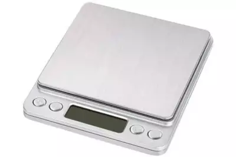

Я думаю, що ці ваги ідеально підходять для дроновода. Точності 0,1 грама достатньо, щоб зважити навіть дуже легкі предмети, такі як пропелери або окремі гвинти. Ємності в 3 кг достатньо для будь-якого дрона, який поміститься на чашу ваг. До речі про чашу, вона досить велика, щоб ви могли зважувати предмети, не закриваючи екран.

Знайти цей продукт можна у наступних постачальників:  
[**Купити в Banggood**](https://www.banggood.com/3000g-0_1g-Digital-Scale-with-Backlight-Food-Scale-For-Kitchen-Jewelry-Food-Diet-p-1126227.html?utm_campaign=1211488_february&utm_content=2635&p=UG06171211488201502B&cur_warehouse=CN&ID=42482) | [**Купити на Amazon**](https://amzn.to/2YLfO1Y)

## **ФЕН** {#фен}

Основне застосування фену – усадка термоусадочної ізоляції. Так, *можна* просто використати ізоляційну стрічку для всього, але термоусадка набагато акуратніша і менш схильна до дефектів.

### **МАЛЕНЬКИЙ, ДЕШЕВИЙ, ПОРТАТИВНИЙ**

### **ФЕН на 300W**

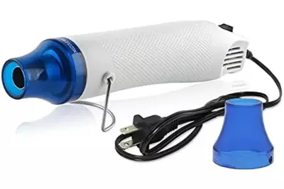

Для більшості дроноводів, яким просто потрібно щось для термоусадки, цього інструменту цілком достатньо. Більші потужні фени коштуватимуть дорожче та займатимуть більше місця на вашому столі, що не принесе користі. Ось [посилання на версію 220v](https://goo.gl/jxBGNd) для людей у ​​країнах з такою напругою.

Знайти цей продукт можна у наступних постачальників:

#### [**Купити в Banggood**](https://www.banggood.com/110V-300W-DIY-Electric-Heat-Shrink-Gun-Power-Tool-Hot-Air-Temperature-Gun-with-Supporting-Seat-p-1107127.html?utm_campaign=1211488_february&utm_content=2635&p=UG06171211488201502B) | [**Купити на RaceDayQuads**](https://www.racedayquads.com/products/300w-portable-mini-heat-gun-white?aff=2) | [**Купити в ReadyMadeRC**](https://www.readymaderc.com/products/details/portable-hot-air-gun-300w?referral_code=1B907B90)

### **ВЕЛИКИЙ, ПОТУЖНИЙ, УНІВЕРСАЛЬНИЙ**

### **WAGNER HT 1000**

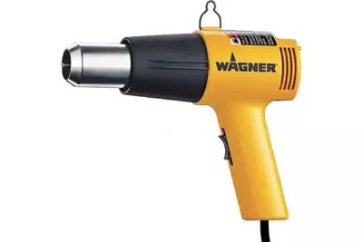

Є дві причини, чому ви б купили цей фен. По-перше, якщо ви хочете зробити більше, ніж просто [встановити термоусадку](https://docs.google.com/spreadsheets/d/19LVBAK-7Hr11sl06hOlt_Ib6RLhJ8HAjS0fPe6Encqc/edit?pli=1#gid=0&range=A293) на своєму дроні, більший фен матиме більше застосувань. Хочете видалити фарбу зі стін? Цей пістолет для вас.

Друга причина полягає в тому, що ви вважаєте, що краще, більше, гарячіше, потужніше, і вам подобається ідея розплавити випадкові пластикові предмети у вашому домі за допомогою 1200 Вт СИЛИ\!

Знайти цей продукт можна у наступних постачальників: [**купити на Amazon**](https://amzn.to/3e0ywdQ)

## **ГАРЯЧИЙ КЛЕЙОВИЙ ПІСТОЛЕТ**

Основне використання клейового пістолета у FPV — це виготовлення літаків із пінопласту. З тих пір, як я зайнявся мультироторами, я не дуже часто використовую клейовий пістолет. Гарячий клей важкий, і він погано прилипає до карбону чи металу. Але багато людей вважають цей інструмент основним у світі радіокерованого моделювання. Саме тому я все одно включив його сюди. Давайте подивимося правді в очі… щойно ви зможете склеїти речі гарячим клеєм, ви більше ніколи не дивитиметеся на світ так само.

На ринку є два види клею: низькотемпературний і високотемпературний. Низька температура для рукоділля. Для нашого хобі вам потрібна висока температура, і всі пістолети на цій сторінці здатні розплавити стержень клею високої температури.

### **ADTECH PRO200**

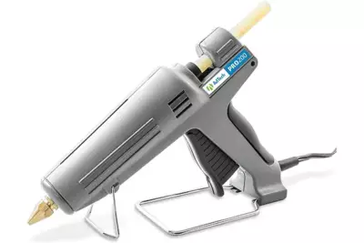

**КРАЩИЙ З КРАЩИХ**

Цей клейовий пістолет прославили найуспішніші пінопластобудівники світу: [Flite Test](https://www.flitetest.com/). Це монстр. Потужність 200 Вт нагріє його миттєво. Широка, стійка основа якимось чином не заважає під час використання. Ви почуватиметеся таким крутеликом — коли триматимете цей пістолет, що захочете зробити кобуру й носити його цілий день. І ВИ ЗРОБИТЕ КОБУРУ ДО ЦЬОГО ПІСТОЛЕТА\!

Знайти цей продукт можна у наступних постачальників: [**купити на Amazon**](https://amzn.to/2SbDzeq)

## **НАБІР НАДФИЛІВ**

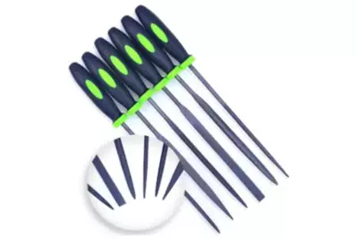

Ви використовуватимете ці надфілі, щоб модифікувати та очищати деталі рами з карбону, а також виконуватимете дрібну обробку металу, як-от очищення зрізаного кінця гвинта, який ви вкоротили. Надфілі невеликі, але частини, над якими ви працюватимете, також.

Знайти цей продукт можна у наступних постачальників: [**купити на Amazon**](https://amzn.to/2IzPbmf)

## АКУМУЛЯТОРНИЙ РОТОРНИЙ ІНСТРУМЕНТ (ГРАВЕР)

### **DREMEL 8220**

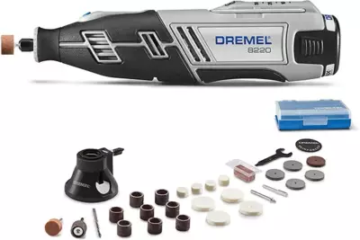

Якщо ви в нашому хобі, то, ймовірно, у вас уже є гравер Dremel. У FPV найпоширенішим використанням є відрізання гвинтів, вирізання пазів у оголених гвинтах, а також свердління та шліфування пластин із карбону. Загалом, це не є абсолютно необхідним, але якщо ви придбаєте його, це полегшить ваше життя, і ви знайдете мільйон інших застосувань для нього вдома.

Модель 8220 має вбудовану акумуляторну батарею, тож немає шнура, який би вам заважав. Швидкість регулюється від 5000 об/хв до 30 000 об/хв. Це означає, що ви можете виконувати свердління на повільних обертах і різання на високих обертах одним інструментом. Перемикач увімкнення знаходиться окремо від повзунка обертів, тому ви не скинете швидкість під час перерви. Він сумісний з усіма аксесуарами Dremel.

Знайти цей продукт можна у наступних постачальників: [**купити на Amazon**](https://amzn.to/3tK2jLI)

## **ЦИФРОВИЙ ШТАНГЕНЦИРКУЛЬ**

### **IGAGING ABSOLUTE ORIGIN**

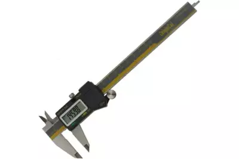

Ви можете легко заплатити сотні доларів за цифровий штангенциркуль японського виробництва. Однак це надмірно для більшості любителів. Я володію цифровим штангенциркулем iGaging Absolute Origin уже більше року і можу щиро його рекомендувати. Я віддаю перевагу шестидюймовій версії з частками дюйма, яка коштує приблизно 50 доларів. Ті, хто проживає в метричних країнах, можуть пропустити режим дробів і заощадити 10 доларів. Десять доларів лише за дроби? Справді\! Я думаю, це ціна, яку я плачу за те, щоб жити десь, де використовуються [імперська](https://uk.wikipedia.org/wiki/%D0%90%D0%BD%D0%B3%D0%BB%D1%96%D0%B9%D1%81%D1%8C%D0%BA%D0%B0_%D1%81%D0%B8%D1%81%D1%82%D0%B5%D0%BC%D0%B0_%D0%BC%D1%96%D1%80) система вимірювання.

Абсолютна початкова точка *\[Absolute origin\]* в назві означає, що він запам’ятовує нульову позицію між використаннями. Вам не потрібно кожного разу обнуляти його, як у старих штангенциркулях. Роздільна здатність 0,01 мм і точність 0,02 мм більше, ніж коли-небудь знадобиться більшості любителів. Він навіть має вихід USB для швидкого введення вимірювань в електронну таблицю.

Знайти цей продукт можна у наступних постачальників: [**купити на Amazon**](https://amzn.to/2CAM8qA)

[image1]: 

[image2]: 

[image3]: 

[image4]: 

[image5]: 

[image6]: 

[image7]: 

[image8]: 

[image9]: 

[image10]: 

[image11]: 

[image12]: 

[image13]: 

[image14]: 

[image15]: 

[image16]: 

[image17]: 

[image18]: 

[image19]: 

[image20]: 

[image21]: 

[image22]: 

[image23]: 

[image24]: 

[image25]: 

[image26]: 

[image27]: 

[image28]: 

[image29]: 

[image30]: 

[image31]: 

[image32]: 

[image33]: 

[image34]: 

[image35]: 

[image36]: 

[image37]: 

[image38]: 