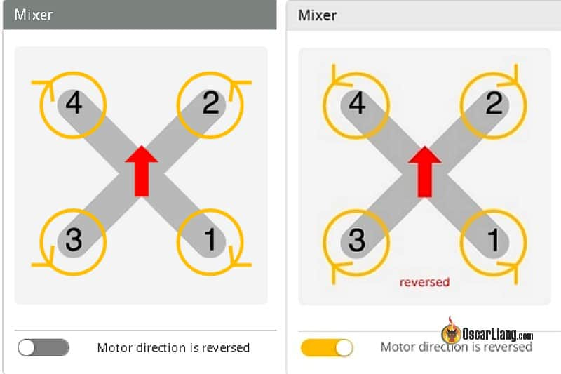
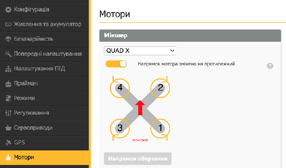
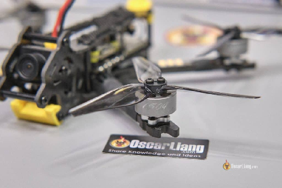
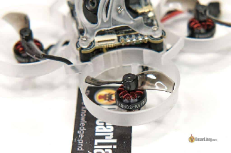
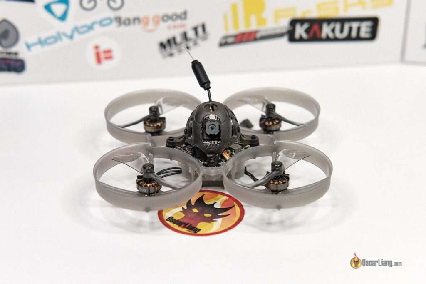
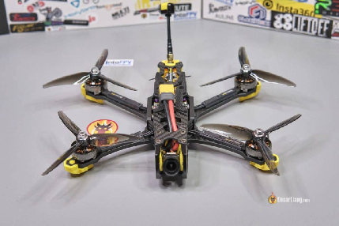
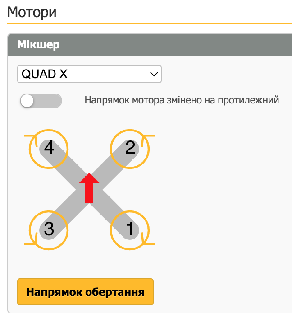
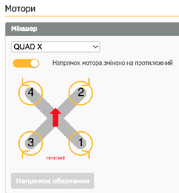

Стисле посилання на цей переклад: [https://bit.ly/Prop-in-out](https://bit.ly/Prop-in-out)

|  | Нижче вичитаний людьми машинний український переклад оригіналу. Для [VictoryDrones](https://www.victory-drones.com/) переклад вичитали: Faina, Max Well\!. Хочете покращити переклад чи знайшли помилку? — Лишіть коментар (Ctrl+Alt+M або «Меню» \> «Вставка» \> «Коментар»). Ми теж живі люди (як і ви) і робим помилки. Роботи їх, до речі, також роблять 😉 |
| :---: | :---- |

# **Обертання пропелерів на камеру чи на польотний контролер: який напрямок обертання обрати?**  {#обертання-пропелерів-на-камеру-чи-на-польотний-контролер:-який-напрямок-обертання-обрати?}

6th January 2024

## **Стандартне обертання** {#стандартне-обертання}

FPV дрони поєднують високошвидкісні польоти з швидкими змінами напрямку. Ключовим рішенням при конфігурації дрона є напрямок обертання пропелерів, відомий як «Props In» (обертання на камеру) і «Props Out» (обертання від камери, на польотний контролер). Розуміння цих конфігурацій може суттєво вплинути на ваш досвід польотів. У цій статті обговорюються переваги та недоліки кожного з них.

 

Зміст 

	**[1](#обертання-пропелерів-на-камеру-чи-на-польотний-контролер:-який-напрямок-обертання-обрати?)**

[Стандартне обертання	1](#стандартне-обертання)

[Що таке «обертання всередину» та «обертання назовні»?	2](#що-таке-«обертання-всередину»-та-«обертання-назовні»?)

[Що краще?	3](#що-краще?)

[Переваги конфігурації «Oбертання всередину»:	4](#переваги-конфігурації-«oбертання-всередину»:)

[Недоліки конфігурації «Oбертання всередину»:	4](#недоліки-конфігурації-«oбертання-всередину»:)

[Переваги конфігурації «Oбертання назовні»	5](#переваги-конфігурації-«oбертання-назовні»)

[Недоліки конфігурації «Oбертання назовні»	5](#недоліки-конфігурації-«oбертання-назовні»)

[Як вибрати?	5](#як-вибрати?)

[Як змінити напрямок обертання	6](#як-змінити-напрямок-обертання)

[Висновок	7](#висновок)

*Деякі посилання на цій сторінці є партнерськими. Я \[автор англомовної версії Оскар Ланг\] отримую комісію (без додаткових витрат для вас), якщо ви робите покупку після натискання одного із цих партнерських посилань. Це допомагає підтримувати безкоштовний контент для спільноти на цьому веб\-сайті. Будь ласка, прочитайте нашу [Політику партнерських посилань](https://oscarliang.com/affiliate-program-policy/) для отримання додаткової інформації.*

## **Що таке «обертання всередину» та «обертання назовні»?**  {#що-таке-«обертання-всередину»-та-«обертання-назовні»?}

  
**Oбертання всередину** *\[Props in\]* (також відомий як "стандартне" обертання): Це більш традиційна конфігурація, де передній лівий і задній правий пропелери обертаються за годинниковою стрілкою, а передній правий і задній лівий пропелери обертаються проти годинникової стрілки. Це налаштування за замовчуванням у більшості програмного забезпечення польотних контролерів. І оскільки передні пропелери обертаються у напрямку на камеру, це також називається "обертання всередину".

**Oбертання назовні** (також відомі як "протилежне" обертання): У цій конфігурації обертання всіх пропелерів змінюється – передні праві та задні ліві пропелери обертаються за годинниковою стрілкою, тоді як передні ліві та задні праві обертаються проти годинникової стрілки. Оскільки передні пропелери обертаються від об'єктива камери, це також називається "обертання назовні".

## **Що краще?** {#що-краще?}

Обидві конфігурації піднімуть ваш квадрокоптер у небо без проблем, жодна з них не є принципово кращою. Але розуміння переваг і недоліків кожної конфігурації допоможе вам прийняти обґрунтоване рішення. 

#### **Переваги конфігурації «Oбертання всередину»:** {#переваги-конфігурації-«oбертання-всередину»:}

1. **Звичність**: Багато пілотів вважають цю конфігурацію більш інтуїтивною, оскільки це традиційна та стандартна конфігурація, яка використовується в більшості дронів і програмного забезпечення для польотних контролерів.

#### **Недоліки конфігурації «Oбертання всередину»:** {#недоліки-конфігурації-«oбертання-всередину»:}

1. **Бруд на лінзі**: Існує більша ймовірність того, що бруд буде кидатися в бік об'єктива камери, що з часом забруднює лінзу.  
2. **Пропвош**: Конфігурація «oбертання всередину» іноді може призводити до більшого пропвошу, коли дрон летить у власній турбулентності, що потенційно впливає на стабільність.

#### **Переваги конфігурації «Oбертання назовні»** {#переваги-конфігурації-«oбертання-назовні»}

1. **Покращений контроль:** Зворотне обертання може забезпечити кращий контроль, особливо нa крутих поворотах. Перевага та ефект особливо помітні для менших квадрокоптерів, таких як малі вупи та інші мікро квадрокоптери з низьким крутним моментом.  
2. **Менше перешкод:** Менша ймовірність перешкод від гілок і гоночних воріт, оскільки вони просто відскакують від перешкод при зіткненнях.

#### **Недоліки конфігурації «Oбертання назовні»** {#недоліки-конфігурації-«oбертання-назовні»}

1. **Бруд на стеку FC/ESC**: Існує більша ймовірність того, що сміття та бруд будуть закидатися у стек польотного контролера.

2. **Період адаптації**: Пілотам, які звикли до стандартного обертання, може знадобитися час, щоб пристосуватися до конфігурації oбертання назовні.

3. **Проблема з режимом Черепахи**: Коли ви використовуєте режим черепахи, пропелери обертаються в протилежному напрямку, коли ви перевернуті догори дном, тому ви частіше забруднюєте об'єктив.

## **Як вибрати?** {#як-вибрати?}

Рішення залежить від особистих уподобань та вимог.  
Для малих вупів та мікроквадрокоптерів рекомендується обертання «назовні». 

Для дронів більших за 3″, наприклад, 5″, я використовую стандартні налаштування (обертання всередину), оскільки переваги в характеристиках польоту менш помітні. І мені не потрібно постійно нагадувати собі про необхідність переналаштувати дрон після оновлення Betaflight. Однак інші незначні переваги залишаються актуальними, наприклад, менше бруду потрапляє на об'єктив і менше шансів, що його заблокують гілки або гоночні ворота.

  
Якщо ваш дрон здебільшого зависає на одному місці, як це робить DJI Mavic, то різниця між конфігураціями пропелерів всередину чи назовні буде незначною.

Однак, якщо ви стикаєтеся з дивною поведінкою в польоті та проблемами, особливо на cinewhoops *\[кінематографічний вуп\]*, варто експериментувати з обома конфігураціями пропелерів всередину та назовні; це часто вирішує проблему.

## **Як змінити напрямок обертання** {#як-змінити-напрямок-обертання}

За замовчуванням Betaflight працює з налаштуванням "обертання всередину". Деякі попередньо зібрані дрони BNF («з'єднай (пульт) і лети») можуть бути налаштовані на "обертання назовні" на заводі.  
Щоб налаштувати ваш дрон на "обертання назовні", вам потрібно зайти в Betaflight Configurator, в розділі “Мотори”, під “Мікшер”, увімкнути “Напрямок мотора змінено на протилежний”.  

Потім дотримуйтесь цього підручника, щоб змінити напрямок обертання мотора: [https://bit.ly/LiangChangeMotorSpinDirection](https://bit.ly/LiangChangeMotorSpinDirection)    

## **Висновок** {#висновок}

Чи ви вибираєте, щоб пропелери обертались всередину, чи щоб обертались назовні, розуміння наслідків кожної конфігурації є ключовим для оптимізації продуктивності вашого FPV дрона. Обидві конфігурації мають свої переваги та можуть бути ефективними в різних сценаріях. Зрештою, йдеться про те, щоб знайти баланс, який найкраще підходить для вашого стилю та потреб.

**Edit History**

* Jun 2017 – Article published  
* May 2019 – Updated guide  
* Jan 2024 – Updated guide

##### 

**21 COMMENTS**

JAY

21st August 2017 \- 1:12 am

Я встановив регулятори обертів ESC на мотори, і вони обертаються у зворотному напрямку. Я не можу отримати доступ до BLHeli32, щоб змінити напрямок (або навіть змусити dshot600 працювати). Я знаю, що можу поміняти місцями два кабелі мотора, щоб змінити напрямок, але я задоволений тим, як проведено дроти і не хочу їх переставляти. Я погуглив про протилежний напрямок обертання і знайшов чудову сторінку. Чи матимуть праві та ліві різьби на стійках пропелерів якийсь негативний ефект тут? У мене є напрямні різьби, і я думаю, щоб пропелери і гайки не злітали, мені доведеться замінити всі мотори, щоб працювати зі протилежним напрямком обертання. Чи є напрямок різьби важливою деталлю, на яку слід звертати увагу тут? Я новачок у цьому хобі. Дякую.

[REPLY](https://oscarliang.com/reversed-motor-prop-rotation-quadcopter/#comment-15284)

OSCAR

21st August 2017 \- 3:04 pm  
Найкраще встановлювати різьби правильно відповідно до напрямку обертання моторів. Тоді ваші пропелери не відлетять під час польоту. Але якщо ви перевіряєте надійність з'єднання перед кожним польотом, то це не така вже й велика проблема :)

[REPLY](https://oscarliang.com/reversed-motor-prop-rotation-quadcopter/#comment-15302)

### 

[image1]: 

[image2]: 

[image3]: 

[image4]: 

[image5]: 

[image6]: 

[image7]: 

[image8]: 

[image9]: 

[image10]: 