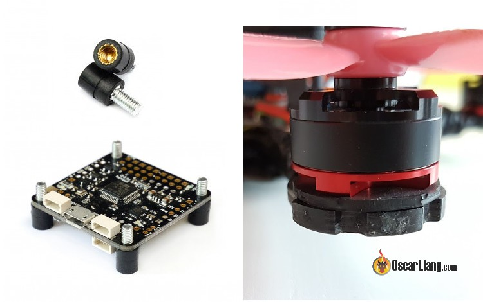
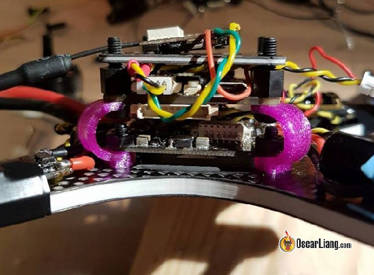
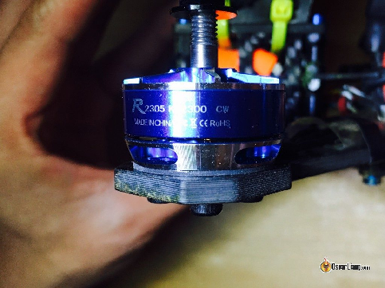

Стисле посилання на цей переклад: [https://bit.ly/LiangSoftMountingFC](https://bit.ly/LiangSoftMountingFC) 

|  | Нижче вичитаний людьми машнний український переклад оригіналу. Для [VictoryDrones](https://www.victory-drones.com/) переклад вичитали: Faina, Samsonovych. Хочете покращити переклад чи знайшли помилку? — Лишіть коментар (Ctrl+Alt+M або «Меню» \> «Вставка» \> «Коментар»). Ми теж живі люди (як і ви) і робим помилки. Роботи їх, до речі, також роблять 😉 |
| :---: | :---- |

# **М'який монтаж польотних контролерів і моторів**

9 травня 2017*\[\!\!\!\]* р

З моторами високої потужності польотний контроллер *\[«польотнік»\]* FC може відчувати високочастотний механічний шум, що призводить до вібрації та коливань під час польоту. М’яке кріплення – це спосіб ізоляції вібрацій, щоб вони не потрапляли на датчик гіроскопа на нашому польотному контролері.

*Деякі посилання на цій сторінці є партнерськими. Я \[автор англомовної версії Оскар Ланг\] отримую комісію (без додаткових витрат для вас), якщо ви робите покупку після натискання одного із цих партнерських посилань. Це допомагає підтримувати безкоштовний контент для спільноти на цьому веб\-сайті. Будь ласка, прочитайте нашу [Політику партнерських посилань](https://oscarliang.com/affiliate-program-policy/) для отримання додаткової інформації.*

Перегляньте цей список, щоб дізнатися більше: [поради щодо](https://oscarliang.com/quadcopter-building-flying-tips-tricks/) збірки дронів.

Зміст

[Що таке м'який монтаж](#що-таке-м'який-монтаж)

[Переваги м'якого монтажу](#переваги-м'якого-монтажу)

[М’який монтаж польотного контролеру](#м’який-монтаж-польотного-контролеру)

[М’який монтаж моторів](#м’який-монтаж-моторів)

# **Що таке м'який монтаж** {#що-таке-м'який-монтаж}

М’який монтаж був популярною темою у 2017 році, оскільки вібрація стала справжньою проблемою через [більш потужні мотори міні-квадрокоптерів](https://oscarliang.com/motors/), а також швидший алгоритм ПІД і частоту дискретизації гіроскопа.

Можна зробити м’який монтаж [польотного контролера](https://oscarliang.com/flight-controller-explained/) а також моторів, щоб зменшити кількість механічного шуму від моторів, що потрапляють на польотний контролер і гіроскоп.

# **Переваги м'якого монтажу** {#переваги-м'якого-монтажу}

Mожете відмовитися від м’якого монтажу, якщо все йде добре, але якщо у вас виникнуть такі проблеми, як коливання та посмикування, перше, що ми завжди рекомендуємо робити –це м’який монтаж польотного контролеру та/або моторів.

Є деякі інші переваги м'якого монтажу польотного контролеру i моторів:

* Ваш квадрокоптер летить плавніше  
* Дозволяє вищі настройки ПІД і легше налаштування ПІД  
* Mотори не так перегріваються  
* Зменшується шум відео (механічні коливання можуть перетворюватися на електричні шуми)

Хоча мотори з м’яким кріпленням і польотнi контролери допомагають зменшити шуми, вони не відсікають усі частоти вібрації. Це означає, що якщо ваша збірка не має шуму в моторах і пропелерах, тo ви можете не помітити особливої ​​різниці.

Для деяких гіроскопів я виявив, що м’яке кріплення є обов’язковим, інакше на цих польотних контролерах було б неможливо літати. Наприклад, ICM-20608 IM: якщо ви бачите, що цей гіроскоп використовується на польотному контролері, тo для кращої продуктивності квадрокоптера – посадiть плату на м’який монтаж.

# **М’який монтаж польотного контролеру** {#м’який-монтаж-польотного-контролеру}

Ось кілька ідей щодо м’якого монтажу польотного контролеру:

* Антивібраційні котушки M3 (Купити: [Banggood](http://bit.ly/2qKcGAF) |[Amazon](http://amzn.to/2tS0jFu) |[GetFPV](https://goo.gl/V9mDaC))  
* [Кріплення з TPU, модель для 3D-друку](http://www.thingiverse.com/thing:2285415) (на фото)  
* Ущільнювальне кільце (Купити:[Banggood](https://goo.gl/JGmW2Z) |[Amazon](http://amzn.to/2GDwdZ4) |[GetFPV](https://goo.gl/8jg1Ba))  
* Втулки *\[громметси, grommets\]*  
* Спінена стрічка (скотч)

Мій улюблений варіант – антивібраційні котушки *\[anti vibration bobbins\]*. Їх легко придбати, вони доступні, але працюють так само, як нейлонові стійки *\[nylon standoffs\]*.

Кільцеві прокладки, як правило, не найкраща ідея, оскільки вони надто тонкі та часто виготовлені з твердішого матеріалу, який не гасить вібрації. Не кажучи вже про те, що гвинти все ще передають вібрацію на польотний контролер.

Польотний контролер Raceflight revolt FC має хороший спосіб ізоляції вібрації за допомогою втулок *\[grommets\]* (Raceflight називає їх «гумками»), але це працює лише якщо ваша плата має отвори великого розміру, які підходять для цих втулок. На даний момент це працює виключно для їхніх власних польотних контролерів *\[прим. пер.: на момент 2023 ніби стало стандартом\]*./

Одним з найстаріших, але ефективних способів є двосторонній скотч. Ви можете проігнорувати гвинти та cтійки для плати польотника i приєднати польотний контролер прямо до рами. Але тоді ви не зможете розташувати щось над польотним контролером чи під ним, як наприклад платy розподілу живлення або регулятор швидкості "4 в одному".

Окрім м’якого кріплення, переконайтеся, що жодні інші предмети, які можуть передавати вібрацію, не торкаються вашого польотного контролера, наприклад дроти чи стяжки.

# **М’який монтаж моторів** {#м’який-монтаж-моторів}

Джерелом вібрації є мотори, оскільки вони є єдиною рухомою частиною міні-квадрокоптера. Тому м’яке кріплення може бути дуже ефективним, якщо ви можете зупинити вібрації там, де вони починаються, і досягаючи польотного контролера.

Ефективність демпфування може залежати від прикріпленої маси та еластичності демпфера *\[приглушувачa\]*. Польотні контролери настільки легкі, що демпфування може бути недостатньо. Демпфування на моторах може бути кращим варіантом, оскільки вони важчі за польотні контролери.

***Оновлення (21/05/2017): після м’якого монтажу моторів протягом кількох днів я виявив, що це надто багато клопоту. Неможливо затягнути гвинти мотора, тому вам доведеться перевіряти їх щоразу, інакше гвинти можуть випасти під час польотів. Хоч це може і більш ефективний спосіб ізоляції вібрацій, ніж мякий монтаж польотного контролеру, результат може бути різним, бо ви не зможете контролювати щоб щільність затягування гвинтів була однаковою на всіх 4 моторах.*** 

***Тому вважаю, що м'який монтаж польотного контролеру є практичнішим і тепер на майбутнє я  вже не буду робить м'який монтаж моторів, хіба що буду змушений через надзвичайно сильні вібрації.***

**

Є багато різних матеріалів, які можна використовувати для м’якого кріплення моторів у міні-квадрокоптері:

* Ізоляційна стрічка (3 шари і більше)  
* ТПУ *\[термопластичний поліуретан\]* 3D-друковані кріплення мотору (Купити: [Banggood](http://bit.ly/bg-motor-soft-mount) |[Amazon](http://amzn.to/2HDFXBJ) | GetFPV)  
* Гумовий лист, вирізаний спеціально для квадрокоптерів ([такі як ці](http://intofpv.com/t-motor-soft-mounts-from-drone-builder) – Monkey & Gorilla-Rugz)  
* Монтажна стрічка 3M (двостороння)  
* Силікагелеві подушечки ([посилання на продукт](http://bit.ly/silica-gel-pad))

Слід пам’ятати про одну річ: не слід закручувати гвинти моторів до кінця, це стисне вібропоглинаючий матеріал і він буде гірше поглинати вібрації. Обов’язково нанесіть loctite на гвинти, а також не затягуйте туго гвинти.

Ось гарне [обговорення](http://intofpv.com/t-soft-mounting-fc-motors) також на нашому форумі.

[image1]: 

[image2]: 

[image3]: 

[image4]: 