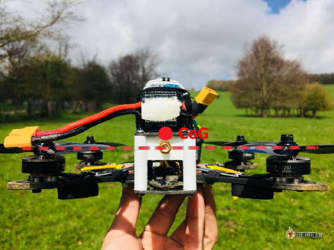
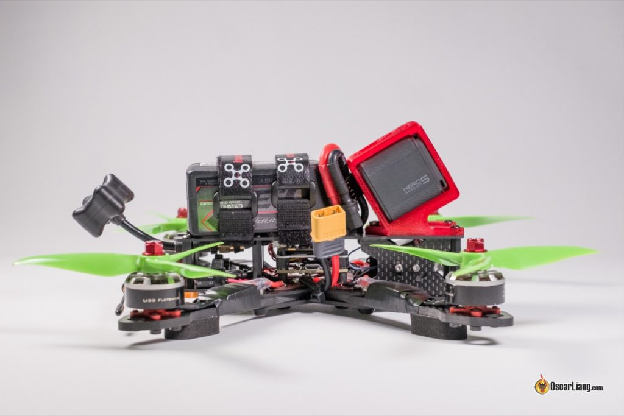
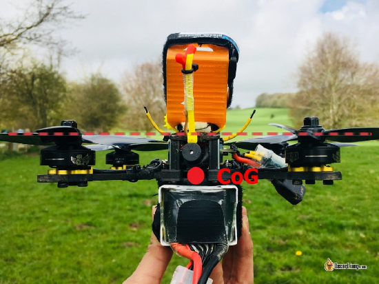
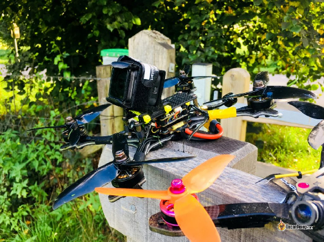

  
Стисле посилання на цей переклад: [https://bit.ly/LiangTop-BottomMountBattery](https://bit.ly/LiangTop-BottomMountBattery)   

| 🫂 | Нижче вичитаний людьми машинний український переклад оригіналу. Для [VictoryDrones](https://www.victory-drones.com/) переклад вичитали: Anastasia, Max Well, Faina. Хочете покращити переклад чи знайшли помилку? — Лишіть коментар (Ctrl+Alt+M або «Меню» \> «Вставка» \> «Коментар»). Ми теж живі люди (як і ви) і робим помилки. Роботи їх, до речі, також роблять 😉 |
| :---: | :---- |

# **Верхнє та нижнє кріплення акумулятора на FPV-дроні** 

22 вересня 2018 р

Розташування акумулятора впливає на продуктивність і керованість вашого FPV-дрона. Сам по собі літій-полімерний (LiPo) акумулятор має велику вагу, фактично він настільки важкий, що може помітно змінювати центр ваги в залежності від обраного (верхнього або нижнього) кріплення акумулятора. Ми обговоримо переваги та недоліки обох варіантів кріплень акумулятора LiPo.

*Деякі посилання на цій сторінці є партнерськими. Я \[автор англомовної версії Оскар Ланг\] отримую комісію (без додаткових витрат для вас), якщо ви робите покупку після натискання одного із цих партнерських посилань. Це допомагає підтримувати безкоштовний контент для спільноти на цьому веб\-сайті. Будь ласка, прочитайте нашу [Політику партнерських посилань](https://oscarliang.com/affiliate-program-policy/) для отримання додаткової інформації.*  
Зміст

[Верхнє кріплення акумулятора](#верхнє-кріплення-акумулятора)

[Плюси](#плюси)

[Мінуси](#мінуси)

[Нижнє кріплення акумулятора](#нижнє-кріплення-акумулятора)

[Плюси](#плюси-1)

[Мінуси](#мінуси-1)

[Висновок](#висновок)

[Історія редагування](#історія-редагування)

## 

## **Верхнє кріплення акумулятора** {#верхнє-кріплення-акумулятора}

### **Плюси** {#плюси}

Встановлення [LiPo акумулятора](https://docs.google.com/document/d/1bYaQQ59u0c7EJcsN8B8-amzMMHvdYYn2boU1-4rCjug/edit) на верхній частині міні-дрона дозволяє наблизити центр ваги *\[COG\]* до центру тяги – точки перетину зусилля тяги всіх пропелерів, де генерується тяга.

Коли загальний центр ваги дрона наближається до центру тяги, сила, яка обертає дрон, стає більш ефективною і дієвою завдяки коротшому важелю та меншому моменту інерції. Це дає змогу отримати швидшу реакцію, кращий контроль і стабільність.

Ще однією перевагою верхнього кріплення акумулятора є те, що акумулятор можна використовувати для збалансування ваги [HD камери](https://oscarliang.com/action-camera/) (наприклад, GoPro), встановленої спереду.

*Reverb є хорошим прикладом рами з верхнім кріпленням акумулятора*

Верхнє кріплення акумулятора також полегшує приземлення, широка пласка основа з меншою ймовірністю перекинеться під час приземлення. Здається, що кожен мій дрон із нижнім кріпленням акумулятора приземляється догори дригом, хоча очікувано мав би приземлятися у правильному положенні завдяки нижньому кріпленню акумулятора та центру ваги.

Що стосується керованості, я думаю, що відмінності досить незначні, враховуючи, наскільки потужні мотори та хороше програмне забезпечення для керування польотом доступні сьогодні.

До речі, з верхнім кріпленням акумулятора легше виконувати такі трюки, як «touch and go» (також відомий як «постукування по стіні», є типом маневру або трюку, де дрон торкається до поверхні (наприклад, стіни) і відразу відштовхується від неї, продовжуючи політ), :)

### **Мінуси** {#мінуси}

Верхнє кріплення акумулятора потребує більше місця у верхній частині рами, особливо якщо ви також плануєте використовувати HD-камеру. Довший корпус означає більшу площу поверхні та більший драг при швидкому польоті.

На деяких “пласкішиx” рамах акумулятор LiPo з більшою ймовірністю може бути пробитий пропелерами при падінні, якщо ремінець не застiбнутий належним чином.

## **Нижнє кріплення акумулятора** {#нижнє-кріплення-акумулятора}

### **Плюси** {#плюси-1}

Нижнє кріплення акумулятора дозволяє не займати простір зверху, що робить конструкцію рами легшою та компактнішою. Менша за розміром, з більш відцентрованим ваговим балансом [рама міні-дрона](https://docs.google.com/document/d/16ZBjhNEoDZY-ZI3li2LqQdyiowYnOtltkrew8lr8i0I/edit) також означає менший драг для польотів на високих швидкостях. Можливо, це одна з причин, чому цим дронам віддають перевагу для перегонів.

Встановлені під рамою акумулятори LiPo також краще захищені від ударів об пропелери.

Нарешті, при встановленні акумулятора знизу не має значення його розмір і форма, ви можете переміщати акумулятор вперед і назад, щоб відрегулювати центр ваги.

  
*Kopis [2](https://oscarliang.com/holybro-kopis-2-drone/) є прикладом підвісної рами для акумулятора*

### **Мінуси** {#мінуси-1}

Центр тяги зазвичай знаходиться набагато вище центра ваги, коли акумулятор встановлений ​​знизу, дрон буде мати більшу інерцію обертання. Це може призвести до зниження стабільності та маневреності дрона, а в деяких критичних випадках ви навіть можете помітити ефект маятника. Але оскільки сьогодні існують потужні дрони, ці недоліки можуть бути не дуже помітними.

«[Режим черепахи](https://docs.google.com/document/d/1-7znNDnktFVPi2OYA1Pae7iopO8sqjISHM7UKdGBmY0/edit)» \[сторінка 11\] (функція, яка дозволяє дрону перевернутися після того, як він опинився догори дригом) з меншою ймовірністю буде працювати з акумулятором, встановленим під рамою.

Крім того, його легше подряпати, проколоти і пошкодити під час приземлення на нерівну поверхню.

## **Висновок** {#висновок}

Це в значній мірі залежить від уподобань кожного. Але з того, що я бачив, фрістайлери, здається, віддають перевагу верхньому кріпленню акумулятора, а гонщики \- нижньому. Звичайно, це також пов'язано з конструкцією рами і обмеженнями.

Сподіваюся, ця стаття була корисною, якщо у вас є інша думка, будь ласка, дайте мені знати в коментарях. Щасливих польотів.

### **Історія редагування** {#історія-редагування}

* Січ., 2018 – Стаття створена  
* Вересень 2018 р. – додані зображення

**КОМЕНТАРІ**

TWEAKRACER

14 вересня 2019 р. \- 7:37 ранку

Центр тяги зазвичай знаходиться значно ВИЩЕ центра ваги *\[COG\]*, коли акумулятор встановлений ​​знизу,  
(Виправив це для вас.)  
[ВІДПОВІДЬ](https://oscarliang.com/mount-battery-mini-quad-bottom-top/#comment-21724)  
**CHRIS**

25 вересня 2018 р. \- 15:17

Багато гоночних пілотів використовують несиметричну Floss-рамy в режимі черепахи з кріпленням акумулятора на верхній частині рами. Це чудовий захист для антени та робить режим черепахи дієвим :D  
Однією з причин проти встановлення акумулятора зверху для перегонів є той факт, що все, що знаходиться зверху, з часом руйнується перешкодами на трасі (gates, ворота).

[ВІДПОВІДЬ](https://oscarliang.com/mount-battery-mini-quad-bottom-top/#comment-19029)  
**GANDO**

24 вересня 2018 р. \- 18:03

Ну, незабаром це 8s з 4s пакетом зверху та 4s пакетом знизу, тому… наступна стаття…  
[ВІДПОВІДЬ](https://oscarliang.com/mount-battery-mini-quad-bottom-top/#comment-19026)  
ОСКАР

1 жовтня 2018 р. \- 16:45

Тоді ви точно знищитe свої акумулятори при кожному падінні, LOL  
[ВІДПОВІДЬ](https://oscarliang.com/mount-battery-mini-quad-bottom-top/#comment-19077)  
**TAPROOT**

23 вересня 2018 р. \- 16:33 год

Я згоден. Я в основному пілот фрістайлу, але коли я намагаюся фрістайлити із рамою з нижнім кріпленням акумулятора, я завжди закінчую гонками.  
[ВІДПОВІДЬ](https://oscarliang.com/mount-battery-mini-quad-bottom-top/#comment-19018)  
**DATT** MTN

23 вересня 2018 р. \- 07:56

Недолік, який я також помітив при верхньому кріпленні акумулятора, полягає в тому, що велика маса акумулятора підтримується стійками. Коли дрон приземляється або вдаряється, основна пластина може вдаритися першою, але через інерцію акумулятора, стійки можуть зігнутися або зламатися.

[ВІДПОВІДЬ](https://oscarliang.com/mount-battery-mini-quad-bottom-top/#comment-19013)  
ДЖОН

25 вересня 2018 року \- 20:15

Ага, але це означає, що дешеві стійки поглинають енергію, яка інакше пішла б в акумулятор.  
[ВІДПОВІДЬ](https://oscarliang.com/mount-battery-mini-quad-bottom-top/#comment-19033)  
РОН

27 вересня 2018 р. \- 21:05 год

Питання в тому, чи не призведе це до пошкодження дорогого польотного контроллера або відеопередавача?

[image1]: 

[image2]: 

[image3]: 

[image4]: 

[image5]: 