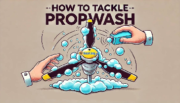
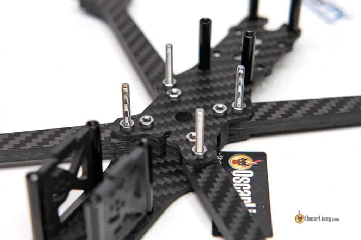
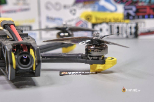
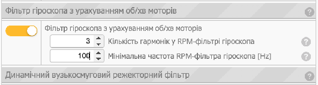
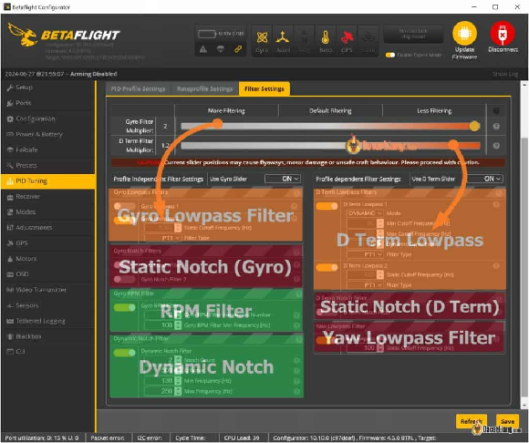
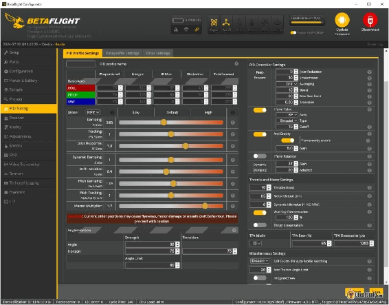
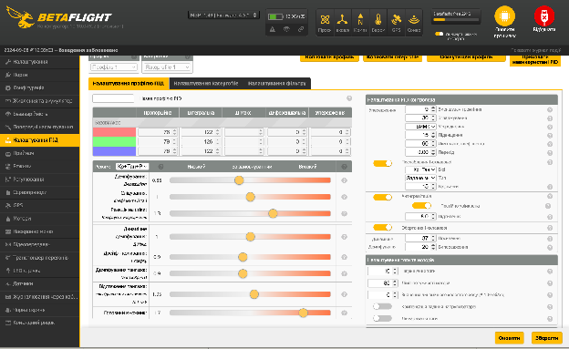

Стисле посилання на цей переклад: [bit.ly/reduce-propwash](http://bit.ly/reduce-propwash)

|  | Нижче вичитаний людьми машинний український переклад оригіналу. Для [VictoryDrones](https://www.victory-drones.com/) переклад вичитали: Faina, Max Well. Хочете покращити переклад чи знайшли помилку? — Лишіть коментар (Ctrl+Alt+M або «Меню» \> «Вставка» \> «Коментар»). Ми теж живі люди (як і ви) і робим помилки. Роботи їх, до речі, також роблять 😉 |
| :---- | :---- |

# **Що таке реакція дрона на самотурбулентність і як її зменшити?** 

3rd August 2024

Pеакція дрона на самотурбулентність *\[пропвош\]* – це поширена проблема в польотах FPV дронів, особливо під час зниження висоти та різких поворотів на 180 градусів. Пропвош проявляється у вигляді коливань або вібрацій через турбулентний повітряний потік, створений пропелерами дрона, що значно впливає на стабільність польоту та якість відео. У цьому підручнику ми розглянемо, що таке реакція дрона на самотурбулентність, що його викликає і як можна його мінімізувати за допомогою налаштувань і коригувань конфігурації.

*Деякі посилання на цій сторінці є партнерськими. Я \[автор англомовної версії Оскар Ланг\] отримую комісію (без додаткових витрат для вас), якщо ви робите покупку після натискання одного із цих партнерських посилань. Це допомагає підтримувати безкоштовний контент для спільноти на цьому веб\-сайті. Будь ласка, прочитайте нашу [Політику партнерських посилань](https://oscarliang.com/affiliate-program-policy/) для отримання додаткової інформації.*

## 

## 

**Зміст**

[Що таке реакція дрона на самотурбулентність?	2](#що-таке-реакція-дрона-на-самотурбулентність?)

[Що викликає пропвош?	2](#що-викликає-пропвош?)

[Поради щодо зменшення пропвошу	2](#поради-щодо-зменшення-пропвошу)

[Забезпечити механічну цілісність	3](#забезпечити-механічну-цілісність)

[Використовуйте пропелери з низьким кроком	3](#використовуйте-пропелери-з-низьким-кроком)

[Увімкнути фільтр обертів/хв	4](#увімкнути-фільтр-обертів/хв)

[Налаштування фільтрів	5](#налаштування-фільтрів)

[Правильне налаштування ПІД	7](#правильне-налаштування-під)

[Використання динамічного холостого ходу	9](#використання-динамічного-холостого-ходу)

[Змініть спосіб вашого польоту	9](#змініть-спосіб-вашого-польоту)

[Висновок	9](#висновок)

* 

## **Що таке реакція дрона на самотурбулентність?** {#що-таке-реакція-дрона-на-самотурбулентність?}

Реакція дрона на самотурбулентність *\[прим. пер.: далі “**пропвош**”\]* виникає, коли турбулентне повітря, створене пропелерами дрона, заважає його польоту. Ця турбулентність може спричинити нестабільність, що призводить до коливань або хитання, особливо під час маневрів, таких як різкі повороти, швидкі спуски або агресивне гальмування. Ефект часто видно на відеозаписах з дрона у вигляді вібрацій, схожих на холодець, що заважає отримати плавні та кінематографічні кадри.

## **Що викликає пропвош?**  {#що-викликає-пропвош?}

Пропвош в основному викликається взаємодією пропелерів дрона з турбулентним повітрям. Коли дрон рухається, особливо під час швидких маневрів, повітря, яке було порушене пропелерами, не встигає осісти, перш ніж пропелери знову проходять через нього. Це створює петлю зворотного зв'язку турбулентності, яка дестабілізує дрон.  
Кілька факторів можуть погіршити пропвош:

* **Конструкція пропелера:** Форма, розмір і крок пропелерів впливають на те, як переміщується повітря.

* **Польотні маневри:** Агресивні маневри збільшують ймовірність виникнення  пропвошу.

* **Налаштування та ПІД-параметри**: Погано налаштовані фільтри та ПІД-параметри можуть погіршити ефекти пропвошу.

* **Вага та конструкція рами**: Розподіл ваги дрона та конструкція рами можуть вплинути на те, як він справляється з турбулентним повітрям.

## **Поради щодо зменшення пропвошу** {#поради-щодо-зменшення-пропвошу}

Зменшення або мінімізація пропвошу вимагає поєднання правильної настройки, техніки польоту та технічного обслуговування. Ось кілька ефективних порад. 

### **Забезпечити механічну цілісність** {#забезпечити-механічну-цілісність}

  
Спершу переконайтеся, що ваш квадрокоптер механічно справний:

* Переконайтеся, що польотний контролер встановлений на м'яких кріпленнях і надійно закріплений.

* Перевірте, чи немає ослаблених гвинтів на рамі, моторах та інших компонентах.

* Переконайтеся, що жодна пластина з вуглецевого волокна в рамі не тріснула, і що рама є максимально жорсткою.

* Переконайтеся, що мотори в хорошому стані, підшипники працюють плавно, і кожухи не ослаблені.

### **Використовуйте пропелери з низьким кроком**  {#використовуйте-пропелери-з-низьким-кроком}

Використання високоякісних пропелерів з низьким кроком може значно вплинути на подолання пропвошу. Хоча пропелери з високим кроком чудово підходять для досягнення вищих максимальних швидкостей, пропелери з низьким кроком можуть швидше змінювати оберти/хв, роблячи ваш дрон чутливiшим і швидшим у налаштуванні до турбулентності повітря.  
Ось мої рекомендації щодо пропелерів: [https://bit.ly/LiangPropellersUA](https://bit.ly/LiangPropellersUA) 

### **Увімкнути фільтр обертів/хв**  {#увімкнути-фільтр-обертів/хв}

 \> 

Рекомендується ввімкнути фільтрацію обертів/хв, дотримуючись цього підручника: [https://bit.ly/BetaflightFiltersSetup](https://bit.ly/BetaflightFiltersSetup).  
Якщо у вас регулятори обертів BLHeli\_S, ви повинні встановити на них прошивку Bluejay [https://bit.ly/LiangFlashBluejay-BLHeli\_S](https://bit.ly/LiangFlashBluejay-BLHeli_S). 

Якщо у вас регулятори обертів BLHeli\_32 або AM32, ви вже готові до фільтрації обертів/хв, дотримуйтесь цих інструкцій, щоб налаштувати ваш регулятор обертів для оптимальної роботи: 

* Найкращі налаштуванняBLHeli32: [https://bit.ly/LiangBLHeli32Settings](https://bit.ly/LiangBLHeli32Settings) 

* Найкращі налаштування AM32: [https://bit.ly/best-am32-settings](http://bit.ly/best-am32-settings) 

### **Налаштування фільтрів** {#налаштування-фільтрів}

*(переклад на наступній сторінці)*

Коли ваш квадрокоптер механічно справний і працює на останній версії прошивки з увімкненим фільтром обертів/хв, ви можете спробувати ці налаштування фільтра:

* Вимкніть Фільтр нижніх частот гіроскопа 1: Зазвичай на більшості квадрокоптерів його можна безпечно вимкнути з увімкненим фільтром обертів/хв. Це зменшує затримку фільтра і покращує обробку пропвошу. Ви повинні зробити короткий тестовий політ, щоб перевірити, чи не нагріваються мотори, перед тим як остаточно вирішити.

* Зменшіть фільтрацію ще більше: У Betaflight перейдіть на вкладку налаштування ПІД та налаштування фільтрів. Перемістіть повзунки Фільтрa нижніх частот гіроскопа вправо (до 1.2 або 1.3), щоб зменшити фільтрацію, при цьому звертаючи увагу, щоб квадрокоптер літав без перегріву моторів.

Тонке налаштування: Якщо ви помічаєте проблеми при вищих значеннях (наприклад, 1.5), зменште повзунки трохи, щоб знайти мінімальну кількість фільтрації, яку можна використовувати.

Зменшення фільтрації може допомогти підвищити ПІД-коефіцієнти без викликання коливань, однак для цього потрібен чистий і добре обслуговуваний квадрокоптер, а також настійно рекомендується вміти аналізувати це через журнали Blackbox [bit.ly/LiangBlackbox](https://bit.ly/LiangBlackbox).

### **Правильне налаштування ПІД** {#правильне-налаштування-під}

Налаштування ПІД за замовчуванням у Betaflight зазвичай дуже хороші, але завжди є можливість для тонкого налаштування обробки пропвошу:

* Збільшити Д-коефіцієнт: Д-коефіцієнт у налаштуваннях ПІД допомагає протидіяти швидким змінам руху. Вищий Д-коефіцієнт може допомогти зменшити коливання, викликані пропвошем. Однак, надмірне збільшення Д-коефіцієнта може призвести до перегріву моторів та до коливань, тому вносіть зміни поступово, використовуючи правильні методи налаштування.

* Налаштування П-коефіцієнта та І-коефіцієнта: Ідеальне ПІД налаштування вимагає хороших співвідношень між П і Д, а також між П і I. Тому, коли ви змінюєте Д-коефіцієнт, вам також слід налаштовувати П і I коефіцієнти, щоб зберегти ці співвідношення.

**Додаткова література:**

* Якщо ви знаєте, як використовувати Чорну скриньку, ознайомтеся з моїм детальним підручником з налаштування ПІД: [https://bit.ly/LiangPIDFiltersTuningBlackbox](https://bit.ly/LiangPIDFiltersTuningBlackbox)   

* Якщо ви не знаєте, як використовувати Blackbox, ви все одно можете виконати деякі базові, але ефективні налаштування, дотримуючись цих простих кроків: [https://bit.ly/Betaflight10Steps](https://bit.ly/Betaflight10Steps)     
  Чому надмірне підсилення D може призвести до перегріву моторів: [https://bit.ly/LiangExcessiveDGain](https://bit.ly/LiangExcessiveDGain)   

### **Використання динамічного холостого ходу** {#використання-динамічного-холостого-ходу}

Динамічний холостий хід забезпечує підтримку мінімальних обертів/хв навіть у ситуаціях зворотного потоку, мінімізуючи пропвош.

Коли виникає пропвош, польотний контролер намагається стабілізувати квадрокоптер, швидко прискорюючи або уповільнюючи мотори. Без динамічного холостого ходу мінімальні оберти/хв, яких можуть досягти мотори, становлять 5,5% за замовчуванням. У той час як, коли динамічний холостий хід увімкнено, Betaflight може командувати моторам знижуватися до 0% обертів/хв, тому діапазон тяги, якого можуть досягти мотори при боротьбі з пропвошем, значно ширший. Це покращене гальмування помітно покращує коригування пропвошу.

У мене є цілий блог-пост, що пояснює, що таке динамічний холостий хід і як його налаштувати: [https://oscarliang.com/how-to-enable-and-configure-betaflight-dynamic-idle/](https://oscarliang.com/how-to-enable-and-configure-betaflight-dynamic-idle/)

### **Змініть спосіб вашого польоту** {#змініть-спосіб-вашого-польоту}

Агресивний стиль польоту часто призводить до більш вираженого пропвошу. Практикуючи більш плавні та контрольовані маневри, ви можете зменшити турбулентність, створену пропелерами вашого дрона. Наприклад, при зниженні спробуйте трохи нахилити тангаж вперед, ефективно зменшуючи пропвош, щоб мінімізувати турбулентність повітря, яка безпосередньо вдаряє по пропелерах.

## **Висновок** {#висновок}

Пропвош – це проблема, з якою стикається кожен пілот FPV, але з правильним поєднанням налаштувань, коригувань апаратy і технік польоту ви можете значно зменшити його вплив. Зрозумівши причини пропвошу та застосувавши ці поради, ви зможете насолоджуватися більш стабільним польотом і знімати більш плавне відео. Щасливих польотів\!

*\[Прим. пер: на великих дронах, старайтесь знижуватись з рухом вперед таким чином, щоб не залітати в розбурхане повітря\]*

[image1]: 

[image2]: 

[image3]: 

[image4]: 

[image5]: 

[image6]: 

[image7]: 

[image8]: 

[image9]: 

[image10]: 

[image11]: 