Стисле посилання на цей переклад: [https://bit.ly/Flashing-and-SettingUp-ExpressLRS](https://bit.ly/Flashing-and-SettingUp-ExpressLRS)  

| 🫂 | Нижче вичитаний людьми машнний український переклад оригіналу. Для [VictoryDrones](https://www.victory-drones.com/) переклад вичитали: Oleg\!, Block. Хочете покращити переклад чи знайшли помилку? — Лишіть коментар (Ctrl+Alt+M або «Меню» \> «Вставка» \> «Коментар»). Ми теж живі люди (як і ви) і робим помилки. Роботи їх, до речі, також роблять 😉 |
| :---: | :---- |

# Посібник із прошивання та налаштування ExpressLRS

## **Покрокова інструкція з налаштування ExpressLRS на вашій радіосистемі OpenTX/EdgeTX та Betaflight, включно зі встановленням останньої версії прошивки** {#покрокова-інструкція-з-налаштування-expresslrs-на-вашій-радіосистемі-opentx/edgetx-та-betaflight,-включно-зі-встановленням-останньої-версії-прошивки}

6 березня 2023 року

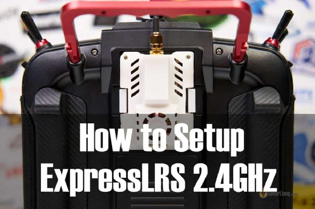

ExpressLRS — це система для радіокерування з відкритим вихідним кодом, яка набула популярності завдяки своїй доступності, наднизькій затримці при передачі команд та можливостям управляти дроном на великих відстанях. Однак налаштування ExpressLRS може бути досить важким завданням для початківців. Ось чому в цьому посібнику ми проведемо вас крізь процес прошивки та налаштування модуля передавача та приймача ExpressLRS 2,4 ГГц на пультах OpenTX/EdgeTX та Betaflight.

*Деякі посилання на цій сторінці є партнерськими. Я \[автор англомовної версії Оскар Ланг\] отримую комісію (без додаткових витрат для вас), якщо ви робите покупку після натискання одного із цих партнерських посилань. Це допомагає підтримувати безкоштовний контент для спільноти на цьому веб\-сайті. Будь ласка, прочитайте нашу [Політику партнерських посилань](https://oscarliang.com/affiliate-program-policy/) для отримання додаткової інформації.*

Вперше використовуєте ExpressLRS? [Ця стаття](https://oscarliang.com/expresslrs/) пояснює переваги ExpressLRS перед іншими системами радіокерування та чому я віддаю перевагу 2,4 ГГц, а не 900 МГц.

Зміст

[Покрокова інструкція з налаштування ExpressLRS на вашій радіосистемі OpenTX/EdgeTX та Betaflight, включно зі встановленням останньої версії прошивки](#покрокова-інструкція-з-налаштування-expresslrs-на-вашій-радіосистемі-opentx/edgetx-та-betaflight,-включно-зі-встановленням-останньої-версії-прошивки)

[Вибір апаратної частини ExpressLRS 2,4 ГГц](#вибір-апаратної-частини-expresslrs-2,4-ггц)

[Пульти з вбудованим ELRS](#пульти-з-вбудованим-elrs)

[Окремий модуль передавача (пульта)](#окремий-модуль-передавача-\(пульта\))

[Модернізація антени передавача](#модернізація-антени-передавача)

[Приймачі](#приймачі)

[Запасні RX антени](#запасні-rx-антени)

[Чи потрібно оновлювати прошивку ExpressLRS?](#чи-потрібно-оновлювати-прошивку-expresslrs?)

[Прошивка EdgeTX](#прошивка-edgetx)

[Завантажте конфігуратор ExpressLRS (ExpressLRS Configurator)](#завантажте-конфігуратор-expresslrs-\(expresslrs-configurator\))

[Встановіть Сценарій LUA](#встановіть-сценарій-lua)

[Визначте версію обладнання та прошивки](#визначте-версію-обладнання-та-прошивки)

[Скомпілюйте та прошийте передавач пульта](#скомпілюйте-та-прошийте-передавач-пульта)

[Збірка прошивки ELRS TX](#збірка-прошивки-elrs-tx)

[Прошивка модуля передавача через Wi-Fi](#прошивка-модуля-передавача-через-wi-fi)

[Прошивка передавача через UART/USB](#прошивка-передавача-через-uart/usb)

[Підключіть приймач ELRS до польотного контроллера](#підключіть-приймач-elrs-до-польотного-контроллера)

[Betafpv Expresslrs Nano Rx Close Up](#betafpv-expresslrs-nano-rx-close-up)

[Створення образу та прошивка приймача](#створення-образу-та-прошивка-приймача)

[Прошийте приймач за допомогою Betaflight Passthrough](#прошийте-приймач-за-допомогою-betaflight-passthrough)

[Прошивка приймача через WiFi](#прошивка-приймача-через-wifi)

[Прошивка приймача через UART](#прошивка-приймача-через-uart)

[Прошивка приймача через FDTI](#прошивка-приймача-через-fdti)

[Прошивка приймачів SPI ExpressLRS](#прошивка-приймачів-spi-expresslrs)

[Прив’язка приймача](#прив’язка-приймача)

[Прив’язка через кодову фразу для з’єднання](#прив’язка-через-кодову-фразу-для-з’єднання)

[Процедура зв’язування без бінд-фрази](#процедура-зв’язування-без-бінд-фрази)

[Світлодіодний індикатор стану приймача](#світлодіодний-індикатор-стану-приймача)

[Налаштування Betaflight для приймача ExpressLRS](#налаштування-betaflight-для-приймача-expresslrs)

[Відображення LQ \[якість зв’язку\] і RSSI в наекранному меню](#відображення-lq-[якість-зв’язку]-і-rssi-в-наекранному-меню)

[Встановлення вашої антени](#встановлення-вашої-антени)

[Налаштування Безаварійності](#налаштування-безаварійності)

[Налаштування сценарію ELRS LUA](#налаштування-сценарію-elrs-lua)

[Потужність передачі](#потужність-передачі)

[Частота пакетів (Packet rate)](#частота-пакетів-\(packet-rate\))

[Співвідношення телеметрії](#співвідношення-телеметрії)

[Канали](#канали)

[Режим перемикачів](#режим-перемикачів)

[Додаткові налаштування приймача](#додаткові-налаштування-приймача)

[Параметри підвищення продуктивності](#параметри-підвищення-продуктивності)

[Додавання домашньої мережі WiFi](#додавання-домашньої-мережі-wifi)

[Як використовувати функціонал «відповідність моделі» \[Model Match\]](#як-використовувати-функціонал-«відповідність-моделі»-[model-match])

[Приймач SPI](#приймач-spi)

[FAQ](#faq)

[Поради для далеких дистанцій](#поради-для-далеких-дистанцій)

[Один і той самий пульт, який одночасно керує кількома приймачами](#один-і-той-самий-пульт,-який-одночасно-керує-кількома-приймачами)

[Пульт постійно передає «Телеметрію втрачено»](#пульт-постійно-передає-«телеметрію-втрачено»)

[Сценарій LUA просто продовжує завантажуватися](#сценарій-lua-просто-продовжує-завантажуватися)

[Помилка «Bad Size Given» \[неправильний розмір\]](#помилка-«bad-size-given»-[неправильний-розмір])

[Попередження про оновлення приймача: «Not enough data uploaded\!» \[Завантажено недостатньо даних\!\]](#попередження-про-оновлення-приймача:-«not-enough-data-uploaded!»-[завантажено-недостатньо-даних!])

[Сценарій LUA показує лише «Connecting…» \[Підключення…\]](#сценарій-lua-показує-лише-«connecting…»-[підключення…])

[Як встановити вентилятор охолодження на модуль Happymodel TX](#як-встановити-вентилятор-охолодження-на-модуль-happymodel-tx)

[Використання логотипу ExpressLRS у якості зображення моделі](#використання-логотипу-expresslrs-у-якості-зображення-моделі)

[Встановіть драйвер USB до UART](#встановіть-драйвер-usb-до-uart)

[Taranis QX7](#taranis-qx7)

[Офіційна документація](#офіційна-документація)

[Історія редагування](#історія-редагування)

* 

## **Вибір апаратної частини ExpressLRS 2,4 ГГц** {#вибір-апаратної-частини-expresslrs-2,4-ггц}

Усі передавачі та приймачі з прошивкою [ExpressLRS](https://www.expresslrs.org/) сумісні незалежно від торговельної марки.

### **Пульти з вбудованим ELRS** {#пульти-з-вбудованим-elrs}

Якщо ви купуєте пульт із вбудованим ExpressLRS — ви можете насолоджуватись цим чудовим каналом радіокерування без необхідності докупати додатковий модуль. Це спрощує процес налаштування та зменшує витрати на придбання вашої нової радіосистеми. Деякі пульти з внутрішніми модулями мають лише 150—250 мВт потужності, тоді як деякі можуть досягати 1 Вт.

| [TX16S MKII](https://oscarliang.com/radiomaster-tx16s-mark-ii/) | [Зорро](https://oscarliang.com/setup-zorro/) | [Боксер](https://oscarliang.com/radiomaster-boxer/) |
| :---: | :---: | :---: |
|  |  |  |
| [**Banggood**](https://oscarliang.com/product-c6gv) **[Amazon](https://amzn.to/3eesfWh) [Радіомастер](https://oscarliang.com/product-fs4n)** | [**RDQ**](https://oscarliang.com/product-ar64) **[GetFPV](https://oscarliang.com/product-wa1t) [Радіомастер](https://oscarliang.com/product-xgm0)** | [**GetFPV**](https://oscarliang.com/product-2yj0) **[AliExpress](https://s.click.aliexpress.com/e/_DkLIX2N) [Радіомастер](https://oscarliang.com/product-bccn)** |

| [Lite Radio 3](https://oscarliang.com/betafpv-literadio-3-pro/) | [T-Pro](https://oscarliang.com/jumper-t-pro/) | [T-Lite V2](https://oscarliang.com/jumper-t-lite-v2/) |
| :---: | :---: | :---: |
|  |  |  |
| [**AliExpress**](https://s.click.aliexpress.com/e/_Dkwp86Z) **[BetaFPV](https://oscarliang.com/product-rho9) [RDQ](https://oscarliang.com/product-p3tu)** | [**Banggood**](https://oscarliang.com/product-luph) **[Amazon](https://amzn.to/3tLbnBA) [RDQ](https://oscarliang.com/product-g8dn)** | [**Amazon**](https://amzn.to/3HoWkDP) **[AliExpress](https://s.click.aliexpress.com/e/_DdKvR2X)** |

### **Окремий модуль передавача (пульта)** {#окремий-модуль-передавача-(пульта)}

Якщо у вас пульт без вбудованого ExpressLRS, вам потрібно буде придбати модуль передавача ExpressLRS, аби використовувати цю систему. Ваш пульт повинен мати сумісний модульний відсік для встановлення цього модуля.

Вибір модуля пульта може здатися складним через велику кількість доступних варіантів. Однак більшість із них засновані на тому самому відкритому коді ExpressLRS. Основні відмінності полягають у якості збірки, таких характеристиках, як екран, максимальна вихідна потужність і охолодження. Виберіть один із авторитетних брендів, представлених нижче.

Модуль передавача вставляється у відсік зовнішнього модуля JR. Менші пульти можуть мати спрощений модульний відсік, вам потрібно буде придбати модуль потрібного розміру.

| Повнорозмірний модуль (JR) |  |  |
| ----- | :---: | :---: |
| Happymodel ESTX24 Pro TX | [BetaFPV ELRS Micro TX](https://oscarliang.com/betafpv-elrs-micro-tx-module-1w-edition/) | [Radiomaster Ranger](https://oscarliang.com/radiomaster-ranger-micro-nano-expresslrs-module/) |
| 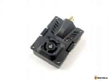 |  | 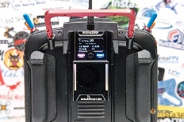 |
| [**Banggood**](https://oscarliang.com/product-9il2) **[GetFPV](https://oscarliang.com/product-qs9i) [RDQ](https://oscarliang.com/product-ll0n)** | [**AliExpress**](https://s.click.aliexpress.com/e/_DcjduIl) **[BetaFPV](https://oscarliang.com/product-bup8) [GetFPV](https://oscarliang.com/product-2zp8)** | [**Радіомастер**](https://oscarliang.com/product-nrqa) **[GetFPV](https://oscarliang.com/product-6xqn) [AliExpress](https://s.click.aliexpress.com/e/_DF2PGiR)** |

Інші варіанти повнорозмірного модуля:

* Radiomaster Ranger Micro: [https://oscarliang.com/product-y4th](https://oscarliang.com/product-y4th)

* AxisFlying Thor:[https://oscarliang.com/product-j7yn](https://oscarliang.com/product-j7yn)

* HGLRC Hermes:[https://oscarliang.com/product-jssq](https://oscarliang.com/product-jssq)

* HiYOUNGER ELRS 2,4 ГГц:[https://oscarliang.com/product-58mr](https://oscarliang.com/product-58mr)

* Namimno Flash:[https://oscarliang.com/product-ie8s](https://oscarliang.com/product-ie8s)

* Happymodel ES24TX:[https://oscarliang.com/product-a3r9](https://oscarliang.com/product-a3r9)

|  Модулі меншого розміру — Lite |  |  |
| :---: | :---: | :---: |
| Happymodel  ESTX24-Lite TX | Radiomaster Ranger Nano |  Jumper AION |
| 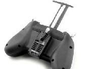 |  |  |
| [**RDQ**](https://oscarliang.com/product-eq25) **[AliExpress](https://s.click.aliexpress.com/e/_AK4DwF)** . | [**RDQ**](https://oscarliang.com/product-qire) **[Радіомастер](https://oscarliang.com/product-sas9) [AliExpress](https://s.click.aliexpress.com/e/_DdCxrND)** | [**RDQ**](https://oscarliang.com/product-pte5) **[AliExpress](https://s.click.aliexpress.com/e/_De3J1vL)** |

Інші варіанти модуля Lite:

* BetaFPV ELRS Nano TX:[https://oscarliang.com/product-c635](https://oscarliang.com/product-c635)

* FrSky VANTAC:[https://oscarliang.com/product-50wh](https://oscarliang.com/product-50wh)

* Happymodel ES24TX Slim Pro:[https://oscarliang.com/product-xi1z](https://oscarliang.com/product-xi1z)

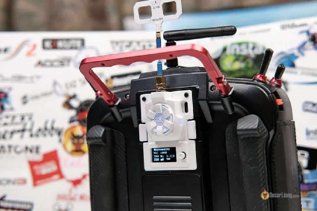

---

### **Модернізація антени передавача** {#модернізація-антени-передавача}

Стандартні антени часто мають нижчий коефіцієнт підсилення, оскільки вони призначені для загального використання, а якість їх виготовлення не завжди найкраща. Щоб збільшити радіус дії, подумайте про покупку антени з кращою якістю та кращим коефіцієнтом підсилення. Завдяки широкому асортименту розмірів і форм ви можете знайти ту, яка відповідатиме вашим потребам і умовам використання.

| HappyModel Moxon (4,2 дБі) | Namimno Black Pearl Loop (2,8 дБі) | BetaFPV Moxon (5,6 дБі) |
| :---: | :---: | :---: |
|  | 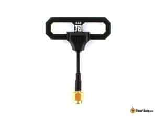 | 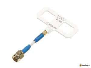 |
| [**AliExpress**](https://s.click.aliexpress.com/e/_DFPAqDf) **[GetFPV](https://oscarliang.com/product-uyj2) [RDQ](https://oscarliang.com/product-z2yg)** | [**AliExpress**](https://s.click.aliexpress.com/e/_DkJdrHL) | [**BetaFPV**](https://oscarliang.com/product-ce06) |

| VAS Diamond (2,8 дБі) | TrueRC True-MOX (2,1 дБі) | Turbowing Fishbone (7,5 дБі) |
| :---: | :---: | :---: |
| 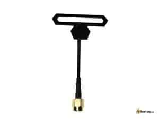 | 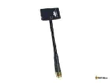 |  |
| [**GetFPV**](https://oscarliang.com/product-j42y) **.** | [**GetFPV**](https://oscarliang.com/product-ulrq) **.** | [**Banggood**](https://oscarliang.com/product-idpa) |

---

### **Приймачі** {#приймачі}

Усі модулі приймачів і передавачів ExpressLRS є крос-сумісними, незалежно від марки, оскільки вони базуються на однаковому відкритому коді. Основні відмінності полягають у якості збірки, розмірі та підтримці Wi-Fi для оновлення прошивки та конфігурації. Нарешті, зверніть увагу на тип антени, яка поставляється з приймачем, оскільки деякі мають вбудовану антену, яка є компактнішою, а інші мають роз’єм U.FL для зовнішньої антени, яка зазвичай забезпечує кращу відстань.

Що стосується апаратного забезпечення, розгляньте приймачі з маркуванням «PA» та «LNA» для польотів на більші відстані. Шукайте приймачі з «TCXO», оскільки вони забезпечують більш стабільний зв’язок.

PA (підсилювач потужності) і LNA (малошумний підсилювач) — це компоненти, які покращують продуктивність приймача. PA забезпечує надійніший телеметричний зв’язок для польотів на далекі відстані, тоді як LNA значно підвищує чутливість приймача та забезпечує кращу дальність.

TCXO (кварцовий температурно-компенсований генератор) — це тип генератора, який забезпечує набагато більш стабільну частоту в набагато ширшому температурному діапазоні. Це важливо, тому що коли компоненти нагріваються або охолоджуються, це може спричинити зсув частоти в генераторі, і якщо цей зсув частоти виходить за межі певного запасу, ваш приймач на дроні втратить зв’язок із пультом. Отже, наявність приймача з TCXO забезпечує оптимальну продуктивність і надійність.

| [Radiomaster RP1](https://oscarliang.com/radiomaster-tx12-mark-ii/) | [Radiomaster RP2](https://oscarliang.com/radiomaster-tx12-mark-ii/) | х |
| :---: | :---: | :---: |
| 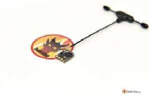 | 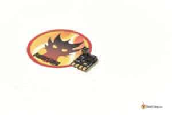 | х |
| [**Радіомастер**](https://oscarliang.com/product-7eb6) **[Banggood](https://oscarliang.com/product-msfg)** | [**Радіомастер**](https://oscarliang.com/product-v0fh) **[Banggood](https://oscarliang.com/product-gioa)** | х |

| BetaFPV Nano RX | BetaFPV Lite RX | Flywoo EL24E/P RX |
| :---: | :---: | :---: |
|  | 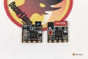 | 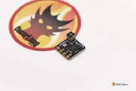 |
| [**BetaFPV**](https://oscarliang.com/product-dpj5) **[AliExpress](https://s.click.aliexpress.com/e/_DCotRqz)** | [**AliExpress**](https://s.click.aliexpress.com/e/_DEok3iz) **[BetaFPV](https://oscarliang.com/product-72hm)** | [**RDQ**](https://oscarliang.com/product-b9ss) **[Banggood](https://oscarliang.com/product-6zx5)** |

| Happymodel EP1 | Happymodel EP2 | Happymodel PP |
| :---: | :---: | :---: |
| 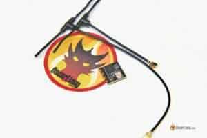 | 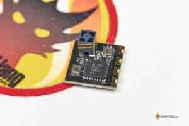 | 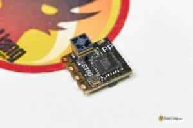 |
| [**RDQ**](https://oscarliang.com/product-r11w) **[Banggood](https://oscarliang.com/product-xuu7) [AliExpress](https://s.click.aliexpress.com/e/_9RoaGb)** | [**Banggood**](https://oscarliang.com/product-51w0) **[AliExpress](https://s.click.aliexpress.com/e/_AbEgxZ) [RDQ](https://oscarliang.com/product-aqpa)** | [**GetFPV**](https://oscarliang.com/product-zg0m) **[AliExpress](https://s.click.aliexpress.com/e/_A71oLh)** |

Приймачі з рознесеними антенами *\[Diversity receivers\]* забезпечують кращий радіус дії та якість сигналу. Існує два типи приймачів з рознесенням. “Приймачі з рознесеними антенами” *\[Antenna Diversity\]* використовує один радіомодуль, підключений до 2 антен, тоді як система з «чесним» рознесенням *\[True Diversity\]* використовує 2 незалежні радіомодулі, кожен зі своєю антеною. Приймачі із «чесним» рознесенням дорожчі, ніж приймачі де рознесені лише антени, а приймач при цьому спільний. Але приймачі з чесним рознесенням забезпечують ефективніше використання подвійних антен, тому забезпечують кращу продуктивність. Більше інформації про [мультиантенні приймачі](https://tinyurl.com/ExpressLRSDiversityReceivers).

| [BetaFPV SuperD](https://oscarliang.com/expresslrs-diversity-receivers/#betafpv-superd) | [Radiomaster RP3](https://oscarliang.com/expresslrs-diversity-receivers/#radiomaster-rp3) |  |
| :---: | :---: | :---: |
| 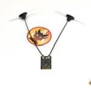 | 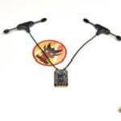 |  |
| [**BetaFPV**](https://oscarliang.com/product-g4r7) **[AliExpress](https://s.click.aliexpress.com/e/_DDifVqr) .** | [**Радіомастер**](https://oscarliang.com/product-6hyt) **[AliExpress](https://s.click.aliexpress.com/e/_DF9BiCJ) [RDQ](https://oscarliang.com/product-lbey)** | **. . .** |

| Skystars ELRS Diversity | MATEKSYS ELRS R24 D Diversity | HM EP1 Dual |
| :---: | :---: | :---: |
| 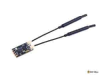 | 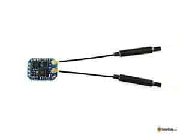 | х |
| [**AliExpress**](https://s.click.aliexpress.com/e/_DkmqiDv) | [**AliExpress**](https://s.click.aliexpress.com/e/_DFVKisN) **[GetFPV](https://oscarliang.com/product-cmsl)** | [**AliExpress**](https://s.click.aliexpress.com/e/_DBA2YcL) **[RDQ](https://oscarliang.com/product-rvyc)** |

ШІМ-приймачі *\[прим. пер.: для машинок, літачків та човнів\]*

| [Radiomaster ER5A/ER5C](https://oscarliang.com/radiomaster-er5a-er5c/) | Matek R24-P | BetaFPV PWM Micro |
| :---: | :---: | :---: |
| 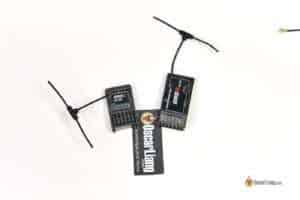 | **х** | **х** |
| [**Radiomaster (ER5C)**](https://oscarliang.com/product-tn27) **[Radiomaster (ER5A)](https://oscarliang.com/product-zgxo)** | [**RDQ**](https://oscarliang.com/product-hx8m) | [**BetaFPV**](https://oscarliang.com/product-lfid) |

Інші варіанти приймачів:

* HGLRC Hermes: [https://s.click.aliexpress.com/e/\_DnBCRbn](https://s.click.aliexpress.com/e/_DnBCRbn)

* JHEMCU RX24T (має підсилювач PA/LNA, здатний передавати телеметричні дані з потужністю 100 мВт, підходить для великих відстаней): [https://oscarliang.com/product-x2xp](https://oscarliang.com/product-x2xp)

* JHEMCU SP24S (майже ідентичний EP1): [https://oscarliang.com/product-srb0](https://oscarliang.com/product-srb0)

* Приймач AxisFlying ELRS: [https://oscarliang.com/product-jaxm](https://oscarliang.com/product-jaxm)

---

### **Запасні RX антени** {#запасні-rx-антени}

* BetaFPV Dipole T Antenna:[https://oscarliang.com/product-o5vm](https://oscarliang.com/product-o5vm)

* Radiomaster T Antenna:[https://oscarliang.com/product-r4t0](https://oscarliang.com/product-r4t0)

## **Чи потрібно оновлювати прошивку ExpressLRS?** {#чи-потрібно-оновлювати-прошивку-expresslrs?}

Це не обов’язково, але так буде краще.

Із кожним оновленням проект із відкритим кодом ExpressLRS надає нові виправлення помилок і покращує продуктивність, забезпечуючи оптимальну функціональність.

Прошивка ELRS використовує систему номерів версій із трьох частин: A.B.C

* A: основний номер версії *\[major version number\]*

* B: номер другорядної версії *\[minor version number\]*

* C: номер патча *\[patch number\]*

Усі випуски з однаковим номером **основної версії** перехресно сумісні, але не сумісні з різними основними версіями. Наприклад, 2.0 працюватиме з 2.1, 2.2, 2.5 тощо, але прошивка 2.x не зв’язуватиметься із 3.x.

---

## **Прошивка EdgeTX** {#прошивка-edgetx}

Якщо на вашому пульті встановлена OpenTX, подумайте про перепрошивання EdgeTX. EdgeTX — це новий, передовий форк *\[перероблений і покращений клон програми\]* OpenTX із частими оновленнями та багатьма додатковими функціями. Крім того, EdgeTX пропонує певні переваги для використання із ExpressLRS, такі як опитування джойстика із частотою 500 Гц. [Ознайомтеся з нашим посібником із перепрошивки EdgeTX на вашому пульті](https://oscarliang.com/flash-edgetx/).

Якщо ви хочете продовжити використовувати OpenTX *\[на відміну від EdgeTX\]*, переконайтеся, що ви оновили програму до 2.3.12 або новішої версії, перш ніж намагатися оновити прошивку ELRS на модулі передавача пульта (нові версії підтримують CRSFShot, який є необхідним для роботи ELRS). [Наш покроковий посібник із перепрошивки OpenTX допоможе вам почати роботу](https://oscarliang.com/flash-opentx-firmware-taranis/).

Як перевірити, чи є у вас OpenTX або EdgeTX на пульті? Натисніть кнопку «SYS», потім натискайте кнопку PAGE, доки не перейдете на останню сторінку «VERSION», і там ви побачите прошивку та версію.

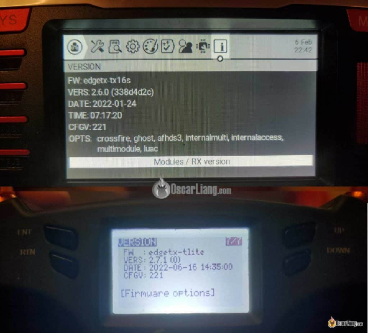

---

## **Завантажте конфігуратор ExpressLRS (ExpressLRS Configurator)** {#завантажте-конфігуратор-expresslrs-(expresslrs-configurator)}

Конфігуратор ExpressLRS дозволяє створювати, компілювати та прошивати прошивки для модулів приймача та пульта. Завантажити: [**https://github.com/ExpressLRS/ExpressLRS-Configurator/releases/latest**](https://github.com/ExpressLRS/ExpressLRS-Configurator/releases/latest) *\[прим. пер.: конфігуратор вже доступний українською за цим посиланням\]*

Для **Windows** клацніть посилання з такою назвою: **ExpressLRS-Configurator-Setup-X.X.X.exe**

Ваш комп'ютер має бути підключений до Інтернету під час використання конфігуратора.

---

## **Встановіть Сценарій LUA** {#встановіть-сценарій-lua}

[Сценарій LUA](https://www.expresslrs.org/quick-start/transmitters/lua-howto/) *\[LUA Script\]* — це міні-програма на пульті *\[прим. пер. нижче у цьому тексті міститься [окремій розділ](#налаштування-сценарію-elrs-lua) присвячений LUA\].* Сценарій ExpressLRS LUA дозволяє змінювати налаштування радіозв’язку, входити в режим прив’язки *\[bind mode\]*, увімкнути WiFi тощо.

Якщо у вас встановлено останню версію EdgeTX, вона постачається зі сценарієм ExpressLRS LUA, і вам не потрібно нічого робити.

Ви можете відкрити його, натиснувши кнопку SYS і вибравши «ExpressLRS».

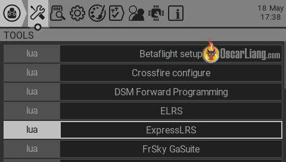

Якщо ви не можете його знайти, ви можете завантажити його в конфігураторі ExpressLRS, вибравши Реліз *\[Release\]* та Цільовий пристрій *\[Target\]*, і з’явиться кнопка «Завантажити сценарій LUA»*\[DOWNLOAD LUA SCRIPT\]*.

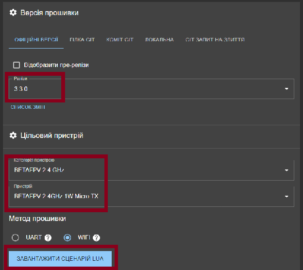

Завантажений файл повинен мати розширення “**.lua**”, помістіть цей файл у каталог на SD-карті вашого пульта: **\\SCRIPTS\\TOOLS\\**

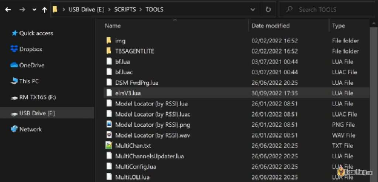

---

## **Визначте версію обладнання та прошивки** {#визначте-версію-обладнання-та-прошивки}

Є багато виробників, які виготовляють модулі приймачів і передавачів для ExpressLRS. Вам потрібно знати марку та модель апаратного забезпечення, аби залити вірну прошивку. Встановленя невірної прошивки може перетворити ваш пристрій на цеглину.

Найпростіший спосіб перевірити — зайти на веб\-сторінку через WiFi. Ось як це зробити. По-перше, увімкніть Wi-Fi на своєму пристрої, перейшовши до сценарію ExpressLRS LUA, виберіть WiFi Connectivity.

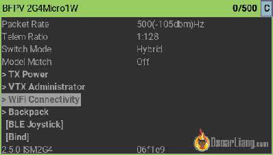

Потім увімкніть WiFi на потрібному пристрої — Enable WiFi.

Для приймачів ви також можете просто почекати 60 секунд, не вмикаючи пульт, і він автоматично перейде в режим WiFi.

На вашому ноутбуці ви повинні побачити мережу WiFi під назвою **ExpressLRS TX (або ExpressLRS RX)**. Підключіться до цієї мережі, пароль **expresslrs**.

Відкрийте браузер і введіть **10.0.0.1** в адресному рядку. Відкриється веб\-сайт, на якому буде вказано цільову прошивку *\[firmware target\],* яку він використовує. Ви також зможете перевірити версію вашої прошивки.

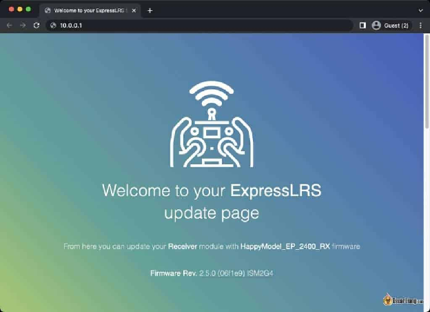

Якщо ви раніше [налаштували пристрій приєднуватись до домашньої мережі WiFi](https://oscarliang.com/setup-expresslrs-2-4ghz/#Adding-Home-WiFi-Network), то ви не побачите ExpressLRS TX (або ExpressLRS RX) серед мереж WiFi. Натомість залишайтеся на зв’язку з домашнім Wi-Fi роутером і ввійдіть **http://elrs\_rx.local/** або **http://elrs\_tx.local/** в адресному рядку браузера.

 

В якості альтернативи, для модулів передавача ELRS ви також можете знайти виробника, модель і версію мікропрограми в сценарії LUA (у верхній і нижній частині сторінки — тут на картинці BFPV 2G4Micro1W). Для приймачів перейдіть у «Інші пристрої» *\[Other Devices\]* у сценарії LUA та клацніть на приймачі, там має відображатися версія прошивки (працює лише починаючи з V3).

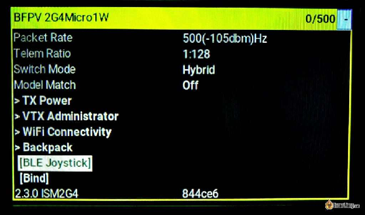

---

## **Скомпілюйте та прошийте передавач пульта** {#скомпілюйте-та-прошийте-передавач-пульта}

Ви можете прошити модуль передавача пульта *\[TX\]* одним із таких методів:

* UART/USB

* WiFi

Я вважаю, що Wi-Fi є простішим і надійнішим способом. Я покажу, як це зробити тут. Ви також можете використовувати USB, про що я поясню трохи пізніше.

### **Збірка прошивки ELRS TX** {#збірка-прошивки-elrs-tx}

Перед перепрошивкою вам потрібно спочатку скомпілювати прошивку за допомогою конфігуратора ExpressLRS. *\[Прим. пер.: якщо будете шити з 2.х на 3.х, рекомендую глянути документацію по вашому модулю. Н-д по **внутрішнім** модулям Radiomaster, [є обмеження і рекомендації як прошивати з 2.x на 3.x](https://www.expresslrs.org/quick-start/transmitters/rm-internal/?h=tx12)\]*

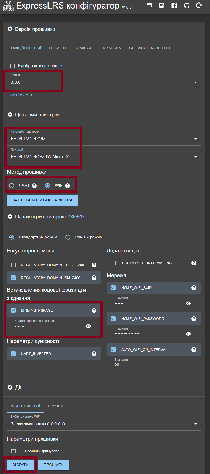

У розділі Релізи виберіть останню версію прошивки.

У розділі Цільовий пристрій виберіть марку та модель пристрою. У цьому прикладі я маю BetaFPV Micro 1W TX, тому цільовий пристрій буде таким:

* **Device Category *\[категорія пристрою\]*: BetaFPV 2,4 GHz**

* **Device *\[пристрій\]*: BetaFPV 2400 TX Micro 1000mW**

Дозвольте мені пояснити, що означають деякі налаштування.

**Regulatory Domains** *\[Регуляторні юрисдикції, котрі за усталеною інженерною традицією інколи калькують із англ. називаючи «домени»\]* — залежно від того, де ви перебуваєте, друга опція «EU\_CE» призначена для жителів ЄС, будь-де в іншому місці виберіть першу опцію «ISM».

**Binding Phrase** *\[кодова фраза для з'єднання\]* — це як ключ від вашого автомобіля, будьте креативними та складіть унікальну фразу, щоб люди, з якими ви летите, випадково не використали ту саму фразу та не створили проблем. Зверніть увагу, що інші люди ЗМОЖУТЬ керувати вашим дроном, якщо вони використовують ту саму кодову фразу.

**Network \=\> Auto WiFi On Interval** *\[Мережа \=\> Інтервал автоматичного увімкнення WiFi\]*: через скільки секунд вмикається режим WiFi, якщо радіозв’язок не встановлено. За замовчуванням — 60, але особисто я вважаю за краще встановити значення 20\. Якщо приймач перейде в режим Wi-Fi, вам просто потрібно від’єднати батарею та знову її підключити.

**Network \=\> HOME\_WIFI** *\[Мережа \=\> Домашній\_WIFI\]*: [Дивіться тут для більш детальної інформації](https://oscarliang.com/flash-opentx-firmware-taranis/#adding-home-wifi-network).

Конфігуратор запам'ятає ваш вибір, тому вам не потрібно буде вибирати його знову наступного разу.

### **Прошивка модуля передавача через Wi-Fi** {#прошивка-модуля-передавача-через-wi-fi}

Коли ви задоволені параметрами прошивки, виберіть WiFi у розділі «Flashing method» *\[Метод прошивки\]*.

Натисніть на кнопку **Зібрати** *\[Build\]* (а НЕ на Build and Flash), щоб скомпілювати прошивку. Це може зайняти кілька хвилин залежно від швидкості вашого Інтернету.

Коли це буде зроблено, має з’явитися вікно з двома файлами, один із яких має назву “**firmware.bin**” та інший, названий відповідно до вибраного вами типу модуля. Зверніть увагу, що два файли є **однаковими**, просто мають різні назви. Ви можете використовувати будь-який з цих двох файлів для прошивки свого модуля передавача.

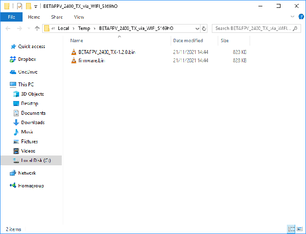

Підключіть модуль передавача до відсіку для радіомодуля та увімкніть пульт.

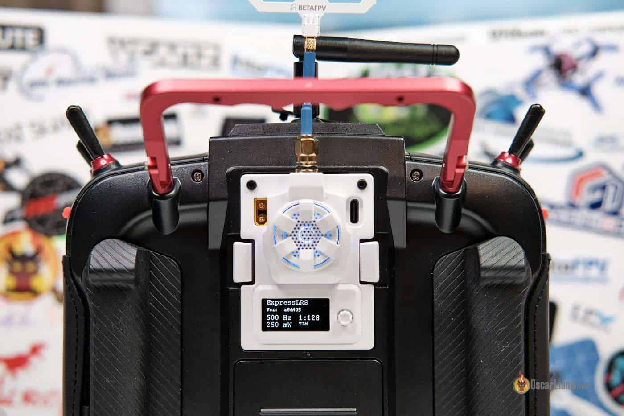

На вашому пульті, [налаштуйте новий профіль моделі](https://oscarliang.com/setup-tx16s-t16-radio/#creating-models), в **Model Setup** *\[Налаштування моделі\]*, під **External RF** *\[Зовнішнє радіо\]*, виберіть **CRSF** у якості режиму. Якщо ваш модуль є внутрішнім модулем (тобто вбудованим у радіоприймач), вам потрібно вибрати CRSF у розділі **Internal RF**.

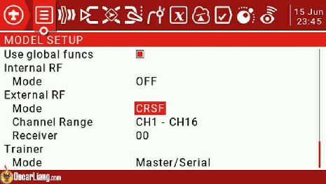

Відкрийте сценарій LUA, натиснувши кнопку SYS в панелі **Tools** *\[Інструменти\]*, виберіть **ExpressLRS.**

Виберіть **WiFi Connectivity** *\[Підключення WiFi\]*.

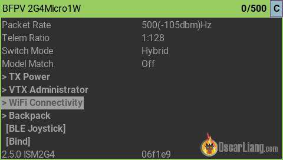

Виберіть «Enable WiFi» *\[Увімкнути WiFi\]* і залиште свій пульт увімкненим.

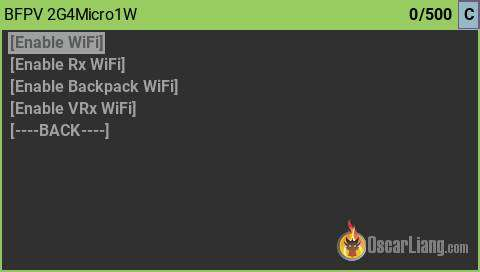

Перейдіть до Wi-Fi свого комп’ютера, ви повинні знайти нову мережу під назвою «**ExpressLRS TX Module**». Пароль WiFi: **expresslrs**

Відкрийте браузер і перейдіть до 10.0.0.1

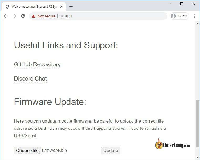

Натисніть "**Choose file**” і виберіть «**firmware.bin**», згенерований раніше в конфігураторі ExpressLRS.

Натисніть **Update** *\[оновлення\]*. Готовченко\!

### **Прошивка передавача через UART/USB** {#прошивка-передавача-через-uart/usb}

Ви можете використовувати порт USB на модулі передавача для прошивки.

Можливо, вам знадобиться інсталювати драйвер CP210x (завантажити його можна тут: [https://www.silabs.com/developers/usb-to-uart-bridge-vcp-drivers](https://www.silabs.com/developers/usb-to-uart-bridge-vcp-drivers)). Я спробував стандартний драйвер Windows, оскільки він постачається із інсталятором, версія 6.7.6, здається, працює нормально.

Цей процес працюватиме майже з будь-яким модулем передачі ExpressLRS. У деяких новіших модулях можна просто підключити USB-кабель, і він одразу прошиється. Однак деякі старіші модулі мають перемикач на друкованій платі, вам потрібно поставити їх у правильне положення, щоб прошити. Зверніться до посібника по даному модулю, якщо ви бачите ці перемикачі у себе. Наприклад, модуль BetaFPV Micro TX має ці перемикачі.

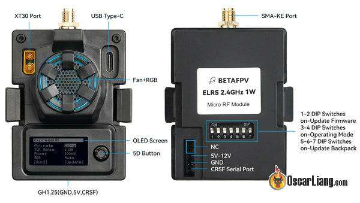

Підключіть USB-кабель до модуля TX, на вашому комп’ютері має з’явитися новий COM-порт.

У конфігураторі ExpressLRS у розділі Метод прошивки *\[Flashing method\]* виберіть UART. Коли будете готові, натисніть **Прошити** (на відміну від кнопки Build / Зібрати в попередньому випадку, коли прошивали через WiFi). Прошивання триватиме кілька хвилин.

---

## **Підключіть приймач ELRS до польотного контроллера** {#підключіть-приймач-elrs-до-польотного-контроллера}

Ось контакти приймачів PP, EP1 і EP2.

Підключіть контакти TX і RX до будь-якого незадіяного UART на польотному контроллері. НЕ використовуйте soft-serial, оскільки він занадто повільний.

Підключіть TX *\[польотника\]* до RX *\[приймача\]*, а RX *\[польотника\]* до TX *\[приймача\]*.

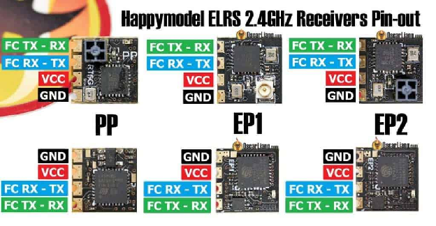 Ось розпіновка для BetaFPV ELRS Nano RX.

## 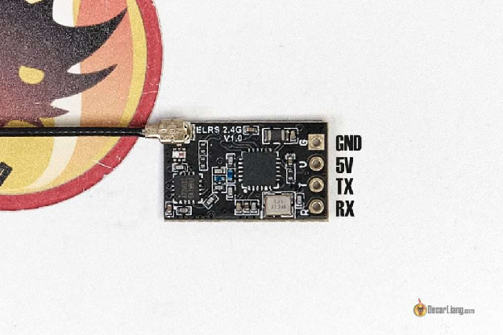 {#betafpv-expresslrs-nano-rx-close-up}

## **Створення образу та прошивка приймача** {#створення-образу-та-прошивка-приймача}

Для приймачів із вбудованим Wi-Fi можна прошивати через WiFi, так само як ми прошиваємо передавач пульта. Але особисто мені було легше використовувати Betaflight Passthrough для прошивки приймача, і я продемонструю це тут.

Відкрийте конфігуратор ExpressLRS, виберіть ту саму версію прошивки, що й ваш модуль передавача TX, і виберіть цільовий пристрій на використовуючи марку та тип приймача. Наприклад:

* Для приймача PP пристрій: **HappyModel PP 2400 RX**

* Для приймачів EP1 і EP2 пристрій: **HappyModel EP 2400 RX**

Обов’язково встановіть однакову кодову фразу для біндування як на вашому передавачі — тоді ваш приймач просто зв’яжеться з передавачем автоматично після перепрошивання мікропрограми. Якщо ви не встановите кодову фразу для біндування, [ви можете зв'язати його вручну, як описано тут](https://oscarliang.com/setup-expresslrs-2-4ghz/#Binding-Receiver).

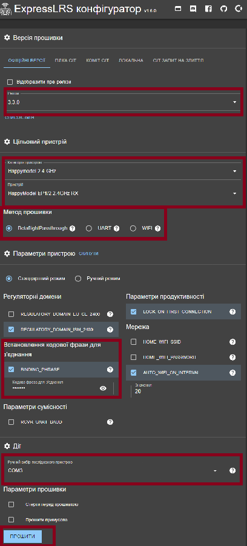

### **Прошийте приймач за допомогою Betaflight Passthrough** {#прошийте-приймач-за-допомогою-betaflight-passthrough}

Перш ніж продовжити, переконайтеся, що [спочатку налаштували Betaflight, як описано в цьому розділі](#налаштування-betaflight-для-приймача-expresslrs).

Тепер підключіть USB-кабель до квадрокоптера, щоб живити польотний контролер і модуль передавача.

У конфігураторі ExpressLRS виберіть COM-порт польотного контролера (якщо не впевнені, перевірте COM-порт у Betaflight Configurator, але не забудьте від’єднати/закрити конфігуратор після цього). Натисніть **ПРОШИТИ**. Це займе кілька хвилин.

### **Прошивка приймача через WiFi** {#прошивка-приймача-через-wifi}

В основному кроки такі ж, як і для перепрошивання модуля пульта через WiFi. Деякі приймачі не підтримують Wi-Fi, тому перевірте, перш ніж продовжити.

У конфігураторі ExpressLRS натисніть кнопку **ЗІБРАТИ** для компіляції **firmware.bin** файлу.

За замовчуванням, якщо ви включите живлення приймача, не вмикаючи радіо, через 60 секунд він перейде в режим WiFi (світлодіод буде швидко блимати, щоб вказати на це). Сигнал Wi-Fi приймача досить слабкий, тому розмістіть приймач ближче до антени Wi-Fi вашого комп’ютера.

Підключіться до мережі WiFi "**ExpressLRS RX**“. Пароль WiFi:**expresslrs**

Перейдіть до **10.0.0.1** у вашому браузері та завантажте файл прошивки.

### **Прошивка приймача через UART** {#прошивка-приймача-через-uart}

У рідкісних випадках, якщо жоден із наведених вище методів не працює, ви можете спробувати перепрошити через UART, як описано [тут](https://github.com/ExpressLRS/ExpressLRS/wiki/Updating-ExpressLRS-\(from-GitHub\)#uart-updating).

### **Прошивка приймача через FDTI** {#прошивка-приймача-через-fdti}

Якщо з будь-якої причини ви заблокували свій RX, що могло трапитися, якщо під час перепрошивки ви втратили живлення або з’єднання, ви можете відновити його, перепрошивши через FDTI: [https://www.expresslrs.org/2.0/quick-start/receivers/hmep2400/\#flashing-via-ftdi](https://www.expresslrs.org/2.0/quick-start/receivers/hmep2400/#flashing-via-ftdi).

## **Прошивка приймачів SPI ExpressLRS** {#прошивка-приймачів-spi-expresslrs}

Деякі польотники вупів мають приймач ELRS, інтегрований в плату польотника, і він зазвичай використовує з’єднання SPI замість з’єднання UART. Хорошим прикладом може бути [Happymodel X12 AIO 5in1 FC](https://oscarliang.com/product-po3r) у версії ELRS [Mobula7](https://oscarliang.com/mobula7-1s-whoop/).

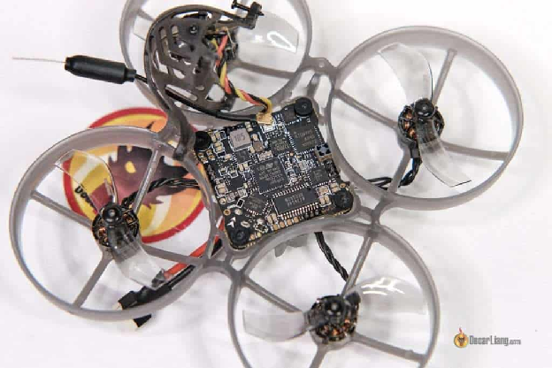

Добре те, що вам не потрібно турбуватися про підключення дротів, оскільки приймач є лише частиною польотного контролера.

Але перепрошити приймач трохи складно. Щоб оновити мікропрограму приймача, вам потрібно встановити останню версію мікропрограми Betaflight, оскільки мікропрограму ExpressLRS вбудовано в мікропрограму Betaflight для цього польотного контролера. Усі параметри збірки (наприклад, юрисдикція/домен, режим перемикання тощо) знаходяться у інтерфейсі командного рядка Betaflight (введіть «get expresslrs» і ви побачите їх усі) *\[прим. пер.: у більшості пультів Radiomaster вбудований модуль іде із ELRS v3, а виробники-китайці відправляють Mobula 7 з прошивкою на ELRS v2. Але якщо ви встановите оновлення Betaflight до 4.4, то ELRS стане v3 і там же можна буде прописати кодову фразу для з’єднання — див. скріншот нижче\].*

Щоб перевірити, чи є у вас приймач SPI ELRS, просто перейдіть до конфігуратора Betaflight, вкладка «Приймач» і перевірте, чи встановлено SPI RX / ExpressLRS.

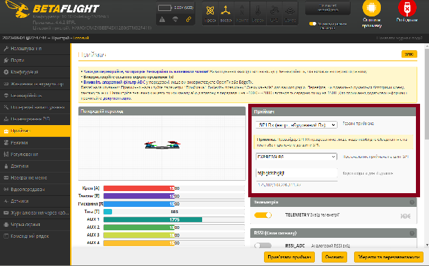

---

## 

## **Прив’язка приймача** {#прив’язка-приймача}

Ось як прив’язати приймачі ELRS до передавача. Є два шляхи.

### **Прив’язка через кодову фразу для з’єднання** {#прив’язка-через-кодову-фразу-для-з’єднання}

Якщо ви встановили бінд-фразу *\[binding phrase\]* під час прошивки як передавача, так і приймача, вам не потрібно нічого робити. Передавач та приймач просто автоматично зв’яжуться під час увімкнення. Після успішного прив’язування світлодіодний індикатор стану на приймачі повинен згаснути. Ви також можете встановити фразу прив’язки на приймачі [за допомогою інтерфейсу WiFi](#додаткові-налаштування-приймача).

Коли приймач вперше вмикається, він шукає передавач із відповідною кодовою  фразою. Після встановлення з’єднання його буде синхронізовано, тобто інший пристрій не зможе під’єднатися до нього.

Однак якщо хтось інший використовує таку саму фразу з’єднання на своєму пульті та має сильніший сигнал, ніж ви, імовірно, ваш приймач спочатку зв’яжеться із тим іншим передавачем. Відповідно, його власник зможе взяти під контроль ваш квадрокоптер. Це був би надзвичайно рідкісний сценарій *\[прим. пер.: привіт, кацапський РЕБ\],* і навіть якщо хтось захоче зробити це навмисно, це буде дуже важко здійснити, все ж найкраще, якщо ви триматимете свою бінд-фразу в таємниці та зробите її якомога унікальнішою.

### **Процедура зв’язування без бінд-фрази** {#процедура-зв’язування-без-бінд-фрази}

Якщо ви не встановили бінд-кодову фразу, ви можете вручну прив’язати свій приймач до передавача, виконавши такі дії:

1. Увімкніть приймач три рази поспіль, щоб перевести його у режим прив’язки (увімкніть приймач, потім негайно від’єднайте живлення. Повторіть знову). Коли приймач вмикається втретє, світлодіод почне блимати двічі, вказуючи на те, що приймач знаходиться у режимі прив’язки.

2. Підключіть модуль ELRS TX до пульта, увімкніть Зовнішній модуль і виберіть протокол CRSF. Виконайте сценарій LUA ELRS у системних параметрах, інструментах. Виберіть «Прив’язати» *\[Bind\],* і світлодіодний індикатор на модулі приймача загориться безперервним світлом у разі успішного прив’язування.

**Якщо приймач не переходить у режим прив’язки, ймовірно, ви надіслали на приймач бінд-фразу. Спробуйте знову прошити приймач із вимкненою бінд-фразою для з’єднання.**

Коли приймач і передавач зв’язані, ви повинні побачити «**C**» у верхньому правому куті сценарію LUA під час їх увімкнення. Однак, коли вони вимкнені або не прив’язані, ви отримаєте «**–**» *\[прим. пер.: для Mobula7 треба ставити частоту на пульті 250Hz, інакше не буде підключатись\].*

---

## **Світлодіодний індикатор стану приймача** {#світлодіодний-індикатор-стану-приймача}

Значення монохромного світлодіода:

* Постійно-увімкнений світлодіод означає успішне прив’язування або встановлення з’єднання.

* Подвійне блимання означає, що пристрій знаходиться у режимі прив’язки.

* Повільне блимання означає очікування підключення модуля пульта.

* Швидке спалахування означає, що він у режимі точки доступу WiFi, ви можете підключитися до мережі WiFi приймача, щоб оновити мікропрограму RX, відвідавши 10.0.0.1 у своєму браузері (пароль: expresslrs).

* Потрійне блимання та пауза — невідповідність моделі (переконайтеся, що режим «Відповідність моделі» або вимкнено на TX та RX, або що ідентифікатори однакові на обох пристроях).

Значення кольорового RGB LED:

* Ефект зникнення веселки *\[Rainbow fade effect\]:* запуск.

* Зелене серцебиття *\[Green heartbeat\]:* увімкнено режим веб\-оновлення.

* Повільне блимання *\[Slow blink\]:* Очікування підключення від передавача.

* Швидке перемикання червоного *\[Red rapid flashing\]:* радіочіп не виявлено.

* Помаранчеве подвійне блимання та пауза *\[Orange double blink then pause\]:* увімкнено режим прив’язки.

* Помаранчеве потрійне блимання та пауза *\[Orange triple blink then pause\]:* підключено до передавача, але конфігурація моделі не відповідає.

* Суцільний один колір *\[Solid single color\]:* підключено до передавача, колір вказує на швидкість передачі пакетів і режим.

---

## **Налаштування Betaflight для приймача ExpressLRS** {#налаштування-betaflight-для-приймача-expresslrs}

Щоб налаштувати ExpressLRS RX:

Перейдіть до розділу «**Порти**» на вкладці [Конфігуратор Betaflight](https://oscarliang.com/download-betaflight-configurator/) і ввімкніть «**Послідовний RX**» для UART, до якого ви підключили приймач ELRS. Натисніть «**Зберегти**».

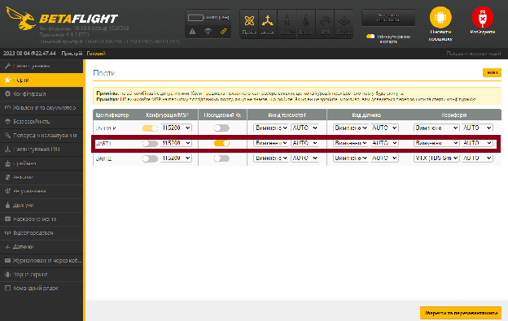

У розділі «**Приймач**» під вкладкою «**Приймач**» виберіть «**Послідовний (через UART)»** як режим приймача та виберіть «**CRSF**» у полі «Постачальник послідовного приймача». Увімкніть перемикач «**Телеметрія**», і натисніть «**Зберегти та перезавантажити**».

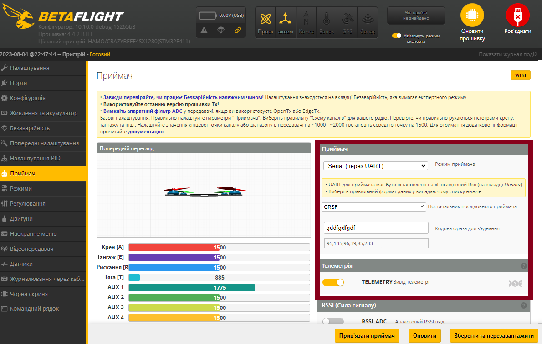

Тепер ваш приймач має працювати.

Аби перевірити це: поверніться до вкладки «**Приймач**» — ви повинні побачити реакцію на рух стіків. Якщо канали розташовані у неправильному порядку, просто спробуйте іншу «[Схему каналів](https://oscarliang.com/channel-map/)».

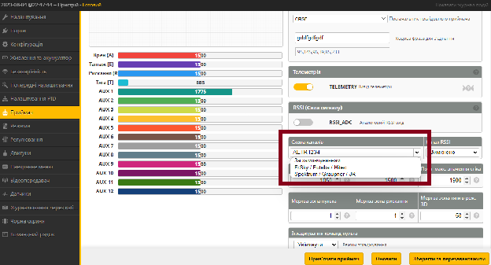

Перевірте, чи правильно налаштовані кінцеві точки (1000 або трохи нижче / 2000 або трохи вище) і середні точки (1500), [дивіться цей посібник, щоб дізнатися, як налаштувати](https://oscarliang.com/adjust-tx-channel-mid-end-point/) якщо вони не правильні.

Щоб переконатися, що телеметрія працює, перейдіть на сторінку телеметрії в пульті та виберіть опцію «**Видалити всі датчики**», потім «**Відкрийте для себе нові датчики**» *\[Discover new sensors\].*

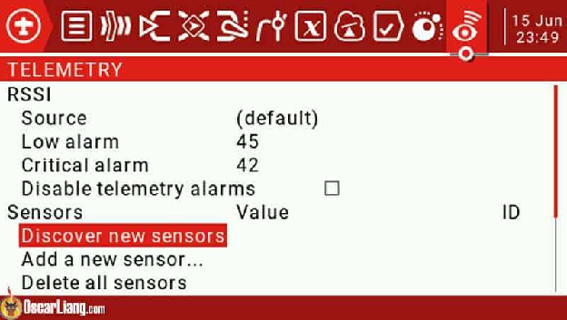

Блимання зірочки означає, що телеметрія оновлюється.

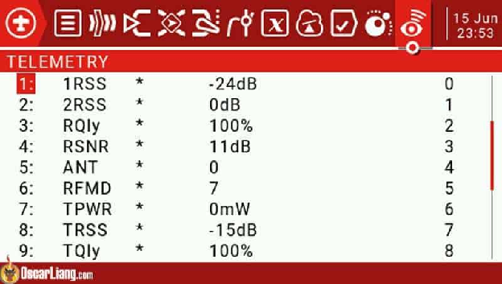

На вкладці «Режими» ви **ПОВИННІ встановити AUX 1 як перемикач взведення — ARM** (AUX1 завжди є 2-позиційним перемикачем, розобленим спеціально для взведення / охолощення ExpressLRS).

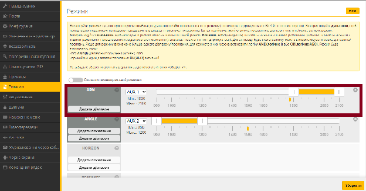

---

## **Відображення LQ \[якість зв’язку\] і RSSI в наекранному меню** {#відображення-lq-[якість-зв’язку]-і-rssi-в-наекранному-меню}

Подальше читання: [Що таке LQ і RSSI](https://oscarliang.com/lq-rssi/)?

Стисло:

* RSSI — потужність сигналу, наскільки гучний сигнал (значення від \-130 дБм до 0 дБм)

* LQ — якість зв’язку: наскільки добре ваш приймач може «зрозуміти» сигнал (значення від 100% до 0%)

Обидва індикатори корисні, але якщо вам потрібно вибрати один, то LQ, ймовірно, важливіший. Для правильного відображення LQ вам слід використовувати останню версію Betaflight (4.2 або новішу), де представлено новий формат RFMD:LQ% для елемента наекранного меню LQ *\[Якість зв’язку\].*

* На вкладці «Приймач» вимкніть **«RSSI\_ADC»**, виберіть значення «**Вимкнено**» для меню «**Канал RSSI»**.  
  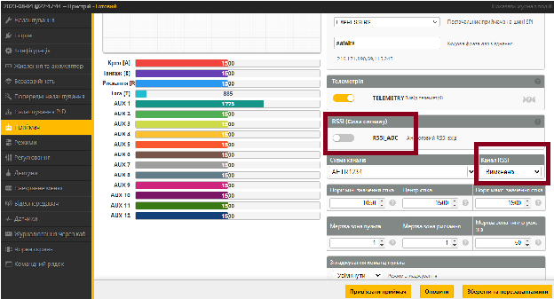

* На вкладці «Наекранне меню» увімкніть «**Значення RSSI в дБм»**  
  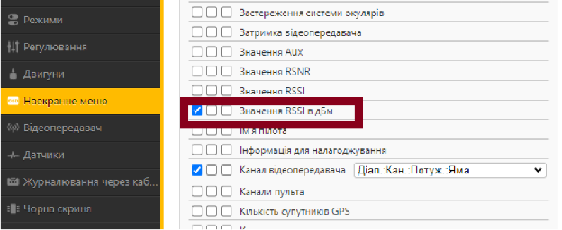

Корисно мати обидва індикатори. Наприклад:

* Високе значення LQ, високий RSSI \= гарний радіозв’язок.

* Низьке LQ, високий RSSI \= шумне радіочастотне середовище.

* Високе LQ, низький RSSI \= якщо ви дуже далеко, потрібна обережність, оскільки ви наближаєтеся до граничної відстані; Якщо приймач знаходиться дуже близько до передавача, це може свідчити про проблему з антеною.

* Низьке LQ, низький RSSI \= кінець відстані стійкого радіозв’язку, вам слід повернути назад, оскільки ймовірно включиться режим безаварійності.  
  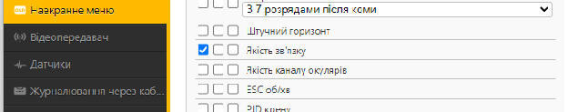

---

## **Встановлення вашої антени** {#встановлення-вашої-антени}

Моя рекомендація полягає у тому, щоб монтувати антену приймача вертикально, якщо це можливо. Ви також можете встановити його горизонтально, якщо літаєте лише на короткі відстані. [Перегляньте цю публікацію для більш детальної інформації](http://bit.ly/HowtoPositionAntenna).

---

## **Налаштування Безаварійності** {#налаштування-безаварійності}

Цифрові протоколи радіокерованих моделей зазвичай містять позначку безаварійності в пакеті даних, яку польотний контролер може виявити автоматично, тому немає необхідності ручного налаштування на пульті. Однак важливо [переглянути вкладку «Безаварійність» у Betaflight](https://oscarliang.com/setup-failsafe/) і визначити: яку дію повинен виконати дрон коли спрацює парамтер безаварійності.

Щоб переконатися, що «Безаварійність» працює належним чином — проведіть тестування на відключення. Встановіть квадрокоптер, зніміть усі пропелери та вимкніть радіо. Двигуни повинні перестати обертатися протягом кількох секунд. Будьте готові від'єднати батарею в разі будь-яких проблем.

---

## **Налаштування сценарію ELRS LUA** {#налаштування-сценарію-elrs-lua}

У сценарії [ExpressLRS LUA](https://www.expresslrs.org/quick-start/transmitters/lua-howto/) є три основні параметри, які вам слід знати: частота пакетів *\[packet rate\]*, коефіцієнт телеметрії *\[telem ratio\]* і потужність передачі *\[TX power\].*

### **Потужність передачі** {#потужність-передачі}

Більшість модулів підтримують принаймні 250 мВт, деякі навіть здатні до 1 Вт. Випробування показали, що 100 мВт може досягти діапазону 33 км із стандартним обладнанням 2,4 ГГц, що може перевершити відеозв’язок 5,8 ГГц. Однак більш високе енергоспоживання може значно скоротити термін служби батареї пульта та збільшити ризик перегріву без належного охолодження. Рекомендується вмикати вентилятор, якщо вихідна потужність перевищує 250 мВт (встановіть поріг вентилятора на 250 мВт).

Увімкнувши режим «Dynamic Power» *\[динамічна потужність\],* система автоматично регулює вихідну потужність залежно від потужності сигналу. Режим динамічної потужності використовує SNR *\[співвідношення сигнал/шум\]* замість RSSI *\[індикатор рівня потужності отриманого сигналу\]* для визначення потужності, оскільки RSSI не враховує рівень шуму або наявність у приймача підсилювача. Це потенційно може заощадити час роботи батареї, оскільки зменшує потужність, коли приймач знаходиться поблизу, і збільшує потужність лише тоді, коли це необхідно. Якщо у вас увімкнено режим «Dynamic Power», то верхньою межею буде «MAX Power» — максимальна потужність для динамічного режиму потужності.

Відповідний рівень потужності для вашого FPV-дрона залежить від бажаної частоти пакетів і діапазону. Запуск ExpressLRS на частоті 50 Гц може забезпечити надзвичайний діапазон навіть при потужності 100 мВт. Однак, якщо ви плануєте використовувати вищу частоту передачі пакетів, як-от 500 Гц, ваш діапазон буде значно зменшений, і вам може знадобитися більше вихідної потужності, щоб підтримувати той самий діапазон. *\[прим. пер.: для Mobula7 доведеться поставити 250Гц, якщо більше — вона не бачитиме пульт\].*

[Ознайомтеся з поняттям дБ](https://bit.ly/LiangMaximizingFPVrange) і ви можете виконати обчислення, використовуючи чутливість приймача та вихідну потужність, щоб визначити різницю в діапазоні між різними швидкостями пакетів і рівнями потужності, це допоможе вам прийняти рішення. 250 мВт повинно бути достатньо для більшості людей, які літають у радіусі кількох миль навіть на частоті 500 Гц, але, звичайно, більша потужність забезпечить вам також краще проникнення сигналу, а не лише дальність. Незалежно від потужності, якщо вам потрібен надійніший зв’язок або літати на велику відстань, як правило, доцільно дотримуватися нижчої швидкості передачі пакетів, наприклад 50 Гц, оскільки це забезпечує вищу чутливість сигналу.

### **Частота пакетів (Packet rate)** {#частота-пакетів-(packet-rate)}

Частота передачі пакетів — це компроміс між діапазоном і затримкою, просто неможливо мати обидва. Вища частота пакетів має меншу затримку на відправку команд керування, але зменшує радіус дії стабільного радіозв’язку.

У ELRS V3 доступні режими частоти пакетів:

* **500 Гц, 250 Гц, 150 Гц, 50 Гц** — це звичайний режим із використанням LoRa-модуляції, яка має більший діапазон і кращу стійкість до радіочастотних перешкод.

* **F1000, F500** — це режим «F» або «FLRC» (Fast Long Range Communication), він пропонує швидшу модуляцію та меншу затримку, але працює на меншій відстані, ніж у звичайному режимі. Підтримується частоти 500 Гц і 1000 Гц. Чудово підходить для гонщиків. Режим F1000 має найнижчу затримку. Справа не в «відчутті», я сумніваюся, що більшість людей навіть можуть відрізнити 150 Гц від 500 Гц, але надсилання вашої команди навіть на 1 мс швидше означає, що ви можете зреагувати на 1 мс швидше, що має вирішальне значення під час реагування на критичні ситуації, такі як перегони, і може допомогти вам уникнути аварії.

* **D500, D250** — це режим «D», або «DVDA» (Deja Vu Diversity Aid), забезпечує краще з’єднання в умовах складних перешкод, надсилаючи той самий пакет даних кілька разів, щоб зменшити ймовірність втрати даних. D500 і D250 вказують, що той самий пакет даних надсилається двічі та чотири рази відповідно. Режим D підтримує вашу якість зв’язку LQ на високому рівні та запобігає ймовірності тремтіння *\[jitter\]* ціною трохи більшої затримки. Чудово підходить для гонок. Він працює в режимі FLRC (F1000), тому радіус дії буде меншим, ніж у звичайному режимі.

* **333 Гц Full \[Повний\], 100 Гц Full \[Повний\]** — до 16 каналів повної роздільної здатності (10 біт) із частотою пакетів 100 Гц і 333 Гц.

FLRC на 1000 Гц є найкращим режимом для перегонів, оскільки він має найнижчу затримку. Режими LoRa (звичайний режим) мають найкращий діапазон. Повільніші частоти оновлення мають більшу затримку, але довшу відстань стабільного радіозв’язку. Режими FLRC «D» мають зменшене тремтіння, але вищу затримку, ніж режими FLRC «F». Зауважте, що частота оновлення 500 Гц або вище недоступна у деяких передавачах. Зокрема, [Tango 2](https://oscarliang.com/tbs-tango-2/) підтримує лише до 250 Гц.

### **Співвідношення телеметрії** {#співвідношення-телеметрії}

*Телеметрія — це функція, яка зазвичай доступна в протоколах радіозв’язку. Вона дозволяє приймачу надсилати дані назад на пульт. Це можуть такі показники, як напруга акумулятора, якість сигналу зв’язку, RSSI, координати GPS тощо.*

У ExpressLRS телеметрія ввімкнена за замовчуванням. Вона надсилає  назад на пульт дані, що пов’язані із радіозв’язком (наприклад: RSSI та LQ). Якщо ви збираєтеся використовувати телеметрію для надсилання інформації про ваш дрон назад на передавач, наприклад: напругу акумулятора, вам потрібно увімкнути функцію «Телеметрія» на вкладці «Приймач» в Betaflight.

Співвідношення телеметрії в налаштуваннях ExpressLRS визначає частоту надсилання даних телеметрії. Більше число означає повільніше оновлення телеметрії, напр. 1:8 означає, що телеметричні дані надсилаються кожні 8 кадрів, а 1:128 — кожні 128 кадрів (очевидно, що 1:8 оновлюється частіше, ніж 1:128).

Частіша телеметрія збільшить затримку у каналі керування, тому ви можете зменшити кількість телеметрії *\[прим. пер.: 1:128 — менше телеметрії, ніж 1:8\]* або навіть повністю вимкнути телеметрію в сценарії LUA, якщо вам потрібна рівномірна частота пакетів. Менш із тим: я рекомендую лишати телеметрію, якщо ви літаєте на великі відстані.

Якщо ви отримуєте попередження «Телеметрію втрачено» *\[Telemetry Lost\],* коли якість зв’язку все ще виглядає хорошою — можливо, у вас встановлено занадто низьке співвідношення телеметрії. Спробуйте збільшувати параметр «Telem Ratio» крок за кроком *\[прим. пер. 1:128 \-\> 1:64, і т.д.\]*, доки не зникне попередження «Телеметрію втрачено».

### **Канали** {#канали}

Скільки каналів підтримує ELRS? Від 9 до 16 каналів залежно від частоти пакетів і режиму перемикачів.

Для прикладу:

* На 500 Гц або 1000 Гц у гібридному або широкому режимі перемикачів ви отримуєте 12 каналів.

* На 100 Гц або 333 Гц у Full Res *\[повна роздільна здатність\]* 16CH ви отримуєте 16 каналів.

Перші 4 канали призначені для ваших стіків — крен, тангаж, тяга і рискання. Ці канали мають 10-бітну повну роздільну здатність, і їхні команди надсилаються щоразу.

Решта каналів — це канали AUX, які зазвичай використовуються для перемикачів на пульті. Роздільна здатність каналів визначається опцією під назвою «Switch Mode». Канали з вищою роздільною здатністю призводять до більшої затримки.

Перший канал AUX, AUX1 (канал 5), призначений для використання в якості перемикача взведення (ARM switch), і це завжди 2-позиційний канал (коли ВИМКНЕНО, він надсилає 1000, коли УВІМКНЕНО, надсилає 2000\) незалежно від режиму перемикачів (за винятком Full Res 16ch Rate/2).

### **Режим перемикачів** {#режим-перемикачів}

Налаштування Switch Mode *\[режим перемикачів\]* контролює, як канали AUX1—AUX8 (канали з 5 по 12\) надсилаються до приймача (перші 4 основні канали завжди 10-бітні). Варіанти вашого вибору: «гібридний» і «широкий».

У «гібридному» режимі більшість ваших каналів будуть лише 2- або 3-позиційними, це робиться для меншої затримки.

«Широкий» режим робить ваші канали 64- або 128-позиційними, чого більш ніж достатньо для більшості речей, які ми хочемо робити, і це те, що я зазвичай рекомендую використовувати для дронів FPV.

---

## **Додаткові налаштування приймача** {#додаткові-налаштування-приймача}

Більше налаштувань доступні при підключенні до приймача через WiFi (на сторінці, де ви робите прошивку приймача).

Спочатку увімкніть приймач і зачекайте, поки він перейде в режим точки доступу WiFi. Він робить це автоматично після 60 секунд від заживлення за замовчуванням (індикатор швидко блимає, коли він у режимі WiFi). Або ви також можете змусити приймач перейти в режим WiFi за допомогою сценарію LUA на пульті.

Тепер підключіться до мережі WiFi (пароль WiFi: **expresslrs**). У своєму браузері перейдіть до 10.0.0.1

На цій сторінці прокрутіть униз, і ви знайдете додаткові параметри, як-от «Відповідність моделі» *\[Model Match\].* Для ШІМ-приймачів у вас також будуть такі налаштування, як «ШІМ-вихід» і «Позиції Безаварійності» для кожного каналу, а також можливість інвертувати вихідні сигнали каналів. Ці параметри поки що недоступні в сценарії LUA.

## **Параметри підвищення продуктивності** {#параметри-підвищення-продуктивності}

У Betaflight вам слід застосувати відповідний пресет RC\_Link для конкретної частоти пакетів, яку ви використовуєте. Якщо цього не зробити, виникнуть проблеми з упередженням *\[англ. — feedforward\]*.

[Перегляньте мій посібник із налаштування Betaflight для отримання додаткової інформації](https://bit.ly/Betaflight10Steps).

---

## **Додавання домашньої мережі WiFi** {#додавання-домашньої-мережі-wifi}

Налаштування «Домашної мережі WiFi» у ExpressLRS значно полегшує перепрошивання прошивки. Коли ви переводите модуль передавача або приймач ELRS у режим WiFi, він автоматично підключатиметься до вашої домашньої мережі WiFi, після чого ви зможете прошивати свого дрона через браузер зі свого комп’ютера. Це легко\!

Щоб налаштувати його, вам спочатку потрібно перепрошити модулі TX і RX за допомогою «HOME\_WIFI\_SSID» і «HOME\_WIFI\_PASSWORD». Це ім’я та пароль вашої домашньої мережі WiFi. Навіть якщо ви вже користуєтеся найновішою прошивкою, вам потрібно буде перепрошити, щоб модуль передавача та приймач розуміли ваш індентифікатор мережі і пароль. Тоді все спрацює.

Як зробите це — ви можете ввімкнути режим WiFi. Це можна зробити за допомогою сценарію LUA.

Відкрийте конфігуратор ExpressLRS. Він автоматично виявить ваш пристрій ELRS. Клацніть DNS (elrs\_tx.local або elrs\_rx.local) або IP-адресу (192.168.0.XXX), якщо це не працює, просто спробуйте інший, один із них має працювати.

Це приведе вас до сторінки для завантаження мікропрограми, так само як і для перепрошивки за допомогою WiFi, методу, який ми розглядали раніше.

## 

## 

## **Як використовувати функціонал «відповідність моделі»** *\[Model Match\]* {#як-використовувати-функціонал-«відповідність-моделі»-[model-match]}

[Що таке Model Match?](https://oscarliang.com/the-power-of-model-match-in-expresslrs-and-how-to-set-up/)

Відповідність моделі — це номер, який можна призначити приймачу. Це дозволяє використовувати профіль моделі на пульті лише для керування певним приймачем.

Якщо ви зазвичай використовуєте один профіль моделі для керування всіма своїми моделями (оскільки всі вони використовують той самий тип радіоприймача та однаково налаштовані) — замість того, щоб мати окремий профіль для кожної моделі, ви, ймовірно, не захочете використовувати «Model Match / відповідність моделі». Але «Відповідність моделі» — корисна функція для моделей, які потребують «[трімінгу](https://www.youtube.com/watch?v=qC1-glmYvhg&themeRefresh=1)» (тобто тонких налаштувань стіків пульта), наприклад, для літаків і крил.

Щоб використати «Відповідність моделі» в ExpressLRS, перейдіть до налаштування моделі на пульті, прокрутіть униз до меню «Internal RF» *\[внутрішній радіомодуль\]* (або «External RF», якщо ви використовуєте зовнішній модуль ELRS). У приймачі встановіть для нього унікальний ідентифікатор моделі (будь-яке число від 0 до 63, у цьому прикладі я використовуватиму 2).

Переведіть приймач у режим Wi-Fi, перейдіть до конфігурації веб\-сторінки, вкладки «Model» і ввімкніть прапорець «Model Match». Встановіть ID моделі на той самий номер, який ви ввели в налаштуваннях моделі на пульті.

Перейдіть до сценарію LUA ExpressLRS і ввімкніть пункт меню «Model Match».

Тепер ваш приймач може спілкуватися лише із конкретною моделлю з ідентифікатором приймача 2\. Ось і все.

#### **Приймач SPI** {#приймач-spi}

Якщо у вас є [приймач SPI](#прошивка-приймачів-spi-expresslrs) або приймач, який не підтримує Wi-Fi, ви можете встановити ID моделі в CLI. Ви не можете встановити ідентифікатор, просто переприв’язавшись, коли збіг моделі ввімкнено, тому мені довелося перейти до команди командного рядка betaflight і ввести:

get expresslrs\_model\_id

аби воно показало мені свій ідентифікатор. Згодом мені довелося:

set expresslrs\_model\_id \= "ваш ID"

---

## **FAQ** {#faq}

### **Поради для далеких дистанцій** {#поради-для-далеких-дистанцій}

* Встановіть найвищу законно можливу потужність передачі.

* Виберіть нижчу частоту оновлення, напр. 50 Гц матиме кращий діапазон, ніж 500 Гц за тієї самої потужності.

* Виберіть рознесений приймач з чесним рознесенням із можливостями підсилення сигналу: PA (підсилювач) та LNA (підсилювач з низьким рівнем шуму).

* Використовуйте на своєму приймачі високоякісні антени, бажано напівхвильові дипольні (Т-подібні). Уникайте використання керамічної антени на велику відстань.

* Оптимізуйте розташування антен, як описано тут: [https://oscarliang.com/antenna-positioning/](https://oscarliang.com/antenna-positioning/) *\[прим. пер.: ми це вже переклали [bit.ly/HowtoPositionAntenna](https://bit.ly/HowtoPositionAntenna)\].*

* Отримайте для свого передавача антену з вищим коефіцієнтом підсилення.

* Розгляньте можливість використання 900 МГц замість 2,4 ГГц для максимально великої дальності (2,4 ГГц все одно доволі потужна частота).

* Щоб отримати додаткові поради щодо дальньої дії, перегляньте мій підручник: [https://oscarliang.com/long-range-fpv-flying-mini-quad/](https://oscarliang.com/long-range-fpv-flying-mini-quad/) *\[прим. пер.: вже перекладене [https://bit.ly/LiangLongRange](https://bit.ly/LiangLongRange)\].*

### **Один і той самий пульт, який одночасно керує кількома приймачами** {#один-і-той-самий-пульт,-який-одночасно-керує-кількома-приймачами}

Що станеться, якщо ви увімкнете декілька дронів, які підключені до одного пульта? Ви можете керувати усіма цими безпілотниками одночасно, але телеметрія не працюватиме належним чином, оскільки всі вони намагатимуться надіслати телеметрію назад на пульт, і вони заважатимуть один одному.

Щоб цього не сталося, ви можете використати «Відповідність моделі» (кожному отримувачу знадобиться унікальний ідентифікатор і окремий профіль моделі). Див. розділ «[Як використовувати Відповідність моделі](#як-використовувати-функціонал-«відповідність-моделі»-[model-match])» у цьому посібнику, щоб дізнатися, як це налаштувати.

### **Пульт постійно передає «Телеметрію втрачено»** {#пульт-постійно-передає-«телеметрію-втрачено»}

Ваша радіосистема є двонаправленою, ваш передавач надсилає команди до приймача, а приймач надсилає телеметричні дані назад до передавача. Однак приймач має набагато нижчу потужність передачі порівняно з передавачем (наприклад, потужність телеметрії зазвичай становить менше 100 мВт, порівняно з максимальною потужністю передавача 500 мВт або навіть до 1 Вт). Якщо ваш пульт не отримує телеметрію, він кричить вам «Телеметрію втрачено», але ви все одно можете мати повний контроль.

Іноді ви можете отримувати постійне попередження про втрату телеметрії, навіть якщо ви перебуваєте дуже близько до моделі. Щоб виправити це, ви можете встановити стандартне співвідношення телеметрії, більш часта відправка телеметрії може допомогти.

### **Сценарій LUA просто продовжує завантажуватися** {#сценарій-lua-просто-продовжує-завантажуватися}

Коли ви запускаєте сценарій ExpressLRS LUA і на екрані з’являється напис «завантаження…»*\[loading…\]*, і більше нічого не відбувається, переконайтеся, що ви ввімкнули радіомодуль (або зовнішній, якщо ви використовуєте зовнішній модуль передавача), і встановіть його на CRSF 400K у налаштуваннях моделі.

### **Помилка «Bad Size Given»** *\[неправильний розмір\]* {#помилка-«bad-size-given»-[неправильний-розмір]}

Прошивки V2 і V3 мають різний розмір розділів (в V3 розвиток йде у бік уніфікованої прошивки для багатьох пристроїв «unified target»), тому, коли ви прошиваєте мікропрограму V3 на свій модуль, на якому прошивка V2, розмір файлу спотворюється, і ви отримуєте помилку «Неправильний розмір».

Виправлення — завантажити «[repartitioner.bin](https://github.com/pkendall64/repartitioner/releases/download/1.0/repartitioner.bin)», на сторінці WiFi завантажте цей файл замість файлу прошивки. Він скаже “target mismatch” \- неспівпадіння цільового пристрою, вкажіть «все одно прошити» *\[прим. пер.: ця прошивка встановить правильний розмір розділів, після цього можна буде прошити прошивку V3\].*

Тепер знову прошийте версією V3, вона повинна пройти без помилок.

### **Попередження про оновлення приймача: «Not enough data uploaded\!»** *\[Завантажено недостатньо даних\!\]*  {#попередження-про-оновлення-приймача:-«not-enough-data-uploaded!»-[завантажено-недостатньо-даних!]}

Якщо ви спробуєте прошити мікропрограму від іншого цільового пристрою, що не відповідає вашому, ви отримаєте цю помилку «Недостатньо даних завантажено».

Це або помилка або функція в ELRS 2.5, яка запобігає зміні цільового пристрою при прошивці. Якщо ви все-таки хочете продовжити та прошити прошивку від іншого цільового пристрою, вам спочатку потрібно повернути мікропрограму приймача до 2.0 (на оригінальну версію прошивки), а потім прошити мікропрограму від іншого цільового пристрою, яку ви бажаєте. *\[прим пер скоріше за все, цю функцію додали після 2.0, тому повертання до 2.0 дозволяє прошити прошивкою іншого цільового пристрою\]*

### **Сценарій LUA показує лише «Connecting…»** *\[Підключення…\]* {#сценарій-lua-показує-лише-«connecting…»-[підключення…]}

Це вказує на те, що модуль ExpressLRS передавача не спілкується зі сценарієм LUA

Можливі причини проблеми:

* TX Module встановлено неправильно (контакти у відсіку модуля не мають належного контакту або зламані)

* Можливо, модуль TX перебуває в режимі оновлення WiFi, перезапустіть пульт та повторіть спробу

* Переконайтеся, що для RF protocol встановлено CRSF

* Якщо ви використовуєте OpenTX, переконайтеся, що версія не надто стара (вона має бути 2.3.12 або новіша)

### **Як встановити вентилятор охолодження на модуль Happymodel TX** {#як-встановити-вентилятор-охолодження-на-модуль-happymodel-tx}

Для модуля Happymodel 2.4GHZ TX немає роз’єму вентилятора, його потрібно припаяти самостійно. Я знайшов 3,3 В і GND на цьому конденсаторі. Перед підключенням перевірте напругу мультиметром, щоб не пошкодити плату.

 Я використовую вентилятор 20x20x6 мм 5В, який ідеально підходить до їх нової кришки модуля. Вентилятор можна купити на Amazon (партнерське посилання): [https://amzn.to/3ixZpE0](https://amzn.to/3ixZpE0). Вентилятор має працювати як витяжка та виводити гаряче повітря, а не дути на друковану плату, щоб уникнути накопичення пилу всередині модуля. Струмоспоживання досить низьке, тому це не повинно бути проблемою. При 5 В, 0,05 А.

 **Нестабільна частота пакетів — CRSFShot не працює**

У верхній панелі сценарію lua ELRS є індикатор (наприклад, 0:200 — відображається як 0/200), який повідомляє вам, скільки пакетів за секунду приймач отримує від пульта. Ви можете використовувати його для підтвердження стабільності радіозв’язку.

В ідеалі він завжди має показувати стабільне число, яке збігається з вибраною вами частотою пакетів. Наприклад: 0:50, 0:150, 0:250, 0:500.

Якщо він показує непослідовне число, як-от 0:63, або застряє на 0:250 на кожній вибраній вами швидкості пакетів, це означає, що на вашому пульті [CRSFShot](https://oscarliang.com/crsf-shot/) не працює належним чином.

Останній офіційний випуск OpenTX (2.3.12 або новіший) уже містить CRSFShot, тому ще раз перевірте, чи ваша версія OpenTX не застаріла.

### **Використання логотипу ExpressLRS у якості зображення моделі** {#використання-логотипу-expresslrs-у-якості-зображення-моделі}

Я створив логотип, який можна використовувати як зображення моделі в TX16S/T16. [Ви можете дізнатися, як ним користуватися тут](https://oscarliang.com/jumper-t16-custom-splash-background-model-images/).

Завантажити зображення: [гугл диск](https://drive.google.com/drive/folders/1K-rlJuF6ITKTlGCY536bvWW4xn3A5S5H?usp=sharing).

### **Встановіть драйвер USB до UART** {#встановіть-драйвер-usb-до-uart}

Вам може знадобитися (а може й не знадобиться) встановлювати цей драйвер на вашому ПК, якщо ви хочете оновити свій модуль передавача за допомогою UART: [https://www.silabs.com/developers/usb-to-uart-bridge-vcp-drivers](https://www.silabs.com/developers/usb-to-uart-bridge-vcp-drivers) 

### **Taranis QX7** {#taranis-qx7}

Для користувачів Taranis QX7, якщо ви використовуєте OpenTX, вам потрібно буде виконати цю модифікацію, щоб запустити швидкість 400 Кбод на вашому пульті. Це не потрібно, але рекомендується, якщо ви хочете отримати максимальну віддачу від ELRS: https://www.youtube.com/watch?v=mHfQe05XJn8\&ab\_channel=edrone

Якщо ви запустите EdgeTX, вам не потрібно буде робити цю модифікацію, оскільки помилку було усунено в програмному забезпеченні.

## **Офіційна документація** {#офіційна-документація}

Для більш детального пояснення системи відвідайте офіційну вікі ExpressLRS, в своїх поясненнях в цьому тексті я ледве заглиблювався у деталі: [https://www.expresslrs.org/](https://www.expresslrs.org/)

#### **Історія редагування** {#історія-редагування}

* Червень 2021 — оновлено посібник: випущено OpenTX 2.3.12, більше не потрібно перепрошивати щоночі.

* Липень 2021 — оновлено: офіційний випуск ExpressLRS 1.0.

* Серпень 2021 — додано інформацію для BetaFPV ELRS Nano TX і RX.

* Листопад 2021 — оновлено список продуктів.

* Лютий 2022 — оновлено всі опції TX, RX і антени, доступні на ринку.

* Травень 2022 — інструкції оновлено для версії 2.5, додано інформацію про додавання домашньої мережі, оновлений знімок екрана сценарію LUA (V2)

* Жовтень 2022 — оновлено посібник для випуску ELRS V3, додано продукти ШІМ-приймачів.

* Березень 2023 — додано інформацію про відповідність моделі, додано більше поширених запитань, оновлено посилання на продукти.

[image1]: 

[image2]: 

[image3]: 

[image4]: 

[image5]: 

[image6]: 

[image7]: 

[image8]: 

[image9]: 

[image10]: 

[image11]: 

[image12]: 

[image13]: 

[image14]: 

[image15]: 

[image16]: 

[image17]: 

[image18]: 

[image19]: 

[image20]: 

[image21]: 

[image22]: 

[image23]: 

[image24]: 

[image25]: 

[image26]: 

[image27]: 

[image28]: 

[image29]: 

[image30]: 

[image31]: 

[image32]: 

[image33]: 

[image34]: 

[image35]: 

[image36]: 

[image37]: 

[image38]: 

[image39]: 

[image40]: 

[image41]: 

[image42]: 

[image43]: 

[image44]: 

[image45]: 

[image46]: 

[image47]: 

[image48]: 

[image49]: 

[image50]: 

[image51]: 

[image52]: 

[image53]: 

[image54]: 

[image55]: 

[image56]: 

[image57]: 

[image58]: 

[image59]: 

[image60]: 

[image61]: 

[image62]: 

[image63]: 

[image64]: 

[image65]: 

[image66]: 

[image67]: 

[image68]: 

[image69]: 

[image70]: 

[image71]: 

[image72]: 

[image73]: 

[image74]: 

[image75]: 

[image76]: 

[image77]: 