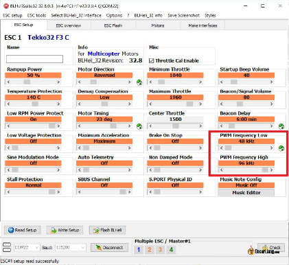
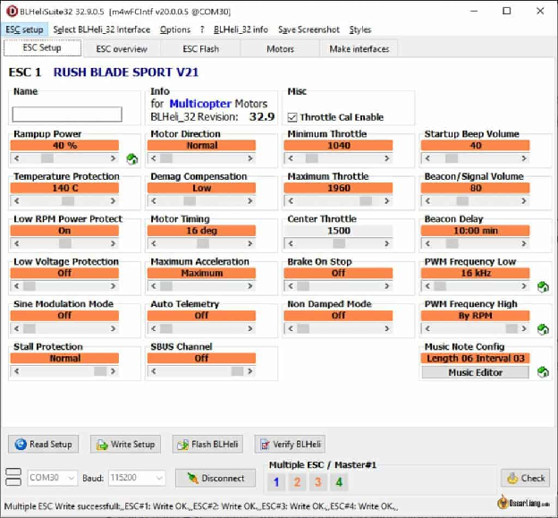
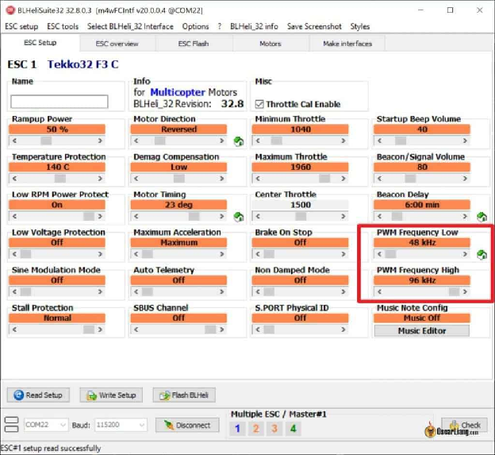

Оригінал: [https://oscarliang.com/best-blheli-32-settings/](https://oscarliang.com/best-blheli-32-settings/)        
Стисле посилання на цей переклад: [https://bit.ly/LiangBLHeli32Settings](https://bit.ly/LiangBLHeli32Settings)  

| 🫂 | Нижче вичитаний людьми машнний український переклад оригіналу. Для [VictoryDrones](https://www.victory-drones.com/) переклад вичитав: Block(chain). Хочете покращити переклад чи знайшли помилку? — Лишіть коментар (Ctrl+Alt+M або «Меню» \> «Вставка» \> «Коментар»). Ми теж живі люди (як і ви) і робим помилки. Роботи їх, до речі, також роблять 😉  |
| :---: | :---- |

# Налаштування BLHeli\_32 для оптимальної роботи FPV-дрона

5 квітня 2022 р

Розкрийте справжній потенціал свого FPV-дрона за допомогою покращених налаштувань BLHeli\_32. У цьому посібнику я поділюся своїми перевіреними конфігураціями BLHeli та поясню обґрунтування кожного налаштування, щоб допомогти вам зрозуміти: як кожне із них впливає на ефективність польоту вашого  FPV-дрона.

*Деякі посилання на цій сторінці є партнерськими. Я отримую комісію (без додаткових витрат для вас), якщо ви робите покупку після натискання одного із цих партнерських посилань. Це допомагає підтримувати безкоштовний контент для спільноти на цьому веб\-сайті. Будь ласка, прочитайте нашу [Політику партнерських посилань](https://oscarliang.com/affiliate-program-policy/) для отримання додаткової інформації.*

Зміст

[Налаштування BLHeli\_32](#налаштування-blheli_32)

[Налаштування BLHeli\_S](#налаштування-blheli_s)

[Частота ШІМ](#частота-шім)

[Як висока частота ШІМ зменшує вібрацію](#як-висока-частота-шім-зменшує-вібрацію)

[Негативні сторони вищої частоти ШІМ](#негативні-сторони-вищої-частоти-шім)

[Змінна частота ШІМ залежно від значення тяги](#змінна-частота-шім-залежно-від-значення-тяги)

[Змінна частота ШІМ за допомогою механічної/електричної частоти мотора](#змінна-частота-шім-за-допомогою-механічної/електричної-частоти-мотора)

[Таймінг двигунів](#таймінг-двигунів)

[«Демаг Компенсація»](#«демаг-компенсація»)

[Наростання потужності](#наростання-потужності)

[Струмовий захист](#струмовий-захист)

[«Мертвий час»](#«мертвий-час»)

[Як щодо решти налаштувань?](#як-щодо-решти-налаштувань?)

[Історія редагування](#історія-редагування)

## **Налаштування BLHeli\_32** {#налаштування-blheli_32}

Я пропоную такі налаштування BLHeli\_32 для найвищої продуктивності:

* **Частота ШІМ ([широтно-імпульсна модуляція](https://uk.wikipedia.org/wiki/%D0%A8%D0%B8%D1%80%D0%BE%D1%82%D0%BD%D0%BE-%D1%96%D0%BC%D0%BF%D1%83%D0%BB%D1%8C%D1%81%D0%BD%D0%B0_%D0%BC%D0%BE%D0%B4%D1%83%D0%BB%D1%8F%D1%86%D1%96%D1%8F)):**  
  * Встановіть LOW і HIGH на 48 кГц (пізніше ви можете заповнити частину втрати крутного моменту, увімкнувши лінеаризацію тяги в [Betaflight](https://betaflight.com/docs/wiki/getting-started/introduction)).  
  * Крім того, встановіть LOW на 16 кГц (або найнижчу доступну) і HIGH на «by\_RPM», щоб дозволити [ESC](https://oscarliang.com/esc/) *\[електронному контроллеру швидкості\]* динамічно адаптуватися під час польоту для оптимальної роботи; спробуйте обидва варіанти, щоб побачити, який з них працює краще.  
  * Для перегонів на дронах виберіть 24 кГц як на НИЗЬКОМУ, так і НА ВИСОКОМУ режимах; якщо виникає вібрація, перемкніть на 48 кГц на обох.  
  * Для 2-дюймових або менших дронів, як-от «Малі Вупи» ([Tiny Whoops](https://www.tinywhoop.com/)), вибирайте найвищі можливі значення для НИЗЬКОГО та ВИСОКОГО (наприклад, 48 кГц, 96 кГц або навіть 128 кГц).  
* **Таймінг двигуна**: виберіть «16 градусів» для кращого часу відгуку або «Авто» для кращої ефективності.  
* **Підвищення потужності**: встановіть значення 40%.  
* **Протокол ESC**: використовуйте «DShot600» для частоти [циклу PID](https://oscarliang.com/pid/) 8 кГц, «DShot300» для 4K і «DShot125» для 2K.  
* У разі десинхронізації ESC встановіть «Demag» на «High», збільште час двигуна та зменшіть потужність наростання.

Майте на увазі, що ці налаштування стосуються саме електроних контроллерів швидкості [BLHeli\_32](https://oscarliang.com/blheli-32-overview/). Якщо ви шукаєте нові ESC, [перегляньте мої рекомендації](https://oscarliang.com/esc/#ESC-Recommendations).

### **Налаштування BLHeli\_S** {#налаштування-blheli_s}

В оригінальній мікропрограмі [BLHeli\_S](https://github.com/betaflight/BLHeli_S) відсутня підтримка вищих частот ШІМ і двонаправленого DShot (який уможливює [RPM-фільтрування](https://oscarliang.com/rpm-filter/) і функцію «[Dynamic Idle](https://oscarliang.com/how-to-enable-and-configure-betaflight-dynamic-idle/)» у Betaflight). Щоб отримати максимальну віддачу від ваших ESC під управлінням BLHeli\_S, рекомендується прошити їх за допомогою безкоштовної сторонньої мікропрограми під назвою [Bluejay](https://github.com/mathiasvr/bluejay-configurator/releases), яка надає вам доступ до всіх цих чудових функцій. Ось підручник про те, як прошити Bluejay: [https://oscarliang.com/bluejay-blheli-s/](https://oscarliang.com/bluejay-blheli-s/)

При перепрошивці необхідно вибрати частоту. Я рекомендую 48 кГц, оскільки це ідеальна частота для плавності та ефективності, особливо в мікродронах. Деякі пілоти віддають перевагу частоті 24 кГц, оскільки вона надає дещо підвищений крутний момент і кращу керованість гвинтом. Однак увімкнення лінеаризації тяги в Betaflight може допомогти відновити частину втраченого крутного моменту під час використання 48 кГц, забезпечуючи ідеальний баланс.

Тепер давайте трохи глибше заглибимося в тонкощі кожного налаштування та те, як вони впливають на продуктивність вашого дрона.

## **Частота ШІМ** {#частота-шім}

Двигуни керуються ШІМ-сигналом, що надсилається від ESC. Це сигнал, по суті, є напругою, що швидко перемикається.

Параметр «ШІМ-частота» в BLHeli\_32 регулює частоту, з якою мікроконтролер (MCU) у ESC оновлює [MOSFET](https://e2e.ti.com/support/power-management-group/power-management/f/power-management-forum/563699/how-to-choose-proper-mosfet-for-drone-esc). Іншими словами, він визначає, як часто ESC керує двигуном. Важливо зауважити, що це налаштування «Частота ШІМ» абсолютно не пов’язане з протоколом ESC, часом циклу польотного контролера (FC) або налаштуванням частоти ШІМ у Betaflight.

Збільшення частоти ШІМ зазвичай призводить до більш плавної роботи двигунів, які створюють менше шуму, а також покращує ефективність (час польоту). Компромісом, однак, є зменшення потужності гальмування (тільки уповільнення, на прискорення не впливає), що може призвести до меншої чутливості польоту.

Стандартна частота ШІМ у BLHeli\_32 встановлена ​​на 24 кГц. Збільшивши його до 48 кГц, ви повинні помітити миттєве покращення плавності польоту. Це регулювання часто усуває вібрації при середній тязі *\[кац.-мокш.: «газ»\]*, а деякі пілоти навіть повідомляють про холодніші двигуни та довший час польоту завдяки підвищеній ефективності.

Станом на січень 2022 року найдосконаліші ESC, оснащені процесорами F4, можуть працювати на частотах ШІМ до 128 кГц.

### **Як висока частота ШІМ зменшує вібрацію** {#як-висока-частота-шім-зменшує-вібрацію}

На нижчих частотах ШІМ можуть виникати зміщення або конфлікти між швидкістю комутації та швидкістю оновлення ШІМ.

*Швидкість комутації являє собою час, необхідний для виявлення перетину нуля та перемикання через один цикл зворотного зв’язку. Є шість комутацій на одну електричну частоту обертання (eRPM), яка прямо корелює з частотою обертання двигуна.*

Ці конфлікти можуть призвести до незвичних вібрацій або шорсткості *\[roughness\]* в певних положеннях джойстика «тяга». Збільшуючи частоту ШІМ для [польових транзисторів](https://uk.wikipedia.org/wiki/%D0%9F%D0%BE%D0%BB%D1%8C%D0%BE%D0%B2%D0%B8%D0%B9_%D1%82%D1%80%D0%B0%D0%BD%D0%B7%D0%B8%D1%81%D1%82%D0%BE%D1%80) (FET), гармоніки, де виникають ці конфлікти, можна змістити за межі діапазону швидкості комутації. Це призводить до зменшення вібрації та більш плавної роботи двигуна на різних рівнях прискорнення («тяги»), покращуючи загальні враження від польоту.

### **Негативні сторони вищої частоти ШІМ** {#негативні-сторони-вищої-частоти-шім}

Після опису всіх переваг вищої частоти ШІМ ви можете задатися питанням, чому частота ШІМ за замовчуванням встановлена ​​на 24 кГц замість 48 кГц. Ну, нічого не буває без компромісу\!

Висока частота ШІМ забезпечує більш плавний політ, за рахунок потужності гальмування та керованості дрона. Цей компроміс також трохи зменшує пікове споживання струму, що може бути і позитивним аспектом, оскільки може збільшити довговічність ESC.

На вищих частотах ШІМ крутний момент на низьких обертах може бути незначно зменшений, що потенційно може призвести до м’якшого та менш чуйного відчуття контролю в пілота на низьких обертах двигуна дрона. Також може бути дещо послаблено завихрення від пропелерів при різких стрибках потужності, а занадто висока частота ШІМ може зробити дрона більш схильним до коливань.

Завзяті гонщики, які прагнуть максимальної потужності та чутливості, можуть віддати перевагу нижчим частотам ШІМ, таким як 24 кГц. Однак 48 кГц забезпечує хороший баланс між плавністю та чуйністю — це може підійти більшості звичайних людей. Для кращого поєднання  обох світів — спробуйте змінну частоту ШІМ, як пояснюється у наступних кількох розділах.

### **Змінна частота ШІМ залежно від значення тяги** {#змінна-частота-шім-залежно-від-значення-тяги}

Концепція змінної частоти ШІМ пропонує оптимальне рішення для різних режимів тяги дрона *\[trottle\].* Представлена ​​в BLHeli\_32 версії [32.8.0](https://intofpv.com/t-blheli-32-32-8-released), ця функція дозволяє встановлювати як мінімальну, так і максимальну частоту ШІМ. При прискоренні, ESC лінійно підвищує частоту ШІМ.

Цей підхід поєднує найкраще з обох світів. При низьких обертах двигуна ви отримуєте вищий крутний момент і кращу стабільність. Коли оберти двигуна зростають, ви отримуєте переваги від покращеної плавності та ефективності. Діапазон дозволених частот ШІМ залежить від вашого конкретного ESC. Наприклад, Tekko32 F3 *\[станом на літо 2023 доступна новіша модель [Tekko32 F4](https://holybro.com/products/tekko32-f4-45a-esc)\]* допускає мінімум і максимум 48 кГц і 96 кГц відповідно, тоді як деякі нові F4 ESC підтримують діапазон від 24 кГц до 128 кГц.

Після увімкнення цієї функції вам може знадобитися повторно налаштувати параметри [PID](https://uk.wikipedia.org/wiki/%D0%9F%D1%80%D0%BE%D0%BF%D0%BE%D1%80%D1%86%D1%96%D0%B9%D0%BD%D0%BE-%D1%96%D0%BD%D1%82%D0%B5%D0%B3%D1%80%D0%B0%D0%BB%D1%8C%D0%BD%D0%BE-%D0%B4%D0%B8%D1%84%D0%B5%D1%80%D0%B5%D0%BD%D1%86%D1%96%D0%B0%D0%BB%D1%8C%D0%BD%D0%B8%D0%B9_%D0%B7%D0%B0%D0%BA%D0%BE%D0%BD_%D1%80%D0%B5%D0%B3%D1%83%D0%BB%D1%8E%D0%B2%D0%B0%D0%BD%D0%BD%D1%8F) у програмному забезпеченні контролера польоту. Якщо ви встановите однакову частоту для низьких і високих значень, ви фактично вимкнете змінну частоту ШІМ, і вона повернеться до фіксованої частоти ШІМ.

### **Змінна частота ШІМ за допомогою механічної/електричної частоти мотора** {#змінна-частота-шім-за-допомогою-механічної/електричної-частоти-мотора}

Хоча «змінна частота ШІМ залежно від тяги» *\[variable PWM frequency by throttle position\]* має переваги, вона не позбавлена ​​проблем. По-перше, комбінація частоти ШІМ і частоти мотора може створювати гармоніки, що призводять до коливань на серединіх значеннях прискорювача та ефекту розмиття камери. По-друге, на високій тязі підвищена частота ШІМ значно знижує чуйність дрона, що може бути погано для певних налаштувань.

Змінна частота ШІМ за допомогою обертів на хвилину вирішує ці проблеми. Відстежуючи оберти двигуна, ESC уникає проблемних гармонік, одночасно використовуючи найнижчу можливу частоту обертів на високій тязі, щоб забезпечити оптимальну чутливість.

Представлений у BLHeli\_32 версії 32.8.3, функціонал «змінна частота ШІМ за допомогою обертів на хвилину» *\[variable PWM frequency by RPM\]* значно покращує ефективність ESC, плавність роботи двигуна, крутний момент і гальмівну потужність вашого дрона. Важливо зауважити, що функціонал «за допомогою обертів» не обов’язково є кращим за функціонал «залежно від значення прискорювача», оскільки перевага плавності та ефективності над чуйністю на високих значеннях прискорювача залежить від пілота. Якщо ви відчуваєте незрозумілі коливання на середньому прискоренні, спробуйте «за обертами».

Щоб увімкнути цю функцію, прошийте ESC свого дрона мікропрограмою 32.8.3 (або новішою). Потім встановіть для параметра «Низька частота ШІМ» значення «16 кГц» або «24 кГц», а для параметра «Висока частота ШІМ» — «За частотою обертання». Докладніше про те, як працює ця функція, можна знайти в [ось в оцій GitHub-обліковці](https://github.com/bitdump/BLHeli/issues/546).

## **Таймінг двигунів** {#таймінг-двигунів}

За замовчуванням у BLHeli\_32 встановлено значення «16 градусів», що добре працює для більшості збірок. Синхронізація двигуна, по суті, контролює момент, коли ESC надсилає електричний імпульс на котушки двигуна аби він працював.

Загалом більша синхронізація двигуна зменшує ймовірність проблем із «розсинхронізацією», але ускладнює прискорення та гальмування, що призводить до меншої чутливості дрона. Встановлення нижчого значення, наппиклад — на 8 градусів, дає аналогічні ефекти. Значення 16 градусів, схоже, є ідеально-збалансованим.

Для більшості збірок рекомендується підтримувати синхронізацію двигуна на рівні «16 градусів». Однак, якщо ви віддаєте пріоритет ефективності та часу польоту, налаштування «Авто» є найкращим варіантом, оскільки воно дозволяє ESC динамічно регулювати синхронізацію двигуна відповідно до вимог двигуна.

**Протокол ESC**  
[DShot](https://oscarliang.com/dshot/) є новішим, вдосконаленим протоколом ESC, і я рекомендую його замість Oneshot і [Multishot](https://oscarliang.com/raceflight-multishot/) з кількох причин. Хоча це правда, що DShot більш інтенсивно навантажує процесор, що може змусити деяких вибрати Multishot, щоб виділити більше обчислювальної потужності для запуску «максимальної» вибірки 32K/32K Gyro та часу циклу (у 2018 році, коли 32KHz тоді був на піку ажіотажу). DShot пропонує кілька переваг:

1. Немає необхідності в калібруванні ESC.  
2. Підтримка режиму маяка ESC, двигуни виконують функцію звукових сигналів, що може бути корисним для визначення місцезнаходження вашого дрона після аварії.  
3. DShot є необхідним для використання телеметрії ESC.  
4. Розробники Betaflight рекомендовують DShot. У Betaflight 4.4 пропонується використовувати DShot300 для часу циклу 4K або DShot600 для часу циклу 8K.

## **«Демаг Компенсація»** {#«демаг-компенсація»}

«[Demag Компенсація](https://www.youtube.com/watch?v=c94e9TCCP8Y)» — це налаштування, яке може допомогти зменшити проблеми «десинхронізації», спричинені вашим ESC. Аби більше дізнатись, що таке «десинхронізація» ESC — прочитайте статтю [intofpv.com/t-what-is-esc-desync](https://intofpv.com/t-what-is-esc-desync).

Рекомендується залишити значення цього параметра за замовчуванням, якщо не виникають проблеми з розсинхронізацією. У таких випадках можна змінити налаштування на «Висока».

Потужним конструкціям, таким як гексакоптери із приводом 6S, які можуть страждати від електричних перешкод, може бути корисно встановити для параметру «Demag Компенсація» значення «Висока». Однак для більшості налаштувань має бути достатньо «Середньої».

Важливо відзначити, що встановлення «Demag Компенсації»  на «Високу» може призвести до деяких втрат продуктивності, оскільки це налаштування по суті зменшує прискорення, щоб мінімізувати поточні стрибки та шум. Завжди враховуйте свою конкретну конструкцію та її вимоги, перш ніж коригувати налаштування «Demag Компенсації».

## **Наростання потужності** {#наростання-потужності}

«Наростання потужності», параметр, що раніше був відомий як «Запуск потужності» у старіших версіях BLHeli — це налаштування, яке може допомогти зменшити стрибки струму, спричинені раптовим збільшенням тяги. Обмежуючи зміну потужності, це може бути корисним для вирішення проблем із розсинхронізацією ESC або надмірних електричних шумів у вашій збірці.

Якщо ваші двигуни наближаються до обмежень вашого ESC, стрибки струму від проривів (коли ви раптово ставите важіль «прискорення» на максимум) можуть спричинити пошкодження дрона. Зменшення темпу «Наростання потужності» може допомогти зменшити цей ризик.

Для тих, хто не впевнений щодо налаштування цього параметра, краще залишити значення за замовчуванням. Однак точне налаштування «Наростання потужності» може покращити польотні характеристики вашого коптера. Майте на увазі, що занадто низьке значення може призвести до уповільнення реакції двигуна, тоді як встановлення занадто високого значення може призвести до більш шумної роботи коптера і нагрівання двигунів.

Трохи вище значення «Наростання потужності» може принести користь вашому дрону, оскільки він сильніше натискає на двигун, намагаючись набрати обертів (швидше прискорення), забезпечуючи більш чуйне та потужне керування. Зауважте, що це не впливає на ефективність гальмування (уповільнення). Майте на увазі, що вища потужність розгону може призвести до того, що ваші двигуни працюють сильніше, тому стежте за температурою двигуна, збільшуючи її.

Якщо ви відчуваєте надмірну вібрацію без жодних видимих рішень, розгляньте можливість поступового зменшення потужності розгону, доки не помітите різницю в продуктивності, а потім трохи відступіть на важелі «прискорення». У більшості збірок зниження його до 20% (від стандартних 40%) є малопомітним.

Для польотів на довші відстані, ви можете зменшити «Наростання потужності» для кращої ефективності, якщо час реакції двигунів не є вашим найвищим пріоритетом.

## **Струмовий захист** {#струмовий-захист}

«Струмовий захист» — це налаштування, яке обмежує силу струму, що проходить через ESC. Його призначення подібне до «Наростання потужності» , але «Струмовий захист» спеціально зосереджується на обмеженнях струму.

Якщо ви не впевнені — найкраще залишити поточний захист вимкненим (воно так і є за замовчуванням). У певних ситуаціях «Струмовий захист» можна використовувати для захисту вашого ESC від «згорання» через стрибки струму, збої та розсинхронізації. Однак, якщо поточний рейтинг вашого ESC відповідає вимогам вашого дрона, вам не потрібно турбуватися про ввімкнення цього параметра.

## **«Мертвий час»** {#«мертвий-час»}

У BLHeli «мертвий час» відноситься до інтервалу між кожним імпульсом ШІМ, протягом якого ESC вимикає живлення котушки двигуна. Цей мертвий час гарантує відсутність перекриття під час надходження струму до котушки, що дозволяє їй повністю розряджатися до наступного імпульсу.

Якщо встановлено занадто короткий час затримки, ваш двигун може перегрітися. Однак, якщо його встановити занадто довго, гальмівний момент (особливо на вищих рівнях прискорення) може зменшитися, що призведе до меншої чутливості дрона. Дуже важливо знайти правильний баланс, щоб оптимізувати продуктивність вашого дрона, зберігаючи безпечну температуру двигуна.

## **Як щодо решти налаштувань?** {#як-щодо-решти-налаштувань?}

Для дронів FPV ви можете залишити решту налаштувань за замовчуванням. Багато з цих налаштувань призначено для літальних апаратів і літаків, тому вони не матимуть суттєвого впливу на продуктивність вашого дрона FPV. Зосередьтеся на налаштуваннях, які ми обговорювали в цій статті, щоб оптимізувати продуктивність і ефективність польоту вашого дрона.

#### **Історія редагування** {#історія-редагування}

* Червень 2018 — Статтю створено.  
* Листопад 2018 — додано Demag компенсацію.  
* Лютий 2019 — оновлено параметри «Наростання потужності» і «Струмовий захист».  
* Січень 2020 — Переглянуто.  
* Травень 2021 — додано інформацію про нову функцію, змінну частоту ШІМ залежно від значення прискорювача.  
* Квітень 2022 — додано інформацію про змінну частоту ШІМ за обертами та оновлено найкращі налаштування завдяки тестуванню Кріса Россера.  
* Березень — статтю переглянуто.

[image1]: 

[image2]: 

[image3]: 

[image4]: 