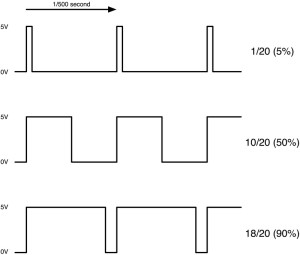

Стисле посилання на цей переклад: [https://bit.ly/best-am32-settings](http://bit.ly/best-am32-settings) 

|  | Нижче вичитаний людьми машинний український переклад оригіналу. Для [VictoryDrones](https://www.victory-drones.com/) переклад вичитали: Faina, Max Well. Хочете покращити переклад чи знайшли помилку? — Лишіть коментар (Ctrl+Alt+M або «Меню» \> «Вставка» \> «Коментар»). Ми теж живі люди (як і ви) і робим помилки. Роботи їх, до речі, також роблять 😉 |
| :---- | :---- |

# Найкращі налаштування регуляторів обертів AM32 для оптимальної продуктивності FPV дрону {#найкращі-налаштування-регуляторів-обертів-am32-для-оптимальної-продуктивності-fpv-дрону}

2nd August 2024

Літати на FPV дронах — це захопливо, але налаштування їх максимальної продуктивності може підняти цей досвід на абсолютно новий рівень. У цій статті я поділюся найкращими налаштуваннями регулятора обертів AM32 і поясню, що робить кожне налаштування, щоб допомогти вам зрозуміти їхній вплив на льотні характеристики FPV дрона.

*Деякі посилання на цій сторінці є партнерськими. Я \[автор англомовної версії Оскар Ланг\] отримую комісію (без додаткових витрат для вас), якщо ви робите покупку після натискання одного із цих партнерських посилань. Це допомагає підтримувати безкоштовний контент для спільноти на цьому веб\-сайті. Будь ласка, прочитайте нашу [Політику партнерських посилань](https://oscarliang.com/affiliate-program-policy/) для отримання додаткової інформації.*

## ЗМІСТ {#зміст}

[**Найкращі налаштування регуляторів обертів AM32 для оптимальної продуктивності FPV дрону	1**](#найкращі-налаштування-регуляторів-обертів-am32-для-оптимальної-продуктивності-fpv-дрону)

[ЗМІСТ	1](#зміст)

[Мої налаштування AM32	4](#мої-налаштування-am32)

[Основи](#основи-[essentials])  
[\[Essentials\]	4](#основи-[essentials])

[Протокол](#протокол-[protocol])  
[\[Protocol\]	4](#протокол-[protocol])

[Зворотне обертання](#зворотне-обертання-[reverse-rotation])  
[\[Reverse Rotation\]	4](#зворотне-обертання-[reverse-rotation])

[3D режим](#3d-режим-[3d-mode])  
[\[3D Mode\]	4](#3d-режим-[3d-mode])

[Налаштування мотора](#налаштування-мотора-[motor-settings])  
[\[Motor Settings\]	5](#налаштування-мотора-[motor-settings])

[Захист від фізичної зупинки ротора](#захист-від-фізичної-зупинки-ротора-[stuck-rotor-protection])  
[\[Stuck Rotor Protection\]	5](#захист-від-фізичної-зупинки-ротора-[stuck-rotor-protection])

[Захист від зупинки через надмірне навантаження мотора](#захист-від-зупинки-через-надмірне-навантаження-мотора-[stall-protection])  
[\[Stall Protection\]	5](#захист-від-зупинки-через-надмірне-навантаження-мотора-[stall-protection])

[Датчик Холла](#датчик-холла-[use-hall-sensor])  
[\[Use Hall Sensor\]	5](#датчик-холла-[use-hall-sensor])

[Змінний ШІМ](#змінний-шім-[variable-pwm])  
[\[Variable PWM\]	5](#змінний-шім-[variable-pwm])

[Додатковий ШІМ](#додатковий-шім-[complementary-pwm])  
[\[Complementary PWM\]	5](#додатковий-шім-[complementary-pwm])

[Кут випередження комутації](#кут-випередження-комутації-[timing-advance])   
[\[Timing Advance\]	5](#кут-випередження-комутації-[timing-advance])

[Стартова потужність](#стартова-потужність-[startup-power])  
[\[Startup Power\]	6](#стартова-потужність-[startup-power])

[KV мотора](#kv-мотора-[motor-kv])  
[\[Motor KV\]	6](#kv-мотора-[motor-kv])

[Полюси мотора](#полюси-мотора-[motor-poles])  
[\[Motor Poles\]	6](#полюси-мотора-[motor-poles])

[Гучність пристрою для звукового сигналу](#гучність-пристрою-для-звукового-сигналу-[beeper-volume])  
[\[Beeper Volume\]	6](#гучність-пристрою-для-звукового-сигналу-[beeper-volume])

[Частота ШІМ](#частота-шім-[pwm-frequency])  
[\[PWM Frequency\]	7](#частота-шім-[pwm-frequency])

[Обмеження](#обмеження-[limits])  
[\[Limits\]	7](#обмеження-[limits])

[Порогове відключення при низькій напрузі](#порогове-відключення-при-низькій-напрузі-[low-voltage-cutoff])  
[\[Low Voltage Cutoff\]	7](#порогове-відключення-при-низькій-напрузі-[low-voltage-cutoff])

[Температурні та струмові обмеження](#температурні-та-струмові-обмеження-[temperature-and-current-limits])  
[\[Temperature and Current Limits\]	8](#температурні-та-струмові-обмеження-[temperature-and-current-limits])

[Синусоїдальний запуск](#синусоїдальний-запуск-[sinusoidal-startup])  
[\[Sinusoidal Startup\]	8](#синусоїдальний-запуск-[sinusoidal-startup])

[Гальмування](#гальмування-[brake])  
[\[Brake\]	8](#гальмування-[brake])

[Гальмування при зупинці](#гальмування-при-зупинці-[brake-on-stop])  
[\[Brake on Stop\]	8](#гальмування-при-зупинці-[brake-on-stop])

[Рівень гальмування під час руху](#рівень-гальмування-під-час-руху-[running-brake-level])  
[\[Running Brake Level\]	8](#рівень-гальмування-під-час-руху-[running-brake-level])

[Налаштування сервоприводів](#налаштування-сервоприводів-[servo-settings])  
[\[Servo Settings\]	8](#налаштування-сервоприводів-[servo-settings])

[Висновок	9](#висновок)

## 

## Мої налаштування AM32  {#мої-налаштування-am32}

| Protocol: Auto Enable: \-Stuck rotor protection \-Variable PWM \-Complementary PWM Timing Advanced: 	15° Motor KV: Match your actual motor Motor Poles: Match your actual motor PWM Frequency: 24kHz – 48kHz | Протокол: Auto Увімкнути:\-Захист від заклинювання ротора\-Змінний ШІМ\-Додатковий ШІМ Кут випередження комутації: 15°  KV мотора: Відповідає вашому реальному мотору  Полюси мотора: Відповідає вашому реальному мотору Частота ШІМ: 24kHz – 48kHz |
| :---- | :---- |

## Основи \[Essentials\] {#основи-[essentials]}

### Протокол \[Protocol\]  {#протокол-[protocol]}

Ви можете вибрати протокол регулятора обертів, який плануєте використовувати. Зазвичай, встановлення цього параметра на “Auto” дозволяє регулятору обертів AM32 автоматично виявляти та використовувати протокол, який ваш польотний контролер надсилає до регулятора обертів. Це більш зручно, але ви можете i вручну вибрати конкретні протоколи, такі як DShot або PWM, якщо бажаєте.

### Зворотне обертання \[Reverse Rotation\] {#зворотне-обертання-[reverse-rotation]}

Цей параметр змінює напрямок обертання мотора. Ви можете досягти того ж результату, помінявши місцями два з трьох проводів мотора або через налаштування Betaflight. 

### 3D режим \[3D Mode\] {#3d-режим-[3d-mode]}

Використовується для 3D польотів, цей режим дозволяє моторам перемикатися між нормальним і зворотним обертанням під час польоту, що дозволяє дрону літати догори ногами, як RC-гелікоптер. Діапазон тяги розділений між нормальним і зворотним, при цьому центральне положення стіка є нейтральним. Для додаткової інформації:  
[https://oscarliang.com/3d-inverted-flying-quadcopter/](https://oscarliang.com/3d-inverted-flying-quadcopter/)

## Налаштування мотора \[Motor Settings\] {#налаштування-мотора-[motor-settings]}

### Захист від фізичної зупинки ротора \[Stuck Rotor Protection\]  {#захист-від-фізичної-зупинки-ротора-[stuck-rotor-protection]}

Ця функція призначена для FPV дронів (мультикоптерів). Вона виявляє, коли мотор застряг, наприклад, коли він зачепився за гілку, і припиняє роботу мотора, щоб запобігти пошкодженням. Переконайтеся, що ця функція увімкнена для захисту ваших моторів. 

### Захист від зупинки через надмірне навантаження мотора \[Stall Protection\] {#захист-від-зупинки-через-надмірне-навантаження-мотора-[stall-protection]}

Захист від зупинки через надмірне навантаження мотора переважно призначений для машинок-”крoлерів” з дистанційним керуванням. Найкраще залишити цю функцію вимкненою для дронів, оскільки вона збільшує тягу, якщо мотор сповільнюється, що може призвести до перегріву мотора.

### Датчик Холла \[Use Hall Sensor\]  {#датчик-холла-[use-hall-sensor]}

Вимкніть це для квадрокоптерів. Наразі це не використовується через відсутність регуляторів, здатних працювати з датчиками Холла. 

### Змінний ШІМ \[Variable PWM\]  {#змінний-шім-[variable-pwm]}

Це налаштування регулює частоту ШІМ на основі обертів мотора, щоб уникнути взаємних перешкод між частотою ШІМ та частотою комутації. Рекомендується ввімкнути це для плавної реакції тяги.

### Додатковий ШІМ \[Complementary PWM\] {#додатковий-шім-[complementary-pwm]}

Додатковий ШІМ діє як гальмо, щоб швидше зменшити оберти мотора, коли на регулятор приходить команда знизити швидкість обертання мотора. Це важливо для чутливості FPV дронів, оскільки допомагає швидше змінювати оберти мотора. Увімкніть це для кращої продуктивності польоту.

### Кут випередження комутації  \[Timing Advance\] {#кут-випередження-комутації-[timing-advance]}

Кут випередження комутації (також відоме як таймінг мотора) визначає, коли регулятор обертів активує котушку відносно положення магніту мотора.

* Таймінг 0°: Котушка активується, коли магніт знаходиться безпосередньо навпроти котушки. Це забезпечує кращу продуктивність, але існує ризик десинхронізації.  
* Ранній таймінг (випередження комутації): Котушка активується трохи раніше, ніж магніт знаходиться безпосередньо навпроти котушки, що допомагає створити магнітне поле в котушці.

Налаштування на 15 градусів зазвичай забезпечує найкращий баланс між потужністю, чутливістю, надійністю та ефективністю для широкого спектра дронів.

### Стартова потужність \[Startup Power\] {#стартова-потужність-[startup-power]}

Стартова потужність впливає лише на перші кілька комутацій, коли мотор починає рух із зупинки, і не впливає на продуктивність, коли мотор вже обертається. Рекомендується встановити це значення на 100%.

### KV мотора \[Motor KV\] {#kv-мотора-[motor-kv]}

Встановіть значення KV мотора відповідно до KV ваших моторів.  
Тяга обмежується на основі введеного значення KV. Встановлення цього значення занадто високим обмежує ширину імпульсу максимальної тяги, що застосовується до мотора, тому ваш мотор матиме меншу потужність. Якщо ви встановите його занадто низьким, це не обов'язково вплине на продуктивність мотора, але може призвести до надмірного споживання струму та перегріву мотора *\[прим. пер.: через вплив на силу поштовху на низькій тязі\]*. Якщо ви не впевнені у точному значенні KV мотора, оберіть трохи нижче значення, щоб забезпечити оптимальну продуктивність.

### Полюси мотора \[Motor Poles\] {#полюси-мотора-[motor-poles]}

Встановіть правильну кількість полюсів мотора (зазвичай 14 полюсів для моторів розміром 5-7 дюймів і 12 полюсів для мікро квадрокоптерів), щоб забезпечити точні показники обертів/хв і оптимальну продуктивність. Якщо ви не впевнені, порахуйте магніти на роторі мотора — кожен магніт є одним полюсом.

### Гучність пристрою для звукового сигналу \[Beeper Volume\]  {#гучність-пристрою-для-звукового-сигналу-[beeper-volume]}

Це налаштовує гучність звукового сигналу мотора *\[пікалки\]* за допомогою  [DShot Beacon](https://oscarliang.com/dshot-beacon/).

### Частота ШІМ \[PWM Frequency\]  {#частота-шім-[pwm-frequency]}

  
Частота ШІМ стосується того як швидко ключі \- польові транзистори *\[прим. пер.: “польовий транзистор” (Field-Effect Transistor) є типом транзистора, який використовується в електронних схемах для комутації силової частини.\]* в регуляторі обертів вмикаються і вимикаються для керування мотором.  
Частоту ШІМ можна налаштувати від 8kHz-16kHz до 48kHz-96kHz, при цьому значення за замовчуванням становить 24kHz-48kHz.  
Вищі частоти ШІМ можуть відчуватися плавнішими та покращувати ефективність у деяких випадках, але можуть зменшити гальмування мотора, що призведе до меншої чутливості та гіршої реакції на турбулентність.  
Налаштування 24kHz-48kHz пропонує найкращий баланс продуктивності. Уникайте налаштувань на рівні 8kHz-16kHz, щоб запобігти надмірному споживанню струму та можливим пошкодженням.

## Обмеження \[Limits\] {#обмеження-[limits]}

### Порогове відключення при низькій напрузі \[Low Voltage Cutoff\] {#порогове-відключення-при-низькій-напрузі-[low-voltage-cutoff]}

Ця функція зазвичай не рекомендується для мультикоптерів, оскільки вона може призвести до падіння моделі з неба, якщо регулятор обертів вимкнеться через низьку напругу. Краще, щоб пілот стежив за напругою через шолом і вручну приземляв дрон до досягнення критично низького рівня. 

### Температурні та струмові обмеження \[Temperature and Current Limits\] {#температурні-та-струмові-обмеження-[temperature-and-current-limits]}

Хоча ці функції можуть забезпечити додатковий захист для регулятора обертів, я особисто вимикаю їх на своїх FPV дронах, щоб уникнути раптової втрати потужності під час польоту. Те, що працює для мене, не обов'язково підходить вам, тому ви повинні вирішити, чи варто вмикати ці захисти, виходячи з ваших обставин. Для літачків, встановлення температурного ліміту (наприклад, 140°C) може допомогти запобігти пошкодженням через перегрів, оскільки ви все ще можете планувати та безпечно приземлитися. Для квадрокоптерів раптова втрата потужності може бути проблематичною, особливо під час польоту над водою або складною місцевістю. 

## Синусоїдальний запуск \[Sinusoidal Startup\]  {#синусоїдальний-запуск-[sinusoidal-startup]}

Це налаштування дозволяє мотору запускатися на дуже низьких обертах за допомогою комутації з розімкненим контуром. Це корисно для “крoлерів”, але непотрібне для дронів, тому його можна вимкнути.

## Гальмування \[Brake\] {#гальмування-[brake]}

### Гальмування при зупинці \[Brake on Stop\] {#гальмування-при-зупинці-[brake-on-stop]}

Це налаштування застосовує гальмівну силу, коли мотор зупиняється, що корисно для “кролерів”, якщо ви хочете, щоб автомобіль повз вниз по схилу, або для крил зі складеними пропелерами. Для мультикоптерів це не є корисним і повинно бути вимкнено.

### Рівень гальмування під час руху \[Running Brake Level\]  {#рівень-гальмування-під-час-руху-[running-brake-level]}

Сила, що використовується для гальмування мотора, коли він ще обертається. Корисно зменшити це, якщо використовуються великі пропелери і ви не хочете перевантажувати мотор. Також корисно для “кролерів”, щоб уникнути перекидy через передні колеса*.* Залиште це за замовчуванням для FPV дронів.

## Налаштування сервоприводів \[Servo Settings\] {#налаштування-сервоприводів-[servo-settings]}

Ці налаштування актуальні лише для тих, хто подає на регулятор обертів аналогові сигнали, такі як PWM, Oneshot і Multishot. Вони неактуальні при використанні DShot.

## Висновок {#висновок}

Налаштування вашого регулятора обертів AM32 з оптимальними параметрами може значно покращити продуктивність FPV дрона. Зрозумівши та відрегулювавши ці параметри, ви забезпечите, що ваш дрон буде не тільки чутливим та потужним, але й захищеним від можливих ушкоджень. Вдалих польотів\!  

[image1]: 

[image2]: 