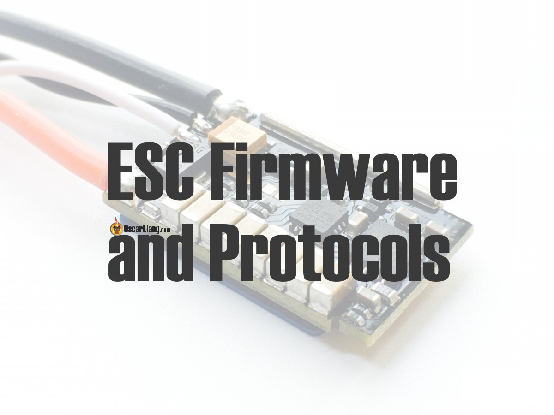
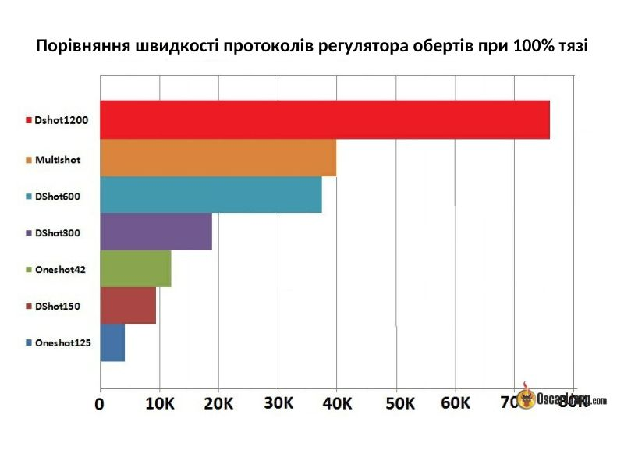

Стисле посилання на цей переклад: [https://bit.ly/LiangESCFirmwareProtocols](https://bit.ly/LiangESCFirmwareProtocols)   

|  | Нижче вичитаний людиною український переклад оригіналу. Для [VictoryDrones](https://www.victory-drones.com/) переклад виконали: Switch, вичитали: Faina. Хочете покращити переклад чи знайшли помилку? — Лишіть коментар (Ctrl+Alt+M або «Меню» \> «Вставка» \> «Коментар»). Ми теж живі люди (як і ви) і робимо помилки. 😉 |
| :---: | :---- |

# **Прошивка та протоколи регулятора обертів**

Існує кілька типів протоколу та прошивки регулятора обертів, що використовуються для квадрокоптера. У цій статті ми трохи розповімо про їхню історію та пояснимо технічні відмінності. Найголовнішим моїм завданням є спроба прояснити ту плутанину, з якою стикаються початківці через широкий вибір.

*Деякі посилання на цій сторінці є партнерськими. Я \[автор англомовної версії Оскар Ланг\] отримую комісію (без додаткових витрат для вас), якщо ви робите покупку після натискання одного із цих партнерських посилань. Це допомагає підтримувати безкоштовний контент для спільноти на цьому веб\-сайті. Будь ласка, прочитайте нашу [Політику партнерських посилань](https://oscarliang.com/affiliate-program-policy/) для отримання додаткової інформації.*

Коли я лиш починав займатися своїм хобі, підключення регулятора обертів до контролера польоту було досить простим. Але тепер потрібно враховувати набагато більше факторів, таких як налаштування регулятора обертів, протоколи, прошивку тощо. Усе це може заплутати та спантеличити початківців.

Перегляньте цю інструкцію про [те, як  вибрати регулятор обертів для безпілотників FPV](https://oscarliang.com/esc/)

# Прошивка регулятора обертів

Прошивка регулятора обертів – це його програмне забезпечення. Воно визначає, які налаштування регулятора обертів можна змінити, які протоколи підтримуються та який інтерфейс можна використовувати. Вбудоване програмне забезпечення регулятора обертів залежить від апаратного забезпечення.

Ось список різних прошивок регулятора обертів, доступних для мініквадрокоптерів:

* BLHeli  
* [BLHeli\_S](https://oscarliang.com/blheli-s-hardware-pwm-32bit/)  
* [BLHeli\_32](https://oscarliang.com/connect-flash-blheli-32-esc/)  
* [AM32](https://oscarliang.com/am32-esc-firmware-an-open-source-alternative-to-blheli32/)  
* Bluejay  
* SimonK  
* KISS  
* *Власна прошивка інших виробників*

Двома найпершими варіантами прошивки регулятора обертів з відкритим вихідним кодом були SimonK та BLHeli, які використовувалися у більшості регуляторів приблизно до 2015 року. З тих пір BLHeli захопила ринок завдяки більш зручному інтерфейсу та послідовному вдосконаленню.

*Різниця між [BLHeli i SimonK](http://intofpv.com/t-simonk-vs-blheli-esc-firmware).*

Оскільки технологія регуляторів обертів продовжує розвиватися, нові прошивки BLHeli пишуться спеціально під вдосконалення в апаратному забезпеченні.

У 2016 році було випущено оновлення прошивки BLHeli під назвою BLHeli\_S, що призначалося для процесорів BusyBee (чіпи BB1 та BB2).

У 2017 році було створено прошивку BLHeli 3-го покоління під назвою BLHeli\_32, яка мала уповні використати обчислювальну потужність 32-бітових процесорів, які з'являються на новіших версіях регуляторів обертів.

Наразі всі регулятори обертів постачаються із вже встановленою прошивкою. Найчастіше це BLHeli\_S або BLHeli\_32 залежно від апаратного забезпечення. У будь-якому випадку це має бути чітко зазначено в описі продукту.

Особисто я рекомендую регулятори обертів із прошивкою BLHeli\_S та BLHeli\_32. Вони найбільш продуктивні, мають найсучасніші функції та регулярно оновлюються.

У випадку BLHeli\_S ви можете [перепрошити Bluejay](https://bit.ly/LiangFlashBluejay-BLHeli_S), щоб розблокувати певні функції, доступні лише на BLHeli\_32, такі як двонаправлений DShot та персоналізований звук запуску. Це справді дозволить підвищити продуктивність до рівня більш дорогого BLHeli\_32.

У 2020 році виходить AM32. Це прошивка з відкритим вихідним кодом *\[open source\]*, яка може бути альтернативою BLHeli\_32. Деякі останні версії регуляторів обертів постачаються вже з прошивкою AM32. Дізнайтеся більше про AM32 тут: [https://oscarliang.com/am32-регулятор обертів-firmware-an-open-source-alternative-to-blheli32/](https://oscarliang.com/am32-esc-firmware-an-open-source-alternative-to-blheli32/)

# Протоколи регуляторів обертів

Протоколи регуляторів обертів — це «мови», які польотний контроллер та регулятор обертів використовують для зв'язку, аби, наприклад, встановити, наскільки швидко повинен обертатися мотор.

Нижче наведено всі протоколи для регуляторів обертів, доступні наразі для Betaflight FPV-дронів, а також подано їхню ширину сигналу – час, необхідний для надсилання одного пакета даних (натисніть на посилання, щоб ознайомитися детальніше):

* Standard PWM (1000мкс – 2000мкс)  
* [**Oneshot125**](https://oscarliang.com/oneshot125-esc-quadcopter-fpv/) (125мкс – 250мкс)  
* [**Oneshot 42**](http://intofpv.com/t-oneshot42-explained-kiss-esc-fc-protocol) (42мкс – 84мкс)  
* [**Multishot**](https://oscarliang.com/raceflight-multishot/) (5мкс – 25мкс)  
* [**Dshot**](https://oscarliang.com/dshot/)  
  * Dshot150 (106,8мкс)  
  * Dshot300 (53,4мкс)  
  * Dshot600 (26,7мкс)  
  * [**DShot1200**](https://oscarliang.com/dshot1200-esc-protocol/) (13,4мкс)  
* [**ProShot**](https://oscarliang.com/proshot-esc-protocol/)

До 2015 року існував лише один протокол регулятора обертів, standard PWM (стандартна широтно-імпульсна модуляція), але з покращенням апаратного забезпечення стали можливими швидші протоколи: Oneshot125, Oneshot42 та Multishot. Всі ці протоколи є аналоговими сигналами, подібними до стандартної широтно-імпульсної модуляції, але набагато швидші (менша затримка). Ці протоколи синхронізуються з системою PID-регулятора в польотному контроллері, щоб зменшити тремтіння, поліпшити продуктивність та зменшити затримку між вводом команди стiком та реакцією літального апарату.

DShot — це найновіший протокол, який є цифровим сигналом. На мою думку, це майбутнє протоколів для регуляторів обертів, оскільки він надійніший та продуктивніший, а також може надсилати не лише дані швидкості мотора, а й конкретні команди. Також можна активувати двонаправлений DShot, аби регулятор обертів та польотний контроллер мали двосторонній зв'язок, при якому регулятор зможе надсилати дані про оберти мотора/хв (RPM) назад на польотний контроллер. Завдяки таким даним стала можливою фільтрація на основі даних про частоту обертань моторів за хвилину *\[RPM filtering\]* для зменшення вібрацій та шумів та інші розширені функції PID-регулятора, такі як динамічний холостий хід.

Серед DShot300/600/1200 швидший протокол кращий з точки зору затримки *\[latency\]*, але через свою швидкість більш схильний до передачі битих пакетів *\[corrupt packets\]*. Betaflight пропонує вибрати підхожу швидкість DShot на основі частоти системи контролю PID-регулятора.

* При частоті PID-регулятора 2K, використовуйте DShot150  
* При частоті PID-регулятора 4K, використовуйте DShot300  
* При частоті PID-регулятора 8K, використовуйте DShot600

Якщо поглянути реалістично, час затримки різних протоколів DShot становить мікросекунди, тому на мою думку, вплив на продуктивність несуттєвий. Якщо хтось вважає інакше, я б хотів побачити докази. Збільшення ймовірності пошкодження даних може мати більший вплив.

Сподіваюся, ця інструкція познайомила вас у загальних рисах із програмним забезпеченням та протоколами регуляторів обертів. Будь ласка, не зволікайте із запитаннями чи коментарями.

[image1]: 

[image2]: 

[image3]: 