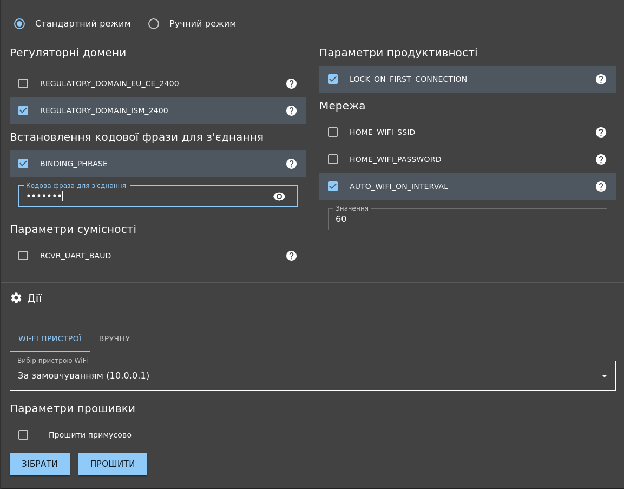
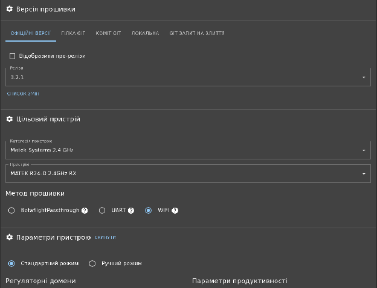
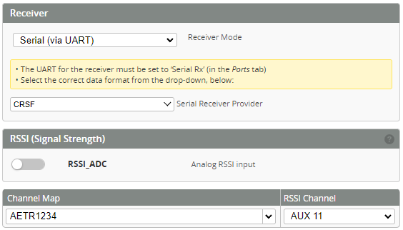

Стисле посилання на цей переклад: [https://bit.ly/ExpressLRS\_overview](https://bit.ly/ExpressLRS_overview)

| 🫂 | Нижче вичитаний людьми машнний український переклад оригіналу. Для [VictoryDrones](https://www.victory-drones.com/) переклад вичитали: Alex, Oleg. Хочете покращити переклад чи знайшли помилку? — Лишіть коментар (Ctrl+Alt+M або «Меню» \> «Вставка» \> «Коментар»). Ми теж живі люди (як і ви) і робим помилки. Роботи їх, до речі, також роблять 😉 |
| :---: | :---- |

# Огляд ExpressLRS

## Зміст

[Огляд ELRS](#огляд-elrs)

[Сильні сторони ELRS](#сильні-сторони-elrs)

[Архітектура ELRS](#архітектура-elrs)

[Режими зв'язку](#режими-зв'язку)

[Передавач](#передавач)

[Приймач](#приймач)

[2,4 ГГц проти 900 МГц](#2,4-ггц-проти-900-мгц)

[Канали ELRS](#канали-elrs)

[Налаштування](#налаштування)

[Модуль передавача](#модуль-передавача)

[Пульт](#пульт)

[Режим перемикання \[Switch mode\]](#режим-перемикання-[switch-mode])

[Максимальна потужність \[Max Power\]](#максимальна-потужність-[max-power])

[Динамічна потужність \[Dynamic power\]](#динамічна-потужність-[dynamic-power])

[Інші налаштування передавача](#інші-налаштування-передавача)

[Приймач (Rx)](#приймач-\(rx\))

[Прошивка польотного контролеру](#прошивка-польотного-контролеру)

[Приймачі, інтегровані в польотний контролер (відомі як “SPI” або “Direct”)](#приймачі,-інтегровані-в-польотний-контролер-\(відомі-як-“spi”-або-“direct”\))

[Додаткові функції](#додаткові-функції)

[Рознесення антен \[Diversity\]](#рознесення-антен-[diversity])

[Чесне рознесення \[True diversity\]](#чесне-рознесення-[true-diversity])

[Функція “Близнюки” \[Gemini\]](#функція-“близнюки”-[gemini])

[Світлодіодна індикація](#світлодіодна-індикація)

[Польоти на велику відстань](#польоти-на-велику-відстань)

[Розширена телеметрія](#розширена-телеметрія)

[Канали зв'язку](#канали-зв'язку)

[Приклади обладнання у відкритому доступі](#приклади-обладнання-у-відкритому-доступі)

[Підсумок](#підсумок)

## 

## **Огляд ELRS** {#огляд-elrs}

ExpressLRS (ELRS) — це радіочастотна (RF) технологія зв’язку, яка використовується для дистанційного керування пілотованими літальними апаратами і наземними транспортними засобами. Детальну документацію ELRS ви можете знайти за цим [посиланням](https://www.expresslrs.org/). Станом на 7 лютого 2023 року ELRS є найкращою технологією керування, доступною для безпілотних літальних апаратів. Це включає в себе FPV-дрони, літаки та радіокеровані автомобілі. У цій статті ми будемо використовувати термін “*літальний апарат”*, але можна припустити, що це стосується будь-якого транспортного засобу, керованого за допомогою ELRS.

Беручи до уваги якість офіційних документів, мета цієї статті — надати загальний огляд і стислий виклад найважливіших речей, які потрібно знати. У деяких питаннях вона буде більш детальною, ніж ви, можливо, хотіли б, а в інших \- упускатиме інформацію, яка вам може бути цікавою.

У цій статті ви побачите позитивний відгук про ELRS, і я думаю, що це справедливо. **ELRS, мабуть, є найкращим у своєму класі \- як для радіокерування дронами. Ця технологія є чудовим прикладом професійно розробленого програмного забезпечення з відкритим вихідним кодом, яка обслуговується та підтримується.**

Системи ELRS підтримує дві частоти 2,4 ГГц або 900 МГц. Підтримка частоти у 900 МГц відбувається за допомогою радіочастотного модуля [Semtech SX127x](https://www.semtech.com/products/wireless-rf/lora-core/sx1276), а 2,4 ГГЦ за допомогою [SX128x](https://www.semtech.com/products/wireless-rf/lora-24ghz/sx1280). Кожен передавач та приймача містить вбудований мікроконтролер, призначений для обробки радіоданих. Зазвичай це чіпи Espressif, які мають перевагу отримання оновлень через WiFi (приклади чіпів: *ESP8285*, *ESP32*. Також підтримуються деякі STM32 мікроконтролери). Частота передачі радіосигналу також можна налаштовувати, причому 500 Гц є значенням за замовчуванням. Це означає, що передавач (Tx) надсилає повідомлення приймачу (Rx) 500 разів на секунду \- це відрізняється від частоти модуляції, наприклад, 2,4 ГГц. Зверніть увагу, що це значно швидше, ніж в інших системах, таких як Crossfire.

Ця стаття присвячена системі зв’язку ExpressLRS та її можливостям. У цьому матеріалі ви не знайдете багато інформації про окремі бренди та пристрої.

Щоб почати користуватися офіційними документами, [починіть звідси](https://www.expresslrs.org/3.0/quick-start/getting-started/), і перегляньте пункти зліва згори до низу. Крім того, Джошуа Бардвелл зробив якісне [відео для початківців.](https://www.youtube.com/watch?v=J3Hg2f7RL1A&t=1s)

---

## **Сильні сторони ELRS** {#сильні-сторони-elrs}

Прошивка ELRS має [відкритий вихідний код](https://github.com/ExpressLRS/ExpressLRS) та наступні сильні сторони:

* Великий радіус дії (наприклад, 30 км або більше)  
* Добре проникає крізь перешкоди  
* Низька затримка сигналу  
* Дешеве обладнання з простим дизайном  
* Активна, дружня спільнота

---

## **Архітектура ELRS** {#архітектура-elrs}

Системи ELRS складаються з передавача і приймача. Вони позначаються скорочено Tx (“radio transmitter” \- передавач) та Rx (“radio reciver” \- приймач). Іноді передавачі можуть бути інтегровані в пульт, наприклад, [Radiomaster Zorro](https://www.radiomasterrc.com/products/zorro-radio-controller). Якщо користуватися пультом, таким як TX16, то необхідно буде використовувати зовнішний блок передавача. Зазвичай, цей блок під’єднується за допомогою спеціального слоту, який розташований у задній частині пульту. Приймач (Rx) встановлюється на самому дроні і підключається до польотнього контролеру для передачі даних керування дроном, та передає в зворотньому напрямку статистику радіоканалу. Обидва модулі передавача і приймача доступні у вигляді порожніх друкованих плат.

Передавачіc(Tx) та приймачі(Rx) об’єднуються в пару за допомогою одного з двох методів біндування (або зв’язування):

* Використовуючи унікальну однакову кодову фразу для з’єднання під час прошивки модулів Tx та Rx;  
* Використовуючи процедуру, [описану тут](https://www.expresslrs.org/3.0/quick-start/binding/): Натисніть на кнопку живлення приймача 3 рази поспіль, а потім за допомогою пульта надішліть команду на зв’язування з інтерфейсу користувача в меню ExpressLRS.

Кодову фразу для з'єднання на приймачі можна обрати за допомогою інтерфейсу WiFi, який ми обговоримо нижче.

Ось приклад вибору параметрів конфігуратора:

[За цим посиланням](https://www.expresslrs.org/3.0/hardware/supported-hardware/) ви можете знайти список сумісного обладнання.

⚠️ Примітка: зв’язок ELRS не захищений і не стійкий до перешкод. Дані, що передаються по повітрю, не шифруються, і не мають спеціальних заходів безпеки. На практиці це не проблема для любителів польотів, але зауважте, що зловмисник може отримати контроль над вашим літальним апаратом або порушити ваш зв’язок із ним. Звертаємо увагу, що інші протоколи, такі як CRSF і FrSky, також не є безпечними.

---

## **Режими зв'язку** {#режими-зв'язку}

ELRS підтримує 2 стандарти радіочастотного зв'язку: [LoRa](https://en.wikipedia.org/wiki/LoRa) та FLRC (Fast Long Range Communication, або “швидкий зв'язок великої дальності”). FLRC має нижчу затримку, тоді як LoRa має більший радіус дії та кращу стійкість до радіочастотних перешкод. Для кожного з цих протоколів ELRS підтримує кілька частот оновлення. LoRA з частотою до 500 Гц і FLRC до 1000 Гц.

[У цьому відео Брайана "CapnBry" Меріленда (Bryan "CapnBry" Maryland](https://www.youtube.com/watch?v=ymv9OJFWgJ4)) детально розповідається про робочі характеристики цих режимів. Ось основні моменти:

* **FLRC на 1000 Гц — найкращий режим для перегонів**, оскільки він має найнижчу затримку.  
* **Режими LoRa мають найкращий радіус дії.** Повільніші частоти оновлення мають більшу затримку, але й більший радіус дії.  
* **Режими FLRC D мають менше джитер(мерехтіння, коли блоки інформації приходять з нерівномірною затримкою), але більшу затримку, ніж звичайні режими FLRC.**

### **Передавач** {#передавач}

Передавачі (модулі передавачів) отримують дані канала керування від пульта (тобто пристрою, який ви тримаєте в руках) за допомогою дротового з'єднання, і потім передають їх в ефір у вигляді радіосигналу. Модулі передавача взаємодіють з прошивкою пульта (наприклад, EdgeTx) \- за допомогою меню, де користувач може змінювати налаштування та виконувати з’єднання (біндування) з приймачем.

### **Приймач** {#приймач}

Приймачі(модулі приймачів) обробляють радіосигнали, а потім передають їх на польотний контролер використовуючи пару UART з'єднань. Протокол, який вони використовують для зв'язку з польотним контролером, називається [Crossfire](https://github.com/ExpressLRS/ExpressLRS/wiki/CRSF-Protocol) (CRSF). CRSF також пов'язаний з системами зв’язку, але ELRS використовує його лише для зв'язку з польотним контролером. Це означає, що прошивка польотного контролеру, яка підтримує CRSF, також підтримує ELRS. Протокол CRSF рідко змінюється, тому прошивку польотного контролеру не потрібно оновлювати, щоб скористатися перевагами оновлень ELRS.

Приймачі ELRS підключаються до польотного контролеру за допомогою 4 проводів: UART-передача (Tx), UART-прийом (Rx), живлення та маса. Живлення зазвичай становить 5 В. Хоча компоненти приймача ELRS працюють від напруги 3,3 В, модулі приймача зазвичай мають регулятор напруги, оскільки деякі плати польотного контролеру не мають живлення у 3,3 В. Зазвичай приймачі мають готові контактні майданчики під пайку, але деякі модулі приймачів підтримують контактні піни, наприклад, як JST SH або GH.

Окрім отримання даних керування та якості зв'язку радіоканалу та подальшої їх передачі на польотний контролер, в зворотньому напрямку (до передавача) передається телеметрія. Дані телеметрії включають в себе якість зв'язку, тому передавач може модулювати потужність, якщо він налаштований на це, і попереджати вас, якщо є загроза втрати зв'язку.

У верхній частині цього розділу детально описано протокол CRSF.

Більшість приймачів \- це невеликі плати, які не мають очевидного способу кріплення до літального апарату. Найпоширеніші рішення передбачають обмотування термоусадочною плівкою, закріплення скотчем або стяжкою, враховуючи можливості різних поверхонь. Деякі модулі приймачів мають квадратну монтажну форму для встановлення в збірку 20x20 мм або 30,5x30,5 мм. Прикладом такого модуля приймача є [Anyleaf](https://www.anyleaf.org/elrs-rx).

Деякі модулі ELRS мають вбудований аналоговий відеопередавач (VTX). Це зручно, оскільки дозволяє уникнути необхідності встановлювати два окремі модулі. Зауважте, що це не стосується цифрових відеопередавачів.

---

## **2,4 ГГц проти 900 МГц** {#2,4-ггц-проти-900-мгц}

Передавачі та приймачі ELRS доступні в обох діапазонах радіочастотної модуляції: [2,4 ГГц](https://en.wikipedia.org/wiki/2.4_GHz_radio_use) і 900 МГц. Висновок: **Обирайте частоту 2,4 ГГц, якщо вам не потрібні польоти на великі відстані або проникнення вглиб місцевості**: 2.4ГГц дасть вам меншу затримку і може застосовуватися з меншими антенами. 2,4 ГГц підходить для відстаней до 30 км (за відсутності перешкод). 900 МГц забезпечує більший радіус дії і краще проникнення, але вимагає набагато більших антен. Переконайтеся, що приймач і передавач працюють на одній частоті. ELRS 900 МГц підтримує частоту оновлення даних керування до 200 Гц, а 2,4 ГГц \- 1кГц.

---

## **Канали ELRS** {#канали-elrs}

ELRS підтримує 4 10-бітних канали управління \- вони призначені для команд тангажу, нахилу, повороту і тяги. Кожен з цих каналів надсилається при кожній передачі. Він також підтримує 8 *допоміжних* каналів, які найчастіше використовуються для перемикачів на пульті. На [цій сторінці](https://www.expresslrs.org/3.0/software/switch-config/) детально описано різні допоміжні канали.

ELRS має два набори конфігурації каналів, які ще називають *конфігураціями перемикачів*: “*гібридний”* та “*широко-гібридний”*. *Широко-гібридний* режим надає більше даних про канал і є найкращим варіантом \- завжди обирайте його. Передавачі часто запускаються в *гібридному* режимі, тому змініть його в налаштуваннях передавача (див. розділ "*Налаштування"* нижче).

*AUX1* призначений для увімкнення дрона \- він підтримує 2 положення і надсилається по радіоканалу при кожній передачі. *AUX2-8 призначений* для інших потреб, адже він має більшу затримку. Дані *AUX2-8* є 6 або 7-бітними, тобто вони підтримують 64 або 128 позицій відповідно. Один з Aux2-8 надсилається при кожній передачі \- таким чином, кожен з Aux2-8 надсилається лише кожну 7-му передачу.

Згадайте, як ми описували процес комунікації між ELRS та польотним контролером за допомогою CRSF. ELRS зіставляє власну конфігурацію каналів з CRSFівською. Якщо ви не пишете і не підтримуєте прошивку польотного контролеру (такого як, наприклад, Betaflight), вам не потрібно про це турбуватися. Зверніть увагу, що канали ELRS \- включаючи кількість каналів, те, до чого вони відносяться, і їхню бітову розрядність \- не зовсім відповідають каналам CRSF, які зчитує ваш польотний контролер.

---

## **Налаштування** {#налаштування}

Можливо, найбільшим недоліком ELRS є те, що його налаштування та конфігурація знаходиться в кількох місцях.

### **Модуль передавача** {#модуль-передавача}

Це модуль, який підключається до вашого пульта. Як згадувалось вище, іноді він вбудований в пульт, а іноді приєднується як зовнішній модуль. Це можна оновити або налаштувати за допомогою [конфігуратора ELRS](https://github.com/ExpressLRS/ExpressLRS-Configurator).

Як це виглядає на практиці:

* Встановити ELRS-конфігуратор на комп’ютер;  
* Запустіть конфігуратор, виберіть свій модуль і змініть відповідні налаштування, включаючи кодову фраза для з'єднання;  
* Створіть прошивку і оновіть її, одним із методів: збережіть файл і завантажте його за допомогою 1\) підключення до WiFi радіомодуля, або 2\) використовуючи WiFi безпосередньо з конфігуратора, або 3\) допомогою наскрізної функції прошивки польотного контролера \- Betaflight Passthrough, або 4\) UART через UART-to-USB інтерфейс.

Ось приклад вибору параметрів конфігуратора:

Щоб оновити прошивку за допомогою WiFi необхідно виконати наступні кроки: підключіть свій модуль ELRS та зачекайте, поки його світлодіод не почне швидко блимати. Потім знайдіть мережу WiFi під назвою *ExpressLRS* на комп'ютері та підключіться до неї. В результаті має автоматично відкритися вікно браузера, в якому ви зможете обрати файл з прошивкою і залити її. Зверніть увагу, що деякі модулі ELRS мають крихітні антени WiFi, тому їх потрібно розміщувати близько до комп’ютера. Цей підхід також можна використовувати для зміни кодова фраза для з'єднання (бінд-фрази).

Виконувати зміни в прошивці необхідно при встановленні нових модулів, а також коли ви хочете змінити налаштування або оновити ELRS. Важливо, щоб версія передавача співпадала з версією приймача.

Цей крок може бути простим або болісним, залежно від модуля та положення зірок на небі. Якщо у вас виникли проблеми, зверніться за допомогою до Discord. (Посилання внизу)

### **Пульт** {#пульт}

ELRS сумісний з пультами, які використовують прошивку OpenTx або EdgeTx. Ви можете скористатися цим, щоб змінити налаштування ELRS передавача за допомогою інтерфейсу пульта. Щоб налаштувати пульт (примітка: це окремо від наведених вище кроків про модуль передавача), дотримуйтесь [інструкції](https://www.expresslrs.org/3.0/quick-start/transmitters/lua-howto/) щоб встановити скрипт LUA на пульт і використати його. ​​Встановлення передбачає використання “*Конфігуратора”* для завантаження файлу *LUA*, підключення SD-карти пульта до комп'ютера та розміщення файлу *LUA* у відповідній директорії на SD-карті.

Щоб отримати доступ до налаштувань EdgeTx, на пультах TX16 або Zorro:

* Натисніть кнопку “*Sys*”;  
* Перейдіть до сторінки “Tools”;   
* Прокрутить до значення “*ExpressLRS*” та оберіть його;

У статті [вище](https://www.expresslrs.org/3.0/quick-start/transmitters/lua-howto/) детально розглянуто ці налаштування, описано, за що кожне з них відповідає, та показано скріншоти. Після встановлення, використовуючи інтерфейс вашого пульта, ви можете змінювати налаштування. Я хотів би розглянути 3 налаштування, які ви, можливо, захочете використати або змінити:

#### **Режим перемикання *\[Switch mode\]*** {#режим-перемикання-[switch-mode]}

Оберіть режим конфігурації перемикачів \- “*Wide*” \[*Широкий*\] щоб скористатися його перевагами. Інше налаштування, “Hybrid” *\[Гібридний\]*, можна вважати застарілим.

#### **Максимальна потужність *\[Max Power\]*** {#максимальна-потужність-[max-power]}

Це налаштування \- максимальна потужність передачі, що використовується. Якщо режим *динамічної потужності \[Dynamic power\] вимкнено*, то це потужність, на якій завжди працює передавач. Якщо режим *динамічної потужності увімкнено,* то це задає верхню межу.

#### **Динамічна потужність *\[Dynamic power\]***  {#динамічна-потужність-[dynamic-power]}

Змінити налаштування динамічної потужності можна у підменю "*Потужність передавача" \[Tx Power\].* За замовчуванням значення цього параметру \- “Вимкнено”. У цьому налаштуванні значення, встановлене для параметра максимальної потіжністі *\[Max Power\] (у тому* ж меню), буде постійною потужністю. Увімкнення динамічної потужності дозволяє передавачу використовувати мінімальну потужність, необхідну для підтримки міцного зв'язку, і гнучко збільшувати її за необхідності, запобігаючи втраті сигналу (а отже, потенційно і літального апарату).

Зверніть увагу, що цей параметр особливо корисний для збільшення дальності польоту (наприклад, за замовчуванням він може бути встановлений на найнижчому рівні), але може спричинити проблеми з регулюючими органами, такими як “Федеральна комісія зі зв'язку США” (FCC)\! Якщо ви не турбуєтеся про те, щоб федерали не чіплялися до вас, то ви можете поставити динамічну потужність і підняти рівень потужності.

#### **Інші налаштування передавача** {#інші-налаштування-передавача}

Докладно про динамічну потужність можна дізнатись у [цій статті](https://www.expresslrs.org/3.0/software/dynamic-transmit-power/). Якщо цей параметр вимкнено, налаштування потужності буде зафіксовано на рівні *максимальної потужності*. Якщо увімкнено, потужність змінюватиметься в межах 10 мВт, залежно від співвідношення сигнал/шум (SNR).

Ви також можете використовувати цю сторінку для зміни коефіцієнта телеметрії (налаштування “*Telem Ratio”).* Це змінює частоту, з якою приймач надсилає дані про якість зв'язку назад до передавача. Обране значення відповідає тому, як часто приймач надсилає телеметричні пакети до передавача. Наприклад, співвідношення *1:128 означає надсилання* телеметричного пакета один раз на 128 контрольних пакетів. [Ця сторінка](https://www.expresslrs.org/3.0/info/telem-bandwidth/) містить детальну інформацію про швидкість передачі пакетів і пропускну здатність при різних налаштуваннях.

Зверніть увагу, що для роботи ELRS також потрібно налаштувати канали на вашому пульті. Наприклад, в EdgeTx натисніть кнопку “*MDL”,* оберіть сторінку “*MIXES” за* допомогою кнопок керування сторінками. Налаштуйте елементи керування, такі як: *нахил*, *тангаж*, *тягу* і *поворот на* канали 1-4. (Порядок не має прямого значення, але повинен відповідати тому, що ви налаштували у прошивці вашого польотного контролеру). Переконайтеся, що канал 5 налаштовано на будь-який перемикач, який ви хочете використовувати для увімкнення дрону \- в ідеалі це має бути 2-позиційний перемикач. **Це вимога ELRS**: **перемикач для увімкнення/ вимкнення дрону має бути встановлений на канал 5**.

### **Приймач (Rx)** {#приймач-(rx)}

Оновлення та налаштування приймача відбувається так само, як і передавача (але переконайтеся, що ви обрали приймач замість передавача у конфігураторі). 

### **Прошивка польотного контролеру** {#прошивка-польотного-контролеру}

Прошивка вашого польтного контролеру (Betaflight, iNav, Ardupilot тощо) має бути налаштована таким чином, щоб отримувати дані за протоколом Сrossfire через UART порт, до якого підключений ELRS приймач. Він повинен мати правильні канали, прив'язані до потрібних вам функцій (нахил, тангаж, поворот, тяга для каналів 1-4 відповідно), а також правильні допоміжні канали для увімкнення дрону, режимів керування тощо.

Щоб отримати дані про RSSI, якість зв’язку та відобразити їх на екранному меню (це важливо, особливо для дальніх польотів), переконайтеся, що обрано канали CRSF 10 та 11 для RSSI та якості зв’язку відповідно. Ось скріншот із Betaflight 4.3.0, який демонструє налаштування на вкладці «Приймач» \[Receiver Tab\]:

Зверніть увагу, що в цьому випадку ми встановили "RSSI" на канал 11, який насправді є каналом якості зв'язку. Якщо ви використовуєте DJI відеопередавач, то ви можете використовувати лише один канал одночасно. Встановіть його на канал 10, щоб показувати RSSI.

Цей знімок екрана демонструє вибір правильного порту UART на вкладці “Ports”:

---

## **Приймачі, інтегровані в польотний контролер (відомі як “*SPI”* або “*Direct”*)** {#приймачі,-інтегровані-в-польотний-контролер-(відомі-як-“spi”-або-“direct”)}

Деякі польотні контролери, особливо ті, що призначені для невеликих квадрокоптерів, мають ELRS модуль, вбудований у плату польотного контролеру. Це економить місце і є простішим порівняно з прокладанням проводів та монтажем окремої плати приймача. Вони поділяються на 2 категорії:

* З вбудованим мікроконтролером;  
* Без вбудованого мікроконтролера (*SPI*);

Контролер польотів з вбудованим мікроконтролером ELRS працює так само, як і контролер з окремим приймачем \- за винятком необхідності підключення зовнішнього модуля. Вони мають вбудований контролер, який працює з офіційним програмним забезпеченням ELRS і зв'язується з головним контролером через UART протокол. Вони підтримують офіційне програмне забезпечення ELRS, конфігуруються та оновлюються так само. Вони є зручною альтернативою зовнішним модулям без різниці у використанні. Ми не будемо більше про них говорити.

Польотний контролер з підтримкою ELRS без ELRS мікроконтролера називають *SPI* або *“прямий”* ELRS *\[direct ELRS\]*. В такому випадку радіомодуль підключається напряму до польотного контролеру. Назва *SPI* використовується тому, що це протокол, який використовує радіочастотний чіп. Ця назва вводить в оману, оскільки **ELRS *завжди* використовує SPI. У цьому випадку радіочастотний модуль використовує SPI для підключення до польотного контролеру, а не до мікроконтролера модуля ELRS.**

Польотні контролери без виділеного мікроконтролера для ERLS *(SPI ELRS*) не використовують офіційну ELRS прошивку. Частина прошивки польотного контролеру (наприклад, Betaflight) призначена для роботи ELRS. Це має перевагу в економії місця на платі та вартості за рахунок відсутності ELRS модуля. Це також зменшує затримку, усуваючи кроки в ланцюжку зв'язку.

Недоліком *відсутності вбудованого ERLS модуля (SPI ELRS*) є те, що він залежить від якості реалізації та подальших оновлень стандарту ELRS в програмному забезпеченні польотного контролеру. (Офіційні оновлення ELRS відбуваються доволі часто). Обробка ELRS на польотному контролері *\[на відміну від ситуації, коли ELRS обробляється окремою мікросхемою модуля приймача\]* забирає частину процесорної потужності у польотного контролера, що може спричинити затримку в інших місцях, і як результат викликати труднощі з обробкою даних у повільних контролерів. Betaflight випускає оновлення набагато повільніше, ніж ELRS, і це відбувається не синхронно. Незрозумілим є те, якою буде підтримка в майбутньому, і чи буде та чи інша функція ELRS перенесена на Betaflight. Також, малоймовірно, що інші прошивки коли-небудь будуть підтримувати *SPI* ELRS.

[Це відео Джошуа Бардвелла](https://www.youtube.com/watch?v=G1dK7nk5Ds4) детально описує цей підхід. Він обговорює конкретні труднощі, які виникають через використання прошивки Betaflight для ELRS.

---

## **Додаткові функції** {#додаткові-функції}

Деякі ELRS приймачі мають додаткові функції. Більш детальну інформацію можна знайти на [офіційній сторінці вибору ELRS приймача](https://www.expresslrs.org/3.0/hardware/receiver-selection/). Всі ці функції не є обов'язковими і в основному корисні для використання на великих відстанях. Ось найпоширеніші з них.

### **Рознесення антен \[Diversity\]** {#рознесення-антен-[diversity]}

З цих додаткових функцій найбільш корисною є функція рознесення антен. Вона дозволяє підключати 2 антени за допомогою радіоперемикача. Приймач використовує ту з антен, яка отримує сильніший сигнал в конкретний момент часу. Це дозволяє розміщувати антени на різних частинах літального апарату або під різними (наприклад, ортогональними) кутами, щоб рівень сигналу залишався стабільним під час маневрів.

### **Чесне рознесення \[True diversity\]** {#чесне-рознесення-[true-diversity]}

Це варіант рознесення, який може з'явитися в майбутніх приймачах*\[вже з’явився, насправді\]*. Замість однієї радіочастотної мікросхеми, підключеної до 2 антен, тут використовуються 2 незалежні радіомодуля, кожен з яких має власну антену. Це рішення є дорожчим, але дає змогу ефективніше використовувати подвійні антени. Оскільки ця форма рознесення отримує пакети від обох антен одночасно, вона здатна приймати пакети, прийняті однім приймачем, але не приймати іншим. Для порівняння, при рознесенні зі спільним радіомодулем, необхідно оцінювати сигнал кожної антени і робити (не завжди правильне) припущення про те, яка антена приймає кращий сигнал. [AnyLeaf dual-radio](https://www.anyleaf.org/elrs-rx-dualradio) є прикладом приймача з чесним рознесенням. Серед інших \- HappyModel EP1 та BetaFPV SuperD.

### **Функція “Близнюки” *\[Gemini\]*** {#функція-“близнюки”-[gemini]}

[Ця функція знаходиться у процесі розробки](https://github.com/ExpressLRS/ExpressLRS/pull/1914). Основна ідея полягає у використанні двох радіоприймачів з частотою \~2,4 ГГц як для передавачі, так і для отримання сигналу. Пульт передає сигнал на різних частотах (різниця 40 МГц), що робить його більш стійким до перешкод, та корисним для використання у перегонах. Функція “Близнюки” сумісна з усіма двоканальними 2,4-ГГц радіоприймачами.

**Підсилювач потужності *\[Power amplifier\]***

Підсилювач потужності входить до складу деяких приймачів. Він збільшує потужність телеметричних сигналів, що надсилаються назад до передавача. Це може бути корисно для польотів на великі відстані. Телеметрія (дані про потужність сигналу, що передаються від приймача до передавача) важлива, якщо ваш передавач обладнаний динамічним регулюванням потужності.

**Підсилювач з низьким рівнем шуму *\[Low Noise Amplifier\]***

У деяких приймачах є підсилювач з низьким рівнем шуму, який посилює отриманий сигнал. Зверніть увагу, що це також збільшує шум. Коефіцієнт підсилення зазвичай становить \~12 дБм. Це може бути корисним, а може й ні.

**CAN інтерфейс *\[Controller Area Network\]***

CAN \- це все більш популярний протокол зв'язку для невеликих безпілотних літальних засобів. Він повсюдно використовується в легкових та вантажних автомобілях. CAN \- це шина, яка використовує диференціальні сигнали. Це спрощує проводку і забезпечує можливість використання довгих сигнальних проводів (наприклад, порівняно з UART). Це дозволяє розвантажити обчислювальну потужність окремих комп'ютерів і забезпечує надійну інформацію про стан системи. Пристрій AnyLeaf CAN ELRS \- це модуль CAN ELRS, що працює на частоті 2,4 ГГц.

---

## **Світлодіодна індикація** {#світлодіодна-індикація}

Основний стан ELRS приймачів можна оцінити за допомогою вбудованого світлодіода. Вони бувають двох типів: монохромні світлодіоди, які вказують на стан за допомогою спалахів і миготіння, та кольорові світлодіоди, які використовують колір і є більш виразними. Наразі лише подвійні радіоприймачі використовують кольорову індикацію. [На сторінці для швидкого запуску ELRS детально описано світлодіодні індикатори стану](https://www.expresslrs.org/3.0/quick-start/led-status/). Нижче наведено короткий опис:

**Монохромний (зазвичай червоний) світлодіодний індикатор стану:**

* Повільне миготіння (500 мс увімкнення/вимкненн):: Очікування з'єднання від передавача;

* Швидке миготіння (25 мс увімкнення/вимкнення): Режим WiFi увімкнено;

* Середньошвидкісне миготіння (100 мс увімкнення/вимкнення): Радіочип не виявлено;

* Подвійне миготіння і пауза: Режим прив'язки увімкнено;

* Відключення миготить, потім пауза: Підключено до датчика, але конфігурація не відповідає моделі;

* Горить постійно: Підключено до передавача або увімкнено режим завантажувача *\[bootloader\]*.

**Стан кольорового (також відомого як RGB) світлодіода**

* Ефект зникнення веселки: Увімкнення;  
* Зелене серцебиття: Увімкнено режим оновлення через Інтернет;  
* Повільне блимання (500 мс увімкнення/вимкнення): Очікування з'єднання від передавача;  
* Червоне миготіння (100 мс увімкнення/вимкнення): Радіочип не виявлено;  
* Помаранчевий двічі блимає, потім пауза: Режим прив'язки увімкнено;  
* Помаранчевий потрійне миготіння, потім пауза: Підключено до передавача, але конфігурація не відповідає моделі;  
* Суцільний однотонний колір: Підключено до передавача, колір вказує на швидкість передачі та режим.

---

## **Польоти на велику відстань** {#польоти-на-велику-відстань}

Ось кілька міркувань щодо збільшення дальності польоту:

* Збільшіть потужність передачі сигналу, за допомогою функції динамічної потужністі;

* Використовуйте якісні антени, бажано *напівхвильові дипольні* (Т-подібні). Не використовуйте внутрішні (керамічні);

* Ретельне розміщення антен;

* Виберіть приймач з функцією рознесення антен;

* Використовуйте 900 МГц замість 2,4 ГГц (можливо\! Ви все ще можете здійснювати далекі польоти на частоті 2,4 ГГц\!);

* Тримайте передавач і приймач у зоні прямої видимості. Це може означати, що не слід літати надто низько, особливо над горбистою/гірською місцевістю або над районами з високими будівлями.

[Ця офіційна стаття](https://www.expresslrs.org/3.0/info/long-range/) докладно розповідає про польоти на великі відстані. Вона також містить дані користувачів про дальність польоту, досягнуту в різних конфігураціях.

[На цьому відео, знятому в січні 2023 року, показано, як кілька членів команди ELRS здійснюють політ на 100 км\!](https://www.youtube.com/watch?v=IjQYLyvai6s) Використовується частота 2,4 ГГц. Зв'язок зберігається протягом усього польоту.

---

## **Розширена телеметрія** {#розширена-телеметрія}

Приймачі ELRS здатні передавати певні телеметричні дані з приймача назад до передавача. (Дані про параметри дрону, не включаючи статистику радіоканала). Ці дані включають, наприклад, барометричну висоту і дані позиціонування GPS, якщо вони доступні. Цього достатньо для багатьох випадків, але існує чудова можливість для ELRS надсилати довільні дані для використання в спеціальному обладнанні і передових проектах.

[Airport](https://github.com/ExpressLRS/ExpressLRS/pull/1904) \- ця поки незакінчена прошивка має на меті замінити прошивку для пари ELRS передавача (Tx) і приймача (Rx). Вона має дозволити передачу довільних даних, використовуючи радіопакети, що зазвичай зарезервовані для керування. Це дозволить розробникам літальних апаратів або розробникам програмного забезпечення передавати будь-яку інформацію, яка необхідна для розробки, в ефір без необхідності програмування радіопротоколу. Розробники можуть серіалізувати будь-яку інформацію, яку вони хочуть (якщо дозволяє пропускна здатність), у вигляді бінарних даних, використовувати ELRS для передачі і прийому, і отримувати бінарні дані з іншого боку. Це може бути використано, наприклад, для передачі інформації з датчиків літального апарату, які не є частиною фіксованого набору телеметрії, що зазвичай підтримується ELRS.

*Airport* потребує окремої пари для передача та приймання сигналу*. Наприклад, може знадобитися передача на землі і приймання в повітрі для передачі даних керування, а також додаткова пара: передачі в повітрі і приймання на землі для передачі спеціальної телеметрії з літального апарату.*

---

## **Канали зв'язку** {#канали-зв'язку}

* [Discord](https://discord.com/invite/dS6ReFY) ELRS дуже активний, він наповнений користувачами ELRS, розробниками програмного забезпечення, апаратного забезпечення та інженерами дронів. Крім ELRS, він має більш якісний дрон-чат, ніж інші засоби.  
* [Github](https://github.com/ExpressLRS/ExpressLRS) ELRS — це гарне місце, щоб повідомляти про помилки, запитувати функції або додавати їх.

## **Приклади обладнання у відкритому доступі** {#приклади-обладнання-у-відкритому-доступі}

Приклади обладнання можна знайти в репозиторії [обладнання ExpressLRS](https://github.com/ExpressLRS/ExpressLRS-Hardware). Ми також опублікували власне обладнання для [приймачів AnyLeaf](https://github.com/AnyLeaf/elrs-hardware).

---

## **Підсумок** {#підсумок}

Загалом ELRS має все, що повинно мати програмне забезпечення з відкритим кодом. Це (дещо) рідкісний приклад перевершення запатентованих альтернатив. Це дозволяє ентузіастам зосередитися на польоті, а розробникам — на інших речах, окрім радіочастотного проектування.

[image1]: 

[image2]: 

[image3]: 

[image4]: 