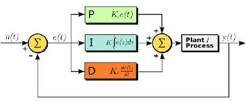
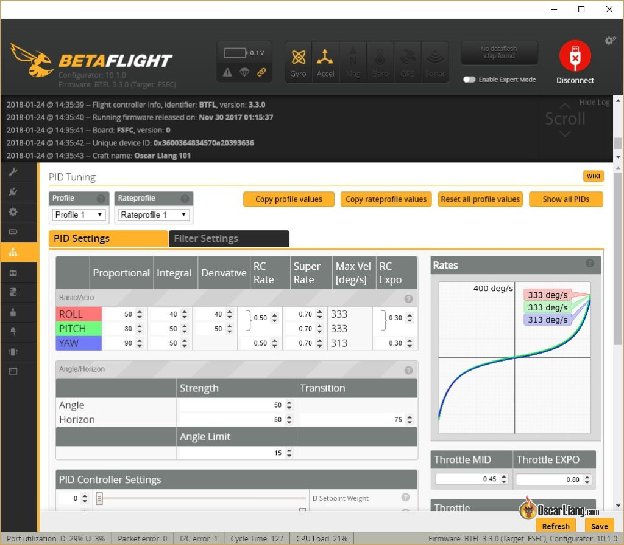
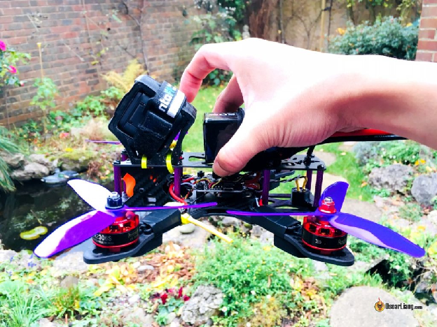

Стисле посилання на цей переклад: [https://bit.ly/LiangPIDExplained](https://bit.ly/LiangPIDExplained)   

| 🫂 | Нижче вичитаний людьми машнний український переклад оригіналу. Для [VictoryDrones](https://www.victory-drones.com/) переклад вичитав: Block(chain), Oleg. Хочете покращити переклад чи знайшли помилку? — Лишіть коментар (Ctrl+Alt+M або «Меню» \> «Вставка» \> «Коментар»). Ми теж живі люди (як і ви) і робим помилки. Роботи їх, до речі, також роблять 😉  |
| :---: | :---- |

# Принципи роботи ПІД-регулятора — читайте і вдосконалюйте польотні характеристики вашого FPV-дрона

# 8 вересня 2022 р

# 

# Розуміння того, як працює ПІД *\[прим. пер. [пропорційно-інтегрально-диференціальний](https://uk.wikipedia.org/wiki/%D0%9F%D1%80%D0%BE%D0%BF%D0%BE%D1%80%D1%86%D1%96%D0%B9%D0%BD%D0%BE-%D1%96%D0%BD%D1%82%D0%B5%D0%B3%D1%80%D0%B0%D0%BB%D1%8C%D0%BD%D0%BE-%D0%B4%D0%B8%D1%84%D0%B5%D1%80%D0%B5%D0%BD%D1%86%D1%96%D0%B0%D0%BB%D1%8C%D0%BD%D0%B8%D0%B9_%D0%B7%D0%B0%D0%BA%D0%BE%D0%BD_%D1%80%D0%B5%D0%B3%D1%83%D0%BB%D1%8E%D0%B2%D0%B0%D0%BD%D0%BD%D1%8F) регулятор, рідше — ПІД-контролер\],* є життєво-важливим аспектом розкриття справжнього потенціалу вашого FPV-дрона. У цьому посібнику ми зануримося у світ налаштуваннь ПІД, досліджуючи, як він впливає на характеристики польоту, стабільність і керованість вашого дрона. Дізнайтеся про тонкощі «П» *\[proportional — пропорційний\]*, «I» *\[integral — інтегральний\]* та «Д» *\[derivative — диференціальний*\], а також про те, як вони впливають на характеристики польоту вашого FPV-дрона. Ми також розповімо *\[вчительці\]* про те, коли потрібно повторно налаштувати параметри ПІД, і надамо уявлення про різні фактори, які впливають на налаштування.  *\[Також див. «[довгу перекладацьку нотатку](https://bit.ly/PID-regulator-for-beginners)» від пана Олега (котрий робив peer review цього документа.\]*

*Деякі посилання на цій сторінці є партнерськими. Я \[автор англомовної версії Оскар Ланг\] отримую комісію (без додаткових витрат для вас), якщо ви робите покупку після натискання одного із цих партнерських посилань. Це допомагає підтримувати безкоштовний контент для спільноти на цьому веб\-сайті. Будь ласка, прочитайте нашу [Політику партнерських посилань](https://oscarliang.com/affiliate-program-policy/) для отримання додаткової інформації.*

# Зміст

[Налаштування ПІД і пресети Betaflight](#налаштування-під-і-пресети-betaflight)

[Тонке мистецтво налаштування ПІД](#тонке-мистецтво-пінать-х..ї-налаштування-під)

[Розуміння ПІД-регулятора у дронах FPV](#розуміння-під-регулятора-у-дронах-fpv)

[Мета налаштування ПІД](#мета-налаштування-під)

[Вплив характеристик ПІД](#вплив-характеристик-під)

[Підсилення «Пропорційності» \[P Gain\]](#підсилення-«пропорційності»-[p-gain])

[Підсилення «Інтегральності» \[I Gain\]](#підсилення-«інтегральності»-[i-gain])

[Посилення «Диференційності» \[D Gain\]](#підсилення-«диференційності-—-прискорення»-[d-gain])

[Предиктивний зворотний зв’язок](#предиктивний-зворотний-зв’язок)

[Фактори, що впливають на оптимальний ПІД](#фактори,-що-впливають-на-оптимальний-під)

[Запобіжні заходи перед налаштуванням ПІД](#запобіжні-заходи-перед-налаштуванням-під)

[Спрощений процес налаштування](#спрощений-процес-налаштування)

[Пам’ятайте — не кожна проблема дрона пов’язана із ПІД-регулятором](#пам’ятайте-—-не-кожна-проблема-дрона-пов’язана-із-під-регулятором)

[Вібрація](#вібрація)

[Центр ваги](#центр-ваги)

[Розподіл маси та момент інерції](#розподіл-маси-та-момент-інерції)

[Коли повторно налаштовувати ПІД?](#коли-повторно-налаштовувати-під?)

[Висновки](#висновки)

[Історія редагування](#історія-редагування)

# 

## 

## **Налаштування ПІД і пресети Betaflight** {#налаштування-під-і-пресети-betaflight}

# Використання попередніх налаштувань (пресетів) [Betaflight](https://betaflight.com/docs/wiki/getting-started/introduction) *\[прим. пер.: найбільш поширена програма для конфігурування польотного контролера та усієї периферії до нього — [VTX](https://docs.google.com/document/d/1BBo-J2But_a2HEB3InJ_S4T_ukHyB0UbQlSXOKIWLq8/edit#heading=h.ijp1q1898aar), барометра, GPS, тощо; навіть [OSD](https://docs.google.com/document/d/1agIg1vNl00Ild9d2rpGXFOSA4As9Bmx7SeG-24SENhQ/edit) окулярів\]* може бути зручним варіантом та (іноді) може відразу дати результати. Особливо це актуально для початківців і тих, хто літає на п’ятидюймових «фрістайл» або гоночних квадріках. Пресети дозволяють тонші налаштування, ніж Betaflight Default (у більшості випадків), забезпечуючи хороші результати для більшості ситуацій. Вони добре підходять для пілотів, які віддають перевагу плавному та приємному польоту, і не люблять заглиблюватись у тонкощі налаштування ПІД. Якщо ви задоволені динамікою свого дрона і не відчуваєте потреби копати глибше — то дотримуючись попередніх налаштувань, ви можете заощадити час і зусилля. Дізнайтеся про пресети Betaflight тут: [https://oscarliang.com/betaflight-presets/](https://oscarliang.com/betaflight-presets/)

# Однак пресети не завжди працюють на всіх квадриках, оскільки кожен дрон різний. І коли ви виходите «за рамки» *\[прим. пер.: фігурально, тут вийшов каламбур, англ. «to venture beyond the realm» — це укр. «вийти за межі»\]* п’ятидюймових дронів або досліджуєте різні типи безпілотників, наприклад: «дальнобійні» чи більші або менші за 5-дюймові рами, ви можете зіткнутися з труднощами під час пошуку пресетів, які працюють оптимально. У таких випадках вам може знадобитися самостійно налаштувати ПІД. Знання того, як налаштувати ПІД, також дає змогу вирішувати конкретні проблеми, такі як «prop wash» *\[завихрення від пропелерів при різких стрибках потужності\]* або «перельоти» \[overshoots\] дрона при різких змінах напрямків руху, які не можуть вирішити пресети Betaflight.

## **Тонке мистецтво ~~пінать х..ї~~ налаштування ПІД** {#тонке-мистецтво-пінать-х..ї-налаштування-під}

# Щоб навчитися балансувати різні характеристики польоту для досягнення ідеального рішення із урахуванням вашого особистого стилю пілотування, потрібен час, терпіння та практика.

# Незалежно від того, чи хочете ви, аби ваш дрон був прудким без зайвих вібрацій або плавно відгукувався на рухи стіка пульта без відчуття млявості — секрет полягає у пошуці ідеального балансу.

# 

# *Сторінка регулювання ПІД в[Конфігуратор Betaflight](https://oscarliang.com/download-betaflight-configurator/)*

# На [початках](https://docs.google.com/document/d/1s8HQvVf-U5p9VgAwdJntzNnU-0315dTRQccxyLxsmsQ/edit) FPV-руху прошивка польотного контролера була менш досконалою, оскільки FPV-дрони погано працювали зі значеннями ПІД за замовчуванням. Це зробило налаштування ПІД-регулятора абсолютною необхідністю. Менш із тим, завдяки вдосконаленню фільтрації шуму та поступовій оптимізації алгоритмів у сучасному програмному забезпеченні польотного контролера, квадрокоптери тепер можуть досить добре літати і з налаштуваннями за замовчуванням.

# Хоча зазначені вдосконалення жодним чином не знецінюють важливість налаштування ПІД, вони зробили цей крок менш критичним для базового польоту. Але завжди є місце для вдосконалення, а отже індивідуальні побажання щодо керованості дрона та характеристик польоту мають свої нюанси. Освоєння налаштування ПІД дозволить вам перетворити дрон, який «добре літає», на дрон, який «літає ідеально» відповідно до вашого унікального стилю.

## **Розуміння ПІД-регулятора у дронах FPV** {#розуміння-під-регулятора-у-дронах-fpv}

# ПІД-регулятор є алгоритмом у межах [програмного забезпечення польотного контролера](https://oscarliang.com/fc-firmware/). Він зчитує дані з датчиків і обробляє команди пульта керування і розраховує необхідну швидкість моторів для досягнення бажаної частоти їх обертання.

# Є кілька ключових термінів, з якими ви повинні ознайомитися, перш ніж глибше заглиблюватися в цю статтю: **задане значення** *\[setpoint\]*, **відхилення від заданого значення** *\[error\],* **цикл керування** *\[control loop\]* та **час циклу** *\[looptime\]*.

# Бажана швидкість обертання називається «заданим значеням». «Відхилення від заданого значення» — це різниця між заданим значенням (як швидко ми хочемо, щоб дрон обертався) і вимірюваннями гіроскопічного датчика (як швидко дрон насправді обертається).

# Основна мета ПІД-регулятора в дроні FPV — виправити «похибку», регулюючи швидкість мотора. Цикл керування безперервно зчитує дані датчиків і розраховує швидкість двигуна, щоб мінімізувати помилку. Betaflight може виконувати до 8000 циклів керування в секунду (встановлюючи в програмному забезпеченні частоту циклу ПІД на 8 кГц).

# 

# *\[Прим. пер.: схема Оскара має суперечливий із точки зору логіки побудови діаграм момент, оскільки актуатор (мотор) є частиною квадрокоптера, відповідно — квадратик «Актуатор» це ESC \- електронний контроллер швидкості в квадрокоптері\]* Алгоритм ПІД є важливою частиною системи керування. У ПІД-регуляторі є три характеристики: пропорційна (P), інтегральна (I) і диференціальна (D).

1. # **P** (пропорційна) стосується поточного відхилення від бажаного. Чим більше відхилення, тим сильніше вона «натискає» *\[прим. пер.: «відхилення», а так само і її «натискання» не є чимось поганим. «Відхиленням» є різниця між сигналом з пульта і тим, що квадріку вдалось зробити в реальності \- за інформацією від гіроскопу\]* — математично кажучи, цей коефіцієнт множиться на похибку.

2. # **I** (інтегральна) накопичує та враховує минулі похибки. Ця характеристика враховує зовнішні сили, які накопичуються із часом, наприклад коли дрон відхиляється від заданого значення через вітер або погано відцентровану раму, регулюючи швидкість двигуна, щоб протидіяти цьому – математично кажучи, це інтеграл похибки \- або сумарна похибка за декілька вимірювань.

3. # **D** (диференціальна — *англ.: derivative,* це швидкість відхилення*)* передбачає майбутню помилку. PID-регулятор враховує, як швидко наближається до заданого значення, і нейтралізує P, щоб мінімізувати перевищення при наближенні до цілі – математично кажучи, це похідна похибки.

#  Користувачі можуть призначати коефіцієнт посилення для кожної характеристки. При цьому, більші коефіцієнти посилення збільшують вплив кожної із характеристик на загальні характеристики польоту. 

# Ці принципи застосовуються до будь-якої прошивки польотного контролера, яка використовує ПІД-регулятори, наприклад Betaflight, Ardupilot, KISS, iNAV, Cleanflight, EmuFlight, Baseflight, тощо.

## **Мета налаштування ПІД** {#мета-налаштування-під}

# Уявіть собі, що ви намагаєтесь закинути м’яч для гольфу у лунку (задане значення). Кожного разу, коли ви вдаряєте по м’ячу, він може перелітати або недолітати до цілі. Менш із тим, з кожною спробою він стає ближчим до неї *\[прим. пер.: якщо ви хоч трохи вправні у гольфі і не буцаєте м’яча намірено в інший бік. Українцям, імовірно, буде зрозуміліша аналогія із більярдом\].* Ви продовжуєте, доки м’яч не досягне лунки.

# Метою налаштування ПІД є досягнення ідеального удару, який якнайшвидше надішле м’яч до лунки. Якщо його правильно налаштувати, ваш дрон точно відстежуватиме свої рухи, забезпечуючи пряме та чуйне відчуття без «стрибків» і вібрацій.

# 

## **Вплив характеристик ПІД** {#вплив-характеристик-під}

# Налаштування підсилення ПІД впливає на поведінку квадрокоптера у польоті. Хоча розуміти внутрішню роботу ПІД не обов’язково, дуже важливо знати, як зміна цих характеристик впливає на продуктивність вашого дрона.

### **Підсилення «Пропорційності» \[P Gain\]** {#підсилення-«пропорційності»-[p-gain]}

# Підсилення «П» визначає інтенсивність, із якою польотний контролер працює над виправленням помилок. Вважайте підсилення «П» параметром чутливості. Високе підсилення «П» створює миттєвий відгук дрона, надаючи відчуття, ніби керованість вашого дрона зросла.

# Якщо підсилення «П» надто високе, квадрокоптер може мати надмірну корекцію руху, що призводить до різких «відскоків» під час сальто та акробатичних вправ. Надмірно високе підсилення «П» може навіть викликати вібрації та «стрибки». І навпаки, коли «П» підсилення занизьке, квадрокоптер є погано керованим та мляво реагує на сигнали управління.

### **Підсилення «Інтегральності» \[I Gain\]** {#підсилення-«інтегральності»-[i-gain]}

# Підсилення «І» визначає зусилля польотного контролера, щоб зберегти положення дрона під впливом зовнішніх сил, таких як вітер і погане центрування центру ваги *\[ЦВ, CG — center of gravity\].* Підсилення «I» можна сприймати як параметр «жорсткості», який впливає на те, наскільки добре квадрокоптер тримає своє положення. Збільшення підсилення «I» покращує відстеження заданих точок під час різких поворотів, але також і робить входження у поворот різкішим.

# Подібно до підсилення «П», надмірне підсилення «І» може спричинити відскоки та коливання, хоча й із помітно нижчою швидкістю (менш частотні). Якщо підсилення «І» занизьке, ваш дрон вібруватиме, «стрибатиме» та «клюватиме носом» під час швидкої зміни тяги *\[trottle\]*. Надзвичайно низьке підсилення «I» призводить до поганого утримання курсу під час вітру. У цьому разі дрон «мотилятиметься» у повітрі, вимаючи постійного втручання пілота для коригування.

### **Підсилення «Диференційності — прискорення» \[D Gain\]** {#підсилення-«диференційності-—-прискорення»-[d-gain]}

# Підсилення «Д» діє як демпфер (пом’якшувач) для підсилення «П», зменшуючи перельоти. Подібно до того, як амортизатор авто гасить «стрибки» підвіски, підсилення «Д» пом’якшує та протидіє коливанням, спричиненим надмірним підсиленням «П», і мінімізує завихрення від пропелерів при різких стрибках потужності *\[prop wash\]* — і пов’язане коливання дрону *.*

# Коли підсилення «Д» занизьке, квадрокоптер здійснюватиме значні «відскоки» після сальто та кренів і відчуватиме істотніший prop wash під час різкого зниження. 

# Збільшення підсилення «Д» може пом’якшити ці проблеми. Однак надмірне підсилення «Д» може посилити вібрацію та [шум](https://docs.google.com/document/d/1WqUJpFs8B8e2kKxk2i44gHb4YmBv7xc3Bbn4bZO3JXk/edit) у квадрокоптері, спричиняючи різкі коливання та перегрів моторів. Окрема публікація пояснює, чому надмірне посилення D може призвести до вібрації дрона: [https://oscarliang.com/excessive-d-gain-cause-oscillations-motor-overheat/](https://oscarliang.com/excessive-d-gain-cause-oscillations-motor-overheat/)

### **Предиктивний зворотний зв’язок** {#предиктивний-зворотний-зв’язок}

# [Підсилення «П»](#підсилення-«пропорційності»-[p-gain]) є основним інструментом контролю дрона, але воно часто недостатньо швидке, оскільки реагує лише на помилки, створюючи затримку між заданим значенням і гіроскопом.

# Предиктивний зворотний зв’язок *\[feedforward\]* має на меті зменшити цю затримку. По суті, польотний контролер спостерігає, як швидко ви рухаєте стік пульта, і допомагає почати реакцію дрона раніше, ще до того як надійдуть дані із гіроскопа. Це може значно покращити проходження заданих значень ([сетпоінтів](#bookmark=id.1qdlrhfmi7ye)). Однак встановлення надто високого рівня предиктивного зворотного зв’язку може призвести до відскоку дрона після виконання сальто та акробатичних вправ, подібно до ситуації, яка виникає у випадку надмірного посилення «П». \[Умовно, контроллер думатиме що відхилення буде великим, хоча насправді ви рухаєте стіком повільно і дрон встигає за вами\]

## **Фактори, що впливають на оптимальний ПІД** {#фактори,-що-впливають-на-оптимальний-під}

# Кожен квадрокоптер матиме унікальні оптимальні значення ПІД, на які впливають різні фактори, зокрема:

1. # Загальна вага та розподіл ваги.

2. # Співвідношення тяги до ваги.

3. # Крутний момент двигуна, як швидко він може мінятись.

4. # Вага та крок пропеллера, що впливає на реакцію двигуна.

#  Жодне налаштування ПІД не є універсально ідеальним. Наприклад, аварії можуть трохи пошкодити гвинти, рами або двигуни, змінюючи резонансну частоту *\[дрона\]* та оптимальні значення ПІД. Крім того, розміщення батареї може вплинути на розподіл маси. В ідеалі, ви маєте точно налаштувати параметри ПІД так, аби вони відповідали широкому діапазону ситуацій. *\[Але так ніхто не робить\]*

## **Запобіжні заходи перед налаштуванням ПІД** {#запобіжні-заходи-перед-налаштуванням-під}

# Перш ніж почати вносити будь-які зміни до налаштувань ПІД, виконайте наступні дії, аби забезпечити собі спокій у процесі налаштування:

1. # Здійсніть резервне копіювання ваших поточних значень ПІД. Це дозволить вам повернутися до попередніх налаштувань, якщо щось піде не так під час процесу налаштування. І вам буде з чим порівняти нові налаштування, якщо ви будете не впевнені в фінальному результаті\!

2. # Завжди налаштовуйте свій дрон в [режимі «Акро»](https://oscarliang.com/rate-acro-horizon-flight-mode-level/): це забезпечує точне налаштування без втручання від функцій автоматичного вирівнювання.

3. # Збалансуйте [центр ваги](#центр-ваги) (ЦВ) вашого квадрокоптера: правильний вибір ЦВ істотно впливає на ефективність польоту. Відрегулюйте розташування батареї, щоб перемістити ЦВ вперед або назад, доки він не опиниться там де треба *\[прим. пер.: по центру, кеп\].* 

# 

## **Спрощений процес налаштування** {#спрощений-процес-налаштування}

# Щоб отримати більш детальну інформацію, зверніться до мого посібника з налаштування FPV-дрона у 10 кроків без використання [Blackbox](https://oscarliang.com/blackbox/) :[https://oscarliang.com/fpv-drone-tuning/](https://oscarliang.com/fpv-drone-tuning/)

# Основна ідея цього спрощеного процесу налаштування полягає в тому, щоб знайти оптимальне співвідношення між підсиленнями «П», «І» та «Д». Цього можна досягти, виконавши такі кроки:

1. # Знайдіть хороший баланс між підсиленням «П» і «Д».

2. # Визначте правильне співвідношення між підсиленнями «П» і «I».

3. # Збільште всі підсилення ПІД.

#  Ви можете легко налаштувати ці параметри за допомогою повзунків у Betaflight, усуваючи потребу вводити числа вручну. Хоча ідеально налаштовувати значення ПІД за допомогою логів Blackbox, все ж можна досягти гідних результатів, уважно спостерігаючи за поведінкою вашого дрона в польоті через окуляри FPV і «слухаючи» звук моторів. Але якщо ви хочете максимально досконало налаштувати свій коптер, скористайтеся Blackbox: [https://oscarliang.com/PID-filter-tuning-blackbox/](https://oscarliang.com/pid-filter-tuning-blackbox/) 

## **Пам’ятайте — не кожна проблема дрона пов’язана із ПІД-регулятором** {#пам’ятайте-—-не-кожна-проблема-дрона-пов’язана-із-під-регулятором}

#  Хоча налаштування ПІД відіграє значну роль у продуктивності вашого квадрокоптера, важливо розуміти, що апаратні фактори також можуть впливати на це. Перш ніж шукати проблеми із продуктивністю у значеннях ПІД, перевірте наступні налаштування вашого дрона.

#### **Вібрація** {#вібрація}

# Не вся «желейність» камери дрона та вібрації викликані занадто високими коефіцієнтами ПІД. Дуже важливо усунути якомога більше джерел вібрації у вашому квадрокоптері перед налаштуванням ПІД. Фактори, що сприяють вібрації, включають справність моторів та пропеллерів, [правильне «м'яке» кріплення польотних контролерів](https://oscarliang.com/soft-mounting-fc-motors/)*\[впливає на гіроскопи\]*, і жорсткість самої рами.

#### **Центр ваги** {#центр-ваги}

# В ідеалі, центр ваги *ЦВ, англ.: CG — сenter of gravity\]* вашого квадрокоптера має знаходитися прямо посередині прямих ліній, якими можна з’єднати двигуни вашого квадрокоптера у горизонтальній площині, і якомога ближче до лінії пропеллерів у вертикальній площині. Погано центрований дрон змушує одні двигуни працювати інтенсивніше, ніж інші. Це негативно впливає на стабільність польоту.

#### **Розподіл маси та момент інерції** {#розподіл-маси-та-момент-інерції}

# FPV-дрони із відцентрованою масою зазвичай більш точні, прудкі та чуйні. Коли багато маси знаходиться вдалині від центру, потрібно більше тяги для обертання та для прискорення до бажаної швидкості. Через більшу кутову масу та інерцію зупинити обертання також стає складніше.

## **Коли повторно налаштовувати ПІД?** {#коли-повторно-налаштовувати-під?}

# Вносите зміни у свій дрон? Можливо, вам доведеться переглянути параметри ПІД. На налаштування ПІД можуть впливати різні фактори, як-от використання іншої батареї, додавання камери GoPro, використання інших моторів і пропелерів або навіть зовнішні фактори, такі як вітер, вологість і висота.

# По суті, щоразу, коли ви вносите значні зміни у свій квадрокоптер, має сенс перевірити та налаштувати значення ПІД.

## **Висновки** {#висновки}

# Опанування налаштування ПІД є важливою навичкою для будь-якого досвідченого ентузіаста безпілотників FPV, який прагне оптимізувати польотні характеристики свого квадрокоптера. Розуміючи тонкощі посилень P, I та D та їхній вплив на поведінку вашого дрона, ви можете налаштувати його чутливість відповідно до свого стилю польоту та вподобань. Не забудьте врахувати зміни апаратного забезпечення під час точного налаштування параметрів ПІД. Маючи ці знання у вас під рукою, тепер ви готові перетворити добре літаючий дрон на ідеально налаштовану машину, готову забезпечити неперевершений досвід польоту FPV. Щасливого польоту\!

### Історія редагування {#історія-редагування}

* # Жовтень 2013 — статтю створено.

* # Грудень 2015 — додано приклади того, як ПІД впливає на характеристики польоту в Cleanflight/Betaflight.

* # Січень 2018 — статтю оновлено до останньої версії мікропрограми Betaflight, спрощено розділ «Що таке налаштування ПІД» і об’єднано зі статтею «Мої порості поради із налаштування ПІД».

* # Лютий 2018 — додано інформацію про «задане значення» (setpoint).

* # Липень 2018 — додано аналогію про гольф.

* # Вересень 2022 — внесено зміни.

* # Березень 2023 — внесено зміни.

[image1]: 

[image2]: 

[image3]: 