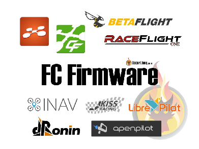

Стисле посилання на цей переклад: [https://bit.ly/LiangFCFirmwareFPV](https://bit.ly/LiangFCFirmwareFPV)   

| 🫂 | Нижче вичитаний людьми машинний український переклад оригіналу. Для [VictoryDrones](https://www.victory-drones.com/) переклад вичитали: Max Well, Faina\!. Хочете покращити переклад чи знайшли помилку? — Лишіть коментар (Ctrl+Alt+M або «Меню» \> «Вставка» \> «Коментар»). Ми теж живі люди (як і ви) і робимо помилки. Роботи їх, до речі, також роблять 😉 |
| :---: | :---- |

# **Огляд прошивок для польотного контролера FPV-дрона: Betaflight, iNav, Ardupilot**

21 лютого 2023 року  

Прошивка польотного контролера (FC) — це програмне забезпечення, яке працює на платі польотного контролера FPV-дрона. Різні типи прошивки FC пропонують різні рівні функціональності та параметри налаштування. Вибір правильної мікропрограми може значно вплинути на продуктивність і можливості вашого FPV-дрона, а також на вашу здатність точно налаштовувати та персоналізувати свій досвід польоту. Важливо дослідити та вибрати програмне забезпечення, яке відповідає вашим конкретним потребам і цілям як пілота дрона.

*Деякі посилання на цій сторінці є партнерськими. Я \[автор англомовної версії Оскар Ланг\] отримую комісію (без додаткових витрат для вас), якщо ви робите покупку після натискання одного із цих партнерських посилань. Це допомагає підтримувати безкоштовний контент для спільноти на цьому веб\-сайті. Будь ласка, прочитайте нашу [Політику партнерських посилань](https://oscarliang.com/affiliate-program-policy/) для отримання додаткової інформації.*

* # Зміст

[Що таке польотний контролер?](#що-таке-польотний-контролер?)

[Що таке прошивка польотного контролера?](#що-таке-прошивка-польотного-контролера?)

[Типи прошивок польотного контролера FC](#типи-прошивок-польотного-контролера)

[Betaflight](#betaflight)

[KISS](#kiss)

[Emuflight](#emuflight)

[INAV](#inav)

[ArduPilot](#ardupilot)

[Інші](#інші)

[Multiwii](#multiwii)

[Baseflight](#baseflight)

[Cleanflight](#cleanflight)

[Butterflight](#butterflight)

[OpenPilot](#openpilot)

[LibrePilot](#librepilot)

[TauLabs](#taulabs)

[dRonin](#dronin)

[FlightOne FalcoX](#flightone-falcox)

[Висновок](#висновок)

* 

## **Що таке польотний контролер?** {#що-таке-польотний-контролер?}

Польотний контролер (FC) — це електронний мозок FPV-дрона, який використовує сенсори та алгоритми для стабілізації та керування польотом. Він отримує дані від різних сенсорів дрона та регулює швидкість двигуна, щоб дрон залишався стабільним і літав за призначенням.

[Ви можете дізнатися більше про FC у цьому посібнику](https://docs.google.com/document/d/1s7mb_jh_BhAakZc2hOWfAFwnawWiF6Ri-H8KcVhk81Q/edit).

## **Що таке прошивка польотного контролера?** {#що-таке-прошивка-польотного-контролера?}

Прошивка польотного контролера – це програмне забезпечення, яке працює на польотному контролері та керує роботою FPV-дрона. Це впливає на характеристики та особливості польоту, а різні варіанти прошивки мають різні переваги та недоліки для різних стилів польоту та вподобань.

## **Типи прошивок польотного контролера** {#типи-прошивок-польотного-контролера}

Є багато варіантів прошивки польотного контролера, але більшість або застаріли, або не дуже популярні. Ось прошивки, якi, я вважаю, ви повинні знати на сьогодні.

Для фрістайлу та гонок:

* Betaflight  
* KISS  
* Emuflight

Для автономного польоту:

* INAV  
* Ardupilot

## **Betaflight** {#betaflight}

Betaflight — це прошивка з відкритим кодом, розроблена для мультироторів. Це, безперечно, найпопулярніший варіант мікропрограми польотного контролера для FPV-дронів. Betaflight забезпечує потужний і простий у використанні інтерфейс і широкий спектр функцій, включаючи налаштування PID, конфігурацію наекранного меню та розширені режими польоту. Він також підтримує найрізноманітніші апаратні конфігурації, включаючи польотні контролери F4, F7 і H7 від дюжини різних виробників. Betaflight постійно розвивається, з частими оновленнями, які додають нові функції та вдосконалення. Він має велику спільноту користувачів, які надають підтримку, діляться інформацією та роблять внесок у його розвиток.

Betaflight був створений на основі Cleanflight, щоб зосередитися на передових можливостях і продуктивності польоту, доступних для гоночних дронів, звідси і назва Betaflight. Протягом багатьох років Betaflight суттєво відрізнявся від Cleanflight і тепер вважається окремою прошивкою.

Якщо ви керуєте фрістайл або гоночними безпілотниками, на мій погляд, Betaflight є одним із найкращих, якщо не найкращим з точки зору продуктивності польоту. Це також чудовий варіант для далеких польотів завдяки нещодавно оптимізованому режиму GPS Rescue, який є основною функцією повернення до точки зльоту (додому). Я вважаю, що це чудовий вибір як для початківців, так і для досвідчених пілотів. Незважаючи на те, що багато опцій у Betaflight роблять його, можливо, одним із найгнучкіших і найпотужніших програм для польотів, він також складний для освоєння.

[Ось підручник, який допоможе вам почати роботу з Betaflight і як налаштувати його вперше](https://docs.google.com/document/d/18H97upBHChkt9AruNZvVQXdE_8POnIRUeMqBVZKmHns/edit).

## **KISS** {#kiss}

Прошивка KISS FC — це запатентована прошивка, розроблена компанією Flyduino. Відомий своїм простим і оптимізованим інтерфейсом, він популярний серед пілотів фрістайлу старої школи. KISS означає «Keep It Simple Stupid».

Загалом має добру репутацію серед власних користувачів і вважається простим у налаштуванні. Однак прошивка KISS обмежена з точки зору налаштування та не має деяких розширених функцій, наявних в інших прошивках, таких як Betaflight.

Початківцям я не рекомендую KISS як вашу першу прошивку, тому що може бути важче отримати допомогу, коли ви зіткнетеся з проблемами через набагато меншу базу користувачів. Незважаючи на те, що його легко налаштувати, йому не вистачає налаштувань та розширених функцій, які є в інших прошивках, таких як Betaflight.

Крім того, прошивка KISS розроблена спеціально для польотниx контролерiв від FETtec і Flyduino, вона не сумісна з будь-яким FC від інших виробників. KISS FC часто трохи дорожчий за інше порівнянне обладнання Betaflight через незалежну розробку виробників і німецьке виробництво. Можливо, ви також знайдете варіанти прошивки KISS під назвами KISS Ultra та FETtec Alpha, ці нові проекти, можливо, використовують переписані коди оригінальної KISS, але ключові функції ті самі.

Ви можете знайти польотні контролери KISS тут:

* Amazon:[https://amzn.to/3KOiMs9](https://amzn.to/3KOiMs9)  
* AliExpress:[https://s.click.aliexpress.com/e/\_DE8wisl](https://s.click.aliexpress.com/e/_DE8wisl)

## **Emuflight** {#emuflight}

Бренд Betaflight, не вдаючись у подробиці, Emuflight є результатом деяких розбіжностей між розробниками щодо фільтрації. За словами їхніх користувачів, Emuflight має унікальне відчуття стiку порівняно з іншими прошивками FC.

Оскільки він модифікований з Betaflight, він сумісний з усім обладнанням Betaflight. Іноді люди пробують Emuflight, коли не можуть змусити Betaflight працювати так, як їм хочеться. Якщо вам це не подобається, ви завжди можете повернутися до Betaflight.

## **INAV** {#inav}

INAV орієнтований на навігацію та автономний політ. Окрім мультироторів, INAV також можна використовувати для апаратів із нерухомим крилом і автомобілів з дистанційним керуванням. Він пропонує розширені функції GPS, такі як навігація за маршрутними точками, повернення додому та утримання висоти.

INAV — це прошивка з відкритим вихідним кодом, яка постійно оновлюється та вдосконалюється спільнотою розробників. Його спочатку було модифіковано з Cleanflight так само, як Betaflight, тому вони мають багато спільного, навіть конфігуратори здаються знайомими, тому користувачам Betaflight легше вибрати INAV.

Незважаючи на те, що INAV не такий популярний для фрістайлу або гоночних дронів, як Betaflight, він є популярним вибором для апаратів із нерухомим крилом дальньої дії та інших автономних застосувань.

Є деякі польотні контролери, розроблені спеціально для INAV, але він також підтримує деякі польотні контролери Betaflight.

Якщо ви хочете дізнатися більше про стилі польоту безпілотників/дронів, це безумовно варіант для вивчення.

* [iNav GitHub](https://github.com/iNavFlight/inav)

## **ArduPilot** {#ardupilot}

ArduPilot, мабуть, найпопулярніший набір програм для автопілота з відкритим кодом. Він підтримує різноманітні апарати, включаючи квадрокоптери, літаки, марсоходи, наземні транспортні засоби та навіть радіокеровані підводні човни.

ArduPilot відомий своїми широкими функціями та можливостями налаштування, що робить його хорошим вибором для досвідчених пілотів і розробників. Він підтримує як автономний, так і ручний режими керування, навігацію за маршрутними точками GPS і різні сенсори, такі як барометри та магнітометри. Але складність освоєння також є найвищою серед всіх зазначених варіантів. 

Однак Ardupilot не є популярним вибором для мультироторних перегонів або фрістайлу, оскільки йому бракує оптимізації продуктивності, сучасних функцій і найновішої підтримки протоколів.

## **Інші** {#інші}

Ці прошивки або застаріли, або не дуже популярні.

### **Multiwii** {#multiwii}

Multiwii була однією з перших популярних прошивок польотних контролерів в спільноті саморобних дронів і була випущена в 2010 році. Пізніше вона стала джерелом натхнення для багатьох популярних прошивок для FPV-дронів. Прошивка була створена за допомогою IMU від Nintendo Wii Nunchuck у поєднанні з платою Arduino, тому назва Multiwii (Multirotor, Wiimote).

Однак MultiWii не так активно розробляється, як деякі інші популярні варіанти прошивки, доступні сьогодні, останнє оновлення було в 2016 році.

### **Baseflight** {#baseflight}

Baseflight була однією з перших широко використовуваних 32-бітних прошивок FC, створених у 2012 році на основі 8-бітних прошивки польотного контролера Multiwii. Однак з 2014 року його розробка в основному зупинилася. Незважаючи на всі суперечки навколо автора програмного забезпечення, TimeCop, Baseflight внесла свій внесок в еволюцію програмного забезпечення FC, яке ми використовуємо сьогодні, і це варте уваги.

### **Cleanflight** {#cleanflight}

Cleanflight — це прошивка польотного контролера з відкритим вихідним кодом, розроблена Домініком Кліфтоном і спочатку заснована на Baseflight. Він був випущений у 2014 році та швидко став популярним у спільноті FPV-дронів.

Однак розробка Cleanflight сповільнилася після випуску Betaflight і INAV у 2015 році. З того часу багато пілотів перейшли на Betaflight завдяки його чудовій продуктивності, передовим функціям і більш активній розробці.

### **Butterflight** {#butterflight}

Butterflight — це бренд Betaflight, який має на меті привернути увагу до ефективності польоту FPV-дронів і передових функцій. Станом на 2018 рік основні відмінності між Butterflight і Betaflight полягають у програмній фільтрації сигналу гіроскопа та підтримці AKK VTX Smart Audio. Однак у 2019 році розробка зупинилася.

### **OpenPilot** {#openpilot}

OpenPilot був однією з перших розробок прошивки FC з відкритим вихідним кодом для мультироторів і вплинув на значний прогрес у варіантах прошивки керування польотом. У 2015 році він був припинений і замінений на LibrePilot. Однак код OpenPilot все ще заслуговує на увагу своїм впливом на розробку прошивки FC.

### **LibrePilot** {#librepilot}

LibrePilot є брендом OpenPilot і зосереджений на дослідженнях і розробках для використання в багатьох різних програмах, включаючи робототехніку. Хоча він не такий популярний у спільноті міні-квадрокоптерів, як інші варіанти прошивки, він має надійну команду розробників і залишається відкритим кодом. Хоча він не підтримує стільки апаратних пристроїв, як інші мікропрограми в цьому списку, він оновлюється та продовжує розвиватися.

### **TauLabs** {#taulabs}

TauLabs — ще один бренд OpenPilot, який зосереджений на дослідженнях і розробці автопілотів і БПЛА. Проект орієнтований на професіоналів, дослідників і студентів, пропонуючи платформу початкового рівня зі швидким і простим налаштуванням/конфігурацією для будь-якої групи, якій потрібні БПЛА для своїх досліджень. Хоча він має обмежену підтримку цільового апаратного забезпечення та меншу кількість прихильників у спільноті міні-квадрокоптерів, це чудове мікропрограмне забезпечення для експериментів для студентських проектів або інших інноваційних ідей, пов’язаних із сільським господарством, якістю повітря чи іншими додатками. Можливо, це не найкращий вибір для звичайних польотів на міні-квадрокоптерах, але він пропонує великий потенціал для спеціалізованого використання.

### **dRonin** {#dronin}

Останній, але не менш важливий у цьому списку dRonin, який походить від OpenPilot. Як випливає з назви, dRonin зосереджується в основному на FPV-гонках безпілотників. Команда розробників працює над покращенням гонок і акробатичних польотів, і вони регулярно оновлюють програмне забезпечення з відкритим кодом. Однією з видатних особливостей є режим автоматичного налаштування, який налаштовує параметри PID для вашої збірки міні-квадратора. Крім того, майстер налаштування/конфігурації швидкий і простий у використанні. Головним недоліком є ​​те, що він має обмежену підтримку польотних контролерів, але він підтримує складний список польотних контролерів з позитивними відгуками. Однак розробка зупинилася в 2019 році, як я востаннє перевіряв.

### **FlightOne FalcoX** {#flightone-falcox}

**Оновлення (грудень 2022): Ця компанія не має оновлень у своїх соціальних мережах уже пару років. Здається, вони все ще приймають замовлення на своєму сайті, але не виконують їх. На їх YouTube-каналі є коментарі про те, що деякі клієнти не отримували замовлення більше року. Рекомендується уникати цієї компанії до подальшого повідомлення.**

Спочатку названий Raceflight, FlightOne був розгалужений від Betaflight/Cleanflight. Однак код був повністю переписаний, і прошивка стала закритою. FlightOne добре відомий своїм останнім варіантом під назвою FalcoX, який надзвичайно простий у використанні, оскільки його можна повністю налаштувати з екранного меню, на відміну від Betaflight, для якого потрібен комп’ютер. FalcoX зосереджується на чистих гонках і акро польотах і орієнтується на польотні контролери F4. У той час як деякі найкращі пілоти віддають перевагу Betaflight через вищий рівень налаштування, FalcoX добре цінується за його пряме відчуття стіка та плавність. Однак, оскільки база користувачів не така велика, як Betaflight, може бути трохи складніше отримати допомогу в Інтернеті, а апаратне забезпечення є надзвичайно обмеженим.

## **Висновок** {#висновок}

Початківцям я настійно рекомендую почати з Betaflight в якості першої прошивки польотного контролера, оскільки вона має широкий вибір сумісного обладнання та велику спільноту, яка надає численні навчальні посібники та ресурси. Однак, якщо ви віддаєте перевагу автономному польоту, iNav може бути більш підходящим варіантом, який відносно легко освоїти.

**Історія редагування**

* Травень 2017 – стаття створена  
* Червень 2021 – оновлено  
* Березень 2023 – оновлена, скорочена URL-адреса

**КОМЕНТАРІ**

**ROBERT**

2 березня 2023 р. \- 13:03

Відсутня найкраща мікропрограма Whoop: Quicksilver (Bosshobby)  
[ВІДПОВІДЬ](https://oscarliang.com/fc-firmware/#comment-162665)  

[image1]: 